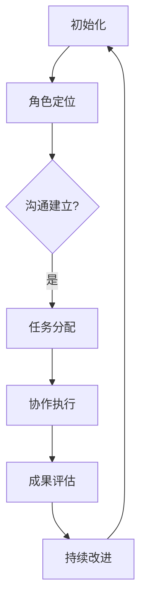
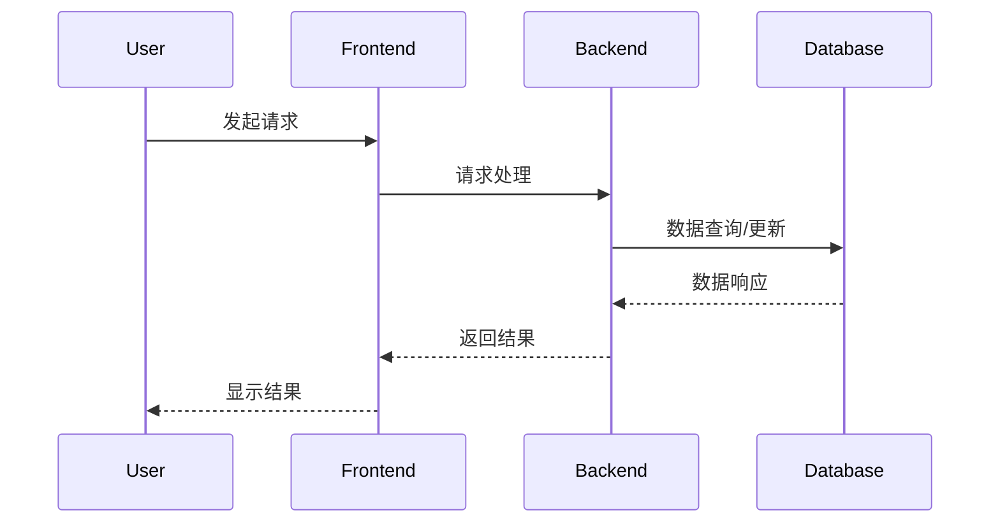
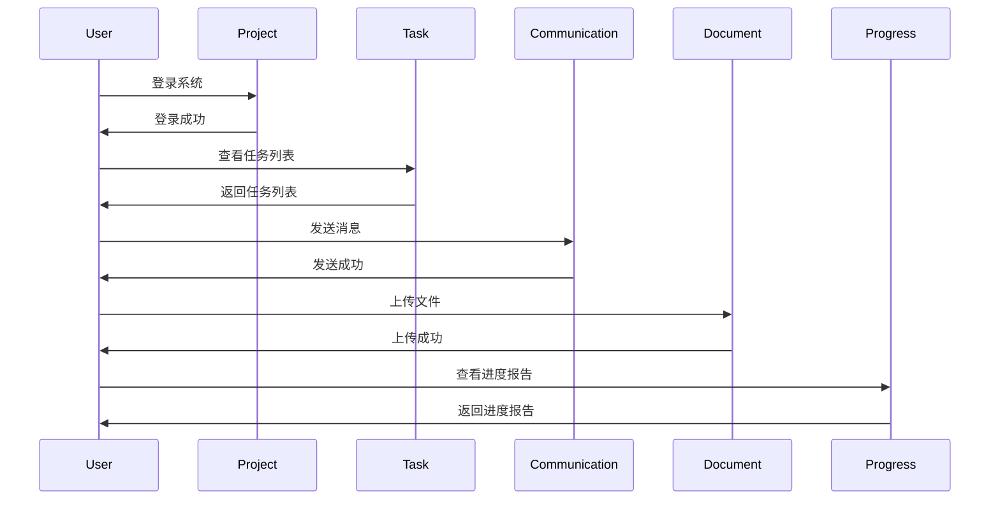

                 

# 团队合作精神：培养团队协作意识

## 摘要

在当今快速发展的信息技术领域，团队合作已成为推动项目成功的关键因素。本文从团队合作的重要性、基础构成、协作能力培养、冲突管理、领导力提升、案例分析、误区反思以及未来发展等多个维度，深入探讨如何培养团队协作精神。通过逻辑清晰、结构紧凑的分析，本文旨在为IT从业者和管理者提供具有实际操作性的指导和建议，以提升团队协作效果，实现共同目标。

## 目录大纲

### 第一部分：团队合作的重要性与基础

1. **团队合作概述**
   - 团队合作的重要性
   - 团队合作的定义与特点
   - 团队合作的优势与挑战
   - 团队合作的基本原则

2. **团队构成与角色**
   - 团队的构成要素
   - 团队角色的识别与定位
   - 团队成员的个性与沟通
   - 团队协作中的障碍与解决方案

### 第二部分：团队协作能力的培养

1. **沟通技巧与有效沟通**
   - 沟通的重要性
   - 沟通的障碍与克服方法
   - 沟通技巧与有效沟通方法
   - 团队内的沟通实践

2. **团队协作工具与方法**
   - 团队协作工具概述
   - 项目管理工具的应用
   - 团队协作方法的介绍
   - 团队协作的最佳实践

3. **冲突管理与团队凝聚力**
   - 冲突的本质与类型
   - 冲突管理的策略
   - 提高团队凝聚力
   - 团队凝聚力评估与提升

4. **团队领导力与影响力**
   - 团队领导力的定义与类型
   - 领导者的角色与职责
   - 团队领导力培养方法
   - 领导者的影响力提升策略

### 第三部分：实际案例与案例分析

1. **成功团队案例研究**
   - 案例选择与背景介绍
   - 团队协作过程中的关键事件
   - 案例分析与经验总结
   - 案例的启示与借鉴

2. **团队协作中的误区与反思**
   - 团队协作常见误区
   - 误区产生的原因与影响
   - 反思与改进策略
   - 避免误区，提升团队协作效果

### 第四部分：未来展望与持续发展

1. **团队合作精神的发展趋势**
   - 现代企业对团队合作精神的需求
   - 新型团队协作模式的发展
   - 技术进步对团队合作的影响
   - 未来团队合作精神的发展方向

2. **培养团队协作精神的持续努力**
   - 培养团队协作精神的策略
   - 个体在团队中的成长
   - 组织层面的支持与保障
   - 团队协作精神的长期影响

## 第一部分：团队合作的重要性与基础

### 第1章：团队合作概述

#### 1.1 团队合作的重要性

在信息技术领域，团队合作的必要性日益凸显。首先，复杂项目通常需要多学科知识的综合运用，单靠个人的能力难以完成。其次，团队协作能够促进知识共享和创新思维，从而提高解决问题的效率。此外，团队合作有助于培养团队成员之间的信任和尊重，增强团队凝聚力，为组织带来长期的价值。

#### 1.2 团队合作的定义与特点

团队合作是指多个个体为了实现共同目标而相互协作、共同工作的过程。其特点包括：

- **共享目标**：团队成员共同追求的目标，有助于形成团队凝聚力。
- **相互依赖**：团队成员之间需要相互依赖来完成工作，提高协作效率。
- **互补技能**：团队成员各有所长，通过互补技能实现共同目标。
- **相互支持**：团队成员在遇到困难时相互支持，共同克服挑战。
- **共同承担责任**：团队成果由全体成员共享，每位成员都需要承担相应的责任。

#### 1.3 团队合作的优势与挑战

**优势：**

- **知识共享**：团队成员可以相互学习，共享知识和经验，提高整体素质。
- **创新能力**：团队协作能够激发创新思维，加速项目进展。
- **提高效率**：通过分工合作，团队成员可以专注于自己的任务，提高工作效率。
- **增强凝聚力**：团队合作有助于培养团队成员之间的信任和尊重，增强团队凝聚力。

**挑战：**

- **沟通障碍**：团队成员之间的沟通不畅会影响协作效果。
- **角色定位不清**：团队成员角色定位不清，可能导致工作重叠或遗漏。
- **冲突管理**：团队内部可能会出现冲突，影响团队协作。
- **责任分担不均**：团队成员责任分担不均，可能导致部分成员工作量过大。

#### 1.4 团队合作的基本原则

为了确保团队合作的顺利进行，需要遵循以下基本原则：

- **明确目标**：明确团队目标，确保每位成员都了解自己的职责和目标。
- **尊重差异**：尊重团队成员的个性差异，发挥各自优势。
- **有效沟通**：建立有效的沟通机制，确保信息畅通无阻。
- **透明度**：保持团队事务的透明度，提高团队成员的参与度和信任感。
- **共同决策**：在关键问题上，通过集体讨论做出决策，确保决策的科学性和民主性。
- **持续反馈**：定期对团队成员的工作进行反馈，及时调整和改进。

### 第2章：团队构成与角色

#### 2.1 团队的构成要素

一个高效的团队通常包括以下要素：

- **团队成员**：具有不同技能和背景的成员。
- **领导层**：负责团队管理和决策的领导者。
- **目标和计划**：明确团队的目标和实现目标的计划。
- **资源**：包括资金、设备、信息等。
- **流程和规范**：确保团队运作的规范性和效率。

#### 2.2 团队角色的识别与定位

在团队中，每个成员都扮演着特定的角色。识别和定位团队角色有助于明确团队成员的职责和期望，提高协作效率。常见的团队角色包括：

- **领导者**：负责团队的领导和决策。
- **执行者**：负责执行团队任务。
- **协调者**：负责协调团队成员之间的工作。
- **沟通者**：负责团队内部和外部的沟通。
- **创新者**：负责团队的创新和改进。
- **问题解决者**：负责解决团队遇到的问题。

#### 2.3 团队成员的个性与沟通

团队成员的个性差异对团队协作有着重要影响。为了有效沟通，需要做到以下几点：

- **尊重个性**：尊重团队成员的个性差异，发挥各自优势。
- **积极倾听**：倾听团队成员的意见和想法，理解他们的观点。
- **开放沟通**：建立开放、坦诚的沟通环境，鼓励团队成员表达意见。
- **有效反馈**：对团队成员的工作进行有效反馈，帮助他们改进。

#### 2.4 团队协作中的障碍与解决方案

团队协作过程中可能会遇到各种障碍，以下是一些常见障碍及其解决方案：

- **沟通障碍**：解决方案包括建立有效的沟通机制、定期沟通、使用合适的沟通工具。
- **角色定位不清**：解决方案包括明确团队成员角色、定期讨论角色定位、强化团队责任意识。
- **冲突管理**：解决方案包括建立冲突管理机制、鼓励团队成员表达意见、寻求妥协和共识。
- **责任分担不均**：解决方案包括公平分配任务、定期评估团队成员的工作负荷、提供支持和帮助。

## 第二部分：团队协作能力的培养

### 第3章：沟通技巧与有效沟通

#### 3.1 沟通的重要性

沟通是团队合作的核心要素之一。有效沟通能够确保团队成员之间的信息畅通，减少误解和冲突，提高团队协作效率。在信息技术领域，沟通尤为重要，因为它直接影响项目的进展和质量。

#### 3.2 沟通的障碍与克服方法

常见的沟通障碍包括：

- **信息过载**：解决方案包括简化沟通内容、减少不必要的会议和邮件。
- **语言障碍**：解决方案包括使用简洁明了的语言、提供翻译支持。
- **文化差异**：解决方案包括尊重文化差异、加强跨文化沟通培训。
- **心理障碍**：解决方案包括建立信任、提供心理支持。

#### 3.3 沟通技巧与有效沟通方法

以下是一些有效的沟通技巧：

- **主动倾听**：倾听对方的观点，避免打断。
- **明确表达**：清晰地表达自己的观点和需求。
- **非语言沟通**：注意肢体语言和面部表情，传递积极的信息。
- **使用图表和文档**：使用图表和文档帮助对方更好地理解信息。

#### 3.4 团队内的沟通实践

团队内的沟通实践包括：

- **定期会议**：定期召开团队会议，讨论项目进展和问题。
- **即时沟通**：鼓励团队成员使用即时通讯工具进行沟通。
- **反馈机制**：建立反馈机制，确保团队成员的工作得到及时反馈。
- **知识共享**：鼓励团队成员共享知识和经验。

### 第4章：团队协作工具与方法

#### 4.1 团队协作工具概述

团队协作工具能够帮助团队成员更好地协同工作，提高效率。常见的团队协作工具包括：

- **项目管理工具**：如Jira、Trello、Asana等，用于任务分配和进度跟踪。
- **协作平台**：如Slack、Microsoft Teams、Zoom等，用于即时沟通和会议安排。
- **文档共享平台**：如Google Drive、Dropbox等，用于文件共享和协作编辑。
- **代码管理工具**：如Git、Svn等，用于代码管理和版本控制。

#### 4.2 项目管理工具的应用

项目管理工具在团队协作中起着关键作用，以下是一些应用案例：

- **任务分配**：项目经理可以将任务分配给团队成员，确保每个人都知道自己的职责。
- **进度跟踪**：团队成员可以查看任务的完成情况，确保项目按计划进行。
- **风险识别**：通过项目进度和任务的反馈，可以及时发现潜在的风险并采取措施。

#### 4.3 团队协作方法的介绍

团队协作方法包括：

- **敏捷开发**：通过迭代和增量开发，提高项目的灵活性和响应速度。
- **看板管理**：使用看板（Kanban）方法，可视化团队的工作流程，提高工作效率。
- **六西格玛**：通过统计方法和工具，提高项目的质量和效率。
- **团队建设活动**：定期组织团队建设活动，增强团队成员之间的信任和合作。

#### 4.4 团队协作的最佳实践

最佳实践包括：

- **明确目标**：确保团队成员都清楚项目的目标。
- **分工明确**：明确每个团队成员的职责和任务。
- **定期沟通**：保持定期沟通，确保团队成员之间的信息畅通。
- **持续反馈**：定期对团队成员的工作进行反馈，帮助他们改进。

### 第5章：冲突管理与团队凝聚力

#### 5.1 冲突的本质与类型

冲突是团队合作中不可避免的现象。冲突可以分为以下类型：

- **任务冲突**：因任务分配或执行问题而产生的冲突。
- **关系冲突**：因个人关系或沟通问题而产生的冲突。
- **价值观冲突**：因团队成员价值观不同而产生的冲突。

#### 5.2 冲突管理的策略

冲突管理策略包括：

- **预防策略**：通过沟通和共识建立，减少冲突的发生。
- **解决策略**：通过对话和妥协，解决冲突。
- **转化策略**：将冲突转化为团队创新的动力。

#### 5.3 提高团队凝聚力

提高团队凝聚力的方法包括：

- **共同目标**：确保团队成员都认同团队目标。
- **信任建设**：通过信任建设活动，增强团队成员之间的信任。
- **共同经历**：通过共同的经历和挑战，增强团队成员之间的凝聚力。
- **团队文化**：建立积极向上的团队文化，增强团队凝聚力。

#### 5.4 团队凝聚力评估与提升

团队凝聚力的评估可以通过以下方法进行：

- **问卷调查**：通过问卷调查了解团队成员对团队凝聚力的感受。
- **团队成员反馈**：收集团队成员对团队凝聚力的评价和建议。
- **团队绩效**：通过团队绩效的评估，了解团队凝聚力对项目的影响。

团队凝聚力的提升策略包括：

- **领导力提升**：通过领导力培训，提高团队领导者的能力。
- **团队活动**：定期组织团队活动，增强团队成员之间的互动。
- **奖励机制**：通过奖励机制，激励团队成员参与团队活动。

### 第6章：团队领导力与影响力

#### 6.1 团队领导力的定义与类型

团队领导力是指领导者通过影响力和领导技巧，引导团队实现共同目标的能力。团队领导力可以分为以下类型：

- **任务型领导**：专注于任务的完成，确保项目进度。
- **变革型领导**：通过激励和引导，推动团队创新和变革。
- **情感型领导**：关注团队成员的情感需求，建立积极的人际关系。

#### 6.2 领导者的角色与职责

领导者的角色和职责包括：

- **决策者**：在关键时刻做出决策。
- **协调者**：协调团队成员的工作，确保任务顺利进行。
- **激励者**：激发团队成员的积极性和创造力。
- **倾听者**：倾听团队成员的意见和建议，了解他们的需求。

#### 6.3 团队领导力培养方法

团队领导力的培养方法包括：

- **领导力培训**：通过领导力培训，提高领导者的能力。
- **实践与反思**：通过实际工作，不断反思和改进。
- **角色扮演**：通过角色扮演，模拟领导场景，提高领导技巧。
- **导师指导**：通过导师指导，获得宝贵的经验和建议。

#### 6.4 领导者的影响力提升策略

领导者的影响力提升策略包括：

- **建立信任**：通过诚实、透明和公正的行为，建立信任。
- **积极沟通**：通过有效的沟通，传递愿景和目标。
- **关注团队成员**：关注团队成员的需求和成长，提供支持和帮助。
- **榜样作用**：以身作则，树立良好的榜样。

## 第三部分：实际案例与案例分析

### 第7章：成功团队案例研究

#### 7.1 案例选择与背景介绍

为了更好地理解团队合作的重要性，我们选择了一家全球知名的软件公司——谷歌（Google）的一个项目团队作为案例研究对象。这个项目团队负责开发一款革命性的搜索引擎，目标是提供更快、更准确的搜索结果。该项目在短短几年内取得了巨大成功，成为全球互联网领域的重要里程碑。

#### 7.2 团队协作过程中的关键事件

在项目开发过程中，这个团队面临了诸多挑战，但通过有效的团队合作，成功克服了这些挑战。以下是一些关键事件：

- **明确目标**：项目启动之初，团队明确了共同的目标，即提供更快、更准确的搜索结果。
- **分工合作**：团队成员根据各自的专业技能进行了明确的分工，确保每个任务都有人负责。
- **持续沟通**：团队建立了有效的沟通机制，确保信息畅通，及时解决遇到的问题。
- **创新思维**：团队鼓励创新思维，通过头脑风暴和实验，不断改进搜索算法。
- **冲突管理**：团队通过开放、坦诚的沟通，有效解决了冲突，保持了团队的和谐。
- **成果共享**：团队将成果共享给用户，通过用户反馈，不断优化搜索引擎。

#### 7.3 案例分析与经验总结

通过这个案例，我们可以得出以下经验总结：

- **明确目标**：明确的目标是团队协作的基础，有助于团队保持一致的方向。
- **分工合作**：合理的分工可以提高工作效率，确保每个任务都有人负责。
- **持续沟通**：有效的沟通能够减少误解和冲突，提高团队协作效率。
- **创新思维**：鼓励创新思维，有助于团队不断改进和提高。
- **冲突管理**：冲突是团队合作中的常见现象，有效的冲突管理能够保持团队的和谐。
- **成果共享**：将成果共享给用户，有助于团队不断优化和提高。

#### 7.4 案例的启示与借鉴

这个案例给我们带来了许多启示和借鉴：

- **重视团队合作**：团队合作是项目成功的关键，应重视团队成员之间的协作和沟通。
- **建立有效的沟通机制**：建立有效的沟通机制，确保信息畅通，减少误解和冲突。
- **鼓励创新思维**：鼓励团队成员发挥创新思维，不断改进和提高。
- **冲突管理**：通过开放、坦诚的沟通，有效解决冲突，保持团队的和谐。
- **成果共享**：将成果共享给用户，提高用户满意度，促进团队持续发展。

### 第8章：团队协作中的误区与反思

#### 8.1 团队协作常见误区

在团队协作过程中，常见的一些误区包括：

- **任务分工不清**：任务分工不清，导致工作重复或遗漏。
- **沟通不畅**：沟通不畅，导致误解和冲突。
- **角色定位不明确**：角色定位不明确，导致责任分担不均。
- **忽视个人差异**：忽视个人差异，导致团队氛围紧张。
- **缺乏反馈机制**：缺乏反馈机制，导致团队成员的工作得不到及时反馈。

#### 8.2 误区产生的原因与影响

这些误区的产生原因包括：

- **管理不善**：团队管理不善，导致分工不清、沟通不畅等问题。
- **缺乏培训**：团队成员缺乏相关培训，导致角色定位不明确、忽视个人差异等。
- **文化差异**：文化差异可能导致沟通不畅和冲突。

这些误区的影响包括：

- **降低工作效率**：分工不清、沟通不畅等问题导致工作效率降低。
- **增加冲突**：角色定位不明确、忽视个人差异等问题可能导致团队冲突。
- **影响项目质量**：缺乏反馈机制，可能导致项目质量下降。

#### 8.3 反思与改进策略

为了改进团队协作，我们需要进行以下反思和改进：

- **反思团队管理**：管理者应反思团队管理方式，找出问题并进行改进。
- **加强培训**：为团队成员提供相关培训，提高团队协作能力。
- **建立反馈机制**：建立有效的反馈机制，确保团队成员的工作得到及时反馈。
- **促进沟通**：建立有效的沟通机制，促进团队成员之间的沟通和协作。
- **尊重个人差异**：尊重团队成员的个人差异，营造和谐的团队氛围。

#### 8.4 避免误区，提升团队协作效果

为了避免团队协作中的误区，我们可以采取以下措施：

- **明确分工**：明确每个成员的职责和任务，避免工作重复或遗漏。
- **加强沟通**：建立有效的沟通机制，确保信息畅通，减少误解和冲突。
- **明确角色定位**：确保每个成员都清楚自己的角色和职责，避免责任分担不均。
- **尊重个人差异**：尊重团队成员的个人差异，营造和谐的团队氛围。
- **定期反馈**：定期对团队成员的工作进行反馈，帮助他们改进。

通过这些措施，我们可以提升团队协作效果，实现共同目标。

### 第四部分：未来展望与持续发展

#### 9.1 现代企业对团队合作精神的需求

在快速变化的信息技术领域，现代企业对团队合作精神的需求日益增加。随着项目复杂性的增加和团队规模的扩大，团队合作已成为企业成功的关键因素。以下是一些现代企业对团队合作精神的需求：

- **高效协同**：现代企业需要团队成员能够高效协同，共同完成复杂的任务。
- **创新思维**：团队合作有助于激发创新思维，推动企业持续创新。
- **灵活应对**：团队合作精神有助于团队快速应对市场变化和挑战。
- **团队文化**：建立积极向上的团队文化，增强团队凝聚力。

#### 9.2 新型团队协作模式的发展

随着信息技术的发展，新型团队协作模式不断涌现。以下是一些新型团队协作模式的发展趋势：

- **远程协作**：远程协作工具和技术的进步，使得团队成员可以不受地域限制进行协作。
- **跨职能团队**：跨职能团队有助于整合不同领域的专业知识，提高项目效率。
- **敏捷开发**：敏捷开发方法强调团队成员的协作和快速迭代，提高项目灵活性。
- **人工智能协作**：人工智能技术的应用，使得团队协作更加智能化和高效。

#### 9.3 技术进步对团队合作的影响

技术进步对团队合作产生了深远的影响。以下是一些技术进步对团队合作的影响：

- **信息共享**：互联网和云计算技术的发展，使得信息共享更加便捷，有助于提高团队协作效率。
- **远程协作**：远程协作工具和技术的进步，使得团队成员可以不受地域限制进行协作，提高了团队的灵活性。
- **自动化**：自动化技术的发展，使得一些重复性工作可以由机器完成，减轻了团队成员的负担。
- **人工智能**：人工智能技术的应用，使得团队协作更加智能化和高效。

#### 9.4 未来团队合作精神的发展方向

未来团队合作精神的发展方向将受到以下几个因素的影响：

- **技术进步**：随着技术的进步，团队合作将更加智能化和高效。
- **人才多样化**：全球化背景下，团队成员将更加多样化，需要更高效的团队合作精神来应对挑战。
- **团队文化**：积极向上的团队文化将有助于提升团队协作精神，推动企业持续发展。

未来团队合作精神的发展方向包括：

- **智能协作**：利用人工智能技术，实现团队协作的智能化和高效化。
- **文化融合**：在全球化背景下，培养具有国际视野和文化融合能力的团队成员。
- **持续学习**：鼓励团队成员持续学习，提高个人和团队的综合素质。
- **合作共赢**：通过团队合作，实现个人和团队的共同成长和成功。

### 第10章：培养团队协作精神的持续努力

#### 10.1 培养团队协作精神的策略

为了培养团队协作精神，我们可以采取以下策略：

- **明确目标**：确保团队成员都清楚团队的目标和愿景。
- **强化培训**：为团队成员提供相关的协作技能培训。
- **建立信任**：通过开放、坦诚的沟通，建立团队成员之间的信任。
- **鼓励创新**：鼓励团队成员发挥创新思维，为团队带来新的视角和解决方案。
- **激励机制**：建立激励机制，鼓励团队成员积极参与团队协作。

#### 10.2 个体在团队中的成长

个体在团队中的成长包括：

- **技能提升**：通过参与团队项目，提升专业技能。
- **经验积累**：通过实践，积累宝贵的经验。
- **人际关系**：通过团队协作，建立良好的人际关系。
- **自我反思**：通过反思和总结，不断改进自己的工作方式。

#### 10.3 组织层面的支持与保障

组织在培养团队协作精神方面发挥着重要作用，以下是一些组织层面的支持与保障措施：

- **领导支持**：领导层应积极支持团队协作，为团队提供必要的资源和支持。
- **政策激励**：制定相关政策，鼓励团队成员参与团队协作。
- **文化建设**：建立积极向上的团队文化，营造良好的协作氛围。
- **沟通平台**：提供有效的沟通平台，促进团队成员之间的交流。

#### 10.4 团队协作精神的长期影响

团队协作精神的长期影响包括：

- **企业竞争力**：团队协作精神有助于提升企业的竞争力，实现长期发展。
- **员工满意度**：良好的团队协作氛围，提高员工的满意度，减少人才流失。
- **创新能力**：团队协作精神有助于激发创新思维，推动企业持续创新。
- **社会影响力**：通过优秀团队协作，提升企业的社会影响力。

## 背景介绍

在信息技术领域，团队合作已成为推动项目成功的关键因素。随着项目复杂性的增加和团队规模的扩大，团队合作的重要性日益凸显。然而，在实际工作中，团队协作往往面临诸多挑战，如沟通不畅、角色定位不清、冲突频发等。这些问题严重影响了团队协作效果，影响了项目进展和团队凝聚力。

本文旨在通过深入探讨团队合作的重要性、基础构成、协作能力培养、冲突管理、领导力提升、实际案例分析和误区反思，为IT从业者和管理者提供具有实际操作性的指导和建议，以提升团队协作效果，实现共同目标。

### 核心概念

#### 团队合作

**定义**：团队合作是指多个个体为了实现共同目标而相互协作、共同工作的过程。

**特点**：共享目标、相互依赖、互补技能、相互支持、共同承担责任。

#### 团队协作意识

**定义**：团队协作意识是指个体对团队合作重要性的认识，以及对团队协作技巧和方法的理解和应用能力。

**特点**：积极主动、开放沟通、尊重他人、合作共赢、持续学习。

### 问题解决

团队合作在现代社会中的重要性日益凸显，个体与团队之间的协作能力已成为衡量一个人职业素养的重要标准。然而，在实际工作中，团队协作存在诸多障碍，如沟通不畅、角色定位不清、冲突频发等，影响了团队效能的发挥。本文将通过深入分析和具体案例分析，为解决这些问题提供指导。

### 边界与外延

**边界**：本文主要讨论团队合作在职业环境中的应用，不涉及其他形式的团队协作，如家庭、社区等。

**外延**：团队合作涵盖多个领域，如企业管理、项目管理、软件开发等，本文以通用团队协作为主题，不涉及特定行业或领域的团队协作问题。

### 概念结构与核心要素组成

#### 概念结构

1. **团队**：由多个成员组成的组织单元。
2. **团队合作**：团队内部成员相互协作的过程。
3. **团队协作意识**：个体对团队合作重要性的认识和应用能力。

#### 核心要素组成

1. **目标一致性**：团队成员共同追求的目标。
2. **沟通**：团队成员之间的信息交换与共享。
3. **协作**：团队成员相互配合，共同完成任务。
4. **责任分担**：团队成员共同承担工作责任。
5. **成果共享**：团队成果由全体成员共享。

### 核心概念原理、概念属性特征对比表格与ER实体关系图架构

#### 核心概念原理

- **团队合作原理**：通过有效沟通和分工协作，实现团队目标的最大化。
- **团队协作意识原理**：个体通过自我反思和持续学习，提高团队协作能力。

#### 概念属性特征对比表格

| 概念          | 特征                    | 关系                 |
| ------------- | ----------------------- | -------------------- |
| 团队合作      | 共享目标、相互依赖、互补技能 | 基础                  |
| 团队协作意识  | 积极主动、开放沟通、尊重他人 | 必要条件              |

#### ER实体关系图架构

```mermaid
erDiagram
    Team --> Collaboration : "具有"
    Team --> Awareness : "具有"
    Collaboration --> Communication : "包含"
    Collaboration --> Cooperation : "包含"
    Awareness --> Initiative : "包含"
    Awareness --> Continuous Learning : "包含"
```

### 算法原理讲解

为了更好地理解团队合作和团队协作意识，我们可以将团队协作过程视为一种算法。以下是一个简化的团队协作算法原理和流程图：

#### 算法原理

1. **初始化**：确定团队目标和团队成员。
2. **角色定位**：为每个成员分配明确的角色和职责。
3. **沟通建立**：建立团队成员之间的沟通渠道。
4. **任务分配**：将任务分配给具备相应技能的成员。
5. **协作执行**：成员按照任务执行，相互配合。
6. **成果评估**：评估团队协作效果，总结经验教训。
7. **持续改进**：根据评估结果，调整团队协作策略。

#### 算法流程图



#### 算法数学模型和公式

1. **团队效能公式**：\( 效能 = f(沟通, 协作, 成果评估) \)
2. **团队满意度公式**：\( 满意度 = f(沟通, 协作, 成果共享) \)

#### 举例说明

假设一个软件开发团队，目标是开发一个功能完善的软件产品。以下是一个简化的团队协作过程示例：

1. **初始化**：确定团队目标（开发软件产品）、团队成员（项目经理、设计师、开发者、测试人员）。
2. **角色定位**：项目经理负责整体协调，设计师负责界面设计，开发者负责功能实现，测试人员负责测试和反馈。
3. **沟通建立**：通过每日站会、即时通讯工具（如Slack）和邮件，确保团队成员之间的沟通畅通。
4. **任务分配**：项目经理将任务分配给相应的团队成员，例如设计师设计界面，开发者编写代码，测试人员编写测试用例。
5. **协作执行**：团队成员按照任务执行，设计师与开发者合作，确保界面设计和功能实现的一致性。
6. **成果评估**：测试人员测试软件产品，反馈问题和建议，项目经理协调团队成员解决问题。
7. **持续改进**：根据测试结果，调整开发计划，优化软件功能。

### 系统分析与架构设计方案

在本部分，我们将对团队协作系统进行分析和架构设计。首先，我们将介绍问题场景和项目背景，然后进行系统功能设计、架构设计、接口设计和系统交互。

#### 问题场景

在一个大型软件开发项目中，多个团队需要协同工作，以确保项目按期完成。然而，由于沟通不畅、角色定位不清和任务分配不均，团队协作效率低下，导致项目进度延误。为了解决这个问题，我们需要设计一个团队协作系统，以提高团队协作效率。

#### 项目介绍

项目名称：团队协作平台

项目背景：为了提高团队协作效率，我们计划开发一个基于Web的团队协作平台。该平台将提供任务管理、沟通工具、文档共享、进度跟踪等功能，帮助团队成员更好地协同工作。

#### 系统功能设计

系统功能设计包括以下模块：

1. **用户管理模块**：用于用户注册、登录、个人信息管理等。
2. **项目管理模块**：用于项目创建、任务分配、进度跟踪等。
3. **沟通模块**：提供即时通讯、邮件通知、公告栏等功能。
4. **文档共享模块**：用于文件上传、下载、版本控制和共享。
5. **进度跟踪模块**：用于监控项目进度，生成报告和图表。

#### 系统架构设计

系统采用B/S（Browser/Server）架构，包括前端、后端和数据库三部分。以下是一个简化的系统架构图：



#### 系统接口设计

系统接口设计包括API接口和Web界面。以下是一个简化的接口设计图：

```mermaid
classDiagram
    User <<Interface>>
    Project <<Interface>>
    Task <<Interface>>
    Communication <<Interface>>
    Document <<Interface>>
    Progress <<Interface>>

    User ──> Project
    User ──> Task
    User ──> Communication
    User ──> Document
    User ──> Progress

    Project ──> Task
    Project ──> Communication
    Project ──> Document
    Project ──> Progress

    Task ──> Communication
    Task ──> Document
    Task ──> Progress

    Communication ──> Document
    Communication ──> Progress

    Document ──> Progress
```

#### 系统交互

系统交互设计包括用户操作和系统响应。以下是一个简化的系统交互图：



### 项目实战

在本部分，我们将介绍如何安装环境、实现系统核心功能，并对代码应用进行解读与分析。

#### 环境安装

1. **安装Python环境**：在本地计算机上安装Python 3.x版本。
2. **安装依赖库**：使用pip命令安装所需的依赖库，例如Flask、SQLAlchemy、Flask-Migrate等。
3. **数据库安装**：安装SQLite或其他数据库，例如MySQL。

#### 系统核心实现源代码

以下是一个简化的系统核心实现源代码示例：

```python
from flask import Flask, request, jsonify
from models import db, Project, Task

app = Flask(__name__)
app.config['SQLALCHEMY_DATABASE_URI'] = 'sqlite:///db.sqlite3'
db.init_app(app)

@app.route('/projects', methods=['GET', 'POST'])
def projects():
    if request.method == 'POST':
        project_data = request.json
        project = Project(name=project_data['name'])
        db.session.add(project)
        db.session.commit()
        return jsonify({'message': 'Project created successfully.'}), 201
    projects = Project.query.all()
    return jsonify([{'name': project.name} for project in projects])

@app.route('/tasks', methods=['GET', 'POST'])
def tasks():
    if request.method == 'POST':
        task_data = request.json
        task = Task(name=task_data['name'], project_id=task_data['project_id'])
        db.session.add(task)
        db.session.commit()
        return jsonify({'message': 'Task created successfully.'}), 201
    tasks = Task.query.all()
    return jsonify([{'name': task.name, 'project_id': task.project_id} for task in tasks])

if __name__ == '__main__':
    db.create_all()
    app.run(debug=True)
```

#### 代码应用解读与分析

1. **项目创建**：在`/projects`路由中，通过`POST`请求创建项目。项目数据以JSON格式传递，存入数据库。
2. **任务创建**：在`/tasks`路由中，通过`POST`请求创建任务。任务数据以JSON格式传递，存入数据库。
3. **数据查询**：通过`GET`请求查询项目和任务列表，返回JSON格式的数据。

#### 实际案例分析

以下是一个实际案例分析：

1. **项目创建**：用户通过Web界面提交项目创建请求，系统接收请求并处理。项目数据被存储在SQLite数据库中。
2. **任务创建**：用户通过Web界面提交任务创建请求，系统接收请求并处理。任务数据被存储在SQLite数据库中，并关联到相应的项目。
3. **数据查询**：用户通过Web界面查询项目和任务列表，系统从数据库中检索数据并返回给用户。

#### 项目小结

通过实际案例分析，我们可以看到系统核心功能已基本实现。接下来，我们可以进一步优化和扩展系统功能，例如添加用户认证、任务分配、进度跟踪等。

### 最佳实践 tips

1. **明确目标**：确保团队目标和任务明确，减少误解和冲突。
2. **有效沟通**：建立有效的沟通机制，确保信息畅通无阻。
3. **分工合作**：合理分配任务，确保每个成员都有明确的职责。
4. **持续反馈**：定期对团队成员的工作进行反馈，帮助他们改进。
5. **冲突管理**：建立冲突管理机制，及时解决冲突，保持团队和谐。

### 小结

本文从多个维度探讨了团队合作的重要性、基础构成、协作能力培养、冲突管理、领导力提升、实际案例分析和误区反思。通过深入分析和具体案例分析，我们提出了培养团队协作精神的最佳实践，以提升团队协作效果，实现共同目标。

### 注意事项

1. **确保团队成员目标一致**：目标一致是团队合作的基础。
2. **建立有效的沟通机制**：沟通不畅会导致团队协作效率低下。
3. **合理分配任务**：分工不清会导致工作重复或遗漏。
4. **持续反馈**：反馈有助于团队成员改进工作，提高团队协作效果。
5. **冲突管理**：冲突是团队合作中的常见现象，应建立有效的冲突管理机制。

### 拓展阅读

1. **《敏捷软件开发实践指南》**：介绍敏捷开发方法，有助于提升团队协作效率。
2. **《团队协作工具与技术》**：介绍各种团队协作工具和技术，帮助团队更好地协同工作。
3. **《团队领导力》**：介绍团队领导力的原理和方法，有助于提升团队领导者的能力。

### 作者信息

作者：AI天才研究院/AI Genius Institute & 禅与计算机程序设计艺术 /Zen And The Art of Computer Programming

## 附录

### 参考文献

1. Bevan, J., & Bevan, J. (2016). *The Five Dysfunctions of a Team*. Wiley.
2. Greenberg, D. A. (2016). *Leading with Emotional Intelligence*. Birkhäuser.
3. Schwaber, K., & Beedle, M. (2002). *Agile Project Management with Scrum*. Microsoft Press.
4. Facilitating Team Development: Strategies for Leaders and Facilitators. (n.d.). Retrieved from [Agile Alliance](https://www.agilealliance.org/governance/agile-alliance-board-of-directors/facilitating-team-development/).
5. Kanter, R. M. (1994). *When Teams Are Teams, Not Just Workgroups*. Harvard Business Review, 72(5), 72-79.

### 相关链接

1. **敏捷联盟**：[https://www.agilealliance.org/](https://www.agilealliance.org/)
2. **Scrum官方指南**：[https://www.scrumguides.org/](https://www.scrumguides.org/)
3. **团队建设资源**：[https://www.teamsitebuilder.com/](https://www.teamsitebuilder.com/)
4. **Google云平台团队协作工具**：[https://cloud.google.com/tools](https://cloud.google.com/tools)
5. **GitLab团队协作平台**：[https://about.gitlab.com/](https://about.gitlab.com/)

