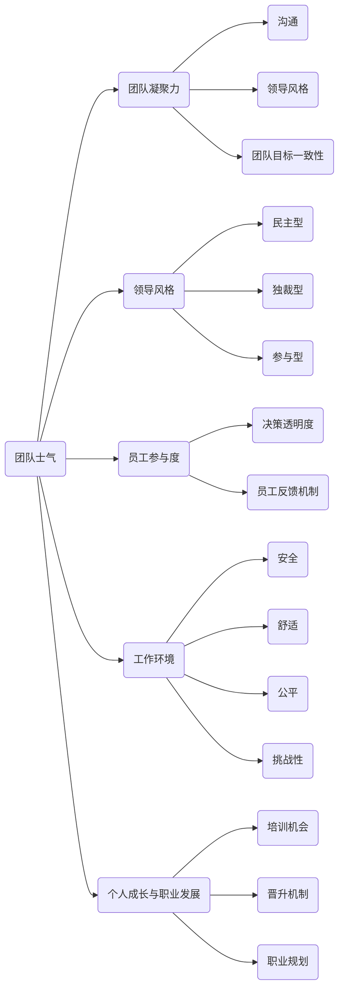

                 

# 团队士气管理：保持高昂斗志的秘诀

> 关键词：团队士气、员工满意度、领导力、团队建设、员工激励

> 摘要：本文将探讨团队士气管理的重要性，分析影响团队士气的主要因素，并提供一系列实用的策略来提升团队士气，保持团队成员的高昂斗志。通过深入分析，我们希望能够帮助IT行业的领导者们构建一个积极向上的团队氛围。

## 引言

团队士气，即团队的整体心理状态和士气水平，是决定团队绩效和组织成功的关键因素。在IT行业，团队成员的高昂斗志和积极态度能够显著提升工作效率和创新力。然而，随着市场竞争的加剧和工作压力的增加，团队士气往往受到挑战。因此，有效的团队士气管理成为企业领导者必须关注的重要课题。

本文将从以下几个方面展开讨论：

1. **团队士气的定义与重要性**
2. **团队士气的核心概念与影响因素**
3. **评估团队士气的方法与工具**
4. **提升团队士气的基本策略**
5. **应对团队士气挑战的具体措施**
6. **成功案例分析**
7. **最佳实践与未来趋势**

## 一、团队士气的定义与重要性

### 团队士气是什么？

团队士气，简单来说，是团队成员在心理上的积极状态和士气水平。这种士气水平受到多种因素的影响，包括团队内部的沟通、领导力、工作环境、任务难度以及个人成长和满足感等。

### 团队士气的重要性

1. **提高工作效率**：团队士气高涨时，成员们往往能够更加专注和投入工作，从而提高工作效率。
2. **增强团队合作**：高昂的士气有助于团队成员之间的合作，减少内部冲突，提升团队凝聚力。
3. **促进创新**：积极向上的团队氛围能够激发成员的创新思维，促进新产品的开发和技术的创新。
4. **降低离职率**：良好的团队士气能够提高员工的满意度和忠诚度，从而降低离职率。
5. **提升企业竞争力**：团队士气的高昂不仅能够提高内部绩效，还能增强企业在市场中的竞争力。

### 团队士气与员工满意度的关系

团队士气与员工满意度密切相关。当员工感到被重视、被认可和被支持时，他们的满意度会提高，从而提高团队士气。反之，如果员工感到压力过大、缺乏沟通和反馈，他们的满意度会下降，进而影响团队士气。

### 团队士气对组织成功的影响

团队士气不仅影响团队内部的绩效，还对组织的整体成功至关重要。一个士气高涨的团队能够更有效地应对外部挑战，抓住市场机遇，从而实现组织的长期目标。

## 二、团队士气的核心概念与影响因素

### 核心概念

1. **团队凝聚力**：团队凝聚力是指团队成员之间相互吸引、相互信任和支持的程度。高凝聚力的团队往往具有更高的士气。
2. **领导风格**：领导风格对团队士气有着直接的影响。民主型领导风格能够鼓励团队成员的参与和自主性，提高士气；而独裁型领导风格可能导致员工士气低落。
3. **员工参与度**：员工参与度是指员工在决策过程中被听取和参与的程度。高参与度的员工通常对工作更有热情，士气更高。
4. **工作环境**：舒适、安全、公平和有挑战性的工作环境能够提升员工士气。
5. **个人成长与职业发展**：当员工感到在工作中能够不断成长和获得职业发展时，他们的士气会更高。

### 影响因素

1. **工作压力**：过大的工作压力会导致员工士气低落。适度的挑战可以激励员工，但过度的压力则会造成负面情绪。
2. **沟通与反馈**：有效的沟通和及时的反馈能够提高员工的士气和满意度。
3. **团队支持**：团队成员之间的支持和帮助可以提升士气，增强团队合作。
4. **工作与生活的平衡**：当员工能够平衡工作和生活时，他们的士气通常会更高。

### 核心概念对比表格

| 核心概念 | 定义 | 影响因素 |  
| --- | --- | --- |  
| 团队凝聚力 | 成员间的相互吸引力、信任和支持 | 沟通、领导风格、团队目标一致性 |  
| 领导风格 | 领导者对团队的管理方式 | 民主型、独裁型、参与型 |  
| 员工参与度 | 员工在决策过程中的参与程度 | 决策透明度、员工反馈机制 |  
| 工作环境 | 工作场所的条件和氛围 | 安全、舒适、公平、挑战性 |  
| 个人成长与职业发展 | 员工在职业上的成长和进步 | 培训机会、晋升机制、职业规划 |

### ER实体关系图

## 三、评估团队士气的方法与工具

### 常见的评估方法

1. **问卷调查**：通过设计问卷，收集团队成员对士气现状的主观评价。
2. **面谈**：与团队成员进行一对一或小组访谈，了解他们的感受和意见。
3. **工作绩效评估**：通过观察和衡量团队的工作绩效来间接评估士气水平。
4. **员工满意度调查**：评估员工对工作环境、领导力、工作压力等方面的满意度。

### 常用的评估工具

1. **员工满意度量表**：如满意度和不满意度的评分，以及具体问题的满意度评分。
2. **团队氛围调查问卷**：评估团队成员之间的沟通、信任、合作等方面的氛围。
3. **工作压力评估工具**：如工作压力量表，评估员工感受到的工作压力水平。
4. **员工心理健康评估工具**：如心理健康量表，评估员工的情绪和心理状态。

### 评估方法的优缺点

| 评估方法 | 优点 | 缺点 |  
| --- | --- | --- |  
| 问卷调查 | 可量化、覆盖面广、成本低 | 主观性较强、数据解释难度大 |  
| 面谈 | 了解深层问题、获得详细反馈 | 耗时较长、成本较高、易受主观影响 |  
| 工作绩效评估 | 客观、数据直观 | 不能直接反映士气问题、易受绩效指标影响 |  
| 员工满意度调查 | 可量化、易于操作 | 主观性较强、可能存在偏差 |

### 实际应用案例

在某IT公司，为了了解团队士气状况，采用了问卷调查和员工满意度调查相结合的方法。通过问卷调查，公司获取了团队成员对工作环境、领导力、沟通等方面的直接反馈；通过员工满意度调查，公司了解到了员工的总体满意度和具体问题。根据这些数据，公司制定了针对性的改进措施，如增加团队建设活动、改善工作环境、优化领导风格等，从而显著提升了团队士气。

## 四、提升团队士气的基本策略

### 1. 沟通

有效的沟通是提升团队士气的关键。领导者应确保信息透明，及时传达公司政策、市场动态和团队目标。此外，鼓励团队成员之间的开放沟通，建立信任和互相尊重的关系。

### 2. 认可和奖励

认可和奖励是激励团队成员的重要手段。领导者应定期表扬员工的成绩，提供奖励和晋升机会，让员工感受到自己的价值和贡献。

### 3. 团队建设活动

定期组织团队建设活动，如团建旅行、聚餐、体育竞赛等，可以增强团队成员之间的联系和信任，提升团队凝聚力。

### 4. 员工培训和发展

提供员工培训和发展机会，帮助员工提升技能和职业素养，增强他们的自信心和士气。

### 5. 工作与生活平衡

关注员工的工作与生活平衡，提供灵活的工作时间和远程工作选项，减轻员工的工作压力。

### 6. 透明的工作流程

建立透明的工作流程和决策机制，让员工参与到公司的决策过程中，提高他们的参与度和满意度。

### 7. 关注员工心理健康

提供心理咨询服务，关注员工的情绪和心理状态，帮助他们应对工作和生活中的压力。

### 案例分析

在某互联网公司，通过实施上述策略，成功提升了团队士气。公司定期组织团队建设活动，如年度团建和季度聚餐，增强了团队成员之间的互动和信任。同时，公司鼓励员工提出建议和意见，建立了透明的工作流程和反馈机制。此外，公司还提供了灵活的工作时间和远程工作选项，关注员工的工作与生活平衡。这些措施显著提升了员工的工作满意度和士气，公司的整体绩效也得到了显著提升。

## 五、应对团队士气挑战的具体措施

### 1. 工作压力

- **增加资源**：为团队成员提供足够的资源，减少工作压力。
- **时间管理**：帮助团队成员学习时间管理技巧，合理安排工作。

### 2. 内部冲突

- **建立冲突解决机制**：提供冲突解决的渠道和工具，帮助团队成员解决分歧。
- **培训和沟通**：通过培训和沟通，提高团队成员的冲突解决能力。

### 3. 工作环境问题

- **改善工作环境**：关注员工的工作环境，确保其舒适和安全。
- **员工反馈**：定期收集员工的反馈，及时解决工作环境问题。

### 4. 员工心理健康问题

- **提供心理支持**：建立心理支持系统，为员工提供心理咨询服务。
- **员工关怀**：关注员工的身心健康，提供健康检查和健康讲座。

### 案例分析

在某IT企业，由于项目进度紧张，团队成员面临较大的工作压力。公司采取了以下措施：

1. **增加资源**：为团队成员分配更多助手，减轻他们的工作量。
2. **时间管理培训**：组织时间管理培训，帮助员工提高工作效率。
3. **建立冲突解决机制**：设立专门的冲突解决小组，帮助团队成员解决工作中的矛盾。
4. **改善工作环境**：为员工提供更舒适的办公环境，如调整座位布局、增加休息区等。

通过这些措施，公司成功缓解了团队成员的工作压力和内部冲突，团队士气显著提升，项目的完成质量也得到了保障。

## 六、成功案例分析

### 案例一：谷歌的团队士气管理

谷歌以其独特的团队士气管理著称。公司通过以下措施保持了团队的高昂士气：

1. **开放的文化**：谷歌提倡开放和自由的办公环境，鼓励员工提出创意和建议。
2. **员工福利**：提供丰富的员工福利，如免费餐食、健身中心、心理咨询等。
3. **员工参与**：谷歌定期组织员工参与决策过程，提高他们的参与度和满意度。
4. **持续培训**：为员工提供丰富的培训机会，帮助他们不断提升技能。

这些措施有效地提升了谷歌的团队士气，使得公司在技术创新和市场竞争中保持领先地位。

### 案例二：微软的团队士气管理

微软在团队士气管理方面也有着丰富的经验。公司采取以下策略来提升团队士气：

1. **灵活的工作制度**：微软提供了灵活的工作时间和远程工作选项，帮助员工平衡工作和生活。
2. **绩效奖励**：公司设立了多种绩效奖励制度，如年终奖、季度奖等，激励员工发挥潜力。
3. **团队建设活动**：定期组织团队建设活动，如团建旅行、团队聚餐等，增强团队凝聚力。
4. **员工关怀**：关注员工的身心健康，提供心理支持和健康检查。

通过这些措施，微软成功保持了团队的高昂士气，成为全球最成功的IT企业之一。

### 案例分析总结

从谷歌和微软的案例中可以看出，成功的团队士气管理离不开以下几个方面：

1. **开放的文化**：鼓励员工自由表达意见和创意，建立信任和尊重的团队氛围。
2. **员工参与**：提高员工的参与度和满意度，让他们在决策过程中发挥重要作用。
3. **绩效奖励**：通过绩效奖励制度激励员工，提高他们的工作积极性和士气。
4. **员工福利**：提供丰富的员工福利，关注员工的身心健康和职业发展。
5. **团队建设活动**：定期组织团队建设活动，增强团队凝聚力和士气。

## 七、最佳实践与未来趋势

### 最佳实践

1. **建立明确的团队目标**：确保团队成员对团队目标有清晰的认识，提高工作积极性和凝聚力。
2. **强化沟通与反馈**：定期组织团队会议和反馈机制，促进团队成员之间的沟通和理解。
3. **提供持续的学习和成长机会**：为员工提供培训和发展机会，帮助他们提升技能和职业素养。
4. **关注员工心理健康**：建立心理支持系统，关注员工的情绪和心理状态，提供必要的心理咨询服务。

### 未来趋势

1. **数字化工具的应用**：随着技术的发展，数字化工具如在线协作平台、虚拟现实（VR）团建活动等将成为提升团队士气的重要手段。
2. **个性化激励**：未来的团队士气管理将更加注重个性化激励，根据员工的个性和需求提供定制化的奖励和福利。
3. **持续的文化建设**：团队士气管理将更加注重长期的文化建设，通过核心价值观的传承和创新，提升团队的整体士气。

## 结语

团队士气管理是提升团队绩效和组织成功的关键。通过有效的沟通、认可和奖励、团队建设活动等措施，领导者可以显著提升团队士气，保持团队成员的高昂斗志。本文探讨了团队士气管理的重要性和核心概念，分析了评估和提升团队士气的方法，并通过成功案例分析提供了实用策略。未来，随着技术的进步和文化建设的深入，团队士气管理将面临新的机遇和挑战。

### 作者信息

作者：AI天才研究院/AI Genius Institute & 禅与计算机程序设计艺术 /Zen And The Art of Computer Programming

本文旨在通过逻辑清晰、结构紧凑、简单易懂的专业技术语言，帮助IT行业的领导者们构建一个积极向上的团队氛围，提升团队绩效和组织成功。希望本文能为团队士气管理提供有价值的参考和指导。

## 附录

### 1. 常用术语解释

- **团队士气**：团队的整体心理状态和士气水平。
- **团队凝聚力**：团队成员之间的相互吸引、信任和支持程度。
- **领导风格**：领导者对团队的管理方式。
- **员工参与度**：员工在决策过程中的参与程度。
- **工作环境**：工作场所的条件和氛围。
- **个人成长与职业发展**：员工在职业上的成长和进步。

### 2. 拓展阅读

- **《团队心理学》**：[作者：J. Richard Hackman]
- **《团队士气：如何提升团队绩效》**：[作者：John P. Kotter]
- **《领导力：如何激发团队士气》**：[作者：John C. Maxwell]
- **《数字化时代团队管理》**：[作者：Gary Hamel]

通过阅读这些书籍，读者可以深入了解团队士气管理的理论和实践，进一步提升自己的团队管理能力。

