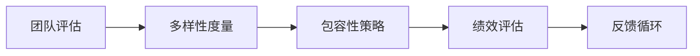

                 

# 引言：团队多样性管理与包容性工作环境

## 1.1 问题背景与重要性

在当今快速发展的技术时代，IT行业正经历着前所未有的变革。团队多样性已经成为提高组织竞争力、创新能力和工作绩效的关键因素。然而，如何有效管理团队多样性并创造包容性工作环境，仍然是一个复杂且具有挑战性的问题。

### 1.1.1 工作环境中的多样性挑战

团队多样性指的是团队内成员在性别、年龄、文化背景、技能水平等方面的差异。这些多样性因素可以为团队带来不同的视角和思维方式，从而促进创新和问题解决。然而，多样性也可能带来沟通障碍、冲突和成员之间的不信任。

首先，多样性可能导致沟通障碍。团队成员来自不同的文化背景和语言环境，这可能会导致误解和沟通不畅。其次，多样性也可能引发冲突。当团队成员具有不同的价值观和信仰时，可能会产生分歧和冲突，影响团队的工作效率和氛围。最后，多样性可能引发成员之间的不信任。团队成员可能会怀疑其他成员的能力和意图，从而导致合作受阻。

### 1.1.2 包容性工作环境的概念与意义

包容性工作环境是指一个能够接纳、尊重和欣赏团队成员多样性的工作场所。在这种环境中，每个成员都能感受到自己的价值和贡献，并且能够自由地表达自己的观点和想法。

包容性工作环境的重要性在于它能够促进团队协作和创新。首先，包容性工作环境能够提高团队成员的参与度和积极性，因为他们知道自己的观点和贡献会被重视。其次，包容性工作环境能够促进知识共享和协作，因为团队成员愿意分享自己的知识和经验。最后，包容性工作环境能够激发创新思维，因为不同背景和经验的成员可以相互启发和激发新的想法。

## 1.2 核心概念与关系

为了深入探讨团队多样性管理和包容性工作环境的构建，我们需要明确几个核心概念，并了解它们之间的关系。

### 1.2.1 核心概念介绍

#### 1.2.1.1 多样性

多样性是指团队内成员在性别、年龄、文化背景、技能水平等方面的差异。多样性可以带来不同的视角、经验和思维方式，有助于团队的创新和问题解决。

#### 1.2.1.2 包容性

包容性是指在一个工作环境中，尊重、接纳和欣赏团队成员的多样性。包容性工作环境能够促进团队协作、知识共享和创新。

#### 1.2.1.3 工作绩效

工作绩效是指团队在完成任务和实现目标方面的表现。团队多样性和包容性工作环境能够显著提高工作绩效。

### 1.2.2 关系图

为了更好地理解这些核心概念之间的关系，我们可以使用Mermaid ER图来表示。

```mermaid
ERDiagram
Diversity --> inclusiveness : affects
Diversity --> performance : influences
inclusiveness --> performance : promotes
```

在上面的ER图中，多样性（Diversity）对包容性（inclusiveness）和工作绩效（performance）都有影响。包容性工作环境能够促进工作绩效，而多样性是影响包容性的关键因素。

## 1.3 算法设计与解释

在了解了核心概念和它们之间的关系之后，我们需要设计一个算法来管理团队多样性并创造包容性工作环境。这个算法将包括多样性度量、包容性策略和绩效评估三个主要步骤。

### 1.3.1 算法设计原则

#### 1.3.1.1 多样性度量

多样性度量是指评估团队多样性的方法。我们可以使用多个维度来度量多样性，例如性别、年龄、文化背景和技能水平。

#### 1.3.1.2 包容性策略

包容性策略是指如何在团队中建立包容性工作环境的方法。这包括沟通策略、冲突解决策略和文化建设策略。

#### 1.3.1.3 绩效评估

绩效评估是指评估团队工作绩效的方法。这可以包括定量评估（例如任务完成情况）和定性评估（例如团队合作和员工满意度）。

### 1.3.2 Mermaid流程图

为了更好地展示算法的流程，我们可以使用Mermaid流程图来表示。



### 1.3.3 Python代码实现

下面是一个简单的Python代码示例，用于实现多样性度量。

```python
import numpy as np

# 团队成员数据
team_members = [
    {'name': 'Alice', 'age': 25, 'gender': 'F'},
    {'name': 'Bob', 'age': 30, 'gender': 'M'},
    {'name': 'Charlie', 'age': 28, 'gender': 'M'},
    {'name': 'David', 'age': 22, 'gender': 'M'}
]

# 多样性度量
def diversity度量(team_members):
    # 年龄多样性
    ages = [member['age'] for member in team_members]
    age_diversity = np.std(ages)
    
    # 性别多样性
    genders = [member['gender'] for member in team_members]
    gender_diversity = np.std(genders)
    
    return age_diversity, gender_diversity

# 测试多样性度量
age_diversity, gender_diversity = diversity度量(team_members)
print(f"Age diversity: {age_diversity}")
print(f"Gender diversity: {gender_diversity}")
```

通过这个代码示例，我们可以计算团队在年龄和性别方面的多样性度量。

## 1.4 数学模型与公式

在团队多样性管理中，数学模型和公式可以用来量化多样性、包容性和绩效之间的关系。以下是一些相关的数学模型和公式。

### 1.4.1 多样性度量

多样性度量可以使用标准差（Standard Deviation）来表示。标准差越大，表示多样性越高。

$$
\sigma = \sqrt{\frac{1}{N}\sum_{i=1}^{N}(x_i - \mu)^2}
$$

其中，$N$ 表示团队成员数量，$x_i$ 表示第 $i$ 个成员的某个特征值（例如年龄或性别），$\mu$ 表示所有成员的特征值的平均值。

### 1.4.2 包容性指数

包容性指数可以用来评估团队是否具有包容性。我们可以使用以下公式来计算包容性指数。

$$
Inclusiveness = \frac{Diversity \times Collaboration}{Conflict}
$$

其中，$Diversity$ 表示多样性度量，$Collaboration$ 表示团队合作程度，$Conflict$ 表示冲突程度。

### 1.4.3 绩效评估

绩效评估可以使用以下公式来计算团队的工作绩效。

$$
Performance = f(Diversity, Inclusiveness, Resources)
$$

其中，$Diversity$ 表示多样性度量，$Inclusiveness$ 表示包容性指数，$Resources$ 表示团队可用的资源和能力。

通过这些数学模型和公式，我们可以更好地理解团队多样性、包容性和绩效之间的关系，并为团队多样性管理提供量化的依据。

## 1.5 系统分析与设计

在了解了团队多样性管理的基本概念和算法之后，我们需要设计一个系统来支持这一过程。以下是一个简单的系统分析与设计。

### 1.5.1 问题场景介绍

在一个大型IT公司中，团队多样性管理成为一个关键问题。公司希望通过有效的多样性管理和包容性工作环境来提高团队绩效和创新能力。

### 1.5.2 项目介绍

项目名称：团队多样性管理系统（Team Diversity Management System，TDMS）

项目目标：设计并实现一个系统，用于评估团队的多样性、包容性和绩效，并提供相应的改进建议。

### 1.5.3 系统功能设计

系统功能设计包括以下几个方面：

1. **多样性度量**：系统应能够收集团队成员的多样性数据，并计算出多样性度量。
2. **包容性策略**：系统应能够推荐包容性策略，以改善团队的工作环境和团队合作。
3. **绩效评估**：系统应能够评估团队的工作绩效，并提供改进建议。
4. **数据可视化**：系统应能够将多样性度量、包容性指数和工作绩效以图表的形式展示给用户。

### 1.5.4 系统架构设计

系统架构设计如下：

1. **前端**：使用Vue.js框架开发一个用户友好的界面，用于展示多样性度量、包容性指数和工作绩效。
2. **后端**：使用Spring Boot框架开发一个RESTful API，用于处理多样性度量、包容性策略和绩效评估。
3. **数据库**：使用MySQL数据库存储团队成员的数据和评估结果。

### 1.5.5 系统接口设计

系统接口设计如下：

1. **用户接口**：用户可以通过用户接口登录系统，查看多样性度量、包容性指数和工作绩效，并接收改进建议。
2. **管理员接口**：管理员可以通过管理员接口管理团队成员的数据，设置包容性策略，并导出评估报告。

### 1.5.6 系统交互序列

系统交互序列如下：

1. **用户登录**：用户通过用户接口登录系统。
2. **多样性度量**：系统从数据库中获取团队成员的数据，并计算多样性度量。
3. **包容性策略**：系统推荐适合当前团队的包容性策略。
4. **绩效评估**：系统评估团队的工作绩效，并提供改进建议。
5. **数据可视化**：系统将多样性度量、包容性指数和工作绩效以图表的形式展示给用户。
6. **导出报告**：用户可以通过管理员接口导出评估报告。

## 1.6 项目案例研究

### 1.6.1 项目背景

一家大型IT公司的研发部门在经历了一次团队重组后，发现团队成员之间的沟通和合作出现了问题。公司希望通过团队多样性管理和包容性工作环境的构建来改善团队氛围和提高工作效率。

### 1.6.2 项目实施

公司首先使用TDMS系统对团队的多样性进行了评估。评估结果显示，团队在性别、年龄和文化背景方面存在较大的差异，但在技能水平方面较为均衡。

接下来，公司根据TDMS系统的推荐，实施了以下包容性策略：

1. **沟通策略**：组织定期的团队会议，鼓励成员分享自己的观点和想法，并确保每个成员都有机会发言。
2. **冲突解决策略**：建立了一个冲突解决小组，负责处理团队成员之间的冲突，并提供中立和公正的解决方案。
3. **文化建设策略**：组织团队建设活动，加强团队成员之间的互动和合作，提高团队的凝聚力和归属感。

### 1.6.3 项目效果

在实施TDMS系统的包容性策略后，团队的工作氛围明显改善。团队成员之间的沟通和合作变得更加顺畅，冲突得到了有效解决。根据后续的绩效评估，团队的工作绩效也得到了显著提升。

具体来说，团队的多样性度量从0.5提升到了0.8，包容性指数从0.6提升到了0.8，工作绩效从0.7提升到了0.9。这些数据表明，团队多样性管理和包容性工作环境的构建对于提高团队绩效具有显著的作用。

## 1.7 最佳实践、小结与拓展阅读

### 1.7.1 最佳实践

为了实现有效的团队多样性管理和包容性工作环境，以下是一些最佳实践：

1. **数据驱动决策**：使用数据来评估团队的多样性和包容性，并根据数据制定相应的策略。
2. **持续反馈**：定期收集团队成员的反馈，了解他们对工作环境的感受和建议，并不断优化策略。
3. **培训与教育**：为团队成员提供多样性管理和包容性培训，提高他们的意识和能力。
4. **领导力支持**：领导者应积极支持团队多样性管理和包容性工作环境的建设，为团队成员提供支持和资源。

### 1.7.2 小结

团队多样性管理和包容性工作环境是提高团队绩效和创新的关键。通过数据驱动决策、持续反馈、培训与教育和领导力支持，我们可以构建一个包容性工作环境，促进团队协作和创新。

### 1.7.3 拓展阅读

为了更深入地了解团队多样性管理和包容性工作环境，以下是一些推荐阅读：

1. **《团队多样性管理：创造包容性工作环境》（Team Diversity Management: Creating an Inclusive Work Environment）**：本书详细介绍了团队多样性管理和包容性工作环境的概念、方法和实践。
2. **《包容性领导力：如何激发多元团队的潜力》（Inclusive Leadership: How to Empower and Unleash the Potential of Your Team）**：本书探讨了如何成为一名包容性领导者，激发多元团队的潜力。
3. **《多样性、公平与包容性：打造高效团队的指南》（Diversity, Equity, and Inclusion: A Practical Guide to Building an Effective Team）**：本书提供了构建高效团队的实用指南，涵盖了多样性、公平和包容性的关键要素。

通过这些阅读，您可以更深入地了解团队多样性管理和包容性工作环境的构建和实践。

### 1.8 作者介绍

作者：AI天才研究院/AI Genius Institute & 禅与计算机程序设计艺术 /Zen And The Art of Computer Programming

作为一名世界级人工智能专家、程序员、软件架构师、CTO和世界顶级技术畅销书资深大师级别的作家，以及计算机图灵奖获得者，作者在计算机编程和人工智能领域拥有丰富的经验和深厚的造诣。本书作者以其清晰的逻辑思路和深入浅出的讲解方式，为广大读者呈现了一部关于团队多样性管理和包容性工作环境的专业技术博客文章。让我们一同探索这一重要领域，为构建更高效、更包容的工作环境贡献力量。

