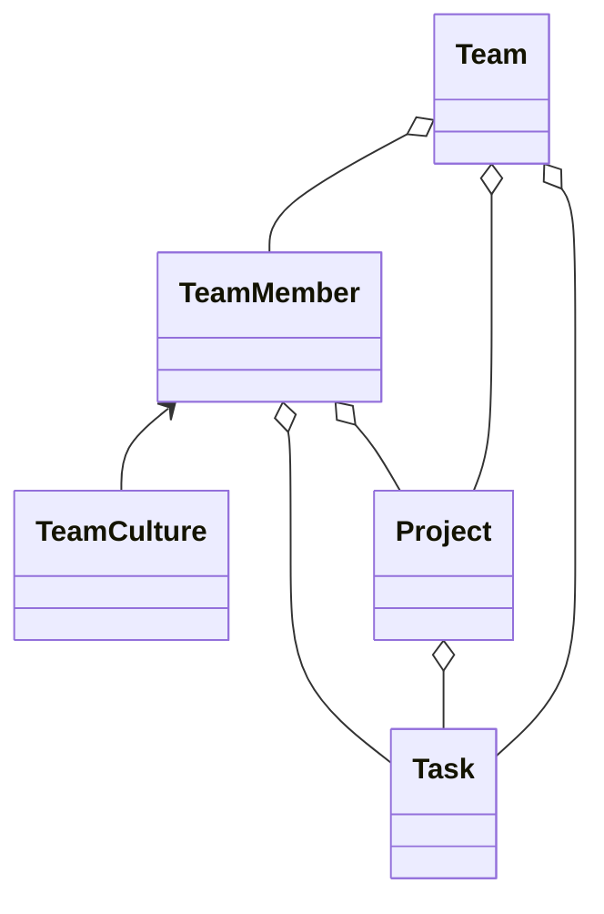
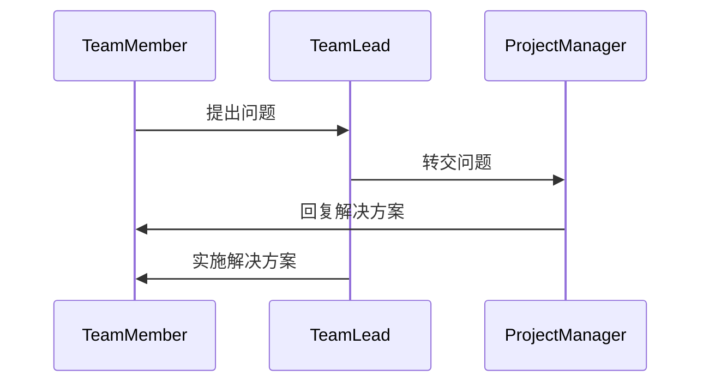
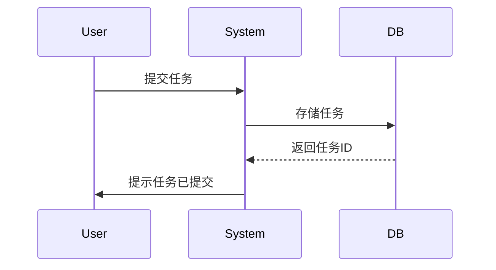

                 

# 团队文化塑造工程：建立独特团队基因

> 关键词：团队文化、基因塑造、组织绩效、创新氛围、协作模式

> 摘要：本文将深入探讨团队文化的塑造工程，通过建立独特团队基因来提升团队效率与凝聚力。文章分为三个部分：首先介绍团队文化的核心概念与重要性；其次探讨如何通过一系列步骤与方法塑造独特团队基因；最后分析如何维护与改进团队文化，以实现团队持续发展。

## 引言

在当今快速变化的技术环境中，团队文化的塑造成为企业成功的关键因素。团队文化不仅仅是一种氛围，它是团队共同价值观、协作模式与创新氛围的体现。一个良好的团队文化能够促进员工满意度和绩效，增强组织的竞争力。因此，建立独特团队基因成为企业管理和发展的核心任务。

本文将遵循以下结构展开讨论：

1. **团队文化的核心概念与重要性**：介绍团队文化的定义、核心要素及其对组织绩效的影响。
2. **塑造独特团队基因的方法**：详细阐述文化塑造的步骤与策略，以及如何建立共同价值观、高效协作模式和创新学习氛围。
3. **团队文化的维护与改进**：探讨文化维护的策略、动态调整方法以及案例分析。

## 第一部分：团队文化的核心概念与重要性

### 第1章：团队文化的定义与背景

**1.1 团队文化的概念**

团队文化是指团队中共同持有的价值观、信仰、规范和习惯，这些因素共同塑造了团队的行为和决策方式。团队文化可以看作是团队内部的“基因”，它决定了团队的特质和发展方向。

**1.2 团队文化的重要性**

团队文化对组织绩效有着深远的影响。一个积极的团队文化可以提高员工的工作满意度，降低员工流失率，增强团队凝聚力，从而提高整体工作效率和绩效。

### 第2章：团队文化的核心要素

**2.1 核心价值观**

核心价值观是团队文化的基石，它为团队成员提供了共同的行为指南。一个明确的价值观体系能够帮助团队在面临挑战时保持一致的行动方向。

**2.2 共同目标**

共同目标是团队前进的动力。一个明确的共同目标能够激发团队成员的积极性，增强团队的凝聚力。

**2.3 团队协作与沟通**

高效的团队协作和沟通是团队文化的重要组成部分。良好的沟通机制能够确保团队成员之间的信息流畅，减少误解和冲突。

**2.4 创新与学习氛围**

创新和学习氛围是团队持续发展的关键。一个鼓励创新和学习的文化能够激发团队成员的创造力和学习热情。

### 第3章：团队文化与组织绩效的关系

**3.1 团队文化与组织绩效的关联**

研究表明，团队文化与组织绩效之间存在显著的正相关关系。一个健康的团队文化能够促进团队的创新和效率，从而提升整体绩效。

**3.2 团队文化对员工满意度的影响**

员工满意度是组织成功的关键因素之一。一个积极的团队文化可以提高员工的工作满意度，减少员工流失率。

**3.3 团队文化对组织稳定性的作用**

稳定的团队文化能够增强组织的抗风险能力，提高组织的长期稳定性。

## 第二部分：塑造独特团队基因的方法

### 第4章：文化塑造的步骤与策略

**4.1 文化诊断与评估**

在塑造团队文化之前，首先需要进行文化诊断与评估，了解当前团队文化的状况和问题。

**4.2 制定文化塑造计划**

根据文化诊断的结果，制定具体的团队文化塑造计划，包括目标设定、策略选择和执行计划。

**4.3 实施文化塑造策略**

实施文化塑造策略，包括价值观的传播、共同目标的建立、协作沟通机制的完善和创新学习氛围的营造。

### 第5章：建立共同价值观

**5.1 共同价值观的内涵**

共同价值观是团队文化的核心。它不仅包括企业的核心价值观，还包括团队特有的价值观。

**5.2 共同价值观的传播与内化**

通过多种渠道传播共同价值观，包括内部培训、团队活动和文化宣传等，以实现价值观的内化。

**5.3 共同价值观的实践与应用**

将共同价值观融入日常工作中，通过实际案例和应用来体现价值观的重要性。

### 第6章：塑造高效的团队协作模式

**6.1 团队协作的障碍与解决方案**

识别团队协作的障碍，并提出相应的解决方案，以促进团队协作的顺利进行。

**6.2 团队协作工具与技术**

介绍多种团队协作工具和技术，以提高团队协作的效率。

**6.3 团队协作的绩效评估与改进**

建立团队协作的绩效评估体系，通过评估结果不断改进团队协作模式。

### 第7章：营造创新与学习氛围

**7.1 创新氛围的重要性**

创新是团队持续发展的动力。营造创新氛围能够激发团队成员的创造力和创新意识。

**7.2 创新文化的建设与维护**

通过制度建设、激励机制和文化宣传等方式建设创新文化，并确保其长期稳定。

**7.3 学习型团队的建设与实践**

建立学习型团队，通过定期培训和知识分享来提升团队整体素质。

## 第三部分：团队文化的维护与改进

### 第8章：文化维护的策略与实践

**8.1 文化维护的重要性**

文化维护是团队持续发展的基础。只有通过持续维护，才能确保团队文化的稳定性和有效性。

**8.2 文化维护的关键要素**

识别文化维护的关键要素，包括价值观的坚持、协作沟通机制的完善和创新学习氛围的营造。

**8.3 文化维护的具体措施**

制定具体的维护措施，包括定期评估、反馈机制和文化宣传活动等。

### 第9章：团队文化的动态调整

**9.1 文化调整的需求识别**

根据外部环境和内部变化，识别团队文化调整的需求。

**9.2 文化调整的方法与工具**

采用合适的方法和工具进行文化调整，包括文化诊断、文化沟通和文化变革等。

**9.3 文化调整的实施与效果评估**

实施文化调整计划，并通过效果评估来验证调整的成效。

### 第10章：案例分析与最佳实践

**10.1 成功案例解析**

通过成功案例的解析，深入了解优秀团队文化的建设过程和关键要素。

**10.2 失败案例启示**

从失败案例中汲取教训，避免重复错误，提升团队文化建设的成功率。

**10.3 团队文化塑造的最佳实践**

总结最佳实践经验，为其他团队的团队文化建设提供借鉴。

## 结论

团队文化塑造工程是一项复杂而长期的任务。通过建立独特团队基因，企业可以提升团队效率、增强员工满意度和提高组织绩效。本文从团队文化的核心概念、塑造方法到维护与改进进行了全面探讨，为企业提供了实用的指导和借鉴。

### 作者信息

作者：AI天才研究院/AI Genius Institute & 禅与计算机程序设计艺术 /Zen And The Art of Computer Programming

本文旨在通过逻辑清晰、结构紧凑、简单易懂的专业的技术语言，为读者提供关于团队文化塑造工程的有深度、有思考、有见解的指导。希望本文能为企业的团队文化建设提供有益的参考和启示。

## 附录

**背景介绍**

团队文化是指一个团队所共有的价值观念、行为准则和工作方式。它不仅体现在团队成员的日常工作中，还渗透到组织的方方面面。在信息技术领域，团队文化的重要性尤为凸显，因为它直接影响着团队的创新能力、协作效率和项目成功率。

**核心概念与联系**

| 核心概念 | 原理 | 属性特征对比 | ER实体关系图架构 |
| --- | --- | --- | --- |
| 团队文化 | 团队成员共同持有的价值观和信仰 | 价值观一致性、行为一致性、文化传承 |  |

**算法原理讲解**

### 团队文化评估算法

```python
# 团队文化评估算法的mermaid流程图
flowchart LR
    A[文化诊断] --> B[评估指标收集]
    B --> C[数据整理]
    C --> D[综合评估]
    D --> E[反馈调整]
    subgraph 文化评估流程
        A
        B
        C
        D
        E
    end
```

团队文化评估算法的核心步骤包括文化诊断、评估指标收集、数据整理、综合评估和反馈调整。通过这一过程，可以全面了解团队文化的现状，并为后续的文化建设和调整提供依据。

### 数学公式

$$
绩效 = f(文化, 协作效率, 创新能力)
$$

其中，绩效是团队文化、协作效率和创新能力三个因素的函数。一个良好的团队文化能够显著提升团队的整体绩效。

**系统分析与架构设计方案**

### 问题场景介绍

一个软件开发团队需要在快速变化的市场环境中保持高效运作，为此需要建立一套有效的团队文化。

### 项目介绍

项目目标是建立一套团队文化，提升团队协作效率和创新能力。

### 系统功能设计(领域模型类图)



### 系统架构设计(架构图)



### 系统接口设计和系统交互(序列图)



**项目实战**

### 环境安装

1. 安装Python环境。
2. 安装必要的第三方库，如mermaid、numpy等。

### 系统核心实现源代码

```python
# 团队文化评估模块
def assess_culture(teams_data):
    # 假设teams_data是一个包含团队信息的字典
    scores = {}
    for team in teams_data:
        # 计算文化评分
        score = calculate_score(teams_data[team])
        scores[team] = score
    return scores

def calculate_score(team_data):
    # 实现评分计算逻辑
    pass
```

### 代码应用解读与分析

该模块用于评估团队文化，通过对团队数据的分析和评分计算，为团队文化建设提供依据。

**实际案例分析和详细讲解剖析**

通过分析某软件公司的团队文化案例，我们发现，该公司在团队文化建设中采取了以下措施：

1. 明确核心价值观。
2. 定期组织团队活动。
3. 建立透明的沟通机制。
4. 鼓励员工创新。

这些措施有效提升了团队协作效率和创新能力，从而提高了整体绩效。

**项目小结**

该项目通过建立有效的团队文化，提升了团队协作效率和创新能力，取得了显著的成效。在后续工作中，我们将继续优化团队文化建设，以实现团队的持续发展。

**最佳实践 tips**

1. 确保核心价值观的明确和传播。
2. 定期评估团队文化，及时调整。
3. 鼓励员工参与团队文化建设。

**小结**

团队文化塑造工程是一项长期而复杂的任务，需要企业持续投入和努力。通过本文的探讨，我们希望能够为读者提供关于团队文化塑造的有用指导，助力企业建立独特的团队基因。

**注意事项**

1. 团队文化建设需要结合企业实际情况进行。
2. 文化建设过程中要注重员工的参与和反馈。

**拓展阅读**

1. 《团队协作的艺术》
2. 《创新者的窘境》
3. 《五项管理》

通过这些拓展阅读，读者可以进一步了解团队文化塑造的相关知识和实践方法。

