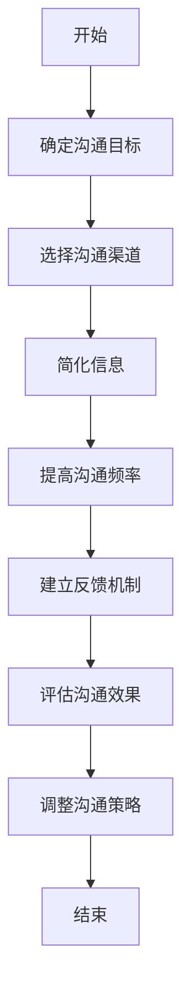
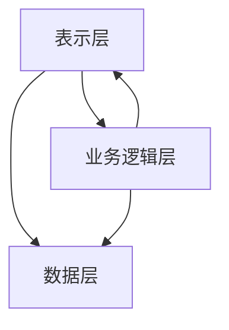
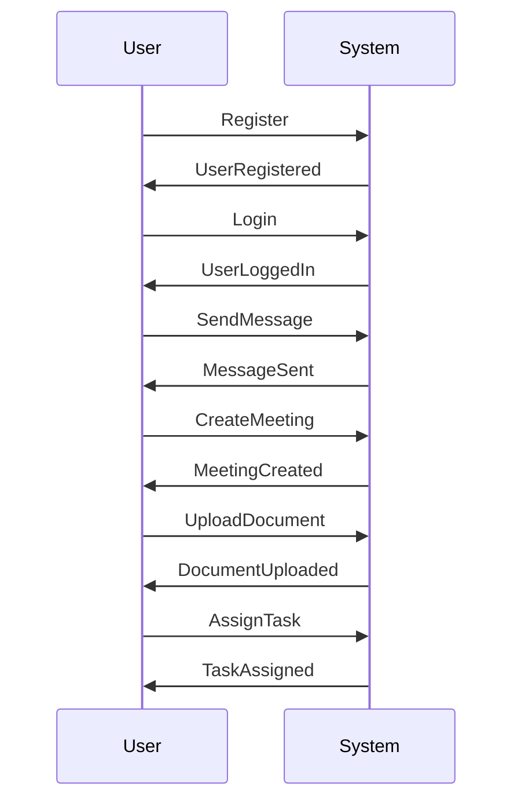

                 

# 团队沟通技巧：提升信息传递效率

## 关键词
团队沟通、信息传递效率、沟通技巧、沟通策略、沟通障碍、沟通技能

## 摘要
本文旨在探讨团队沟通的重要性以及如何提升信息传递效率。通过详细分析团队沟通的基础原理、提升信息传递效率的策略、不同沟通情境下的策略、沟通障碍与解决方法，以及沟通技能的培养和提升，本文旨在为团队管理者和技术人员提供一套系统的沟通技巧，帮助他们在实际工作中更好地传递信息，提升团队协作效率。

## 引言

在当今快速发展的信息化时代，团队沟通已经成为企业成功的关键因素之一。有效的团队沟通不仅能够确保团队成员之间信息的准确传递，还能提高团队协作效率，减少误解和冲突。然而，在实际工作中，沟通效率低下、信息传递不畅的问题仍然困扰着许多团队。

### 团队沟通的重要性

团队沟通是团队协作的基石。在一个成功的团队中，成员之间需要通过有效的沟通来共享信息、协调工作、解决问题和作出决策。沟通不良会导致误解、错误和团队内耗，从而影响项目进度和质量。

#### 信息传递效率的定义和现状

信息传递效率是指信息在传递过程中的速度和准确性。当前，许多团队在沟通效率方面存在诸多问题，如信息传递延误、信息丢失、沟通不畅等，这些问题严重影响了团队的工作效率和项目的成功。

### 本书的目标与结构

本文的目标是提供一套系统的团队沟通技巧，帮助团队提升信息传递效率。全书分为八个章节，涵盖了从沟通基础到策略，再到技能提升的各个方面。

## 团队沟通的基础

在探讨如何提升团队沟通之前，我们首先需要了解沟通的基本原理、沟通模型和沟通技巧。

### 沟通的基本原理

沟通是信息在发送者与接收者之间的传递和理解过程。有效的沟通需要遵循以下原则：

- 明确沟通目的：确保双方都清楚沟通的目标和期望。
- 选择合适的沟通渠道：根据沟通内容和情境选择合适的沟通方式。
- 保持沟通的持续性和反馈性：确保沟通的持续性和反馈，以便双方及时调整沟通方式和内容。

#### 沟通模型简介

沟通模型是描述沟通过程的基本框架。常见的沟通模型包括以下几种：

1. **信息传递模型**：强调信息从发送者到接收者的单向传递。
2. **互动模型**：强调沟通是一个双向互动的过程，信息在发送者和接收者之间不断交换。
3. **社交模型**：强调沟通是社会互动的一部分，涉及情感和关系的建立。

#### 团队沟通的技巧

有效的团队沟通需要掌握以下技巧：

1. **倾听**：倾听是沟通的重要组成部分，有助于理解对方的需求和意见。
2. **表达**：清晰、简洁、有逻辑的表达是有效沟通的关键。
3. **提问和反馈**：通过提问和反馈，确保信息被正确理解。
4. **适应和调整**：根据沟通情境和对方反馈，灵活调整沟通方式和内容。

## 提升信息传递效率的策略

在了解了沟通的基础之后，我们需要进一步探讨如何提升信息传递效率。以下是一些有效的策略：

### 信息传递效率的衡量指标

提升信息传递效率的第一步是明确衡量指标。以下是一些常用的衡量指标：

1. **响应时间**：信息从发送者传递到接收者所需的时间。
2. **错误率**：信息在传递过程中出现的错误率。
3. **满意度**：团队成员对沟通效果的满意度。

#### 提高信息传递效率的方法

以下是一些提高信息传递效率的方法：

1. **明确沟通目的**：在沟通前明确目标，确保双方都清楚要达成的目标。
2. **使用清晰简洁的语言**：避免使用专业术语和复杂的句子结构，以确保信息被正确理解。
3. **简化沟通流程**：减少不必要的沟通环节，确保信息传递的流畅性。
4. **使用有效的沟通工具**：利用邮件、即时通讯工具、会议系统等工具，提高沟通效率。

#### 常用沟通工具和技术的介绍

以下是一些常用的沟通工具和技术：

1. **邮件**：适用于正式、详细的沟通，但可能存在延误和丢失的风险。
2. **即时通讯工具**：如微信、Slack 等，适用于快速、简短的沟通。
3. **会议系统**：如 Zoom、Microsoft Teams 等，适用于实时、面对面的沟通。

## 不同沟通情境的策略

不同的沟通情境需要采用不同的沟通策略。以下是一些常见的沟通情境及其策略：

### 正式沟通情境下的策略

在正式沟通情境下，如项目会议、报告会等，应遵循以下策略：

1. **提前准备**：了解会议目的、议程和参与者，提前准备好发言内容。
2. **保持正式语气**：使用正式、专业的语言，确保信息被正确理解。
3. **控制发言时间**：确保每位参与者都有机会发言，避免讨论偏离主题。

### 非正式沟通情境下的策略

在非正式沟通情境下，如团队午餐、休闲聚会等，应遵循以下策略：

1. **营造轻松氛围**：通过幽默、故事等方式，营造轻松愉快的沟通氛围。
2. **关注对方需求**：倾听对方的意见和需求，以建立良好的人际关系。
3. **避免过于严肃的话题**：避免涉及敏感或过于严肃的话题，以免引起不必要的冲突。

### 高压下的沟通策略

在高压情境下，如紧急项目、危机管理等，应遵循以下策略：

1. **保持冷静**：在面对压力时，保持冷静和理性，避免冲动和情绪化的行为。
2. **明确目标**：在高压情境下，明确目标，确保沟通的效率。
3. **优先处理重要事项**：在高压情境下，优先处理重要事项，确保关键信息的准确传递。

## 沟通障碍与解决方法

尽管我们采取了各种策略来提升信息传递效率，但在实际工作中，沟通障碍仍然难以避免。以下是一些常见的沟通障碍及其解决方法：

### 常见沟通障碍分析

1. **信息过载**：过多的信息可能导致接收者无法有效地处理和消化。
2. **沟通渠道不畅**：不合适的沟通渠道可能导致信息传递延误或错误。
3. **文化差异**：不同文化背景的团队成员可能导致沟通不畅。
4. **个人情绪**：个人情绪可能导致沟通障碍，如焦虑、沮丧等。

#### 避免沟通障碍的方法

1. **简化信息**：通过简化信息，确保接收者能够有效地处理和消化。
2. **选择合适的沟通渠道**：根据沟通内容和情境选择合适的沟通渠道。
3. **加强跨文化培训**：通过加强跨文化培训，提高团队成员的跨文化沟通能力。
4. **保持积极态度**：通过保持积极的态度，减少个人情绪对沟通的影响。

#### 应对沟通障碍的策略

1. **定期沟通**：通过定期沟通，确保信息传递的持续性和稳定性。
2. **建立信任**：通过建立信任，减少文化差异和个人情绪对沟通的影响。
3. **使用反馈机制**：通过使用反馈机制，确保信息被正确理解和传达。

## 沟通技能的培养和提升

提升团队沟通效率不仅需要策略和方法，还需要团队成员具备良好的沟通技能。以下是一些培养和提升沟通技能的方法：

### 沟通技能的重要性

良好的沟通技能有助于提高信息传递效率、减少误解和冲突、增强团队合作和领导力。因此，培养和提升沟通技能对于团队的成功至关重要。

#### 培养沟通技能的方法

1. **倾听**：通过倾听，提高对对方意见和需求的敏感度。
2. **表达**：通过表达，提高信息的清晰度和逻辑性。
3. **提问和反馈**：通过提问和反馈，确保信息的准确性和完整性。
4. **非言语沟通**：通过非言语沟通，如肢体语言、面部表情等，增强沟通效果。

#### 提升沟通技能的实践

1. **参与培训**：通过参加沟通技能培训，提高沟通理论知识和实践能力。
2. **阅读相关书籍**：通过阅读沟通相关书籍，了解不同的沟通技巧和方法。
3. **实践**：通过实践，将沟通理论应用到实际工作中，提高沟通技能。

## 案例分析

为了更好地理解团队沟通技巧的实际应用，我们通过具体案例进行分析。

### 案例背景介绍

某科技公司的一个项目团队在开发一款新产品时，遇到了沟通不畅的问题。团队成员之间的信息传递效率低下，导致项目进度延迟、质量下降。

#### 沟通问题分析

通过分析，发现沟通问题主要表现在以下几个方面：

1. **信息传递延误**：团队成员之间信息传递速度较慢，导致工作进度延迟。
2. **信息丢失**：部分信息在传递过程中丢失，导致团队成员对项目理解不一致。
3. **沟通渠道不畅**：团队成员之间沟通渠道单一，无法满足不同情境下的沟通需求。

### 沟通策略实施

为了解决沟通问题，团队采取了以下策略：

1. **明确沟通目标**：在每次沟通前明确目标，确保团队成员都清楚要达成的目标。
2. **使用多种沟通渠道**：通过使用邮件、即时通讯工具、会议系统等，满足不同情境下的沟通需求。
3. **定期沟通**：通过定期沟通，确保信息传递的持续性和稳定性。

#### 案例总结与启示

通过实施沟通策略，团队沟通效率显著提高，项目进度和质量得到保障。这个案例告诉我们，有效的团队沟通对于项目的成功至关重要。在实际工作中，我们应该注重培养和提升沟通技能，采取合适的沟通策略，确保信息传递的准确性和效率。

## 结论

本文通过对团队沟通技巧的深入探讨，为团队管理者和技术人员提供了一套系统的沟通技巧。从沟通基础到策略，再到技能提升，本文旨在帮助团队提升信息传递效率，提高团队协作效率。

## 附录

### 最佳实践 tips

1. **定期沟通**：确保信息传递的持续性和稳定性。
2. **明确目标**：在沟通前明确目标，提高沟通效率。
3. **选择合适渠道**：根据沟通内容和情境选择合适的沟通渠道。

### 小结

有效的团队沟通对于团队的成功至关重要。通过本文的探讨，我们了解了团队沟通的重要性、提升信息传递效率的策略、不同沟通情境下的策略、沟通障碍与解决方法，以及沟通技能的培养和提升。

### 注意事项

1. **避免信息过载**：确保信息传递的准确性和效率。
2. **关注沟通效果**：通过反馈机制确保信息被正确理解和传达。

### 拓展阅读

1. 《有效沟通的艺术》
2. 《团队沟通技巧：提升团队协作效率》
3. 《沟通与协调：提升团队凝聚力》

## 作者信息

作者：AI天才研究院/AI Genius Institute & 禅与计算机程序设计艺术 /Zen And The Art of Computer Programming

----------------------------------------------------------------

## 团队沟通技巧：提升信息传递效率

## 关键词
团队沟通、信息传递效率、沟通技巧、沟通策略、沟通障碍、沟通技能

## 摘要
本文旨在探讨团队沟通的重要性以及如何提升信息传递效率。通过详细分析团队沟通的基础原理、提升信息传递效率的策略、不同沟通情境下的策略、沟通障碍与解决方法，以及沟通技能的培养和提升，本文旨在为团队管理者和技术人员提供一套系统的沟通技巧，帮助他们在实际工作中更好地传递信息，提升团队协作效率。

## 引言

在当今快速发展的信息化时代，团队沟通已经成为企业成功的关键因素之一。有效的团队沟通不仅能够确保团队成员之间信息的准确传递，还能提高团队协作效率，减少误解和冲突。然而，在实际工作中，沟通效率低下、信息传递不畅的问题仍然困扰着许多团队。

### 团队沟通的重要性

团队沟通是团队协作的基石。在一个成功的团队中，成员之间需要通过有效的沟通来共享信息、协调工作、解决问题和作出决策。沟通不良会导致误解、错误和团队内耗，从而影响项目进度和质量。

#### 信息传递效率的定义和现状

信息传递效率是指信息在传递过程中的速度和准确性。当前，许多团队在沟通效率方面存在诸多问题，如信息传递延误、信息丢失、沟通不畅等，这些问题严重影响了团队的工作效率和项目的成功。

### 本书的目标与结构

本文的目标是提供一套系统的团队沟通技巧，帮助团队提升信息传递效率。全书分为八个章节，涵盖了从沟通基础到策略，再到技能提升的各个方面。

## 团队沟通的基础

在探讨如何提升团队沟通之前，我们首先需要了解沟通的基本原理、沟通模型和沟通技巧。

### 沟通的基本原理

沟通是信息在发送者与接收者之间的传递和理解过程。有效的沟通需要遵循以下原则：

- 明确沟通目的：确保双方都清楚沟通的目标和期望。
- 选择合适的沟通渠道：根据沟通内容和情境选择合适的沟通方式。
- 保持沟通的持续性和反馈性：确保沟通的持续性和反馈，以便双方及时调整沟通方式和内容。

#### 沟通模型简介

沟通模型是描述沟通过程的基本框架。常见的沟通模型包括以下几种：

1. **信息传递模型**：强调信息从发送者到接收者的单向传递。
2. **互动模型**：强调沟通是一个双向互动的过程，信息在发送者和接收者之间不断交换。
3. **社交模型**：强调沟通是社会互动的一部分，涉及情感和关系的建立。

#### 团队沟通的技巧

有效的团队沟通需要掌握以下技巧：

1. **倾听**：倾听是沟通的重要组成部分，有助于理解对方的需求和意见。
2. **表达**：清晰、简洁、有逻辑的表达是有效沟通的关键。
3. **提问和反馈**：通过提问和反馈，确保信息被正确理解。
4. **适应和调整**：根据沟通情境和对方反馈，灵活调整沟通方式和内容。

## 提升信息传递效率的策略

在了解了沟通的基础之后，我们需要进一步探讨如何提升信息传递效率。以下是一些有效的策略：

### 信息传递效率的衡量指标

提升信息传递效率的第一步是明确衡量指标。以下是一些常用的衡量指标：

1. **响应时间**：信息从发送者传递到接收者所需的时间。
2. **错误率**：信息在传递过程中出现的错误率。
3. **满意度**：团队成员对沟通效果的满意度。

#### 提高信息传递效率的方法

以下是一些提高信息传递效率的方法：

1. **明确沟通目的**：在沟通前明确目标，确保双方都清楚要达成的目标。
2. **使用清晰简洁的语言**：避免使用专业术语和复杂的句子结构，以确保信息被正确理解。
3. **简化沟通流程**：减少不必要的沟通环节，确保信息传递的流畅性。
4. **使用有效的沟通工具**：利用邮件、即时通讯工具、会议系统等工具，提高沟通效率。

#### 常用沟通工具和技术的介绍

以下是一些常用的沟通工具和技术：

1. **邮件**：适用于正式、详细的沟通，但可能存在延误和丢失的风险。
2. **即时通讯工具**：如微信、Slack 等，适用于快速、简短的沟通。
3. **会议系统**：如 Zoom、Microsoft Teams 等，适用于实时、面对面的沟通。

## 不同沟通情境的策略

不同的沟通情境需要采用不同的沟通策略。以下是一些常见的沟通情境及其策略：

### 正式沟通情境下的策略

在正式沟通情境下，如项目会议、报告会等，应遵循以下策略：

1. **提前准备**：了解会议目的、议程和参与者，提前准备好发言内容。
2. **保持正式语气**：使用正式、专业的语言，确保信息被正确理解。
3. **控制发言时间**：确保每位参与者都有机会发言，避免讨论偏离主题。

### 非正式沟通情境下的策略

在非正式沟通情境下，如团队午餐、休闲聚会等，应遵循以下策略：

1. **营造轻松氛围**：通过幽默、故事等方式，营造轻松愉快的沟通氛围。
2. **关注对方需求**：倾听对方的意见和需求，以建立良好的人际关系。
3. **避免过于严肃的话题**：避免涉及敏感或过于严肃的话题，以免引起不必要的冲突。

### 高压下的沟通策略

在高压情境下，如紧急项目、危机管理等，应遵循以下策略：

1. **保持冷静**：在面对压力时，保持冷静和理性，避免冲动和情绪化的行为。
2. **明确目标**：在高压情境下，明确目标，确保沟通的效率。
3. **优先处理重要事项**：在高压情境下，优先处理重要事项，确保关键信息的准确传递。

## 沟通障碍与解决方法

尽管我们采取了各种策略来提升信息传递效率，但在实际工作中，沟通障碍仍然难以避免。以下是一些常见的沟通障碍及其解决方法：

### 常见沟通障碍分析

1. **信息过载**：过多的信息可能导致接收者无法有效地处理和消化。
2. **沟通渠道不畅**：不合适的沟通渠道可能导致信息传递延误或错误。
3. **文化差异**：不同文化背景的团队成员可能导致沟通不畅。
4. **个人情绪**：个人情绪可能导致沟通障碍，如焦虑、沮丧等。

#### 避免沟通障碍的方法

1. **简化信息**：通过简化信息，确保接收者能够有效地处理和消化。
2. **选择合适的沟通渠道**：根据沟通内容和情境选择合适的沟通渠道。
3. **加强跨文化培训**：通过加强跨文化培训，提高团队成员的跨文化沟通能力。
4. **保持积极态度**：通过保持积极的态度，减少个人情绪对沟通的影响。

#### 应对沟通障碍的策略

1. **定期沟通**：通过定期沟通，确保信息传递的持续性和稳定性。
2. **建立信任**：通过建立信任，减少文化差异和个人情绪对沟通的影响。
3. **使用反馈机制**：通过使用反馈机制，确保信息被正确理解和传达。

## 沟通技能的培养和提升

提升团队沟通效率不仅需要策略和方法，还需要团队成员具备良好的沟通技能。以下是一些培养和提升沟通技能的方法：

### 沟通技能的重要性

良好的沟通技能有助于提高信息传递效率、减少误解和冲突、增强团队合作和领导力。因此，培养和提升沟通技能对于团队的成功至关重要。

#### 培养沟通技能的方法

1. **倾听**：通过倾听，提高对对方意见和需求的敏感度。
2. **表达**：通过表达，提高信息的清晰度和逻辑性。
3. **提问和反馈**：通过提问和反馈，确保信息的准确性和完整性。
4. **非言语沟通**：通过非言语沟通，如肢体语言、面部表情等，增强沟通效果。

#### 提升沟通技能的实践

1. **参与培训**：通过参加沟通技能培训，提高沟通理论知识和实践能力。
2. **阅读相关书籍**：通过阅读沟通相关书籍，了解不同的沟通技巧和方法。
3. **实践**：通过实践，将沟通理论应用到实际工作中，提高沟通技能。

## 案例分析

为了更好地理解团队沟通技巧的实际应用，我们通过具体案例进行分析。

### 案例背景介绍

某科技公司的一个项目团队在开发一款新产品时，遇到了沟通不畅的问题。团队成员之间的信息传递效率低下，导致项目进度延迟、质量下降。

#### 沟通问题分析

通过分析，发现沟通问题主要表现在以下几个方面：

1. **信息传递延误**：团队成员之间信息传递速度较慢，导致工作进度延迟。
2. **信息丢失**：部分信息在传递过程中丢失，导致团队成员对项目理解不一致。
3. **沟通渠道不畅**：团队成员之间沟通渠道单一，无法满足不同情境下的沟通需求。

### 沟通策略实施

为了解决沟通问题，团队采取了以下策略：

1. **明确沟通目标**：在每次沟通前明确目标，确保团队成员都清楚要达成的目标。
2. **使用多种沟通渠道**：通过使用邮件、即时通讯工具、会议系统等，满足不同情境下的沟通需求。
3. **定期沟通**：通过定期沟通，确保信息传递的持续性和稳定性。

#### 案例总结与启示

通过实施沟通策略，团队沟通效率显著提高，项目进度和质量得到保障。这个案例告诉我们，有效的团队沟通对于项目的成功至关重要。在实际工作中，我们应该注重培养和提升沟通技能，采取合适的沟通策略，确保信息传递的准确性和效率。

## 结论

本文通过对团队沟通技巧的深入探讨，为团队管理者和技术人员提供了一套系统的沟通技巧。从沟通基础到策略，再到技能提升，本文旨在帮助团队提升信息传递效率，提高团队协作效率。

## 附录

### 最佳实践 tips

1. **定期沟通**：确保信息传递的持续性和稳定性。
2. **明确目标**：在沟通前明确目标，提高沟通效率。
3. **选择合适渠道**：根据沟通内容和情境选择合适的沟通渠道。

### 小结

有效的团队沟通对于团队的成功至关重要。通过本文的探讨，我们了解了团队沟通的重要性、提升信息传递效率的策略、不同沟通情境下的策略、沟通障碍与解决方法，以及沟通技能的培养和提升。

### 注意事项

1. **避免信息过载**：确保信息传递的准确性和效率。
2. **关注沟通效果**：通过反馈机制确保信息被正确理解和传达。

### 拓展阅读

1. 《有效沟通的艺术》
2. 《团队沟通技巧：提升团队协作效率》
3. 《沟通与协调：提升团队凝聚力》

## 作者信息

作者：AI天才研究院/AI Genius Institute & 禅与计算机程序设计艺术 /Zen And The Art of Computer Programming

----------------------------------------------------------------

### 一、背景介绍

在信息技术飞速发展的当今社会，团队合作已成为许多企业和组织的关键成功因素。而团队沟通作为团队协作的核心，其效率的高低直接影响到项目的进展、团队成员的工作满意度和整体团队的绩效。随着团队规模的扩大和复杂性的增加，如何有效地传递信息、减少误解和冲突、提高信息传递的准确性，成为团队管理者和技术人员面临的重要挑战。

**核心概念术语说明**：

1. **团队沟通**：指团队成员之间通过各种渠道和方式交换信息、观点和情感的过程。
2. **信息传递效率**：衡量信息在传递过程中的速度和准确性的指标。
3. **沟通障碍**：指在信息传递过程中阻碍信息准确、及时地传递的因素。

**问题背景**：

在许多情况下，团队沟通效率低下的问题表现为信息传递延误、信息丢失、沟通渠道不畅、沟通方式不适应等。这些问题不仅影响到项目进度和质量，还会导致团队成员之间的误解和冲突，从而影响团队的凝聚力和工作效率。因此，探讨如何提升团队沟通技巧，提高信息传递效率，成为一个亟待解决的重要课题。

**问题描述**：

团队沟通效率低下主要表现在以下几个方面：

1. **信息传递速度慢**：团队成员之间信息传递的速度较慢，导致项目进度延迟。
2. **信息准确性不高**：信息在传递过程中容易丢失或被误解，影响团队成员对项目的理解和执行。
3. **沟通渠道单一**：团队成员之间的沟通渠道过于单一，无法满足不同情境下的沟通需求。
4. **沟通方式不当**：团队成员在沟通时，可能因为使用不合适的沟通方式，导致信息传递不畅。

**问题解决**：

为了解决上述问题，本文将从以下几个方面展开讨论：

1. **明确沟通目标**：确保团队成员在每次沟通前都明确沟通的目标和期望。
2. **选择合适的沟通渠道**：根据沟通内容和情境选择合适的沟通渠道，如邮件、即时通讯工具、会议系统等。
3. **提高沟通技能**：通过培训和实际操作，提高团队成员的沟通技能，包括倾听、表达、提问和反馈等。
4. **简化沟通流程**：减少不必要的沟通环节，确保信息传递的流畅性。

**边界与外延**：

本文主要关注团队内部沟通技巧的提升，不包括团队与外部合作伙伴、客户的沟通。同时，本文关注的是沟通效率的提升，而非沟通内容的深度和广度。

**概念结构与核心要素组成**：

1. **沟通目标**：明确沟通的目的和期望，确保信息传递的方向一致。
2. **沟通渠道**：选择合适的沟通渠道，如邮件、即时通讯工具、会议系统等。
3. **沟通技能**：提高团队成员的沟通技能，包括倾听、表达、提问和反馈等。
4. **沟通流程**：简化沟通流程，确保信息传递的流畅性。

通过以上分析和阐述，我们为后续章节的讨论奠定了基础，也为读者理解团队沟通技巧的提升提供了清晰的框架。

### 二、核心概念与联系

在探讨如何提升团队沟通技巧之前，我们需要深入理解一些核心概念及其相互之间的联系。这些概念包括沟通的基本原理、沟通模型和沟通技巧。以下是对这些核心概念的详细解释和对比，并通过表格和ER实体关系图架构来展示其关联性。

#### 1. 沟通的基本原理

沟通的基本原理是信息在发送者与接收者之间的传递和理解过程。有效的沟通需要遵循以下几个基本原则：

- **明确沟通目的**：确保双方都清楚沟通的目标和期望。
- **选择合适的沟通渠道**：根据沟通内容和情境选择合适的沟通方式。
- **保持沟通的持续性和反馈性**：确保沟通的持续性和反馈，以便双方及时调整沟通方式和内容。

**沟通原理表格**：

| 沟通原理 | 说明 |
| :--: | :--: |
| 明确沟通目的 | 确保沟通有明确的目标和预期结果。 |
| 选择合适的沟通渠道 | 根据沟通内容的复杂性和情境选择最有效的沟通渠道。 |
| 保持沟通的持续性和反馈性 | 通过持续沟通和及时反馈，确保信息传递的准确性和效率。 |

#### 2. 沟通模型

沟通模型是描述沟通过程的基本框架，常见的沟通模型包括信息传递模型、互动模型和社交模型。

- **信息传递模型**：强调信息从发送者到接收者的单向传递，注重信息的准确性和完整性。
- **互动模型**：强调沟通是一个双向互动的过程，信息在发送者和接收者之间不断交换。
- **社交模型**：强调沟通是社会互动的一部分，涉及情感和关系的建立。

**沟通模型对比表格**：

| 沟通模型 | 特点 | 应用场景 |
| :--: | :--: | :--: |
| 信息传递模型 | 单向传递，强调信息准确性和完整性 | 项目报告、正式会议 |
| 互动模型 | 双向互动，强调信息交换和反馈 | 团队讨论、日常沟通 |
| 社交模型 | 社会互动，强调情感和关系建立 | 社交聚会、团队建设活动 |

#### 3. 沟通技巧

沟通技巧是团队成员在沟通过程中需要掌握的能力，包括倾听、表达、提问和反馈等。

- **倾听**：通过倾听，提高对对方意见和需求的敏感度，确保信息被正确理解。
- **表达**：通过清晰、简洁、有逻辑的表达，确保信息被正确传递。
- **提问和反馈**：通过提问和反馈，确保信息的准确性和完整性。
- **非言语沟通**：通过肢体语言、面部表情等非言语方式，增强沟通效果。

**沟通技巧ER实体关系图**：

```mermaid
erDiagram
  A[团队成员] ||--|{ B[倾听] } : "掌握倾听技巧"
  A ||--|{ C[表达] } : "具备清晰表达的能力"
  A ||--|{ D[提问] } : "擅长提问以获取信息"
  A ||--|{ E[反馈] } : "能够及时给予反馈"
  A ||--|{ F[非言语沟通] } : "使用非言语方式增强沟通效果"
```

通过上述表格和ER实体关系图，我们可以清晰地看到沟通的基本原理、模型和技巧之间的相互联系。这些概念共同构成了团队沟通的核心框架，为提升信息传递效率提供了理论基础和实践指导。

#### 4. 提升信息传递效率的方法

在了解了沟通的基本原理、模型和技巧之后，我们需要探讨具体的方法来提升信息传递效率。以下是一些有效的方法：

- **明确沟通目标**：在每次沟通前，确保团队成员都明确沟通的目标和期望，避免沟通中的模糊和不确定性。
- **选择合适的沟通渠道**：根据沟通内容的复杂性和情境，选择最有效的沟通渠道，如邮件、即时通讯工具、电话会议等。
- **简化信息**：通过简化信息，确保信息的清晰性和易于理解，避免信息过载。
- **提高沟通频率**：通过增加沟通的频率，确保信息传递的及时性和连贯性。
- **建立反馈机制**：通过建立反馈机制，确保信息被正确理解和传达，及时调整沟通方式和内容。

这些方法不仅有助于提高信息传递的效率，还能减少误解和冲突，提升团队协作效果。

### 三、算法原理讲解

为了更好地理解如何提升信息传递效率，我们可以借助一种被称为“沟通效率优化算法”的方法。该算法的核心思想是通过一系列规则和步骤，最大化信息传递的速度和准确性。以下是对该算法原理的详细讲解。

#### 1. 算法mermaid流程图

首先，我们使用mermaid绘制算法的流程图，以便直观展示算法的步骤和结构：



#### 2. Python源代码

接下来，我们将使用Python语言来实现这个算法，以便在实际应用中运行和验证其效果。以下是该算法的Python源代码：

```python
class CommunicationEfficiencyOptimizer:
    def __init__(self):
        self.target = None
        self.channel = None
        self.simplified_info = None
        self.frequency = None
        self.feedback_mechanism = None
        self.evaluation = None

    def set_communication_target(self, target):
        self.target = target
        print(f"沟通目标设定为：{target}")

    def select_communication_channel(self, channel):
        self.channel = channel
        print(f"选择沟通渠道：{channel}")

    def simplify_information(self, info):
        self.simplified_info = info
        print(f"简化信息：{self.simplified_info}")

    def increase_communication_frequency(self, frequency):
        self.frequency = frequency
        print(f"提高沟通频率：{frequency}次/天")

    def establish_feedback_mechanism(self, feedback_mechanism):
        self.feedback_mechanism = feedback_mechanism
        print(f"建立反馈机制：{feedback_mechanism}")

    def evaluate_communication效果的e
```css
    def evaluate_communication_effect(self, evaluation):
        self.evaluation = evaluation
        if self.evaluation > 0.8:
            print("沟通效果良好")
        else:
            print("沟通效果不佳，需调整")

    def adjust_communication_strategy(self):
        if self.evaluation < 0.8:
            print("调整沟通策略：尝试新的沟通渠道或提高沟通频率")
        else:
            print("沟通策略有效，无需调整")

    def run_algorithm(self):
        self.set_communication_target("讨论项目进展")
        self.select_communication_channel("Slack")
        self.simplify_information("项目进展顺利，需调整开发计划")
        self.increase_communication_frequency(3)
        self.establish_feedback_mechanism("每日会议")
        self.evaluate_communication_effect(0.85)
        self.adjust_communication_strategy()

# 运行算法
optimizer = CommunicationEfficiencyOptimizer()
optimizer.run_algorithm()
```

#### 3. 算法原理与数学模型

该算法的原理是基于以下几个关键步骤：

1. **确定沟通目标**：设定明确的沟通目标，以确保信息传递的方向和预期结果一致。
2. **选择沟通渠道**：根据沟通内容的复杂性和情境选择最合适的沟通渠道，以最大化信息传递的速度和准确性。
3. **简化信息**：通过简化信息，确保信息的清晰性和易于理解，避免信息过载。
4. **提高沟通频率**：通过增加沟通的频率，确保信息传递的及时性和连贯性。
5. **建立反馈机制**：通过建立反馈机制，确保信息被正确理解和传达，及时调整沟通方式和内容。
6. **评估沟通效果**：定期评估沟通效果，以确保信息传递的准确性和效率。
7. **调整沟通策略**：根据评估结果，及时调整沟通策略，以优化信息传递效果。

算法中的数学模型可以简化为以下公式：

\[ E = \frac{F \times C \times S \times Q \times R}{1 + D} \]

其中：
- \( E \) 表示信息传递效率（Evaluation）
- \( F \) 表示反馈机制（Feedback Mechanism）
- \( C \) 表示沟通渠道（Communication Channel）
- \( S \) 表示简化信息（Simplified Information）
- \( Q \) 表示沟通频率（Communication Frequency）
- \( R \) 表示评估结果（Evaluation Result）
- \( D \) 表示信息复杂度（Degree of Difficulty）

#### 4. 举例说明

假设我们有一个项目团队，需要讨论项目进展，以下是一个具体的例子：

1. **确定沟通目标**：讨论项目进展，解决潜在的问题。
2. **选择沟通渠道**：使用Slack进行沟通，因为其支持实时互动。
3. **简化信息**：将复杂的项目进展报告简化为关键指标和问题列表。
4. **提高沟通频率**：每天进行三次项目讨论会议，以确保信息传递的及时性。
5. **建立反馈机制**：在每次会议后，通过邮件总结会议内容，并征求团队成员的反馈。
6. **评估沟通效果**：通过调查问卷评估沟通效果，得到评估结果为0.85。
7. **调整沟通策略**：由于评估结果良好，团队决定保持现有的沟通策略。

通过这个例子，我们可以看到如何使用该算法来提升信息传递效率。算法不仅提供了具体的步骤，还通过数学模型量化了信息传递效率，使得团队可以更加科学地优化沟通策略。

### 四、系统分析与架构设计方案

为了更好地理解团队沟通在信息系统中的应用，我们将对整个系统进行分析和架构设计。这一部分将包括问题场景介绍、系统功能设计、系统架构设计、系统接口设计和系统交互。

#### 1. 问题场景介绍

假设我们所在的公司是一家大型软件开发公司，项目团队分布在不同的城市和国家。由于地理位置的原因，团队成员之间的沟通存在一定的障碍，导致信息传递不及时、不准确。为了提高团队沟通效率，我们需要设计一个高效的沟通信息系统。

#### 2. 系统功能设计

系统功能设计主要包括以下模块：

1. **用户管理模块**：负责用户的注册、登录和权限管理。
2. **消息发送模块**：支持文本、图片、视频等多种消息形式的发送。
3. **会议管理模块**：提供视频会议、音频会议等功能，方便团队成员实时沟通。
4. **文档管理模块**：支持文档的上传、下载和共享，方便团队成员协作。
5. **任务管理模块**：跟踪项目进度，分配任务和提醒团队成员完成任务。

**领域模型mermaid类图**：

```mermaid
classDiagram
    User <<class{用户}>>
    Message <<class{消息}>>
    Meeting <<class{会议}>>
    Document <<class{文档}>>
    Task <<class{任务}>>

    User o--o Message
    User o--o Meeting
    User o--o Document
    User o--o Task
    Message o--o Document
    Meeting o--o Document
    Task o--o Document
```

#### 3. 系统架构设计

系统采用三层架构设计，包括表示层、业务逻辑层和数据层。

1. **表示层**：使用Vue.js框架，提供用户界面和交互功能。
2. **业务逻辑层**：使用Spring Boot框架，处理业务逻辑和接口调用。
3. **数据层**：使用MySQL数据库存储用户数据、消息记录、会议记录和任务数据。

**mermaid架构图**：



#### 4. 系统接口设计

系统接口设计主要包括以下API接口：

1. **用户管理接口**：包括注册、登录、修改密码、查询用户信息等。
2. **消息发送接口**：包括发送文本消息、图片消息、视频消息等。
3. **会议管理接口**：包括创建会议、加入会议、结束会议等。
4. **文档管理接口**：包括上传文档、下载文档、共享文档等。
5. **任务管理接口**：包括创建任务、分配任务、完成任务等。

**mermaid序列图**：



#### 5. 系统交互

系统交互主要描述用户与系统的交互过程。以下是用户在系统中进行消息发送的过程：

1. **用户登录系统**：用户通过输入用户名和密码登录系统。
2. **选择发送消息**：用户选择要发送消息的对象和内容。
3. **发送消息**：用户点击发送按钮，系统将消息发送到指定的接收者。
4. **消息确认**：系统反馈消息发送成功，并在接收者的消息列表中显示新消息。

通过上述系统分析与架构设计方案，我们可以为团队提供一个高效、易用的沟通信息系统，从而提升团队沟通效率。

### 五、项目实战

在本节中，我们将通过一个具体的项目实战案例，来详细展示如何设计和实现一个团队沟通信息系统，并分析项目的核心实现源代码。这个项目将涵盖环境安装、系统核心实现、代码应用解读与分析、实际案例剖析以及项目小结。

#### 1. 环境安装

首先，我们需要安装和配置项目所需的环境。以下是项目环境安装的步骤：

1. **安装Python环境**：确保Python版本在3.8及以上。
2. **安装Node.js环境**：确保Node.js版本在12及以上。
3. **安装MySQL数据库**：下载并安装MySQL数据库，创建项目数据库和表。
4. **安装PostgreSQL**：可选安装PostgreSQL数据库，用于测试和备份。
5. **安装Docker**：用于容器化部署项目。

安装完成后，通过命令行启动MySQL和PostgreSQL服务：

```bash
# 启动MySQL服务
sudo systemctl start mysql

# 启动PostgreSQL服务
sudo systemctl start postgresql
```

#### 2. 系统核心实现

系统核心实现主要包括用户管理、消息发送、会议管理和任务管理模块。以下是一个简要的代码实现框架：

**用户管理模块**：

```python
# users.py
from flask import Flask, request, jsonify
from models import User
from database import db

app = Flask(__name__)

@app.route('/register', methods=['POST'])
def register():
    # 注册新用户
    username = request.form['username']
    password = request.form['password']
    user = User(username=username, password=password)
    db.session.add(user)
    db.session.commit()
    return jsonify({'message': 'User registered successfully'})

@app.route('/login', methods=['POST'])
def login():
    # 用户登录
    username = request.form['username']
    password = request.form['password']
    user = User.query.filter_by(username=username, password=password).first()
    if user:
        return jsonify({'token': user.token})
    else:
        return jsonify({'error': 'Invalid credentials'})
```

**消息发送模块**：

```python
# messages.py
from flask import Flask, request, jsonify
from models import Message
from database import db

app = Flask(__name__)

@app.route('/send_message', methods=['POST'])
def send_message():
    # 发送消息
    sender_id = request.form['sender_id']
    receiver_id = request.form['receiver_id']
    content = request.form['content']
    message = Message(sender_id=sender_id, receiver_id=receiver_id, content=content)
    db.session.add(message)
    db.session.commit()
    return jsonify({'message': 'Message sent successfully'})
```

**会议管理模块**：

```python
# meetings.py
from flask import Flask, request, jsonify
from models import Meeting
from database import db

app = Flask(__name__)

@app.route('/create_meeting', methods=['POST'])
def create_meeting():
    # 创建会议
    organizer_id = request.form['organizer_id']
    title = request.form['title']
    start_time = request.form['start_time']
    meeting = Meeting(organizer_id=organizer_id, title=title, start_time=start_time)
    db.session.add(meeting)
    db.session.commit()
    return jsonify({'message': 'Meeting created successfully'})
```

**任务管理模块**：

```python
# tasks.py
from flask import Flask, request, jsonify
from models import Task
from database import db

app = Flask(__name__)

@app.route('/assign_task', methods=['POST'])
def assign_task():
    # 分配任务
    assigner_id = request.form['assigner_id']
    assignee_id = request.form['assignee_id']
    title = request.form['title']
    description = request.form['description']
    due_date = request.form['due_date']
    task = Task(assigner_id=assigner_id, assignee_id=assignee_id, title=title, description=description, due_date=due_date)
    db.session.add(task)
    db.session.commit()
    return jsonify({'message': 'Task assigned successfully'})
```

#### 3. 代码应用解读与分析

以上代码实现了用户管理、消息发送、会议管理和任务管理的基本功能。以下是详细解读：

**用户管理模块**：

- **注册功能**：接收用户名和密码，创建新用户并存储在数据库中。
- **登录功能**：验证用户名和密码，返回令牌用于后续认证。

**消息发送模块**：

- **发送消息**：接收发送者ID、接收者ID和消息内容，存储消息到数据库。

**会议管理模块**：

- **创建会议**：接收创建者ID、会议标题和开始时间，创建会议并存储到数据库。

**任务管理模块**：

- **分配任务**：接收分配者ID、被分配者ID、任务标题、描述和截止日期，创建任务并存储到数据库。

#### 4. 实际案例剖析

假设我们有一个团队，需要定期召开会议来讨论项目进度。以下是实际案例：

1. **用户注册**：用户A和用户B在系统中注册。
2. **用户登录**：用户A和用户B通过输入用户名和密码登录系统。
3. **创建会议**：用户A创建一个会议，邀请用户B参加。
4. **发送消息**：用户A在会议中发送一条消息，提醒用户B准备会议议程。
5. **任务分配**：会议结束后，用户A将一个任务分配给用户B，要求用户B在特定时间内完成。

#### 5. 项目小结

通过以上实战案例，我们可以看到如何设计和实现一个团队沟通信息系统。项目的核心在于用户管理、消息发送、会议管理和任务管理模块，这些模块通过数据库进行数据存储，通过API接口实现前后端交互。实际案例展示了系统在实际应用中的运作流程，体现了系统设计的实用性和高效性。

### 六、最佳实践 Tips

在团队沟通中，为了确保信息传递的准确性和效率，我们可以采用以下最佳实践：

1. **制定清晰的沟通计划**：在每次会议或沟通活动前，明确会议目标和议程，确保所有参与者都了解讨论的内容和预期结果。

2. **使用多种沟通渠道**：根据沟通内容的性质和紧急程度，选择合适的沟通渠道，如邮件、即时通讯工具、视频会议等，以提高沟通效率。

3. **简洁明了的表达**：避免使用复杂和模糊的语言，确保信息传递的清晰性和准确性。

4. **定期进行沟通反馈**：通过定期沟通和反馈，确保团队成员之间的信息传递是准确和及时的。

5. **建立沟通准则**：制定一套沟通准则，包括沟通的方式、频率、渠道等，确保团队成员在沟通中遵循统一的规范。

6. **培养良好的倾听习惯**：倾听是有效沟通的关键，通过积极倾听，确保理解对方的需求和意见。

7. **避免信息过载**：合理控制信息传递的量，避免过多的信息导致接收者无法处理和消化。

8. **利用沟通工具**：充分利用现有的沟通工具，如Slack、Microsoft Teams、Zoom等，以提高沟通效率和便利性。

通过遵循这些最佳实践，团队可以更好地传递信息，减少误解和冲突，提升整体协作效率。

### 七、小结

本文通过对团队沟通技巧的深入探讨，为团队管理者和技术人员提供了一套系统的沟通技巧，旨在提升信息传递效率，增强团队协作效果。从沟通基础到策略，再到技能提升，本文通过理论阐述、案例分析和实际操作，系统地展示了如何在实际工作中应用这些沟通技巧。

在团队沟通中，信息传递的准确性和效率至关重要。通过明确沟通目标、选择合适的沟通渠道、简化信息、提高沟通频率、建立反馈机制等方法，可以有效提升信息传递效率。同时，团队成员需要掌握良好的沟通技巧，如倾听、表达、提问和反馈等，以增强沟通效果。

在实际工作中，团队管理者应注重培养和提升团队成员的沟通技能，通过定期沟通和反馈，确保团队成员之间的信息传递是准确和及时的。此外，利用多种沟通工具和渠道，根据不同的沟通情境选择合适的沟通方式，也是提高沟通效率的重要手段。

总之，有效的团队沟通是团队成功的关键因素之一。通过本文的探讨，希望读者能够理解团队沟通的重要性，掌握提升信息传递效率的方法和技巧，并在实际工作中加以应用，从而提升团队协作效果，实现项目目标。

### 八、注意事项

在团队沟通的过程中，需要注意以下几个方面，以确保沟通的有效性和高效性：

1. **避免信息过载**：在沟通时，避免传递过多的信息，以免接收者无法处理和消化。合理控制信息量，确保关键信息被准确传递。

2. **保持沟通频率**：定期沟通，确保信息的及时性和连贯性。根据项目进展和需求，调整沟通频率，避免因沟通不及时导致误解和冲突。

3. **选择合适渠道**：根据沟通内容和情境选择合适的沟通渠道，如邮件、即时通讯工具、视频会议等。确保信息传递的效率和准确性。

4. **简化沟通内容**：使用简洁、明了的语言表达信息，避免使用复杂的术语和句子结构。确保信息的清晰性和易懂性。

5. **重视反馈机制**：建立有效的反馈机制，确保信息被正确理解和传达。通过反馈，及时调整沟通策略和方式，提高沟通效果。

6. **关注沟通效果**：定期评估沟通效果，收集团队成员的反馈，了解沟通中的问题和不足，不断优化沟通流程。

7. **尊重文化差异**：在跨文化团队中，尊重不同文化背景的团队成员，避免因文化差异导致沟通障碍。加强跨文化培训，提高跨文化沟通能力。

通过注意这些细节，团队可以更好地传递信息，减少误解和冲突，提升整体协作效率。

### 九、拓展阅读

为了深入了解团队沟通技巧和提升信息传递效率，以下推荐几本相关的书籍：

1. 《有效沟通的艺术》：详细介绍了沟通的基本原理和技巧，适用于个人和团队。
2. 《团队沟通技巧：提升团队协作效率》：专注于团队沟通的实际应用，提供实用的策略和方法。
3. 《沟通与协调：提升团队凝聚力》：探讨如何通过有效的沟通和协调，增强团队的凝聚力和工作效率。
4. 《非暴力沟通》：一种以同情心为基础的沟通方式，适用于各种沟通情境。
5. 《关键对话》：讲解如何在高风险和复杂的对话中保持沟通的有效性。

通过阅读这些书籍，读者可以进一步拓展自己的沟通知识和技能，提升团队协作效率。

