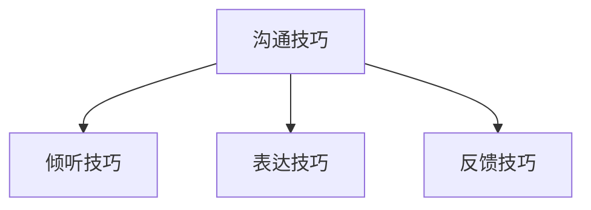
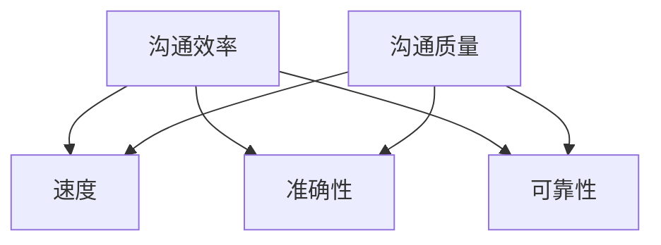
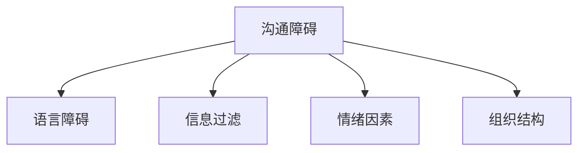

                 

# 团队沟通技巧：提高沟通效率和质量

关键词：团队沟通、沟通技巧、沟通效率、沟通质量、跨文化沟通

摘要：
在快速变化的现代职场中，团队沟通是确保项目成功、提高工作效率和质量的关键因素。本文旨在探讨团队沟通的重要性，分析常见的沟通问题，并提出有效的沟通技巧和策略，以帮助团队实现高效的沟通，提高整体绩效。

## 第一部分：背景介绍

### 问题背景

在现代职场中，团队沟通是确保项目成功、提高工作效率和质量的关键因素。无论是跨部门协作，还是团队内部沟通，有效的沟通技巧都是必不可少的。有效的团队沟通能够促进团队成员之间的协作，减少误解和冲突，提高团队的工作效率和项目成功率。然而，许多团队在沟通中常常遇到各种问题，如信息传达不清、沟通效率低下、误解频发等，这些问题严重影响了团队的整体绩效。

#### 问题描述

团队沟通问题主要包括以下方面：

1. **信息传达不畅**：团队成员之间缺乏有效沟通，导致信息传达不完整或不准确。
2. **沟通效率低**：团队成员沟通频率低，沟通时间成本高，无法及时解决问题。
3. **误解和冲突**：沟通中的误解和情绪问题，导致团队成员之间的冲突和不和谐。
4. **缺乏沟通技巧**：团队成员缺乏必要的沟通技巧，导致沟通效果不佳。

#### 问题解决

为了解决这些问题，我们需要提高团队沟通技巧。本书将围绕以下几个方面进行探讨：

1. **沟通基础**：介绍沟通的基本概念、原则和方法，为后续的技巧提升打下基础。
2. **有效沟通技巧**：详细讲解如何提高沟通效率和质量，包括倾听技巧、表达技巧、非语言沟通等。
3. **沟通障碍与解决方法**：分析常见的沟通障碍，并提供相应的解决方法。
4. **跨文化沟通**：探讨不同文化背景下的沟通特点，提供跨文化沟通策略。
5. **团队沟通工具与技术**：介绍现代团队常用的沟通工具和技术，帮助团队实现高效沟通。

### 边界与外延

本书主要关注团队内部沟通，不包括跨团队或跨组织沟通。此外，本书不涉及沟通技术层面的内容，如通信协议和网络技术。

### 概念结构与核心要素组成

- **沟通**：信息传递和交流的过程。
- **沟通技巧**：有效沟通所需的知识、技能和态度。
- **沟通效率**：单位时间内沟通的信息量。
- **沟通质量**：沟通信息的准确性和可靠性。
- **沟通障碍**：影响有效沟通的各种因素。

## 第二部分：核心概念与联系

### 2.1 沟通技巧

#### 概念原理

沟通技巧是指个人在沟通过程中运用的一系列知识和技能，包括但不限于倾听、表达、反馈等。这些技巧的掌握对于提高沟通效率和质量至关重要。

#### 概念属性特征对比表格

| 特征       | 高效率沟通技巧（高效率）           | 低效率沟通技巧（低效率）           |
|------------|-----------------------------|-----------------------------|
| 倾听技巧   | 专注、积极反馈、理解对方意图 | 被动听、心不在焉、错过关键点 |
| 表达技巧   | 清晰、准确、简洁            | 含糊、冗长、不清晰          |
| 反馈技巧   | 及时、建设性、尊重对方      | 缓迟、消极、侮辱性          |

#### 概念关系图

### 2.2 沟通效率与质量

#### 概念原理

沟通效率是指单位时间内沟通的信息量，沟通质量是指沟通信息的准确性和可靠性。高效的沟通能够快速传递重要信息，确保信息的准确性和可靠性。

#### 概念属性特征对比表格

| 特征       | 高效率沟通             | 低效率沟通             |
|------------|-----------------------|-----------------------|
| 速度       | 快速                  | 缓慢                  |
| 准确性     | 信息准确无误          | 信息失真、有误        |
| 可靠性     | 信息传递稳定可靠      | 信息传递中断或不稳定  |

#### 概念关系图

### 2.3 沟通障碍

#### 概念原理

沟通障碍是指在沟通过程中，由于各种原因导致信息传递受阻或失真的现象。沟通障碍可以分为内部沟通障碍和外部沟通障碍。

#### 概念属性特征对比表格

| 特征       | 内部沟通障碍           | 外部沟通障碍           |
|------------|-----------------------|-----------------------|
| 语言障碍   | 术语理解不一致、方言差异 | 语言不通、文化差异    |
| 信息过滤   | 沟通中的信息选择性传播 | 沟通渠道不畅、信息滞后 |
| 情绪因素   | 沟通中的情绪干扰      | 文化、背景差异导致的情绪理解偏差 |
| 组织结构   | 级别层次、组织结构复杂 | 跨组织沟通中的权限问题 |

#### 概念关系图

## 第三部分：沟通基础

### 沟通的基本概念

沟通是指信息在个人、团队和组织之间的传递和交流过程。沟通的基本要素包括信息的发送者、信息的接收者、信息的内容和沟通的渠道。

#### 沟通的要素

1. **信息的发送者**：信息沟通的发起者，负责制定信息内容和传递方式。
2. **信息的接收者**：信息沟通的终点，负责接收、理解和反馈信息。
3. **信息的内容**：信息沟通的核心，包括事实、观点、情感等。
4. **沟通的渠道**：信息传递的媒介，包括语言、文字、肢体语言等。

#### 沟通的类型

1. **正式沟通**：通过正式的渠道进行的沟通，如会议、报告、邮件等。
2. **非正式沟通**：通过非正式的渠道进行的沟通，如闲聊、社交媒体等。
3. **上行沟通**：从下级到上级的沟通，如汇报工作、提建议等。
4. **下行沟通**：从上级到下级的沟通，如指示、通知、命令等。
5. **横向沟通**：同级别之间的沟通，如部门之间的协调、合作等。

### 沟通的原则

1. **目的明确**：在沟通过程中，明确沟通的目的和目标，确保信息的传递具有针对性和有效性。
2. **信息准确**：确保信息的准确性和完整性，避免误解和歧义。
3. **及时沟通**：及时进行沟通，避免信息滞后和沟通不畅。
4. **相互尊重**：尊重沟通双方的立场和意见，建立良好的沟通氛围。
5. **有效反馈**：及时给予反馈，确保信息的理解和执行。

### 沟通的方法

1. **倾听技巧**：积极倾听，理解对方意图，避免打断和误解。
2. **表达技巧**：清晰、准确、简洁地表达自己的观点和意见。
3. **反馈技巧**：及时、建设性地反馈，避免负面和攻击性的语言。
4. **非语言沟通**：注意肢体语言、面部表情和语气等非语言因素，增强沟通效果。

## 第四部分：有效沟通技巧

### 倾听技巧

倾听是沟通的重要组成部分，有效的倾听能够帮助我们更好地理解对方，减少误解和冲突。以下是一些提高倾听技巧的方法：

1. **专注倾听**：在沟通时，将注意力集中在对方的话语上，避免分心和干扰。
2. **积极反馈**：通过点头、眼神接触和简短的回应，表达你在认真倾听。
3. **理解意图**：试图理解对方的真实意图和需求，而不仅仅是表面的言辞。
4. **避免打断**：在对方讲话时，避免插话或打断，等待对方完成表达。
5. **提问和澄清**：在必要时，通过提问和澄清来确保你对信息的理解是正确的。

### 表达技巧

清晰、准确、简洁的表达是有效沟通的关键。以下是一些提高表达技巧的方法：

1. **明确目的**：在表达之前，明确你的目的和想要传达的信息。
2. **简洁表达**：用简单、明了的语言表达观点，避免冗长和复杂的句子。
3. **逻辑清晰**：确保你的表达具有逻辑性，易于理解。
4. **适当使用举例**：通过具体的例子来说明你的观点，增强说服力。
5. **注意语气和语调**：使用恰当的语气和语调，表达尊重和理解。

### 反馈技巧

及时、建设性的反馈是有效沟通的重要组成部分。以下是一些提高反馈技巧的方法：

1. **及时反馈**：在对方表达后，及时给予反馈，避免延迟。
2. **建设性反馈**：提供有建设性的反馈，指出优点和改进的空间。
3. **尊重对方**：在反馈时，保持尊重和客观，避免负面和攻击性的语言。
4. **针对行为而非个人**：在反馈时，关注行为和结果，而不是攻击个人。
5. **鼓励对话**：鼓励对方提出反馈，促进双向沟通。

### 非语言沟通

非语言沟通是沟通的重要组成部分，包括肢体语言、面部表情、语调等。以下是一些提高非语言沟通技巧的方法：

1. **肢体语言**：注意肢体语言，如姿势、手势和面部表情，与言语表达一致。
2. **眼神交流**：适当的眼神交流可以增强沟通的互动性和信任感。
3. **语调变化**：通过语调的变化，如语气、节奏和音量，表达不同的情感和意图。
4. **环境适应**：根据不同的沟通环境和文化背景，调整非语言沟通方式。

## 第五部分：沟通障碍与解决方法

### 常见的沟通障碍

在团队沟通中，常见的沟通障碍包括：

1. **语言障碍**：包括术语理解不一致、方言差异、语言不通等。
2. **信息过滤**：包括沟通中的信息选择性传播、沟通渠道不畅、信息滞后等。
3. **情绪因素**：包括沟通中的情绪干扰、文化、背景差异导致的情绪理解偏差等。
4. **组织结构**：包括级别层次、组织结构复杂、跨组织沟通中的权限问题等。

### 解决方法

针对上述沟通障碍，可以采取以下解决方法：

1. **语言障碍**：
   - **使用简明语言**：使用简单、明了的语言，避免专业术语和复杂的句子。
   - **提供语言培训**：为团队成员提供语言培训，提高语言理解和表达能力。
   - **使用辅助工具**：使用翻译工具或翻译人员，帮助解决语言不通的问题。

2. **信息过滤**：
   - **建立明确的沟通渠道**：确保信息传递的渠道是明确和畅通的，避免信息滞后和失真。
   - **鼓励开放沟通**：建立开放、透明的沟通环境，鼓励团队成员自由表达意见和反馈。
   - **减少信息过滤环节**：简化信息传递的环节，减少信息在传递过程中的失真和过滤。

3. **情绪因素**：
   - **培养情绪智商**：提高团队成员的情绪智商，学会管理自己的情绪，减少情绪干扰。
   - **提供情绪支持**：为团队成员提供情绪支持，鼓励他们表达情感和寻求帮助。
   - **建立积极的沟通氛围**：创造一个积极、包容的沟通氛围，减少误解和冲突。

4. **组织结构**：
   - **简化组织结构**：简化组织结构，减少层级和部门之间的障碍。
   - **明确职责和权限**：明确团队成员的职责和权限，避免权限不清导致的沟通障碍。
   - **加强跨部门沟通**：加强跨部门之间的沟通，促进部门之间的协作和合作。

## 第六部分：跨文化沟通

### 跨文化沟通的重要性

在全球化的今天，跨文化沟通已成为现代团队沟通的重要组成部分。有效的跨文化沟通能够促进国际团队的协作和合作，提高项目成功率和团队绩效。然而，不同文化背景下的沟通方式和行为习惯存在差异，因此，了解和掌握跨文化沟通技巧至关重要。

### 跨文化沟通的特点

1. **语言障碍**：不同文化背景下的语言差异，包括词汇、语法和表达方式等。
2. **非语言沟通**：包括肢体语言、面部表情、语调和环境等。
3. **价值观差异**：不同文化背景下的价值观和信仰差异，影响沟通的内容和方式。
4. **沟通风格差异**：不同文化背景下的沟通风格和习惯差异，如直接与间接沟通、集体主义与个人主义等。

### 跨文化沟通策略

1. **了解文化差异**：了解不同文化背景下的价值观、信仰、习俗和行为方式，提高跨文化沟通的敏感性和适应性。
2. **尊重文化差异**：尊重不同文化的差异，避免对对方文化的不理解和歧视。
3. **使用简明语言**：使用简单、明了的语言，避免复杂和模糊的表达，减少误解和歧义。
4. **注意非语言沟通**：注意不同文化背景下的非语言沟通，如肢体语言、面部表情和语调等，确保信息的准确传递。
5. **建立信任和合作关系**：通过建立信任和合作关系，增强跨文化沟通的效果和效率。

## 第七部分：团队沟通工具与技术

### 团队沟通工具

在现代职场中，团队沟通工具的应用至关重要。以下是一些常用的团队沟通工具：

1. **电子邮件**：用于正式的沟通，如项目报告、会议通知等。
2. **即时通讯工具**：如微信、Slack、Microsoft Teams等，用于实时沟通和协作。
3. **视频会议工具**：如Zoom、Microsoft Teams、Google Meet等，用于远程团队会议和协作。
4. **项目管理工具**：如Trello、Asana、Jira等，用于任务管理和项目进度跟踪。

### 技术应用

1. **自动化工具**：使用自动化工具，如IFTTT、 Zapier等，实现沟通工具之间的自动化整合，提高沟通效率。
2. **数据分析工具**：使用数据分析工具，如Google Analytics、Tableau等，分析团队沟通数据，优化沟通策略。
3. **人工智能技术**：使用人工智能技术，如自然语言处理（NLP）、机器学习等，提高沟通的自动化和智能化水平。

### 技术优势

1. **提高沟通效率**：使用团队沟通工具，可以快速、便捷地进行信息传递和交流，减少沟通时间和成本。
2. **增强协作能力**：通过即时通讯、视频会议等工具，团队成员可以实时协作，提高工作效率和质量。
3. **优化沟通管理**：使用项目管理工具，可以更好地管理团队沟通，跟踪项目进度，提高项目管理水平。

## 第八部分：案例分析与实战应用

### 案例背景

某科技公司团队在进行一个重要的跨文化项目时，遇到了沟通障碍。团队成员来自不同的国家，语言和文化背景差异较大，导致项目进度缓慢，沟通效率低下。

### 案例分析

1. **语言障碍**：团队成员的语言差异导致沟通不顺畅，信息传递不准确。
2. **文化差异**：不同的文化背景影响了团队成员的沟通风格和习惯，导致误解和冲突。
3. **沟通渠道**：项目初期，团队缺乏明确的沟通渠道，信息传递不畅。

### 解决方案

1. **语言培训**：为团队成员提供语言培训，提高语言理解和表达能力。
2. **跨文化沟通培训**：组织跨文化沟通培训，帮助团队成员了解和尊重不同文化背景下的沟通方式和习惯。
3. **建立明确的沟通渠道**：制定明确的沟通流程和渠道，确保信息传递畅通。

### 实战应用

1. **使用即时通讯工具**：使用Slack等即时通讯工具，方便团队成员实时沟通和协作。
2. **定期视频会议**：定期组织视频会议，确保团队成员之间的沟通和协作。
3. **使用项目管理工具**：使用Trello等项目管理工具，跟踪项目进度，确保项目按时完成。

### 实战效果

通过上述措施，团队沟通效率显著提高，项目进度加快，团队成员之间的误解和冲突减少，项目最终顺利完成。

## 第九部分：最佳实践与注意事项

### 最佳实践

1. **制定明确的沟通计划**：在项目开始前，制定详细的沟通计划，明确沟通的目标、内容和方式。
2. **建立沟通反馈机制**：建立沟通反馈机制，及时收集和反馈团队成员的意见和问题，优化沟通效果。
3. **提供沟通培训**：定期为团队成员提供沟通培训，提高沟通技巧和能力。

### 注意事项

1. **尊重文化差异**：在跨文化沟通中，尊重文化差异，避免对对方文化的不理解和歧视。
2. **注意沟通方式**：根据不同的情况和对象，选择合适的沟通方式和工具，提高沟通效果。
3. **保持沟通的开放性**：保持沟通的开放性，鼓励团队成员自由表达意见和反馈，促进团队协作。

## 第十部分：小结与拓展阅读

### 小结

本文围绕团队沟通技巧，从背景介绍、核心概念与联系、沟通基础、有效沟通技巧、沟通障碍与解决方法、跨文化沟通、团队沟通工具与技术、案例分析与实战应用、最佳实践与注意事项等方面进行了详细阐述。通过掌握有效的沟通技巧和策略，团队可以更好地实现信息传递和交流，提高工作效率和质量。

### 拓展阅读

1. 《沟通的艺术》 - 古德曼，D. M.，提供全面的沟通技巧和策略。
2. 《跨文化沟通》 - 布莱克，D. S.，深入探讨跨文化沟通的挑战和策略。
3. 《高效能人士的七个习惯》 - 史蒂芬·柯维，提供个人和团队沟通的有效方法。

## 参考文献

1. 古德曼，D. M. (2016). 《沟通的艺术》。北京：人民邮电出版社。
2. 布莱克，D. S. (2017). 《跨文化沟通》。上海：上海译文出版社。
3. 史蒂芬·柯维 (2015). 《高效能人士的七个习惯》。北京：中国青年出版社。

## 作者信息

作者：AI天才研究院/AI Genius Institute & 禅与计算机程序设计艺术 /Zen And The Art of Computer Programming

作者简介：AI天才研究院致力于推动人工智能技术的发展和应用，本研究院汇集了一批全球顶尖的人工智能专家，致力于解决复杂的人工智能问题。同时，作者也是《禅与计算机程序设计艺术》的资深大师，对计算机科学和人工智能领域有深入的研究和丰富的实践经验。

