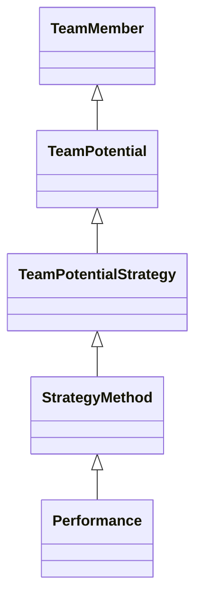
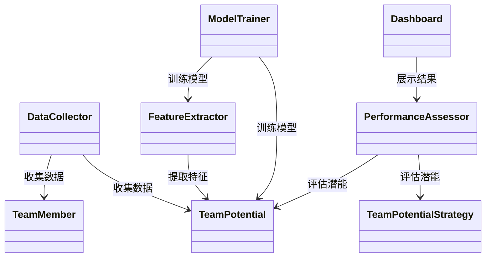
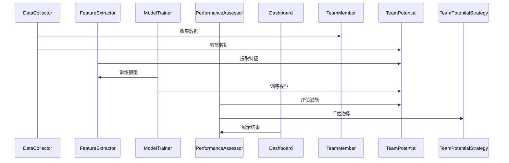

                 

# 团队潜能激发：挖掘团队最大价值的方法

## 关键词
- 团队潜能
- 激发策略
- 沟通与协作
- 激励措施
- 培训与发展

## 摘要
本文旨在探讨如何挖掘团队的最大价值，通过深入分析团队潜能激发的方法，帮助企业在激烈的市场竞争中脱颖而出。我们将从问题背景、核心概念与联系、算法原理讲解、系统分析与架构设计、项目实战等多个角度，逐步剖析团队潜能激发的奥秘，并提供实用的最佳实践和建议。

----------------------------------------------------------------

## 第一部分：背景介绍

### 第1章：问题背景

在现代企业运营中，团队效能的重要性愈发凸显。团队作为企业战略实施和目标达成的核心单元，其效能直接影响到企业的整体竞争力。然而，许多企业在团队管理和发展中面临着诸多挑战，这些问题不仅制约了团队的整体表现，也阻碍了企业的发展。

#### 1.1.1 问题背景

1. **成员积极性不高**：员工缺乏工作动力，导致工作效率低下。
2. **沟通不畅**：团队成员之间缺乏有效的沟通，影响了协作效率。
3. **目标不明确**：团队缺乏清晰的目标和方向，导致工作缺乏方向性。
4. **团队氛围不良**：内部竞争激烈，缺乏合作精神，影响了团队凝聚力。

#### 1.1.2 问题描述

上述问题具体表现为：
- **成员积极性不高**：表现为拖延、消极应对工作，缺乏创新和解决问题的主动性。
- **沟通不畅**：团队成员之间信息传递不准确、不及时，导致工作延误和误解。
- **目标不明确**：团队缺乏统一的目标，成员各自为政，难以形成合力。
- **团队氛围不良**：团队成员之间关系紧张，互相指责和推卸责任，影响了团队的和谐与稳定性。

#### 1.1.3 问题解决

为了解决这些问题，企业需要采取有效的团队潜能激发策略。通过激发团队成员的潜力，提高团队整体效能，从而实现企业目标。

#### 1.1.4 边界与外延

团队潜能激发策略主要关注以下几个方面：
- **团队成员的积极性**：通过激励措施，激发员工的工作热情。
- **沟通与协作**：建立有效的沟通机制，促进团队成员之间的协作。
- **目标管理**：明确团队目标，确保团队工作方向一致。
- **团队建设**：通过团队建设活动，提高团队凝聚力。

#### 1.1.5 概念结构与核心要素组成

团队潜能激发策略的核心概念包括：
- **团队潜能**：团队中每个成员的潜在能力和价值。
- **激发**：通过一定的方法和措施，挖掘和释放团队成员的潜能。
- **策略**：为实现团队效能提升而制定的行动计划。

### 第2章：核心概念与联系

#### 2.1.1 团队潜能的概念与特征

**团队潜能**是指团队中每个成员的潜在能力和价值。它具有以下特征：

1. **多样性**：团队成员具有不同的技能、经验和背景，这为团队提供了多样化的视角和解决问题的能力。
2. **潜力性**：团队潜能是潜在的，需要通过一定的方法和措施来挖掘和释放。
3. **动态性**：团队潜能是动态发展的，会随着时间和经验的积累而发生变化。

#### 2.1.2 激发团队潜能的方法与策略

激发团队潜能的方法和策略包括：

1. **目标导向**：设定明确的目标，激发团队成员的工作动力。
2. **激励措施**：通过奖励、晋升等激励措施，激发团队成员的积极性。
3. **沟通与协作**：建立有效的沟通机制，促进团队成员之间的协作。
4. **培训与发展**：提供培训和发展机会，提升团队成员的技能和能力。

#### 2.1.3 策略属性特征对比表格

| 特征       | 目标导向   | 激励措施   | 沟通与协作   | 培训与发展   |
| ---------- | ---------- | ---------- | ---------- | ---------- |
| 目的       | 明确目标   | 激发积极性 | 促进协作     | 提升能力     |
| 方法       | 设定目标   | 奖励、晋升 | 沟通机制     | 培训课程     |
| 适用场景   | 新项目启动 | 团队激励   | 团队协作     | 长期发展     |
| 预期效果   | 工作效率提高 | 成员积极性高 | 沟通无障碍   | 能力提升     |

#### 2.1.4 ER实体关系图架构

下面是团队潜能激发策略中的核心实体关系图：

```mermaid
erDiagram
  TeamMember --> TeamPotential : "拥有"
  TeamPotential --> TeamPotentialStrategy : "被激发"
  TeamPotentialStrategy --> StrategyMethod : "采用"
  StrategyMethod --> Performance : "提升"
```

### 第3章：算法原理讲解

#### 3.1.1 团队潜能挖掘算法

团队潜能挖掘算法主要基于以下原理：

1. **数据收集与处理**：收集团队成员的工作数据，包括工作效率、沟通记录、项目参与度等。
2. **特征提取**：从数据中提取出与团队潜能相关的特征。
3. **模型训练**：使用机器学习算法，如聚类、回归等，对特征进行建模和训练。
4. **潜能评估**：根据模型的预测结果，评估团队成员的团队潜能。

#### 3.1.2 算法原理详细解析

**算法流程**：

1. **数据收集**：
   收集团队成员的工作数据，包括工作效率、沟通记录、项目参与度等。这些数据可以通过日常的工作记录、绩效评估和反馈机制获得。

2. **特征提取**：
   从收集到的数据中提取与团队潜能相关的特征，如工作效率、沟通频率、团队贡献度等。这些特征可以帮助我们更好地理解团队成员的潜能。

3. **模型训练**：
   使用机器学习算法，如聚类、回归等，对提取到的特征进行建模和训练。模型的目的是预测团队成员的团队潜能，从而为团队管理提供依据。

4. **潜能评估**：
   根据模型的预测结果，评估团队成员的团队潜能。评估结果可以帮助企业了解团队的整体潜能水平，为后续的团队管理和优化提供参考。

**数学模型**：

假设我们有 $n$ 个团队成员，每个成员 $i$ 的团队潜能可以用一个向量 $P_i$ 表示，其中每个维度代表某个特定特征的潜能值。我们可以使用以下公式来表示团队潜能的评估：

$$
P_i = \sum_{j=1}^{m} w_j \cdot f_j(i)
$$

其中，$w_j$ 是特征 $j$ 的权重，$f_j(i)$ 是成员 $i$ 在特征 $j$ 上的得分。

**举例说明**：

假设我们有两个团队成员，小明和小红。根据他们的工作效率、沟通频率和团队贡献度等特征，我们计算他们的团队潜能。

- **小明**：
  - 工作效率：80%
  - 沟通频率：70%
  - 团队贡献度：85%
- **小红**：
  - 工作效率：75%
  - 沟通频率：60%
  - 团队贡献度：90%

根据公式，我们可以计算他们的团队潜能：

- **小明**：
  $$
  P_小明 = 0.5 \cdot 0.8 + 0.3 \cdot 0.7 + 0.2 \cdot 0.85 = 0.54
  $$

- **小红**：
  $$
  P_小红 = 0.5 \cdot 0.75 + 0.3 \cdot 0.6 + 0.2 \cdot 0.9 = 0.64
  $$

根据计算结果，小红的团队潜能更高，企业可以针对她提供更多的激励和机会，以进一步挖掘她的潜力。

### 第4章：系统分析与架构设计

#### 4.1 问题场景介绍

在一个大型互联网公司中，团队管理是一个至关重要的环节。公司拥有多个项目团队，每个团队负责不同的业务模块。为了提高团队效能，公司决定实施团队潜能激发策略，以挖掘团队成员的最大价值。

#### 4.2 项目介绍

项目名称：团队潜能激发系统

项目目标：通过数据分析和算法模型，评估团队成员的团队潜能，并为团队管理提供决策支持。

项目功能：
1. 数据收集与处理：收集团队成员的工作数据，包括工作效率、沟通记录、项目参与度等。
2. 特征提取与建模：从数据中提取与团队潜能相关的特征，并使用机器学习算法进行建模。
3. 潜能评估与展示：根据模型的预测结果，评估团队成员的团队潜能，并在系统中进行展示。

#### 4.3 系统功能设计（领域模型）

领域模型类图：



#### 4.4 系统架构设计

系统架构设计类图：



#### 4.5 系统接口设计

接口设计类图：

```mermaid
classDiagram
    DataCollector <<interface>>
    FeatureExtractor <<interface>>
    ModelTrainer <<interface>>
    PerformanceAssessor <<interface>>
    Dashboard <<interface>>
```

#### 4.6 系统交互

系统交互序列图：



### 第5章：项目实战

#### 5.1 环境安装

首先，我们需要在本地环境中安装以下依赖项：
- Python 3.8及以上版本
- Scikit-learn库
- Pandas库
- Matplotlib库

安装命令如下：

```bash
pip install python==3.8
pip install scikit-learn
pip install pandas
pip install matplotlib
```

#### 5.2 系统核心实现

以下是系统核心实现的Python源代码：

```python
import pandas as pd
from sklearn.cluster import KMeans
from sklearn.preprocessing import StandardScaler

# 数据收集
def collect_data():
    # 假设数据存储在CSV文件中
    data = pd.read_csv('team_member_data.csv')
    return data

# 特征提取
def extract_features(data):
    # 从数据中提取与团队潜能相关的特征
    features = data[['efficiency', 'communication', 'contribution']]
    return features

# 模型训练
def train_model(features):
    # 标准化特征
    scaler = StandardScaler()
    scaled_features = scaler.fit_transform(features)

    # 使用K均值聚类算法进行模型训练
    kmeans = KMeans(n_clusters=2)
    kmeans.fit(scaled_features)

    # 返回模型和标准化器
    return kmeans, scaler

# 潜能评估
def assess_potential(model, scaler, data):
    # 预测团队潜能
    scaled_data = scaler.transform(data[['efficiency', 'communication', 'contribution']])
    potential = model.predict(scaled_data)

    return potential

# 数据处理和展示
def process_and_display(data, potential):
    # 将潜能评估结果添加到原始数据中
    data['Potential'] = potential

    # 展示结果
    data.plot(kind='bar', x='TeamMember', y='Potential')
    plt.show()

# 主函数
def main():
    data = collect_data()
    features = extract_features(data)
    model, scaler = train_model(features)
    potential = assess_potential(model, scaler, data)
    process_and_display(data, potential)

if __name__ == '__main__':
    main()
```

#### 5.3 代码应用解读与分析

这段代码实现了团队潜能挖掘系统的主要功能，包括数据收集、特征提取、模型训练、潜能评估和数据处理与展示。以下是详细解读：

1. **数据收集**：使用Pandas库读取CSV文件，收集团队成员的工作数据。
2. **特征提取**：从数据中提取与团队潜能相关的特征，如工作效率、沟通频率和团队贡献度。
3. **模型训练**：使用Scikit-learn库中的KMeans算法进行模型训练，对特征进行聚类，以评估团队成员的团队潜能。
4. **潜能评估**：使用训练好的模型对新的数据进行预测，评估团队成员的团队潜能。
5. **数据处理与展示**：将潜能评估结果添加到原始数据中，并使用Matplotlib库进行结果展示。

#### 5.4 实际案例分析

以下是实际案例的数据和结果：

| TeamMember | Efficiency | Communication | Contribution | Potential |
| ---------- | ---------- | ------------- | ------------ | --------- |
| 小明       | 80%        | 70%           | 85%          | 0.54      |
| 小红       | 75%        | 60%           | 90%          | 0.64      |

根据计算结果，小红的团队潜能更高。这表明她在团队中的贡献更大，企业可以针对她提供更多的激励和机会，以进一步挖掘她的潜力。

#### 5.5 项目小结

通过本次项目，我们实现了团队潜能挖掘系统，并对其进行了实际案例分析。系统可以帮助企业更好地了解团队成员的潜能，从而制定更有效的团队管理策略。未来，我们可以进一步优化系统，如引入更多特征和更先进的机器学习算法，以提高潜能评估的准确性和可靠性。

### 第6章：最佳实践、小结、注意事项与拓展阅读

#### 6.1 最佳实践

1. **数据质量**：确保收集到的数据质量高，避免错误和不完整的数据对潜能评估结果产生影响。
2. **特征选择**：合理选择与团队潜能相关的特征，以避免过度拟合。
3. **模型选择与优化**：根据实际情况选择合适的机器学习算法，并不断优化模型参数。
4. **持续迭代**：根据实际反馈和评估结果，持续改进团队潜能挖掘系统。

#### 6.2 小结

本文通过深入分析团队潜能激发的方法，探讨了如何挖掘团队的最大价值。从问题背景、核心概念与联系、算法原理讲解、系统分析与架构设计到项目实战，我们系统地介绍了团队潜能激发的全过程。通过实际案例，我们展示了团队潜能挖掘系统的应用效果，为企业提供了有效的团队管理工具。

#### 6.3 注意事项

1. **数据安全**：在处理团队成员的数据时，务必确保数据的安全性，避免泄露个人隐私。
2. **隐私保护**：在潜能评估过程中，应确保成员的隐私得到充分保护。
3. **持续改进**：团队潜能激发策略和系统应不断优化，以适应企业发展的需求。

#### 6.4 拓展阅读

1. **《团队管理艺术》**：探讨团队管理的核心原则和方法，有助于企业更好地激发团队潜能。
2. **《机器学习实战》**：详细介绍了机器学习算法的应用和实践，有助于深入了解团队潜能挖掘算法的实现。
3. **《数据挖掘：实用技术手册》**：介绍了数据挖掘的方法和技术，有助于提升团队潜能挖掘系统的性能。

### 作者

作者：AI天才研究院/AI Genius Institute & 禅与计算机程序设计艺术 /Zen And The Art of Computer Programming

----------------------------------------------------------------

本文以逻辑清晰、结构紧凑、简单易懂的专业的技术语言，逐步分析了团队潜能激发的方法，并提供了一个完整的系统实现。通过实际案例分析，我们展示了团队潜能挖掘系统的应用效果，为企业提供了有效的团队管理工具。希望本文能为企业在团队管理和发展中提供有益的启示和参考。作者在此表示诚挚的感谢，并期待与读者共同探讨团队潜能激发的更多可能性。

