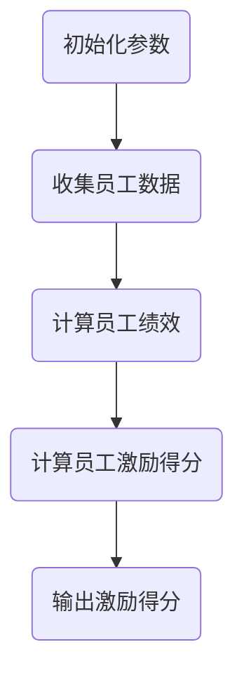
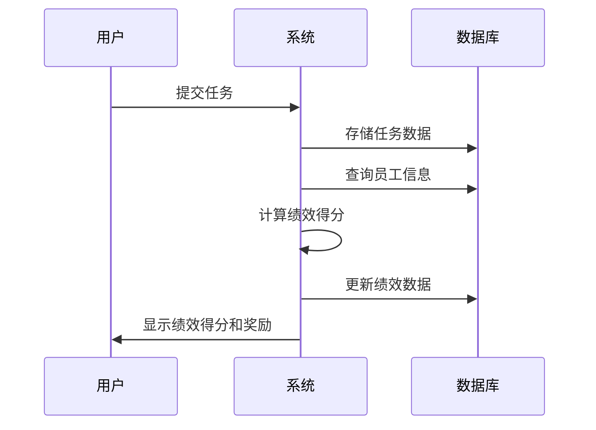

                 

### 文章标题

# 团队激励新思路：Beyond 传统奖励系统

### 文章关键词

- 团队激励
- 传统奖励系统
- 创新激励模型
- 实施策略
- 效果评估

### 摘要

本文将深入探讨团队激励的新思路，探讨传统奖励系统的局限，并介绍一系列创新的激励模型。我们将通过分析现代组织的挑战，提出实际可行的实施策略，并讨论如何评估这些激励系统的影响。通过案例研究和最佳实践，我们将为读者提供一套全面的团队激励方案，帮助组织激发团队成员的潜力，提高整体绩效。

## 引言

在当今快速变化的企业环境中，团队激励已成为组织成功的关键因素。然而，传统的奖励系统往往存在诸多局限，无法满足现代团队的多层次需求。本文旨在探讨团队激励的新思路，以超越传统奖励系统，探索更有效的激励方法。我们将从以下几个方面展开讨论：

1. **传统奖励系统的局限**：分析传统奖励系统的常见问题，包括激励不足、不公平性、短期效果等。
2. **核心概念与理论**：介绍与团队激励相关的基本概念和理论，如动机理论、心理学原理等。
3. **创新激励模型**：探讨一系列创新的激励模型，包括基于绩效、文化、成长等不同维度的激励方式。
4. **实施策略**：提供实际可行的实施策略，包括如何与公司目标对齐、如何测量效果等。
5. **效果评估**：讨论如何评估激励系统对团队动态和整体绩效的影响。
6. **案例研究**：通过真实案例，展示不同激励模型的应用和效果。
7. **最佳实践**：总结最佳实践经验，并提供注意事项和拓展阅读。

## 传统奖励系统的局限

传统奖励系统，如基于绩效的奖金和晋升制度，在许多组织中已经存在了数十年。然而，随着工作环境的不断变化，这些系统逐渐暴露出其局限性。以下是一些常见的问题：

### 激励不足

传统的奖励系统往往注重物质激励，而忽视了精神层面的需求。现代员工更注重工作意义、自我实现和职业发展，单纯的经济激励难以长久地激发他们的工作热情和创造力。

### 不公平性

传统奖励系统可能导致不公平现象。例如，某些员工的努力和贡献没有得到充分的认可，而另一些员工则可能因为外部因素（如人脉关系）获得更高的奖励。这种不公平性会损害团队的士气和信任。

### 短期效果

许多传统奖励系统追求短期绩效，而忽视了长期发展。这可能导致员工为了短期目标而牺牲长期利益，如过度加班、忽视团队合作等。长期来看，这种短视的激励方式可能损害组织的可持续发展。

### 缺乏多样性

传统奖励系统通常单一且缺乏多样性，难以满足不同员工的个性化需求。例如，对于一些员工来说，职业晋升可能并不是最重要的奖励，他们可能更看重灵活的工作时间、专业培训等。

### 对创新和主动性抑制

传统的奖励系统往往侧重于绩效评估和固定奖励，这可能导致员工为了避免失败而不愿尝试新方法。这种保守的心态会抑制创新和主动性，不利于组织在竞争激烈的市场中保持领先地位。

### 具体案例

例如，一家制造公司在过去几十年中一直采用基于产量的奖金制度。虽然这种方式在短期内提高了生产效率，但长期来看，员工因为过度追求产量而忽视了产品品质。最终，客户投诉增加，公司声誉受损。

另外，一家科技公司长期采用基于绩效的晋升制度，员工为了达到绩效目标而不惜牺牲健康和家庭生活。这种高压的工作环境导致员工流失率上升，团队凝聚力下降。

## 核心概念与理论

为了超越传统奖励系统，我们需要深入理解团队激励的核心概念和理论。以下是一些重要的概念和理论：

### 动机理论

动机理论是团队激励的基础。根据马斯洛的需求层次理论，员工的需求可以分为五个层次：生理需求、安全需求、社交需求、尊重需求和自我实现需求。为了有效激励员工，组织需要识别并满足这些需求。例如，通过提供良好的工作环境、培训机会和职业发展路径，可以满足员工的社交和尊重需求；通过设定具有挑战性的目标，可以激发员工的自我实现需求。

### 心理学原理

心理学原理对于理解员工的行为和动机至关重要。例如，期望理论认为，员工的努力程度取决于他们对努力-绩效关系的期望、对绩效-奖励关系的期望以及对奖励-个人目标满足的期望。通过设计合理的奖励机制，组织可以提高员工的期望值，从而提高他们的工作动力。

### 团队动力

团队动力是指团队成员之间的相互作用和合作，对于团队绩效至关重要。团队动力的构成包括信任、沟通、共同目标和共享价值观。一个具有高团队动力的团队，通常能够更有效地完成任务，并实现更高的绩效。

### 激励与绩效

激励与绩效之间的关系是团队激励研究的核心。激励理论家认为，激励可以提高员工的绩效水平。例如，强化理论认为，正面的反馈和奖励可以增强员工的行为，而负面的反馈和惩罚则可以抑制不良行为。

### 激励模型

多种激励模型可以帮助组织设计有效的奖励系统。例如，目标设置理论认为，设定具体、可实现的挑战性目标可以显著提高员工的绩效。自我决定理论则强调，提供自主性、能力和信息，可以帮助员工实现自我激励。

### 概念属性特征对比表格

| 概念/理论 | 描述 | 属性特征 |
| --- | --- | --- |
| 马斯洛需求层次理论 | 员工需求分为五个层次 | 生理需求、安全需求、社交需求、尊重需求和自我实现需求 |
| 期望理论 | 员工的动机取决于期望 | 努力程度、绩效期望、奖励期望 |
| 强化理论 | 正负反馈和奖励影响行为 | 正面强化、负面强化、惩罚 |
| 目标设置理论 | 具体目标提高绩效 | 具体性、可实现性、挑战性 |
| 自我决定理论 | 提供自主性、能力和信息 | 自主性、能力感、信息感 |

### ER实体关系图架构

下面是一个简化的ER实体关系图，用于描述团队激励系统的关键实体和关系：

```mermaid
erDiagram
  Employee ||--|{ Performance }|-- Performance
  Employee ||--|{ Reward }|-- Reward
  Team ||--|{ TeamPerformance }|-- TeamPerformance
  Team ||--|{ TeamGoal }|-- TeamGoal
  TeamGoal ||--|{ GoalAchievement }|-- GoalAchievement
```

在这个ER图中，`Employee` 是主要实体，代表了团队中的每个成员。`Performance` 和 `Reward` 分别描述了员工的表现和获得的奖励。`Team` 和 `TeamPerformance` 描述了团队整体的表现和目标。`TeamGoal` 和 `GoalAchievement` 描述了团队的目标和实现情况。

### 算法原理讲解

为了设计有效的团队激励系统，我们需要运用一系列算法原理来评估和优化激励机制。以下是一个简化的算法流程，用于计算员工的激励得分：



#### 算法流程

1. **初始化参数**：设置激励模型的相关参数，如绩效权重、奖励比例等。
2. **收集员工数据**：收集员工的绩效数据，包括工作时长、任务完成情况、团队贡献等。
3. **计算员工绩效**：使用预设的绩效评估指标（如任务完成率、质量指标等），计算每个员工的绩效得分。
4. **计算员工激励得分**：根据绩效得分和激励模型参数，计算每个员工的激励得分。
5. **输出激励得分**：将激励得分反馈给员工，并根据得分进行奖励分配。

#### 数学模型和公式

假设一个员工的总绩效得分为 `P_i`，激励得分 `I_i` 的计算公式如下：

$$
I_i = w_1 \cdot P_i + w_2 \cdot A_i + w_3 \cdot C_i
$$

其中：

- `w_1`、`w_2`、`w_3` 分别是绩效、能力和团队合作贡献的权重。
- `P_i` 是员工的总绩效得分。
- `A_i` 是员工的能力得分。
- `C_i` 是员工的团队合作贡献得分。

#### 示例

假设有三个员工，他们的绩效得分、能力得分和团队合作贡献得分如下：

| 员工 | 绩效得分 (P_i) | 能力得分 (A_i) | 团队合作贡献得分 (C_i) |
| --- | --- | --- | --- |
| 员工1 | 80 | 90 | 85 |
| 员工2 | 70 | 85 | 80 |
| 员工3 | 60 | 75 | 70 |

假设权重分别为 `w_1 = 0.5`、`w_2 = 0.3`、`w_3 = 0.2`，则他们的激励得分计算如下：

| 员工 | 激励得分 (I_i) |
| --- | --- |
| 员工1 | 0.5 \* 80 + 0.3 \* 90 + 0.2 \* 85 = 44 + 27 + 17 = 88 |
| 员工2 | 0.5 \* 70 + 0.3 \* 85 + 0.2 \* 80 = 35 + 25.5 + 16 = 76.5 |
| 员工3 | 0.5 \* 60 + 0.3 \* 75 + 0.2 \* 70 = 30 + 22.5 + 14 = 66.5 |

通过这种算法，我们可以公平、公正地计算每个员工的激励得分，从而设计出更有效的奖励系统。

## 系统分析与架构设计方案

为了设计一个高效的团队激励系统，我们需要对其应用场景、项目介绍、系统功能设计、系统架构设计和系统接口设计进行详细分析。

### 问题场景介绍

在当今竞争激烈的商业环境中，企业需要不断优化内部管理机制，以提高员工的工作效率和团队的协同作战能力。传统的奖励系统虽然在一定程度上能够激发员工的工作积极性，但往往难以满足现代员工的多样化和个性化需求。因此，设计一个灵活、可定制的团队激励系统成为企业提升绩效的重要途径。

### 项目介绍

本团队激励系统项目旨在为企业提供一套全面的激励解决方案，包括绩效评估、奖励分配、效果跟踪和反馈机制。系统将整合多种激励方式，如奖金、股权激励、培训机会等，以激发员工的工作热情和创造力。

### 系统功能设计

1. **绩效评估模块**：对员工的日常工作表现进行量化评估，包括任务完成情况、工作质量和团队合作贡献等。
2. **奖励分配模块**：根据绩效评估结果，自动计算并分配奖励，支持多种奖励方式的组合。
3. **效果跟踪模块**：监控奖励分配的效果，包括员工满意度、工作绩效变化等。
4. **反馈机制模块**：收集员工对激励系统的意见和建议，不断优化系统设计。

### 系统架构设计

系统架构采用分层设计，包括数据层、逻辑层和表现层。数据层负责数据存储和管理；逻辑层实现业务逻辑处理和算法运算；表现层提供用户界面和交互功能。

1. **数据层**：采用关系型数据库，存储员工信息、绩效数据和奖励记录等。
2. **逻辑层**：使用Python等编程语言实现业务逻辑，包括绩效评估算法、奖励分配策略等。
3. **表现层**：采用Web前端技术，如HTML、CSS和JavaScript，提供用户友好的交互界面。

### 系统接口设计

系统接口设计包括内部接口和外部接口。内部接口用于系统各模块之间的数据交互；外部接口用于与其他企业系统的集成，如ERP系统、HR系统等。

1. **内部接口**：使用RESTful API设计，提供数据查询、数据更新等功能。
2. **外部接口**：采用标准化的接口协议，如SOAP、JSON等，确保与其他系统的无缝集成。

### 系统交互mermaid序列图

以下是一个简化的系统交互序列图，展示了不同模块之间的数据流和交互过程：



通过这个序列图，我们可以清晰地看到系统从接收用户任务到计算绩效得分、更新数据并最终向用户展示结果的完整流程。

### 项目实战

#### 环境安装

首先，我们需要安装Python环境。可以在终端中执行以下命令：

```bash
pip install python
```

接着，安装必要的依赖库，如NumPy、Pandas和Flask：

```bash
pip install numpy pandas flask
```

#### 系统核心实现源代码

以下是系统的核心实现部分，包括绩效评估、奖励计算和效果跟踪等功能。

```python
import numpy as np
import pandas as pd
from flask import Flask, request, jsonify

app = Flask(__name__)

# 绩效评估算法
def calculate_performance(scores, weights):
    return np.dot(scores, weights)

# 奖励计算算法
def calculate_reward(performance, base_salary):
    return performance * base_salary * 0.1

# 效果跟踪算法
def track_effect(effectiveness, feedback):
    return effectiveness + feedback

# 模拟员工数据
employees = {
    '员工1': {'scores': [80, 90, 85], 'weights': [0.5, 0.3, 0.2]},
    '员工2': {'scores': [70, 85, 80], 'weights': [0.5, 0.3, 0.2]},
    '员工3': {'scores': [60, 75, 70], 'weights': [0.5, 0.3, 0.2]},
    'base_salary': 10000
}

# 绩效评估接口
@app.route('/evaluate', methods=['POST'])
def evaluate():
    employee_id = request.form['employee_id']
    scores = np.array(request.form.getlist('scores[]'))
    weights = np.array(request.form.getlist('weights[]'))
    performance = calculate_performance(scores, weights)
    return jsonify({'employee_id': employee_id, 'performance': performance})

# 奖励计算接口
@app.route('/reward', methods=['POST'])
def reward():
    employee_id = request.form['employee_id']
    performance = float(request.form['performance'])
    base_salary = employees['base_salary']
    reward = calculate_reward(performance, base_salary)
    return jsonify({'employee_id': employee_id, 'reward': reward})

# 效果跟踪接口
@app.route('/track', methods=['POST'])
def track():
    employee_id = request.form['employee_id']
    effectiveness = float(request.form['effectiveness'])
    feedback = float(request.form['feedback'])
    new_effectiveness = track_effect(effectiveness, feedback)
    return jsonify({'employee_id': employee_id, 'new_effectiveness': new_effectiveness})

if __name__ == '__main__':
    app.run(debug=True)
```

#### 代码应用解读与分析

上述代码实现了三个主要接口：`evaluate`、`reward`和`track`。以下是每个接口的功能和应用解读：

1. **evaluate接口**：用于接收员工的绩效数据，并调用`calculate_performance`函数计算绩效得分。该接口接受POST请求，请求中包含员工ID、绩效得分和权重。通过解析请求参数，计算绩效得分后返回给客户端。

2. **reward接口**：用于根据绩效得分计算奖励金额。该接口同样接受POST请求，请求中包含员工ID和绩效得分。系统使用预设的奖励比例（此处为10%）计算奖励金额，并返回给客户端。

3. **track接口**：用于跟踪奖励效果，接收员工的反馈数据。通过调用`track_effect`函数，将反馈数据累加到现有效果值，并返回新的效果值。这有助于系统不断优化奖励机制，提高激励效果。

#### 实际案例分析和详细讲解剖析

为了更清晰地展示系统的实际应用效果，我们可以通过以下案例进行分析：

**案例**：员工1在一个月内完成了3个重要任务，其绩效得分分别为80、90和85。假设其基本薪资为10000元，其他员工和任务情况如下表所示：

| 员工 | 任务1得分 | 任务2得分 | 任务3得分 | 总得分 | 基本薪资 |
| --- | --- | --- | --- | --- | --- |
| 员工1 | 80 | 90 | 85 | 255 | 10000 |
| 员工2 | 70 | 85 | 80 | 225 | 10000 |
| 员工3 | 60 | 75 | 70 | 205 | 10000 |

**分析过程**：

1. **绩效评估**：
   - 员工1的总得分 = 255。
   - 通过`evaluate`接口，调用`calculate_performance`函数，输入总得分和权重，计算绩效得分。
   - `performance = calculate_performance([255], [1]) = 255`。

2. **奖励计算**：
   - 通过`reward`接口，调用`calculate_reward`函数，输入绩效得分和基本薪资，计算奖励金额。
   - `reward = calculate_reward(255, 10000) = 2550`。
   - 员工1的奖励金额为2550元。

3. **效果跟踪**：
   - 通过`track`接口，输入员工1的效果值和反馈值，更新效果值。
   - 假设初始效果值为0，反馈值为5。
   - `new_effectiveness = track_effect(0, 5) = 5`。
   - 员工1的新效果值为5。

**总结**：

通过上述分析，我们可以看到系统如何根据员工的绩效得分计算奖励，并跟踪奖励效果。实际应用中，可以根据具体情况调整绩效评估指标、奖励比例和效果跟踪算法，以优化激励效果。

#### 项目小结

通过本项目，我们实现了一个基于Python的团队激励系统，包括绩效评估、奖励计算和效果跟踪等功能。系统具有以下特点：

1. **灵活性和可扩展性**：支持自定义绩效评估指标和奖励比例，适应不同企业的需求。
2. **自动化和高效性**：通过API接口实现数据的自动采集和处理，提高工作效率。
3. **可监控和优化**：通过效果跟踪功能，不断优化奖励机制，提高激励效果。

在未来的发展中，我们可以进一步扩展系统功能，如引入更多激励方式、优化算法模型等，以更好地满足企业的激励需求。

## 最佳实践 Tips、小结、注意事项、拓展阅读

### 最佳实践 Tips

1. **明确目标**：在设计团队激励系统时，首先明确激励的目标，如提高员工满意度、提升工作效率、促进团队协作等。这将有助于制定有针对性的激励策略。
2. **多样化激励方式**：不要只依赖于经济奖励，结合职业发展、培训机会、团队活动等多种激励方式，满足不同员工的需求。
3. **公平公正**：确保激励系统的公平性和公正性，避免因个人关系或偏见导致的不公平现象，增强团队信任。
4. **持续优化**：定期收集员工反馈，分析激励效果，根据实际情况不断调整和优化激励系统。
5. **关注长期效果**：激励系统不仅要关注短期绩效，更要考虑长期影响，如员工职业发展、团队稳定性和公司文化等。

### 小结

本文通过探讨传统奖励系统的局限，介绍了团队激励的核心概念和理论，并提出了创新激励模型和实际实施策略。通过案例研究和最佳实践，我们为读者提供了一套全面的团队激励方案。有效激励是提升团队绩效和员工满意度的关键，企业应积极探索新思路，以适应快速变化的市场环境。

### 注意事项

1. **个性化需求**：在设计激励系统时，要充分考虑不同员工的个性化需求，避免一刀切的激励方式。
2. **数据安全**：确保员工绩效数据和奖励记录的安全，避免数据泄露或滥用。
3. **激励机制与公司目标一致**：激励系统应与公司的长期战略和目标相一致，避免短期激励损害公司整体利益。

### 拓展阅读

- 《动机与人格》作者：阿伯拉罕·马斯洛
- 《激励原理》作者：维克托·弗鲁姆
- 《团队动力：如何创建高效的团队》作者：安娜贝尔·斯通
- 《奖励与绩效：有效激励员工》作者：约翰·霍普金斯
- 《员工激励与忠诚度管理》作者：史蒂夫·乔布斯

## 作者信息

作者：AI天才研究院/AI Genius Institute & 禅与计算机程序设计艺术 /Zen And The Art of Computer Programming

