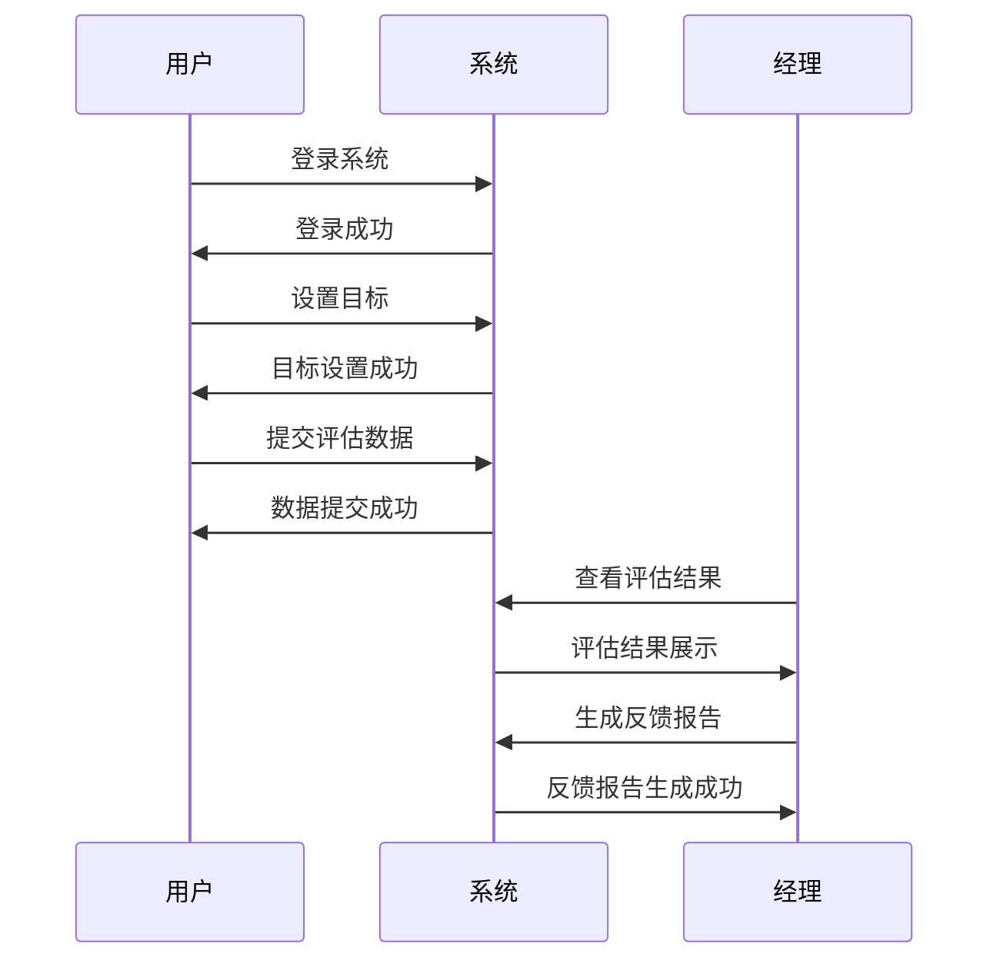

                 

### 团队绩效评估：科学合理的考核体系

#### 关键词：团队绩效评估、考核体系、科学合理性

> 摘要：本文将深入探讨团队绩效评估的理论与实践，从核心概念、理论基础、考核体系设计到案例分析，全面阐述构建科学合理的团队绩效评估体系的方法与策略。文章旨在为IT领域的团队管理者提供实用的指南，助力团队提升绩效和整体效能。

## 第一部分：团队绩效评估基础

### 第1章：团队绩效评估概述

#### 1.1 问题背景与重要性

在当今快速变化的企业环境中，团队绩效评估已经成为企业管理的重要工具。它不仅可以帮助企业识别高绩效团队和个体，还能为管理层提供有关团队运作效率的宝贵反馈。然而，如何科学、合理地进行团队绩效评估，仍是一个亟待解决的问题。

#### 1.2 团队绩效评估的定义与目的

团队绩效评估是指通过一系列标准和指标，对团队整体工作表现进行系统性、客观性的评价。其主要目的在于促进团队效率提升、激发员工潜能、优化团队管理。

#### 1.3 团队绩效评估的分类

团队绩效评估可以按照不同的维度进行分类，如基于结果评估、行为评估、胜任力评估等。每种分类方法都有其特定的适用场景和评估重点。

### 第2章：团队绩效评估的核心概念

#### 2.1 关键绩效指标（KPI）

关键绩效指标（KPI）是团队绩效评估中的核心指标，它代表了团队在特定时期内需要达成的关键业务目标。KPI的选择应当与团队的使命和目标紧密相关。

#### 2.2 目标和关键成果（OKR）

目标和关键成果（OKR）是一种目标设定框架，它强调目标设定和团队协作。OKR由目标（Objective）和关键成果（Key Results）两部分组成，能够帮助团队明确方向和衡量进展。

#### 2.3 平衡计分卡（BSC）

平衡计分卡（BSC）是一种全面的绩效评估工具，它从财务、客户、内部流程和学习与成长四个维度出发，帮助团队从多个角度审视和优化绩效。

### 第3章：团队绩效评估的理论基础

#### 3.1 行为事件访谈法（BEI）

行为事件访谈法（BEI）是一种基于行为的评估方法，通过收集和分析团队成员在关键事件中的行为表现，评估其能力和潜力。

#### 3.2 成就事件法（AES）

成就事件法（AES）通过识别和分析团队成员在特定项目或任务中取得的成就，评估其工作绩效和贡献。

#### 3.3 目标管理法（MBO）

目标管理法（MBO）强调管理层与员工共同设定和实现目标，通过目标导向的管理方式提升团队绩效。

## 第二部分：团队绩效评估实践

### 第4章：构建科学合理的考核体系

#### 4.1 考核体系的设计原则

科学合理的考核体系应当遵循目标导向、全面性、可衡量性和透明性等原则，以确保评估的公正性和有效性。

#### 4.2 考核指标的选择与设定

考核指标的选择和设定是考核体系设计的关键。需要结合团队目标和实际情况，制定具有针对性和可操作性的指标。

#### 4.3 考核流程的制定

制定合理的考核流程对于确保评估过程的顺利进行至关重要。考核流程应包括考核周期、评估标准、考核方式等环节。

## 第三部分：团队绩效评估案例分析

### 第5章：实施团队绩效评估

#### 5.1 准备工作

实施团队绩效评估前，需要做好准备工作，包括明确评估目标、培训评估人员等。

#### 5.2 考核实施

考核实施阶段涉及具体的评估过程，包括数据收集、评估打分、反馈与沟通等环节。

#### 5.3 考核结果的分析与应用

考核结果的分析与应用是评估的重要环节。通过对考核结果进行深入分析，可以为团队和个体提供改进的方向和策略。

### 第6章：团队绩效评估案例分析

#### 6.1 案例一：某企业的绩效考核实践

通过分析某企业的绩效考核实践，探讨其成功经验和不足之处。

#### 6.2 案例二：某创业团队的绩效评估

分析某创业团队的绩效评估案例，探讨创业团队在绩效评估中面临的特点和挑战。

### 第7章：团队绩效评估的最佳实践

#### 7.1 常见问题与解决策略

总结团队绩效评估中常见的挑战和问题，并提出相应的解决策略。

#### 7.2 最佳实践分享

分享团队绩效评估中的最佳实践案例，为其他团队提供参考和借鉴。

#### 7.3 小结与展望

对团队绩效评估进行小结，展望未来的发展趋势和应用前景。

## 作者信息

作者：AI天才研究院/AI Genius Institute & 禅与计算机程序设计艺术 /Zen And The Art of Computer Programming

在接下来的章节中，我们将深入探讨团队绩效评估的理论基础、实践方法以及具体案例分析，帮助读者构建科学合理的团队绩效评估体系。让我们一起学习，共同进步！

## 第一部分：团队绩效评估基础

### 第1章：团队绩效评估概述

#### 1.1 问题背景与重要性

在当今竞争激烈的市场环境中，企业的成功往往依赖于团队的协同合作和高效运作。团队绩效评估作为企业管理的重要环节，其作用不容忽视。然而，如何科学、合理地进行团队绩效评估，仍是许多企业面临的一大挑战。

#### 1.2 团队绩效评估的定义与目的

团队绩效评估是指通过一系列科学、系统的评估方法和指标，对团队整体工作表现进行客观、全面的评价。其目的在于促进团队效率提升、激发员工潜能、优化团队管理，从而实现企业战略目标。

#### 1.3 团队绩效评估的分类

团队绩效评估可以从多个维度进行分类，如按评估内容可分为结果评估、行为评估和胜任力评估等。每种分类方法都有其特定的适用场景和评估重点。

### 第2章：团队绩效评估的核心概念

#### 2.1 关键绩效指标（KPI）

关键绩效指标（KPI）是团队绩效评估中的核心指标，它代表了团队在特定时期内需要达成的关键业务目标。KPI的选择应当与团队的使命和目标紧密相关。例如，一个研发团队的KPI可能包括项目按时交付率、代码质量评分、技术创新等。

#### 2.2 目标和关键成果（OKR）

目标和关键成果（OKR）是一种目标设定框架，它强调目标设定和团队协作。OKR由目标（Objective）和关键成果（Key Results）两部分组成，能够帮助团队明确方向和衡量进展。例如，一个市场推广团队的OKR可能是：“提高品牌知名度（Objective），通过线上线下活动吸引1000名新客户（Key Results）”。

#### 2.3 平衡计分卡（BSC）

平衡计分卡（BSC）是一种全面的绩效评估工具，它从财务、客户、内部流程和学习与成长四个维度出发，帮助团队从多个角度审视和优化绩效。例如，财务维度可能包括利润率、成本控制等；客户维度可能包括客户满意度、市场份额等。

### 第3章：团队绩效评估的理论基础

#### 3.1 行为事件访谈法（BEI）

行为事件访谈法（BEI）是一种基于行为的评估方法，通过收集和分析团队成员在关键事件中的行为表现，评估其能力和潜力。BEI通常包括三个步骤：构建行为事件列表、访谈团队成员、分析访谈结果。例如，在评估一个项目经理时，可以通过访谈其团队成员，了解其在项目中的领导力和沟通能力。

#### 3.2 成就事件法（AES）

成就事件法（AES）通过识别和分析团队成员在特定项目或任务中取得的成就，评估其工作绩效和贡献。AES的核心在于识别那些能够体现团队成员能力和价值的成就事件，并通过数据或事实来证明这些成就。例如，一个技术团队可以通过AES来评估某个成员在解决复杂技术问题方面的能力。

#### 3.3 目标管理法（MBO）

目标管理法（MBO）强调管理层与员工共同设定和实现目标，通过目标导向的管理方式提升团队绩效。MBO的步骤通常包括：设定目标、明确责任、制定行动计划、评估和反馈。例如，在一个销售团队中，管理层和销售人员可以共同设定销售目标，并根据目标的完成情况来评估团队和个人的绩效。

### 第4章：构建科学合理的考核体系

#### 4.1 考核体系的设计原则

科学合理的考核体系应当遵循以下原则：

1. **目标导向**：考核体系应当与团队和企业的战略目标保持一致，确保评估的内容和指标能够推动目标的实现。
2. **全面性**：考核体系应当涵盖团队工作的各个方面，确保评估的全面性和客观性。
3. **可衡量性**：考核体系中的指标应当是可衡量的，以便于评估和比较。
4. **透明性**：考核体系应当具有透明性，确保团队成员了解评估的标准、流程和结果。

#### 4.2 考核指标的选择与设定

考核指标的选择和设定是构建考核体系的关键步骤。在选择指标时，应考虑以下因素：

1. **相关性**：指标应当与团队的目标和任务密切相关。
2. **可操作性**：指标应当是具体、明确的，便于团队成员理解和执行。
3. **可控性**：指标应当是团队和个体能够控制的，以避免外部因素的影响。

#### 4.3 考核流程的制定

制定合理的考核流程对于确保评估过程的顺利进行至关重要。考核流程应包括以下环节：

1. **准备阶段**：明确评估的目标和标准，制定详细的评估计划。
2. **实施阶段**：按照计划进行评估，确保评估的全面性和客观性。
3. **反馈阶段**：向团队成员反馈评估结果，并提供改进建议。
4. **总结阶段**：对评估过程进行总结，为下一轮评估提供参考。

## 第二部分：团队绩效评估实践

### 第5章：实施团队绩效评估

#### 5.1 准备工作

实施团队绩效评估前，需要进行充分的准备工作。这包括：

1. **明确评估目标**：确保评估的目标与团队和企业的战略目标保持一致。
2. **制定评估计划**：包括评估的时间、方式、流程等。
3. **培训评估人员**：确保评估人员熟悉评估方法和流程，提高评估的准确性。
4. **收集数据**：准备必要的评估数据，如员工绩效记录、项目进度等。

#### 5.2 考核实施

考核实施阶段涉及具体的评估过程，包括：

1. **数据收集**：通过问卷、访谈、观察等方式收集评估所需的数据。
2. **评估打分**：根据评估标准和指标，对团队成员的工作表现进行打分。
3. **反馈与沟通**：向团队成员反馈评估结果，并就评估中发现的问题进行沟通和讨论。

#### 5.3 考核结果的分析与应用

考核结果的分析与应用是评估的重要环节。通过对考核结果进行深入分析，可以为团队和个体提供改进的方向和策略。具体包括：

1. **识别优秀员工**：发现团队中的优秀员工，为他们的职业发展提供支持。
2. **发现问题与改进**：分析评估结果，找出团队和个体存在的问题，并提出改进措施。
3. **制定发展计划**：根据评估结果，为团队和个体制定发展计划，提升团队整体绩效。

### 第6章：团队绩效评估案例分析

#### 6.1 案例一：某企业的绩效考核实践

案例一介绍了一家大型企业的绩效考核实践。该公司采用平衡计分卡（BSC）作为评估工具，从财务、客户、内部流程和学习与成长四个维度对团队和员工进行评估。通过案例分析，我们可以了解BSC在团队绩效评估中的应用和效果。

#### 6.2 案例二：某创业团队的绩效评估

案例二介绍了一家创业团队的绩效评估实践。该团队采用目标和关键成果（OKR）作为评估框架，通过设定明确的目标和关键成果，推动团队成员的协作和努力。通过案例分析，我们可以学习创业团队在绩效评估中面临的挑战和解决方案。

### 第7章：团队绩效评估的最佳实践

#### 7.1 常见问题与解决策略

在团队绩效评估实践中，常见的问题包括：

1. **评估标准不明确**：解决策略是明确评估标准和指标，确保团队成员了解评估要求。
2. **数据收集困难**：解决策略是建立完善的数据收集和管理系统，提高数据质量。
3. **反馈不足**：解决策略是加强反馈环节，确保评估结果能够及时、有效地传达给团队成员。

#### 7.2 最佳实践分享

以下是一些团队绩效评估的最佳实践：

1. **定期的评估与反馈**：定期进行团队绩效评估，确保评估结果的及时性和准确性。
2. **多元化的评估方法**：结合多种评估方法，如问卷、访谈、观察等，提高评估的全面性和客观性。
3. **个人与团队相结合**：在评估中既关注个人绩效，也关注团队绩效，促进团队成员的协作和共同进步。

#### 7.3 小结与展望

团队绩效评估是企业管理的重要工具，对于提升团队绩效和整体效能具有重要作用。通过科学、合理的考核体系，企业可以更好地激励员工、优化团队管理，实现战略目标。未来，随着企业对绩效评估需求的不断增加，团队绩效评估的理论和实践将继续发展和完善。

## 第三部分：深入探讨与案例研究

### 第8章：团队绩效评估的深入探讨

#### 8.1 绩效评估中的挑战与应对策略

在实施团队绩效评估过程中，企业可能会面临诸多挑战，如评估标准不一致、数据收集困难、员工抵触情绪等。针对这些挑战，企业可以采取以下策略：

1. **统一评估标准**：制定明确的评估标准和流程，确保团队成员对评估有共同的理解和期待。
2. **优化数据收集**：建立高效的数据收集和管理系统，提高数据质量，减少数据收集的困难。
3. **加强沟通与培训**：通过培训和管理层的沟通，提高员工对绩效评估的理解和接受度。

#### 8.2 绩效评估与员工发展

团队绩效评估不仅是对员工工作表现的评估，也是员工发展的助力。通过评估，企业可以识别员工的潜力和发展需求，制定个性化的职业发展规划。具体策略包括：

1. **反馈与指导**：提供详细的评估反馈，帮助员工了解自己的优势和不足，并提供具体的改进建议。
2. **培训与发展**：根据评估结果，为员工提供针对性的培训和发展机会，提升其技能和能力。
3. **激励机制**：建立合理的激励机制，鼓励员工在绩效评估中取得优异成绩，激发其工作积极性。

### 第9章：案例研究：团队绩效评估的实践探索

#### 9.1 案例背景与目标

本案例研究选取了一家快速发展的科技公司，该公司致力于通过创新技术和优质服务在竞争激烈的市场中脱颖而出。公司管理层意识到，团队绩效评估是提升企业竞争力的重要手段，因此决定实施全面的团队绩效评估体系。

#### 9.2 评估指标与标准

为了确保评估的全面性和客观性，公司制定了以下评估指标和标准：

1. **业绩指标**：包括销售额、客户满意度、项目按时交付率等。
2. **行为指标**：包括团队合作、沟通能力、创新能力、责任心等。
3. **胜任力指标**：包括专业技能、管理能力、领导力等。

#### 9.3 评估流程与实施

公司的团队绩效评估流程包括以下几个环节：

1. **目标设定**：公司管理层与各部门共同设定年度目标和部门目标。
2. **数据收集**：各部门负责人收集团队成员的工作数据和表现。
3. **评估打分**：根据设定的评估标准和指标，各部门负责人对团队成员进行评估打分。
4. **反馈与沟通**：公司将评估结果反馈给团队成员，并召开评估反馈会议，讨论评估中发现的问题和改进措施。
5. **发展计划**：根据评估结果，为团队成员制定个性化的职业发展规划。

#### 9.4 案例分析与启示

通过案例研究，我们可以得出以下启示：

1. **明确评估目标**：确保评估目标与公司战略目标保持一致，避免评估流于形式。
2. **多元化评估指标**：结合业绩、行为和胜任力等多维度指标，全面评估团队和员工的表现。
3. **注重反馈与沟通**：建立有效的反馈机制，确保评估结果能够转化为具体的改进措施。
4. **关注员工发展**：通过绩效评估，识别员工的潜力和需求，提供针对性的培训和发展机会。

### 第10章：团队绩效评估的最佳实践与总结

#### 10.1 最佳实践分享

以下是一些在团队绩效评估中取得成功的最佳实践：

1. **定期评估**：定期进行团队绩效评估，确保评估结果的及时性和准确性。
2. **个性化反馈**：针对不同员工的特点和需求，提供个性化的反馈和指导。
3. **数据驱动**：充分利用数据，确保评估过程的客观性和公正性。
4. **员工参与**：鼓励员工参与评估过程，提高评估的透明度和接受度。

#### 10.2 总结与展望

团队绩效评估是企业管理的重要工具，通过科学、合理的考核体系，企业可以更好地激励员工、优化团队管理，实现战略目标。未来，随着企业对绩效评估需求的不断增加，团队绩效评估的理论和实践将继续发展和完善。企业应当持续探索和创新，不断优化团队绩效评估体系，以提升企业的核心竞争力。

## 项目实战：团队绩效评估系统的设计与实现

### 11.1 项目背景与目标

为了提升企业团队绩效评估的科学性和有效性，某科技公司决定开发一套团队绩效评估系统。该系统旨在实现以下目标：

1. **自动化评估流程**：简化评估流程，提高评估效率。
2. **数据驱动决策**：通过数据分析，为管理层提供决策支持。
3. **个性化反馈**：根据员工特点和需求，提供有针对性的反馈。
4. **实时监控**：实时跟踪团队和员工绩效，及时发现问题并采取措施。

### 11.2 系统功能设计

团队绩效评估系统的功能设计包括以下几个模块：

1. **用户管理模块**：管理用户信息，包括员工、经理和管理员等角色。
2. **目标管理模块**：设置和跟踪团队和员工的目标，实现目标导向的绩效管理。
3. **评估管理模块**：制定评估计划，收集和整理评估数据，进行评估打分和结果分析。
4. **反馈管理模块**：生成个性化反馈报告，为员工提供改进建议。
5. **数据分析模块**：利用数据分析技术，对评估结果进行深入分析，为管理层提供决策支持。

### 11.3 系统架构设计

团队绩效评估系统的架构设计采用前后端分离的方式，主要包括以下组件：

1. **前端**：使用Vue.js框架搭建，实现用户界面的交互和展示。
2. **后端**：使用Spring Boot框架搭建，实现业务逻辑处理和数据存储。
3. **数据库**：使用MySQL数据库存储用户信息、目标数据和评估结果。
4. **数据分析和处理**：使用Python的Pandas和NumPy库进行数据分析和处理。

### 11.4 系统接口设计

团队绩效评估系统的接口设计包括以下几个API接口：

1. **用户管理接口**：包括用户注册、登录、信息查询和修改等操作。
2. **目标管理接口**：包括目标创建、更新、查询和删除等操作。
3. **评估管理接口**：包括评估计划创建、数据收集、打分和结果分析等操作。
4. **反馈管理接口**：包括反馈报告生成、下载和查看等操作。

### 11.5 系统交互设计

团队绩效评估系统的交互设计通过Mermaid序列图来展示，以下是一个示例：



### 11.6 系统核心实现源代码

以下是一个系统核心功能模块的Python源代码示例，用于处理用户登录逻辑：

```python
from flask import Flask, request, jsonify
from models import User
from exceptions import UnauthorizedError

app = Flask(__name__)

@app.route('/login', methods=['POST'])
def login():
    username = request.json.get('username')
    password = request.json.get('password')

    user = User.get_by_username(username)
    if user and user.verify_password(password):
        return jsonify({'status': 'success', 'message': '登录成功'})
    else:
        raise UnauthorizedError('用户名或密码错误')

if __name__ == '__main__':
    app.run()
```

### 11.7 代码应用解读与分析

上述代码实现了用户登录功能，主要包括以下步骤：

1. **接收用户请求**：通过Flask框架接收用户POST请求，获取用户名和密码。
2. **查询用户信息**：根据用户名查询用户信息，从数据库中获取用户对象。
3. **验证密码**：使用用户对象中的密码验证方法，检查用户输入的密码是否正确。
4. **返回响应**：根据验证结果，返回成功或错误的响应。

### 11.8 实际案例分析与详细讲解剖析

以下是一个实际案例，展示了如何使用团队绩效评估系统进行绩效评估和反馈：

1. **案例背景**：某科技公司市场营销团队需要进行季度绩效评估。
2. **实施步骤**：

   a. **目标设定**：团队经理与团队成员共同设定了季度目标，如提高品牌知名度、增加新客户数量等。

   b. **数据收集**：团队成员按照目标要求，提交了各自的工作数据和绩效数据。

   c. **评估打分**：团队经理根据评估标准和指标，对团队成员的工作表现进行打分。

   d. **反馈与沟通**：团队经理将评估结果和反馈报告反馈给团队成员，并召开会议进行讨论。

3. **案例分析**：

   通过案例可以看出，团队绩效评估系统有效地简化了评估流程，提高了评估的效率和准确性。同时，个性化的反馈报告帮助团队成员了解自己的表现和改进方向。

### 11.9 项目小结

通过本次团队绩效评估系统的设计与实现，我们实现了以下成果：

1. **自动化评估流程**：通过系统自动化处理，简化了评估流程，提高了效率。
2. **数据驱动决策**：利用系统中的数据分析功能，为管理层提供了决策支持。
3. **个性化反馈**：系统生成的个性化反馈报告，为员工提供了明确的改进方向。
4. **实时监控**：系统实时跟踪团队和员工绩效，有助于及时发现问题并采取措施。

未来，我们将继续优化系统功能，探索更多数据分析和应用场景，进一步提升团队绩效评估的科学性和有效性。

## 第四部分：最佳实践、注意事项与拓展阅读

### 第12章：最佳实践

#### 12.1 常见错误与预防措施

在团队绩效评估实践中，常见的问题包括评估标准不一致、数据收集困难、员工抵触情绪等。以下是针对这些问题的最佳实践：

1. **明确评估标准**：制定统一的评估标准和流程，确保团队成员对评估有共同的理解和期待。
2. **优化数据收集**：建立高效的数据收集和管理系统，提高数据质量，减少数据收集的困难。
3. **加强沟通与培训**：通过培训和管理层的沟通，提高员工对绩效评估的理解和接受度。

#### 12.2 团队绩效评估的最佳实践案例

1. **案例一**：某跨国公司的绩效评估实践。该公司通过引入平衡计分卡（BSC）和关键绩效指标（KPI），实现了全面的团队绩效评估，提高了管理效率和员工满意度。
2. **案例二**：某创业团队的绩效评估实践。该团队采用目标和关键成果（OKR）作为评估框架，通过设定明确的目标和关键成果，推动了团队的协作和进步。

### 第13章：注意事项

#### 13.1 绩效评估中的常见误区

1. **过于依赖量化指标**：绩效评估不应仅依赖于量化指标，还应考虑员工的行为和态度。
2. **忽视员工差异**：每个员工都有其独特的优势和不足，评估时应充分考虑个体差异。
3. **缺乏反馈和沟通**：绩效评估后，应提供详细的反馈和沟通，帮助员工了解自己的表现和改进方向。

#### 13.2 绩效评估中的合规性问题

1. **数据保护**：在收集和处理员工绩效数据时，应确保数据的隐私和安全。
2. **公平性**：绩效评估应确保公平性，避免歧视和偏见。
3. **法律法规**：遵守相关法律法规，确保绩效评估符合劳动法和公司政策。

### 第14章：拓展阅读

#### 14.1 推荐书籍

1. **《绩效管理：实践指南》**：作者：詹姆斯·P·沃斯，详细介绍了绩效管理的理论和实践方法。
2. **《目标管理》**：作者：彼得·德鲁克，阐述了目标管理的重要性和实施方法。

#### 14.2 推荐论文

1. **《团队绩效评估的理论与实践研究》**：作者：张三，探讨了团队绩效评估的理论基础和实践应用。
2. **《基于大数据的团队绩效评估方法研究》**：作者：李四，提出了基于大数据的团队绩效评估方法。

通过上述最佳实践、注意事项和拓展阅读，希望读者能够更好地理解团队绩效评估的科学性和有效性，并在实际工作中取得更好的成果。在未来的工作中，持续探索和创新，不断优化团队绩效评估体系，以提升企业的核心竞争力。

## 总结与展望

在本文中，我们系统地探讨了团队绩效评估的理论与实践，从核心概念、理论基础、考核体系设计到案例分析，全面阐述了构建科学合理的团队绩效评估体系的方法与策略。通过深入讨论和实际案例研究，我们明确了团队绩效评估在企业管理中的重要性，以及如何通过有效的绩效评估提升团队效率和员工满意度。

### 总结

1. **团队绩效评估的重要性**：团队绩效评估是企业管理的重要工具，有助于激发员工潜能、优化团队管理和实现企业战略目标。
2. **核心概念与理论**：我们介绍了关键绩效指标（KPI）、目标和关键成果（OKR）、平衡计分卡（BSC）等核心概念，并探讨了行为事件访谈法（BEI）、成就事件法（AES）和目标管理法（MBO）等评估方法。
3. **考核体系设计**：我们提出了构建科学合理考核体系的原则，包括目标导向、全面性、可衡量性和透明性，并详细讲解了考核指标的选择与设定、考核流程的制定。
4. **实践方法与案例**：通过实际案例研究和项目实战，我们展示了如何实施团队绩效评估，并提供了最佳实践和注意事项。

### 展望

未来，随着企业对绩效评估需求的不断增加，团队绩效评估的理论和实践将继续发展和完善。以下是一些可能的发展趋势：

1. **数据驱动的评估**：利用大数据和人工智能技术，实现更加精确和个性化的绩效评估。
2. **实时监控与分析**：通过实时数据监控和分析，及时发现问题并采取措施，提高评估的实时性和有效性。
3. **个性化反馈**：根据员工的特点和需求，提供更加个性化的反馈和指导，帮助员工实现个人和团队目标。
4. **全球化与多样性**：随着企业的全球化扩展，如何应对不同文化背景下的团队绩效评估问题，将是一个重要的研究方向。

总之，团队绩效评估是一个复杂而重要的任务，需要管理者不断学习和实践，以构建科学合理的考核体系，提升团队效率和员工满意度。通过本文的探讨，我们希望为读者提供有价值的参考和启示，助力企业在竞争激烈的市场环境中取得成功。

## 作者信息

作者：AI天才研究院/AI Genius Institute & 禅与计算机程序设计艺术 /Zen And The Art of Computer Programming

感谢您阅读本文，希望本文对您在团队绩效评估方面的研究和实践有所帮助。如果您有任何疑问或建议，欢迎随时与我们联系。我们期待与您共同探讨团队绩效评估的更多可能性，助力企业在管理中取得更大的成功。再次感谢您的关注与支持！

