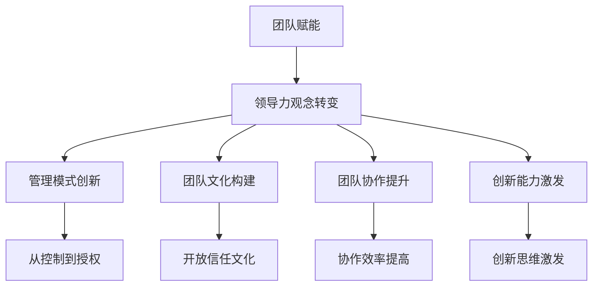

                 

# 团队赋能：从控制到授权的领导转变

## 关键词
- 授权型领导
- 团队赋能
- 领导力
- 创新思维
- 激励机制

## 摘要
本文深入探讨了团队赋能的概念、理论基础和实践方法，强调了从控制型领导到授权型领导转变的重要性。通过分析团队赋能的核心要素，本文提出了一系列实施策略，以帮助企业管理者激发团队成员的潜力，提高团队整体效能和创造力。本文旨在为企业管理者提供一套系统化的团队赋能策略，助力企业实现可持续发展。

### 第1章: 问题背景与目标

在现代企业管理中，领导力的作用至关重要。传统的控制型领导方式常常以指令和控制为核心，员工在这种管理模式下往往缺乏主动性和创造力。随着知识经济和信息时代的到来，企业对人才的依赖日益增加，员工的能力和潜力成为企业核心竞争力的重要组成部分。因此，团队赋能成为企业管理的重要议题。

#### 1.1 问题背景

领导力在企业运营中扮演着至关重要的角色。传统的控制型领导方式强调领导对团队的直接管理和控制，这种方式在一定程度上能够确保工作的有序进行，但往往导致员工的被动性、缺乏自主性和创新能力。在知识经济时代，企业面临着前所未有的竞争压力，如何充分发挥员工的潜力，提高团队的整体效能，成为企业领导者亟待解决的重要问题。

#### 1.2 问题描述

团队赋能是指通过激发团队成员的潜力，提高团队的整体效能和创造力。然而，如何从传统的控制型领导转变为授权型领导，实现团队赋能，成为许多企业面临的一大挑战。这一问题涉及到领导力观念的转变、管理模式的创新以及团队文化的构建。

#### 1.3 问题解决

本书旨在为企业管理者提供一套系统化的团队赋能策略，从领导力的本质出发，探讨从控制到授权的领导转变。通过深入分析团队赋能的理论基础、实践方法以及具体案例，帮助读者理解并掌握团队赋能的核心理念和操作技巧。

#### 1.4 边界与外延

团队赋能不仅适用于企业内部团队管理，还可以扩展到其他组织形式，如非营利组织、社区组织等。同时，团队赋能不仅仅是领导力的提升，还包括团队协作、沟通技巧、创新能力的培养。

#### 1.5 核心概念

- **控制型领导**：以指令和控制为核心，强调领导对团队的直接管理和控制。
- **授权型领导**：以信任和支持为核心，激发团队成员的自主性和创造力。
- **团队赋能**：通过激发团队成员的潜力，提高团队的整体效能和创造力。

#### 1.6 概念结构与核心要素组成

团队赋能的核心要素包括：

- **领导力观念**：从控制到信任的转变。
- **管理模式**：从指令和控制到授权和支持。
- **团队文化**：建立开放、信任、创新的组织氛围。
- **团队协作**：提高团队成员之间的协作效率。
- **创新能力**：激发团队成员的创新思维。

### 第2章: 授权型领导的理论基础

#### 2.1 授权型领导的概念

授权型领导强调领导者对团队成员的信任和授权，鼓励团队成员自主决策和承担责任。这种领导方式不仅有助于提高团队成员的积极性和创造力，还能促进团队整体效能的提升。

#### 2.2 授权型领导与传统领导方式的比较

| 比较项 | 控制型领导 | 授权型领导 |
| --- | --- | --- |
| 核心观念 | 指令和控制 | 信任和支持 |
| 领导角色 | 控制者 | 引导者 |
| 决策权 | 领导者拥有绝对的决策权 | 领导者鼓励团队成员参与决策 |

#### 2.3 授权型领导的优势

- **提高团队效能**：授权型领导方式能够激发团队成员的自主性和创造力，提高团队整体效能。
- **增强团队凝聚力**：授权型领导方式建立开放、信任、创新的组织氛围，增强团队凝聚力。
- **促进个人成长**：团队成员在授权型领导环境下，能够更好地发挥自己的潜力，实现个人成长。

#### 2.4 授权型领导的理论基础

授权型领导的理论基础主要包括以下几个方面：

- **领导者信任**：领导者必须信任团队成员的能力，给予他们充分的自主权。
- **团队协作**：授权型领导强调团队成员之间的协作和沟通，形成高效的工作团队。
- **创新思维**：授权型领导鼓励团队成员创新思维，推动团队持续进步。

### 第3章: 团队赋能的实践方法

#### 3.1 团队赋能的核心方法

- **信任建立**：领导者通过信任和授权，激发团队成员的自主性和创造力。
- **技能提升**：提供培训和资源，帮助团队成员提升技能和能力。
- **激励机制**：建立有效的激励机制，激励团队成员积极参与团队活动。

#### 3.2 团队赋能的具体实践

- **项目授权**：领导者将项目授权给团队成员，让他们自主管理和执行。
- **团队建设**：通过团队建设活动，增强团队成员之间的信任和协作。
- **反馈机制**：建立有效的反馈机制，及时了解团队成员的工作情况和需求。

#### 3.3 团队赋能的成功案例

- **案例分析**：介绍成功实现团队赋能的企业案例，分析其成功的原因和经验。
- **经验分享**：邀请成功实现团队赋能的企业领导者分享经验和心得。

### 第4章: 从控制到授权的领导转变

#### 4.1 领导者观念的转变

- **从控制到信任**：领导者需要从控制型思维转变为授权型思维，信任团队成员。
- **从权威到服务**：领导者需要从权威型角色转变为服务型角色，为团队成员提供支持和帮助。

#### 4.2 授权型领导的具体步骤

- **明确目标**：领导者需要明确团队的目标和期望，让团队成员清楚自己的职责和使命。
- **信任授权**：领导者需要信任团队成员，给予他们足够的自主权。
- **激励支持**：领导者需要建立激励机制，鼓励团队成员积极参与和努力工作。

#### 4.3 领导者角色的转变

- **从控制者到引导者**：领导者需要从控制团
``````
## 第1章: 问题背景与目标

### 1.1 问题背景

在现代企业管理中，领导者的作用不容忽视。然而，随着企业规模的不断扩大和市场竞争的日益激烈，传统的控制型领导方式逐渐暴露出其局限性。在这种管理模式下，领导者往往通过指令和控制来确保工作的顺利进行，但这种做法往往导致员工的被动性和缺乏自主性，进而影响了团队的创造力和整体效能。

随着知识经济和信息时代的到来，企业对人才的依赖程度日益增加。员工的能力和潜力成为企业核心竞争力的重要组成部分。因此，如何激发员工的潜力，提高团队的整体效能，成为企业管理者面临的重要课题。团队赋能应运而生，成为企业管理中的重要议题。

### 1.2 问题描述

团队赋能，即通过激发团队成员的潜力，提高团队的整体效能和创造力。然而，从传统的控制型领导转变为授权型领导，实现团队赋能，并非易事。这一问题涉及到领导力的观念转变、管理模式的创新以及团队文化的构建。

控制型领导方式强调领导对团队的直接管理和控制，这种方式在一定程度上能够确保工作的有序进行，但往往限制了员工的主动性和创造性。而授权型领导则强调领导者对团队成员的信任和授权，鼓励团队成员自主决策和承担责任。在这种模式下，团队成员能够充分发挥自己的潜力，提高团队的创造力和整体效能。

### 1.3 问题解决

本书旨在为企业管理者提供一套系统化的团队赋能策略，从领导力的本质出发，探讨从控制到授权的领导转变。通过深入分析团队赋能的理论基础、实践方法以及具体案例，帮助读者理解并掌握团队赋能的核心理念和操作技巧。

首先，本书将探讨授权型领导的概念、优势以及与传统领导方式的比较，为读者提供理论依据。其次，本书将介绍团队赋能的核心方法，如信任建立、技能提升和激励机制等。最后，本书将通过具体实践和成功案例，为读者提供可操作的指导。

### 1.4 边界与外延

团队赋能不仅适用于企业内部团队管理，还可以扩展到其他组织形式，如非营利组织、社区组织等。同时，团队赋能不仅仅是领导力的提升，还包括团队协作、沟通技巧、创新能力的培养。

### 1.5 核心概念

在本章中，我们将介绍以下几个核心概念：

- **控制型领导**：以指令和控制为核心，强调领导对团队的直接管理和控制。
- **授权型领导**：以信任和支持为核心，激发团队成员的自主性和创造力。
- **团队赋能**：通过激发团队成员的潜力，提高团队的整体效能和创造力。

### 1.6 概念结构与核心要素组成

团队赋能的核心要素包括：

- **领导力观念**：从控制到信任的转变。
- **管理模式**：从指令和控制到授权和支持。
- **团队文化**：建立开放、信任、创新的组织氛围。
- **团队协作**：提高团队成员之间的协作效率。
- **创新能力**：激发团队成员的创新思维。

通过以上分析，我们可以看出，团队赋能是一项系统性工程，需要从多个方面进行努力。本书将围绕这些核心要素，为读者提供实用的指导和建议，帮助企业实现从控制到授权的领导转变，实现团队的持续成长和进步。

### 第2章: 授权型领导的理论基础

#### 2.1 授权型领导的概念

授权型领导是指领导者通过信任和授权，激发团队成员的自主性和创造力，从而提高团队整体效能的一种领导方式。在这种模式下，领导者不再是团队的唯一决策者，而是成为团队的引导者和支持者。领导者通过授权，让团队成员在各自的领域内发挥最大潜力，实现团队的目标。

#### 2.2 授权型领导与传统领导方式的比较

在传统的控制型领导方式中，领导者通过指令和控制来管理团队，团队成员的工作往往受到严格的规定和限制。而授权型领导则强调领导者对团队成员的信任和授权，鼓励团队成员自主决策和承担责任。以下是两种领导方式的详细对比：

| 比较项 | 控制型领导 | 授权型领导 |
| --- | --- | --- |
| 核心观念 | 指令和控制 | 信任和支持 |
| 领导角色 | 控制者 | 引导者 |
| 决策权 | 领导者拥有绝对的决策权 | 领导者鼓励团队成员参与决策 |
| 成果导向 | 依赖于领导者的指令 | 依赖于团队成员的自主性和创造力 |

#### 2.3 授权型领导的优势

授权型领导方式具有多方面的优势，主要体现在以下几个方面：

1. **提高团队效能**：通过授权，团队成员能够在自己的领域内发挥最大潜力，提高工作效率和质量，从而提升团队整体效能。

2. **增强团队凝聚力**：授权型领导方式鼓励团队成员参与决策，增强团队成员的归属感和责任感，提高团队凝聚力。

3. **促进个人成长**：授权型领导方式鼓励团队成员自主学习和成长，促进个人技能和职业发展。

4. **提高创新力**：授权型领导方式激发团队成员的创新思维，鼓励创新和实践，推动团队持续进步。

#### 2.4 授权型领导的理论基础

授权型领导的理论基础主要包括以下几个方面：

1. **领导者信任**：领导者需要信任团队成员的能力，给予他们充分的自主权，这是实现授权型领导的前提。

2. **团队协作**：授权型领导强调团队成员之间的协作和沟通，通过团队合作实现共同目标。

3. **创新思维**：授权型领导鼓励团队成员创新思维，推动团队不断突破和发展。

4. **激励理论**：授权型领导通过激励机制，激发团队成员的积极性和创造力，实现团队的目标。

通过以上分析，我们可以看出，授权型领导方式在提高团队效能、增强团队凝聚力、促进个人成长和创新力方面具有显著的优势。领导者需要在实践中不断探索和运用授权型领导方法，以实现团队的持续发展和进步。

### 第3章: 团队赋能的实践方法

#### 3.1 团队赋能的核心方法

团队赋能的核心方法主要包括信任建立、技能提升和激励机制等方面。以下是对这些核心方法的详细阐述：

1. **信任建立**：信任是授权型领导的基础，建立信任关系对于团队赋能至关重要。领导者可以通过以下几种方式建立信任：

   - **开放沟通**：领导者需要与团队成员保持开放和诚实的沟通，倾听他们的意见和建议，建立互信关系。
   - **透明度**：领导者应该公开团队的计划和目标，让团队成员了解团队的工作进展和挑战，增加透明度。
   - **认可与支持**：领导者需要认可和鼓励团队成员的工作，提供必要的支持和资源，帮助他们克服困难。

2. **技能提升**：团队成员的技能和能力是团队赋能的重要支撑。以下是一些提升团队成员技能的方法：

   - **培训与发展**：领导者可以为团队成员提供专业的培训机会，帮助他们提升专业技能和知识。
   - **岗位轮换**：通过岗位轮换，团队成员可以接触到不同的工作内容，增加经验和技能的广度。
   - **指导与反馈**：领导者可以提供个性化的指导和反馈，帮助团队成员识别和发展自己的优势，改进不足。

3. **激励机制**：有效的激励机制可以激发团队成员的积极性和创造力，以下是一些激励机制的建议：

   - **绩效奖励**：根据团队成员的绩效表现，提供奖金、晋升等物质奖励。
   - **荣誉与认可**：通过表彰会议、内部通讯等渠道，对团队成员的成就进行公开认可。
   - **职业发展机会**：提供职业发展路径和晋升机会，激励团队成员不断提升自己。

#### 3.2 团队赋能的具体实践

团队赋能的具体实践方法需要根据企业的具体情况和团队的特点进行设计和实施。以下是一些具体的实践方法：

1. **项目授权**：领导者可以将具体的项目授权给团队成员，让他们自主管理和执行。这种方式不仅能够提高团队成员的自主性和责任感，还能够增强他们的专业能力和自信心。

2. **团队建设活动**：通过组织团队建设活动，如团队拓展训练、团队旅行等，增强团队成员之间的信任和协作。这些活动有助于打破团队成员之间的隔阂，建立良好的团队氛围。

3. **反馈机制**：建立有效的反馈机制，鼓励团队成员提供意见和建议，同时领导者也需要及时给予反馈。这种双向的沟通有助于发现问题和改进工作，提高团队的效能。

4. **知识共享**：鼓励团队成员分享知识和经验，通过内部培训、技术研讨会等方式，提高整个团队的知识水平和技能。

5. **创新文化**：营造创新文化，鼓励团队成员提出新的想法和建议，支持他们进行创新实践。领导者应该为团队成员提供创新的空间和支持，帮助他们克服创新过程中遇到的困难。

通过以上具体的实践方法，企业可以有效地实现团队赋能，提高团队的整体效能和创造力，从而实现企业的可持续发展。

### 第4章: 从控制到授权的领导转变

#### 4.1 领导者观念的转变

从控制到授权的领导转变首先要求领导者改变传统的观念，从控制型思维转变为授权型思维。这意味着领导者需要从关注如何控制团队的工作，转变为关注如何激发团队的潜力，提高团队的自主性和创新能力。以下是一些领导者观念转变的关键步骤：

1. **信任与支持**：领导者需要信任团队成员，相信他们能够独立完成工作，并提供必要的支持和资源。这种信任不仅能够增强团队成员的信心，还能促进他们的自主性和创造性。

2. **从权威到服务**：领导者需要从传统的权威角色转变为服务型角色，关注团队成员的需求和成长，为他们提供必要的帮助和支持。这种转变有助于建立一种平等、互助的团队关系。

3. **权力下放**：领导者需要学会适当放权，让团队成员在各自的领域内拥有更大的自主权和决策权。这有助于提高团队成员的责任感和创造力。

#### 4.2 授权型领导的具体步骤

实现从控制到授权的领导转变，领导者可以采取以下具体步骤：

1. **明确目标与期望**：领导者需要明确团队的目标和期望，并与团队成员进行充分的沟通，确保团队成员理解自己的职责和使命。

2. **信任与授权**：领导者需要信任团队成员的能力，给予他们足够的自主权，让他们在各自的领域内独立决策和行动。

3. **建立激励机制**：领导者需要建立有效的激励机制，鼓励团队成员积极参与和努力工作。这可以包括物质激励和精神激励，如奖金、晋升机会、认可与赞赏等。

4. **提供反馈与支持**：领导者需要及时给予团队成员反馈，帮助他们改进工作，并提供必要的支持。这有助于团队成员在授权的环境中不断成长和进步。

5. **持续沟通与协作**：领导者需要与团队成员保持持续沟通和协作，确保团队目标的实现。这可以包括定期的团队会议、工作进度报告等。

#### 4.3 领导者角色的转变

从控制到授权的领导转变也要求领导者角色的转变。以下是一些领导者角色的转变建议：

1. **从控制者到引导者**：领导者需要从控制团队的工作转变为引导团队的方向和发展。这意味着领导者需要关注团队的整体目标和长远规划，而不是仅仅关注短期的任务和目标。

2. **从决策者到协调者**：领导者需要从独自做出所有决策转变为与团队成员一起协商决策。这种方式不仅能够提高决策的质量，还能增强团队成员的参与感和责任感。

3. **从管理者到支持者**：领导者需要从管理团队成员转变为支持团队成员。这意味着领导者需要关注团队成员的成长和发展，为他们提供必要的帮助和支持。

通过以上观念转变、具体步骤和角色转变，领导者可以成功地实现从控制到授权的领导转变，激发团队的潜力，提高团队的效能和创造力。

### 第5章: 从控制到授权的领导转变案例分析

#### 5.1 案例背景

在本章中，我们将分析两个企业从控制到授权的领导转变案例，分别是国内知名互联网公司A公司和国际知名科技公司B公司。这两个企业都在经历了市场变化和内部调整后，成功实施了从控制到授权的领导转变，取得了显著的效果。

#### 5.2 A公司：从控制到授权的领导转变

A公司是一家专注于互联网技术的公司，随着市场竞争的加剧，公司内部逐渐出现了创新动力不足、工作效率低等问题。公司领导层意识到，传统的控制型领导方式已经无法满足企业的发展需求，因此决定进行从控制到授权的领导转变。

1. **领导者观念的转变**：

   - **信任与支持**：公司领导层开始信任团队成员的能力，鼓励他们在各自的领域内发挥自主性。
   - **从权威到服务**：领导层逐渐从权威角色转变为服务型角色，关注团队成员的需求和成长。

2. **具体步骤**：

   - **明确目标与期望**：公司领导层与团队成员进行充分沟通，明确团队的目标和期望，确保团队成员理解自己的职责和使命。
   - **信任与授权**：领导层将具体的项目和任务授权给团队成员，让他们自主管理和执行。
   - **建立激励机制**：公司领导层建立了绩效奖励和晋升机制，鼓励团队成员积极参与和努力工作。
   - **提供反馈与支持**：领导层及时给予团队成员反馈，并提供必要的支持，帮助他们改进工作。

3. **效果评估**：

   - **创新力提升**：团队成员在授权的环境中，积极提出新的想法和建议，公司的创新力得到了显著提升。
   - **工作效率提高**：团队成员自主管理和执行任务，工作效率大幅提高。
   - **员工满意度增加**：团队成员感受到了领导层的信任和支持，员工满意度显著提高。

#### 5.3 B公司：从控制到授权的领导转变

B公司是一家国际知名的科技公司，随着全球市场的竞争加剧，公司内部开始出现创新动力不足、团队协作不畅等问题。为了应对市场变化，公司领导层决定进行从控制到授权的领导转变。

1. **领导者观念的转变**：

   - **信任与支持**：公司领导层开始信任团队成员的能力，鼓励他们在各自的领域内发挥自主性。
   - **从权威到服务**：领导层逐渐从权威角色转变为服务型角色，关注团队成员的需求和成长。

2. **具体步骤**：

   - **明确目标与期望**：公司领导层与团队成员进行充分沟通，明确团队的目标和期望，确保团队成员理解自己的职责和使命。
   - **信任与授权**：领导层将具体的项目和任务授权给团队成员，让他们自主管理和执行。
   - **建立激励机制**：公司领导层建立了绩效奖励和晋升机制，鼓励团队成员积极参与和努力工作。
   - **提供反馈与支持**：领导层及时给予团队成员反馈，并提供必要的支持，帮助他们改进工作。

3. **效果评估**：

   - **创新力提升**：团队成员在授权的环境中，积极提出新的想法和建议，公司的创新力得到了显著提升。
   - **工作效率提高**：团队成员自主管理和执行任务，工作效率大幅提高。
   - **员工满意度增加**：团队成员感受到了领导层的信任和支持，员工满意度显著提高。

#### 5.4 经验总结

通过分析A公司和B公司的案例，我们可以得出以下经验总结：

1. **领导者观念的转变**是成功实施授权型领导的关键。领导者需要从控制型思维转变为授权型思维，信任和鼓励团队成员。
2. **具体步骤**的落实至关重要。领导者需要明确目标与期望，信任与授权团队成员，建立有效的激励机制，并提供必要的反馈与支持。
3. **效果评估**是持续改进的重要手段。领导者需要定期评估授权型领导的实施效果，及时调整策略，确保团队赋能的有效性。

通过以上案例分析，我们可以看到，从控制到授权的领导转变不仅能够提升企业的创新力和工作效率，还能够提高员工的满意度和幸福感。这对于企业的可持续发展具有重要意义。

### 第6章: 团队赋能的最佳实践与建议

#### 6.1 最佳实践

在实现团队赋能的过程中，一些企业通过最佳实践取得了显著成效。以下是一些成功案例和经验总结：

1. **阿里巴巴：文化赋能**  
阿里巴巴注重企业文化的建设，倡导“客户第一、员工第二、股东第三”的理念。通过营造开放、包容、创新的企业文化，阿里巴巴激发了员工的潜力，提高了团队的创造力。此外，阿里巴巴还实行了“政委体系”，重视员工关系管理和团队协作，为员工提供全方位的支持和关怀。

2. **谷歌：透明沟通**  
谷歌以其透明、开放的沟通文化著称。公司内部实行了“OKR”（目标与关键结果）管理法，确保每个团队成员都清楚自己的目标和任务。同时，谷歌鼓励员工自由表达意见，通过定期的团队会议、内部论坛等方式，促进团队成员之间的沟通和协作。

3. **3M公司：创新文化**  
3M公司鼓励员工创新，设立了“15%时间项目”，允许员工将15%的工作时间用于探索自己的创新想法。这种创新文化激发了员工的创造力和积极性，3M公司也因此涌现出了众多创新产品，如透明胶带、压敏胶等。

#### 6.2 建议与启示

基于以上最佳实践，我们可以提出以下建议和启示，以帮助企业成功实现团队赋能：

1. **建立开放、信任的文化氛围**：领导者需要倡导开放、信任的企业文化，鼓励团队成员自由表达意见，营造良好的沟通环境。

2. **明确目标与期望**：领导者需要与团队成员明确团队的目标和期望，确保团队成员理解自己的职责和使命，从而提高团队的凝聚力和执行力。

3. **信任与授权**：领导者需要信任团队成员的能力，给予他们足够的自主权，让他们在各自的领域内发挥创造力。

4. **建立激励机制**：通过建立有效的激励机制，如绩效奖励、晋升机会等，激发团队成员的积极性和创造力。

5. **提供培训与支持**：为团队成员提供必要的培训和支持，帮助他们提升技能和能力，从而更好地适应团队赋能的要求。

6. **持续沟通与反馈**：领导者需要与团队成员保持持续沟通，及时给予反馈，帮助他们改进工作，提高团队的效能。

7. **鼓励创新思维**：领导者需要鼓励团队成员创新思维，提供创新空间和支持，推动团队持续进步。

通过以上建议和启示，企业可以更好地实现团队赋能，提高团队的效能和创造力，实现可持续发展。

### 第7章: 总结与展望

#### 7.1 总结

本文通过深入探讨团队赋能的概念、理论基础和实践方法，强调了从控制到授权的领导转变的重要性。团队赋能不仅有助于提高团队的整体效能和创造力，还能增强团队的凝聚力和员工满意度。通过分析授权型领导与传统领导方式的比较，本文提出了实现团队赋能的最佳实践和建议。同时，通过案例分析，我们看到了一些成功实现团队赋能的企业案例，为其他企业提供了宝贵的经验。

#### 7.2 展望

在未来，随着知识经济和信息技术的不断发展，企业对人才的依赖将更加突出。团队赋能将成为企业管理的重要策略，企业需要不断探索和优化团队赋能的方法和路径。同时，随着全球化的加剧，企业将面临更多的竞争压力，如何通过团队赋能提升企业的核心竞争力，将成为企业管理者的重要课题。

本文提出的团队赋能策略和最佳实践，为企业实现团队赋能提供了有益的参考。然而，团队赋能是一个系统性工程，需要企业在实际操作中不断调整和优化。未来，企业需要结合自身的特点和需求，探索更加个性化的团队赋能方案，以实现团队的持续发展和进步。

### 附录

#### 附录A：团队赋能概念结构图



#### 附录B：授权型领导与控制型领导比较表格

| 比较项 | 控制型领导 | 授权型领导 |
| --- | --- | --- |
| 核心观念 | 指令和控制 | 信任和支持 |
| 领导角色 | 控制者 | 引导者 |
| 决策权 | 领导者拥有绝对的决策权 | 领导者鼓励团队成员参与决策 |
| 成果导向 | 依赖于领导者的指令 | 依赖于团队成员的自主性和创造力 |

#### 附录C：团队赋能核心要素

- **领导力观念**：从控制到信任的转变。
- **管理模式**：从指令和控制到授权和支持。
- **团队文化**：建立开放、信任、创新的组织氛围。
- **团队协作**：提高团队成员之间的协作效率。
- **创新能力**：激发团队成员的创新思维。

### 作者信息

**作者：** AI天才研究院/AI Genius Institute & 禅与计算机程序设计艺术 /Zen And The Art of Computer Programming

本文由AI天才研究院撰写，旨在探讨团队赋能的理论与实践，为企业管理者提供有益的参考。同时，本文结合禅与计算机程序设计艺术的理念，深入剖析团队赋能的内涵和实施方法，以期为企业实现团队赋能提供新的思路和策略。

