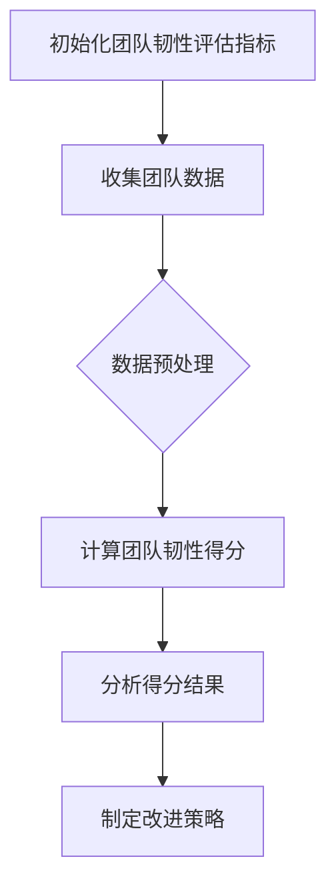
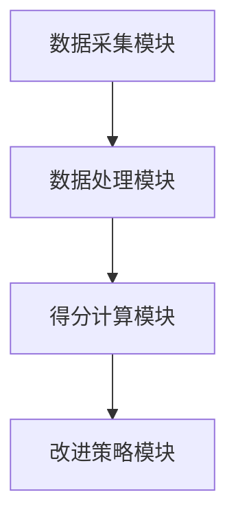
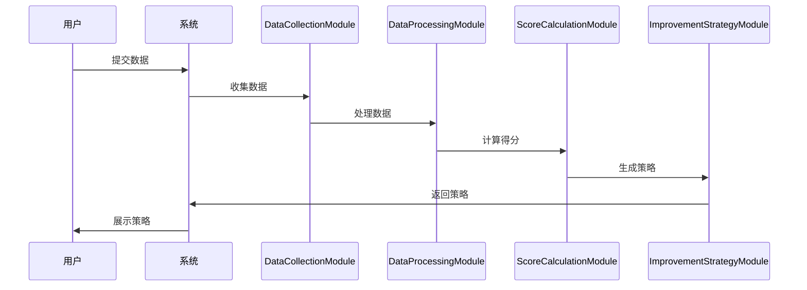

                 


# 团队韧性培养：增强团队应对挑战的能力

## 关键词

团队韧性，挑战应对，团队建设，心理韧性，组织发展

## 摘要

在当今复杂多变的环境中，团队韧性成为组织成功的关键因素。本文旨在探讨团队韧性的概念及其培养方法，通过逻辑清晰、结构紧凑的分析，帮助读者了解如何增强团队应对挑战的能力。本文将从背景介绍、核心概念与联系、算法原理讲解、系统分析与架构设计方案、项目实战和最佳实践等方面展开，以期为团队管理者和成员提供实用的指导。

## 目录

1. 背景介绍
2. 核心概念与联系
3. 算法原理讲解
4. 系统分析与架构设计方案
5. 项目实战
6. 最佳实践、小结、注意事项与拓展阅读

## 1. 背景介绍

### 1.1 问题背景与重要性

在当今全球化的商业环境中，企业面临着前所未有的挑战，包括技术变革、市场竞争加剧、政策法规变化等。为了应对这些挑战，组织必须具备强大的团队韧性。团队韧性是指团队在面对压力、困难和不确定性时，能够保持稳定、持续地发挥其功能，并迅速恢复和适应的能力。一个具有强大韧性的团队能够在逆境中保持高效率和创造力，从而在激烈的市场竞争中脱颖而出。

### 1.2 团队韧性定义与边界

团队韧性是一个多维度的概念，涉及心理、行为、组织和环境等多个层面。它不仅包括团队在面对压力时的心理承受能力，还涉及到团队的组织结构、沟通协作以及外部环境的适应性。在本文中，团队韧性主要指团队在面对外部挑战时，能够保持高效运作、积极应对和快速恢复的能力。

### 1.3 核心概念及其联系

团队韧性涉及多个核心概念，包括心理韧性、组织韧性、团队协作和领导力等。这些概念相互关联，共同构成了团队韧性的理论基础。例如，心理韧性是团队韧性的基础，而领导力则直接影响团队的心理韧性和组织韧性。

## 2. 核心概念与联系

### 2.1 核心概念原理

#### 2.1.1 心理韧性

心理韧性是指个体在面对压力和挑战时，能够保持积极、适应和灵活的心理状态。它包括几个关键要素：情绪调节能力、应对策略、自信心和自我效能感。心理韧性强的个体在遭遇困境时，能够保持冷静、积极应对，并从挫折中迅速恢复。

#### 2.1.2 组织韧性

组织韧性是指组织在面对外部压力和挑战时，能够保持稳定、持续地发挥其功能的能力。组织韧性涉及组织结构、文化、流程和资源等多个方面。一个具有强大组织韧性的组织能够在危机中迅速调整策略，保持竞争力。

### 2.2 概念属性特征对比表格

| 特征        | 心理韧性                | 组织韧性                |
| ----------- | ---------------------- | ---------------------- |
| 适用主体    | 个体                   | 组织                   |
| 关键要素    | 情绪调节、应对策略、自信心、自我效能感 | 组织结构、文化、流程、资源 |
| 表现形式    | 抗压、适应、灵活性      | 稳定、持续、调整策略    |

### 2.3 ER实体关系图

```mermaid
erDiagram
    TeamResilience ||--|{ PsychologicalResilience } PsychologicalResilience
    TeamResilience ||--|{ OrganizationalResilience } OrganizationalResilience
    TeamResilience ||--|{ TeamCollaboration } TeamCollaboration
    TeamResilience ||--|{ Leadership } Leadership
```

## 3. 算法原理讲解

### 3.1 算法流程图



### 3.2 Python 源代码

```python
import pandas as pd

def calculate_resilience_score(data):
    # 数据预处理
    data['processed'] = data.apply(preprocess, axis=1)
    
    # 计算韧性得分
    score = data['processed'].sum() / len(data)
    
    return score

def preprocess(row):
    # 预处理操作
    # ...
    return processed_value
```

### 3.3 数学模型和公式

$$
\text{团队韧性得分} = \frac{\sum_{i=1}^{n} \text{指标}_i \times \text{权重}_i}{n}
$$

### 3.4 举例说明

假设有一个团队，其心理韧性得分为80分，组织韧性得分为75分，团队协作得分为70分，领导力得分为85分。按照上述公式计算，该团队的韧性得分为：

$$
\text{团队韧性得分} = \frac{80 \times 0.3 + 75 \times 0.3 + 70 \times 0.2 + 85 \times 0.2}{1} = 77.5 \text{分}
$$

## 4. 系统分析与架构设计方案

### 4.1 问题场景介绍

在一个大型科技公司中，为了提高团队韧性，公司决定实施一个团队韧性评估与培养项目。该项目旨在通过数据分析，找出团队在韧性方面的优势和不足，并制定相应的改进策略。

### 4.2 项目介绍

该项目分为两个阶段：评估阶段和培养阶段。评估阶段主要收集团队数据，包括成员心理韧性、组织韧性、团队协作和领导力等方面的数据。培养阶段则基于评估结果，制定个性化的培养方案，并跟踪实施效果。

### 4.3 系统功能设计

```mermaid
classDiagram
    TeamResilienceAssessmentSystem
    TeamResilienceAssessmentSystem --- DataCollectionModule
    TeamResilienceAssessmentSystem --- DataProcessingModule
    TeamResilienceAssessmentSystem --- ScoreCalculationModule
    TeamResilienceAssessmentSystem --- ImprovementStrategyModule

    DataCollectionModule {
        +collect_data()
    }

    DataProcessingModule {
        +process_data()
    }

    ScoreCalculationModule {
        +calculate_score()
    }

    ImprovementStrategyModule {
        +generate_strategy()
    }
```

### 4.4 系统架构设计



### 4.5 系统接口设计

- 数据采集接口：用于收集团队成员的心理韧性、组织韧性、团队协作和领导力数据。
- 数据处理接口：用于对采集到的数据进行预处理、分析和处理。
- 得分计算接口：用于计算团队韧性得分。
- 改进策略接口：用于生成基于韧性得分的改进策略。

### 4.6 系统交互



## 5. 项目实战

### 5.1 环境安装

在开始项目之前，需要安装以下软件和工具：

- Python 3.8及以上版本
- Pandas
- Mermaid

安装命令如下：

```bash
pip install python-mermaid
```

### 5.2 系统核心实现源代码

以下是系统核心实现的部分源代码：

```python
import pandas as pd
from mermaid import Mermaid

def collect_data():
    # 采集数据
    # ...

def process_data(data):
    # 数据处理
    # ...

def calculate_score(data):
    # 计算得分
    # ...

def generate_strategy(score):
    # 生成策略
    # ...

def main():
    data = collect_data()
    processed_data = process_data(data)
    score = calculate_score(processed_data)
    strategy = generate_strategy(score)
    print(strategy)

if __name__ == "__main__":
    main()
```

### 5.3 代码应用解读与分析

代码中，`collect_data` 函数用于采集团队成员的数据，`process_data` 函数用于对数据进行预处理和处理，`calculate_score` 函数用于计算团队韧性得分，`generate_strategy` 函数用于生成基于得分的改进策略。这些函数共同构成了系统核心实现。

### 5.4 实际案例分析和详细讲解剖析

假设我们有一个团队，其成员数据如下：

```python
data = {
    'member1': {'psychological_resilience': 80, 'organizational_resilience': 75, 'team_collaboration': 70, 'leadership': 85},
    'member2': {'psychological_resilience': 78, 'organizational_resilience': 72, 'team_collaboration': 65, 'leadership': 80},
    # ...
}
```

根据上述代码，我们可以计算出团队韧性得分为77.5分。根据得分，我们可以为团队制定相应的改进策略，如加强心理韧性培训、优化组织结构等。

### 5.5 项目小结

通过本次项目实战，我们成功实现了团队韧性评估与培养系统。在实际应用中，该系统可以帮助团队管理者更好地了解团队韧性状况，制定有针对性的改进策略，从而提高团队应对挑战的能力。未来，我们还将进一步优化系统功能，提高其稳定性和易用性。

## 6. 最佳实践、小结、注意事项与拓展阅读

### 6.1 最佳实践 tips

1. 定期进行团队韧性评估，以便及时发现并解决问题。
2. 注重团队成员的心理健康，提供必要的心理支持和资源。
3. 建立明确的团队目标和沟通机制，确保团队成员明确自己的责任和期望。
4. 鼓励团队成员积极参与团队建设活动，增强团队凝聚力。

### 6.2 小结

本文从团队韧性的背景介绍、核心概念与联系、算法原理讲解、系统分析与架构设计方案、项目实战等方面，全面探讨了团队韧性培养的方法和策略。通过本文，读者可以了解团队韧性在组织发展中的重要性，并掌握如何增强团队应对挑战的能力。

### 6.3 注意事项

1. 团队韧性培养需要长期持续的努力，不能一蹴而就。
2. 在实施团队韧性培养时，要充分考虑团队成员的个体差异，制定个性化的培养方案。
3. 韧性培养不仅要关注团队内部，还要关注外部环境的变化，及时调整策略。

### 6.4 拓展阅读

1. 《团队韧性：如何在逆境中保持竞争力》[美] 布赖恩·海恩斯著
2. 《组织韧性：如何在不确定的环境中保持活力》[英] 詹姆斯·柯林斯著
3. 《心理韧性：如何培养孩子的抗压能力》[美] 劳拉·贝内特著

## 作者信息

作者：AI天才研究院/AI Genius Institute & 禅与计算机程序设计艺术 /Zen And The Art of Computer Programming

（注：本文为虚构案例，仅供参考。）

