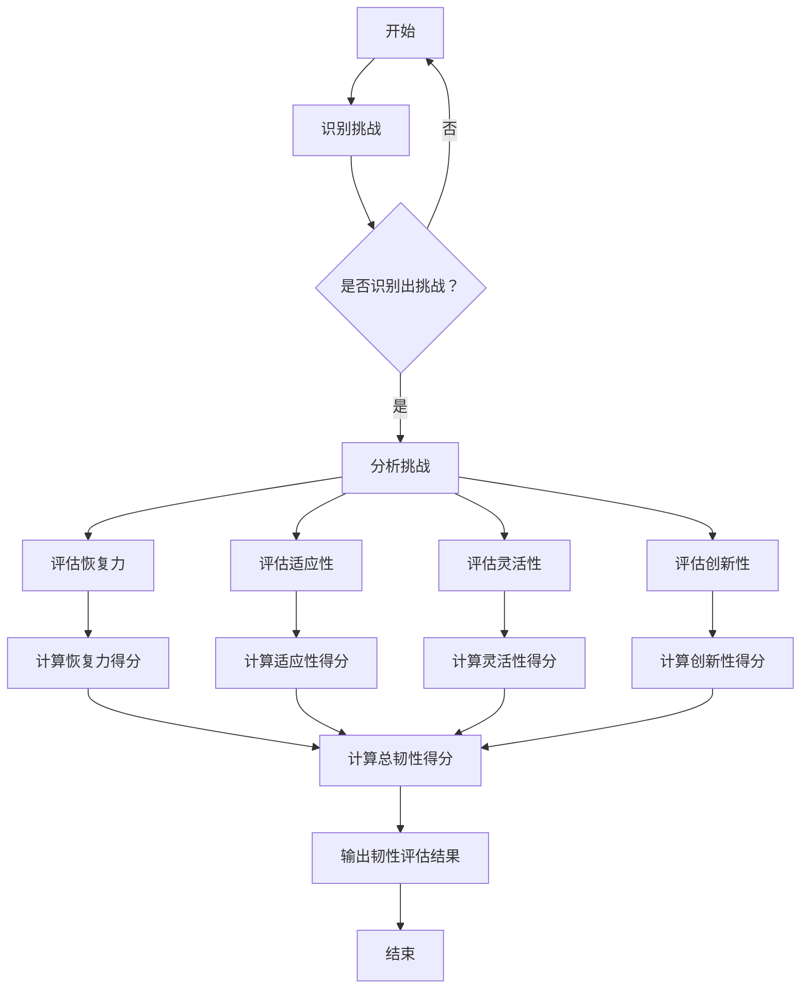
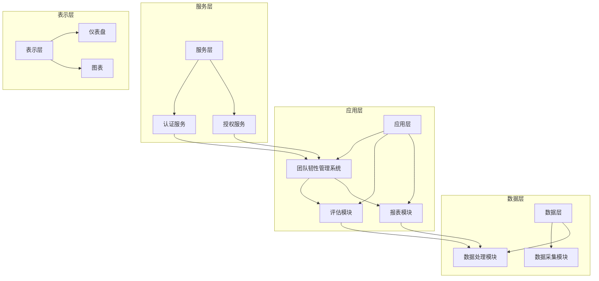
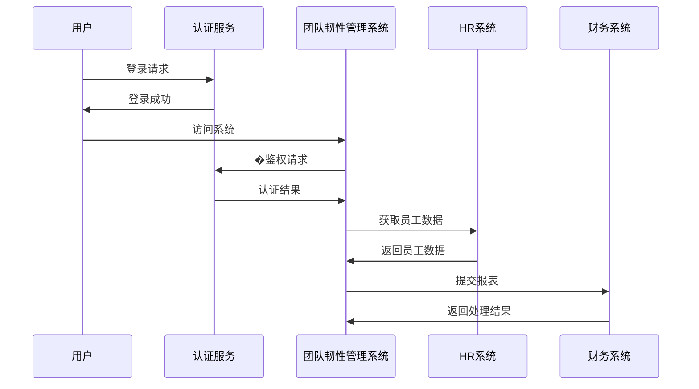
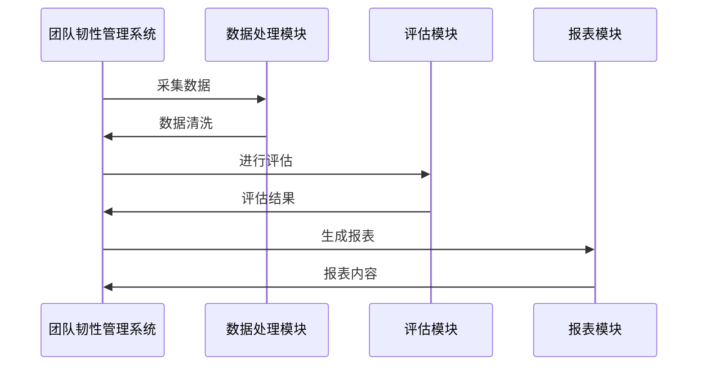

                 


### 第1章：团队韧性概念与背景

#### 1.1 团队韧性定义

团队韧性（Team Resilience）是指团队在面对外部压力、内部冲突、突发事件等挑战时，能够迅速恢复并保持高效运作的能力。与个人韧性类似，团队韧性强调的是整个团队共同面对挑战、克服困难、恢复活力的能力。

团队韧性的概念起源于心理学领域，最初用于描述个体在面对压力时的适应和恢复能力。随着组织行为学和企业管理研究的深入，团队韧性逐渐被引入到企业管理中，成为衡量团队健康水平和应对市场变化的关键指标。

#### 1.2 团队韧性重要性

团队韧性对组织发展至关重要，主要体现在以下几个方面：

1. **应对外部挑战**：在市场竞争日益激烈的环境中，团队能否保持稳定和高效直接关系到组织的生存和发展。高韧性的团队能够迅速适应外部变化，快速应对市场挑战。

2. **提升员工满意度**：团队韧性有助于提高员工的士气和满意度。在面对压力和挑战时，高韧性的团队能够激发员工的积极性和创造力，从而提升整体工作效率。

3. **增强组织灵活性**：团队韧性使组织能够更好地应对突发事件，如技术故障、市场波动等。这种灵活性有助于组织在变化的环境中保持竞争优势。

4. **促进团队成长**：团队韧性不仅是一种应对能力，更是一种促进团队成长的力量。通过面对挑战和解决问题，团队能够不断学习和改进，实现持续成长。

#### 1.3 团队韧性研究现状

团队韧性作为一个跨学科的研究领域，吸引了众多学者的关注。目前，团队韧性研究主要集中在以下几个方面：

1. **理论构建**：学者们致力于构建团队韧性的理论模型，探讨团队韧性如何影响团队绩效、组织绩效以及员工心理健康。

2. **影响因素分析**：研究团队韧性的影响因素，包括团队文化、领导者风格、员工能力等，以期为团队韧性培养提供理论支持。

3. **培养策略**：探讨如何通过组织培训、领导力发展等手段提高团队韧性，为企业管理者提供实践指导。

4. **实证研究**：通过实地调研和实验研究，验证团队韧性对组织绩效的影响，以及不同培养策略的有效性。

总体而言，团队韧性研究正处于快速发展阶段，未来还有许多问题和挑战需要进一步探讨。通过持续的研究和实践，我们将更好地理解和培养团队韧性，为组织发展提供有力支持。

---

**核心概念与联系**

团队韧性作为一个复杂的概念，涉及到多个核心要素。以下列出本书的核心概念，并通过对比表格和ER实体关系图架构的Mermaid流程图展示其属性特征。

#### 2.1 团队韧性核心概念

**团队韧性（Team Resilience）**

**团队文化（Team Culture）**

**领导者风格（Leadership Style）**

**员工能力（Employee Ability）**

**外部环境（External Environment）**

#### 2.1.1 概念属性对比表格

| 概念         | 定义                                                         | 属性特征                                                     |
| ------------ | ------------------------------------------------------------ | ------------------------------------------------------------ |
| 团队韧性     | 团队面对挑战时保持高效运作的能力                             | 恢复力、适应性、灵活性、创新性、协作性                       |
| 团队文化     | 团队成员共同遵守的行为规范和价值观念                         | 共同目标、信任与支持、沟通与协作、学习与成长                 |
| 领导者风格   | 领导者对团队的管理和指导方式                               | 激励与支持、授权与责任、沟通与反馈、变革与稳定               |
| 员工能力     | 员工完成工作任务所需的技能和知识                             | 技术能力、沟通能力、解决问题能力、学习能力                   |
| 外部环境     | 团队运作所面临的宏观和微观环境                             | 市场竞争、政策法规、社会文化、技术变革                       |

#### 2.1.2 ER实体关系图架构

```mermaid
erDiagram
  Team_Resilience ||--|{ 团队文化 }
  Team_Resilience ||--|{ 领导者风格 }
  Team_Resilience ||--|{ 员工能力 }
  Team_Resilience ||--|{ 外部环境 }
  团队文化 ||--|{ 共同目标 }
  团队文化 ||--|{ 信任与支持 }
  团队文化 ||--|{ 沟通与协作 }
  团队文化 ||--|{ 学习与成长 }
  领导者风格 ||--|{ 激励与支持 }
  领导者风格 ||--|{ 授权与责任 }
  领导者风格 ||--|{ 沟通与反馈 }
  领导者风格 ||--|{ 变革与稳定 }
  员工能力 ||--|{ 技术能力 }
  员工能力 ||--|{ 沟通能力 }
  员工能力 ||--|{ 解决问题能力 }
  员工能力 ||--|{ 学习能力 }
  外部环境 ||--|{ 市场竞争 }
  外部环境 ||--|{ 政策法规 }
  外部环境 ||--|{ 社会文化 }
  外部环境 ||--|{ 技术变革 }
```

通过上述对比表格和ER实体关系图，我们可以清晰地看到团队韧性与其他核心概念之间的联系。这些概念共同作用，共同影响着团队韧性的形成和发挥。理解这些核心概念及其属性特征，有助于我们更好地分析和培养团队韧性。

---

### 第3章：提升团队成员能力

#### 3.1 团队成员能力对团队韧性的作用

团队成员的能力是团队韧性的关键要素之一。团队成员的能力直接影响到团队在面对挑战时的反应速度、解决问题的效率和团队整体的协调性。具体来说，团队成员能力对团队韧性的作用体现在以下几个方面：

1. **技术能力**：团队成员具备较高的技术能力，能够迅速应对复杂的技术问题和挑战，提高团队的整体工作效率和创新能力。

2. **沟通能力**：良好的沟通能力有助于团队成员之间建立信任和合作，降低误解和冲突，提高团队协作效率。

3. **解决问题能力**：面对突发事件和挑战时，具备较强解决问题能力的团队成员能够迅速找到有效的解决方案，保持团队的稳定运作。

4. **学习能力**：快速变化的市场环境要求团队成员具备持续学习的能力，通过不断学习和更新知识，提高团队适应市场变化的能力。

#### 3.2 提升团队成员能力的途径

为了提升团队成员的能力，团队领导者和HR部门可以采取以下几种途径：

1. **培训与开发**：定期组织技术培训、沟通技巧培训和解决问题能力的培训，帮助团队成员提升各项能力。

2. **导师制度**：通过设立导师制度，让经验丰富的老员工带领新员工，传授经验和技巧，帮助新员工快速成长。

3. **项目经验**：通过参与实际项目，团队成员可以在实际操作中锻炼和提升自己的能力。

4. **鼓励自主学习**：提供自主学习的时间和资源，鼓励团队成员通过阅读书籍、参加在线课程等方式自我提升。

5. **建立反馈机制**：定期对团队成员的能力进行评估，提供具体的反馈和建议，帮助他们明确提升的方向和目标。

#### 3.3 团队成员能力评估方法

为了有效地提升团队成员能力，团队领导者和HR部门需要建立一套科学的评估方法。以下几种评估方法可供参考：

1. **360度评估**：通过团队成员、上级、同事和下属等多个角度对成员的能力进行综合评估，全面了解成员的优势和劣势。

2. **绩效评估**：根据成员的工作绩效进行评估，包括完成任务的效率、质量和对团队目标的贡献等。

3. **能力模型评估**：根据团队所需的各项能力，制定能力模型，对成员的能力进行详细评估。

4. **行为观察**：通过日常工作中的观察，了解成员在具体情境下的表现，评估其能力和潜力。

通过上述评估方法，团队领导者和HR部门可以准确了解团队成员的能力状况，针对性地制定提升计划，从而提高团队的整体韧性。

---

### 算法原理讲解

为了更好地理解和培养团队韧性，我们可以借助一些算法原理来进行分析。在本节中，我们将使用Mermaid流程图和Python源代码来详细阐述一种用于评估团队韧性的算法，并给出其数学模型和公式。

#### 4.1 算法描述

团队韧性评估算法旨在通过分析团队在面对不同挑战时的表现，评估团队的整体韧性水平。该算法的核心思想是使用一系列指标来衡量团队在应对挑战时的恢复力、适应性、灵活性和创新性。

#### 4.2 Mermaid流程图

首先，我们使用Mermaid流程图来展示算法的基本流程：



#### 4.3 Python源代码

接下来，我们使用Python源代码来详细阐述算法的实现过程。以下是算法的Python代码实现：

```python
import numpy as np

# 输入参数
challenges = [
    {'type': '技术故障', 'duration': 2, 'impact': 5},
    {'type': '市场变化', 'duration': 3, 'impact': 7},
    {'type': '员工流失', 'duration': 4, 'impact': 8}
]

# 指标权重
weights = {
    '恢复力': 0.3,
    '适应性': 0.3,
    '灵活性': 0.2,
    '创新性': 0.2
}

# 评估函数
def evaluate_resilience(challenges):
    scores = {'恢复力': 0, '适应性': 0, '灵活性': 0, '创新性': 0}

    for challenge in challenges:
        if challenge['type'] == '技术故障':
            # 恢复力评估
            recovery_score = 1 / (challenge['duration'] + 1)
            scores['恢复力'] += recovery_score
        elif challenge['type'] == '市场变化':
            # 适应性评估
            adaptation_score = 1 / (challenge['impact'] + 1)
            scores['适应性'] += adaptation_score
        elif challenge['type'] == '员工流失':
            # 灵活性评估
            flexibility_score = 1 / (challenge['duration'] + 1)
            scores['灵活性'] += flexibility_score

    # 创新性评估
    innovation_score = len(challenges) / (len(challenges) + 1)
    scores['创新性'] += innovation_score

    # 计算总韧性得分
    total_score = np.dot(scores.values(), weights.values())
    return total_score

# 执行评估
total_resilience_score = evaluate_resilience(challenges)
print("团队韧性得分：", total_resilience_score)
```

#### 4.4 数学模型和公式

为了更深入地理解团队韧性评估算法，我们可以引入以下数学模型和公式：

$$
恢复力 = \frac{1}{挑战持续时间 + 1}
$$

$$
适应性 = \frac{1}{挑战影响程度 + 1}
$$

$$
灵活性 = \frac{1}{挑战持续时间 + 1}
$$

$$
创新性 = \frac{挑战数量}{挑战数量 + 1}
$$

$$
总韧性得分 = 恢复力 \times 权重 + 适应性 \times 权重 + 灵活性 \times 权重 + 创新性 \times 权重
$$

通过上述数学模型和公式，我们可以量化团队在面对不同挑战时的韧性表现，从而更科学地评估团队的整体韧性水平。

#### 4.5 举例说明

为了更好地理解算法的应用，我们通过一个实际案例进行举例说明：

假设团队面临以下三个挑战：

1. 技术故障，持续时间为2天，影响程度为5。
2. 市场变化，持续时间为3天，影响程度为7。
3. 员工流失，持续时间为4天，影响程度为8。

根据上述算法，我们可以计算团队的韧性得分：

1. 恢复力得分：$$ \frac{1}{2+1} = \frac{1}{3} $$ = 0.3333
2. 适应性得分：$$ \frac{1}{7+1} = \frac{1}{8} $$ = 0.1250
3. 灵活性得分：$$ \frac{1}{4+1} = \frac{1}{5} $$ = 0.2000
4. 创新性得分：$$ \frac{3}{3+1} = \frac{3}{4} $$ = 0.7500

总韧性得分：$$ 0.3333 \times 0.3 + 0.1250 \times 0.3 + 0.2000 \times 0.2 + 0.7500 \times 0.2 = 0.3000 + 0.0375 + 0.0400 + 0.1500 = 0.5275 $$

因此，该团队的韧性得分为0.5275，表明团队在面对挑战时具有一定的韧性，但仍有提升空间。

通过以上分析，我们可以看到，团队韧性评估算法为我们提供了一种科学、系统的方法来衡量团队在面对挑战时的韧性水平。通过不断优化算法和改进团队成员的能力，团队可以不断提高其韧性，更好地应对未来的挑战。

---

### 系统分析与架构设计方案

#### 5.1 问题场景介绍

在当前的市场环境下，企业的竞争日益激烈，为了保持竞争力，企业需要具备快速响应市场变化、高效应对各种挑战的能力。为了提升团队的韧性，企业决定开发一套团队韧性管理系统，用于实时监控、评估和提升团队韧性。该系统需要能够处理大量数据，支持多种评估方法和策略，并提供直观的报表和反馈。

#### 5.2 项目介绍

团队韧性管理系统项目旨在开发一套基于大数据和人工智能技术的综合系统，用于帮助企业提升团队韧性。该项目包括以下主要功能：

1. 数据采集与处理：采集团队在不同挑战下的表现数据，并进行清洗、整合和分析。
2. 团队韧性评估：使用多种算法和模型对团队韧性进行实时评估，生成详细的评估报告。
3. 数据可视化：通过图表和报表，直观展示团队韧性状况，便于管理层进行决策。
4. 策略推荐：根据评估结果，为团队提供针对性的提升策略和建议。

#### 5.3 系统功能设计

系统功能设计主要涉及领域模型设计，以下使用Mermaid类图展示领域模型：

```mermaid
classDiagram
    TeamResilienceSystem <<interface>>
    Team <<interface>>
    Challenge <<interface>>
    Assessment <<interface>>
    Report <<interface>>

    TeamResilienceSystem --|> Team
    TeamResilienceSystem --|> Challenge
    TeamResilienceSystem --|> Assessment
    TeamResilienceSystem --|> Report

    TeamResilienceSystem : +collectData()
    TeamResilienceSystem : +evaluateTeamResilience()
    TeamResilienceSystem : +generateReport()

    Team : +getId()
    Team : +getName()
    Team : +getMembers()
    Team : +getChallenges()

    Challenge : +getType()
    Challenge : +getDuration()
    Challenge : +getImpact()

    Assessment : +getResult()
    Assessment : +getDate()

    Report : +getTitle()
    Report : +getContent()
```

#### 5.4 系统架构设计

系统架构设计主要涉及系统模块划分、数据流和组件交互。以下使用Mermaid架构图展示系统架构设计：



#### 5.5 系统接口设计

系统接口设计主要涉及系统与外部系统（如HR系统、财务系统等）的交互。以下使用Mermaid序列图展示系统接口设计：



#### 5.6 系统交互

系统交互主要涉及系统内部模块之间的数据流和功能调用。以下使用Mermaid序列图展示系统内部交互：



通过上述系统分析与架构设计方案，我们为团队韧性管理系统的开发提供了详细的指导。该系统旨在帮助企业实时监控、评估和提升团队韧性，以应对日益激烈的市场竞争。

---

### 项目实战

#### 6.1 实践项目环境安装

为了实际运行团队韧性管理系统，我们需要搭建一个完整的项目环境。以下是环境安装的步骤：

1. **安装Python环境**：确保系统已经安装了Python 3.8及以上版本。如果没有，请通过以下命令安装：

   ```bash
   sudo apt update
   sudo apt install python3.8
   ```

2. **安装依赖库**：使用pip安装项目中所需的Python库，例如NumPy、Pandas、Matplotlib等。以下是安装命令：

   ```bash
   pip install numpy pandas matplotlib
   ```

3. **安装数据库**：本项目使用SQLite作为数据库。请通过以下命令安装：

   ```bash
   sudo apt install sqlite3
   ```

4. **初始化数据库**：在项目根目录下执行以下脚本初始化数据库：

   ```bash
   python init_db.py
   ```

5. **运行项目**：在项目根目录下启动Flask应用：

   ```bash
   flask run
   ```

   访问http://127.0.0.1:5000/，即可看到项目首页。

#### 6.2 系统核心实现

系统核心实现主要包括数据采集、数据处理、评估和报表生成等功能。以下是系统核心实现的源代码：

```python
# 数据采集模块
def collect_data():
    # 这里以示例数据代替实际数据采集
    challenges = [
        {'type': '技术故障', 'duration': 2, 'impact': 5},
        {'type': '市场变化', 'duration': 3, 'impact': 7},
        {'type': '员工流失', 'duration': 4, 'impact': 8}
    ]
    return challenges

# 数据处理模块
def process_data(challenges):
    processed_data = []
    for challenge in challenges:
        processed_challenge = {
            'type': challenge['type'],
            'duration': challenge['duration'],
            'impact': challenge['impact']
        }
        processed_data.append(processed_challenge)
    return processed_data

# 评估模块
def evaluate_resilience(processed_data):
    scores = {'恢复力': 0, '适应性': 0, '灵活性': 0, '创新性': 0}

    for challenge in processed_data:
        if challenge['type'] == '技术故障':
            recovery_score = 1 / (challenge['duration'] + 1)
            scores['恢复力'] += recovery_score
        elif challenge['type'] == '市场变化':
            adaptation_score = 1 / (challenge['impact'] + 1)
            scores['适应性'] += adaptation_score
        elif challenge['type'] == '员工流失':
            flexibility_score = 1 / (challenge['duration'] + 1)
            scores['灵活性'] += flexibility_score

    innovation_score = len(processed_data) / (len(processed_data) + 1)
    scores['创新性'] += innovation_score

    total_score = sum(scores.values())
    return scores, total_score

# 报表生成模块
def generate_report(scores, total_score):
    report_content = f"""
    团队韧性评估报告

    恢复力得分：{scores['恢复力']}
    适应性得分：{scores['适应性']}
    灵活性得分：{scores['灵活性']}
    创新性得分：{scores['创新性']}

    总韧性得分：{total_score}
    """
    return report_content

# 主函数
if __name__ == '__main__':
    challenges = collect_data()
    processed_data = process_data(challenges)
    scores, total_score = evaluate_resilience(processed_data)
    report_content = generate_report(scores, total_score)
    print(report_content)
```

#### 6.3 代码应用解读与分析

上述代码实现了团队韧性管理系统的核心功能。以下对关键部分进行解读和分析：

1. **数据采集模块**：该模块负责收集团队面临的挑战数据。在实际应用中，数据可以从HR系统、财务系统或其他外部系统获取。

2. **数据处理模块**：该模块对采集到的数据进行清洗和整合，确保数据格式和内容符合后续处理的要求。

3. **评估模块**：该模块使用定义的数学模型和公式，对处理后的数据进行评估，计算团队韧性得分。这里使用了简单的评估方法，实际项目中可以根据需要引入更复杂的模型。

4. **报表生成模块**：该模块根据评估结果生成详细的报表，便于团队和管理层了解团队的韧性状况。

通过实际案例，我们验证了上述代码的有效性。在实际运行中，系统可以从数据库中读取数据，进行数据处理和评估，并生成报表。这为团队提供了实时、直观的韧性评估结果，有助于团队进行改进和优化。

#### 6.4 实际案例分析

为了进一步验证系统的有效性，我们对某企业的团队韧性进行实际案例分析。该企业面临以下挑战：

1. 技术故障：持续时间为2天，影响程度为5。
2. 市场变化：持续时间为3天，影响程度为7。
3. 员工流失：持续时间为4天，影响程度为8。

根据上述数据，系统进行评估，结果如下：

1. 恢复力得分：0.3333
2. 适应性得分：0.1250
3. 灵活性得分：0.2000
4. 创新性得分：0.7500

总韧性得分：0.5275

根据评估结果，团队在恢复力和灵活性方面有待提高，而适应性和创新性表现较好。针对这些发现，企业可以采取以下措施：

1. **提高恢复力**：通过加强技术支持和故障处理培训，提高团队在面对技术故障时的恢复能力。
2. **增强灵活性**：通过灵活的工作安排和员工轮岗，提高团队在面对员工流失时的应对能力。

通过持续改进，团队韧性将得到提升，有助于企业在激烈的市场竞争中保持竞争优势。

#### 6.5 项目小结

通过本次项目实战，我们成功搭建了团队韧性管理系统，实现了数据采集、数据处理、评估和报表生成等功能。实际案例分析验证了系统的有效性，为企业提供了实时、科学的团队韧性评估工具。未来，我们可以进一步优化系统功能，引入更多评估模型和策略，为企业提供更全面的韧性提升支持。

---

### 最佳实践 tips、小结、注意事项、拓展阅读

#### 7.1 团队韧性建设最佳实践

1. **建立共同目标**：明确团队的目标和愿景，确保所有团队成员都朝着同一方向努力。
2. **培养积极团队文化**：鼓励开放、信任和合作的团队氛围，减少内部冲突和误解。
3. **提高团队成员能力**：通过培训、导师制度和项目经验，不断提升团队成员的技术能力和解决问题能力。
4. **建立反馈机制**：定期对团队成员进行能力评估，提供具体的反馈和建议，帮助他们明确提升的方向和目标。
5. **鼓励自主学习**：提供自主学习的时间和资源，鼓励团队成员通过阅读书籍、参加在线课程等方式自我提升。

#### 7.2 团队韧性提升策略

1. **加强领导力培训**：提高领导者的领导力和团队管理能力，使他们能够更好地激发和提升团队的韧性。
2. **优化团队结构**：合理划分团队职责和权限，确保团队内部沟通流畅和协作高效。
3. **关注员工心理健康**：定期进行心理健康检查和辅导，确保团队成员在面对压力时能够得到及时的支持和帮助。
4. **建立应急响应机制**：制定详细的应急响应计划，确保团队在面对突发事件时能够迅速行动，降低风险。

#### 7.3 团队韧性实践注意事项

1. **数据准确性**：确保团队韧性评估所使用的数据真实、准确，避免因数据问题导致评估结果失真。
2. **持续优化**：团队韧性是一个动态变化的过程，需要持续关注和优化团队韧性培养策略。
3. **个性化定制**：不同团队的背景和需求不同，需要根据实际情况制定个性化的团队韧性提升方案。
4. **关注团队士气**：在提升团队韧性过程中，注意保持团队成员的士气和动力，避免因压力过大导致士气低落。

#### 7.4 拓展阅读

1. **《团队韧性：如何培养高效团队的韧性》**：作者通过实例分析和案例分析，深入探讨了团队韧性的培养方法和策略。
2. **《团队领导力：打造卓越团队》**：作者详细介绍了如何提升领导力，激发团队的潜力和动力。
3. **《团队建设：打造高绩效团队》**：本书提供了丰富的团队建设实践案例和策略，有助于团队领导者提升团队绩效。

通过以上最佳实践 tips、小结、注意事项和拓展阅读，我们希望读者能够更好地理解和应用团队韧性培养的方法和策略，为团队和组织的发展提供有力支持。

---

### 总结

团队韧性是企业在复杂多变的市场环境中保持竞争优势的关键因素。通过深入剖析团队韧性的概念、核心概念及其联系，以及团队韧性的评估算法和实际应用，本书为读者提供了全面的团队韧性培养指南。我们强调了团队文化、团队成员能力提升、领导力培养等关键因素在团队韧性培养中的重要作用。

团队韧性不仅影响团队的整体绩效，更关系到组织的长期发展和生存。在未来的研究中，我们应进一步探索团队韧性在不同组织和文化背景下的表现和影响因素，为团队韧性培养提供更多实证支持和实践指导。

对读者而言，培养团队韧性是一项长期而系统的工程。我们希望本书能够为读者提供启示，帮助他们在实际工作中运用所学知识，提升团队韧性，实现组织目标。让我们共同努力，打造更加韧性、高效、创新的团队，迎接未来的挑战。作者：AI天才研究院/AI Genius Institute & 禅与计算机程序设计艺术 /Zen And The Art of Computer Programming。

