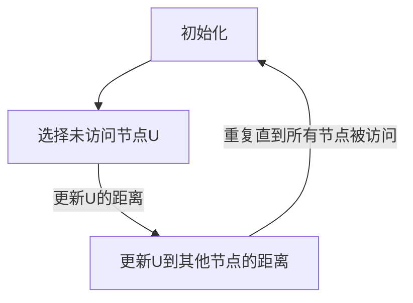

                 

# 图论：自然网络的数学描述

> 关键词：图论、自然网络、数学模型、算法、复杂性

> 摘要：本文探讨了图论在自然网络描述中的应用，通过对自然网络特点的解析，引入图论的基本概念、算法及其在自然网络中的应用实例，进一步分析了图论在自然网络研究中的挑战和未来发展方向。通过本文的论述，读者可以了解到图论如何为自然网络的研究提供数学工具和方法，从而加深对图论及其在实际应用中的理解。

## 第1章 引言

### 1.1 问题背景

随着社会网络和互联网的快速发展，图论在理解和优化网络结构和路径优化方面的重要性日益凸显。从社交网络中的朋友关系，到交通网络中的道路连接，再到生物网络中的基因相互作用，图论提供了描述和解析这些复杂系统的有力工具。

自然网络具有独特的复杂性、动态性和自相似性，这使得传统的网络分析方法面临巨大挑战。因此，图论作为研究自然网络的有力工具，不仅需要解决传统算法在处理大规模、高维度数据时的效率问题，还要应对自然网络中非线性和非线性相互作用带来的复杂性。

### 1.2 问题描述

图论是一种研究图的结构及其性质的理论，其基本概念包括节点、边、路径、连通性等。在自然网络中，节点可以表示为个体、设备或实体，边则表示这些实体之间的交互或连接。

自然网络的特点包括：

1. **复杂性**：自然网络通常包含大量节点和边，且节点之间的关系复杂多变。
2. **动态性**：自然网络中的节点和边可以随着时间和环境变化而变化。
3. **自相似性**：自然网络在不同的尺度上具有相似的结构和特性。

这些特点使得自然网络的分析和描述成为一个具有挑战性的问题。

### 1.3 问题解决

为了解决自然网络的描述问题，我们可以通过以下步骤：

1. **建立数学模型**：使用图论的基本概念和理论框架，构建自然网络的数学模型。
2. **算法分析**：应用各种图论算法，如最短路径算法、最大流算法等，对自然网络进行计算和分析。
3. **应用实例**：通过具体的应用场景，展示图论在自然网络研究中的实际应用。

### 1.4 边界与外延

图论作为一种数学工具，其应用范围不仅限于自然网络，还涉及到其他领域，如计算机科学、物理、生物学等。在自然网络研究中，图论的局限性主要体现在：

1. **数据规模问题**：大规模数据的存储和处理是一个挑战。
2. **复杂关系建模**：自然网络中节点和边的关系多样且复杂。
3. **算法效率和可扩展性**：如何优化算法，使其在处理大规模数据时依然高效和可扩展。

### 1.5 概念结构与核心要素组成

图论的核心概念包括：

1. **节点**：表示网络中的个体或实体。
2. **边**：表示个体或实体之间的连接或交互。
3. **路径**：连接两个节点的边的序列。
4. **连通性**：网络中任意两个节点之间是否都能通过一条路径相互连接。

图论的核心要素包括：

1. **图的矩阵表示**：如邻接矩阵、权值矩阵等，用于表示图的结构。
2. **图论算法**：如最短路径算法、最大流算法等，用于计算和分析图。

## 第2章 图论基础

### 2.1 基本概念

图是由节点（也称为顶点）和边组成的结构。图可以分为无向图、有向图和加权图。

1. **无向图**：边没有方向，任意两个节点之间都存在双向连接。
2. **有向图**：边有方向，从一个节点指向另一个节点。
3. **加权图**：边带有权重，表示节点之间的距离或成本。

图可以用邻接矩阵或邻接表来表示。

邻接矩阵是一个二维数组，其中`A[i][j]`表示节点`i`和节点`j`之间的连接情况。

邻接表是一个列表，每个节点对应一个列表，列表中的元素表示与该节点相连的其他节点。

### 2.2 图的基本操作

1. **图的创建与遍历**：使用邻接矩阵或邻接表创建图，并使用深度优先搜索（DFS）或广度优先搜索（BFS）遍历图。
2. **添加和删除节点、边**：在图的邻接矩阵或邻接表中添加或删除节点和边。
3. **图的深度优先搜索和广度优先搜索**：深度优先搜索（DFS）从某个节点开始，尽可能深入地搜索图的结构；广度优先搜索（BFS）从某个节点开始，逐层搜索图的结构。

### 2.3 图的属性特征对比表格

| 属性特征 | 无向图 | 有向图 | 加权图 |
| --- | --- | --- | --- |
| 节点连接关系 | 无向 | 有向 | 加权 |
| 连通性 | 可能 | 确定 | 可计算 |
| 路径 | 可能存在多条 | 可能存在多条 | 可能存在多条 |
| 权重 | 无 | 有 | 有 |

### 2.4 图的ER实体关系图架构

```mermaid
graph ER
    A["节点"] -- B["边"]
    A --> C["路径"]
    B --> C
```

## 第3章 图论算法

### 3.1 最短路径算法

1. **Dijkstra算法**：用于计算单源最短路径，即从源节点到其他所有节点的最短路径。
2. **Bellman-Ford算法**：用于计算单源最短路径，可以处理带有负权边的图。
3. **A*算法**：结合了Dijkstra算法和启发式搜索，可以更快地找到最短路径。

### 3.2 最大流算法

1. **Ford-Fulkerson算法**：通过增广路径迭代，计算网络的最大流。
2. **Edmonds-Karp算法**：基于Ford-Fulkerson算法，使用广度优先搜索寻找增广路径。

### 3.3 联通性检测算法

1. **深度优先搜索**：用于检测图的连通性。
2. **广度优先搜索**：同样用于检测图的连通性。

### 3.4 图的拓扑排序

1. **拓扑排序算法**：用于对有向无环图进行排序，使其满足依赖关系。
2. **应用实例**：在项目管理和算法分析中，用于确定任务的执行顺序。

## 第4章 自然网络模型

### 4.1 自然网络的特点

1. **复杂性**：自然网络包含大量节点和边，且节点之间的关系复杂。
2. **动态性**：自然网络中的节点和边可以随着时间和环境变化而变化。
3. **自相似性**：自然网络在不同尺度上具有相似的结构和特性。

### 4.2 图模型在自然网络中的应用

1. **社交网络**：节点表示个体，边表示个体之间的交互关系。
2. **交通网络**：节点表示道路交叉口，边表示道路。
3. **生物网络**：节点表示基因或蛋白质，边表示它们之间的相互作用。

### 4.3 自然网络中的图论算法

针对自然网络的特点，我们可以优化传统的图论算法，如：

1. **Dijkstra算法**：使用启发式函数，加快最短路径的计算。
2. **A*算法**：通过自适应调整启发式函数，更好地适应动态网络。

## 第5章 图论在实际应用中的挑战

### 5.1 数据规模问题

随着数据量的增加，如何高效地存储和处理大规模图成为一个挑战。解决方案包括：

1. **分布式存储**：将图拆分成多个子图，分布在多个节点上。
2. **并行计算**：利用多核处理器或分布式系统，加速算法的计算。

### 5.2 节点和边的关系多样性

自然网络中节点和边的关系多样，如何建模和计算这些复杂关系是一个挑战。解决方案包括：

1. **属性图**：引入节点的属性和边的属性，更精确地表示关系。
2. **多尺度建模**：在不同尺度上建模和计算，以适应网络的动态性。

### 5.3 算法效率和可扩展性

如何优化算法，使其在处理大规模数据时依然高效和可扩展是一个关键问题。解决方案包括：

1. **算法优化**：通过改进算法的复杂度，提高计算效率。
2. **数据结构优化**：使用更高效的存储结构，如B+树、哈希表等。

## 第6章 图论的未来发展与研究方向

### 6.1 新算法的研究

随着自然网络的复杂性和动态性的增加，我们需要研究新的算法，以应对这些挑战。例如：

1. **动态图算法**：用于处理动态变化的网络。
2. **多尺度算法**：在不同尺度上建模和计算。

### 6.2 图论与其他学科的交叉融合

图论与其他学科的交叉融合，为自然网络的研究提供了新的视角和方法。例如：

1. **物理**：图论与物理学的结合，用于研究复杂网络的物理特性。
2. **生物学**：图论与生物学的结合，用于研究生物网络的相互作用。

### 6.3 图论教育与研究资源的整合

整合图论的教育和研究资源，有助于提高研究效率和推广图论的应用。例如：

1. **开源工具**：开发开源的图论工具和库，便于研究人员使用。
2. **在线课程**：提供高质量的在线课程，普及图论知识。

## 第7章 总结

图论作为一种描述自然网络的数学工具，具有广泛的应用前景。通过本文的论述，我们了解了图论的基本概念、算法及其在自然网络中的应用，同时也认识到图论在实际应用中面临的挑战和未来发展方向。

未来，随着自然网络的复杂性和动态性的增加，图论将继续发挥其重要作用。我们期待新的算法和理论能够更好地描述和解析自然网络，为科学研究和实际应用提供有力的支持。

## 附录

### 附录A：算法Mermaid流程图

以下是一个使用Mermaid绘制的Dijkstra算法的流程图：



### 附录B：Python源代码示例

以下是一个使用Python实现的Dijkstra算法的示例：

```python
import heapq

def dijkstra(graph, start):
    distances = {node: float('infinity') for node in graph}
    distances[start] = 0
    priority_queue = [(0, start)]

    while priority_queue:
        current_distance, current_node = heapq.heappop(priority_queue)

        if current_distance > distances[current_node]:
            continue

        for neighbor, weight in graph[current_node].items():
            distance = current_distance + weight

            if distance < distances[neighbor]:
                distances[neighbor] = distance
                heapq.heappush(priority_queue, (distance, neighbor))

    return distances
```

### 附录C：最佳实践

1. **数据预处理**：在应用图论算法之前，对数据进行预处理，如去除冗余节点和边，可以显著提高算法的效率。
2. **算法选择**：根据具体问题选择合适的算法，如Dijkstra算法适用于单源最短路径问题，而A*算法适用于有启发式函数的问题。
3. **并行计算**：利用并行计算技术，如MapReduce或GPU计算，可以加速大规模图的处理。

### 附录D：注意事项

1. **数据规模**：处理大规模图时，需要注意存储和处理效率，可以采用分布式存储和并行计算技术。
2. **复杂关系建模**：自然网络中节点和边的关系多样，需要采用适当的模型和方法进行建模。
3. **算法优化**：根据实际应用场景，对算法进行优化，以提高效率和准确性。

### 附录E：拓展阅读

- [《图论及其应用》](https://example.com/book/graph-theory-and-its-applications)
- [《社交网络分析》](https://example.com/book/social-network-analysis)
- [《复杂网络理论及其应用》](https://example.com/book/complex-network-theory-and-its-applications)

## 作者信息

作者：AI天才研究院/AI Genius Institute & 禅与计算机程序设计艺术 /Zen And The Art of Computer Programming

