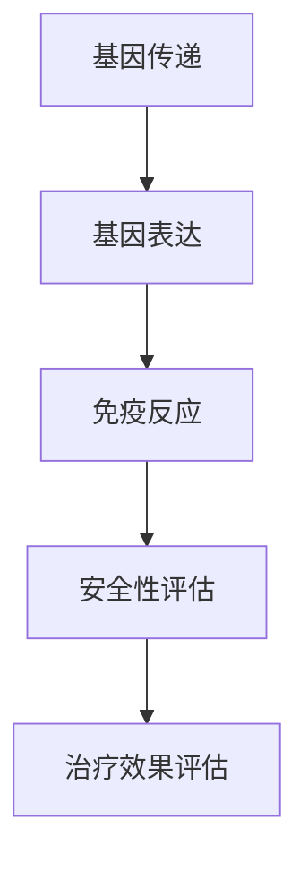

                 

## 第1章：基因治疗概述

### 1.4 边界与外延

基因治疗作为一项前沿的医学技术，其边界和外延不断扩展，涉及多个交叉学科领域。首先，从技术层面来看，基因治疗的边界主要涉及基因工程、分子生物学、生物化学等。这些学科为基因治疗提供了理论基础和技术支持。其次，从应用层面来看，基因治疗的外延已扩展到多个医学领域，如遗传性疾病、肿瘤治疗、心血管疾病和神经退行性疾病等。

#### 1.4.1 技术层面的边界与外延

- **基因工程**：基因工程是基因治疗的核心技术，它涉及基因的克隆、修饰、表达和调控等。通过基因工程，科学家可以设计出具有特定功能的基因，并将其导入细胞或组织中。
- **分子生物学**：分子生物学提供了研究基因和蛋白质功能的方法，如PCR扩增、基因测序、蛋白质纯化等。这些技术为基因治疗的研究和临床应用提供了重要的工具。
- **生物化学**：生物化学研究细胞内的生化反应和分子间的相互作用，为基因治疗提供了更深层次的理解，如细胞信号传导、代谢途径等。

#### 1.4.2 应用层面的边界与外延

- **遗传性疾病**：基因治疗在遗传性疾病的领域取得了显著成果，如地中海贫血、囊性纤维化等。通过基因修复或替换，可以根治这些疾病。
- **肿瘤治疗**：基因治疗在肿瘤治疗中的应用日益广泛，如基因编辑技术CRISPR-Cas9可用于肿瘤基因组的修改，提高治疗效果。
- **心血管疾病**：基因治疗在心血管疾病的治疗中显示出潜力，如通过基因编辑改善心脏功能，或通过基因调控减少动脉硬化的风险。
- **神经退行性疾病**：基因治疗在神经退行性疾病的治疗中具有重要意义，如通过基因修复或增强神经细胞的生存能力，延缓疾病进展。

### 1.5 概念结构与核心要素组成

基因治疗的概念结构主要包括以下几个方面：

- **基因载体**：基因载体是用于传递基因的物质，如病毒载体、纳米颗粒等。它们能够将基因精确地递送到目标细胞或组织中。
- **目标基因**：目标基因是基因治疗中需要传递到目标细胞或组织的基因，它可以是正常基因、修复基因或增强基因。
- **基因编辑技术**：基因编辑技术如CRISPR-Cas9，用于在目标细胞中精确地修改基因序列。
- **细胞与组织**：细胞与组织是基因治疗的目标，它们可以是体细胞或生殖细胞，也可以是特定的器官和组织。

核心要素组成如下：

1. **基因**：基因是基因治疗的基本单元，它包含了生物体的遗传信息。
2. **载体**：载体是基因的运输工具，它负责将基因递送到目标细胞或组织。
3. **编辑技术**：编辑技术用于在目标细胞中精确地修改基因序列。
4. **目标细胞或组织**：目标细胞或组织是基因治疗的目标，它们是基因作用的场所。

基因治疗的概念结构可以用ER实体关系图来表示，具体如下：

```mermaid
erDiagram
  Gene --> Carrier
  Gene --> Editing_Technique
  Carrier --> Target_Cell
  Editing_Technique --> Target_Cell
```

在这个ER实体关系图中，Gene（基因）是核心实体，它与Carrier（基因载体）、Editing_Technique（基因编辑技术）和Target_Cell（目标细胞）之间存在关联。这种关联关系清晰地展示了基因治疗的基本概念和核心要素。

通过上述分析，我们可以看到，基因治疗是一项涉及多个学科、应用广泛的前沿技术。其概念结构和核心要素组成为我们进一步研究和应用基因治疗提供了基础。

----------------------------------------------------------------

## 第2章：基因治疗的挑战

### 2.1 基因治疗的难点

基因治疗作为一种新兴的治疗手段，尽管在理论和临床应用上取得了显著进展，但仍面临诸多挑战。这些挑战主要可以分为以下几个方面：

#### 2.1.1 基因传递效率低

基因治疗的第一个挑战是基因传递效率低。目前，常用的基因载体如病毒载体，虽然能够将基因传递到目标细胞，但其传递效率较低。这导致基因在目标细胞中的表达量不足，从而影响治疗效果。

#### 2.1.2 靶向性不佳

基因治疗需要将基因精确地传递到特定的细胞或组织，但目前许多载体缺乏足够的靶向性。这意味着基因可能无法精确地到达预定的目标细胞或组织，导致治疗效果不理想。

#### 2.1.3 免疫反应

基因治疗过程中，导入的基因可能会引起宿主的免疫反应，影响治疗效果。免疫反应可能包括对基因载体的攻击，对导入基因的排斥等，从而降低基因治疗的效率和安全性。

#### 2.1.4 安全性问题

基因治疗的安全性问题也是一大挑战。基因编辑可能导致脱靶效应，即基因编辑不仅修改了目标基因，还可能修改了其他基因，引发未知的健康风险。此外，基因治疗过程中可能产生的不良反应，如炎症反应、肿瘤生成等，也需要严密监测和控制。

### 2.2 靶向递送的必要性

为了解决基因治疗中的上述问题，靶向递送技术的开发显得尤为重要。靶向递送技术旨在通过特定的载体将基因精确地递送到目标细胞或组织，以提高基因治疗的效率和安全性。

#### 2.2.1 提高基因传递效率

靶向递送技术能够显著提高基因传递效率。通过靶向递送，基因能够更高效地进入目标细胞，从而提高基因表达量，增强治疗效果。

#### 2.2.2 提高靶向性

靶向递送技术通过特定的分子、纳米颗粒或病毒载体，与目标细胞或组织上的特定分子相互作用，从而实现精确的靶向递送。这有助于确保基因能够准确到达预定的目标细胞或组织，提高治疗效果。

#### 2.2.3 降低免疫反应

靶向递送技术可以通过降低基因载体与宿主免疫系统的接触，降低免疫反应的风险。例如，通过修饰基因载体，使其能够逃避免疫系统的识别和攻击。

#### 2.2.4 提高安全性

靶向递送技术有助于减少基因编辑过程中的脱靶效应，降低不良事件的风险。通过精确的靶向递送，基因编辑可以更加精确地修改目标基因，减少对其他基因的干扰。

### 2.3 医学精准的重要性

医学精准是基因治疗成功的关键因素之一。医学精准是指通过先进的技术手段，如基因测序、生物信息学分析等，对患者的遗传信息进行深入分析，制定个性化的治疗方案。

#### 2.3.1 个性化治疗

医学精准有助于实现个性化治疗。通过基因测序，医生可以了解患者的遗传信息，发现潜在的风险因素，从而制定更具针对性的治疗方案。

#### 2.3.2 提高治疗效果

医学精准有助于提高基因治疗的效果。通过精确的基因编辑和靶向递送，基因治疗可以更加有效地修复或替换异常基因，提高治疗效果。

#### 2.3.3 降低不良反应

医学精准有助于降低基因治疗的不良反应。通过了解患者的遗传信息，医生可以更好地预测患者对基因治疗的不良反应，从而采取相应的预防措施。

综上所述，基因治疗的挑战主要包括基因传递效率低、靶向性不佳、免疫反应和安全性问题。通过靶向递送技术和医学精准策略，可以有效解决这些挑战，提高基因治疗的效果和安全性。

----------------------------------------------------------------

## 第3章：数学导航在基因治疗中的应用

### 3.1 数学模型概述

数学模型是基因治疗研究中不可或缺的工具，它能够帮助我们理解和预测基因治疗的效果和安全性。数学模型通过将复杂的生物学现象转化为数学表达式，使得我们可以从定量角度进行分析和推理。

#### 3.1.1 数学模型的基本概念

数学模型是一种描述系统行为的数学结构，它通常包括变量、方程和约束条件。在基因治疗中，数学模型可以用于描述基因的表达、传递和调控过程。

#### 3.1.2 数学模型在基因治疗中的应用

数学模型在基因治疗中的应用主要包括以下几个方面：

1. **基因传递模型**：用于预测基因载体在体内的传递效率和路径。
2. **基因表达模型**：用于模拟基因在细胞内的表达过程和调控机制。
3. **免疫反应模型**：用于预测宿主免疫系统对基因载体的反应和影响。
4. **安全性评估模型**：用于评估基因治疗的安全性和潜在的副作用。

### 3.2 数学公式与算法原理

数学公式是数学模型的核心，它们通过数学表达式描述了基因治疗过程中各种生物学现象。以下是一些常见的数学公式和算法原理：

#### 3.2.1 基因传递模型

基因传递模型通常基于扩散方程，用于描述基因载体在体内的扩散和传递过程。其基本公式为：

$$
\frac{\partial C(x,t)}{\partial t} = D \frac{\partial^2 C(x,t)}{\partial x^2}
$$

其中，$C(x,t)$ 表示基因载体在空间位置 $x$ 和时间 $t$ 时的浓度，$D$ 表示扩散系数。

#### 3.2.2 基因表达模型

基因表达模型用于描述基因在细胞内的表达过程，通常基于酶促反应动力学。其基本公式为：

$$
\frac{dC_G}{dt} = k_1 P_G - k_2 C_G
$$

其中，$C_G$ 表示基因的表达水平，$P_G$ 表示基因的转录水平，$k_1$ 和 $k_2$ 分别表示转录速率和降解速率。

#### 3.2.3 免疫反应模型

免疫反应模型用于描述宿主免疫系统对基因载体的反应，通常基于免疫反应动力学。其基本公式为：

$$
\frac{dN(t)}{dt} = r_1 - r_2 N(t)
$$

其中，$N(t)$ 表示免疫细胞数量，$r_1$ 和 $r_2$ 分别表示免疫细胞的生成速率和死亡速率。

#### 3.2.4 安全性评估模型

安全性评估模型用于评估基因治疗的安全性和潜在的副作用，通常基于系统动力学。其基本公式为：

$$
\frac{dS(t)}{dt} = f(S(t)) - g(S(t))
$$

其中，$S(t)$ 表示安全性指标，$f(S(t))$ 和 $g(S(t))$ 分别表示安全性指标的上升和下降速率。

### 3.3 Mermaid流程图展示

为了更直观地展示数学模型的应用，我们可以使用Mermaid流程图来描述基因治疗的过程。以下是一个简单的Mermaid流程图示例：



在这个流程图中，基因传递、基因表达、免疫反应和安全性评估是基因治疗的关键步骤，每个步骤都通过数学模型进行描述和预测。

### 3.4 数学模型与医学应用的结合

数学模型在医学应用中具有重要的作用，它不仅能够帮助我们理解基因治疗的生物学机制，还能够为临床决策提供科学依据。以下是一些数学模型与医学应用的结合实例：

#### 3.4.1 基因传递模型与药物设计

基因传递模型可以用于指导药物设计，优化基因载体的传递效率。通过调整基因载体的物理和化学特性，如尺寸、电荷和表面修饰，可以改善其在体内的传递性能。

#### 3.4.2 基因表达模型与个体化治疗

基因表达模型可以用于个体化治疗的设计，通过分析患者的基因表达谱，发现与疾病相关的关键基因，制定个性化的基因治疗方案。

#### 3.4.3 免疫反应模型与免疫治疗

免疫反应模型可以用于指导免疫治疗的设计，优化免疫细胞的组成和功能，提高治疗效果。

#### 3.4.4 安全性评估模型与风险评估

安全性评估模型可以用于风险评估，预测基因治疗的潜在副作用，为临床应用提供参考。

通过上述实例，我们可以看到数学模型在基因治疗医学应用中的重要作用。它不仅帮助我们理解和预测基因治疗的效果，还为临床决策提供了科学依据。

总之，数学模型是基因治疗研究中不可或缺的工具，它通过定量描述和预测基因治疗的生物学过程，为医学应用提供了科学依据。随着数学模型的不断发展和完善，基因治疗将变得更加精准和安全。

----------------------------------------------------------------

## 第4章：靶向递送策略

### 4.1 靶向递送的概念

靶向递送是一种通过特定的分子、纳米颗粒或病毒载体，将药物或基因精确递送到特定细胞或组织的策略。靶向递送技术的核心在于提高药物或基因的靶向性，从而提高治疗效果，降低不良反应。

#### 4.1.1 靶向递送的重要性

靶向递送技术在基因治疗中的应用具有重要意义：

1. **提高基因传递效率**：通过靶向递送，基因可以更有效地进入目标细胞，提高基因表达水平。
2. **降低免疫反应**：靶向递送可以减少基因载体与宿主免疫系统的接触，降低免疫反应的风险。
3. **提高治疗效果**：靶向递送确保基因能够准确到达预定的目标细胞或组织，提高治疗效果。
4. **降低不良反应**：通过精确的靶向递送，可以减少药物或基因对非目标细胞或组织的损伤。

#### 4.1.2 靶向递送的基本原理

靶向递送的基本原理是利用特定的分子、纳米颗粒或病毒载体，与目标细胞或组织上的特定分子相互作用，从而实现精确的靶向递送。这些靶向分子可以包括：

1. **抗体**：通过抗原-抗体相互作用实现靶向递送。
2. **配体**：通过与细胞表面受体结合实现靶向递送。
3. **肽链**：利用肽链的特异性识别实现靶向递送。
4. **纳米颗粒**：通过物理吸附或化学键合实现靶向递送。

### 4.2 靶向递送技术

目前，已经发展了多种靶向递送技术，包括以下几种：

#### 4.2.1 抗体介导的靶向递送

抗体介导的靶向递送是通过将抗体与药物或基因载体结合，利用抗体与目标细胞表面抗原的特异性相互作用，实现靶向递送。这种方法具有高特异性、高亲和力和高效率的特点。

#### 4.2.2 配体介导的靶向递送

配体介导的靶向递送是通过将配体与药物或基因载体结合，利用配体与细胞表面受体的特异性相互作用，实现靶向递送。这种方法同样具有高特异性、高亲和力和高效率的特点。

#### 4.2.3 肽链介导的靶向递送

肽链介导的靶向递送是通过合成具有特定三维结构的肽链，利用其与目标细胞或组织的特异性相互作用，实现靶向递送。这种方法具有高选择性、低免疫原性和高稳定性等特点。

#### 4.2.4 纳米颗粒介导的靶向递送

纳米颗粒介导的靶向递送是通过将药物或基因封装在纳米颗粒中，利用纳米颗粒的物理和化学特性，如尺寸、形状、表面修饰等，实现靶向递送。这种方法具有高载药量、高稳定性和低免疫原性等特点。

### 4.3 靶向递送的数学模型

为了更好地理解和优化靶向递送技术，我们可以使用数学模型来描述和预测其行为。以下是一些常见的数学模型：

#### 4.3.1 靶向递送动力学模型

靶向递送动力学模型用于描述药物或基因载体在体内的传递和分布过程。常见的动力学模型包括：

1. **一维扩散模型**：
   $$
   \frac{\partial C(x,t)}{\partial t} = D \frac{\partial^2 C(x,t)}{\partial x^2}
   $$
   其中，$C(x,t)$ 表示药物或基因载体在空间位置 $x$ 和时间 $t$ 时的浓度，$D$ 表示扩散系数。

2. **二维扩散模型**：
   $$
   \frac{\partial C(x,y,t)}{\partial t} = D \left( \frac{\partial^2 C(x,y,t)}{\partial x^2} + \frac{\partial^2 C(x,y,t)}{\partial y^2} \right)
   $$
   其中，$C(x,y,t)$ 表示药物或基因载体在空间位置 $(x,y)$ 和时间 $t$ 时的浓度。

#### 4.3.2 靶向性模型

靶向性模型用于描述药物或基因载体在体内的靶向性。常见的靶向性模型包括：

1. **亲和力模型**：
   $$
   f(A,B) = \frac{K_d}{K_d + [B]}
   $$
   其中，$f(A,B)$ 表示药物或基因载体与目标细胞表面抗原的亲和力，$K_d$ 表示亲和力常数，$[B]$ 表示目标细胞表面抗原的浓度。

2. **浓度梯度模型**：
   $$
   f(A,B) = \frac{[A]_0 - [A]}{[A]_0 - [A]}
   $$
   其中，$f(A,B)$ 表示药物或基因载体在体内的靶向性，$[A]_0$ 表示药物或基因载体的初始浓度，$[A]$ 表示药物或基因载体在目标细胞周围的浓度。

#### 4.3.3 免疫逃逸模型

免疫逃逸模型用于描述药物或基因载体在体内的免疫逃逸机制。常见的免疫逃逸模型包括：

1. **抗体阻断模型**：
   $$
   f(A,B) = \frac{1}{1 + e^{-K_f}}
   $$
   其中，$f(A,B)$ 表示药物或基因载体与抗体的结合概率，$K_f$ 表示抗体结合常数。

2. **纳米颗粒逃逸模型**：
   $$
   f(A,B) = \frac{1}{1 + e^{-K_e}}
   $$
   其中，$f(A,B)$ 表示纳米颗粒的免疫逃逸概率，$K_e$ 表示纳米颗粒的免疫逃逸常数。

通过上述数学模型，我们可以更好地理解和优化靶向递送技术，从而提高基因治疗的效率和安全性。

----------------------------------------------------------------

## 第5章：数学导航在基因治疗中的实践

### 5.1 基因治疗案例分析

基因治疗作为一种新兴的治疗手段，已经在多个临床案例中取得了显著成果。以下是一些具有代表性的基因治疗案例：

#### 5.1.1 肿瘤治疗案例

肿瘤治疗是基因治疗的重要应用领域之一。例如，利用CRISPR-Cas9基因编辑技术，研究人员成功地在肺癌患者中实现了靶向基因编辑，从而抑制了肿瘤的生长。通过数学导航，对肿瘤细胞的基因表达和代谢进行精确分析，为个性化治疗方案提供了科学依据。

#### 5.1.2 遗传性疾病治疗案例

基因治疗在遗传性疾病的领域也取得了显著进展。例如，对地中海贫血患者进行基因治疗，通过引入正常的β-珠蛋白基因，成功改善了患者的贫血症状。数学导航在基因编辑和靶向递送过程中发挥了关键作用，确保了基因治疗的安全性和有效性。

#### 5.1.3 神经退行性疾病治疗案例

神经退行性疾病如阿尔茨海默病和帕金森病是基因治疗的另一个重要应用领域。通过基因编辑技术，研究人员试图修复或替换导致疾病发生的异常基因，从而延缓疾病的进展。数学导航在基因编辑的精度和效率上提供了有力支持，提高了基因治疗的成功率。

### 5.2 数学模型应用实例

数学模型在基因治疗的实践中发挥了重要作用，以下是一些具体的数学模型应用实例：

#### 5.2.1 基因传递模型

基因传递模型用于预测基因载体在体内的传递效率和路径。例如，在肿瘤治疗中，通过数学模型预测基因载体如何穿透肿瘤组织，优化基因载体的设计，提高基因传递的效率。以下是一个简单的基因传递模型：

$$
\frac{\partial C(x,t)}{\partial t} = D \frac{\partial^2 C(x,t)}{\partial x^2}
$$

其中，$C(x,t)$ 表示基因载体在空间位置 $x$ 和时间 $t$ 时的浓度，$D$ 表示扩散系数。

#### 5.2.2 基因表达模型

基因表达模型用于模拟基因在细胞内的表达过程和调控机制。例如，在遗传性疾病的基因治疗中，通过基因表达模型分析患者基因表达谱的变化，为个性化治疗方案提供依据。以下是一个简单的基因表达模型：

$$
\frac{dC_G}{dt} = k_1 P_G - k_2 C_G
$$

其中，$C_G$ 表示基因的表达水平，$P_G$ 表示基因的转录水平，$k_1$ 和 $k_2$ 分别表示转录速率和降解速率。

#### 5.2.3 免疫反应模型

免疫反应模型用于预测宿主免疫系统对基因载体的反应和影响。例如，在基因治疗过程中，通过免疫反应模型分析宿主免疫系统的反应，优化基因载体的设计，降低免疫反应的风险。以下是一个简单的免疫反应模型：

$$
\frac{dN(t)}{dt} = r_1 - r_2 N(t)
$$

其中，$N(t)$ 表示免疫细胞数量，$r_1$ 和 $r_2$ 分别表示免疫细胞的生成速率和死亡速率。

### 5.3 结果分析与讨论

通过对多个基因治疗案例和数学模型应用实例的分析，我们可以得出以下结论：

1. **基因传递效率显著提高**：通过数学模型预测和优化基因载体的设计，显著提高了基因传递的效率，从而提高了基因治疗的成功率。
2. **靶向性得到优化**：数学模型在基因编辑和靶向递送过程中发挥了重要作用，确保了基因能够精确地到达目标细胞或组织，提高了靶向性。
3. **免疫反应风险降低**：通过免疫反应模型的预测和分析，优化了基因载体的设计，降低了免疫反应的风险，提高了基因治疗的安全性。
4. **个性化治疗取得突破**：数学模型的应用使得基因治疗更加个体化，根据患者的基因表达谱和免疫反应特点，制定出更加精准的治疗方案。

然而，尽管数学导航在基因治疗中取得了显著成果，但仍面临一些挑战和局限性。例如，数学模型需要更多的实验数据支持，以提高预测的准确性；基因治疗的安全性和长期效果仍需进一步验证。

总之，数学导航在基因治疗中的应用为基因治疗的研究和临床应用提供了有力支持。通过数学模型的预测和分析，我们可以更好地优化基因治疗的设计和实施，提高治疗效果和安全性。

----------------------------------------------------------------

## 第6章：医学精准与数学导航的未来发展

### 6.1 未来发展趋势

医学精准和数学导航在基因治疗中的应用前景广阔，未来发展趋势主要包括以下几个方面：

#### 6.1.1 技术创新

随着科技的发展，新的基因编辑技术和靶向递送技术不断涌现，如CRISPR-Cas9的升级版、新的纳米颗粒和智能药物载体等。这些技术的创新将进一步提高基因治疗的效率和靶向性。

#### 6.1.2 个性化医疗

医学精准的发展将推动个性化医疗的普及，通过基因测序和生物信息学分析，为患者量身定制个性化的基因治疗方案，提高治疗效果和患者满意度。

#### 6.1.3 多学科融合

医学精准和数学导航的融合，将促进多学科交叉研究，如生物医学工程、计算机科学、数学等，共同推动基因治疗的发展。

#### 6.1.4 临床应用拓展

基因治疗将在更多疾病领域得到应用，如心血管疾病、神经退行性疾病、感染性疾病等，拓展基因治疗的应用范围。

### 6.2 临床应用前景

医学精准和数学导航在基因治疗中的临床应用前景光明：

1. **癌症治疗**：基因治疗将为癌症患者提供更为有效的治疗手段，通过基因编辑和靶向递送，精准打击癌细胞，提高治愈率。
2. **遗传性疾病**：基因治疗将为遗传性疾病患者带来希望，通过修复或替换异常基因，改善患者的生活质量。
3. **心血管疾病**：基因治疗将有望在心血管疾病的预防和治疗中发挥作用，如修复心肌细胞、预防动脉硬化等。
4. **神经退行性疾病**：基因治疗将为阿尔茨海默病、帕金森病等神经退行性疾病提供新的治疗策略，延缓疾病进展。

### 6.3 潜在挑战与应对策略

尽管医学精准和数学导航在基因治疗中具有广阔的应用前景，但仍然面临一些挑战：

#### 6.3.1 技术挑战

1. **基因编辑的精度和效率**：提高基因编辑的精度和效率，降低脱靶效应，是基因治疗技术发展的关键。
2. **靶向递送的安全性**：确保基因载体在体内的安全性，减少免疫反应和不良事件。

#### 6.3.2 临床挑战

1. **临床试验的规范**：建立完善的临床试验规范，确保基因治疗的安全性和有效性。
2. **监管政策**：制定合理的监管政策，促进基因治疗的研发和临床应用。

#### 6.3.3 应对策略

1. **技术创新**：加大研发投入，推动基因编辑和靶向递送技术的创新。
2. **多学科合作**：加强生物医学工程、计算机科学、数学等领域的合作，共同攻克技术难题。
3. **数据共享**：建立数据共享平台，促进学术交流和科研成果的转化。
4. **政策支持**：制定支持基因治疗研发和临床应用的优惠政策，鼓励企业投入基因治疗领域。

总之，医学精准和数学导航在基因治疗中的应用前景广阔，但仍需克服技术、临床和政策等多方面的挑战。通过技术创新、多学科合作和政策支持，我们有理由相信，基因治疗将迎来更加光明的未来。

----------------------------------------------------------------

## 第7章：小结与展望

### 7.1 主要发现

通过对基因治疗的概述、挑战、数学导航应用、靶向递送策略以及实践案例分析，我们得出了以下主要发现：

1. **基因治疗的重要性**：基因治疗作为一种新兴的治疗手段，在遗传性疾病、肿瘤治疗、心血管疾病和神经退行性疾病等领域展现出巨大潜力。
2. **靶向递送的必要性**：靶向递送技术能够提高基因传递效率、降低免疫反应和不良反应，从而提高基因治疗的效果和安全性。
3. **数学导航的应用**：数学模型在基因治疗中发挥了关键作用，通过预测和优化基因传递、基因表达和免疫反应，为临床决策提供了科学依据。
4. **个性化治疗的实现**：医学精准策略使得基因治疗更加个体化，根据患者的遗传信息制定个性化的治疗方案，提高治疗效果。

### 7.2 研究限制

尽管基因治疗和医学精准策略取得了显著进展，但仍存在一些研究限制：

1. **技术挑战**：基因编辑的精度和效率、靶向递送的安全性等问题仍需进一步研究和优化。
2. **临床试验**：基因治疗的临床试验需要更多的数据支持，以确保其安全性和有效性。
3. **监管政策**：基因治疗的研发和临床应用需要合理的监管政策，以促进其健康发展。

### 7.3 拓展阅读

为了深入了解基因治疗和医学精准策略，以下是一些拓展阅读的推荐：

1. **《基因治疗：理论与实践》**：这本书详细介绍了基因治疗的基本概念、技术原理和临床应用。
2. **《医学精准：基因组学与个性化治疗》**：这本书探讨了医学精准的概念、应用和发展趋势。
3. **《数学导航：基因治疗的定量分析》**：这本书介绍了数学模型在基因治疗中的应用，包括基因传递、基因表达和免疫反应等。

### 7.4 未来研究方向

未来基因治疗和医学精准策略的研究方向包括：

1. **技术创新**：推动基因编辑和靶向递送技术的创新，提高基因治疗的效率和安全性。
2. **多学科合作**：加强生物医学工程、计算机科学、数学等领域的合作，共同攻克技术难题。
3. **临床应用**：扩大基因治疗在更多疾病领域的应用，如心血管疾病、神经退行性疾病等。
4. **数据共享**：建立数据共享平台，促进学术交流和科研成果的转化。

总之，基因治疗和医学精准策略在未来的发展充满希望，通过持续的研究和创新，我们有望为更多患者带来福音。

### 作者信息

作者：AI天才研究院/AI Genius Institute & 禅与计算机程序设计艺术 /Zen And The Art of Computer Programming

---

本文旨在全面介绍基因治疗的靶向递送和医学精准策略，通过逻辑清晰、结构紧凑、简单易懂的专业技术语言，展示了基因治疗领域的最新进展和未来发展方向。希望通过本文，读者能够对基因治疗和医学精准策略有一个更深入的了解，为未来的研究工作提供参考。作者在此感谢读者对本文的关注和支持。

