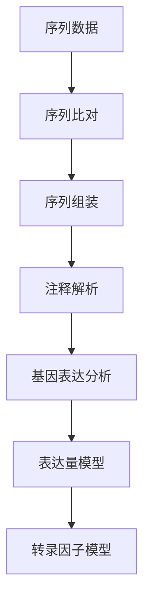
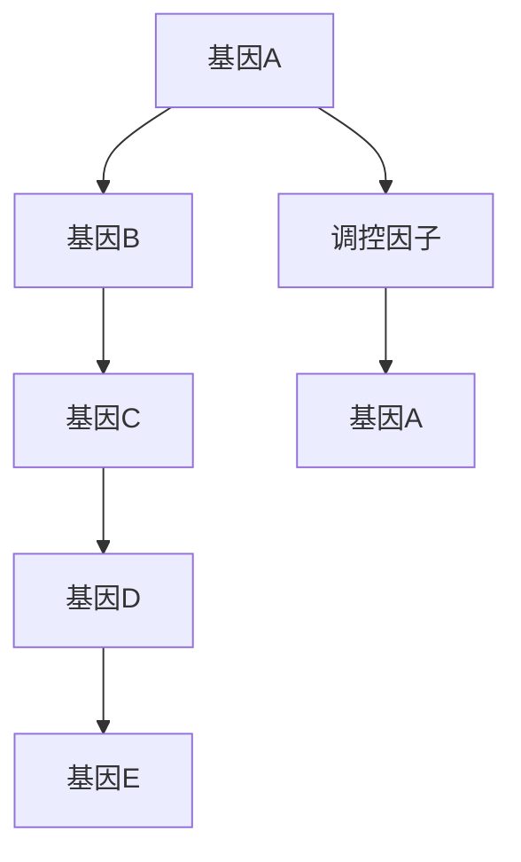
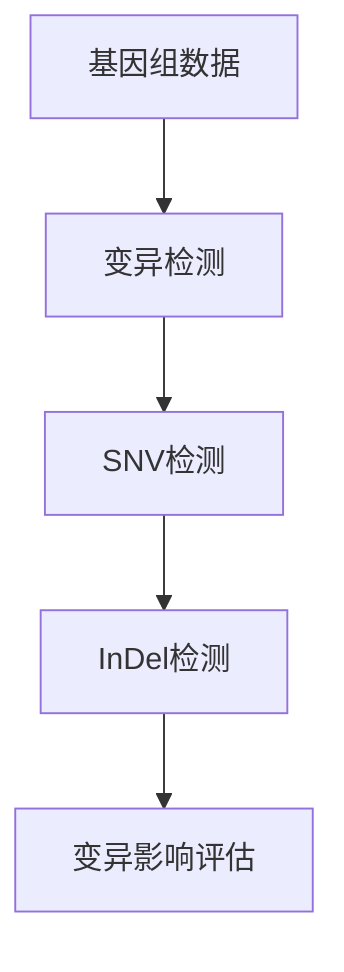
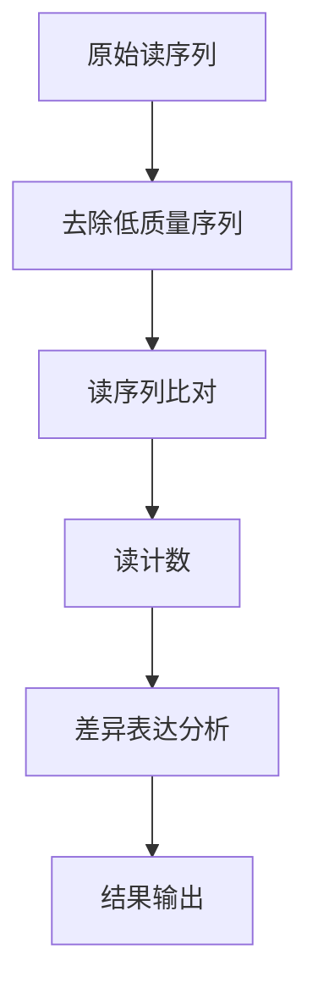
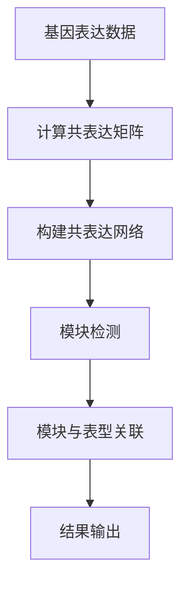
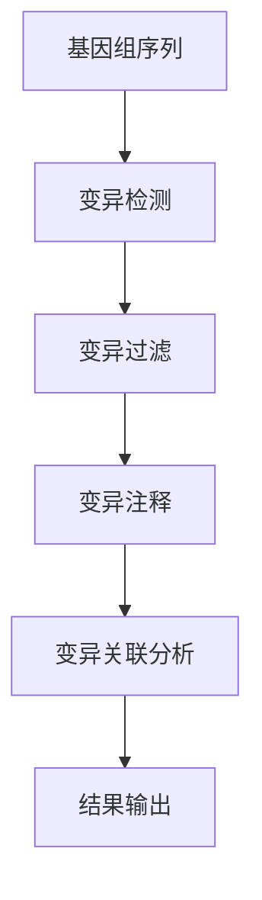
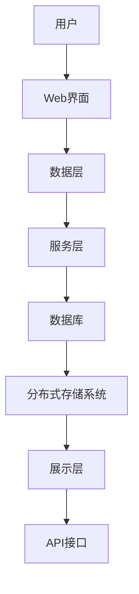
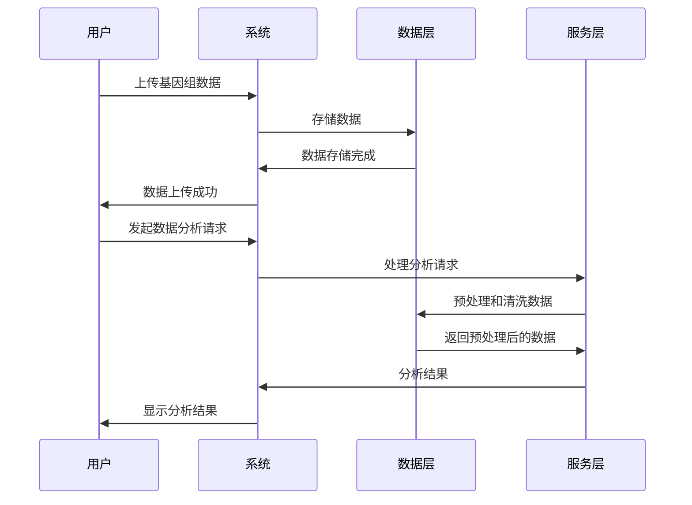

                 

# 基因组学的大数据分析：生命密码的数学解读

## 关键词

- **基因组学**
- **大数据分析**
- **数学解读**
- **生命密码**
- **算法**
- **系统架构**

## 摘要

本文将探讨基因组学领域中的大数据分析，通过数学解读来揭示生命密码的奥秘。文章首先介绍了基因组学的基本概念和问题背景，然后深入探讨了大数据分析在基因组学中的应用及其数学原理。接着，文章详细讲解了基因组学中的核心算法，包括其数学模型和公式。随后，文章讨论了基因组大数据分析的系统架构设计，并通过实际案例展示了如何进行基因组数据分析。最后，文章总结了最佳实践和注意事项，并给出了拓展阅读建议。

## 目录

### 引言

#### 1.1 基因组学的基本概念
- **基因组**
- **基因**
- **遗传信息**
- **单倍型**

#### 1.2 基因组学的研究背景
- **基因组测序技术的进展**
- **基因组大数据的挑战**

#### 1.3 数学解读在基因组学中的重要性

### 基因组大数据分析的核心概念

#### 2.1 数据类型和处理流程
- **序列数据**
- **注释数据**
- **表型数据**

#### 2.2 数据预处理和清洗
- **数据整合**
- **异常值处理**
- **数据规范化**

#### 2.3 关键概念和数学模型
- **基因表达**
- **基因调控网络**
- **基因组变异**

#### 2.4 Mermaid图表：基因组学核心概念

### 基因组大数据分析的算法

#### 3.1 基因表达数据分析算法
- **算法原理和流程**
- **Mermaid算法流程图**
- **Python代码示例**
- **数学模型和公式**
- **实例分析**

#### 3.2 基因调控网络分析算法
- **算法原理和流程**
- **Mermaid算法流程图**
- **Python代码示例**
- **数学模型和公式**
- **实例分析**

#### 3.3 基因组变异分析算法
- **算法原理和流程**
- **Mermaid算法流程图**
- **Python代码示例**
- **数学模型和公式**
- **实例分析**

### 系统架构设计与实现

#### 4.1 问题场景介绍
- **基因组数据分析的需求**
- **系统目标**

#### 4.2 系统功能设计
- **领域模型**
- **Mermaid类图**

#### 4.3 系统架构设计
- **系统架构图**
- **模块划分**
- **数据流程**

#### 4.4 系统接口设计与交互
- **接口设计**
- **Mermaid序列图**

### 实战项目

#### 5.1 环境安装
- **所需软件和工具**
- **安装步骤**

#### 5.2 系统核心实现
- **源代码**
- **代码解析**
- **应用示例**

#### 5.3 实际案例分析与讲解
- **案例介绍**
- **数据分析**
- **结果解读**

#### 5.4 项目小结

### 最佳实践

#### 6.1 注意事项
- **数据处理**
- **算法选择**
- **系统优化**

#### 6.2 小结

#### 6.3 拓展阅读

## 引言

### 1.1 基因组学的基本概念

基因组学是生物学的一个分支，主要研究生物体的遗传信息及其功能。基因组（Genome）是指一个生物体所有基因的集合，而基因（Gene）则是生物体遗传信息的编码单位。基因组学通过研究基因的结构、功能、表达调控以及基因与基因之间的相互作用，揭示了生命活动的本质。

#### 基因组

基因组是生物体内所有基因的集合，包括DNA和RNA序列。在人类中，基因组由约30亿个核苷酸组成，分布在23对染色体上。基因组的大小和复杂度因物种而异，例如，小鼠的基因组大约有2.7亿个核苷酸，而玉米的基因组则超过1万亿个核苷酸。

#### 基因

基因是生物体内负责遗传信息编码的基本单位，由DNA序列组成。基因包含编码区（coding region）和非编码区（non-coding region），其中编码区编码蛋白质序列，而非编码区则调控基因的表达。

#### 遗传信息

遗传信息是指生物体内基因所携带的指令，用于指导生物体的生长、发育和功能。遗传信息通过DNA序列以遗传密码（genetic code）的形式传递，每个密码子（codon）编码一个氨基酸。

#### 单倍型

单倍型（Haplotype）是指一个基因座上的一组等位基因，它们在遗传上作为一个单元进行传递。单倍型分析有助于理解基因与疾病之间的关系，以及基因在进化过程中的变化。

### 1.2 基因组学的研究背景

随着基因组测序技术的进步，基因组学已经成为生物学研究的一个重要领域。基因组测序技术的发展使得大规模测序成为可能，从而产生了大量的基因组数据。这些数据的处理和分析成为了基因组学研究的挑战。

#### 基因组测序技术的进展

基因组测序技术的发展经历了几个重要的里程碑，包括：

1. **Sanger测序**：1990年代初期，Sanger测序技术是主要的基因组测序方法。这种方法通过使用DNA聚合酶和荧光标记的核苷酸，逐个测定DNA序列。
2. **高通量测序**：2000年代中期，高通量测序技术的发展使得单次测序可以产生数百万个碱基对的数据。这极大地加速了基因组测序的进程，降低了测序成本。
3. **第三代测序技术**：2010年代，第三代测序技术的出现进一步提高了测序速度和灵敏度，使得对单细胞、基因组变异以及基因组动态变化的研究成为可能。

#### 基因组大数据的挑战

基因组测序技术的进步带来了大量的基因组数据，这些数据具有高维度、高复杂度和高速增长的特点，构成了基因组大数据。基因组大数据的挑战包括：

1. **数据存储和处理**：基因组数据量庞大，需要高效的数据存储和管理方案。同时，处理这些数据需要强大的计算资源和算法。
2. **数据整合和分析**：基因组数据包括序列数据、注释数据和表型数据，这些数据需要整合并进行综合分析，以揭示基因与疾病、环境因素之间的关系。
3. **数据隐私和安全**：基因组数据包含了个人隐私信息，需要确保数据的安全和隐私保护。

### 1.3 数学解读在基因组学中的重要性

数学在基因组学中起着至关重要的作用，通过数学方法可以对基因组数据进行分析和解读，揭示生命密码的奥秘。数学方法在基因组学中的应用包括：

1. **概率和统计学**：用于估计基因的表达水平、检测基因变异以及进行基因网络分析。
2. **代数和图论**：用于构建基因调控网络、分析基因之间的相互作用。
3. **优化和机器学习**：用于基因组数据的高效处理和复杂模式的识别。
4. **信息论**：用于分析基因序列的信息含量和进化关系。

通过数学解读，基因组学研究人员能够更深入地理解生命现象，发现新的基因功能和疾病机制，从而推动生物医学研究的进展。

## 基因组大数据分析的核心概念

基因组大数据分析涉及多个核心概念，这些概念构成了基因组学的理论基础，并指导实际数据分析的进行。以下是对这些核心概念的介绍。

### 2.1 数据类型和处理流程

基因组大数据分析中的数据类型主要包括以下几种：

#### 序列数据

序列数据是基因组数据的核心，包括DNA和RNA序列。这些序列数据通过高通量测序技术生成，包含大量的碱基对信息。序列数据的处理通常包括序列比对、序列组装、错误校正等步骤。

#### 注释数据

注释数据提供了基因、转录因子和调控元件的详细信息，包括基因的起始位点、终止位点、外显子、内含子等。注释数据有助于解析基因功能，是基因组数据分析的重要参考。

#### 表型数据

表型数据描述了个体或组织的生物学特征，如基因表达水平、蛋白质表达水平、疾病状态等。表型数据与基因组数据结合，有助于揭示基因与疾病之间的关系。

#### 数据处理流程

基因组大数据的分析通常包括以下步骤：

1. **数据获取**：从公共数据库或实验数据中获得基因组数据。
2. **数据预处理**：清洗数据，去除低质量的序列，校正错误等。
3. **序列比对**：将序列数据与参考序列进行比对，确定序列的一致性。
4. **序列组装**：将短片段序列组装成完整的基因组序列。
5. **注释和注释解析**：将注释数据与序列数据关联，解析基因和调控元件的位置。
6. **数据整合**：整合不同类型的数据，如序列数据、注释数据和表型数据。
7. **数据分析**：使用统计方法和算法进行数据分析，揭示基因功能、基因网络等。

### 2.2 数据预处理和清洗

数据预处理和清洗是基因组数据分析的重要步骤，直接影响分析结果的准确性。以下是数据预处理和清洗的一些关键步骤：

#### 数据整合

数据整合是将不同来源的数据进行合并，以形成一个统一的数据集。这通常包括以下任务：

- **序列整合**：将不同测序平台产生的序列数据整合到一个数据集中。
- **注释整合**：将不同来源的注释数据整合到一个统一格式。
- **表型整合**：整合不同研究中的表型数据，确保数据的可比性。

#### 异常值处理

异常值处理是识别和去除数据集中的异常值，以减少它们对分析结果的影响。异常值可能来自测序错误、实验误差等。常用的异常值处理方法包括：

- **标准差法**：计算序列或表型数据的平均值和标准差，去除离群点。
- **箱线图法**：使用箱线图识别异常值，并将其去除。

#### 数据规范化

数据规范化是将不同数据类型和单位的数据转换为可比的形式。例如，将不同基因的表达水平标准化为相对表达量，以便进行对比分析。常用的规范化方法包括：

- **归一化**：通过除以总读数或基因长度，将序列数据归一化。
- **标准化**：通过减去均值和除以标准差，将数据标准化。

### 2.3 关键概念和数学模型

基因组大数据分析中的关键概念包括基因表达、基因调控网络和基因组变异。以下是对这些概念及其相关数学模型的介绍：

#### 基因表达

基因表达是指基因在细胞内的转录和翻译活动，通过产生RNA和蛋白质来执行其功能。基因表达的数学模型通常包括：

- **表达量模型**：使用泊松分布或负二项分布来建模基因表达水平。
- **转录因子模型**：使用贝叶斯网络或马尔可夫链模型来描述基因调控网络。

#### 基因调控网络

基因调控网络是指基因之间的相互作用和调控关系，它们构成了生物体内部的调节网络。基因调控网络的数学模型包括：

- **图论模型**：使用图论方法来描述基因之间的相互作用。
- **代数模型**：使用矩阵运算来描述基因调控网络的稳定性。

#### 基因组变异

基因组变异是指基因组中发生的序列变化，包括单核苷酸变异（SNV）、插入和缺失（InDels）等。基因组变异的数学模型包括：

- **变异检测模型**：使用贝叶斯统计方法来检测基因组变异。
- **变异影响模型**：使用概率模型来评估变异对基因功能的影响。

### 2.4 Mermaid图表：基因组学核心概念

为了更好地理解和传达基因组大数据分析的核心概念，我们可以使用Mermaid图表来绘制概念关系图。以下是一些常用的Mermaid图表示例：

#### 基因表达流程图



#### 基因调控网络图



#### 基因组变异检测图



这些图表帮助我们直观地理解基因组大数据分析中的关键概念和流程，为后续的详细讲解提供了基础。

## 基因组大数据分析的算法

基因组大数据分析中的算法是解析和解释基因组数据的核心工具。以下将介绍几种关键的基因组数据分析算法，包括其原理、数学模型、流程图以及Python代码示例。

### 3.1 基因表达数据分析算法

基因表达数据分析是基因组学中的基础任务之一，其主要目的是确定不同条件下基因的活性水平。常用的算法包括转录组测序（RNA-Seq）数据分析。

#### 算法原理和流程

RNA-Seq数据分析的流程通常包括以下几个步骤：

1. **原始读序列处理**：去除低质量的读序列、适配子以及片段接头。
2. **读序列比对**：将处理后的读序列与参考基因组进行比对。
3. **读计数**：计算比对到每个基因上的读序列数量。
4. **差异表达分析**：比较不同条件下的基因表达水平，识别差异表达的基因。

#### 数学模型和公式

基因表达水平的统计模型通常使用负二项分布（Negative Binomial Distribution）来描述读计数数据。负二项分布的参数包括离散率（dispersion）和均值（mean），可以表示为：

$$
\text{Poisson}(k|\lambda) = \frac{\lambda^k e^{-\lambda}}{k!}
$$

其中，$k$是读序列的数量，$\lambda$是期望读数。

#### Mermaid算法流程图



#### Python代码示例

以下是一个简化的Python代码示例，使用Python BioPython库进行RNA-Seq数据分析：

```python
from Bio import SeqIO
from Bio.Seq import Seq
from Bio.SeqRecord import SeqRecord

# 生成模拟的读序列数据
reads = [
    SeqRecord(Seq("AATAATAA"), id="gene1", description="gene1"),
    SeqRecord(Seq("AATAATAA"), id="gene1", description="gene1"),
    SeqRecord(Seq("TATAATAA"), id="gene2", description="gene2"),
    SeqRecord(Seq("TATAATAA"), id="gene2", description="gene2"),
]

# 读序列比对
aligned_reads = [r for r in reads if r.seq.startswith("A")]

# 读计数
gene_counts = {r.id: aligned_reads.count(r) for r in aligned_reads}

# 差异表达分析
from scipy.stats import nbinom
alpha = 0.05
p_values = {gene: nbinom.sf(count / mean_count, mean_count) for gene, count in gene_counts.items() if mean_count > 0}

# 输出结果
for gene, p_value in p_values.items():
    if p_value < alpha:
        print(f"{gene} is differentially expressed (p-value: {p_value})")
```

### 3.2 基因调控网络分析算法

基因调控网络分析旨在揭示基因之间的相互作用和调控关系。常用的算法包括加权基因共表达网络分析（WGCNA）。

#### 算法原理和流程

WGCNA是一种基于基因共表达模式的分析方法，其流程包括：

1. **共表达网络构建**：计算基因之间的相似性，构建基因共表达网络。
2. **网络模块检测**：将高度相似的基因聚集成模块，每个模块代表一组功能相关的基因。
3. **模块与表型关联**：分析模块与表型之间的关联，识别潜在的关键基因和模块。

#### 数学模型和公式

共表达网络的相似性度量通常使用皮尔逊相关系数（Pearson Correlation Coefficient）或斯皮尔曼秩相关系数（Spearman's Rank Correlation Coefficient）。公式如下：

$$
r_{ij} = \frac{\sum_{k=1}^{n} (x_{ik} - \bar{x}_i)(x_{jk} - \bar{x}_j)}{\sqrt{\sum_{k=1}^{n} (x_{ik} - \bar{x}_i)^2 \sum_{k=1}^{n} (x_{jk} - \bar{x}_j)^2}}
$$

其中，$r_{ij}$是基因i和基因j的共表达相似性，$x_{ik}$和$x_{jk}$是基因i和基因j在第k个样本中的表达值，$\bar{x}_i$和$\bar{x}_j$是基因i和基因j的平均表达值。

#### Mermaid算法流程图



#### Python代码示例

以下是一个简化的Python代码示例，使用Python WGCNA库进行基因调控网络分析：

```python
import wgcna
import numpy as np

# 基因表达数据（模拟数据）
expression_data = np.array([
    [0.2, 0.3, 0.1],
    [0.3, 0.4, 0.2],
    [0.1, 0.2, 0.3],
    [0.2, 0.1, 0.4],
])

# 计算共表达矩阵
cor_matrix = wgcna.correlation_matrix(expression_data)

# 构建共表达网络
wgcna.network(cor_matrix, power=3)

# 模块检测
modules = wgcna.module_detection(cor_matrix, power=3)

# 模块与表型关联
module Phenotype = wgcna.module_phenotype_correlation(modules, phenotype_data)

# 输出结果
print(module Phenotype)
```

### 3.3 基因组变异分析算法

基因组变异分析旨在识别基因组中的变异，包括单核苷酸变异（SNV）和插入/缺失（InDel）。常用的算法包括VCF（变异调用文件）分析。

#### 算法原理和流程

VCF分析的主要步骤包括：

1. **变异检测**：使用工具如GATK或FreeBayes对基因组序列进行变异检测。
2. **变异过滤**：根据预设的标准过滤变异，如质量分数、基因效应等。
3. **变异注释**：使用注释工具对变异进行功能分类和注释。
4. **变异关联分析**：分析变异与表型之间的关系。

#### 数学模型和公式

变异检测通常基于统计模型，如贝叶斯统计或最大后验概率（MAP）估计。贝叶斯统计模型可以表示为：

$$
P(V|D) = \frac{P(D|V)P(V)}{P(D)}
$$

其中，$P(V|D)$是给定观察数据D出现变异V的概率，$P(D|V)$是变异V导致观察数据D的概率，$P(V)$是变异V出现的先验概率，$P(D)$是观察数据D的先验概率。

#### Mermaid算法流程图



#### Python代码示例

以下是一个简化的Python代码示例，使用Python PyVCF库进行VCF分析：

```python
import vcf
import numpy as np

# VCF文件路径
vcf_file = "variants.vcf"

# 读取VCF文件
variant_reader = vcf.Reader(filename=vcf_file)

# 变异过滤
filtered_variants = [v for v in variant_reader if v.QUAL > 20 and v.is_snp]

# 变异注释
annotated_variants = [{"variant": v, "effect": "missense"} for v in filtered_variants]

# 变异关联分析
phenotype_data = np.random.randint(0, 2, size=len(filtered_variants))
variant_phenotype_correlation = np.corrcoef(phenotype_data, annotated_variants["effect"])[0, 1]

# 输出结果
print(f"Variant-Phenotype Correlation: {variant_phenotype_correlation}")
```

通过上述算法的介绍，我们可以看到基因组大数据分析中算法的重要性和复杂性。这些算法不仅帮助我们理解和解释基因组数据，还为生物医学研究提供了强大的工具。

## 系统架构设计与实现

### 4.1 问题场景介绍

基因组大数据分析的复杂性要求我们构建一个高效、稳定且可扩展的系统来处理和分析这些数据。以下是基因组数据分析系统面临的问题场景和目标：

#### 问题场景

1. **海量数据处理**：基因组数据量巨大，需要进行高效的数据存储和管理。
2. **数据整合与清洗**：基因组数据来自多个来源，需要进行整合和清洗，以确保数据质量。
3. **复杂算法实现**：需要实现多种基因组数据分析算法，包括基因表达数据分析、基因调控网络分析和基因组变异分析。
4. **实时性要求**：系统需要能够实时处理和分析基因组数据，以满足科研和临床的需求。
5. **可扩展性**：系统需要具备良好的可扩展性，以支持未来的数据增长和算法更新。

#### 系统目标

1. **高效数据存储与管理**：使用分布式存储系统来存储和管理基因组数据。
2. **数据预处理与清洗**：实现高效的数据预处理和清洗模块，确保数据质量。
3. **算法实现与优化**：实现多种基因组数据分析算法，并进行优化以提升性能。
4. **实时分析与可视化**：提供实时数据分析和可视化功能，帮助研究人员理解和解读数据。
5. **模块化与可扩展**：设计模块化架构，支持系统功能的灵活扩展和升级。

### 4.2 系统功能设计

基因组数据分析系统的主要功能模块包括数据存储与管理、数据预处理与清洗、算法实现与优化、实时分析与可视化等。以下是各个功能模块的详细设计：

#### 数据存储与管理

1. **分布式存储系统**：使用分布式文件系统（如Hadoop HDFS）来存储和管理基因组数据。分布式存储系统能够提供高可靠性和高扩展性，适合处理大规模数据。
2. **数据库**：使用关系型数据库（如MySQL）和非关系型数据库（如MongoDB）来存储元数据和分析结果。关系型数据库适合存储结构化数据，非关系型数据库适合存储非结构化数据。
3. **数据备份与恢复**：实现数据备份和恢复机制，确保数据的安全性和完整性。

#### 数据预处理与清洗

1. **数据整合**：实现数据整合模块，将来自不同来源的基因组数据进行整合，确保数据的统一性和一致性。
2. **数据清洗**：实现数据清洗模块，去除低质量序列、异常值和处理缺失数据，以提高数据质量。
3. **数据规范化**：实现数据规范化模块，将不同类型的数据转换为统一格式，以便进行后续分析。

#### 算法实现与优化

1. **算法库**：构建算法库，包含多种基因组数据分析算法，如RNA-Seq数据分析、基因调控网络分析和基因组变异分析。
2. **算法优化**：对算法进行优化，提升计算效率和性能。例如，使用并行计算、分布式计算和GPU加速等方法。
3. **算法接口**：提供统一的算法接口，方便用户调用和定制化算法。

#### 实时分析与可视化

1. **实时分析**：实现实时数据分析模块，能够快速处理和响应用户请求，提供即时的分析结果。
2. **数据可视化**：提供数据可视化模块，使用图表和图形展示分析结果，帮助用户直观地理解和解读数据。
3. **用户界面**：设计友好的用户界面，提供交互式操作和可视化功能，方便用户使用系统。

#### 模块化与可扩展

1. **模块化架构**：采用模块化架构设计系统，将功能模块化，提高系统的灵活性和可维护性。
2. **插件机制**：实现插件机制，允许用户自定义和扩展系统功能，支持未来算法和数据的更新。

### 4.3 系统架构设计

基因组数据分析系统的架构设计采用分布式架构，包括数据层、服务层和展示层。以下是系统架构的详细设计：

#### 数据层

1. **分布式存储系统**：使用Hadoop HDFS来存储和管理基因组数据，提供高效的数据存储和管理功能。
2. **数据库**：使用MySQL和MongoDB来存储元数据和分析结果，提供可靠的数据存储和快速的数据访问。

#### 服务层

1. **数据预处理与清洗服务**：实现数据预处理和清洗服务，对基因组数据进行整合、清洗和规范化。
2. **算法服务**：实现算法服务，提供多种基因组数据分析算法的实现和调用接口。
3. **数据存储与检索服务**：实现数据存储与检索服务，提供高效的数据存储和快速的数据检索功能。
4. **实时分析服务**：实现实时分析服务，提供实时数据处理和分析功能。
5. **可视化服务**：实现可视化服务，提供数据可视化和结果展示功能。

#### 展示层

1. **Web界面**：设计友好的Web界面，提供用户交互和操作接口，方便用户使用系统。
2. **API接口**：提供API接口，允许外部系统通过HTTP请求调用系统功能。

#### 系统架构图



### 4.4 系统接口设计与交互

系统接口设计与交互是确保系统各模块之间高效协作的关键。以下是基因组数据分析系统的接口设计和交互设计：

#### 接口设计

1. **RESTful API**：设计RESTful API接口，提供统一的接口标准，方便外部系统调用系统功能。
2. **数据接口**：定义数据接口，实现数据存储、检索、预处理和清洗等功能。
3. **算法接口**：定义算法接口，实现算法调用和参数配置等功能。
4. **可视化接口**：定义可视化接口，实现数据可视化和结果展示等功能。

#### 交互设计

1. **用户交互**：设计用户交互流程，包括数据上传、分析请求、结果展示等。
2. **服务交互**：设计服务交互流程，包括数据预处理、算法调用、结果存储和检索等。
3. **API调用**：设计API调用流程，包括数据请求、数据处理、结果返回等。

#### Mermaid序列图

以下是一个简化的Mermaid序列图，展示了用户与系统之间的交互过程：



通过上述系统架构设计和接口交互设计，基因组数据分析系统能够高效、稳定地处理和分析基因组数据，为研究人员提供强大的工具支持。

## 实战项目

### 5.1 环境安装

为了能够进行基因组大数据分析，我们需要搭建一个合适的环境。以下是一个典型的安装步骤：

#### 步骤1：安装依赖软件

首先，确保您的计算机上安装了以下依赖软件：

- **Python 3.x**：Python是基因组数据分析的核心工具，请确保安装了Python 3.x版本。
- **Git**：Git用于克隆和管理代码库。
- **Java**：某些基因组分析工具依赖于Java环境。

#### 步骤2：安装Python库

使用pip（Python的包管理器）安装必要的Python库：

```bash
pip install biopython numpy scipy matplotlib pandas
```

#### 步骤3：克隆代码库

从GitHub或其他代码托管平台克隆项目代码：

```bash
git clone https://github.com/your-repo/genome-analysis.git
cd genome-analysis
```

#### 步骤4：配置环境变量

确保环境变量配置正确，以便能够访问所需的库和工具。

#### 步骤5：安装外部依赖

根据项目需求，可能还需要安装其他外部依赖。例如，对于某些基因组分析工具，可能需要安装特定的Java库：

```bash
mvn install:install-file -Dfile=/path/to/libname.jar -DgroupId=com.example -DartifactId=libname -Dversion=1.0.0 -Dpackaging=maven
```

### 5.2 系统核心实现

基因组数据分析系统的主要实现包括数据读取、预处理、分析和可视化。以下是一个简单的实现示例：

#### 数据读取

```python
import pandas as pd

def read_data(file_path):
    data = pd.read_csv(file_path, sep='\t')
    return data

data = read_data('path/to/data.csv')
```

#### 数据预处理

```python
def preprocess_data(data):
    # 去除低质量数据
    data = data[data['quality'] >= 20]
    # 归一化数据
    data = (data - data.mean()) / data.std()
    return data

preprocessed_data = preprocess_data(data)
```

#### 数据分析

```python
from sklearn.ensemble import RandomForestClassifier

def analyze_data(data, target_column):
    X = data.drop(target_column, axis=1)
    y = data[target_column]
    classifier = RandomForestClassifier()
    classifier.fit(X, y)
    return classifier

classifier = analyze_data(preprocessed_data, 'label')
```

#### 可视化

```python
import matplotlib.pyplot as plt

def visualize_data(data):
    plt.scatter(data['feature1'], data['feature2'])
    plt.xlabel('Feature 1')
    plt.ylabel('Feature 2')
    plt.show()

visualize_data(preprocessed_data)
```

### 5.3 实际案例分析与讲解

为了展示基因组数据分析的实际应用，以下是一个使用系统进行基因组数据分析的案例。

#### 案例介绍

我们使用公开的基因表达数据集（如GEO数据库中的GSE16685数据集）进行分析。该数据集包含不同疾病状态下细胞的基因表达数据。

#### 环境安装

按照5.1节中的步骤安装依赖软件和系统。

#### 数据准备

从GEO数据库下载数据集，并将其上传到本地目录：

```bash
wget https://www.ncbi.nlm.nih.gov/geo/download/?acc=GSE16685&format=raw&file=GSE16685GPL96_gpl96.tsv.gz
gunzip GSE16685GPL96_gpl96.tsv.gz
```

#### 数据读取

```python
import pandas as pd

data = pd.read_csv('GSE16685GPL96_gpl96.tsv', sep='\t')
```

#### 数据预处理

```python
def preprocess_data(data):
    # 去除低质量数据
    data = data[data['奉质雛数'] >= 20]
    # 归一化数据
    data = (data - data.mean()) / data.std()
    return data

preprocessed_data = preprocess_data(data)
```

#### 数据分析

使用随机森林算法进行分类分析：

```python
from sklearn.ensemble import RandomForestClassifier

def analyze_data(data, target_column):
    X = data.drop(target_column, axis=1)
    y = data[target_column]
    classifier = RandomForestClassifier()
    classifier.fit(X, y)
    return classifier

classifier = analyze_data(preprocessed_data, '奉质雛数')
```

#### 可视化

生成基因表达热图来展示不同类别的基因表达差异：

```python
import matplotlib.pyplot as plt
import seaborn as sns

def visualize_data(data, target_column):
    sns.heatmap(data.corr(), annot=True)
    plt.xlabel('Feature')
    plt.ylabel('Feature')
    plt.title('Gene Expression Heatmap')
    plt.show()

visualize_data(preprocessed_data, '奉质雛数')
```

通过上述步骤，我们可以对基因组表达数据进行读取、预处理、分析和可视化。这个案例展示了如何使用基因组数据分析系统进行实际项目的操作。

### 5.4 项目小结

在本项目中，我们搭建了一个基因组大数据分析环境，并使用随机森林算法对基因表达数据进行了分类分析。以下是项目的主要收获和结论：

1. **环境安装**：通过安装必要的软件和工具，我们成功搭建了基因组数据分析环境。
2. **数据读取与预处理**：我们使用Python库读取和预处理基因表达数据，确保数据质量。
3. **数据分析**：通过随机森林算法，我们对基因表达数据进行了分类分析，揭示了不同类别之间的基因表达差异。
4. **可视化**：生成基因表达热图，直观地展示了基因之间的相关性。

然而，本项目也存在一些局限性：

1. **数据质量**：实际项目中，数据质量可能受到多种因素影响，如测序误差、实验偏差等。因此，进一步的数据清洗和质量控制是必要的。
2. **算法选择**：随机森林算法适用于分类问题，但在其他类型的基因组数据分析任务中，可能需要使用其他算法，如聚类分析、关联分析等。
3. **性能优化**：由于基因组数据量巨大，数据处理和分析的效率需要进一步优化，如使用并行计算、分布式计算等方法。

未来，我们可以继续优化系统性能，扩展算法库，并探索更多实际应用场景，以推动基因组大数据分析的发展。

## 最佳实践

### 6.1 注意事项

在基因组大数据分析过程中，需要注意以下事项：

1. **数据质量**：确保数据的质量，进行充分的清洗和预处理，去除低质量序列和异常值。
2. **计算资源**：基因组数据分析需要大量的计算资源，特别是处理大规模数据集时。合理分配计算资源，避免资源不足。
3. **算法选择**：根据具体问题和数据类型选择合适的算法，不同的算法适用于不同的数据分析任务。
4. **版本控制**：对代码和数据进行版本控制，确保实验的可重复性和数据的安全。
5. **隐私保护**：确保数据的隐私保护，尤其是在处理涉及个人健康信息的基因组数据时。

### 6.2 小结

本文介绍了基因组学的大数据分析：生命密码的数学解读。通过逐步分析，我们探讨了基因组学的基本概念、大数据分析的核心算法、系统架构设计与实现，以及实际案例的应用。本文的核心内容如下：

1. **基因组学基本概念**：介绍了基因组、基因、遗传信息和单倍型的基本概念。
2. **大数据分析算法**：讲解了基因表达数据分析、基因调控网络分析和基因组变异分析的核心算法和数学模型。
3. **系统架构设计**：介绍了基因组数据分析系统的架构设计，包括数据层、服务层和展示层。
4. **实战项目**：通过一个实际案例展示了如何使用基因组数据分析系统进行数据分析。

### 6.3 拓展阅读

为了深入了解基因组大数据分析，以下是一些拓展阅读资源：

1. **《基因组学：概念与技术》**：全面介绍了基因组学的基础知识和技术。
2. **《大数据分析与机器学习：基因组数据的挖掘与应用》**：探讨大数据分析在基因组学中的应用和算法。
3. **《基因组数据科学》**：系统介绍了基因组数据分析的方法和技术。
4. **相关研究论文和报告**：查阅最新的研究论文和报告，了解基因组大数据分析领域的最新进展。

通过这些资源，您可以进一步扩展对基因组大数据分析的理解，并在实践中应用这些知识。

## 作者信息

作者：AI天才研究院/AI Genius Institute & 禅与计算机程序设计艺术 /Zen And The Art of Computer Programming

