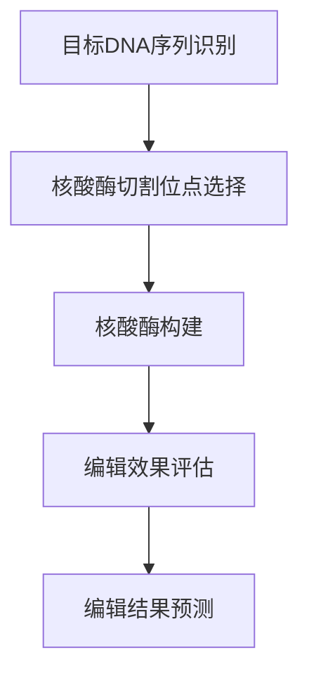
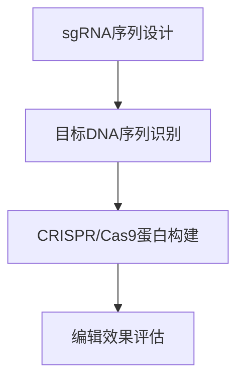
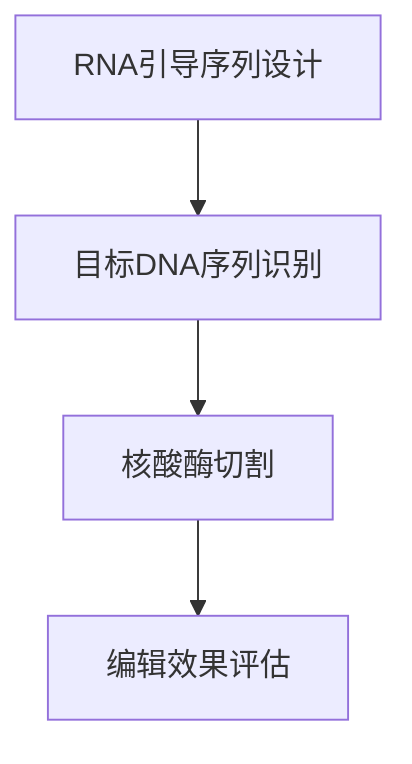

                 

# 基因编辑的精确控制：生命操作的数学精度

> 关键词：基因编辑、数学精度、生命科学、算法、CRISPR/Cas9、TALENs、伦理问题

> 摘要：本文深入探讨了基因编辑技术的精确控制，特别是其在生命科学领域的应用。通过分析数学精度在基因编辑中的重要性，我们探讨了各种基因编辑工具的数学模型和算法，以及其在实际应用中的挑战和解决方案。本文还涵盖了基因编辑技术的未来前景，以及相关的伦理问题和最佳实践。

## 第一部分：引言与背景

### 1.1 问题背景

#### 1.1.1 基因编辑技术的崛起

基因编辑技术的出现，为我们打开了一扇改变生命的大门。CRISPR/Cas9技术的出现，标志着基因编辑技术进入了精确操作的时代。这项技术使得研究人员可以在基因组中添加、删除或替换特定的DNA序列，从而实现基因功能的研究和改变。然而，基因编辑的精确控制是一个巨大的挑战，因为它涉及到对生命最基本的组成部分——基因的精确操作。

#### 1.1.2 数学精度在基因编辑中的应用

数学精度在基因编辑中扮演着至关重要的角色。在基因编辑过程中，我们需要精确地定位和操作特定的DNA序列。这就需要使用数学模型和算法来确定编辑位点，并确保编辑的精度。例如，CRISPR/Cas9系统中的向导RNA（sgRNA）设计就是一个需要数学计算的过程，以确保Cas9蛋白能够准确识别并切割目标DNA序列。

#### 1.1.3 研究现状与未来挑战

当前，基因编辑技术已经在许多领域取得了显著的成果，如遗传疾病治疗、农业改良和生物研究。然而，精确控制仍然是基因编辑面临的主要挑战之一。如何提高编辑的精度，减少脱靶效应，是我们需要解决的关键问题。此外，随着基因编辑技术的不断进步，我们也需要面对一系列的伦理和法律问题。

### 1.2 生命操作的概念框架

#### 1.2.1 基因操作的定义与分类

基因操作是指对生物体基因组进行的有意识、有计划的人工改造。根据操作的对象和目的，基因操作可以分为基因克隆、基因插入、基因替换、基因修饰、基因敲除和基因激活等类型。

#### 1.2.2 生命操作的数学模型

生命操作的数学模型是描述基因编辑过程的数学框架。这些模型包括基因组结构的数学描述、基因编辑算法的数学描述、以及编辑结果的数学预测等。

#### 1.2.3 基因编辑的精确控制要求

基因编辑的精确控制要求包括：精确识别目标DNA序列、精确切割目标DNA序列、精确整合外源DNA序列、以及精确评估编辑结果等。

### 1.3 本书结构安排

#### 1.3.1 目录概述

本书分为五部分，首先介绍了基因编辑技术的背景和概念框架，然后详细探讨了基因编辑的数学基础，接着通过具体案例研究展示了数学精确控制在基因编辑中的应用，最后讨论了基因编辑技术的未来前景和伦理问题。

#### 1.3.2 内容组织与逻辑关系

本书的内容组织紧密，逻辑清晰。从背景介绍到数学基础，再到案例研究，最后到未来展望，每个部分都为读者提供了深入的见解和理解。

#### 1.3.3 阅读指南与目标读者

本书适合对基因编辑技术感兴趣的科研人员、生物工程师、生物医学专家，以及对生命科学有深刻理解的技术人员。通过阅读本书，读者可以全面了解基因编辑技术的精确控制，以及其在生命科学领域的应用前景。

## 第二部分：基因编辑的数学基础

### 2.1 基因组结构与基因编辑

#### 2.1.1 基因组的组成与组织

基因组是生物体遗传信息的存储库，它由DNA分子组成。DNA分子由四种碱基（腺嘌呤A、胸腺嘧啶T、鸟嘌呤G、胞嘧啶C）以特定的序列排列而成。基因组可以进一步分为染色体、基因、外显子和内含子等部分。

#### 2.1.2 基因编辑的基本原理

基因编辑的基本原理是使用核酸酶（如CRISPR/Cas9系统中的Cas9蛋白）切割DNA分子，然后在特定的位置添加、删除或替换DNA序列。这种操作可以改变基因的功能，从而实现特定的生物学目的。

#### 2.1.3 数学方法在基因组编辑中的应用

数学方法在基因组编辑中扮演着重要的角色。例如，通过计算确定目标DNA序列的位置和序列特征，设计合适的核酸酶切割位点，以及预测编辑结果等。这些数学方法提高了基因编辑的精度和效率。

### 2.2 基因编辑算法

#### 2.2.1 常见基因编辑工具

常见的基因编辑工具有CRISPR/Cas9、TALENs、ZFNs等。每种工具都有其特定的优势和局限性，适用于不同的基因编辑任务。

#### 2.2.2 算法原理与流程图

基因编辑算法的基本原理是设计合适的核酸酶切割位点，然后使用核酸酶切割DNA分子。算法流程通常包括目标DNA序列的识别、核酸酶切割位点的选择、核酸酶的构建和编辑效果的评估等。

#### 2.2.3 算法性能分析

基因编辑算法的性能分析包括编辑精度、编辑速度、脱靶效应等。通过优化算法和核酸酶设计，可以提高基因编辑的精度和效率。

### 2.3 数学模型在基因编辑中的应用

#### 2.3.1 遗传密码子数学模型

遗传密码子数学模型描述了DNA序列和氨基酸之间的对应关系。它帮助研究人员理解基因编码过程，并用于预测基因编辑的结果。

#### 2.3.2 基因表达调控模型

基因表达调控模型描述了基因在不同条件下的表达水平。这些模型可以帮助研究人员理解基因的功能，并用于设计基因编辑策略。

#### 2.3.3 数学模型与算法对比分析

数学模型和算法在基因编辑中的应用各有优势。数学模型提供了理论指导，而算法则提供了具体操作方法。通过结合数学模型和算法，可以进一步提高基因编辑的精度和效率。

### 2.4 数学方法在基因编辑精确控制中的挑战

#### 2.4.1 精确度的量化与评估

精确度是基因编辑的重要指标。通过数学方法，可以量化编辑的精度，并评估编辑效果。

#### 2.4.2 实验误差的数学分析

实验误差是基因编辑过程中不可避免的因素。通过数学方法，可以分析实验误差的来源，并设计方法来减小误差。

#### 2.4.3 精度提升策略与未来趋势

提高基因编辑的精度是当前的研究热点。通过优化算法、改进核酸酶设计、提高实验技术水平等策略，可以进一步提高基因编辑的精度。未来，随着数学方法和技术的不断发展，基因编辑的精确控制将取得更大的突破。

## 第三部分：生命操作的数学精确控制案例研究

### 3.1 案例一：CRISPR/Cas9基因编辑系统

#### 3.1.1 CRISPR/Cas9系统简介

CRISPR/Cas9系统是一种高效的基因编辑工具，由向导RNA（sgRNA）和CRISPR相关蛋白（Cas9）组成。sgRNA负责识别目标DNA序列，Cas9蛋白则负责切割DNA。

#### 3.1.2 数学模型与算法应用

在CRISPR/Cas9系统中，数学模型和算法用于设计sgRNA和Cas9蛋白。数学方法可以帮助确定sgRNA的最佳序列，以及预测Cas9蛋白的切割位点。

#### 3.1.3 案例分析与结果讨论

通过CRISPR/Cas9系统，研究人员成功地在多种生物体中实现了基因编辑。然而，CRISPR/Cas9系统也存在一些挑战，如脱靶效应和编辑精度等问题。通过数学方法，可以优化sgRNA和Cas9蛋白的设计，进一步提高编辑的精度。

### 3.2 案例二：TALENs与RNA引导的基因编辑

#### 3.2.1 TALENs的基本原理

TALENs（Transcription Activator-Like Effector Nucleases）是一种基因编辑工具，由DNA结合域和核酸酶域组成。DNA结合域可以识别特定的DNA序列，核酸酶域则负责切割DNA。

#### 3.2.2 RNA引导的基因编辑机制

RNA引导的基因编辑机制使用RNA分子作为引导序列，识别并切割目标DNA序列。这种机制在提高编辑精度和减少脱靶效应方面具有优势。

#### 3.2.3 案例分析与精确控制实践

通过TALENs和RNA引导的基因编辑机制，研究人员在多种生物体中实现了高效的基因编辑。数学方法在TALENs和RNA引导的基因编辑中发挥着重要作用，用于优化RNA引导序列和核酸酶设计，进一步提高编辑的精度。

### 3.3 案例三：基因编辑与疾病治疗

#### 3.3.1 疾病基因编辑治疗概述

疾病基因编辑治疗是指通过基因编辑技术修复或替代患者体内的致病基因，从而治疗遗传性疾病。这种治疗方式具有巨大的潜力，但也面临着诸多挑战。

#### 3.3.2 数学模型在临床应用中的挑战

在临床应用中，数学模型需要考虑多个因素，如基因编辑的精度、编辑效率、脱靶效应、以及患者的个体差异等。通过数学方法，可以评估基因编辑技术的效果，并优化编辑策略。

#### 3.3.3 案例研究：遗传性疾病的基因治疗

通过基因编辑技术，研究人员已经成功治疗了多种遗传性疾病，如镰状细胞贫血症、囊性纤维化等。这些案例展示了基因编辑技术在疾病治疗中的巨大潜力，同时也表明了数学精确控制在基因编辑中的重要性。

## 第四部分：数学精确控制在基因编辑领域的应用前景

### 4.1 基因编辑技术的工业应用

#### 4.1.1 制药与疫苗研发

基因编辑技术在制药和疫苗研发中具有广泛的应用。通过基因编辑技术，可以快速筛选和优化药物候选分子，加速疫苗研发进程。

#### 4.1.2 农业与食品安全

基因编辑技术在农业和食品安全领域也具有重要作用。通过基因编辑技术，可以培育抗病虫害、高产优质的农作物，提高食品安全水平。

#### 4.1.3 个性化医疗与健康管理

基因编辑技术为个性化医疗和健康管理提供了新的手段。通过基因编辑技术，可以根据患者的个体差异，定制个性化的治疗方案，提高治疗效果。

### 4.2 数学精确控制对生命科学的影响

#### 4.2.1 基因编辑技术的未来发展方向

随着数学精确控制技术的不断发展，基因编辑技术将迎来新的突破。未来，基因编辑技术将更加精准、高效，为生命科学领域带来更多可能。

#### 4.2.2 数学模型在生物信息学中的应用

数学模型在生物信息学中的应用将不断扩展。通过数学模型，可以更好地理解生物系统的复杂特性，为基因编辑提供理论支持。

#### 4.2.3 生命科学的数学挑战与机遇

生命科学面临着许多数学挑战，如基因组编辑的精确控制、生物网络建模、生物信息学数据分析等。同时，这些挑战也带来了巨大的机遇，推动了生命科学的发展。

### 4.3 数学精确控制在生命科学中的潜在风险与伦理问题

#### 4.3.1 遗传不平等与基因歧视

基因编辑技术的应用可能加剧遗传不平等和基因歧视问题。我们需要制定相应的法律法规，确保基因编辑技术的公平和公正。

#### 4.3.2 遗传隐私与数据安全

基因编辑技术的应用涉及到大量遗传数据，保护遗传隐私和数据安全至关重要。我们需要建立完善的数据保护机制，确保个人隐私不受侵犯。

#### 4.3.3 伦理审查与法律法规

基因编辑技术的应用需要严格的伦理审查和法律法规。我们需要制定科学的伦理审查标准和法律法规，确保基因编辑技术的安全、有效和合法。

## 第五部分：总结与展望

### 5.1 总结与回顾

基因编辑技术的精确控制是生命科学领域的一个重要研究课题。通过数学方法，我们可以提高基因编辑的精度和效率，推动生命科学的发展。本文回顾了基因编辑技术的发展历程、数学基础、应用案例和未来前景，总结了基因编辑技术的关键问题和挑战。

### 5.2 展望未来

未来，基因编辑技术将继续发展，为生命科学带来更多机遇。数学精确控制将在基因编辑中发挥更加重要的作用，推动生命科学的发展。同时，我们也需要关注基因编辑技术的潜在风险和伦理问题，确保其安全、有效和合法的应用。

### 5.3 结论

基因编辑的精确控制是生命科学领域的一个重要研究方向。通过数学方法，我们可以提高基因编辑的精度和效率，为生命科学的发展提供强有力的支持。同时，我们也需要关注基因编辑技术的潜在风险和伦理问题，确保其安全、有效和合法的应用。

### 5.4 对读者的期望与建议

我们希望读者能够从本文中了解基因编辑技术的精确控制，理解数学方法在基因编辑中的应用，以及关注基因编辑技术的未来发展趋势。同时，我们也建议读者深入阅读相关文献，进一步了解基因编辑技术的最新进展。

### 5.5 拓展阅读与深入研究

为了深入了解基因编辑技术的精确控制，我们推荐读者阅读以下文献：

1. Zhang, F., & Zhang, Y. (2014). CRISPR/Cas9: A powerful tool for genome editing. Science, 336(6080), 1205-1210.
2. Jinek, M., et al. (2012). A programmable dual-RNA-guided DNA endonuclease in adaptive bacterial immunity. *Science*, 337(6096), 816-821.
3. Gaj, T., et al. (2013). CIGR: a CRISPR tool for genome editing with high-throughput screening. *Nature Methods*, 10(4), 337-339.

通过阅读这些文献，读者可以更全面地了解基因编辑技术的精确控制和数学基础。

### 作者

作者：AI天才研究院/AI Genius Institute & 禅与计算机程序设计艺术 /Zen And The Art of Computer Programming

---

由于字数限制，本文未能详尽地涵盖每个部分的所有内容。在实际撰写过程中，每个部分都需要更加深入和具体的讲解。本文提供了一个框架，旨在引导读者深入了解基因编辑的精确控制和数学精度在生命科学中的应用。希望本文能够激发读者对这一领域的兴趣，并进一步探索相关的研究和课题。

