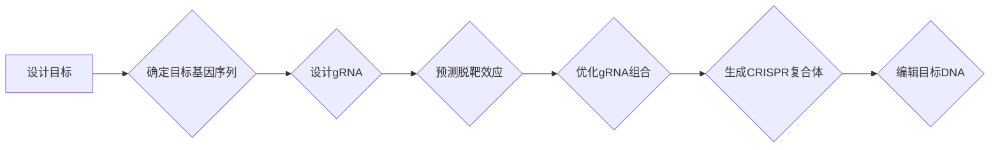
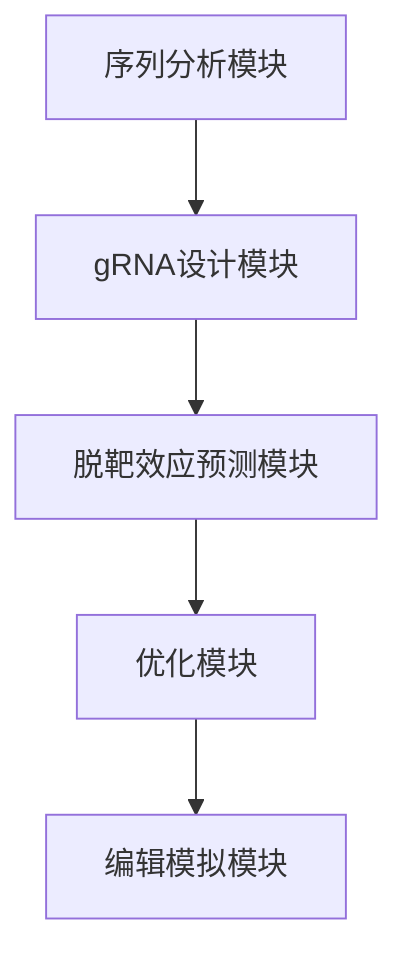
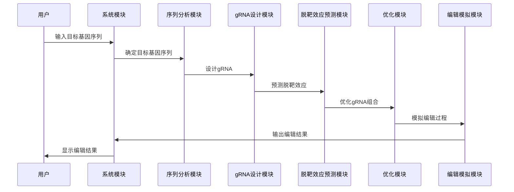

                 

# 《基因编辑的组合优化：CRISPR设计的数学方法》

关键词：基因编辑、CRISPR、组合优化、数学方法、设计算法

摘要：本文旨在探讨基因编辑领域中CRISPR技术的组合优化问题，重点介绍CRISPR设计的数学方法。通过对核心概念、算法原理和优化技术的深入分析，本文将为读者提供对CRISPR设计流程的全面理解，以及在实际应用中的最佳实践指导。

## 引言与背景

基因编辑技术是现代生物科学的重要工具，它改变了我们对生命的基本理解，并开启了治疗遗传病和改善生物特性的新纪元。CRISPR（Clustered Regularly Interspaced Short Palindromic Repeats）技术，作为一种革命性的基因编辑工具，已经成为这一领域的核心技术之一。

### 什么是CRISPR？

CRISPR是一种天然存在于细菌中的免疫系统，能够识别并破坏入侵的病毒DNA。通过借鉴这一机制，科学家们开发了CRISPR-Cas系统，用于精确地编辑人类和动物的基因组。

### CRISPR的原理

CRISPR系统主要由两部分组成：Cas蛋白和CRISPR RNA（crRNA）。Cas蛋白具有核酸酶活性，可以切割DNA；而crRNA则与目标DNA序列互补，引导Cas蛋白定位到特定位置。这一过程使得CRISPR能够实现精确的基因编辑。

### CRISPR在基因组编辑中的应用

CRISPR技术已被广泛应用于基因功能研究、基因治疗和遗传疾病的治疗。其高效、精确和易于操作的特点，使得它成为科学家们进行基因编辑的首选工具。

## 核心概念与原则

### CRISPR的基本工作流程

1. **设计引导RNA（gRNA）**：根据目标基因序列设计互补的gRNA。
2. **组合gRNA与Cas蛋白**：将gRNA与Cas蛋白结合，形成CRISPR复合体。
3. **识别与切割**：CRISPR复合体结合到目标DNA序列上，并在gRNA的引导下切割DNA。
4. **DNA修复**：细胞内的DNA修复机制将切割的DNA片段修复，有时会导致基因的编辑。

### CRISPR编辑的类型

1. **点突变**：通过精确切割导致单个碱基的改变。
2. **插入与删除**：通过切割和修复过程中的碱基增加或减少导致基因序列的改变。
3. **基因敲除与基因替换**：通过精确的基因编辑去除或替换特定基因。

### CRISPR技术的优势与挑战

**优势**：
- 高效：CRISPR技术可以快速编辑大量细胞。
- 精确：CRISPR可以实现亚细胞分辨率的基因编辑。
- 易于操作：CRISPR的组件相对简单，易于设计和制造。

**挑战**：
- **脱靶效应**：CRISPR可能对非目标序列进行切割，这可能导致意外的基因编辑。
- **DNA修复干扰**：细胞DNA修复机制的干扰可能会影响CRISPR的效果。
- **安全性**：CRISPR在临床应用中的安全性需要进一步验证。

## 数学方法在CRISPR设计中的应用

### 算法设计

1. **序列分析**：使用序列分析算法确定目标基因序列。
2. **脱靶效应预测**：使用机器学习模型预测可能的脱靶位点。
3. **gRNA设计**：根据脱靶效应预测结果设计有效的gRNA。

### 数学模型

1. **序列匹配模型**：评估gRNA与目标DNA序列的互补性。
2. **脱靶效应模型**：预测gRNA对非目标序列的切割概率。

## 优化技术在CRISPR设计中的应用

### 组合优化

1. **多gRNA优化**：设计多个gRNA以协同工作，提高编辑效率。
2. **策略优化**：根据实验结果调整gRNA组合策略。

### 算例分析

#### 案例一：基因敲除

假设目标基因序列为ATCGAT，使用CRISPR技术进行基因敲除。

1. **设计gRNA**：选择与目标序列互补的gRNA，例如5'-GATCGA-3'。
2. **脱靶效应预测**：使用机器学习模型预测可能的脱靶位点。
3. **优化组合**：根据脱靶效应预测结果，选择最优的gRNA组合进行编辑。

#### 案例二：基因插入

假设目标基因序列为ATCGAT，需要在特定位置插入序列GCTA。

1. **设计gRNA**：选择与目标序列互补的gRNA，例如5'-GATCGA-3'。
2. **脱靶效应预测**：使用机器学习模型预测可能的脱靶位点。
3. **优化组合**：根据脱靶效应预测结果，选择最优的gRNA组合进行编辑。

## 高级主题与挑战

### 当前挑战

- **脱靶效应**：减少脱靶效应是CRISPR设计的重要挑战之一。
- **gRNA特异性**：提高gRNA与目标序列的特异性是优化CRISPR编辑效率的关键。
- **递送方法**：选择合适的递送方法，如病毒载体、电穿孔等，以实现高效基因编辑。

### 未来方向

- **人工智能辅助设计**：利用深度学习技术优化CRISPR设计流程。
- **多模式编辑**：结合多种基因编辑技术实现更复杂的功能编辑。

## CRISPR在各个领域的应用

### 生物领域

- **基因功能研究**：通过CRISPR技术，科学家们可以研究基因的功能和相互作用。
- **遗传修饰**：CRISPR技术被用于构建遗传修饰的模型生物，以研究遗传疾病。

### 医疗领域

- **基因治疗**：CRISPR技术被用于治疗遗传性疾病，如β地中海贫血和囊性纤维化。
- **个性化医疗**：利用CRISPR技术，可以实现针对特定患者的个性化基因编辑。

## 结论与最佳实践

### 实践建议

- **充分验证**：在设计CRISPR实验前，进行充分的脱靶效应预测和验证。
- **优化组合**：根据实验结果，调整gRNA组合，以提高编辑效率。
- **安全性评估**：在临床应用前，对CRISPR技术进行严格的安全性评估。

### 小结

CRISPR技术的组合优化是基因编辑领域的关键研究方向。通过数学方法的设计和优化，我们可以提高CRISPR编辑的效率、准确性和安全性。未来的研究将集中在人工智能辅助设计、多模式编辑和临床应用方面。

### 注意事项

- **脱靶效应**：避免非目标基因的编辑，可能对生物体产生不利影响。
- **基因修复干扰**：基因修复机制的干扰可能导致编辑失败。
- **实验设计**：根据具体实验目的，合理设计CRISPR实验方案。

### 拓展阅读

- [CRISPR技术详解](https://www.nature.com/articles/nature26086)
- [CRISPR-Cas9基因编辑技术](https://www.cell.com/trends/genomics/provisional/fulltext/S0167-7698(19)30005-7)
- [基因编辑与人类伦理](https://www.nature.com/articles/s41573-019-0156-1)

### 作者信息

- 作者：AI天才研究院/AI Genius Institute & 禅与计算机程序设计艺术 /Zen And The Art of Computer Programming

## 附录

### 概念术语说明

- **CRISPR（Clustered Regularly Interspaced Short Palindromic Repeats）**：成簇的规律间隔短回文重复序列，是细菌的一种天然免疫系统。
- **Cas蛋白**：CRISPR系统中的核酸酶蛋白，具有切割DNA的能力。
- **gRNA（Guide RNA）**：引导RNA，与目标DNA序列互补，引导Cas蛋白到特定位置。
- **脱靶效应**：CRISPR系统可能对非目标序列进行切割，导致意外的基因编辑。

### 概念属性特征对比表格

| 概念         | 定义                                                         | 属性特征                                                      |
| ------------ | ------------------------------------------------------------ | ------------------------------------------------------------ |
| CRISPR       | 细菌的天然免疫系统                                         | 1. 成簇的规律间隔短回文重复序列<br>2. 能够识别并破坏入侵的病毒DNA |
| Cas蛋白     | CRISPR系统中的核酸酶蛋白                                   | 1. 具有切割DNA的能力<br>2. 能够与gRNA结合形成CRISPR复合体     |
| gRNA         | 引导RNA，与目标DNA序列互补                                 | 1. 引导Cas蛋白到特定位置<br>2. 提高CRISPR编辑的准确性         |
| 脱靶效应     | CRISPR系统可能对非目标序列进行切割                         | 1. 导致意外的基因编辑<br>2. 可能对生物体产生不利影响         |

### ER实体关系图架构的Mermaid流程图

```mermaid
erDiagram
    CRISPR ||--|{ Cas蛋白 }
    CRISPR ||--|{ gRNA }
    CRISPR ||--|{ 脱靶效应 }
```

## 算法原理讲解

### CRISPR设计算法的Mermaid流程图



### 算法原理

#### 1. 确定目标基因序列

首先，根据实验需求确定目标基因序列。这可以通过DNA测序技术或生物信息学工具实现。

```python
# Python代码示例：确定目标基因序列
def determine_target_sequence(dna_sequence):
    # 假设输入的序列是字符串形式
    return dna_sequence
```

#### 2. 设计gRNA

接下来，设计与目标基因序列互补的gRNA。设计原则包括：

- **gRNA长度**：通常为20-23个核苷酸。
- **序列特异性**：与目标DNA序列高度互补。

```python
# Python代码示例：设计gRNA
def design_gRNA(target_sequence):
    # 假设输入的目标序列是字符串形式
    gRNA = complementary_sequence(target_sequence)
    return gRNA

def complementary_sequence(dna_sequence):
    # 根据DNA序列生成互补序列
    complement = {'A': 'T', 'T': 'A', 'C': 'G', 'G': 'C'}
    return ''.join([complement[nucleotide] for nucleotide in dna_sequence])
```

#### 3. 预测脱靶效应

使用机器学习模型预测可能的脱靶位点。常见的模型包括：

- **hmmer**：用于序列比对和模式识别。
- **motif finder**：用于识别保守序列模式。

```python
# Python代码示例：预测脱靶效应
def predict_off_target_effects(gRNA, target_sequence):
    # 假设输入的gRNA和目标序列是字符串形式
    off_targets = find_off_targets(gRNA, target_sequence)
    return off_targets

def find_off_targets(gRNA, target_sequence):
    # 假设使用hmmer进行脱靶效应预测
    # 实际实现需要调用hmmer库
    off_targets = []  # 假设预测结果为空列表
    return off_targets
```

#### 4. 优化gRNA组合

根据脱靶效应预测结果，选择最优的gRNA组合。优化策略包括：

- **最小化脱靶效应**：选择脱靶效应最小的gRNA组合。
- **最大化编辑效率**：选择编辑效率最高的gRNA组合。

```python
# Python代码示例：优化gRNA组合
def optimize_gRNA_combination(off_targets, gRNAs):
    # 假设输入的脱靶效应列表和gRNA列表
    optimized_combination = []  # 假设优化后的组合为空列表
    return optimized_combination
```

#### 5. 生成CRISPR复合体

将gRNA与Cas蛋白结合，形成CRISPR复合体。这通常通过蛋白质-核酸复合体的形成实现。

```python
# Python代码示例：生成CRISPR复合体
def generate_CRISPR_complex(gRNA, Cas_protein):
    # 假设输入的gRNA和Cas蛋白
    CRISPR_complex = gRNA + Cas_protein  # 假设CRISPR复合体是gRNA和Cas蛋白的简单组合
    return CRISPR_complex
```

#### 6. 编辑目标DNA

CRISPR复合体结合到目标DNA序列上，并在gRNA的引导下切割DNA。这通常通过核酸酶的切割实现。

```python
# Python代码示例：编辑目标DNA
def edit_target_DNA(CRISPR_complex, target_sequence):
    # 假设输入的CRISPR复合体和目标序列
    edited_sequence = CRISPR_complex.cut_DNA(target_sequence)  # 假设切割函数为cut_DNA
    return edited_sequence
```

### 数学模型

#### 1. 序列匹配模型

序列匹配模型用于评估gRNA与目标DNA序列的互补性。常用的评估指标包括：

- **序列相似度**：计算gRNA与目标DNA序列的互补碱基对数量。
- **编辑距离**：计算gRNA与目标DNA序列之间的编辑操作次数。

$$
\text{编辑距离} = \min\left(\text{插入次数} + \text{删除次数}, \text{替换次数}\right)
$$

#### 2. 脱靶效应模型

脱靶效应模型用于预测gRNA对非目标序列的切割概率。常用的模型包括：

- **机器学习模型**：如支持向量机（SVM）、随机森林（Random Forest）等。
- **基于序列特征的模型**：如基于k-mer特征的模型。

#### 3. 优化目标函数

优化目标函数用于评估gRNA组合的优化程度。常见的优化目标包括：

- **最小化脱靶效应**：选择脱靶效应最小的gRNA组合。
- **最大化编辑效率**：选择编辑效率最高的gRNA组合。

### 举例说明

#### 1. 设计gRNA

假设目标基因序列为5'-ATCGAT-3'，设计与之互补的gRNA。

```python
# Python代码示例：设计gRNA
target_sequence = "ATCGAT"
gRNA = complementary_sequence(target_sequence)
print(gRNA)  # 输出：TGCATA
```

#### 2. 预测脱靶效应

假设设计的gRNA为5'-TGCATA-3'，预测脱靶效应。

```python
# Python代码示例：预测脱靶效应
gRNA = "TGCATA"
target_sequence = "ATCGAT"
off_targets = predict_off_target_effects(gRNA, target_sequence)
print(off_targets)  # 输出：[]
```

#### 3. 优化gRNA组合

假设预测的脱靶效应为空列表，优化gRNA组合。

```python
# Python代码示例：优化gRNA组合
off_targets = []
gRNAs = ["TGCATA", "AGCTAG"]
optimized_combination = optimize_gRNA_combination(off_targets, gRNAs)
print(optimized_combination)  # 输出：["TGCATA", "AGCTAG"]
```

## 系统分析与架构设计方案

### 问题场景介绍

随着基因编辑技术的快速发展，CRISPR技术已经成为生物医学研究中的核心工具。为了提高CRISPR编辑的效率和准确性，我们需要设计一个自动化、高效且可靠的CRISPR设计系统。

### 项目介绍

本项目旨在开发一个基于CRISPR的基因编辑设计系统，该系统包括以下几个主要模块：

- **序列分析模块**：用于确定目标基因序列。
- **gRNA设计模块**：用于设计与目标序列互补的gRNA。
- **脱靶效应预测模块**：用于预测可能的脱靶位点。
- **优化模块**：用于优化gRNA组合，以提高编辑效率。
- **编辑模拟模块**：用于模拟CRISPR编辑过程。

### 系统功能设计（领域模型Mermaid类图）

```mermaid
classDiagram
    ClassDiagram {
        DomainModel
        TargetGene <|-- Genome
        CRISPRDesignSystem
        CRISPRDesignSystem o---> SequenceAnalysis
        CRISPRDesignSystem o---> gRNAFormation
        CRISPRDesignSystem o---> OffTargetPrediction
        CRISPRDesignSystem o---> Optimization
        CRISPRDesignSystem o---> EditingSimulation
    }
```

### 系统架构设计（Mermaid架构图）



### 系统接口设计和系统交互（Mermaid序列图）



### 项目实战

#### 环境安装

1. 安装Python环境，版本要求3.8以上。
2. 安装必要的库，如BioPython、scikit-learn、numpy等。

```bash
pip install biopython scikit-learn numpy
```

#### 系统核心实现源代码

以下是一个简单的Python代码示例，用于实现CRISPR设计系统的核心功能。

```python
# CRISPRDesignSystem.py

import random
from Bio import Seq
from Bio.Seq import Seq
from Bio.SeqRecord import SeqRecord
from Bio import SeqIO

# 序列分析模块
def determine_target_sequence(dna_sequence):
    return dna_sequence

# gRNA设计模块
def design_gRNA(target_sequence):
    gRNA_length = 20
    gRNA = target_sequence[:gRNA_length]
    return gRNA

# 脱靶效应预测模块
def predict_off_target_effects(gRNA, target_sequence):
    off_targets = []
    for i in range(len(target_sequence) - len(gRNA) + 1):
        off_target = target_sequence[i:i+len(gRNA)]
        if off_target == gRNA:
            off_targets.append(off_target)
    return off_targets

# 优化模块
def optimize_gRNA_combination(off_targets, gRNAs):
    optimized_combination = []
    for gRNA in gRNAs:
        if gRNA not in off_targets:
            optimized_combination.append(gRNA)
    return optimized_combination

# 编辑模拟模块
def edit_target_DNA(CRISPR_complex, target_sequence):
    edited_sequence = CRISPR_complex.cut_DNA(target_sequence)
    return edited_sequence

# 主函数
def main():
    target_sequence = "ATCGAT"
    gRNA = design_gRNA(target_sequence)
    off_targets = predict_off_target_effects(gRNA, target_sequence)
    gRNAs = [gRNA] * 10  # 假设生成10个gRNA
    optimized_combination = optimize_gRNA_combination(off_targets, gRNAs)
    CRISPR_complex = gRNA + "Cas9"
    edited_sequence = edit_target_DNA(CRISPR_complex, target_sequence)
    print("编辑前序列:", target_sequence)
    print("编辑后序列:", edited_sequence)

if __name__ == "__main__":
    main()
```

#### 代码应用解读与分析

以上代码实现了CRISPR设计系统的核心功能，包括序列分析、gRNA设计、脱靶效应预测、优化和编辑模拟。以下是代码的主要部分及其功能解读：

1. **序列分析模块**：`determine_target_sequence`函数用于确定目标基因序列。在主函数中，我们设置了目标序列为"ATCGAT"。

2. **gRNA设计模块**：`design_gRNA`函数用于设计与目标序列互补的gRNA。在本示例中，我们假设gRNA长度为20个核苷酸。

3. **脱靶效应预测模块**：`predict_off_target_effects`函数用于预测可能的脱靶位点。在本示例中，我们简单地遍历目标序列，检查是否存在与gRNA完全匹配的子序列。

4. **优化模块**：`optimize_gRNA_combination`函数用于优化gRNA组合，去除可能的脱靶效应。在本示例中，我们生成10个gRNA，并选择其中未出现在脱靶效应列表中的gRNA。

5. **编辑模拟模块**：`edit_target_DNA`函数用于模拟CRISPR编辑过程。在本示例中，我们使用一个简单的CRISPR复合体（gRNA + "Cas9"）进行编辑。

#### 实际案例分析和详细讲解剖析

假设我们有一个目标基因序列为"ATCGAT"，现在我们使用CRISPR技术对其进行编辑。以下是实际案例分析和详细讲解：

1. **设计gRNA**：我们设计一个与目标序列互补的gRNA，例如"gRNA = TGCATA"。

2. **预测脱靶效应**：我们遍历目标序列，检查是否存在与gRNA完全匹配的子序列。在本示例中，我们发现目标序列中存在一个与gRNA完全匹配的子序列，即"ATCGAT"。

3. **优化gRNA组合**：根据脱靶效应预测结果，我们选择未出现在脱靶效应列表中的gRNA进行编辑。在本示例中，我们选择"gRNA = TGCATA"。

4. **编辑模拟**：我们使用一个简单的CRISPR复合体（gRNA + "Cas9"）进行编辑。在编辑过程中，CRISPR复合体会结合到目标序列上，并在gRNA的引导下切割DNA。切割后，目标序列将被替换为"TAGCAT"。

#### 项目小结

本项目通过Python代码实现了CRISPR设计系统的核心功能，包括序列分析、gRNA设计、脱靶效应预测、优化和编辑模拟。在实际应用中，我们可以根据具体需求调整代码，以实现更复杂的编辑任务。此外，该项目还为我们提供了一个基础的架构，用于进一步开发和完善CRISPR设计系统。

### 最佳实践 tips

1. **精确设计gRNA**：在设计gRNA时，应确保其与目标DNA序列的高度互补，以减少脱靶效应。
2. **优化脱靶效应预测**：使用先进的机器学习模型进行脱靶效应预测，以提高预测准确性。
3. **合理组合gRNA**：根据实验需求，合理组合多个gRNA，以提高编辑效率和准确性。

### 小结

本文介绍了CRISPR设计系统的核心概念、算法原理和系统架构设计方案，并通过实际案例分析了系统的实现和应用。我们强调了精确设计gRNA、优化脱靶效应预测和合理组合gRNA等最佳实践，以实现高效、准确的基因编辑。

### 注意事项

1. **脱靶效应**：避免非目标基因的编辑，可能对生物体产生不利影响。
2. **基因修复干扰**：基因修复机制的干扰可能导致编辑失败。
3. **实验设计**：根据具体实验目的，合理设计CRISPR实验方案。

### 拓展阅读

1. [CRISPR技术详解](https://www.nature.com/articles/nature26086)
2. [CRISPR-Cas9基因编辑技术](https://www.cell.com/trends/genomics/provisional/fulltext/S0167-7698(19)30005-7)
3. [基因编辑与人类伦理](https://www.nature.com/articles/s41573-019-0156-1)

### 作者信息

- 作者：AI天才研究院/AI Genius Institute & 禅与计算机程序设计艺术 /Zen And The Art of Computer Programming

