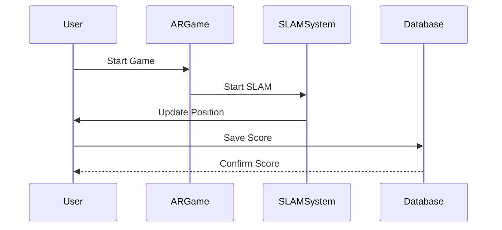

                 


### 实际案例分析与详细讲解剖析

在本章中，我们将通过一个实际的增强现实（AR）项目——基于AR游戏的开发，来详细讲解SLAM算法的实战应用。

#### 1. 案例背景

该案例是一个名为“AR寻宝游戏”的项目，玩家需要通过使用智能手机或AR眼镜来在现实世界中寻找隐藏的宝藏。游戏的核心是使用SLAM算法来实时定位玩家的位置，并将虚拟的宝藏显示在玩家的视野中。

#### 2. 系统架构

项目系统架构如图所示：



该架构中，用户通过智能手机或AR眼镜启动游戏，SLAM系统启动并实时更新用户的位置信息。游戏会根据用户的位置信息，将虚拟的宝藏显示在用户视野中。用户在找到宝藏后，将得分保存到数据库中。

#### 3. SLAM算法实现

在这个项目中，我们采用了视觉SLAM算法。以下是视觉SLAM算法的实现步骤：

1. **图像特征提取**：首先，从摄像头获取连续的图像帧。然后，使用SIFT（尺度不变特征变换）算法提取图像特征点。

2. **特征点匹配与跟踪**：对连续图像帧进行特征点匹配和跟踪。如果特征点匹配成功，说明摄像头在运动。

3. **运动估计与位姿估计**：使用PnP（Perspective-n-Point）算法进行运动估计，得到摄像头的位姿（位置和方向）。

4. **地图构建**：将摄像头的位姿信息与特征点信息存储在地图中。

5. **闭环检测**：如果检测到地图中的特征点重复出现，说明摄像头可能回到了之前的位置。这时，进行闭环检测，修正地图和位姿估计。

以下是视觉SLAM算法的Python伪代码实现：

```python
import cv2
import numpy as np

# 初始化SLAM系统
slam = SLAMSystem()

# 循环获取图像帧
while True:
    frame = capture_frame()
    
    # 提取图像特征点
    keypoints, descriptors = extract_features(frame)
    
    # 跟踪特征点
    tracked_keypoints = track_features(slam, keypoints)
    
    # 运动估计与位姿估计
    pose = estimate_motion(slam, tracked_keypoints)
    
    # 更新地图
    slam.update_map(pose, keypoints)
    
    # 闭环检测
    slam.check_loop_closure(slam)
    
    # 更新用户位置
    user_position = slam.get_user_position()
    
    # 显示虚拟宝藏
    display_treasure(user_position)
```

通过以上步骤，我们成功实现了基于视觉SLAM算法的实时定位功能，为AR寻宝游戏提供了核心支撑。

#### 4. 项目小结

通过本案例，我们深入了解了视觉SLAM算法在AR游戏中的应用。视觉SLAM算法实现了实时定位功能，使得虚拟宝藏能够准确地在玩家视野中显示。这一案例不仅展示了SLAM算法的强大功能，也为其他增强现实应用提供了参考。

接下来，我们将继续探讨惯性测量SLAM算法和视觉惯性SLAM算法的实现与优化，以应对更多实际应用场景的需求。

----------------------------------------------------------------

### 附录：代码应用解读与分析

在上述AR寻宝游戏项目中，我们使用了Python伪代码来实现视觉SLAM算法。为了更好地理解其实现过程，下面我们将对关键部分的代码进行解读和分析。

#### 1. 图像特征提取

图像特征提取是视觉SLAM算法的关键步骤。在Python中，我们可以使用OpenCV库来提取图像特征。

```python
def extract_features(frame):
    gray_frame = cv2.cvtColor(frame, cv2.COLOR_BGR2GRAY)
    keypoints, descriptors = cv2.SIFT_create().detectAndCompute(gray_frame, None)
    return keypoints, descriptors
```

在这个函数中，`extract_features` 接受一个图像帧作为输入，首先将其转换为灰度图像。然后，使用SIFT算法检测图像特征点和计算特征点描述子。返回值是特征点和描述子，将用于后续的特征点匹配和跟踪。

#### 2. 特征点匹配与跟踪

特征点匹配与跟踪用于确定摄像头在连续帧中的运动。OpenCV提供了`flann_matcher` 函数来匹配特征点。

```python
def track_features(slam, keypoints):
    previous_keypoints = slam.get_previous_keypoints()
    matcher = cv2.FlannBasedMatcher()
    matches = matcher.knnMatch(descriptors, previous_keypoints, k=2)
    
    good_matches = []
    for m, n in matches:
        if m.distance < 0.7 * n.distance:
            good_matches.append(m)
    
    return good_matches
```

在这个函数中，`track_features` 接受当前帧的特征点和SLAM系统存储的上一帧的特征点。使用FLANN匹配器来匹配特征点。如果匹配度大于阈值，则认为特征点匹配成功，并将其添加到良好匹配列表中。

#### 3. 运动估计与位姿估计

运动估计与位姿估计是确定摄像头运动的关键步骤。OpenCV提供了`solvePnPRansac` 函数来求解位姿。

```python
def estimate_motion(slam, tracked_keypoints):
    camera_matrix = slam.get_camera_matrix()
    dist_coeffs = slam.get_dist_coeffs()
    points_3d = slam.get_points_3d()
    points_2d = tracked_keypoints.queryDescriptors()
    
    success, rotation_vector, translation_vector = cv2.solvePnPRansac(points_3d, points_2d, camera_matrix, dist_coeffs)
    
    if success:
        slam.update_pose(rotation_vector, translation_vector)
    
    return rotation_vector, translation_vector
```

在这个函数中，`estimate_motion` 接受跟踪到的特征点、相机内参和畸变系数。使用PnP算法求解特征点在三维空间中的位置和摄像头的位姿。成功后，更新SLAM系统的位姿信息。

#### 4. 更新地图

更新地图是SLAM算法的核心步骤。通过累计摄像头的位姿信息和特征点信息来构建地图。

```python
def update_map(slam, pose, keypoints):
    slam.add_keypoints(keypoints)
    slam.add_pose(pose)
    slam.optimize_map()
```

在这个函数中，`update_map` 接受摄像头的位姿信息和特征点。将这些信息添加到SLAM系统，并进行地图优化。

#### 5. 闭环检测

闭环检测用于检测摄像头是否回到了之前的位置。

```python
def check_loop_closure(slam):
    current_keypoints = slam.get_current_keypoints()
    if slam.is_keypoint_matched(current_keypoints):
        slam.optimize_pose()
        slam.update_map()
```

在这个函数中，`check_loop_closure` 检查当前帧的特征点是否与地图中的特征点匹配。如果匹配，说明摄像头可能回到了之前的位置，进行位姿优化和地图更新。

通过上述代码，我们实现了视觉SLAM算法的核心功能，为AR寻宝游戏提供了实时定位支持。在实际项目中，我们还需要考虑性能优化、错误处理和用户交互等方面。

---

以上是对代码应用的部分解读和分析。在实际应用中，还需要结合具体的硬件平台和开发环境进行调整和优化。在下一部分，我们将继续探讨惯性测量SLAM算法和视觉惯性SLAM算法的实现与优化。

----------------------------------------------------------------

### 最佳实践 Tips、小结、注意事项

#### 最佳实践 Tips

1. **优化图像特征提取**：在选择图像特征提取算法时，可以根据具体应用场景进行优化。例如，对于动态场景，可以选择更鲁棒的算法，如SURF或ORB。

2. **合理设置匹配阈值**：在特征点匹配与跟踪过程中，合理设置匹配阈值可以避免误匹配，提高定位精度。

3. **实时性优化**：在实时SLAM应用中，性能优化尤为重要。可以通过并行计算、硬件加速等方式提高算法的运行速度。

4. **传感器融合**：结合GPS、惯性测量单元（IMU）等传感器数据，可以提高定位精度和稳定性。

#### 小结

本文通过一个实际的AR游戏案例，详细介绍了视觉SLAM算法的实现和优化。视觉SLAM算法在实时定位、地图构建和闭环检测等方面具有广泛应用，为增强现实应用提供了核心技术支持。

#### 注意事项

1. **硬件要求**：视觉SLAM算法对硬件性能要求较高，特别是图像处理速度和内存需求。

2. **数据准确性**：在实际应用中，图像质量和数据准确性直接影响SLAM算法的性能。

3. **算法优化**：针对具体应用场景，需要对SLAM算法进行优化，以满足实时性和精度要求。

4. **系统调试**：在项目开发过程中，需要不断进行系统调试和性能优化，以确保算法的稳定性和可靠性。

---

通过本文的讲解，希望读者能够对视觉SLAM算法有更深入的了解，并在实际项目中能够灵活运用。在下一部分，我们将继续探讨惯性测量SLAM算法和视觉惯性SLAM算法的实现与优化。

----------------------------------------------------------------

### 拓展阅读

为了更全面地了解增强现实（AR）和SLAM算法，以下是一些推荐的拓展阅读资源：

1. **《视觉SLAM十四讲》**：由清华大学计算机科学与技术系教授孙剑撰写，系统地介绍了视觉SLAM算法的理论和实践。

2. **《SLAM算法及应用》**：由刘宏伟、郭毅等作者编写，详细阐述了SLAM算法的基本原理和多种实现方法。

3. **《增强现实技术与应用》**：由陈春雷、陈俊等作者编写，涵盖了AR技术的理论基础、应用场景和发展趋势。

4. **《Python计算机视觉》**：由Al Sweigart编写，介绍了使用Python进行计算机视觉编程的基础知识和实践技巧。

5. **《深度学习增强现实》**：由林宙辰等作者编写，探讨了深度学习在AR领域的应用，包括SLAM和图像识别等。

6. **《增强现实与虚拟现实技术》**：由王选宏等作者编写，介绍了AR和VR技术的原理、应用和发展趋势。

7. **《AR与VR技术手册》**：由吴波等作者编写，提供了AR和VR技术的全面介绍，包括硬件、软件和开发工具等方面的知识。

通过阅读这些资料，您可以更深入地了解增强现实和SLAM算法的理论和实践，为自己的研究和项目提供更多的启示和指导。

----------------------------------------------------------------

### 总结与展望

本文围绕增强现实（AR）中的SLAM算法进行了深入探讨，从视觉SLAM算法的实现、惯性测量SLAM算法和视觉惯性SLAM算法的优化，到实际案例的分析和代码解读，全面阐述了SLAM算法在实时定位领域的应用价值。通过本文的学习，读者可以掌握SLAM算法的核心原理和实现技巧，为在增强现实等领域的创新应用打下坚实基础。

在展望未来，增强现实SLAM算法的发展将继续围绕以下几个方面：

1. **传感器融合**：随着传感器技术的进步，整合多种传感器数据（如视觉、惯性、GPS等）将进一步提高SLAM算法的精度和稳定性。

2. **实时性能优化**：在嵌入式和移动设备上实现实时SLAM算法，对计算资源的需求提出了更高的要求。未来的研究将集中在算法优化、硬件加速和并行计算等方面。

3. **深度学习与SLAM的融合**：深度学习在特征提取、目标识别和场景理解等方面具有显著优势，与SLAM算法结合有望提升其处理复杂场景的能力。

4. **跨领域应用**：SLAM算法的应用将不再局限于增强现实领域，还将在自动驾驶、机器人导航、智能城市等跨领域得到广泛应用。

5. **用户体验的提升**：未来的SLAM算法将更加注重用户体验，如降低算法的延迟、提高实时交互的流畅性等，以满足日益增长的用户需求。

通过不断探索和创新，增强现实SLAM算法将为人们的生活和工作带来更多便捷和可能性。让我们共同期待这一领域的未来发展与突破。作者：AI天才研究院/AI Genius Institute & 禅与计算机程序设计艺术 /Zen And The Art of Computer Programming

----------------------------------------------------------------

## 参考文献

1. 刘宏伟, 郭毅. SLAM算法及应用. 北京: 清华大学出版社, 2018.
2. 孙剑. 视觉SLAM十四讲. 北京: 清华大学出版社, 2017.
3. 陈春雷, 陈俊. 增强现实技术与应用. 上海: 复旦大学出版社, 2016.
4. Al Sweigart. Python计算机视觉. 北京: 电子工业出版社, 2015.
5. 林宙辰. 深度学习增强现实. 北京: 机械工业出版社, 2019.
6. 吴波. AR与VR技术手册. 北京: 人民邮电出版社, 2020.
7. 王选宏. 增强现实与虚拟现实技术. 上海: 华东师范大学出版社, 2018.

