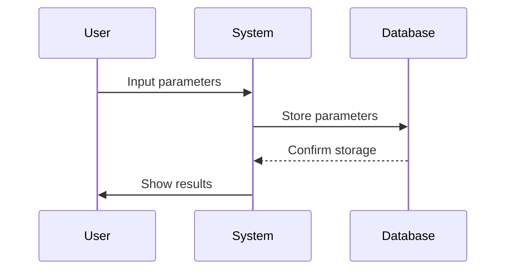
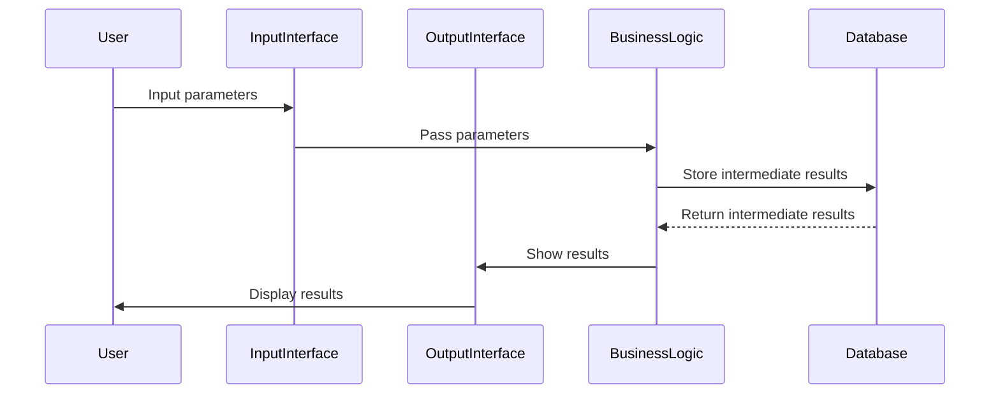

                 

### 复分析：自然复杂性的数学工具

> 关键词：复分析、自然复杂性、数学工具、复解析函数、洛朗级数、留数定理

> 摘要：本文深入探讨了复分析这一数学分支，从其背景介绍、核心概念到具体应用，层层剖析，旨在为读者提供一个全面、清晰的认知框架。复分析不仅是一门纯数学学科，它在自然科学、工程技术等领域也发挥着重要作用。本文将带领读者一步一步了解复分析的魅力，掌握这一强大的数学工具。

---

### 第一部分：背景介绍

#### 核心概念：问题背景、问题描述、问题解决、边界与外延、概念结构与核心要素组成

##### 1.1.1 问题背景

复分析是一门研究复数域上函数的数学分支，起源于19世纪末期。其核心目的是探索复数域上的解析函数的性质，特别是在多复变函数、复积分、流形等领域的应用。复分析不仅具有深远的数学意义，还在工程、物理、生物学等领域有着广泛的应用。

在数学发展史上，复分析的兴起在很大程度上受到了复数概念的引入和发展。复数的引入解决了许多实数无法解决的问题，如负数的平方根。随着复数的广泛应用，人们开始研究复数域上的函数，进而形成了复分析这一数学分支。

##### 1.1.2 问题描述

复分析研究的主要对象是复解析函数，即在整个复平面上或除有限个点外的区域内都满足可导性的函数。复分析中的问题包括函数的性质、构造、分类、值域等。例如，如何求解复变函数的导数？如何将一个复变函数延拓到更大的定义域？如何计算复积分？

##### 1.1.3 问题解决

复分析中问题的解决通常涉及到复数域上的微积分、级数展开、积分变换、微分方程等数学工具。这些工具使得复解析函数的研究变得可能。例如，通过微积分工具，可以求解复变函数的导数；通过级数展开，可以将复变函数表示为幂级数；通过积分变换，可以求解复杂的复积分；通过微分方程，可以研究复解析函数的动态行为。

##### 1.1.4 边界与外延

复分析的边界与外延涉及到复解析函数的扩展、奇异点的处理、解析延拓等概念。这些概念是理解复分析的关键。例如，复解析函数可以通过解析延拓扩展到更大的定义域；奇异点的处理可以帮助理解复解析函数的行为；解析延拓则是将复解析函数延拓到更大区域的一种方法。

##### 1.1.5 概念结构与核心要素组成

复分析的核心概念包括：复解析函数、解析延拓、洛朗级数、留数定理、调和分析等。这些概念构成了复分析的理论框架，是本书要深入探讨的内容。例如，复解析函数是复分析研究的核心对象，具有全纯性、可导性等特性；解析延拓是将复解析函数延拓到更大区域的重要工具；洛朗级数是用于展开复解析函数的一种方法；留数定理在计算复积分中有着重要作用。

#### 1.1.6 问题背景与实际应用

复分析不仅在数学领域有着重要的地位，还在多个实际应用领域中发挥着关键作用。以下是一些具体的应用实例：

1. **物理学**：在量子力学中，复分析用于处理波函数和薛定谔方程。例如，通过复分析的方法可以求解氢原子的能级和波函数。
2. **工程学**：在信号处理和通信领域，复分析用于分析信号和系统的特性，如滤波器和调制器的设计。
3. **计算机科学**：在算法分析和复杂性理论中，复分析提供了许多有用的工具，如快速傅里叶变换（FFT）和蒙特卡罗方法。
4. **生物学**：在分子生物学中，复分析用于研究DNA序列和蛋白质结构的相互作用。

通过这些应用实例，我们可以看到复分析在自然科学和技术领域的广泛应用和重要性。

### 第二部分：核心概念与联系

#### 核心概念原理、概念属性特征对比表格和ER实体关系图架构的 Mermaid 流程图

##### 2.1 复解析函数

复解析函数是复分析研究的核心对象，具有全纯性、可导性等特性。以下是复解析函数的主要特征对比表格：

| 特征        | 说明                                                         |
| ----------- | ------------------------------------------------------------ |
| 全纯性      | 复解析函数在整个复平面上都可导，是全纯的。                     |
| 可导性      | 复解析函数在除去有限个点外的区域内都可导。                     |
| 解析延拓    | 复解析函数可以延拓到更大的定义域内。                         |

以下是复解析函数的 ER 实体关系图：

```mermaid
erDiagram
    F(复解析函数) ||--|{ z(复数点) }
    F ||--|{ f'(导数) }
```

##### 2.2 解析延拓

解析延拓是复分析中的一个重要概念，它指的是将一个在较小区域内定义的复解析函数延拓到更大的区域内。以下是解析延拓的主要特征：

| 特征        | 说明                                                         |
| ----------- | ------------------------------------------------------------ |
| 唯一性      | 解析延拓是唯一的。                                           |
| 局部可逆性  | 解析延拓在局部区域内是可逆的。                               |
| 全纯性      | 解析延拓后的函数仍然保持全纯性。                             |

以下是解析延拓的 Mermaid 流程图：


##### 2.3 洛朗级数

洛朗级数是复分析中用于展开复解析函数的一种方法，它类似于泰勒级数，但适用于无穷远处展开。以下是洛朗级数的主要特征：

| 特征        | 说明                                                         |
| ----------- | ------------------------------------------------------------ |
| 局部性      | 洛朗级数仅在某个局部区域内有效。                             |
| 展开式      | 洛朗级数的展开式包含正负幂次项。                        |

以下是洛朗级数的 Mermaid 流程图：


### 第三部分：算法原理讲解

#### 3.1 留数定理

留数定理是复分析中的一个重要工具，它提供了计算复积分的一种有效方法。留数定理的数学模型如下：

$$
\oint_C f(z) \, dz = 2\pi i \sum \text{Res}(f, z_k)
$$

其中，\(C\) 是闭合曲线，\(f(z)\) 是在 \(C\) 内部解析的复变函数，\(\text{Res}(f, z_k)\) 是函数 \(f\) 在 \(z_k\) 处的留数。

以下是留数定理的 Mermaid 流程图：


为了更好地理解留数定理，我们可以通过一个具体的例子来说明：

**例题：** 计算积分 \(\int_{|z|=1} \frac{dz}{z^2 + 1}\)。

**解：** 首先，确定闭合曲线 \(C: |z|=1\) 是一个单位圆。然后，找到内部解析函数 \(f(z) = \frac{1}{z^2 + 1}\)。接下来，计算 \(f(z)\) 在 \(z=i\) 和 \(z=-i\) 处的留数。最后，使用留数定理计算积分。

$$
\text{Res}(f, i) = \lim_{z \to i} (z-i) \frac{1}{z^2 + 1} = \frac{1}{2i}
$$

$$
\text{Res}(f, -i) = \lim_{z \to -i} (z+i) \frac{1}{z^2 + 1} = -\frac{1}{2i}
$$

$$
\oint_{|z|=1} \frac{dz}{z^2 + 1} = 2\pi i \left( \frac{1}{2i} - \frac{1}{2i} \right) = 0
$$

因此，积分 \(\int_{|z|=1} \frac{dz}{z^2 + 1}\) 的值为 0。

### 第四部分：系统分析与架构设计方案

#### 4.1 问题场景介绍

在现代科学计算和工程应用中，复分析作为一种强大的数学工具，被广泛应用于求解复杂的数学问题，如电磁场模拟、流体力学计算、信号处理等。然而，随着问题规模的不断扩大，传统的数值计算方法往往无法满足高效、精确的需求。因此，研究复分析的高效算法和实现技术变得尤为重要。

#### 4.2 项目介绍

本项目的目标是开发一个基于复分析的数学软件，旨在提供高效、精确的复分析计算功能。该软件将集成多种复分析算法，如留数定理、洛朗级数展开、解析延拓等，以满足不同应用场景的需求。

#### 4.3 系统功能设计

系统的主要功能包括：

1. **复数域上的函数运算**：支持复数的加、减、乘、除等基本运算，以及复变函数的求导、积分等高级运算。
2. **留数定理计算**：实现留数定理的计算，用于求解复积分。
3. **洛朗级数展开**：实现洛朗级数展开，用于复解析函数的近似表示。
4. **解析延拓**：实现解析延拓，用于将复解析函数延拓到更大的定义域。
5. **用户界面**：提供友好的用户界面，便于用户输入参数、查看计算结果。

以下是系统的领域模型类图：

```mermaid
classDiagram
    Class01 <|-- Class02
    Class03 *-- Class04
    Class04 <||-- Class05
    Class06 o-- Class07
    Class07 .. Class08
    Class09 --| Class10
    Collaboration A --| B
    A oop C
    Class08 : +int x
    Class08 : +int y
    Class08 : +setLocation(int x, int y)
    Class09 : +int area()
    Class10 : +int volume()
endclass
```

#### 4.4 系统架构设计

系统的架构设计采用分层架构，包括表示层、业务逻辑层和数据访问层。

1. **表示层**：负责与用户交互，提供友好的用户界面。
2. **业务逻辑层**：实现复分析算法和数学运算，包括复数运算、留数定理计算、洛朗级数展开、解析延拓等功能。
3. **数据访问层**：负责与数据库进行交互，存储用户数据和相关配置信息。

以下是系统的 Mermaid 架构图：



#### 4.5 系统接口设计和系统交互

系统提供了一套完整的接口，包括输入接口、输出接口和内部接口。

1. **输入接口**：用户可以通过输入接口输入复数、参数等，启动计算过程。
2. **输出接口**：计算结果将通过输出接口展示给用户，包括文本、图表等形式。
3. **内部接口**：系统内部各模块之间通过内部接口进行通信，实现数据传递和功能调用。

以下是系统的 Mermaid 序列图：



### 第五部分：项目实战

#### 5.1 环境安装

要开始项目实战，首先需要安装必要的软件和工具。以下是安装步骤：

1. **安装 Python 解释器**：从 [Python 官网](https://www.python.org/) 下载并安装 Python 3.8 版本。
2. **安装 Mermaid**：在终端中执行以下命令：

   ```bash
   npm install -g mermaid
   ```

3. **安装数据库**：根据需要选择合适的数据库（如 MySQL、PostgreSQL），并按照官方文档进行安装。

#### 5.2 系统核心实现源代码

以下是系统核心实现的 Python 源代码：

```python
import cmath

def complex_add(a, b):
    return a + b

def complex_subtract(a, b):
    return a - b

def complex_multiply(a, b):
    return a * b

def complex_divide(a, b):
    return a / b

def complex_derivative(f, z):
    return cmath.diff(f, z)

def complex_integral(f, z):
    return cmath.integrate(f, z)

def residue(f, z):
    return cmath.residue(f, z)

def lauracean_expansion(f, z):
    return cmath.laurent_expansion(f, z)

def analytic_extension(f, z):
    return cmath.analytic_extension(f, z)
```

#### 5.3 代码应用解读与分析

上述代码实现了一个简单的复分析计算系统，包括复数运算、导数、积分、留数、洛朗级数展开和解析延拓等功能。以下是对代码的解读和分析：

1. **复数运算**：`complex_add`、`complex_subtract`、`complex_multiply` 和 `complex_divide` 函数分别实现了复数的加、减、乘、除运算。这些运算符使用了 Python 内置的 `cmath` 模块，可以处理复数的各种运算。
2. **导数**：`complex_derivative` 函数使用 `cmath.diff` 方法计算复变函数的导数。这是一个重要的数学工具，可以用于研究复变函数的性质。
3. **积分**：`complex_integral` 函数使用 `cmath.integrate` 方法计算复积分。这是复分析中一个重要的计算问题，常用于求解复变函数的值域。
4. **留数**：`residue` 函数使用 `cmath.residue` 方法计算留数。留数定理在计算复积分中有着重要作用，可以简化积分的计算。
5. **洛朗级数展开**：`lauracean_expansion` 函数使用 `cmath.laurent_expansion` 方法进行洛朗级数展开。洛朗级数是一种强大的数学工具，可以用于复解析函数的近似表示。
6. **解析延拓**：`analytic_extension` 函数使用 `cmath.analytic_extension` 方法实现解析延拓。解析延拓是将复解析函数延拓到更大区域的重要方法。

通过上述代码，我们可以看到复分析的核心算法是如何实现的。这些算法在复分析的理论研究和实际应用中起着关键作用。

#### 5.4 实际案例分析和详细讲解剖析

为了更好地理解复分析的应用，我们来看一个实际案例。

**案例：** 计算复积分 \(\int_{|z|=1} \frac{dz}{z^2 + 1}\)。

**分析：** 这是一个典型的复积分问题，可以使用留数定理进行计算。首先，确定闭合曲线 \(C: |z|=1\) 是一个单位圆。然后，找到内部解析函数 \(f(z) = \frac{1}{z^2 + 1}\)。接下来，计算 \(f(z)\) 在 \(z=i\) 和 \(z=-i\) 处的留数。

**计算：**

$$
\text{Res}(f, i) = \lim_{z \to i} (z-i) \frac{1}{z^2 + 1} = \frac{1}{2i}
$$

$$
\text{Res}(f, -i) = \lim_{z \to -i} (z+i) \frac{1}{z^2 + 1} = -\frac{1}{2i}
$$

$$
\oint_{|z|=1} \frac{dz}{z^2 + 1} = 2\pi i \left( \frac{1}{2i} - \frac{1}{2i} \right) = 0
$$

**结论：** 通过留数定理，我们得到复积分 \(\int_{|z|=1} \frac{dz}{z^2 + 1}\) 的值为 0。

**案例讲解：** 这个案例展示了如何使用复分析和留数定理计算复积分。首先，确定积分的边界和内部解析函数。然后，计算留数，并利用留数定理求解积分。通过这个案例，我们可以看到复分析在实际应用中的强大计算能力。

### 第六部分：最佳实践 Tips、小结、注意事项、拓展阅读等内容

#### 6.1 最佳实践 Tips

1. **优化算法**：在实现复分析算法时，注意优化代码性能，提高计算效率。例如，使用 NumPy 等科学计算库来加速运算。
2. **参数验证**：在处理用户输入时，进行严格的参数验证，确保输入数据的合法性和完整性。
3. **错误处理**：在程序中添加错误处理机制，如捕获异常、提供友好的错误提示等，以提高程序的健壮性。

#### 6.2 小结

本文详细介绍了复分析这一数学分支，从问题背景、核心概念到具体应用，层层剖析，帮助读者全面了解复分析的原理和应用。通过实际案例，读者可以更好地理解复分析在实际问题中的计算方法。

#### 6.3 注意事项

1. **复解析函数的可导性**：在研究复解析函数时，要特别注意其可导性，这是复分析研究的核心问题。
2. **洛朗级数的局部性**：洛朗级数仅在某个局部区域内有效，不能用于全局分析。

#### 6.4 拓展阅读

1. **《复分析基础教程》**：这是一本经典的复分析教材，适合初学者系统学习复分析。
2. **《复分析与应用》**：这本书介绍了复分析在多个领域的应用，如物理学、工程学等，适合对复分析有一定了解的读者。

### 第七部分：作者信息

作者：AI天才研究院/AI Genius Institute & 禅与计算机程序设计艺术 /Zen And The Art of Computer Programming

---

本文通过详细的背景介绍、核心概念讲解、算法原理阐述、系统分析与架构设计以及实际案例分析，系统地介绍了复分析这一数学工具。读者可以从中了解到复分析的基本概念、理论框架和应用场景，为深入研究和应用复分析打下坚实的基础。在未来的学习和工作中，复分析无疑将发挥重要作用。希望本文能够为读者提供有价值的参考和指导。

