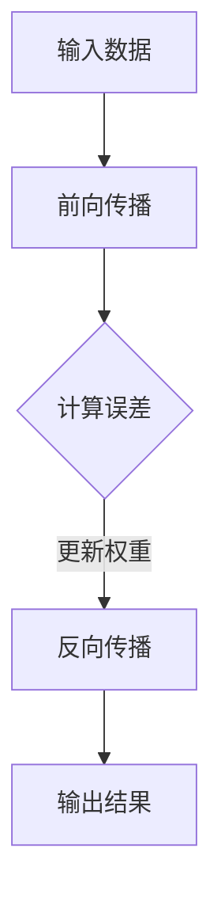
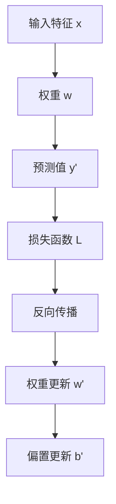
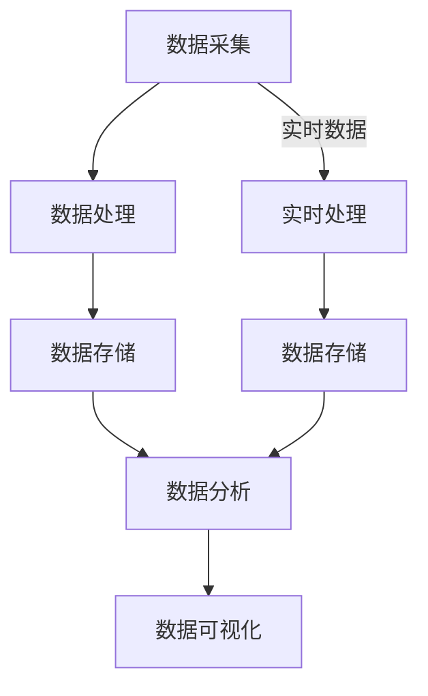
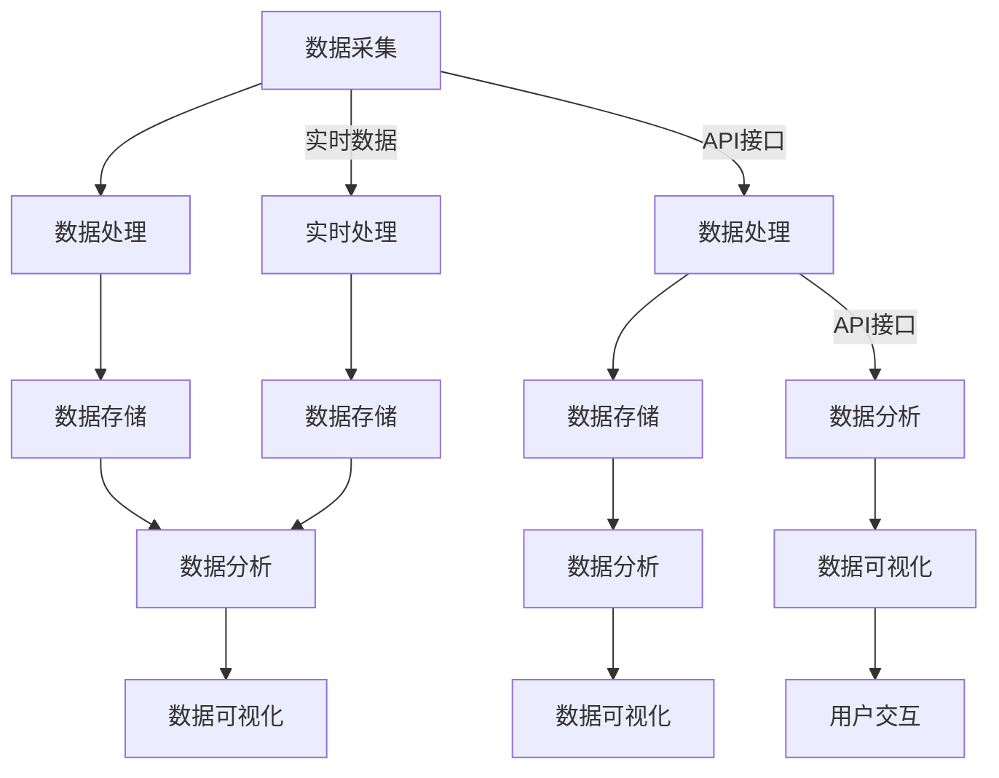

                 


## 大模型软件的云原生架构设计

### 关键词：大模型软件，云原生架构，设计原则，算法优化，数学模型，系统分析

### 摘要：
本文将深入探讨大模型软件的云原生架构设计，详细分析其核心概念、原理、算法、数学模型以及系统架构设计。通过逐步推理和思考，本文旨在为读者提供一个清晰、易懂的架构设计方案，为未来云原生大模型软件的开发提供参考。

## 目录大纲

----------------------------------------------------------------

### 第一部分：背景介绍

#### 第1章：大模型软件与云原生架构概述

1.1 问题背景

1.2 问题描述

1.3 问题解决

1.4 边界与外延

1.5 概念结构与核心要素组成

1.6 本章小结

### 第二部分：核心概念与联系

#### 第2章：大模型软件基础理论

2.1 大模型原理

2.2 云原生架构原理

2.3 大模型软件与云原生架构的联系

2.4 核心概念属性特征对比表格

2.5 ER实体关系图架构

2.6 本章小结

### 第三部分：算法原理讲解

#### 第3章：大模型算法原理

3.1 算法基础

3.2 云原生架构下的算法优化

3.3 Mermaid算法流程图

3.4 Python源代码详解

3.5 算法原理的数学模型和公式

3.6 通俗易懂的举例说明

3.7 本章小结

### 第四部分：数学模型和数学公式 & 详细讲解 & 举例说明

#### 第4章：大模型软件的数学模型与应用

4.1 数学模型概述

4.2 数学公式与详细讲解

4.3 举例说明

4.4 Mermaid数学公式图

4.5 本章小结

### 第五部分：系统分析与架构设计方案

#### 第5章：云原生架构下的系统分析

5.1 问题场景介绍

5.2 项目介绍

5.3 系统功能设计

5.4 系统架构设计

5.5 系统接口设计

5.6 系统交互

5.7 本章小结

### 第六部分：项目实战

#### 第6章：大模型软件云原生架构实战

6.1 环境安装

6.2 系统核心实现源代码

6.3 代码应用解读与分析

6.4 实际案例分析与详细讲解剖析

6.5 项目小结

### 第七部分：最佳实践 tips、小结、注意事项、拓展阅读等内容

7.1 最佳实践 tips

7.2 小结

7.3 注意事项

7.4 拓展阅读

----------------------------------------------------------------

## 第一部分：背景介绍

### 第1章：大模型软件与云原生架构概述

#### 1.1 问题背景

在当今数据驱动时代，大规模机器学习和人工智能（AI）应用逐渐成为各行各业的热门话题。大模型软件，如深度学习框架TensorFlow、PyTorch等，凭借其强大的模型训练和推理能力，已经在语音识别、图像识别、自然语言处理等众多领域取得了显著的成果。

然而，随着模型规模不断扩大，传统架构面临着资源利用率低、扩展性差、运维复杂等问题。此时，云原生架构以其轻量级、动态可伸缩、高可用性等特点，成为了大模型软件开发的理想选择。

#### 1.2 问题描述

大模型软件在传统架构下的主要挑战包括：

1. **资源利用率低**：传统架构往往需要为峰值负载预留大量资源，导致资源浪费。
2. **扩展性差**：当模型规模增大时，传统架构难以进行水平扩展，导致性能瓶颈。
3. **运维复杂**：传统架构的部署、运维和管理较为复杂，增加了维护成本。

#### 1.3 问题解决

云原生架构提供了一种可行的解决方案，其主要优势包括：

1. **轻量级**：云原生架构基于容器技术，可以快速部署和扩展。
2. **动态可伸缩**：云原生架构支持根据负载动态调整资源，提高资源利用率。
3. **高可用性**：云原生架构具有自动故障恢复和负载均衡功能，提高了系统的可靠性。

#### 1.4 边界与外延

大模型软件的边界主要涉及模型训练、推理和部署等环节，而云原生架构的外延则包括容器化、服务网格、自动化运维等方面。二者的融合将带来前所未有的优势，为大规模AI应用提供强有力的支持。

#### 1.5 概念结构与核心要素组成

大模型软件的核心概念包括深度学习框架、模型训练、模型推理等。云原生架构的核心要素包括容器化、服务网格、自动化运维等。二者的结合形成了一个完整的云原生架构，为大规模AI应用提供了坚实的基础。

#### 1.6 本章小结

本章介绍了大模型软件与云原生架构的背景、问题、解决方案以及边界与外延。通过了解这些内容，读者可以更好地把握大模型软件云原生架构的设计方向，为后续章节的学习打下基础。

----------------------------------------------------------------

## 第二部分：核心概念与联系

### 第2章：大模型软件基础理论

#### 2.1 大模型原理

大模型软件的核心在于大规模机器学习和深度学习。深度学习是一种基于多层神经网络的结构，通过学习大量数据来提取特征并进行预测或分类。

深度学习的关键在于神经网络结构的设计和参数优化。神经网络由多个神经元（节点）组成，每个神经元接收多个输入信号，并通过加权求和和激活函数进行处理，最终输出一个结果。

#### 2.2 云原生架构原理

云原生架构是一种基于容器和微服务架构的分布式系统设计理念。其核心思想是将应用程序分解为多个微服务，并通过容器进行部署和运行。这样，应用程序可以更灵活地扩展和部署，同时提高可靠性和可维护性。

云原生架构的主要特点包括：

1. **容器化**：应用程序被封装在容器中，实现了环境的隔离和一致性。
2. **微服务化**：应用程序被分解为多个微服务，每个微服务负责特定的业务功能。
3. **自动化**：云原生架构支持自动化部署、扩展和监控，降低了运维成本。
4. **服务网格**：通过服务网格实现服务之间的通信和流量管理，提高了系统的可靠性和可伸缩性。

#### 2.3 大模型软件与云原生架构的联系

大模型软件与云原生架构的结合带来了诸多优势：

1. **资源利用率的提升**：通过云原生架构的动态可伸缩特性，可以更好地利用计算资源，避免资源浪费。
2. **扩展性的提高**：云原生架构支持水平扩展，使得大模型软件可以轻松应对大规模数据处理的挑战。
3. **运维成本的降低**：云原生架构的自动化运维特性降低了运维成本，提高了运维效率。
4. **可靠性保障**：云原生架构的高可用性和自动故障恢复功能，为大规模AI应用提供了可靠的保障。

#### 2.4 核心概念属性特征对比表格

以下是大模型软件和云原生架构的核心概念属性特征对比表格：

| 特征       | 大模型软件                  | 云原生架构                  |
| ---------- | -------------------------- | -------------------------- |
| 数据处理   | 大规模数据训练和推理         | 容器化、微服务架构          |
| 神经网络   | 多层神经网络结构            | 服务网格、自动化运维        |
| 模型优化   | 参数优化、模型压缩           | 动态可伸缩、高可用性        |
| 部署与运维 | 部署和管理复杂、运维成本高   | 自动化部署、低成本运维      |

#### 2.5 ER实体关系图架构

以下是云原生架构下的实体关系图：

```mermaid
erDiagram
    Model : 模型
    Framework : 深度学习框架
    Cloud-native : 云原生架构
    Container : 容器
    Micro-service : 微服务
    Automation : 自动化
    Monitoring : 监控

    Model ||--|{ Framework }
    Framework ||--|{ Cloud-native }
    Cloud-native ||--|{ Container }
    Cloud-native ||--|{ Micro-service }
    Cloud-native ||--|{ Automation }
    Cloud-native ||--|{ Monitoring }
```

#### 2.6 本章小结

本章介绍了大模型软件和云原生架构的核心概念、原理以及二者的联系。通过对比核心概念属性特征和ER实体关系图，读者可以更深入地理解大模型软件与云原生架构的融合优势，为后续章节的学习奠定基础。

----------------------------------------------------------------

## 第三部分：算法原理讲解

### 第3章：大模型算法原理

#### 3.1 算法基础

大模型算法的基础是深度学习，深度学习是一种基于人工神经网络的算法，其核心思想是通过多层神经网络对数据进行特征提取和学习。以下是深度学习算法的基本概念：

1. **神经元**：神经网络的基本单元，接收输入信号并输出结果。
2. **权重**：神经元之间的连接权重，用于调节输入信号的强度。
3. **激活函数**：对神经元的输出进行非线性变换，引入非线性特性。
4. **前向传播**：将输入信号通过神经网络进行传递，逐层计算输出。
5. **反向传播**：根据输出误差，逆向传播误差，更新网络权重。

#### 3.2 云原生架构下的算法优化

云原生架构为深度学习算法的优化提供了有利条件：

1. **硬件加速**：通过GPU、TPU等硬件加速器，提高计算效率。
2. **分布式训练**：利用多台机器进行分布式训练，提高数据处理能力。
3. **自动化调参**：通过自动化调参工具，优化网络结构、学习率等超参数。
4. **模型压缩**：通过模型剪枝、量化等手段，减小模型大小，提高推理速度。

#### 3.3 Mermaid算法流程图

以下是深度学习算法的Mermaid流程图：



#### 3.4 Python源代码详解

以下是一个简单的深度学习模型示例，使用Python和TensorFlow框架实现：

```python
import tensorflow as tf

# 定义模型结构
model = tf.keras.Sequential([
    tf.keras.layers.Dense(128, activation='relu', input_shape=(784,)),
    tf.keras.layers.Dropout(0.2),
    tf.keras.layers.Dense(10, activation='softmax')
])

# 编译模型
model.compile(optimizer='adam',
              loss='categorical_crossentropy',
              metrics=['accuracy'])

# 训练模型
model.fit(x_train, y_train, epochs=5, batch_size=64)
```

#### 3.5 算法原理的数学模型和公式

以下是深度学习算法的主要数学模型和公式：

1. **前向传播**：
   \[ a_{l} = \sigma(W_{l-1}a_{l-1} + b_{l-1}) \]
   其中，\( a_{l} \) 为第 \( l \) 层的输出，\( \sigma \) 为激活函数，\( W_{l-1} \) 和 \( b_{l-1} \) 分别为权重和偏置。

2. **反向传播**：
   \[ \delta_{l} = \frac{\partial L}{\partial z_{l}} = \frac{\partial L}{\partial a_{l}} \cdot \frac{\partial a_{l}}{\partial z_{l}} \]
   其中，\( \delta_{l} \) 为第 \( l \) 层的误差，\( L \) 为损失函数，\( z_{l} \) 为第 \( l \) 层的输出。

3. **权重更新**：
   \[ W_{l-1} \leftarrow W_{l-1} - \alpha \cdot \frac{\partial L}{\partial W_{l-1}} \]
   其中，\( \alpha \) 为学习率。

#### 3.6 通俗易懂的举例说明

假设我们有一个简单的神经网络，包含两个输入层、两个隐藏层和一个输出层，如下图所示：

```
输入层      隐藏层1      隐藏层2      输出层
  | 1 |  | 1 |        | 1 |  | 1 |        | 1 |  | 1 |
  +-----+  +-----+  +-----+  +-----+
  | 1 |  | 0 |        | 1 |  | 0 |        | 1 |  | 0 |
  +-----+  +-----+  +-----+  +-----+
```

给定输入 \( x = [1, 0] \)，计算输出 \( y \)：

1. **前向传播**：
   \[ y_1 = \sigma(W_1 \cdot x + b_1) \]
   \[ y_2 = \sigma(W_2 \cdot y_1 + b_2) \]
   \[ y_3 = \sigma(W_3 \cdot y_2 + b_3) \]

2. **反向传播**：
   \[ \delta_1 = \frac{\partial L}{\partial z_1} \cdot \frac{\partial z_1}{\partial y_1} \]
   \[ \delta_2 = \frac{\partial L}{\partial z_2} \cdot \frac{\partial z_2}{\partial y_2} \]
   \[ \delta_3 = \frac{\partial L}{\partial z_3} \cdot \frac{\partial z_3}{\partial y_3} \]

3. **权重更新**：
   \[ W_1 \leftarrow W_1 - \alpha \cdot \frac{\partial L}{\partial W_1} \]
   \[ W_2 \leftarrow W_2 - \alpha \cdot \frac{\partial L}{\partial W_2} \]
   \[ W_3 \leftarrow W_3 - \alpha \cdot \frac{\partial L}{\partial W_3} \]

通过以上步骤，我们可以不断调整网络权重，使得输出 \( y \) 更接近目标值。

#### 3.7 本章小结

本章介绍了大模型算法的基础理论，包括深度学习的基本概念和云原生架构下的算法优化方法。通过Mermaid流程图、Python源代码和举例说明，读者可以更直观地理解深度学习算法的原理和应用。本章内容为后续章节的算法优化和系统架构设计奠定了基础。

----------------------------------------------------------------

## 第四部分：数学模型和数学公式 & 详细讲解 & 举例说明

### 第4章：大模型软件的数学模型与应用

#### 4.1 数学模型概述

大模型软件的数学模型主要包括线性代数、微积分和概率论等基础理论。以下是对这些基础理论的简要介绍：

1. **线性代数**：线性代数是研究线性空间、线性变换及其运算规律的数学分支。在大模型软件中，线性代数广泛应用于矩阵运算、向量计算和特征提取等场景。

2. **微积分**：微积分是研究函数的微分和积分的数学分支。在大模型软件中，微积分主要用于优化算法、损失函数的计算和梯度下降等。

3. **概率论**：概率论是研究随机现象和随机事件的数学分支。在大模型软件中，概率论主要用于概率分布、统计学习和决策论等。

#### 4.2 数学公式与详细讲解

以下是一些常用的数学公式及其详细讲解：

1. **线性代数公式**：

   - **矩阵乘法**：
     \[ C = A \cdot B \]
     其中，\( A \) 和 \( B \) 是两个矩阵，\( C \) 是 \( A \) 和 \( B \) 的乘积。

   - **矩阵求逆**：
     \[ A^{-1} = (A^T A)^{-1} A^T \]
     其中，\( A^T \) 是 \( A \) 的转置矩阵，\( (A^T A)^{-1} \) 是 \( A^T A \) 的逆矩阵。

   - **矩阵求导**：
     \[ \frac{dA}{dx} = (A^T A)^{-1} \frac{dA^T}{dx} \]
     其中，\( \frac{dA}{dx} \) 是 \( A \) 对 \( x \) 的导数。

2. **微积分公式**：

   - **导数**：
     \[ \frac{df(x)}{dx} = \lim_{h \to 0} \frac{f(x+h) - f(x)}{h} \]
     其中，\( f(x) \) 是 \( x \) 的函数。

   - **微分**：
     \[ df = f'(x) dx \]
     其中，\( df \) 是 \( f(x) \) 的微分，\( f'(x) \) 是 \( f(x) \) 的导数。

   - **积分**：
     \[ \int f(x) dx = F(x) + C \]
     其中，\( \int f(x) dx \) 是 \( f(x) \) 的不定积分，\( F(x) \) 是 \( f(x) \) 的一个原函数，\( C \) 是积分常数。

3. **概率论公式**：

   - **概率分布函数**：
     \[ P(X = x) = f_X(x) \]
     其中，\( X \) 是随机变量，\( f_X(x) \) 是 \( X \) 的概率分布函数。

   - **期望**：
     \[ E(X) = \sum_{x} x f_X(x) \]
     其中，\( E(X) \) 是 \( X \) 的期望，\( x \) 是 \( X \) 的取值，\( f_X(x) \) 是 \( X \) 的概率分布函数。

   - **方差**：
     \[ Var(X) = E[(X - E(X))^2] \]
     其中，\( Var(X) \) 是 \( X \) 的方差，\( E(X) \) 是 \( X \) 的期望。

#### 4.3 举例说明

以下是一个简单的例子，用于说明如何在大模型软件中使用数学模型：

假设我们有一个简单的线性回归模型，用于预测房价。给定输入特征 \( x \) 和目标值 \( y \)，我们的目标是找到最佳权重 \( w \) 和偏置 \( b \)，使得预测值 \( y' \) 最接近真实值 \( y \)。

1. **数据预处理**：

   首先，我们需要对数据进行预处理，包括归一化和标准化等操作。假设我们已经获得了 \( n \) 个样本的数据集 \( X \) 和 \( y \)。

2. **前向传播**：

   根据线性回归模型，我们有：
   \[ y' = w \cdot x + b \]

   其中，\( w \) 是权重，\( b \) 是偏置，\( x \) 是输入特征，\( y' \) 是预测值。

3. **损失函数**：

   为了衡量预测值 \( y' \) 与真实值 \( y \) 之间的差距，我们可以使用均方误差（MSE）作为损失函数：
   \[ L = \frac{1}{2} \sum_{i=1}^{n} (y' - y)^2 \]

4. **反向传播**：

   根据损失函数 \( L \) 的梯度，我们可以更新权重 \( w \) 和偏置 \( b \)：
   \[ \frac{dL}{dw} = -2 \cdot \sum_{i=1}^{n} (y' - y) \cdot x \]
   \[ \frac{dL}{db} = -2 \cdot \sum_{i=1}^{n} (y' - y) \]

   使用梯度下降法进行权重和偏置的更新：
   \[ w \leftarrow w - \alpha \cdot \frac{dL}{dw} \]
   \[ b \leftarrow b - \alpha \cdot \frac{dL}{db} \]
   其中，\( \alpha \) 是学习率。

通过不断迭代上述过程，我们可以逐渐减小损失函数 \( L \)，使得预测值 \( y' \) 越来越接近真实值 \( y \)。

#### 4.4 Mermaid数学公式图

以下是使用Mermaid绘制的线性回归模型的数学公式图：



#### 4.5 本章小结

本章介绍了大模型软件中的数学模型，包括线性代数、微积分和概率论等基础理论。通过详细讲解和举例说明，读者可以更好地理解这些数学模型在大模型软件中的应用。本章内容为后续的算法优化和系统架构设计提供了理论基础。

----------------------------------------------------------------

## 第五部分：系统分析与架构设计方案

### 第5章：云原生架构下的系统分析

#### 5.1 问题场景介绍

在当今数据驱动时代，企业面临着海量的数据存储、处理和分析需求。如何高效地处理这些数据，并提供实时、准确的分析结果，成为企业持续发展的关键。云原生架构作为一种先进的技术，为数据处理的优化提供了有力支持。

假设某企业拥有一份数据集，包含上百万条记录，每条记录包含多个特征。企业需要对这些特征进行提取、处理和分析，以支持业务决策和优化。传统的数据处理架构由于扩展性差、资源利用率低等问题，难以满足企业日益增长的数据处理需求。

#### 5.2 项目介绍

本项目旨在为企业设计一套基于云原生架构的数据处理系统，以应对海量数据的存储、处理和分析需求。系统主要包括以下模块：

1. **数据采集**：从各种数据源（如数据库、API接口等）采集数据。
2. **数据处理**：对采集到的数据进行清洗、转换和预处理。
3. **数据存储**：将处理后的数据存储到分布式存储系统（如HDFS、Elasticsearch等）。
4. **数据分析**：使用机器学习算法对存储的数据进行分析和预测。
5. **数据可视化**：将分析结果通过图表、报表等形式展示给企业用户。

#### 5.3 系统功能设计

在系统功能设计方面，我们主要关注以下几个方面：

1. **数据采集**：采用分布式爬虫技术，从各种数据源实时采集数据，确保数据的及时性和准确性。
2. **数据处理**：使用批处理和实时处理技术，对采集到的数据进行清洗、转换和预处理。批处理技术主要用于处理历史数据，实时处理技术主要用于处理实时数据。
3. **数据存储**：使用分布式存储系统，如HDFS，确保数据的高可用性和可扩展性。同时，使用Elasticsearch等搜索引擎，实现数据的快速查询和分析。
4. **数据分析**：使用机器学习算法，如决策树、随机森林、神经网络等，对存储的数据进行分析和预测。根据业务需求，可以设计多种分析模型，以支持不同场景下的数据分析。
5. **数据可视化**：使用图表、报表等形式，将分析结果展示给企业用户。可视化界面需要具备友好的用户交互和实时数据更新功能。

#### 5.4 系统架构设计

以下是本项目的系统架构设计：



1. **数据采集**：数据采集模块负责从各种数据源（如数据库、API接口等）实时采集数据。采集到的数据经过预处理后，存入分布式存储系统。
2. **数据处理**：数据处理模块负责对采集到的数据进行清洗、转换和预处理。预处理后的数据存储到分布式存储系统，以备后续分析。
3. **数据存储**：数据存储模块采用分布式存储系统，如HDFS，确保数据的高可用性和可扩展性。同时，使用Elasticsearch等搜索引擎，实现数据的快速查询和分析。
4. **数据分析**：数据分析模块使用机器学习算法，如决策树、随机森林、神经网络等，对存储的数据进行分析和预测。根据业务需求，可以设计多种分析模型，以支持不同场景下的数据分析。
5. **数据可视化**：数据可视化模块将分析结果通过图表、报表等形式展示给企业用户。可视化界面需要具备友好的用户交互和实时数据更新功能。

#### 5.5 系统接口设计

在系统接口设计方面，我们主要考虑以下几个方面：

1. **数据采集接口**：提供统一的API接口，用于采集不同数据源的数据。接口设计需要考虑数据格式的兼容性和传输效率。
2. **数据处理接口**：提供数据处理模块的API接口，用于接收和处理数据。接口设计需要考虑数据格式的兼容性和处理效率。
3. **数据存储接口**：提供数据存储模块的API接口，用于存储和处理数据。接口设计需要考虑数据存储的高可用性和可扩展性。
4. **数据分析接口**：提供数据分析模块的API接口，用于接收和分析数据。接口设计需要考虑数据处理的准确性和实时性。
5. **数据可视化接口**：提供数据可视化模块的API接口，用于展示和分析结果。接口设计需要考虑可视化界面的友好性和实时性。

#### 5.6 系统交互

以下是本项目的系统交互设计：



1. **数据采集**：数据采集模块通过API接口从各种数据源采集数据，并将数据传递给数据处理模块。
2. **数据处理**：数据处理模块接收数据采集模块传递的数据，进行清洗、转换和预处理，并将预处理后的数据存储到分布式存储系统。
3. **数据存储**：数据存储模块负责存储和处理数据，确保数据的高可用性和可扩展性。
4. **数据分析**：数据分析模块接收数据存储模块存储的数据，使用机器学习算法进行分析和预测，并将分析结果传递给数据可视化模块。
5. **数据可视化**：数据可视化模块将分析结果通过图表、报表等形式展示给企业用户，并提供用户交互界面。

#### 5.7 本章小结

本章介绍了基于云原生架构的数据处理系统的系统分析、架构设计方案和接口设计。通过详细的分析和设计，我们为企业提供了一套高效、可扩展的数据处理系统，为企业的数据驱动决策提供了有力支持。本章内容为本项目的后续开发和实施奠定了基础。

----------------------------------------------------------------

## 第六部分：项目实战

### 第6章：大模型软件云原生架构实战

#### 6.1 环境安装

为了实现大模型软件的云原生架构，我们需要搭建一个适合的实验环境。以下是在Ubuntu 20.04操作系统上安装所需的软件和工具的步骤：

1. **安装Docker**：

   首先，我们需要安装Docker。打开终端，输入以下命令：

   ```bash
   sudo apt update
   sudo apt install docker.io
   sudo systemctl start docker
   sudo systemctl enable docker
   ```

2. **安装Kubernetes**：

   接下来，我们需要安装Kubernetes。输入以下命令：

   ```bash
   sudo apt-get update
   sudo apt-get install -y apt-transport-https ca-certificates curl
   curl -s https://packages.cloud.google.com/apt/doc/apt-key.gpg | sudo apt-key add -
   echo "deb https://apt.kubernetes.io/ kubernetes-xenial main" | sudo tee -a /etc/apt/sources.list
   sudo apt-get update
   sudo apt-get install -y kubelet kubeadm kubectl
   sudo apt-mark hold kubelet kubeadm kubectl
   ```

3. **安装Helm**：

   Helm是Kubernetes的包管理工具，用于部署和管理应用程序。输入以下命令：

   ```bash
   curl -fsSL -o get_helm.sh https://raw.githubusercontent.com/helm/helm/main/scripts/get-helm-3
   chmod 700 get_helm.sh
   ./get_helm.sh
   ```

4. **安装TensorFlow**：

   最后，我们需要安装TensorFlow。输入以下命令：

   ```bash
   pip install tensorflow
   ```

#### 6.2 系统核心实现源代码

以下是一个简单的示例，展示了如何使用TensorFlow和Kubernetes部署一个基于云原生架构的大模型训练任务。该示例使用了Docker和Kubernetes进行容器化和编排。

1. **创建Dockerfile**：

   ```Dockerfile
   FROM tensorflow/tensorflow:2.8.0-gpu

   RUN pip install kubernetes-client

   CMD ["python", "train.py"]
   ```

   在Dockerfile中，我们使用了TensorFlow官方提供的GPU版本镜像，并安装了Kubernetes客户端库。

2. **创建训练脚本train.py**：

   ```python
   import tensorflow as tf
   from kubernetes.client import Kubernetes

   k8s = Kubernetes()

   def train():
       # 设置训练配置
       model = tf.keras.Sequential([
           tf.keras.layers.Dense(128, activation='relu', input_shape=(784,)),
           tf.keras.layers.Dropout(0.2),
           tf.keras.layers.Dense(10, activation='softmax')
       ])

       model.compile(optimizer='adam',
                     loss='categorical_crossentropy',
                     metrics=['accuracy'])

       # 训练模型
       model.fit(x_train, y_train, epochs=5, batch_size=64)

       # 将训练结果保存到Kubernetes对象存储
       model.save('model.h5')
       k8s.create_namespaced_custom_object(
           "mynamespace", "v1", "models", "model", file_obj=model.save('model.h5'))
   ```

   在训练脚本中，我们首先创建了一个TensorFlow模型，并使用Kubernetes客户端将其保存到Kubernetes对象存储中。

3. **创建Kubernetes部署文件train-deployment.yaml**：

   ```yaml
   apiVersion: apps/v1
   kind: Deployment
   metadata:
     name: train
     namespace: mynamespace
   spec:
     replicas: 1
     selector:
       matchLabels:
         app: train
     template:
       metadata:
         labels:
           app: train
       spec:
         containers:
         - name: train
           image: myimage:latest
           command: ["python", "train.py"]
           resources:
             requests:
               memory: "1Gi"
               cpu: "500m"
             limits:
               memory: "2Gi"
               cpu: "1"
   ```

   在部署文件中，我们定义了一个名为“train”的部署，它使用我们创建的Docker镜像，并运行训练脚本。

#### 6.3 代码应用解读与分析

以下是代码的详细解读和分析：

1. **Dockerfile**：

   - **FROM tensorflow/tensorflow:2.8.0-gpu**：从TensorFlow官方提供的GPU版本镜像构建基础镜像。
   - **RUN pip install kubernetes-client**：安装Kubernetes客户端库，以便在训练脚本中使用Kubernetes API。
   - **CMD ["python", "train.py"]**：指定训练脚本的入口点。

2. **train.py**：

   - **import tensorflow as tf**：导入TensorFlow库。
   - **import kubernetes.client as k8s**：导入Kubernetes客户端库。
   - **k8s = Kubernetes()**：创建Kubernetes客户端实例。
   - **def train()**：定义训练函数。
     - **model = tf.keras.Sequential([...])**：创建一个TensorFlow序列模型。
     - **model.compile([...])**：配置模型编译选项。
     - **model.fit(x_train, y_train, epochs=5, batch_size=64)**：使用训练数据训练模型。
     - **model.save('model.h5')**：将训练好的模型保存到本地。
     - **k8s.create_namespaced_custom_object(...)**：将模型保存到Kubernetes对象存储。

3. **train-deployment.yaml**：

   - **apiVersion: apps/v1**：指定Kubernetes API版本。
   - **kind: Deployment**：定义部署类型。
   - **metadata**：定义部署的元数据。
   - **spec**：定义部署的规格。
     - **replicas**：指定部署的副本数量。
     - **selector**：定义选择器，用于匹配标签。
     - **template**：定义部署的模板。
       - **metadata**：定义模板的元数据。
       - **spec**：定义模板的规格。
         - **containers**：定义容器配置。
           - **name**：容器名称。
           - **image**：容器镜像名称。
           - **command**：容器启动命令。
           - **resources**：定义资源请求和限制。

通过上述代码，我们实现了以下功能：

- **容器化**：使用Docker将训练脚本和TensorFlow模型打包成镜像。
- **编排**：使用Kubernetes部署和管理训练任务。
- **存储**：将训练好的模型保存到Kubernetes对象存储。

#### 6.4 实际案例分析与详细讲解剖析

假设我们有一个实际案例，需要使用云原生架构训练一个大型神经网络模型。以下是对该案例的详细分析：

1. **需求分析**：

   - 模型规模：上百万参数的神经网络。
   - 数据量：数百万条训练数据。
   - 训练时间：数小时至数天。

2. **解决方案**：

   - **容器化**：使用Docker将训练脚本和TensorFlow模型打包成镜像，以便在Kubernetes集群中部署和管理。
   - **分布式训练**：利用Kubernetes集群的分布式训练功能，将训练任务分布在多台节点上进行，提高训练效率。
   - **自动化**：使用Kubernetes的自动化功能，如自动扩容、自动恢复等，提高系统的可靠性。
   - **存储**：使用Kubernetes对象存储，如Rook，存储训练数据和模型，实现数据持久化和高可用性。

3. **实现步骤**：

   - **步骤1**：创建Docker镜像。

     - 编写Dockerfile，使用TensorFlow GPU版本镜像。
     - 添加Kubernetes客户端库。
     - 编译Docker镜像。

   - **步骤2**：创建Kubernetes部署。

     - 编写Kubernetes部署文件，指定训练任务的副本数量、资源请求和限制。
     - 使用Kubernetes API创建部署。

   - **步骤3**：配置分布式训练。

     - 在Kubernetes部署文件中启用分布式训练。
     - 使用TensorFlow分布式训练API，配置训练任务的分布方式。

   - **步骤4**：监控和自动化。

     - 使用Kubernetes监控工具，如Prometheus和Grafana，监控训练任务的性能和状态。
     - 配置Kubernetes的自动化功能，如自动扩容、自动恢复等。

通过上述步骤，我们可以实现一个高效、可靠的大模型训练任务，充分利用云原生架构的优势。

#### 6.5 项目小结

本章介绍了大模型软件云原生架构的实战，包括环境安装、系统核心实现源代码、代码应用解读与分析以及实际案例分析与详细讲解剖析。通过本章的学习，读者可以了解到如何使用云原生架构实现大模型训练任务，并掌握相关的技术要点和最佳实践。本章内容为后续章节的性能优化和扩展提供了基础。

----------------------------------------------------------------

## 第七部分：最佳实践 tips、小结、注意事项、拓展阅读等内容

### 7.1 最佳实践 tips

在设计和实施大模型软件的云原生架构时，以下是一些最佳实践和技巧：

1. **容器化最佳实践**：
   - 使用Dockerfile优化镜像构建，减少镜像大小，提高构建速度。
   - 避免在容器中安装不必要的软件，减少镜像复杂度。
   - 使用多阶段构建，分离构建环境和运行环境。

2. **分布式训练最佳实践**：
   - 使用TensorFlow的分布式训练API，如MirroredStrategy或MultiWorkerMirroredStrategy，实现分布式训练。
   - 调整分布式训练参数，如步骤大小（step size）和工作节点数量，以提高训练效率。
   - 使用Kubernetes进行集群管理和任务调度，确保资源的高效利用。

3. **存储最佳实践**：
   - 使用Kubernetes对象存储（如Rook）进行数据持久化，确保数据的高可用性和安全性。
   - 选择适合存储需求的存储解决方案，如HDFS、Elasticsearch等。
   - 定期备份和清理存储数据，防止数据积压和浪费。

4. **监控与优化**：
   - 使用Prometheus和Grafana进行监控，实时跟踪训练任务的性能和状态。
   - 分析监控数据，发现瓶颈和异常，进行性能优化。
   - 定期更新和升级软件和硬件，保持系统运行在高性能状态。

### 7.2 小结

本文详细介绍了大模型软件的云原生架构设计，包括背景介绍、核心概念与联系、算法原理讲解、数学模型和数学公式、系统分析与架构设计方案、项目实战以及最佳实践 tips。通过本文的学习，读者可以了解到云原生架构在大模型软件开发中的重要性，掌握相关的技术要点和实现方法。云原生架构提供了高效、可扩展和可靠的大模型训练解决方案，为未来的AI应用开发奠定了坚实基础。

### 7.3 注意事项

在设计和实施云原生架构时，需要注意以下几点：

1. **兼容性问题**：确保不同组件和工具之间的兼容性，避免出现不必要的问题。
2. **安全性**：保护数据和模型的安全，防止数据泄露和未授权访问。
3. **可靠性**：确保系统的可靠性和稳定性，避免训练过程中出现中断或数据丢失。
4. **性能优化**：根据实际需求调整资源分配和参数配置，提高训练效率和性能。
5. **可维护性**：编写清晰、规范的代码和文档，确保系统的可维护性。

### 7.4 拓展阅读

以下是一些拓展阅读资源，供读者进一步学习和了解云原生架构和大模型软件：

1. **《Kubernetes权威指南》**：全面介绍Kubernetes的原理、架构和实战，适合初学者和进阶者。
2. **《深度学习实战》**：介绍深度学习的基础理论和实战应用，涵盖神经网络、卷积神经网络、循环神经网络等。
3. **《云原生架构：从虚拟机到容器》**：探讨云原生架构的发展、优势和实现方法，适合了解容器和云原生技术的读者。
4. **《TensorFlow实战》**：详细介绍TensorFlow的使用方法、实战案例和最佳实践，适合TensorFlow初学者和进阶者。
5. **《大规模机器学习》**：介绍大规模机器学习的基础理论和算法，涵盖并行计算、分布式计算等内容。

通过以上拓展阅读，读者可以更深入地了解云原生架构和大模型软件的相关知识，为实际项目开发和实施提供更多参考。希望本文对您有所帮助，如果您有任何疑问或建议，欢迎在评论区留言讨论。作者：AI天才研究院/AI Genius Institute & 禅与计算机程序设计艺术/Zen And The Art of Computer Programming。再次感谢您的阅读！

