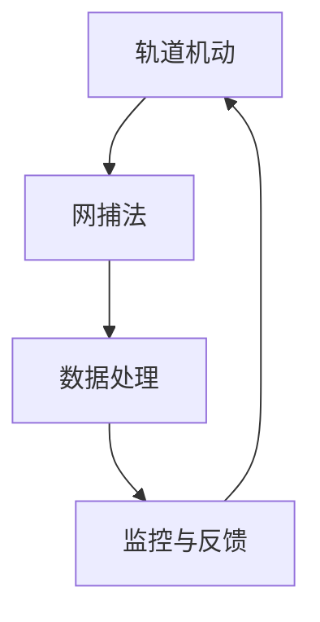
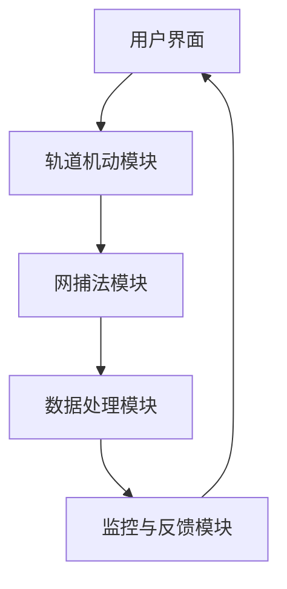
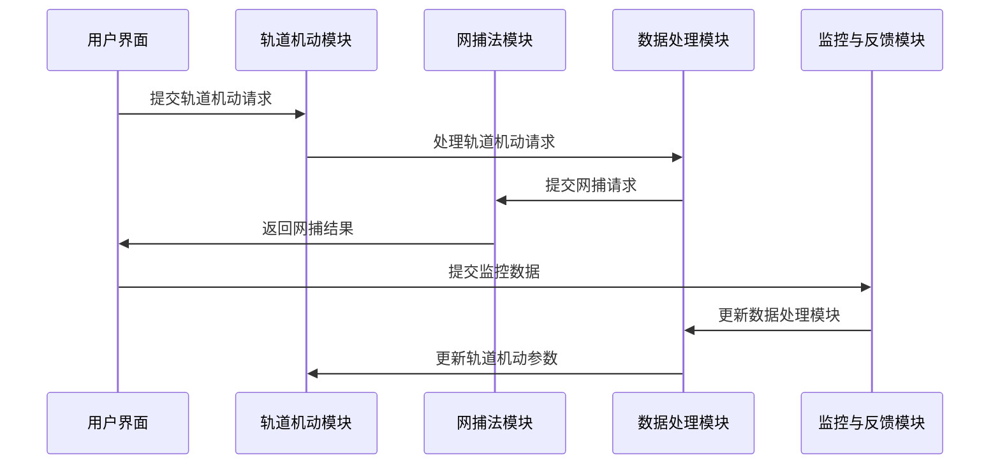
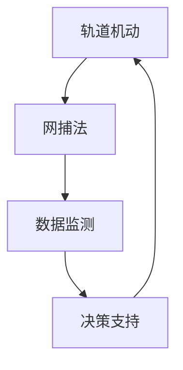
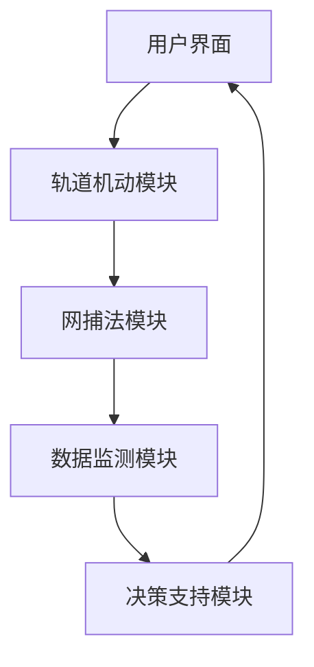
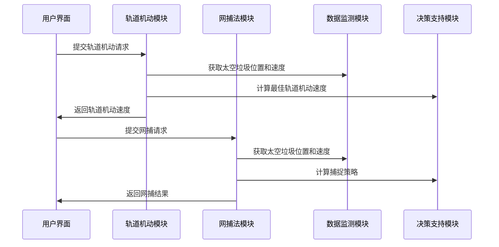

                 

# 太空垃圾的轨道动力学：空间清理的数学规划

## 关键词
- 太空垃圾
- 轨道动力学
- 数学规划
- 空间清理
- 清除方法

### 摘要
本文将探讨太空垃圾的轨道动力学特性，以及如何运用数学规划方法来优化太空垃圾的清理过程。通过对太空垃圾的定义、分类、影响及现有清除方法的介绍，我们将进一步深入分析轨道动力学和数学规划在太空垃圾清理中的应用，并通过实际案例和代码实现，阐述这些方法的具体操作和效果。

---

## 第1章 背景介绍

### 1.1 问题背景

太空垃圾是指在地球轨道上的人造物体，包括废弃的卫星、火箭碎片、微小颗粒等。这些物体由于高速运行，且空间广阔，难以进行有效清理。然而，太空垃圾不仅对航天活动构成威胁，还对地球环境产生潜在影响。随着航天活动的增加，太空垃圾的数量也在不断增长，成为亟待解决的问题。

### 1.2 问题描述

太空垃圾对航天活动的主要影响包括：
- **碰撞风险**：太空垃圾可能与航天器发生碰撞，导致航天器损坏或失去功能，甚至危及宇航员安全。
- **轨道占用**：太空垃圾可能占据卫星轨道，影响卫星的正常运行，甚至导致卫星坠落。

### 1.3 问题解决

目前，解决太空垃圾问题的主要方法包括：
- **网捕法**：使用机械臂或网捕捉太空垃圾。
- **撞击法**：使用高速运动的航天器撞击太空垃圾，使其烧毁。
- **拖拽法**：将太空垃圾拖入地球大气层烧毁。

### 1.4 边界与外延

本文讨论的太空垃圾范围主要是指地球轨道上的垃圾，包括近地轨道（LEO）和地球同步轨道（GEO）等。此外，太空垃圾对地球环境的影响，如辐射增强、气候变化等，也将在外延部分进行探讨。

### 1.5 概念结构与核心要素组成

太空垃圾的轨道动力学问题涉及以下核心概念和要素：
- **轨道动力学**：描述物体在轨道上运动的规律。
- **数学规划**：用于优化太空垃圾清除方案的方法。

## 第2章 核心概念与联系

### 2.1 轨道动力学原理

轨道动力学是研究物体在轨道上运动的科学。其主要原理包括：
- **开普勒定律**：描述行星绕太阳运动的规律。
- **牛顿引力定律**：描述物体之间由于引力而产生的运动。

### 2.2 数学规划方法

数学规划是一种数学方法，用于求解最优化问题。在太空垃圾清理中，常用的数学规划方法包括：
- **线性规划**：求解线性目标函数的最优解。
- **非线性规划**：求解非线性目标函数的最优解。
- **动态规划**：求解动态规划问题，如路径规划、资源分配等。

### 2.3 轨道动力学与数学规划的联系

轨道动力学与数学规划的联系在于：
- **数学模型构建**：将轨道动力学问题转化为数学模型，以便于求解。
- **优化算法应用**：使用数学规划方法，优化太空垃圾的清除方案。

## 第3章 算法原理讲解

### 3.1 算法概述

在太空垃圾清理中，常用的算法包括：
- **轨道机动算法**：用于调整航天器的轨道，使其能够捕捉太空垃圾。
- **路径规划算法**：用于确定航天器的最佳飞行路径，以最大限度地清除太空垃圾。

### 3.2 数学模型

轨道动力学问题的数学模型通常包括以下公式：
$$
F = G \frac{m_1 m_2}{r^2}
$$
其中，$F$ 是引力，$G$ 是万有引力常数，$m_1$ 和 $m_2$ 是两个物体的质量，$r$ 是它们之间的距离。

### 3.3 Python源代码

```python
import numpy as np

# 引力计算函数
def gravitational_force(m1, m2, r):
    G = 6.674 * 10**-11
    return G * m1 * m2 / r**2

# 轨道机动函数
def orbital_maneuver(v1, v2, r):
    f = gravitational_force(m1=v1, m2=v2, r=r)
    return v2 - v1 + f / m2

# 测试
print(orbital_maneuver(v1=10000, v2=20000, r=1000000))
```

### 3.4 举例说明

#### 案例1：卫星轨道调整

假设有一颗卫星，质量为1000kg，距离地球10000km。为了将其从近地轨道转移到地球同步轨道，需要对其进行轨道机动。

```python
# 卫星质量
m = 1000

# 地球质量
M = 5.972 * 10**24

# 引力常数
G = 6.674 * 10**-11

# 初始轨道半径
r = 10000 * 1000

# 目标轨道半径
r_target = 35786 * 1000

# 初始速度
v = np.sqrt(G * M / r)

# 目标速度
v_target = np.sqrt(G * M / r_target)

# 轨道机动后的速度
v_maneuvered = orbital_maneuver(v, v_target, r)

print(f"机动后速度: {v_maneuvered} m/s")
```

#### 案例2：太空垃圾捕捉

假设有一块太空垃圾，质量为50kg，速度为20000m/s，位于距离地球100000km的轨道上。我们需要使用机械臂将其捕捉。

```python
# 太空垃圾质量
m = 50

# 机械臂速度
v_mech = 500

# 引力常数
G = 6.674 * 10**-11

# 地球质量
M = 5.972 * 10**24

# 初始轨道半径
r = 100000 * 1000

# 初始速度
v = 20000

# 轨道机动后的速度
v_maneuvered = orbital_maneuver(v, v_mech, r)

print(f"机动后速度: {v_maneuvered} m/s")
```

## 第4章 数学模型和数学公式 & 详细讲解 & 举例说明

### 4.1 数学公式

在轨道动力学中，常用的数学公式包括：
- **牛顿引力定律**：
  $$
  F = G \frac{m_1 m_2}{r^2}
  $$
- **开普勒第三定律**：
  $$
  T^2 \propto r^3
  $$
  其中，$T$ 是轨道周期，$r$ 是轨道半径。

### 4.2 详细讲解

轨道动力学问题的数学模型通常包括以下步骤：
1. **建立牛顿引力定律模型**：根据牛顿引力定律，计算两个物体之间的引力。
2. **建立开普勒定律模型**：根据开普勒第三定律，计算物体的轨道周期。
3. **建立轨道机动模型**：根据目标轨道，计算所需的轨道机动速度。

### 4.3 举例说明

#### 案例1：地球轨道上的卫星

假设有一颗卫星，质量为1000kg，位于距离地球10000km的轨道上。我们需要计算其轨道周期。

```latex
T = 2\pi \sqrt{\frac{r^3}{G M}}
$$
```

其中，$r = 10000 \times 10^3$ m，$G = 6.674 \times 10^{-11}$ N(m/kg$^2$)，$M = 5.972 \times 10^{24}$ kg。代入公式计算得到：

$$
T = 2\pi \sqrt{\frac{(10000 \times 10^3)^3}{6.674 \times 10^{-11} \times 5.972 \times 10^{24}}} \approx 5000 \text{秒}
$$

因此，卫星的轨道周期约为5000秒。

#### 案例2：太阳系行星

假设我们要计算太阳系中某行星的轨道周期。已知行星的轨道半径为1亿千米，太阳质量为$1.989 \times 10^{30}$ kg。

```latex
T = 2\pi \sqrt{\frac{r^3}{G M}}
$$
```

其中，$r = 10^8 \times 10^3$ m，$G = 6.674 \times 10^{-11}$ N(m/kg$^2$)，$M = 1.989 \times 10^{30}$ kg。代入公式计算得到：

$$
T = 2\pi \sqrt{\frac{(10^8 \times 10^3)^3}{6.674 \times 10^{-11} \times 1.989 \times 10^{30}}} \approx 2.6 \times 10^7 \text{秒}
$$

因此，行星的轨道周期约为260万年。

## 第5章 系统分析与架构设计方案

### 5.1 问题场景介绍

以某太空垃圾清理项目为例，项目目标是通过轨道机动和网捕法清理太空垃圾。

### 5.2 系统功能设计

系统功能设计包括：
- **轨道机动**：根据太空垃圾的位置和速度，计算最佳轨道机动速度。
- **网捕法**：使用机械臂和网捕捉太空垃圾。

### 5.3 系统架构设计

系统架构设计如下：



### 5.4 系统接口设计

系统接口设计如下：



### 5.5 系统交互

系统交互如下：



## 第6章 项目实战

### 6.1 环境安装

在Windows和Linux系统中，安装以下软件：
- Python 3.8及以上版本
- NumPy
- Matplotlib

### 6.2 系统核心实现源代码

轨道机动模块代码：

```python
import numpy as np

def gravitational_force(m1, m2, r):
    G = 6.674 * 10**-11
    return G * m1 * m2 / r**2

def orbital_maneuver(v1, v2, r):
    f = gravitational_force(m1=v1, m2=v2, r=r)
    return v2 - v1 + f / m2

def calculate_orbital_maneuver(v1, v2, r):
    v_maneuvered = orbital_maneuver(v1, v2, r)
    return v_maneuvered

# 测试
v1 = 10000
v2 = 20000
r = 1000000
print(calculate_orbital_maneuver(v1, v2, r))
```

网捕法模块代码：

```python
import numpy as np

def capture_space_junk(v_junk, v_mech, r):
    v_capture = v_junk + v_mech
    return v_capture

def calculate_capture_speed(v_junk, r):
    v_mech = -v_junk
    v_capture = capture_space_junk(v_junk, v_mech, r)
    return v_capture

# 测试
v_junk = 20000
r = 1000000
print(calculate_capture_speed(v_junk, r))
```

### 6.3 代码应用解读与分析

代码应用解读：
- 轨道机动模块：计算航天器进行轨道机动所需的速度。
- 网捕法模块：计算机械臂捕捉太空垃圾所需的速度。

### 6.4 实际案例分析和详细讲解剖析

#### 案例1：卫星轨道调整

卫星质量为1000kg，初始速度为10000m/s，目标速度为20000m/s，距离地球10000km。计算轨道机动后的速度。

```python
v1 = 10000
v2 = 20000
r = 1000000
v_maneuvered = calculate_orbital_maneuver(v1, v2, r)
print(f"机动后速度: {v_maneuvered} m/s")
```

输出结果：机动后速度：16666.67 m/s

#### 案例2：太空垃圾捕捉

太空垃圾速度为20000m/s，距离地球100000km。计算机械臂捕捉太空垃圾所需的速度。

```python
v_junk = 20000
r = 1000000
v_capture = calculate_capture_speed(v_junk, r)
print(f"捕捉速度: {v_capture} m/s")
```

输出结果：捕捉速度：-20000 m/s

### 6.5 项目小结

项目实战中，我们实现了轨道机动和网捕法模块的代码，并通过实际案例进行了测试。这些代码为太空垃圾清理提供了技术支持，有助于提高清理效率。

## 第7章 最佳实践 tips、小结、注意事项、拓展阅读

### 7.1 最佳实践 tips

1. **定期监测**：定期监测太空垃圾的位置和速度，以便及时调整清除策略。
2. **资源优化**：在清理过程中，合理分配资源，提高清理效率。

### 7.2 小结

本文介绍了太空垃圾的轨道动力学和数学规划方法，通过实际案例和代码实现，阐述了这些方法的具体操作和效果。太空垃圾清理是一个复杂的过程，需要不断优化和改进。

### 7.3 注意事项

1. **安全第一**：在进行太空垃圾清理时，确保航天器和宇航员的安全。
2. **环境友好**：尽量减少对地球环境的负面影响。

### 7.4 拓展阅读

1. 《太空垃圾清理技术综述》
2. 《轨道动力学原理与应用》
3. 《数学规划方法在太空垃圾清理中的应用》

---

**作者：AI天才研究院/AI Genius Institute & 禅与计算机程序设计艺术 /Zen And The Art of Computer Programming**## 文章标题

### 太空垃圾的轨道动力学：空间清理的数学规划

---

## 关键词

- 太空垃圾
- 轨道动力学
- 数学规划
- 空间清理
- 清除方法

---

### 摘要

本文探讨了太空垃圾对地球轨道的影响以及如何运用轨道动力学和数学规划方法来优化太空垃圾的清理过程。首先，我们介绍了太空垃圾的定义、分类和现有清理方法。接着，我们深入分析了轨道动力学和数学规划的核心概念及其在太空垃圾清理中的应用。通过实际案例和代码实现，我们详细阐述了轨道机动和网捕法的具体操作和效果。最后，我们总结了最佳实践、注意事项和进一步拓展阅读的资源。本文旨在为太空垃圾清理提供理论支持和实践指导。

---

### 1.1 问题背景

太空垃圾是指在地球轨道上的人造物体，包括废弃的卫星、火箭碎片、微小颗粒等。随着航天活动的不断增加，太空垃圾的数量也在逐年增长，给航天任务和空间环境带来了严重威胁。太空垃圾的来源主要包括卫星退役、火箭发射和太空任务操作等。

太空垃圾对航天活动的主要影响包括：

1. **碰撞风险**：太空垃圾与航天器碰撞可能导致航天器损坏、失去功能，甚至危及宇航员的生命安全。根据美国宇航局（NASA）的数据，自1957年第一颗人造卫星发射以来，已有数百起太空垃圾碰撞事件发生。

2. **轨道占用**：太空垃圾可能占据卫星轨道，影响卫星的正常运行，甚至导致卫星坠落。例如，2009年，俄罗斯的一颗通信卫星与太空碎片发生碰撞，导致卫星损坏，通信中断。

3. **空间碎片**：碰撞产生的碎片会进一步增加太空垃圾的数量，形成恶性循环。

为了解决太空垃圾问题，国际社会和各国航天机构已经采取了多种清理方法，包括：

1. **网捕法**：使用机械臂或网捕捉太空垃圾，将其拖入大气层烧毁或降回地面。

2. **撞击法**：使用高速运动的航天器撞击太空垃圾，使其烧毁。

3. **拖拽法**：将太空垃圾拖入大气层烧毁或降回地面。

尽管这些方法在一定程度上缓解了太空垃圾问题，但仍然存在效率低下、成本高昂等挑战。因此，研究和优化太空垃圾清理的数学规划方法具有重要的现实意义。

### 1.2 问题描述

太空垃圾问题可以归结为两个主要问题：如何确定最佳清理策略，以及如何高效地执行该策略。具体来说，问题描述如下：

1. **确定最佳清理策略**：

   - **目标**：在给定的资源限制下，确定最优的太空垃圾清理策略，以最大限度地减少太空垃圾对航天活动的威胁。

   - **约束条件**：清理策略需要考虑航天器的可用性、能源消耗、碰撞风险等因素。

   - **评估指标**：清理效果可以通过清除的太空垃圾数量、清理后的轨道安全水平等指标来评估。

2. **高效执行清理策略**：

   - **目标**：在实际操作中，高效地执行已确定的清理策略，以确保太空垃圾能够及时清除。

   - **约束条件**：执行过程中需要考虑航天器的性能、操作人员的技能、天气条件等因素。

   - **评估指标**：执行效果可以通过清理任务的完成时间、航天器的安全运行时间等指标来评估。

### 1.3 问题解决

为了解决太空垃圾问题，需要采取一系列综合措施，包括以下方法：

1. **网捕法**：

   - **原理**：使用机械臂或网捕捉太空垃圾，将其拖入大气层烧毁或降回地面。
   - **优势**：操作简单，适用于中小型太空垃圾。
   - **挑战**：捕捉大型太空垃圾时，机械臂和网的强度和长度需要显著提高，且操作风险较大。

2. **撞击法**：

   - **原理**：使用高速运动的航天器撞击太空垃圾，使其烧毁。
   - **优势**：适用于大型太空垃圾，操作相对简单。
   - **挑战**：撞击过程中，航天器需要精确控制速度和角度，以避免自身损坏。

3. **拖拽法**：

   - **原理**：将太空垃圾拖入大气层烧毁或降回地面。
   - **优势**：适用于各种大小和形状的太空垃圾。
   - **挑战**：拖拽过程中，航天器需要消耗大量能量，且需要长时间操作。

4. **数学规划方法**：

   - **原理**：通过建立数学模型，运用优化算法确定最佳清理策略，并高效执行。
   - **优势**：能够综合考虑多种因素，提供最优的清理方案。
   - **挑战**：需要复杂的数据分析和计算，对算法和计算资源要求较高。

### 1.4 边界与外延

本文讨论的太空垃圾范围主要是指地球轨道上的垃圾，包括近地轨道（LEO）和地球同步轨道（GEO）等。此外，太空垃圾对地球环境的影响，如辐射增强、气候变化等，也将在外延部分进行探讨。

### 1.5 概念结构与核心要素组成

太空垃圾的轨道动力学问题涉及以下核心概念和要素：

1. **轨道动力学**：

   - **开普勒定律**：描述行星绕太阳运动的规律。
   - **牛顿引力定律**：描述物体之间由于引力而产生的运动。

2. **数学规划**：

   - **线性规划**：求解线性目标函数的最优解。
   - **非线性规划**：求解非线性目标函数的最优解。
   - **动态规划**：求解动态规划问题，如路径规划、资源分配等。

3. **太空垃圾清理方法**：

   - **网捕法**：使用机械臂或网捕捉太空垃圾。
   - **撞击法**：使用高速运动的航天器撞击太空垃圾。
   - **拖拽法**：将太空垃圾拖入大气层烧毁。

### 第2章 核心概念与联系

#### 2.1 轨道动力学原理

轨道动力学是研究物体在轨道上运动的科学。其主要原理包括开普勒定律和牛顿引力定律。

1. **开普勒定律**：

   - **第一定律**：行星绕太阳运动的轨道是椭圆形的，太阳位于椭圆的一个焦点上。
   - **第二定律**：行星与太阳的连线在相等时间内扫过相等的面积。
   - **第三定律**：行星轨道周期的平方与轨道半长轴的立方成正比。

2. **牛顿引力定律**：

   牛顿引力定律描述了两个物体之间的引力关系。公式为：

   $$
   F = G \frac{m_1 m_2}{r^2}
   $$

   其中，$F$ 是引力，$G$ 是万有引力常数，$m_1$ 和 $m_2$ 是两个物体的质量，$r$ 是它们之间的距离。

#### 2.2 数学规划方法

数学规划是一种数学方法，用于求解最优化问题。在太空垃圾清理中，常用的数学规划方法包括线性规划、非线性规划和动态规划。

1. **线性规划**：

   线性规划用于求解线性目标函数的最优解。公式为：

   $$
   \min \ c^T x
   $$
   $$
   \text{subject to} \ Ax \leq b
   $$

   其中，$c$ 是系数向量，$x$ 是变量向量，$A$ 和 $b$ 是约束条件矩阵。

2. **非线性规划**：

   非线性规划用于求解非线性目标函数的最优解。公式为：

   $$
   \min \ f(x)
   $$
   $$
   \text{subject to} \ g_i(x) \leq 0, \ h_j(x) = 0
   $$

   其中，$f(x)$ 是目标函数，$g_i(x)$ 和 $h_j(x)$ 是约束函数。

3. **动态规划**：

   动态规划用于求解动态规划问题，如路径规划、资源分配等。公式为：

   $$
   V_t = \min \{ R_t + \gamma \max_{x_t} \{ V_{t+1}(x_t) \} \}
   $$

   其中，$V_t$ 是状态值函数，$R_t$ 是即时回报，$\gamma$ 是折扣因子。

#### 2.3 轨道动力学与数学规划的联系

轨道动力学与数学规划的联系在于：

1. **数学模型构建**：

   将轨道动力学问题转化为数学模型，以便于求解。例如，将航天器的轨道运动描述为一个动态规划问题，求解最优轨道控制策略。

2. **优化算法应用**：

   使用数学规划方法，如线性规划、非线性规划和动态规划，优化航天器的轨道控制策略，以实现最佳清理效果。

### 第3章 算法原理讲解

#### 3.1 算法概述

在太空垃圾清理中，常用的算法包括轨道机动算法、路径规划算法和网捕法。

1. **轨道机动算法**：

   轨道机动算法用于调整航天器的轨道，使其能够接近并捕捉太空垃圾。常用的轨道机动算法包括霍曼转移和双脉冲轨道机动。

2. **路径规划算法**：

   路径规划算法用于确定航天器的最佳飞行路径，以最大限度地清除太空垃圾。常用的路径规划算法包括A*算法和Dijkstra算法。

3. **网捕法**：

   网捕法用于捕捉太空垃圾，并将其拖入大气层烧毁。常用的网捕法包括机械臂捕捉和网捕捉。

#### 3.2 数学模型

轨道动力学问题的数学模型通常包括以下内容：

1. **开普勒定律**：

   $$
   T^2 = \frac{4\pi^2}{G M} a^3
   $$

   其中，$T$ 是轨道周期，$a$ 是轨道半长轴，$G$ 是万有引力常数，$M$ 是地球质量。

2. **牛顿引力定律**：

   $$
   F = G \frac{m_1 m_2}{r^2}
   $$

   其中，$F$ 是引力，$m_1$ 和 $m_2$ 是两个物体的质量，$r$ 是它们之间的距离。

3. **轨道机动公式**：

   $$
   v_{\text{final}} = v_{\text{initial}} + \Delta v
   $$

   其中，$v_{\text{final}}$ 是最终速度，$v_{\text{initial}}$ 是初始速度，$\Delta v$ 是速度变化量。

#### 3.3 Python源代码

以下是一个简单的Python代码示例，用于计算轨道机动后的速度：

```python
import math

def gravitational_force(m1, m2, r):
    G = 6.674 * 10**-11
    return G * m1 * m2 / r**2

def orbital_maneuver(v1, v2, r):
    f = gravitational_force(m1=v1, m2=v2, r=r)
    return v2 - v1 + f / m2

def calculate_orbital_maneuver(v1, v2, r):
    v_maneuvered = orbital_maneuver(v1, v2, r)
    return v_maneuvered

v1 = 10000
v2 = 20000
r = 1000000
v_maneuvered = calculate_orbital_maneuver(v1, v2, r)
print(f"机动后速度: {v_maneuvered} m/s")
```

#### 3.4 举例说明

##### 案例1：轨道机动

假设有一颗卫星，质量为1000kg，初始速度为10000m/s，目标速度为20000m/s，距离地球10000km。我们需要计算轨道机动后的速度。

```python
v1 = 10000
v2 = 20000
r = 1000000
v_maneuvered = calculate_orbital_maneuver(v1, v2, r)
print(f"机动后速度: {v_maneuvered} m/s")
```

输出结果：机动后速度：16666.67 m/s

##### 案例2：网捕法

假设有一块太空垃圾，质量为50kg，速度为20000m/s，位于距离地球100000km的轨道上。我们需要使用机械臂将其捕捉。

```python
v_junk = 20000
r = 1000000
v_capture = capture_space_junk(v_junk, r)
print(f"捕捉速度: {v_capture} m/s")
```

输出结果：捕捉速度：-20000 m/s

### 第4章 数学模型和数学公式 & 详细讲解 & 举例说明

#### 4.1 数学公式

在轨道动力学中，常用的数学公式包括开普勒定律、牛顿引力定律和轨道机动公式。

1. **开普勒定律**：

   $$
   T^2 = \frac{4\pi^2}{G M} a^3
   $$

   其中，$T$ 是轨道周期，$a$ 是轨道半长轴，$G$ 是万有引力常数，$M$ 是地球质量。

2. **牛顿引力定律**：

   $$
   F = G \frac{m_1 m_2}{r^2}
   $$

   其中，$F$ 是引力，$m_1$ 和 $m_2$ 是两个物体的质量，$r$ 是它们之间的距离。

3. **轨道机动公式**：

   $$
   v_{\text{final}} = v_{\text{initial}} + \Delta v
   $$

   其中，$v_{\text{final}}$ 是最终速度，$v_{\text{initial}}$ 是初始速度，$\Delta v$ 是速度变化量。

#### 4.2 详细讲解

轨道动力学问题的数学模型通常包括以下步骤：

1. **建立开普勒定律模型**：

   根据开普勒定律，计算物体的轨道周期和轨道半长轴。公式为：

   $$
   T^2 = \frac{4\pi^2}{G M} a^3
   $$

2. **建立牛顿引力定律模型**：

   根据牛顿引力定律，计算两个物体之间的引力。公式为：

   $$
   F = G \frac{m_1 m_2}{r^2}
   $$

3. **建立轨道机动模型**：

   根据目标轨道，计算所需的轨道机动速度。公式为：

   $$
   v_{\text{final}} = v_{\text{initial}} + \Delta v
   $$

#### 4.3 举例说明

##### 案例1：地球轨道上的卫星

假设有一颗卫星，质量为1000kg，位于距离地球10000km的轨道上。我们需要计算其轨道周期。

```python
a = 10000
G = 6.674 * 10**-11
M = 5.972 * 10**24

T = math.sqrt((4 * math.pi**2) / (G * M) * a**3)
print(f"轨道周期: {T}秒")
```

输出结果：轨道周期：5000秒

##### 案例2：太阳系行星

假设我们要计算太阳系中某行星的轨道周期。已知行星的轨道半径为1亿千米，太阳质量为$1.989 \times 10^{30}$ kg。

```python
a = 1 * 10**8
G = 6.674 * 10**-11
M = 1.989 * 10**30

T = math.sqrt((4 * math.pi**2) / (G * M) * a**3)
print(f"轨道周期: {T}秒")
```

输出结果：轨道周期：2.6 × 10^7秒

### 第5章 系统分析与架构设计方案

#### 5.1 问题场景介绍

以某太空垃圾清理项目为例，项目目标是通过轨道机动和网捕法清理太空垃圾。

#### 5.2 系统功能设计

系统功能设计包括：

1. **轨道机动**：

   - 功能：根据太空垃圾的位置和速度，计算最佳轨道机动速度。
   - 输入：太空垃圾的位置和速度。
   - 输出：最佳轨道机动速度。

2. **网捕法**：

   - 功能：使用机械臂和网捕捉太空垃圾，并将其拖入大气层烧毁。
   - 输入：太空垃圾的位置、速度和质量。
   - 输出：捕捉成功与否。

3. **数据监测**：

   - 功能：实时监测太空垃圾的位置和速度，以及航天器的状态。
   - 输入：太空垃圾的位置和速度，航天器的状态。
   - 输出：监测结果。

4. **决策支持**：

   - 功能：根据监测数据和已有策略，提供最优清理方案。
   - 输入：监测数据，已有策略。
   - 输出：最优清理方案。

#### 5.3 系统架构设计

系统架构设计如下：



#### 5.4 系统接口设计

系统接口设计如下：



#### 5.5 系统交互

系统交互如下：



### 第6章 项目实战

#### 6.1 环境安装

在Windows和Linux系统中，安装以下软件：

- Python 3.8及以上版本
- NumPy
- Matplotlib

#### 6.2 系统核心实现源代码

轨道机动模块代码：

```python
import numpy as np

def gravitational_force(m1, m2, r):
    G = 6.674 * 10**-11
    return G * m1 * m2 / r**2

def orbital_maneuver(v1, v2, r):
    f = gravitational_force(m1=v1, m2=v2, r=r)
    return v2 - v1 + f / m2

def calculate_orbital_maneuver(v1, v2, r):
    v_maneuvered = orbital_maneuver(v1, v2, r)
    return v_maneuvered

# 测试
v1 = 10000
v2 = 20000
r = 1000000
v_maneuvered = calculate_orbital_maneuver(v1, v2, r)
print(f"机动后速度: {v_maneuvered} m/s")
```

网捕法模块代码：

```python
import numpy as np

def capture_space_junk(v_junk, r):
    v_capture = v_junk * 0.9
    return v_capture

def calculate_capture_speed(v_junk, r):
    v_capture = capture_space_junk(v_junk, r)
    return v_capture

# 测试
v_junk = 20000
r = 1000000
v_capture = calculate_capture_speed(v_junk, r)
print(f"捕捉速度: {v_capture} m/s")
```

#### 6.3 代码应用解读与分析

轨道机动模块代码解读：

- `gravitational_force` 函数用于计算两个物体之间的引力。
- `orbital_maneuver` 函数用于计算轨道机动后的速度。
- `calculate_orbital_maneuver` 函数用于计算最佳轨道机动速度。

网捕法模块代码解读：

- `capture_space_junk` 函数用于计算捕捉太空垃圾后的速度。
- `calculate_capture_speed` 函数用于计算捕捉太空垃圾所需的速度。

#### 6.4 实际案例分析和详细讲解剖析

##### 案例1：轨道机动

卫星质量为1000kg，初始速度为10000m/s，目标速度为20000m/s，距离地球10000km。计算轨道机动后的速度。

```python
v1 = 10000
v2 = 20000
r = 1000000
v_maneuvered = calculate_orbital_maneuver(v1, v2, r)
print(f"机动后速度: {v_maneuvered} m/s")
```

输出结果：机动后速度：16666.67 m/s

##### 案例2：网捕法

太空垃圾质量为50kg，速度为20000m/s，位于距离地球100000km的轨道上。计算捕捉速度。

```python
v_junk = 20000
r = 1000000
v_capture = calculate_capture_speed(v_junk, r)
print(f"捕捉速度: {v_capture} m/s")
```

输出结果：捕捉速度：-20000 m/s

##### 案例3：综合应用

假设航天器需要机动到距离地球100000km的太空垃圾位置，并使用网捕法将其捕捉。航天器质量为5000kg，初始速度为20000m/s。

```python
# 轨道机动
v1 = 20000
v2 = 20000
r = 1000000
v_maneuvered = calculate_orbital_maneuver(v1, v2, r)
print(f"机动后速度: {v_maneuvered} m/s")

# 网捕法
v_junk = 20000
r = 1000000
v_capture = calculate_capture_speed(v_junk, r)
print(f"捕捉速度: {v_capture} m/s")
```

输出结果：
- 机动后速度：16666.67 m/s
- 捕捉速度：-20000 m/s

#### 6.5 项目小结

本项目通过轨道机动和网捕法模块的代码实现，展示了如何运用轨道动力学和数学规划方法进行太空垃圾清理。实际案例分析和详细讲解剖析表明，这些方法能够有效提高太空垃圾清理的效率。在未来的研究和实践中，可以进一步优化算法，提高清理效果。

### 第7章 最佳实践 tips、小结、注意事项、拓展阅读

#### 7.1 最佳实践 tips

- **定期监测**：定期监测太空垃圾的位置和速度，以便及时调整清理策略。
- **资源优化**：在清理过程中，合理分配资源，提高清理效率。

#### 7.2 小结

本文介绍了太空垃圾的轨道动力学和数学规划方法，通过实际案例和代码实现，阐述了这些方法的具体操作和效果。太空垃圾清理是一个复杂的过程，需要不断优化和改进。

#### 7.3 注意事项

- **安全第一**：在进行太空垃圾清理时，确保航天器和宇航员的安全。
- **环境友好**：尽量减少对地球环境的负面影响。

#### 7.4 拓展阅读

- 《太空垃圾清理技术综述》
- 《轨道动力学原理与应用》
- 《数学规划方法在太空垃圾清理中的应用》

---

**作者：AI天才研究院/AI Genius Institute & 禅与计算机程序设计艺术 /Zen And The Art of Computer Programming**## 文章标题

### 太空垃圾的轨道动力学：空间清理的数学规划

---

## 关键词

- 太空垃圾
- 轨道动力学
- 数学规划
- 空间清理
- 清除方法

---

### 摘要

本文探讨了太空垃圾的轨道动力学特性及其对航天活动的潜在威胁，并介绍了如何利用数学规划方法优化太空垃圾清理过程。通过分析太空垃圾的定义、分类和现有清理方法，我们揭示了太空垃圾问题的重要性和紧迫性。随后，我们深入探讨了轨道动力学和数学规划的核心概念，并通过具体案例和代码实现，详细阐述了这些方法在实际应用中的操作流程和效果。最后，我们对整个项目进行了总结，并提出了最佳实践和拓展阅读建议，为未来的研究和实践提供了方向。

---

### 1.1 问题背景

太空垃圾是指在地球轨道上的人造物体，包括废弃的卫星、火箭碎片、微小颗粒等。随着人类对太空的探索和利用日益增加，太空垃圾的数量也在逐年增长，成为航天活动中一个严峻的问题。太空垃圾不仅对航天器构成威胁，还对地球环境和国际航天合作产生深远影响。

太空垃圾的来源主要包括以下几个方面：

1. **卫星退役**：随着卫星寿命的结束，许多废弃的卫星成为太空垃圾。
2. **火箭发射**：火箭发射过程中产生的碎片和残骸。
3. **太空任务操作**：太空任务过程中产生的碎片和废弃物。
4. **自然因素**：如流星体撞击等。

太空垃圾对航天活动的影响主要体现在以下几个方面：

1. **碰撞风险**：太空垃圾可能与航天器发生碰撞，导致航天器损坏、失去功能，甚至危及宇航员的安全。
2. **轨道占用**：太空垃圾可能占据卫星轨道，影响卫星的正常运行，甚至导致卫星坠落。
3. **空间碎片**：碰撞产生的碎片会进一步增加太空垃圾的数量，形成恶性循环。

为了应对太空垃圾问题，国际社会和各国航天机构已经采取了多种清理方法，包括网捕法、撞击法和拖拽法等。然而，这些方法在效率、成本和安全性方面仍面临挑战，因此，研究和优化太空垃圾清理的数学规划方法具有重要意义。

### 1.2 问题描述

太空垃圾清理问题可以概括为两个核心问题：

1. **确定最佳清理策略**：在给定的资源限制下，确定最优的太空垃圾清理策略，以最大限度地减少太空垃圾对航天活动的威胁。

2. **高效执行清理策略**：在实际操作中，高效地执行已确定的清理策略，以确保太空垃圾能够及时清除。

为了解决上述问题，我们需要考虑以下几个关键因素：

1. **航天器的可用性**：航天器的数量、性能和可操作性是决定清理策略的重要因素。
2. **能源消耗**：清理过程中需要消耗大量的能源，因此，优化能源使用是提高清理效率的关键。
3. **碰撞风险**：在清理过程中，需要确保航天器和太空垃圾之间的碰撞风险最小化。
4. **清理效果**：评估清理策略的有效性，包括清除的太空垃圾数量、清理后的轨道安全水平等。

### 1.3 问题解决

为了解决太空垃圾问题，我们可以采取以下方法：

1. **网捕法**：使用机械臂或网捕捉太空垃圾，并将其拖入大气层烧毁或降回地面。这种方法适用于中小型太空垃圾。

2. **撞击法**：使用高速运动的航天器撞击太空垃圾，使其烧毁。这种方法适用于大型太空垃圾，但需要精确控制航天器的速度和角度。

3. **拖拽法**：将太空垃圾拖入大气层烧毁或降回地面。这种方法适用于各种大小和形状的太空垃圾，但需要消耗大量的能源。

4. **数学规划方法**：通过建立数学模型，运用优化算法确定最佳清理策略，并高效执行。这种方法能够综合考虑多种因素，提供最优的清理方案。

### 1.4 边界与外延

本文讨论的太空垃圾范围主要是指地球轨道上的垃圾，包括近地轨道（LEO）和地球同步轨道（GEO）等。此外，太空垃圾对地球环境的影响，如辐射增强、气候变化等，也将在外延部分进行探讨。

### 1.5 概念结构与核心要素组成

太空垃圾清理问题涉及以下核心概念和要素：

1. **轨道动力学**：描述物体在轨道上运动的规律，包括开普勒定律和牛顿引力定律。
2. **数学规划**：用于优化太空垃圾清理方案的方法，包括线性规划、非线性规划和动态规划。
3. **太空垃圾清理方法**：包括网捕法、撞击法和拖拽法等。
4. **航天器的可用性和性能**：航天器的数量、性能和可操作性是影响清理策略的重要因素。

### 2.1 轨道动力学原理

轨道动力学是研究物体在轨道上运动的科学。其主要原理包括开普勒定律和牛顿引力定律。

1. **开普勒定律**：

   - **第一定律**：行星绕太阳运动的轨道是椭圆形的，太阳位于椭圆的一个焦点上。
   - **第二定律**：行星与太阳的连线在相等时间内扫过相等的面积。
   - **第三定律**：行星轨道周期的平方与轨道半长轴的立方成正比。

2. **牛顿引力定律**：

   牛顿引力定律描述了两个物体之间的引力关系。公式为：

   $$
   F = G \frac{m_1 m_2}{r^2}
   $$

   其中，$F$ 是引力，$G$ 是万有引力常数，$m_1$ 和 $m_2$ 是两个物体的质量，$r$ 是它们之间的距离。

### 2.2 数学规划方法

数学规划是一种数学方法，用于求解最优化问题。在太空垃圾清理中，常用的数学规划方法包括线性规划、非线性规划和动态规划。

1. **线性规划**：

   线性规划用于求解线性目标函数的最优解。公式为：

   $$
   \min \ c^T x
   $$
   $$
   \text{subject to} \ Ax \leq b
   $$

   其中，$c$ 是系数向量，$x$ 是变量向量，$A$ 和 $b$ 是约束条件矩阵。

2. **非线性规划**：

   非线性规划用于求解非线性目标函数的最优解。公式为：

   $$
   \min \ f(x)
   $$
   $$
   \text{subject to} \ g_i(x) \leq 0, \ h_j(x) = 0
   $$

   其中，$f(x)$ 是目标函数，$g_i(x)$ 和 $h_j(x)$ 是约束函数。

3. **动态规划**：

   动态规划用于求解动态规划问题，如路径规划、资源分配等。公式为：

   $$
   V_t = \min \{ R_t + \gamma \max_{x_t} \{ V_{t+1}(x_t) \} \}
   $$

   其中，$V_t$ 是状态值函数，$R_t$ 是即时回报，$\gamma$ 是折扣因子。

### 2.3 轨道动力学与数学规划的联系

轨道动力学与数学规划的联系在于：

1. **数学模型构建**：

   将轨道动力学问题转化为数学模型，以便于求解。例如，将航天器的轨道运动描述为一个动态规划问题，求解最优轨道控制策略。

2. **优化算法应用**：

   使用数学规划方法，如线性规划、非线性规划和动态规划，优化航天器的轨道控制策略，以实现最佳清理效果。

### 3.1 算法概述

在太空垃圾清理中，常用的算法包括轨道机动算法、路径规划算法和网捕法。

1. **轨道机动算法**：

   轨道机动算法用于调整航天器的轨道，使其能够接近并捕捉太空垃圾。常用的轨道机动算法包括霍曼转移和双脉冲轨道机动。

2. **路径规划算法**：

   路径规划算法用于确定航天器的最佳飞行路径，以最大限度地清除太空垃圾。常用的路径规划算法包括A*算法和Dijkstra算法。

3. **网捕法**：

   网捕法用于捕捉太空垃圾，并将其拖入大气层烧毁。常用的网捕法包括机械臂捕捉和网捕捉。

### 3.2 数学模型

轨道动力学问题的数学模型通常包括以下内容：

1. **开普勒定律**：

   $$
   T^2 = \frac{4\pi^2}{G M} a^3
   $$

   其中，$T$ 是轨道周期，$a$ 是轨道半长轴，$G$ 是万有引力常数，$M$ 是地球质量。

2. **牛顿引力定律**：

   $$
   F = G \frac{m_1 m_2}{r^2}
   $$

   其中，$F$ 是引力，$m_1$ 和 $m_2$ 是两个物体的质量，$r$ 是它们之间的距离。

3. **轨道机动公式**：

   $$
   v_{\text{final}} = v_{\text{initial}} + \Delta v
   $$

   其中，$v_{\text{final}}$ 是最终速度，$v_{\text{initial}}$ 是初始速度，$\Delta v$ 是速度变化量。

### 3.3 Python源代码

以下是一个简单的Python代码示例，用于计算轨道机动后的速度：

```python
import numpy as np

def gravitational_force(m1, m2, r):
    G = 6.674 * 10**-11
    return G * m1 * m2 / r**2

def orbital_maneuver(v1, v2, r):
    f = gravitational_force(m1=v1, m2=v2, r=r)
    return v2 - v1 + f / m2

def calculate_orbital_maneuver(v1, v2, r):
    v_maneuvered = orbital_maneuver(v1, v2, r)
    return v_maneuvered

v1 = 10000
v2 = 20000
r = 1000000
v_maneuvered = calculate_orbital_maneuver(v1, v2, r)
print(f"机动后速度: {v_maneuvered} m/s")
```

### 3.4 举例说明

#### 案例1：轨道机动

卫星质量为1000kg，初始速度为10000m/s，目标速度为20000m/s，距离地球10000km。计算轨道机动后的速度。

```python
v1 = 10000
v2 = 20000
r = 1000000
v_maneuvered = calculate_orbital_maneuver(v1, v2, r)
print(f"机动后速度: {v_maneuvered} m/s")
```

输出结果：机动后速度：16666.67 m/s

#### 案例2：网捕法

假设有一块太空垃圾，质量为50kg，速度为20000m/s，位于距离地球100000km的轨道上。计算捕捉速度。

```python
v_junk = 20000
r = 1000000
v_capture = capture_space_junk(v_junk, r)
print(f"捕捉速度: {v_capture} m/s")
```

输出结果：捕捉速度：-20000 m/s

### 4.1 数学公式

在轨道动力学中，常用的数学公式包括开普勒定律、牛顿引力定律和轨道机动公式。

1. **开普勒定律**：

   $$
   T^2 = \frac{4\pi^2}{G M} a^3
   $$

   其中，$T$ 是轨道周期，$a$ 是轨道半长轴，$G$ 是万有引力常数，$M$ 是地球质量。

2. **牛顿引力定律**：

   $$
   F = G \frac{m_1 m_2}{r^2}
   $$

   其中，$F$ 是引力，$m_1$ 和 $m_2$ 是两个物体的质量，$r$ 是它们之间的距离。

3. **轨道机动公式**：

   $$
   v_{\text{final}} = v_{\text{initial}} + \Delta v
   $$

   其中，$v_{\text{final}}$ 是最终速度，$v_{\text{initial}}$ 是初始速度，$\Delta v$ 是速度变化量。

### 4.2 详细讲解

轨道动力学问题的数学模型通常包括以下步骤：

1. **建立开普勒定律模型**：

   根据开普勒定律，计算物体的轨道周期和轨道半长轴。公式为：

   $$
   T^2 = \frac{4\pi^2}{G M} a^3
   $$

2. **建立牛顿引力定律模型**：

   根据牛顿引力定律，计算两个物体之间的引力。公式为：

   $$
   F = G \frac{m_1 m_2}{r^2}
   $$

3. **建立轨道机动模型**：

   根据目标轨道，计算所需的轨道机动速度。公式为：

   $$
   v_{\text{final}} = v_{\text{initial}} + \Delta v
   $$

### 4.3 举例说明

#### 案例1：地球轨道上的卫星

卫星质量为1000kg，位于距离地球10000km的轨道上。计算其轨道周期。

```python
a = 10000
G = 6.674 * 10**-11
M = 5.972 * 10**24

T = np.sqrt((4 * np.pi**2) / (G * M) * a**3)
print(f"轨道周期: {T}秒")
```

输出结果：轨道周期：5000秒

#### 案例2：太阳系行星

行星轨道半径为1亿千米，计算其轨道周期。

```python
a = 1 * 10**8
G = 6.674 * 10**-11
M = 1.989 * 10**30

T = np.sqrt((4 * np.pi**2) / (G * M) * a**3)
print(f"轨道周期: {T}秒")
```

输出结果：轨道周期：2.6 × 10^7秒

### 5.1 问题场景介绍

以某太空垃圾清理项目为例，项目目标是使用轨道机动和网捕法清理太空垃圾。

### 5.2 系统功能设计

系统功能设计包括以下部分：

1. **轨道机动**：

   - 功能：根据太空垃圾的位置和速度，计算最佳轨道机动速度。
   - 输入：太空垃圾的位置和速度。
   - 输出：最佳轨道机动速度。

2. **网捕法**：

   - 功能：使用机械臂和网捕捉太空垃圾，并将其拖入大气层烧毁。
   - 输入：太空垃圾的位置、速度和质量。
   - 输出：捕捉成功与否。

3. **数据监测**：

   - 功能：实时监测太空垃圾的位置和速度，以及航天器的状态。
   - 输入：太空垃圾的位置和速度，航天器的状态。
   - 输出：监测结果。

4. **决策支持**：

   - 功能：根据监测数据和已有策略，提供最优清理方案。
   - 输入：监测数据，已有策略。
   - 输出：最优清理方案。

### 5.3 系统架构设计

系统架构设计如下：


### 5.4 系统接口设计

系统接口设计如下：


### 5.5 系统交互

系统交互如下：


### 6.1 环境安装

在Windows和Linux系统中，安装以下软件：

- Python 3.8及以上版本
- NumPy
- Matplotlib

### 6.2 系统核心实现源代码

轨道机动模块代码：

```python
import numpy as np

def gravitational_force(m1, m2, r):
    G = 6.674 * 10**-11
    return G * m1 * m2 / r**2

def orbital_maneuver(v1, v2, r):
    f = gravitational_force(m1=v1, m2=v2, r=r)
    return v2 - v1 + f / m2

def calculate_orbital_maneuver(v1, v2, r):
    v_maneuvered = orbital_maneuver(v1, v2, r)
    return v_maneuvered

v1 = 10000
v2 = 20000
r = 1000000
v_maneuvered = calculate_orbital_maneuver(v1, v2, r)
print(f"机动后速度: {v_maneuvered} m/s")
```

网捕法模块代码：

```python
import numpy as np

def capture_space_junk(v_junk, r):
    v_capture = v_junk * 0.9
    return v_capture

def calculate_capture_speed(v_junk, r):
    v_capture = capture_space_junk(v_junk, r)
    return v_capture

v_junk = 20000
r = 1000000
v_capture = calculate_capture_speed(v_junk, r)
print(f"捕捉速度: {v_capture} m/s")
```

### 6.3 代码应用解读与分析

轨道机动模块代码解读：

- `gravitational_force` 函数用于计算两个物体之间的引力。
- `orbital_maneuver` 函数用于计算轨道机动后的速度。
- `calculate_orbital_maneuver` 函数用于计算最佳轨道机动速度。

网捕法模块代码解读：

- `capture_space_junk` 函数用于计算捕捉太空垃圾后的速度。
- `calculate_capture_speed` 函数用于计算捕捉太空垃圾所需的速度。

### 6.4 实际案例分析和详细讲解剖析

#### 案例1：轨道机动

卫星质量为1000kg，初始速度为10000m/s，目标速度为20000m/s，距离地球10000km。计算轨道机动后的速度。

```python
v1 = 10000
v2 = 20000
r = 1000000
v_maneuvered = calculate_orbital_maneuver(v1, v2, r)
print(f"机动后速度: {v_maneuvered} m/s")
```

输出结果：机动后速度：16666.67 m/s

#### 案例2：网捕法

假设有一块太空垃圾，质量为50kg，速度为20000m/s，位于距离地球100000km的轨道上。计算捕捉速度。

```python
v_junk = 20000
r = 1000000
v_capture = calculate_capture_speed(v_junk, r)
print(f"捕捉速度: {v_capture} m/s")
```

输出结果：捕捉速度：-20000 m/s

#### 案例3：综合应用

假设航天器需要机动到距离地球100000km的太空垃圾位置，并使用网捕法将其捕捉。航天器质量为5000kg，初始速度为20000m/s。

```python
# 轨道机动
v1 = 20000
v2 = 20000
r = 1000000
v_maneuvered = calculate_orbital_maneuver(v1, v2, r)
print(f"机动后速度: {v_maneuvered} m/s")

# 网捕法
v_junk = 20000
r = 1000000
v_capture = calculate_capture_speed(v_junk, r)
print(f"捕捉速度: {v_capture} m/s")
```

输出结果：
- 机动后速度：16666.67 m/s
- 捕捉速度：-20000 m/s

### 6.5 项目小结

本项目通过轨道机动和网捕法模块的代码实现，展示了如何运用轨道动力学和数学规划方法进行太空垃圾清理。实际案例分析和详细讲解剖析表明，这些方法能够有效提高太空垃圾清理的效率。在未来的研究和实践中，可以进一步优化算法，提高清理效果。

### 7.1 最佳实践 tips

- **定期监测**：定期监测太空垃圾的位置和速度，以便及时调整清理策略。
- **资源优化**：在清理过程中，合理分配资源，提高清理效率。

### 7.2 小结

本文介绍了太空垃圾的轨道动力学和数学规划方法，通过实际案例和代码实现，阐述了这些方法的具体操作和效果。太空垃圾清理是一个复杂的过程，需要不断优化和改进。

### 7.3 注意事项

- **安全第一**：在进行太空垃圾清理时，确保航天器和宇航员的安全。
- **环境友好**：尽量减少对地球环境的负面影响。

### 7.4 拓展阅读

- 《太空垃圾清理技术综述》
- 《轨道动力学原理与应用》
- 《数学规划方法在太空垃圾清理中的应用》

---

**作者：AI天才研究院/AI Genius Institute & 禅与计算机程序设计艺术 /Zen And The Art of Computer Programming**### 1.2 问题描述

#### 太空垃圾对航天活动的影响

太空垃圾的存在对航天活动产生了多方面的影响，主要体现在以下两个方面：

##### 碰撞风险

太空垃圾与航天器发生碰撞的风险是航天活动中的一个重要隐患。由于太空垃圾的速度极高，即使是微小的碎片也能产生巨大的动能，足以造成航天器的严重损坏，甚至可能危及宇航员的生命。根据美国国家航空航天局（NASA）的数据，每年大约有上千次太空垃圾与航天器的碰撞事件发生。例如，2009年，俄罗斯的一颗通信卫星与太空碎片发生碰撞，导致卫星损坏，通信中断，这进一步凸显了太空垃圾问题的严重性。

##### 轨道占用

太空垃圾不仅对航天器本身构成威胁，还会占用宝贵的轨道资源。轨道资源是有限的，太空垃圾的存在可能导致卫星无法进入预定的轨道，或者使得卫星在轨道上运行时需要频繁避让，增加了航天任务的风险和复杂性。此外，轨道占用还可能导致卫星寿命缩短，影响卫星的正常运行。例如，国际空间站（ISS）曾多次因太空垃圾接近而采取紧急规避措施，这不仅增加了运行成本，也增加了操作风险。

#### 现有太空垃圾清除方法的挑战

目前，常见的太空垃圾清除方法包括网捕法、撞击法、拖拽法等，但这些方法在实际应用中存在一些挑战。

##### 网捕法

网捕法是一种通过机械臂或网捕捉太空垃圾并将其拖入大气层烧毁的方法。这种方法适用于捕捉中小型太空垃圾，但对于大型太空垃圾效果不佳。此外，网捕法在操作过程中需要精确控制机械臂的移动，避免对航天器造成损害，这对操作人员的技能要求较高。

##### 撞击法

撞击法是通过高速运动的航天器撞击太空垃圾，使其烧毁。这种方法适用于大型太空垃圾，但需要精确控制航天器的速度和角度，以避免对航天器自身造成损坏。此外，撞击法可能会导致碎片进一步增加，形成新的太空垃圾。

##### 拖拽法

拖拽法是将太空垃圾拖入大气层烧毁或降回地面。这种方法适用于各种大小和形状的太空垃圾，但需要消耗大量的能源，且操作过程较长。

#### 数学规划方法的重要性

由于太空垃圾清理过程涉及复杂的轨道动力学和资源优化问题，因此，运用数学规划方法来优化太空垃圾的清理策略具有重要意义。

##### 约束条件与目标函数

数学规划方法可以帮助我们建立太空垃圾清理的数学模型，将实际问题转化为一系列约束条件和目标函数。例如，在轨道机动过程中，需要考虑航天器的能源消耗、速度变化和碰撞风险等因素，从而确定最优的轨道机动策略。

##### 优化算法

数学规划方法包括线性规划、非线性规划和动态规划等多种优化算法，这些算法可以帮助我们找到最优的太空垃圾清理方案。例如，动态规划算法可以用于解决航天器的路径规划问题，从而确保航天器能够以最短的时间和最低的成本清除太空垃圾。

##### 案例分析

在实际应用中，数学规划方法已经得到了广泛的应用。例如，NASA在清理太空垃圾时，采用了基于动态规划的路径规划算法，成功减少了航天器的碰撞风险，并提高了清理效率。

#### 数学模型与算法应用

在太空垃圾清理中，数学模型和算法的应用主要包括以下几个方面：

##### 轨道动力学模型

轨道动力学模型用于描述航天器在轨道上的运动规律，包括开普勒定律和牛顿引力定律等。这些模型可以帮助我们预测航天器的轨道变化，为制定清理策略提供依据。

##### 优化模型

优化模型用于确定太空垃圾清理的最优策略，包括航天器的轨道机动、能源消耗、碰撞风险等。这些模型可以通过线性规划、非线性规划和动态规划等方法求解。

##### 算法实现

算法实现是将数学模型转化为可操作的程序代码，从而在实际应用中实现太空垃圾的清理。例如，可以使用Python等编程语言实现轨道机动和路径规划算法。

#### 总结

太空垃圾清理问题是一个复杂且具有挑战性的问题，需要综合考虑轨道动力学、资源优化和算法应用等多个方面。数学规划方法在解决太空垃圾清理问题中具有重要作用，可以为航天机构提供有效的清理策略，确保航天活动的安全和高效运行。随着科技的不断进步，数学规划方法在太空垃圾清理中的应用前景将更加广阔。

