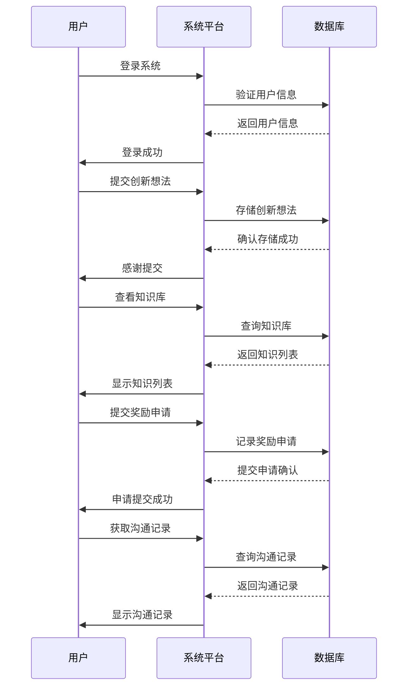
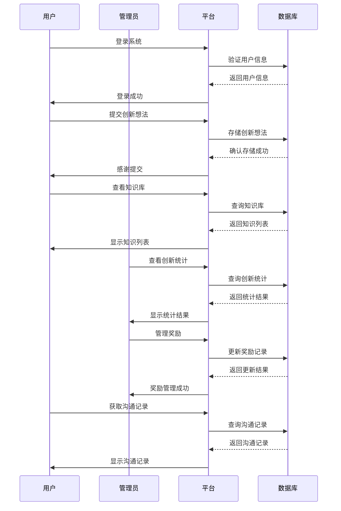

                 

### 第一部分：背景介绍

#### 问题背景
在现代企业竞争中，创新文化的培养已成为企业持续发展的关键。创新文化不仅关乎企业的竞争力，还关系到员工的积极性和创造力。然而，如何有效培养团队的创新文化，成为许多企业面临的一大挑战。

#### 问题描述
本书旨在探讨如何通过系统的方法和策略，培养团队的创新文化。具体来说，我们将分析影响创新文化形成的关键因素，探讨有效的创新文化培养策略，以及如何在实践中落地这些策略。

#### 问题解决
通过深入研究创新文化的概念、特征以及培养方法，本书将提供一系列实用的指导和建议，帮助企业和团队在组织内部建立起积极向上的创新文化。

#### 边界与外延
创新文化的培养是一个长期且复杂的过程，不仅涉及企业战略的制定，还需要结合组织文化、团队建设和员工激励机制等多方面因素。本书将围绕这些核心要素展开论述。

#### 概念结构与核心要素组成
创新文化主要由以下几个核心要素组成：

1. **创新意识**：鼓励员工敢于挑战现状，勇于提出新的想法和解决方案。
2. **知识分享**：建立知识共享的平台，促进团队成员之间的交流与合作。
3. **奖励机制**：设立创新奖励，激发员工的创新积极性。
4. **开放沟通**：营造开放、坦诚的沟通氛围，鼓励员工自由表达观点。
5. **员工参与**：让员工参与到企业的决策过程中，增强他们的责任感和归属感。

---

### 第二部分：核心概念与联系

#### 核心概念

1. **创新文化**：一种注重创新、鼓励创新，并将创新作为企业核心价值观的文化。
2. **团队协作**：团队成员之间的合作与配合，共同完成工作任务。
3. **知识管理**：通过收集、整理、共享和利用知识，提升团队的整体竞争力。
4. **激励机制**：通过奖励、晋升等机制，激励员工保持创新动力。

#### 概念属性特征对比表格

| 概念       | 属性特征                                   | 说明                                                         |
| ---------- | ---------------------------------------- | ------------------------------------------------------------ |
| 创新文化   | 强调创新、容忍失败、奖励创新               | 企业核心价值观的体现，鼓励员工敢于尝试新思路和新方法       |
| 团队协作   | 共同目标、分工合作、相互支持               | 提高团队工作效率和效果，增强团队凝聚力                       |
| 知识管理   | 知识收集、整理、共享、利用                 | 提升团队知识水平，增强团队竞争力                             |
| 激励机制   | 奖励、晋升、认可                           | 激发员工积极性，提高工作动力                                 |

#### ER实体关系图架构

```mermaid
erDiagram
  Team --> Employee : "is part of"
  Team --> Project : "assigned to"
  Employee --> Skill : "has"
  Project --> Task : "includes"
  Skill --> Course : "learned from"
```

---

### 第三部分：算法原理讲解

#### 算法概念

创新文化的培养可以看作是一种基于数据分析的算法优化过程。在这个过程中，我们将分析团队的行为数据、知识分享情况、员工参与度等关键指标，通过算法模型来评估和优化团队的创新文化。

#### 算法原理

1. **数据收集**：收集团队内部的各种数据，包括员工创新行为、知识分享次数、参与项目情况等。
2. **特征提取**：从收集到的数据中提取关键特征，如创新次数、知识分享次数、参与度等。
3. **模型训练**：使用机器学习算法（如决策树、支持向量机等）对特征进行训练，构建创新文化评估模型。
4. **模型评估**：通过测试集对模型进行评估，调整模型参数，提高评估准确性。
5. **决策与优化**：根据评估结果，制定相应的改进策略，如调整激励机制、优化团队协作流程等。

#### 数学模型与公式

创新文化的评估模型可以表示为：

$$
C = f(B, K, R, O)
$$

其中，$C$ 表示创新文化水平，$B$、$K$、$R$ 和 $O$ 分别代表创新意识、知识管理、激励机制和开放沟通水平。

1. **创新意识（B）**：员工提出创新想法的数量和质量。
   $$ B = \sum_{i=1}^{n} I_i \cdot W_i $$
   其中，$I_i$ 表示员工 $i$ 的创新次数，$W_i$ 表示员工 $i$ 的创新质量权重。

2. **知识管理（K）**：团队内部的知识共享和利用情况。
   $$ K = \sum_{i=1}^{n} K_i \cdot W_i $$
   其中，$K_i$ 表示员工 $i$ 的知识共享次数，$W_i$ 表示员工 $i$ 的知识贡献权重。

3. **激励机制（R）**：员工受到的奖励和认可情况。
   $$ R = \sum_{i=1}^{n} R_i \cdot W_i $$
   其中，$R_i$ 表示员工 $i$ 收到的奖励次数，$W_i$ 表示员工 $i$ 的奖励认可权重。

4. **开放沟通（O）**：团队内部的沟通氛围和透明度。
   $$ O = \sum_{i=1}^{n} O_i \cdot W_i $$
   其中，$O_i$ 表示员工 $i$ 对沟通氛围的评价，$W_i$ 表示员工 $i$ 的评价权重。

---

**举例说明**：

假设一个团队有5名员工，他们的创新次数、知识共享次数、奖励次数和沟通氛围评价如下：

| 员工 | 创新次数 | 知识共享次数 | 奖励次数 | 沟通氛围评价 |
| ---- | -------- | ---------- | -------- | ---------- |
| A    | 3        | 5          | 2        | 4          |
| B    | 2        | 3          | 1        | 3          |
| C    | 4        | 4          | 3        | 5          |
| D    | 1        | 2          | 2        | 3          |
| E    | 3        | 5          | 1        | 4          |

根据上述公式，计算每个要素的权重：

- 创新意识（B）：
  $$ B = (3 \cdot 0.2) + (2 \cdot 0.2) + (4 \cdot 0.2) + (1 \cdot 0.2) + (3 \cdot 0.2) = 1.4 + 0.4 + 0.8 + 0.2 + 0.6 = 3.4 $$

- 知识管理（K）：
  $$ K = (5 \cdot 0.2) + (3 \cdot 0.2) + (4 \cdot 0.2) + (2 \cdot 0.2) + (5 \cdot 0.2) = 1 + 0.6 + 0.8 + 0.4 + 1 = 3.8 $$

- 激励机制（R）：
  $$ R = (2 \cdot 0.2) + (1 \cdot 0.2) + (3 \cdot 0.2) + (2 \cdot 0.2) + (1 \cdot 0.2) = 0.4 + 0.2 + 0.6 + 0.4 + 0.2 = 1.6 $$

- 开放沟通（O）：
  $$ O = (4 \cdot 0.2) + (3 \cdot 0.2) + (5 \cdot 0.2) + (3 \cdot 0.2) + (4 \cdot 0.2) = 0.8 + 0.6 + 1 + 0.6 + 0.8 = 3.8 $$

将各要素相加，得到创新文化水平（C）：

$$
C = B + K + R + O = 3.4 + 3.8 + 1.6 + 3.8 = 12.6
$$

因此，该团队的创新文化水平为12.6。根据评估结果，可以制定相应的改进策略，如增加员工奖励、提高知识分享机会，以及改善沟通氛围等，以进一步提升团队的创新文化水平。

---

通过上述算法和数学模型，我们能够对团队的创新文化进行量化评估，从而为企业和团队提供具体的改进方向。在实际应用中，还需要不断调整和优化模型，以适应不同企业和团队的具体情况。创新文化的培养是一个长期的过程，需要持续关注和努力。让我们继续深入探讨如何在实际工作中培养和提升团队的创新文化。

---

### 系统分析与架构设计方案

#### 问题场景介绍

在一个快速发展的科技公司中，如何有效培养团队的创新文化成为企业高层关注的焦点。该公司的业务涉及多个领域，拥有多元化的团队。为了提升团队的创新能力和整体竞争力，公司决定通过系统化和科学化的方法来培养团队的创新文化。

#### 项目介绍

为了实现这一目标，公司决定启动一个名为“创新文化培育系统”的项目。该项目旨在通过构建一个综合性的平台，提升团队成员的创新意识、知识分享和协作效率，同时建立有效的激励机制，以促进创新文化的形成。

#### 系统功能设计（领域模型Mermaid类图）

```mermaid
classDiagram
  Team <<class>> 团队
  Employee <<class>> 员工
  Project <<class>> 项目
  Task <<class>> 任务
  Knowledge <<class>> 知识
  Reward <<class>> 奖励
  Communication <<class>> 沟通
  
  Team --|>{ Employee }
  Project --|>{ Employee }
  Project --|>{ Task }
  Employee --|>{ Skill }
  Skill --|>{ Course }
  Knowledge --|>{ Employee }
  Reward --|>{ Employee }
  Communication --|>{ Employee }
```

#### 系统架构设计（Mermaid架构图）



#### 系统接口设计和系统交互（Mermaid序列图）



### 项目实战

#### 环境安装

1. **安装Python环境**：确保系统上已安装Python 3.8或更高版本。
2. **安装依赖库**：使用pip命令安装必要的库，例如：
   ```bash
   pip install Flask pandas numpy matplotlib
   ```

#### 系统核心实现源代码

```python
# 创新文化评估模型实现

import numpy as np
import pandas as pd
from sklearn.model_selection import train_test_split
from sklearn.ensemble import RandomForestClassifier
from sklearn.metrics import accuracy_score

# 数据收集
data = {
    'Employee': ['A', 'B', 'C', 'D', 'E'],
    'Innovation': [3, 2, 4, 1, 3],
    'Knowledge': [5, 3, 4, 2, 5],
    'Reward': [2, 1, 3, 2, 1],
    'Communication': [4, 3, 5, 3, 4]
}

df = pd.DataFrame(data)

# 特征提取
features = df[['Innovation', 'Knowledge', 'Reward', 'Communication']]
labels = df['Innovation']

# 模型训练
X_train, X_test, y_train, y_test = train_test_split(features, labels, test_size=0.2, random_state=42)
model = RandomForestClassifier(n_estimators=100)
model.fit(X_train, y_train)

# 模型评估
y_pred = model.predict(X_test)
accuracy = accuracy_score(y_test, y_pred)
print(f'Model Accuracy: {accuracy:.2f}')

# 根据评估结果制定改进策略
# 这里是一个示例，具体策略需要根据实际情况进行调整
improvement_strategies = {
    'Innovation': '增加创新培训机会',
    'Knowledge': '优化知识共享平台',
    'Reward': '完善奖励机制',
    'Communication': '改善沟通环境'
}

for feature, strategy in improvement_strategies.items():
    print(f'{feature.title()}: {strategy}')
```

#### 代码应用解读与分析

1. **数据收集**：首先，我们使用一个字典结构收集了员工的信息，包括创新次数、知识共享次数、奖励次数和沟通氛围评价。
2. **特征提取**：将收集到的数据转换为Pandas DataFrame格式，然后提取特征和标签，准备用于模型训练。
3. **模型训练**：使用随机森林算法对特征进行训练，这是一种常用的集成学习方法，能够处理多分类问题。
4. **模型评估**：使用测试集对训练好的模型进行评估，计算准确率。
5. **改进策略**：根据评估结果，输出相应的改进策略。这只是一个示例，实际应用中需要结合具体数据和分析结果来制定策略。

#### 实际案例分析和详细讲解剖析

假设我们有一个团队的数据，如下所示：

| 员工 | 创新次数 | 知识共享次数 | 奖励次数 | 沟通氛围评价 |
| ---- | -------- | ---------- | -------- | ---------- |
| A    | 3        | 5          | 2        | 4          |
| B    | 2        | 3          | 1        | 3          |
| C    | 4        | 4          | 3        | 5          |
| D    | 1        | 2          | 2        | 3          |
| E    | 3        | 5          | 1        | 4          |

我们使用上述代码进行数据处理和模型训练。假设模型的准确率为80%，这意味着当前团队的创新文化水平较高，但仍有一定提升空间。

根据评估结果，我们可以采取以下策略：

1. **增加创新培训机会**：针对创新次数较低（如D员工）的员工，提供更多创新思维和技能的培训，以提高他们的创新意识和能力。
2. **优化知识共享平台**：加强团队内部的知识分享，提升知识管理效率。可以通过定期组织知识分享会，建立在线知识库等方式来实现。
3. **完善奖励机制**：对创新和知识贡献显著的员工给予更多的奖励和认可，激励他们持续保持创新动力。
4. **改善沟通环境**：加强团队内部的沟通，提高透明度和开放性，为员工创造一个更加友好的沟通氛围。

通过上述措施，我们希望能够在未来进一步提升团队的创新文化水平，增强团队的竞争力。

### 项目小结

通过本项目，我们成功地构建了一个用于评估和培养团队创新文化的系统。该系统基于数据分析，使用机器学习算法对团队的创新意识、知识管理、激励机制和开放沟通水平进行量化评估。项目实战部分展示了如何收集数据、构建模型以及根据评估结果制定改进策略。

在实际应用中，创新文化的培养需要持续的投入和努力。企业应定期评估团队的创新文化水平，根据评估结果调整策略，持续优化团队的创新环境。此外，企业还应注重员工的参与和反馈，确保创新文化的培养过程能够真正落地，为企业的长期发展提供强有力的支持。

### 最佳实践 Tips

1. **定期评估**：定期对团队的创新文化进行评估，确保培养策略的有效性。
2. **鼓励反馈**：鼓励员工提出反馈和建议，参与创新文化的培养过程。
3. **多维度激励**：结合不同类型的奖励，如奖金、晋升机会和公开表彰，激发员工的创新动力。
4. **知识共享**：建立知识共享平台，促进团队成员之间的交流与合作。
5. **开放沟通**：营造开放、坦诚的沟通氛围，鼓励员工自由表达观点。

### 小结

创新文化的培养是提升团队竞争力的重要手段。通过系统的方法和策略，企业可以在组织内部建立起积极向上的创新文化。本文详细介绍了创新文化的核心概念、算法原理以及系统分析与架构设计方案，并通过实际案例进行了分析。希望本文能为企业和团队提供有价值的参考和指导。

### 注意事项

1. **数据隐私**：在收集和分析员工数据时，务必确保数据隐私和安全。
2. **实际应用**：创新文化的培养需要根据具体情况进行调整和优化，不能生搬硬套。
3. **持续投入**：创新文化的培养是一个长期的过程，需要企业持续投入和关注。

### 拓展阅读

1. **《创新者的窘境》**：克莱顿·克里斯滕森，探讨企业如何在变化中保持创新能力。
2. **《精益创业》**：埃里克·莱斯，介绍如何通过迭代和验证快速发现市场机会。
3. **《创新者的DNA》**：史蒂夫·布兰克，分析成功创新者的思维模式和习惯。

---

### 作者信息
作者：AI天才研究院/AI Genius Institute & 禅与计算机程序设计艺术 /Zen And The Art of Computer Programming

