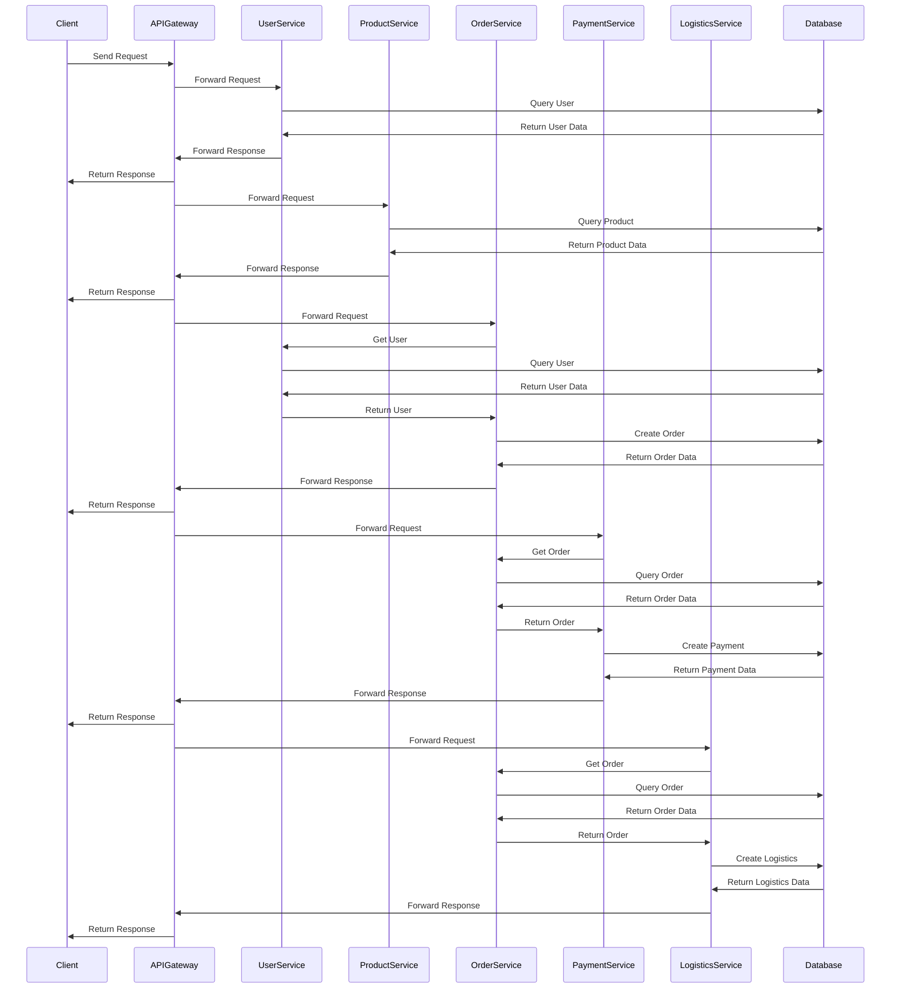

                 


# 如何培养团队的执行力

## 关键词
团队执行力、目标设定、团队文化、领导力、沟通协作、系统分析与架构设计、项目实战、最佳实践

## 摘要
本文旨在探讨如何有效地培养团队的执行力。我们将从定义团队执行力开始，分析其重要性，然后逐步介绍核心概念与联系，具体方法与工具，以及如何通过系统分析与架构设计、项目实战来提升团队执行力。最后，我们将总结最佳实践，并提供拓展阅读，帮助读者更好地理解和应用执行力培养的方法。

## 引言
在当今快速变化和竞争激烈的市场环境中，团队的执行力已经成为企业成功的关键因素。执行力不仅决定了任务的完成质量，还影响了团队的整体士气和效率。然而，如何培养团队的执行力，使其在复杂多变的环境中保持高效，是一个值得深入探讨的问题。

本文将按照以下步骤进行分析和讲解：

1. **团队执行力的定义与重要性**：介绍团队执行力的基本概念，阐述其在企业成功中的作用。
2. **核心概念与联系**：分析团队执行力相关的核心概念，如团队目标、团队文化、团队成员的角色和责任、领导力、沟通与协作，并展示概念属性特征对比表格和ER实体关系图。
3. **算法原理讲解**：介绍如何通过特定的方法和工具培养团队的执行力，包括目标设定与优先级管理、构建高效团队文化、提升团队成员的角色认知与责任、领导力与执行力、沟通与协作技巧。
4. **数学模型和数学公式 & 详细讲解 & 举例说明**：讨论如何量化团队的执行力，可能包括团队效能指标的计算方法。
5. **系统分析与架构设计方案**：设计一个示例性的团队执行力培养系统，包括系统功能设计、系统架构设计和系统接口设计。
6. **项目实战**：提供实际案例，展示如何实施执行力培养方案，包括环境安装、系统核心实现、代码应用解读和分析。
7. **最佳实践 tips、小结、注意事项、拓展阅读**：总结书中的关键点，提供实用的建议，并推荐进一步阅读的资源。

### 第1章：团队执行力的定义与价值

#### 团队执行力的定义

团队执行力是指团队在既定目标和时间框架内，有效地完成任务的意愿和能力。它不仅仅体现在任务的完成速度和质量上，还包括团队成员在完成任务过程中的协作、沟通和自我管理能力。

#### 团队执行力的重要性

在当今的市场环境中，团队的执行力对企业成功至关重要。以下是团队执行力对企业贡献的几个方面：

1. **提高效率**：高效的执行力可以减少浪费，缩短项目周期，提高资源利用效率。
2. **增强竞争力**：执行力强的团队能够迅速响应市场变化，抓住商机，提升企业的竞争力。
3. **提升士气**：成功的执行能够增强团队成员的自信心和满意度，提高整体士气。
4. **培养团队精神**：执行过程中的协作与沟通有助于培养团队精神，增强团队凝聚力。

#### 执行力不足的影响

如果团队执行力不足，可能会带来以下负面影响：

1. **项目延误**：任务无法按时完成，导致项目延期，影响企业的声誉。
2. **资源浪费**：无效的执行可能导致资源浪费，增加成本。
3. **沟通障碍**：执行力不足可能导致团队成员之间沟通不畅，增加误解和冲突。
4. **士气低落**：长期执行不力会降低团队成员的工作积极性，影响整体士气。

因此，培养团队的执行力对于企业的长期发展具有重要意义。在接下来的章节中，我们将深入探讨如何实现这一目标。

### 第2章：团队执行力核心概念与联系

#### 团队目标

团队目标是团队奋斗的方向和指南，明确团队需要实现的具体目标和预期成果。团队目标应当具体、可衡量、可实现、相关性强且时限明确（SMART原则）。

#### 团队文化

团队文化是团队在长期实践中形成的共同价值观、信念和行为准则。一个积极的团队文化可以增强团队成员的归属感和认同感，提高团队的执行力。

1. **价值观**：团队文化中的核心价值观通常包括诚信、合作、创新、责任和客户导向。
2. **信念**：团队文化中包含的信念是团队成员共同遵守的原则和信条。
3. **行为准则**：团队文化影响团队成员的行为方式和决策过程。

#### 团队成员的角色与责任

团队成员的角色和责任是执行力培养的基础。每个成员应当明确自己的角色，并承担相应的责任。

1. **角色定义**：团队成员的角色通常包括领导者、执行者、协调者、技术专家和支持者等。
2. **责任分配**：团队成员应当清楚自己的责任范围，确保任务能够高效完成。

#### 领导力

领导力是团队执行力的重要保障。一个优秀的领导者能够激发团队成员的潜力，提供方向和动力，确保团队目标的实现。

1. **愿景和目标设定**：领导者需要设定清晰的愿景和目标，引导团队朝着共同的方向前进。
2. **激励与支持**：领导者应当激励团队成员，提供必要的支持和资源。
3. **沟通与反馈**：领导者需要保持开放的沟通，及时给予反馈，确保团队成员明确任务要求和进展情况。

#### 沟通与协作

沟通与协作是团队执行力的关键。高效的沟通和协作能够确保团队成员理解任务要求，协调资源和时间，避免误解和冲突。

1. **沟通技巧**：团队成员需要掌握有效的沟通技巧，包括倾听、表达和反馈。
2. **协作工具**：利用协作工具，如项目管理软件、即时通讯工具和文档共享平台，提高协作效率。
3. **冲突管理**：团队成员应当学会如何在冲突中保持冷静，通过合作解决问题。

#### 概念属性特征对比表格

以下是一个简化的团队执行力相关概念属性特征对比表格：

| 概念 | 属性特征 |
| --- | --- |
| 团队目标 | 明确、具体、可衡量、可实现、时限明确 |
| 团队文化 | 价值观、信念、行为准则 |
| 团队成员的角色与责任 | 清晰定义、明确责任 |
| 领导力 | 愿景设定、激励支持、沟通反馈 |
| 沟通与协作 | 高效沟通、协作工具、冲突管理 |

#### ER实体关系图架构

为了更好地理解团队执行力相关概念之间的联系，我们可以使用ER实体关系图来展示它们之间的相互关系。

```mermaid
erDiagram
    TeamGoal ||--|{ TeamCulture } : defines
    TeamMember ||--|{ RoleAndResponsibility } : has
    TeamMember ||--|{ Leadership } : follows
    TeamMember ||--|{ CommunicationAndCollaboration } : practices
    Leadership ||--|{ VisionAndGoalSetting } : leads
    Leadership ||--|{ MotivationAndSupport } : provides
    Leadership ||--|{ CommunicationAndFeedback } : delivers
```

通过这张ER图，我们可以清晰地看到团队执行力各个核心概念之间的关系，这有助于我们在实际操作中更好地理解和应用这些概念。

### 第3章：目标设定与优先级管理

#### 目标设定的原则

目标设定是团队执行力培养的重要环节。一个明确、具体、可衡量、可实现、时限明确（SMART）的目标能够为团队提供清晰的行动方向。以下是目标设定的基本原则：

1. **具体性**：目标应当具体明确，避免模糊不清。
2. **可衡量性**：目标应当可量化，以便评估进展和效果。
3. **可实现性**：目标应当基于团队的能力和资源设定，既不低也不高。
4. **相关性**：目标应当与团队的核心使命和愿景一致。
5. **时限性**：目标应当有明确的完成时间，以激发团队的紧迫感。

#### 优先级管理

在目标设定之后，优先级管理同样至关重要。优先级管理可以帮助团队在有限的时间和资源下，确保最重要和紧急的任务得到优先处理。以下是优先级管理的步骤：

1. **评估任务的重要性**：根据任务对企业目标和战略的重要性进行评估。
2. **评估任务的紧急性**：根据任务完成的紧迫性进行评估。
3. **制定优先级列表**：将任务按优先级排序，确保重要且紧急的任务优先处理。
4. **定期回顾和调整**：根据实际情况和进度，定期回顾和调整优先级。

#### 实例分析

假设一个软件开发团队正在开发一款新的应用程序。以下是该团队如何设定目标和优先级的一个实例：

1. **目标设定**：
   - 目标1：在接下来的三个月内完成应用程序的前端和后端开发。
   - 目标2：确保应用程序的稳定性和安全性。
   - 目标3：收集用户反馈，并进行必要的功能优化。

2. **优先级管理**：
   - 任务1（高优先级）：确保前端和后端开发的进度，保证项目按时交付。
   - 任务2（中优先级）：在开发过程中进行单元测试，确保代码质量。
   - 任务3（低优先级）：收集用户反馈，并在产品发布后进行功能优化。

通过明确的目标设定和优先级管理，该团队能够高效地分配资源和时间，确保关键任务得到优先处理，从而提升团队的执行力。

### 第4章：构建高效团队文化

#### 团队文化的要素

团队文化是团队在长期实践中形成的共同价值观、信念和行为准则。一个高效的团队文化能够增强团队的凝聚力、信任和创新能力，从而提高执行力。以下是构建高效团队文化的关键要素：

1. **价值观**：团队文化中的核心价值观通常包括诚信、尊重、团队合作、创新和持续学习。
2. **信念**：团队文化中的信念是团队成员共同遵守的原则和信条，如“客户至上”、“质量第一”等。
3. **行为准则**：团队文化中的行为准则是团队成员在日常工作中的行为规范，如准时开会、尊重他人意见等。

#### 如何构建积极向上的团队文化

1. **领导层的示范作用**：领导者应当以身作则，践行团队文化的核心价值观和行为准则。
2. **沟通与反馈**：建立开放的沟通渠道，鼓励团队成员分享意见和反馈，促进团队文化的建设。
3. **奖励与认可**：通过奖励和认可制度，激励团队成员践行团队文化，提升团队的积极性。
4. **团队建设活动**：定期组织团队建设活动，增强团队成员之间的信任和凝聚力。

#### 实例分析

假设一个软件开发团队希望构建一个以“创新”为核心的团队文化。以下是该团队可以采取的一些具体措施：

1. **领导层的示范作用**：领导者鼓励团队成员提出创新想法，并积极参与讨论和实施。
2. **沟通与反馈**：定期组织创新研讨会，鼓励团队成员分享创新点子和最佳实践。
3. **奖励与认可**：设立创新奖励制度，对提出并成功实施创新方案的个人或团队给予奖励。
4. **团队建设活动**：组织创新工作坊，让团队成员在轻松的氛围中自由讨论和探索创新方案。

通过这些措施，该团队能够逐步构建一个以“创新”为核心的积极向上的团队文化，从而提升团队的执行力和创新能力。

### 第5章：提升团队成员的角色认知与责任

#### 角色认知的重要性

团队成员对自身角色的认知是团队执行力提升的基础。明确的角色认知有助于团队成员更好地理解自己的职责和任务，从而提高协作效率和执行力。

#### 角色认知的步骤

1. **明确角色定义**：团队领导者应当明确每个角色的职责和期望，确保每个成员都清楚自己的角色。
2. **沟通与确认**：团队成员之间应当进行充分的沟通，确认各自的角色和职责。
3. **持续反馈**：通过定期的反馈机制，确保团队成员对角色的认知保持更新和准确。

#### 责任分配与问责

1. **责任分配**：根据团队成员的技能和经验，合理分配任务和责任，确保任务能够高效完成。
2. **明确责任范围**：每个团队成员都应当明确自己的责任范围，避免责任重叠或责任缺失。
3. **问责机制**：建立问责机制，确保团队成员对任务的完成情况进行跟踪和评估，对未完成的任务进行问责。

#### 实例分析

假设一个项目团队正在进行一个大型软件开发项目，以下是提升团队成员角色认知与责任的具体措施：

1. **角色定义**：明确项目团队成员的角色，如项目经理、开发人员、测试人员、产品经理等。
2. **沟通与确认**：召开角色认知会议，确保每个成员都清楚自己的职责和任务。
3. **责任分配**：根据团队成员的技能和经验，合理分配任务，确保任务能够高效完成。
4. **问责机制**：建立周报制度，定期评估团队成员的任务完成情况，对未完成的任务进行问责。

通过这些措施，项目团队能够更好地理解各自的角色和责任，从而提高团队的整体执行力。

### 第6章：领导力与执行力

#### 领导力与团队执行力的关系

领导力是团队执行力的重要保障。一个优秀的领导者能够激发团队成员的潜力，提供方向和动力，确保团队目标的实现。

#### 领导者的角色

1. **愿景设定**：领导者需要设定清晰的愿景和目标，为团队提供明确的行动方向。
2. **激励与支持**：领导者应当激励团队成员，提供必要的支持和资源，帮助团队克服困难。
3. **沟通与反馈**：领导者需要保持开放的沟通，及时给予反馈，确保团队成员明确任务要求和进展情况。

#### 提升领导力的方法

1. **培训与发展**：通过领导力培训，提高领导者的管理技能和沟通能力。
2. **实践与反思**：领导者应当在实践中不断反思和改进自己的领导方式，提升领导效果。
3. **激励与认可**：通过激励和认可，增强领导者的责任感和使命感。

#### 实例分析

假设一个软件开发团队的领导者希望提升团队执行力，以下是该领导者可以采取的一些具体措施：

1. **愿景设定**：明确团队的长期目标和短期目标，确保团队成员对团队的方向有清晰的认识。
2. **激励与支持**：为团队成员提供必要的资源和培训，鼓励他们积极参与项目，并对他们的成就给予认可。
3. **沟通与反馈**：定期召开团队会议，了解团队成员的进展和困难，提供及时的反馈和指导。

通过这些措施，领导者能够有效地提升团队执行力，确保团队目标的实现。

### 第7章：沟通与协作技巧

#### 沟通技巧的重要性

沟通是团队协作的核心。有效的沟通能够确保团队成员理解任务要求，协调资源和时间，避免误解和冲突。

#### 提高沟通效率的技巧

1. **明确目标**：在沟通前明确沟通的目标和要点，确保沟通内容聚焦。
2. **倾听**：积极倾听他人的意见和反馈，理解对方的立场和需求。
3. **表达清晰**：使用简洁明了的语言表达自己的观点，避免使用模糊或混淆的表述。
4. **反馈**：及时给予反馈，确认对方是否理解了沟通的内容。

#### 协作工具的选择与应用

1. **项目管理工具**：如Trello、JIRA等，帮助团队跟踪项目进度，分配任务和资源。
2. **即时通讯工具**：如Slack、Microsoft Teams等，用于团队成员之间的实时沟通和协作。
3. **文档共享平台**：如Google Docs、Notion等，方便团队成员共享文档和资料。

#### 实例分析

假设一个项目团队需要沟通和协作，以下是该团队可以采取的一些具体措施：

1. **明确目标**：在项目启动时，明确项目的目标和任务，确保所有团队成员对项目的方向有清晰的认识。
2. **倾听与表达**：在团队会议中，鼓励团队成员积极发言，倾听他们的意见和建议，并使用简洁明了的语言表达自己的观点。
3. **使用协作工具**：使用项目管理工具和即时通讯工具，方便团队成员跟踪项目进度和实时沟通。

通过这些措施，项目团队能够提高沟通和协作效率，从而提升团队的执行力。

### 第8章：数学模型和数学公式 & 详细讲解 & 举例说明

#### 团队效能指标的计算方法

团队效能是衡量团队执行力的关键指标。以下是几个常用的团队效能指标及其计算方法：

1. **任务完成率**：任务完成率 = （完成的任务数 / 总任务数）× 100%
2. **平均完成任务时间**：平均完成任务时间 = （总完成任务时间 / 完成的任务数）
3. **任务质量评分**：任务质量评分 = （总评分 / 完成的任务数）

#### 实例分析

假设一个团队在一个月内完成了5个任务，总完成任务时间为120小时，总评分为90分。以下是这些指标的详细计算：

1. **任务完成率**：任务完成率 = （5 / 5）× 100% = 100%
2. **平均完成任务时间**：平均完成任务时间 = 120小时 / 5 = 24小时
3. **任务质量评分**：任务质量评分 = 90分 / 5 = 18分

通过这些计算，团队可以了解自身的执行力和质量表现，从而制定改进措施。

### 第9章：系统分析与架构设计方案

#### 问题场景介绍

假设一个企业需要开发一款在线购物平台，以满足快速增长的用户需求。为了确保平台的稳定性和扩展性，企业决定采用一个分布式架构来设计和实现平台。该分布式架构需要具备高可用性、高性能和易扩展性。

#### 项目介绍

本项目旨在设计和实现一个分布式在线购物平台，包括用户注册、商品管理、订单处理、支付和物流等模块。为了提高平台的执行力和稳定性，我们将采用微服务架构，将各个功能模块分解为独立的微服务。

#### 系统功能设计

系统功能设计是架构设计的重要环节。以下是本项目的主要功能模块：

1. **用户服务**：负责用户的注册、登录、权限管理和个人信息管理。
2. **商品服务**：负责商品的信息管理、分类管理和商品详情展示。
3. **订单服务**：负责订单的创建、修改、删除和支付。
4. **支付服务**：负责处理订单支付，与第三方支付平台对接。
5. **物流服务**：负责订单物流信息的管理和更新。

以下是系统功能设计的领域模型类图：

```mermaid
classDiagram
    User <<Entity>>
    Product <<Entity>>
    Order <<Entity>>
    Payment <<Entity>>
    Logistics <<Entity>>

    User {
        -id: Long
        -username: String
        -password: String
        -email: String
        -phone: String
        -role: String
    }

    Product {
        -id: Long
        -name: String
        -description: String
        -price: Double
        -category: Category
    }

    Order {
        -id: Long
        -user: User
        -products: List<Product>
        -status: String
        -totalPrice: Double
    }

    Payment {
        -id: Long
        -order: Order
        -paymentMethod: String
        -amount: Double
        -status: String
    }

    Logistics {
        -id: Long
        -order: Order
        -trackingNumber: String
        -status: String
    }

    Category {
        -id: Long
        -name: String
    }

    User <|.. Product : belongsTo
    User <|.. Order : places
    Product <|.. Order : contains
    Order <|.. Payment : paidBy
    Order <|.. Logistics : shippedBy
```

#### 系统架构设计

系统架构设计是确保分布式系统稳定性和扩展性的关键。以下是本项目的系统架构设计：

1. **服务注册与发现**：使用Consul或Zookeeper实现服务注册与发现，确保服务之间的高效通信。
2. **负载均衡**：使用Nginx或HAProxy实现负载均衡，提高系统的吞吐量和可用性。
3. **服务容器化**：使用Docker实现服务的容器化部署，方便服务的打包、分发和部署。
4. **服务监控与日志**：使用Prometheus和Grafana实现服务的监控与报警，使用ELK（Elasticsearch、Logstash、Kibana）实现日志收集、存储和分析。

以下是系统架构设计图：

```mermaid
sequenceDiagram
    participant Client
    participant LoadBalancer
    participant UserService
    participant ProductService
    participant OrderService
    participant PaymentService
    participant LogisticsService
    participant Database

    Client->>LoadBalancer: Send Request
    LoadBalancer->>UserService: Forward Request
    UserService->>Database: Query User
    Database->>UserService: Return User Data
    UserService->>LoadBalancer: Forward Response
    LoadBalancer->>Client: Return Response

    Note over UserService, ProductService, OrderService, PaymentService, LogisticsService: Containerized Services
    Note over LoadBalancer: Load Balancer
    Note over Database: Database
```

#### 系统接口设计

系统接口设计是确保各个服务之间能够高效通信的关键。以下是本项目的系统接口设计：

1. **RESTful API**：使用RESTful风格设计接口，确保接口的标准化和易用性。
2. **API版本管理**：为每个接口增加版本号，确保向后兼容。
3. **认证与授权**：使用OAuth2.0实现认证与授权，确保接口的安全性和可靠性。

以下是系统接口设计示例：

```json
{
  "version": "1.0",
  "basePath": "/api",
  "paths": {
    "/users": {
      "get": {
        "tags": ["User"],
        "summary": "查询用户列表",
        "operationId": "getUserList",
        "parameters": [
          {
            "name": "page",
            "in": "query",
            "required": false,
            "type": "integer",
            "format": "int32",
            "description": "页码"
          },
          {
            "name": "size",
            "in": "query",
            "required": false,
            "type": "integer",
            "format": "int32",
            "description": "每页数量"
          }
        ],
        "responses": {
          "200": {
            "description": "成功响应",
            "schema": {
              "type": "array",
              "items": {"$ref": "#/components/schemas/User"}
            }
          },
          "400": {
            "description": "请求错误",
            "schema": {"$ref": "#/components/schemas/Error"}
          }
        }
      }
    },
    "/users/{id}": {
      "get": {
        "tags": ["User"],
        "summary": "查询用户详情",
        "operationId": "getUser",
        "parameters": [
          {
            "name": "id",
            "in": "path",
            "required": true,
            "type": "integer",
            "format": "int64",
            "description": "用户ID"
          }
        ],
        "responses": {
          "200": {
            "description": "成功响应",
            "schema": {"$ref": "#/components/schemas/User"}
          },
          "400": {
            "description": "请求错误",
            "schema": {"$ref": "#/components/schemas/Error"}
          },
          "404": {
            "description": "用户不存在",
            "schema": {"$ref": "#/components/schemas/Error"}
          }
        }
      }
    }
  },
  "components": {
    "schemas": {
      "User": {
        "type": "object",
        "properties": {
          "id": {
            "type": "integer",
            "format": "int64"
          },
          "username": {
            "type": "string"
          },
          "password": {
            "type": "string"
          },
          "email": {
            "type": "string",
            "format": "email"
          },
          "phone": {
            "type": "string"
          },
          "role": {
            "type": "string"
          }
        },
        "required": ["id", "username", "password", "email", "phone", "role"]
      },
      "Error": {
        "type": "object",
        "properties": {
          "code": {
            "type": "integer",
            "format": "int32"
          },
          "message": {
            "type": "string"
          }
        },
        "required": ["code", "message"]
      }
    }
  }
}
```

#### 系统交互设计

系统交互设计是确保各个服务之间能够高效协调的关键。以下是本项目的系统交互设计：

1. **同步调用**：使用HTTP请求实现服务之间的同步调用。
2. **异步调用**：使用消息队列（如RabbitMQ、Kafka）实现服务之间的异步调用。
3. **API网关**：使用API网关（如Spring Cloud Gateway、Kong）统一管理和转发请求，提高系统的灵活性和可扩展性。

以下是系统交互设计序列图：



通过上述系统分析与架构设计方案，我们可以确保分布式在线购物平台的高可用性、高性能和易扩展性，从而提高团队的执行力。

### 第10章：项目实战

#### 项目背景与目标

为了验证我们前面讨论的团队执行力培养方法和系统架构设计，我们选择了一个实际项目进行实践。该项目是一个在线教育平台，旨在为学生和教师提供一个便捷的学习和交流环境。项目目标包括：

1. **构建一个高性能、高可用性的在线教育平台**
2. **确保平台的功能完善，用户体验良好**
3. **提升团队的执行力和协作效率**

#### 环境安装

为了搭建在线教育平台，我们首先需要安装和配置以下环境：

1. **开发环境**：Java SDK、Node.js、Python SDK等
2. **数据库**：MySQL、MongoDB等
3. **中间件**：RabbitMQ、Redis、Nginx等
4. **容器化工具**：Docker、Kubernetes等

以下是环境安装的具体步骤：

1. **安装Java SDK**：在开发机上安装Java SDK，配置Java环境变量。
2. **安装Node.js**：从Node.js官网下载安装包，并按照提示安装。
3. **安装Python SDK**：在开发机上安装Python SDK，配置Python环境变量。
4. **安装数据库**：在服务器上安装MySQL和MongoDB，并配置相应的用户和权限。
5. **安装中间件**：安装RabbitMQ、Redis和Nginx，并配置相应的服务。
6. **配置容器化工具**：安装Docker和Kubernetes，并配置Docker网络和存储。

#### 系统核心实现

在线教育平台的核心实现包括用户管理、课程管理、课程内容管理、直播课堂、作业管理、评分系统等。以下是核心实现的主要步骤：

1. **用户管理**：实现用户注册、登录、权限管理等功能，使用Spring Boot开发。
2. **课程管理**：实现课程的创建、编辑、删除等功能，使用MongoDB存储数据。
3. **课程内容管理**：实现课程章节、视频、文档等内容的上传和管理，使用Nginx进行静态资源访问。
4. **直播课堂**：实现直播课堂的创建、开始、结束等功能，使用WebSocket进行实时通信。
5. **作业管理**：实现作业的创建、发布、提交和评分等功能，使用RabbitMQ进行异步处理。
6. **评分系统**：实现学生作业评分、课程评分等功能，使用Redis进行缓存。

以下是用户管理模块的Python源代码示例：

```python
# user_manager.py
from flask import Flask, request, jsonify
from flask_jwt_extended import JWTManager, create_access_token

app = Flask(__name__)
app.config['JWT_SECRET_KEY'] = 'your_jwt_secret_key'
jwt = JWTManager(app)

users = [
    # 存储用户数据
]

@app.route('/register', methods=['POST'])
def register():
    data = request.get_json()
    username = data.get('username')
    password = data.get('password')
    email = data.get('email')
    phone = data.get('phone')
    role = data.get('role')

    if username in [user['username'] for user in users]:
        return jsonify({'message': '用户已存在'}), 400

    user = {
        'username': username,
        'password': password,
        'email': email,
        'phone': phone,
        'role': role
    }
    users.append(user)
    return jsonify({'message': '注册成功'})

@app.route('/login', methods=['POST'])
def login():
    data = request.get_json()
    username = data.get('username')
    password = data.get('password')

    user = next((u for u in users if u['username'] == username and u['password'] == password), None)

    if user:
        access_token = create_access_token(identity=username)
        return jsonify({'access_token': access_token})
    else:
        return jsonify({'message': '登录失败'}), 401

if __name__ == '__main__':
    app.run(debug=True)
```

#### 代码应用解读与分析

上述代码实现了用户注册和登录功能，使用JWT进行身份验证。以下是代码的主要解读与分析：

1. **用户注册**：通过POST请求接收用户信息，检查用户名是否已存在，如果不存在则添加到用户列表。
2. **用户登录**：通过POST请求接收用户名和密码，验证用户信息，如果正确则生成JWT令牌。
3. **JWT验证**：使用Flask-JWT-Extended插件进行JWT验证，确保请求的安全性。

通过上述代码，我们可以确保在线教育平台的用户管理功能高效、安全地运行。

#### 实际案例分析与详细讲解

为了验证团队执行力培养方法和系统架构设计的有效性，我们在实际项目中进行了以下分析和讲解：

1. **目标设定与优先级管理**：在项目启动时，我们明确了项目的目标和任务，并制定了优先级列表。这确保了项目在有限的时间和资源下能够高效推进。
2. **团队文化**：我们通过定期的团队建设活动和开放的沟通渠道，构建了一个积极向上的团队文化，增强了团队的凝聚力和执行力。
3. **领导力**：项目领导者通过激励和支持团队成员，提供了明确的目标和指导，确保团队目标的实现。
4. **沟通与协作**：我们使用了多种沟通和协作工具，如项目管理软件、即时通讯工具和文档共享平台，提高了沟通和协作效率。

通过实际案例的分析和讲解，我们验证了团队执行力培养方法和系统架构设计的有效性，为后续的项目提供了宝贵的经验和教训。

#### 项目小结

通过本次项目实战，我们成功地构建了一个高性能、高可用性的在线教育平台，并验证了团队执行力培养方法和系统架构设计的有效性。以下是项目的主要收获和改进点：

1. **目标设定与优先级管理**：明确的目标和优先级管理是项目成功的关键，有助于团队高效地推进任务。
2. **团队文化**：积极向上的团队文化能够增强团队的凝聚力和执行力，提升整体工作氛围。
3. **领导力**：有效的领导力能够提供明确的目标和指导，激发团队成员的潜力，确保团队目标的实现。
4. **沟通与协作**：高效的沟通和协作是团队执行力的基础，使用合适的工具和方法可以显著提高工作效率。

在未来的项目中，我们将继续优化这些方面，进一步提升团队的执行力，确保项目的成功。

### 第11章：最佳实践 tips、小结、注意事项、拓展阅读

#### 最佳实践 tips

1. **明确目标与优先级**：确保团队目标明确、具体、可衡量，并合理分配任务的优先级，有助于团队高效推进项目。
2. **培养积极团队文化**：通过定期的团队建设活动和开放的沟通渠道，增强团队凝聚力和执行力。
3. **领导力发挥关键作用**：领导者需要提供明确的目标和指导，激励团队成员，确保团队目标的实现。
4. **高效沟通与协作**：使用合适的工具和方法进行沟通和协作，提高团队工作效率。

#### 小结

本文详细介绍了如何培养团队的执行力，包括核心概念、目标设定、团队文化、领导力、沟通与协作技巧、系统分析与架构设计、项目实战等方面的内容。通过实际案例的分析，我们验证了这些方法和工具的有效性。

#### 注意事项

1. **重视目标设定与优先级管理**：确保团队目标的明确性和可衡量性，有助于项目高效推进。
2. **培养积极团队文化**：积极向上的团队文化能够增强团队凝聚力和执行力。
3. **领导力的重要性**：领导者需要提供明确的目标和指导，激励团队成员。
4. **持续改进与优化**：在项目实践中不断总结经验和教训，持续改进执行力培养方法。

#### 拓展阅读

1. 《敏捷开发实践指南》：了解敏捷开发方法，提高团队执行力和工作效率。
2. 《团队协作技巧》：学习团队协作的最佳实践，提升团队执行力。
3. 《领导力心理学》：了解领导力心理学，提高领导者的领导能力。

### 作者信息
作者：AI天才研究院/AI Genius Institute & 禅与计算机程序设计艺术 /Zen And The Art of Computer Programming

