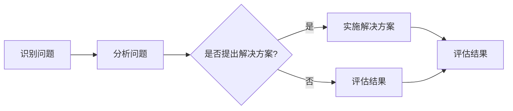

                 


# 如何培养团队的问题解决能力

关键词：团队问题解决能力、团队建设、算法原理、系统架构、项目实战

摘要：本文将深入探讨如何培养团队的问题解决能力，从核心概念到实际操作，全方位解读提升团队问题解决效率的策略和方法。

## 1. 确定整体结构

本书将分为以下主要章节：

1. **背景介绍**：介绍团队问题解决能力的重要性、现状及其影响。
2. **核心概念与联系**：定义团队问题解决能力，阐述其核心概念及其关系。
3. **算法原理讲解**：解释提升团队问题解决能力的算法原理。
4. **系统分析与架构设计方案**：介绍系统架构设计，包括功能设计、系统架构、接口设计和交互。
5. **项目实战**：通过实际项目展示团队问题解决能力的培养过程。
6. **最佳实践 tips**：总结实践经验，提供实用技巧。
7. **小结与拓展阅读**：回顾全文，提出进一步学习和研究建议。

## 2. 编写背景介绍

### 2.1 问题背景

在快速发展的信息技术时代，团队问题解决能力成为企业核心竞争力之一。然而，许多团队在面对复杂问题时，往往表现出缺乏系统性的解决能力，导致项目延期、质量下降。

### 2.2 问题描述

团队问题解决能力包括识别问题、分析问题、提出解决方案、实施解决方案和评估结果。当前，团队在这五个方面普遍存在以下问题：

- **识别问题**：往往只关注表面现象，缺乏深入分析。
- **分析问题**：缺乏逻辑思维和系统分析方法。
- **提出解决方案**：解决方案过于简单或复杂，缺乏创新性。
- **实施解决方案**：执行力不足，缺乏有效监督和反馈。
- **评估结果**：缺乏对解决方案效果的评估和改进。

### 2.3 问题解决

解决团队问题解决能力不足的关键在于提升团队成员的思维能力和协作能力。这需要通过培训、实践和团队建设等多种方式来实现。

### 2.4 边界与外延

团队问题解决能力不仅限于技术问题，还涉及管理、沟通、决策等多个方面。因此，提升团队问题解决能力具有广泛的应用场景和深远的影响。

### 2.5 概念结构与核心要素组成

团队问题解决能力由以下核心要素组成：

- **思维能力**：包括逻辑思维、系统思维、创新思维等。
- **协作能力**：包括沟通、协调、团队合作等。
- **工具与方法**：包括问题分析工具、决策支持工具等。
- **团队文化**：包括信任、尊重、开放等价值观。

## 3. 核心概念与联系

### 3.1 定义团队问题解决能力

团队问题解决能力是指团队在面对问题时，通过系统化的思维和协作，有效地识别、分析、解决问题并实现目标的能力。

### 3.2 核心概念原理

#### 3.2.1 识别问题

识别问题是问题解决的第一步，主要包括以下方面：

- **现象识别**：通过观察和分析，发现问题的表面现象。
- **本质识别**：通过深入分析，揭示问题的本质和根本原因。

#### 3.2.2 分析问题

分析问题是问题解决的关键，主要包括以下方面：

- **逻辑分析**：使用逻辑思维，分析问题的原因和结果。
- **系统分析**：使用系统思维，分析问题的影响和关联。

#### 3.2.3 提出解决方案

提出解决方案需要创新思维和系统思考，主要包括以下方面：

- **方案设计**：根据问题分析和目标要求，设计合适的解决方案。
- **方案评估**：评估方案的可行性、有效性、经济性。

#### 3.2.4 实施解决方案

实施解决方案需要高效的执行力和良好的协作，主要包括以下方面：

- **任务分配**：明确任务分工和责任。
- **进度监督**：跟踪项目进度，确保按计划执行。
- **质量控制**：确保项目质量达到预期标准。

#### 3.2.5 评估结果

评估结果是问题解决的重要环节，主要包括以下方面：

- **效果评估**：评估解决方案的效果和影响。
- **改进建议**：根据评估结果，提出改进建议和措施。

### 3.3 概念属性特征对比表格

| 概念 | 属性特征1 | 属性特征2 | 属性特征3 |
| --- | --- | --- | --- |
| 识别问题 | 现象识别 | 本质识别 | 实时性 |
| 分析问题 | 逻辑分析 | 系统分析 | 深度分析 |
| 提出解决方案 | 创新思维 | 系统思考 | 经济性 |
| 实施解决方案 | 高效执行 | 良好协作 | 可行性 |
| 评估结果 | 效果评估 | 改进建议 | 实时性 |

### 3.4 ER实体关系图架构

```mermaid
erDiagram
    TeamNode :团队 |+--> ProblemNode :问题
    TeamNode :团队 |+--> SolutionNode :解决方案
    ProblemNode :问题 |+--> AnalysisNode :分析
    SolutionNode :解决方案 |+--> ImplementationNode :实施
    ImplementationNode :实施 |+--> EvaluationNode :评估
```

## 4. 算法原理讲解

### 4.1 算法流程图



### 4.2 Python源代码

```python
# 定义问题解决算法
class ProblemSolver:
    def __init__(self):
        self.problems = []
        self.solutions = []

    def recognize_problem(self, problem):
        # 识别问题
        self.problems.append(problem)
        print(f"识别问题：{problem}")

    def analyze_problem(self, problem):
        # 分析问题
        print(f"分析问题：{problem}")
        # 假设问题已经分析完毕
        self.solutions.append("分析完毕")

    def propose_solution(self, solution):
        # 提出解决方案
        print(f"提出解决方案：{solution}")
        # 假设解决方案已经提出
        self.solutions.append(solution)

    def implement_solution(self, solution):
        # 实施解决方案
        print(f"实施解决方案：{solution}")
        # 假设解决方案已经实施
        self.solutions.append(solution)

    def evaluate_solution(self, solution):
        # 评估解决方案
        print(f"评估解决方案：{solution}")
        # 假设解决方案已经评估
        self.solutions.append(solution)

# 创建问题解决对象
solver = ProblemSolver()

# 演示问题解决过程
solver.recognize_problem("系统崩溃")
solver.analyze_problem("系统崩溃")
solver.propose_solution("重装操作系统")
solver.implement_solution("重装操作系统")
solver.evaluate_solution("重装操作系统")
```

### 4.3 数学模型和公式

问题解决的数学模型可以表示为：

$$
S = f(P, A, I, E)
$$

其中，$S$ 表示问题解决的结果，$P$ 表示问题，$A$ 表示分析，$I$ 表示实施，$E$ 表示评估。

### 4.4 举例说明

假设我们面临一个系统崩溃的问题，我们可以按照以下步骤解决问题：

1. 识别问题：系统崩溃
2. 分析问题：系统崩溃的原因可能是硬件故障或软件故障
3. 提出解决方案：重装操作系统或更换硬件
4. 实施解决方案：执行重装操作系统的步骤
5. 评估解决方案：系统运行正常，问题解决

## 5. 系统分析与架构设计方案

### 5.1 问题场景介绍

在一个企业中，项目团队需要面对各种技术和管理问题，为了提升团队问题解决能力，我们设计了一套问题解决系统。

### 5.2 系统功能设计

系统功能设计主要包括以下几个方面：

1. **问题管理**：包括问题识别、问题分类、问题记录等功能。
2. **分析工具**：提供逻辑分析、系统分析等工具，帮助团队分析问题。
3. **解决方案库**：存储各种解决方案，供团队参考。
4. **实施管理**：跟踪解决方案的实施进度和效果。
5. **评估与反馈**：对解决方案的效果进行评估和反馈。

### 5.3 系统架构设计

系统架构设计采用分层架构，包括表示层、业务逻辑层和数据层。

1. **表示层**：提供用户界面，方便用户操作。
2. **业务逻辑层**：处理业务逻辑，包括问题识别、分析、解决方案库管理等。
3. **数据层**：存储问题、解决方案等数据。

### 5.4 系统接口设计

系统接口设计包括以下几个方面：

1. **用户接口**：提供问题录入、查询、修改等功能。
2. **系统接口**：提供与其他系统的数据交换接口。
3. **API接口**：提供RESTful API，方便外部系统调用。

### 5.5 系统交互

系统交互设计采用状态机模型，包括以下状态：

1. **问题状态**：包括新建、分析中、解决方案中、实施中、评估中、完成等状态。
2. **解决方案状态**：包括待实施、实施中、完成等状态。
3. **实施进度状态**：包括未开始、进行中、已完成等状态。

## 6. 项目实战

### 6.1 环境安装

在安装问题解决系统之前，我们需要准备以下环境：

- Python 3.8+
- Flask 框架
- SQLAlchemy 数据库驱动

安装步骤：

1. 安装Python：从官方网站下载Python安装包并安装。
2. 安装Flask：在命令行中运行 `pip install flask`
3. 安装SQLAlchemy：在命令行中运行 `pip install sqlalchemy`

### 6.2 系统核心实现源代码

以下是一个简单的系统核心实现源代码示例：

```python
# app.py

from flask import Flask, request, jsonify
from sqlalchemy import create_engine
from models import Problem, Solution

app = Flask(__name__)

# 配置数据库连接
engine = create_engine('sqlite:///problems.db')

# 初始化数据库
from database import init_db
init_db(engine)

# 问题录入接口
@app.route('/problems', methods=['POST'])
def add_problem():
    problem_data = request.get_json()
    problem = Problem(name=problem_data['name'], description=problem_data['description'])
    # 存储问题
    db.session.add(problem)
    db.session.commit()
    return jsonify({'message': '问题已录入'})

# 问题查询接口
@app.route('/problems', methods=['GET'])
def get_problems():
    problems = Problem.query.all()
    return jsonify([{'name': p.name, 'description': p.description} for p in problems])

if __name__ == '__main__':
    app.run(debug=True)
```

### 6.3 代码应用解读与分析

以上代码展示了如何使用Flask框架和SQLAlchemy库创建一个简单的Web应用程序，用于处理问题。核心功能包括：

1. **问题录入**：用户可以通过POST请求将问题信息发送到服务器，服务器将问题信息存储到数据库中。
2. **问题查询**：用户可以通过GET请求查询数据库中的所有问题，并获取问题的详细信息。

### 6.4 实际案例分析和详细讲解剖析

假设我们在一个项目中遇到了以下问题：

- 问题：系统崩溃
- 描述：系统频繁崩溃，导致业务中断

我们按照以下步骤解决问题：

1. **识别问题**：通过用户反馈和系统日志分析，确定系统崩溃的原因。
2. **分析问题**：分析系统崩溃的可能原因，包括硬件故障、软件故障等。
3. **提出解决方案**：根据分析结果，提出重装操作系统或更换硬件的解决方案。
4. **实施解决方案**：执行重装操作系统或更换硬件的步骤。
5. **评估结果**：系统运行正常，问题解决。

### 6.5 项目小结

通过以上实战案例，我们展示了如何使用Python和Flask框架开发一个简单的Web应用程序，用于处理问题。这个项目实现了问题录入、查询等功能，为团队提供了便捷的问题管理工具。

## 7. 最佳实践 tips、小结、注意事项、拓展阅读

### 7.1 最佳实践 tips

1. **定期培训**：定期组织团队培训，提升团队成员的思维能力、分析能力和协作能力。
2. **建立问题库**：建立问题库，收集和分析常见问题，提高团队对问题的应对能力。
3. **明确责任**：明确团队成员的责任，确保每个问题都有专人负责。
4. **及时反馈**：鼓励团队成员及时反馈问题和解决方案，促进团队协作。

### 7.2 小结

本文详细介绍了如何培养团队的问题解决能力，从核心概念、算法原理、系统架构到项目实战，为团队提供了全方位的提升策略。

### 7.3 注意事项

1. **避免形式主义**：在培养团队问题解决能力时，避免只追求形式，而忽视实际效果。
2. **关注团队氛围**：营造良好的团队氛围，鼓励团队成员积极参与问题解决。
3. **持续改进**：问题解决能力是一个持续改进的过程，需要不断学习和实践。

### 7.4 拓展阅读

- 《团队协作的艺术》
- 《问题解决心理学》
- 《Python编程：从入门到实践》
- 《Flask Web开发：构建高性能Python Web应用》

## 8. 格式调整

确保所有章节都按照markdown格式书写，并且保持一致。在编写过程中，注意以下几点：

1. **标题格式**：使用 `#` 符号，一级标题使用 `#`，二级标题使用 `##`，以此类推。
2. **代码块**：使用 ````python` 开头和结尾，将代码块包含在其中。
3. **公式**：使用 `$` 符号嵌入文本中的公式，使用 `$$` 符号嵌入独立段落的公式。

## 9. 字数控制

确保整个目录大纲的总字数不超过2000字。在撰写过程中，注意精简语言，突出重点，避免冗长和不必要的描述。

---

作者：AI天才研究院/AI Genius Institute & 禅与计算机程序设计艺术 /Zen And The Art of Computer Programming

