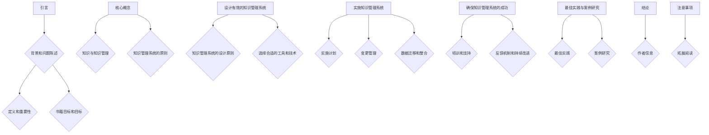

                 

# 如何建立有效的团队知识管理系统

## 关键词
- 团队知识管理系统
- 知识管理
- 知识共享
- 工具与技术
- 实施与维护
- 案例研究

## 摘要
本文旨在探讨如何构建一个有效的团队知识管理系统。我们将从背景介绍、核心概念解析、系统设计原则、工具选择、实施过程、成功保障和最佳实践等多个方面进行深入分析。通过本篇文章，读者将了解到团队知识管理系统的构建流程，以及如何在实际工作中应用这些知识，从而提高团队效率和创新能力。

## 引言
### 1.1 背景和问题陈述
在当今快速变化和竞争激烈的市场环境中，知识已成为企业和团队最重要的资产之一。然而，许多团队面临着知识流失、重复劳动和资源浪费等问题，这严重制约了团队的发展。团队知识管理系统的建立，旨在通过有效的知识捕获、组织、共享和应用，提升团队的知识管理水平，从而提高工作效率和创新能力。

### 1.2 定义和重要性
团队知识管理系统（Team Knowledge Management System，TKMS）是一种专门用于管理和维护团队知识的方法和工具。它的重要性体现在以下几个方面：

- **提高工作效率**：通过知识共享，团队成员可以快速获取所需信息，减少重复劳动。
- **增强创新能力**：知识的应用和积累有助于激发新的创意和解决方案。
- **降低知识流失风险**：知识管理系统可以记录和保存团队成员的经验和技能，防止知识流失。

### 1.3 书籍目标和目标
本书旨在提供一套完整的团队知识管理系统构建指南，帮助读者：

- **理解知识管理的基本概念**。
- **掌握构建知识管理系统的原则和方法**。
- **选择合适的工具和技术**。
- **实施和维持知识管理系统**。
- **通过案例研究和最佳实践，提升知识管理水平**。

## 核心概念
### 2.1 知识与知识管理
#### 2.1.1 知识的定义
知识是指通过经验、研究和学习获得的信息和认知。它包括事实、技能、观点和价值观等。

#### 2.1.2 知识的类型
- **显性知识**：易于编码和传播的知识，如文档、数据库等。
- **隐性知识**：难以编码和传播的知识，如个人经验、技能和直觉等。

#### 2.1.3 知识管理的流程
知识管理包括以下四个主要环节：

- **知识捕获**：识别和收集团队内部的知识资源。
- **知识组织**：对捕获的知识进行分类、索引和存储。
- **知识共享**：通过适当的渠道和方式，使团队成员能够获取和利用知识。
- **知识应用**：将知识应用于实际工作，以提高效率和创新能力。

### 2.2 知识管理系统的原则
有效的知识管理系统应遵循以下原则：

- **以用户为中心**：确保知识系统能够满足团队成员的需求。
- **完整性**：确保知识覆盖团队的所有关键领域。
- **易用性**：简化知识获取和使用的流程，提高用户体验。
- **动态性**：随着团队和技术的变化，知识管理系统应不断更新和完善。

## 设计有效的知识管理系统
### 3.1 知识管理系统的设计原则
#### 3.1.1 知识捕获
知识捕获是知识管理系统的核心。以下是一些关键步骤：

- **确定知识源**：识别团队内部的知识产生者和传递者。
- **使用适当的工具和方法**：如访谈、文档整理、案例研究等。
- **确保数据的质量和准确性**：对捕获的数据进行验证和清洗。

#### 3.1.2 知识组织
知识组织是确保知识能够被有效检索和使用的关键。以下是一些策略：

- **分类和标签**：对知识进行分类和标签，便于查找。
- **元数据管理**：为知识添加描述性元数据，提高搜索效率。
- **版本控制**：确保知识的版本和更新得到有效管理。

#### 3.1.3 知识共享
知识共享是知识管理的核心目标。以下是一些策略：

- **建立共享文化**：鼓励团队成员主动分享知识和经验。
- **使用合适的工具**：如文档共享平台、协作工具等。
- **建立奖励机制**：对积极参与知识共享的成员给予奖励。

#### 3.1.4 知识应用
知识应用是将知识转化为行动和成果的关键。以下是一些策略：

- **知识集成**：将知识管理系统与团队的工作流程和工具集成。
- **知识培训**：通过培训和研讨会，提高团队成员的知识应用能力。
- **知识创新**：鼓励团队成员将知识应用于新项目和挑战，以促进创新。

## 选择合适的工具和技术
### 4.1 可用的工具概述
在选择知识管理系统时，应考虑以下类型的工具：

- **文档管理工具**：如Confluence、SharePoint等，用于存储和管理文档。
- **协作工具**：如Slack、Microsoft Teams等，用于实时沟通和协作。
- **知识库工具**：如IBM Watson Knowledge Catalog、Knime等，用于创建和维护知识库。
- **内容管理系统**：如Joomla、Drupal等，用于构建和管理网站内容。

#### 4.1.2 评估工具选择标准
在选择工具时，应考虑以下标准：

- **功能需求**：工具是否满足团队的知识管理需求。
- **用户体验**：工具的易用性和用户接受度。
- **集成性**：工具是否与团队现有的系统和工具集成。
- **可扩展性和可维护性**：工具的长期可扩展性和维护成本。

## 实施知识管理系统
### 5.1 实施计划
#### 5.1.1 项目管理
实施知识管理系统是一项复杂的任务，需要明确项目目标和计划。以下是一些关键步骤：

- **定义项目目标**：明确知识管理系统的目标和预期成果。
- **制定项目计划**：包括任务分配、时间表和资源需求。
- **风险管理**：识别潜在风险并制定应对策略。

#### 5.1.2 变更管理
知识管理系统的实施涉及组织文化和工作流程的变革。以下是一些策略：

- **沟通与培训**：向团队成员传达变革的必要性和好处。
- **建立支持系统**：为团队成员提供技术支持和心理支持。
- **持续改进**：鼓励团队成员提供反馈，并不断优化系统。

#### 5.1.3 数据迁移和整合
数据迁移和整合是知识管理系统实施的关键步骤。以下是一些策略：

- **数据评估**：评估现有数据的完整性和准确性。
- **数据清洗**：清除冗余和错误数据。
- **数据迁移**：将数据从现有系统迁移到新系统。
- **数据整合**：确保新系统能够与现有系统和工具无缝集成。

## 确保知识管理系统的成功
### 6.1 培训和支持
#### 6.1.1 培训计划
为了确保团队成员能够有效使用知识管理系统，应制定详细的培训计划。以下是一些关键内容：

- **基础知识培训**：介绍知识管理系统的基本概念和功能。
- **技能培训**：提供具体操作技巧和最佳实践。
- **案例研究**：通过实际案例，展示知识管理系统的应用场景。

#### 6.1.2 持续支持
知识管理系统的成功不仅依赖于初始培训，还需要持续的支持。以下是一些策略：

- **用户支持**：提供在线帮助和FAQ，解答用户的问题。
- **定期反馈**：收集用户反馈，并用于系统改进。
- **专家咨询**：为用户提供专业咨询和指导。

#### 6.1.3 反馈机制和持续改进
建立有效的反馈机制，可以帮助团队不断优化知识管理系统。以下是一些策略：

- **定期评估**：评估知识管理系统的工作效果和用户满意度。
- **改进计划**：根据评估结果，制定改进计划。
- **持续迭代**：不断更新和优化系统，以适应团队的发展需求。

## 最佳实践与案例研究
### 7.1 最佳实践
#### 7.1.1 鼓励知识分享
为了提高团队的知识共享水平，应采取以下措施：

- **建立知识共享文化**：鼓励团队成员主动分享知识和经验。
- **设立知识奖励机制**：对积极参与知识共享的成员给予奖励。
- **组织知识交流活动**：定期组织知识分享会、研讨会等。

#### 7.1.2 创建知识为中心的文化
知识为中心的文化有助于提高团队的知识管理水平。以下是一些策略：

- **明确知识的重要性**：向团队成员传达知识对团队成功的重要性。
- **培训知识管理技能**：提供知识管理相关的培训，提高团队成员的知识管理能力。
- **建立知识共享平台**：为团队成员提供方便的知识共享平台。

#### 7.1.3 测量知识管理的影响
为了评估知识管理系统的效果，应采取以下措施：

- **建立关键绩效指标（KPI）**：如知识共享率、工作效率、创新成果等。
- **定期报告和评估**：根据KPI的数据，定期报告和评估知识管理系统的工作效果。
- **持续改进**：根据评估结果，不断优化知识管理系统。

### 8.2 案例研究
#### 8.2.1 案例一：软件公司的知识管理实践
某软件公司在实施知识管理系统后，通过鼓励知识分享和创建知识为中心的文化，成功提高了团队的工作效率和创新能力。具体表现为：

- **工作效率提高**：通过知识共享，团队成员能够快速获取所需信息，减少重复劳动。
- **创新能力增强**：知识的应用和积累激发了新的创意和解决方案。

#### 8.2.2 案例二：医疗机构的知识管理实践
某医疗机构通过建立知识管理系统，有效地记录和保存了医护人员的工作经验和知识。具体表现为：

- **知识积累**：知识管理系统的建立，使医疗机构的经验得以积累和传承。
- **医疗服务质量提升**：通过知识的应用，医疗机构的医疗服务质量得到了显著提升。

## 结论
构建有效的团队知识管理系统，是提高团队工作效率和创新能力的关键。通过本文的探讨，读者应了解到知识管理系统的核心概念、设计原则、实施方法和成功保障。在实际工作中，应结合团队的具体情况，选择合适的工具和技术，持续优化知识管理系统，以实现团队的知识管理和创新目标。

## 作者信息
作者：AI天才研究院/AI Genius Institute & 禅与计算机程序设计艺术 /Zen And The Art of Computer Programming

## 注意事项
- **背景介绍**：在构建团队知识管理系统时，需要了解团队的知识需求、组织结构和业务模式，以便设计出满足团队需求的知识管理系统。
- **核心概念与联系**：知识管理和知识管理系统是本文的核心概念。理解这两个概念及其相互关系，有助于构建有效的知识管理系统。
- **算法原理讲解**：本文没有涉及具体的算法原理，但知识管理系统的设计和实现中可能会涉及各种算法，如搜索算法、分类算法等。
- **系统分析与架构设计方案**：本文没有详细讨论具体的系统架构设计，但在实际项目中，系统分析与架构设计是不可或缺的环节。
- **项目实战**：本文没有提供具体的实战案例，但实际项目中的知识管理系统构建需要经历需求分析、系统设计、开发实施等阶段。
- **最佳实践 tips**：本文总结了一些最佳实践，如鼓励知识分享、创建知识为中心的文化等，但具体实践应根据团队实际情况进行调整。

## 拓展阅读
- **《知识管理实践指南》**：提供了详细的关于知识管理的实践方法和案例。
- **《企业知识管理》**：从企业的角度，探讨了知识管理的重要性、策略和实践。
- **《团队知识管理》**：针对团队层面的知识管理，提供了具体的策略和工具。

## 文章结构图

## 文章整体内容与逻辑
本文旨在为读者提供构建团队知识管理系统的全面指南。文章从引言开始，介绍了知识管理的背景、重要性以及书籍的目标和预期成果。接着，本文详细解析了知识管理系统的核心概念和设计原则，包括知识捕获、知识组织、知识共享和知识应用等方面。随后，文章讨论了如何选择合适的工具和技术，以及如何实施和维持知识管理系统。为了确保知识管理系统的成功，本文提出了培训和支持、反馈机制和持续改进等策略。最后，文章通过总结最佳实践和案例研究，为读者提供了实际操作的参考。整篇文章逻辑清晰，内容丰富，旨在帮助读者全面了解和构建有效的团队知识管理系统。通过逐步分析推理，读者可以更好地理解知识管理系统的重要性，以及如何在实际工作中应用这些知识，从而提高团队效率和创新能力。

