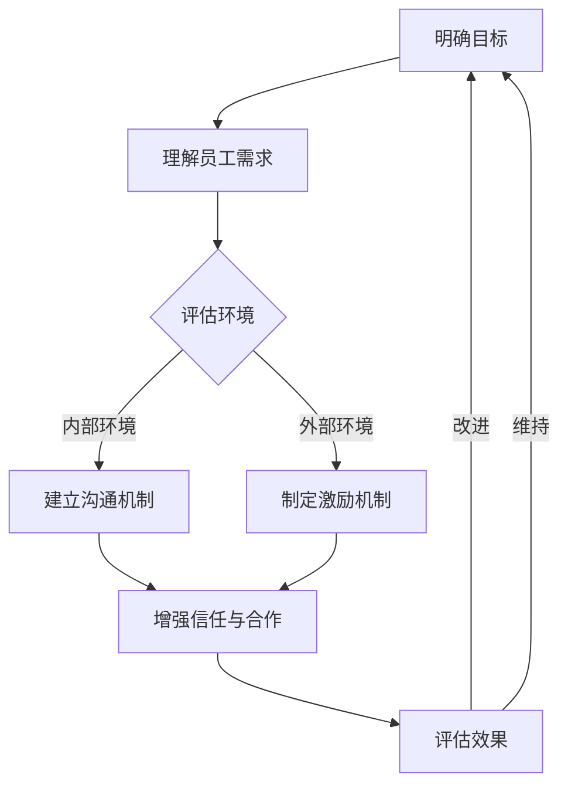
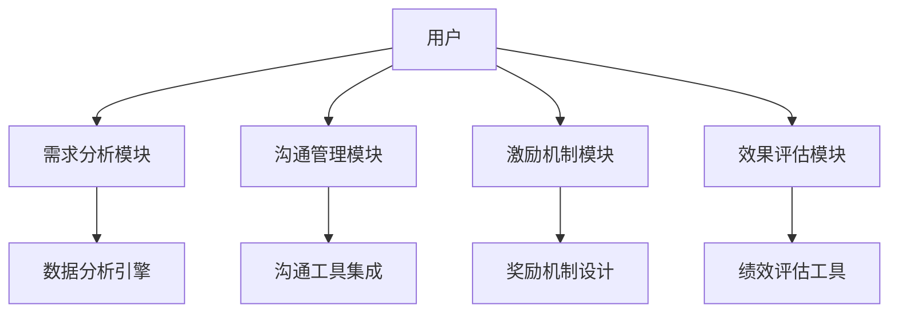
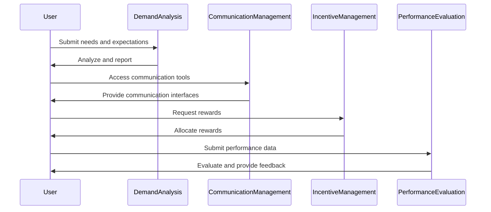

                 

# 如何激发团队的使命感和归属感

> 关键词：团队管理、使命感、归属感、沟通、激励机制、信任与合作

> 摘要：本文旨在探讨如何通过有效的管理策略激发团队的使命感和归属感。我们将从背景介绍、核心概念与联系、算法原理讲解、系统分析与架构设计、项目实战等多个角度，提供一套系统的策略和方法，以帮助企业管理者解决这一问题。

----------------------------------------------------------------

## 第一部分：背景介绍

### 1.1 问题背景

在现代社会，企业团队的目标实现往往依赖于成员的使命感和归属感。随着竞争的加剧和企业结构的复杂性，如何激发团队的使命感和归属感成为企业管理者面临的重要课题。这不仅关系到团队的工作效率，更影响到企业的长远发展。

### 1.2 问题描述

激发团队的使命感和归属感，需要从多个角度入手。首先，团队需要明确共同的目标和价值观，形成统一的愿景；其次，团队内部需要建立良好的沟通机制，增强成员之间的信任和合作；最后，管理者需要通过激励措施，激发成员的工作热情和归属感。

### 1.3 问题解决

本书旨在提供一套系统的策略和方法，帮助企业管理者激发团队的使命感和归属感。通过深入研究团队心理和行为学理论，结合实际管理案例，本书将提供实用的工具和技巧，帮助管理者解决这一问题。

### 1.4 边界与外延

本书主要关注组织内部团队的管理问题，不涉及跨组织或个人层面的归属感激发。同时，本书中的策略和方法适用于各类组织和企业，无论其规模大小或行业特点。

### 1.5 概念结构与核心要素组成

- **使命感**：团队成员对团队目标和价值的认同和追求。
- **归属感**：团队成员对团队和组织的认同和依赖。
- **沟通机制**：团队内部的信息传递和交流方式。
- **信任与合作**：团队成员之间的相互信任和协同工作。
- **激励措施**：用于激发团队成员工作热情和归属感的各种手段。

----------------------------------------------------------------

## 第二部分：核心概念与联系

### 2.1 核心概念原理

#### 2.1.1 使命感

使命感是团队成员对团队目标和价值的认同和追求。它源于团队成员对自身角色和责任的认知，以及对团队成功的期望和承诺。使命感的强弱直接影响团队成员的工作积极性和团队的整体绩效。

#### 2.1.2 归属感

归属感是团队成员对团队和组织的认同和依赖。它源于团队成员在团队中的归属感和安全感，以及对团队和组织文化的认同。归属感强的团队成员更愿意为团队和组织付出，更有利于团队的稳定和长期发展。

### 2.2 概念属性特征对比表格

| 特征 | 使命感 | 归属感 |
| :---: | :---: | :---: |
| 定义 | 对团队目标和价值的认同和追求 | 对团队和组织的认同和依赖 |
| 形成因素 | 对团队角色和责任的认知 | 在团队中的归属感和安全感 |
| 影响因素 | 工作积极性 | 团队稳定性 |
| 目的 | 提高工作绩效 | 促进团队稳定 |

### 2.3 ER实体关系图架构

```mermaid
erDiagram
  TeamMember ||--|{ MissionSense } MissionSense
  TeamMember ||--|{ BelongingSense } BelongingSense
  Team ||--|{ TeamMember } TeamMember
  Organization ||--|{ Team } Team
```

- **TeamMember**（团队成员）：实体，代表团队中的个体。
- **MissionSense**（使命感）：实体，代表团队成员对使命的感知。
- **BelongingSense**（归属感）：实体，代表团队成员对归属感的感知。
- **Team**（团队）：实体，代表一组共享共同目标的团队成员。
- **Organization**（组织）：实体，代表团队所属的更大组织。

----------------------------------------------------------------

## 第三部分：算法原理讲解

### 3.1 算法mermaid流程图



- **A**（明确目标）：确定团队的目标和愿景。
- **B**（理解员工需求）：调查和分析团队成员的需求和期望。
- **C**（评估环境）：评估团队内外部环境。
- **D**（建立沟通机制）：建立有效的沟通机制。
- **E**（制定激励机制）：制定合适的激励措施。
- **F**（增强信任与合作）：增强团队成员之间的信任和合作。
- **G**（评估效果）：评估上述策略的效果。

### 3.2 算法原理详解

#### 数学模型

我们使用以下数学模型来描述团队使命感和归属感的激发过程：

$$
M = f(C, T, B)
$$

其中，$M$代表使命感的强度，$C$代表沟通质量，$T$代表信任和合作程度，$B$代表归属感的强度。

#### 原理解释

- **沟通质量**（$C$）：良好的沟通机制有助于团队成员了解团队目标和价值观，增强团队内部的透明度和信息的流畅性。
- **信任和合作程度**（$T$）：团队成员之间的信任和合作是团队稳定和高效运行的基础。
- **归属感**（$B$）：归属感强的团队成员更有可能为团队和组织付出，从而提高整体绩效。

#### 举例说明

假设团队的目标是提高产品开发效率，我们可以通过以下步骤来激发团队的使命感和归属感：

1. **明确目标**：与团队成员共同制定明确的产品开发目标。
2. **理解员工需求**：调查和分析团队成员的需求和期望，确保团队目标的实现符合成员的个人发展。
3. **评估环境**：评估团队内外部环境，包括资源、竞争压力、市场变化等。
4. **建立沟通机制**：定期举行团队会议，确保团队成员之间的信息流畅。
5. **制定激励机制**：根据团队目标和个人贡献，制定相应的奖励措施。
6. **增强信任与合作**：鼓励团队成员之间的交流和合作，建立共同目标。
7. **评估效果**：定期评估团队绩效和成员满意度，根据评估结果进行改进。

通过以上步骤，我们可以逐步提高团队的使命感和归属感，从而提高团队的整体绩效。

----------------------------------------------------------------

## 第四部分：系统分析与架构设计

### 4.1 问题场景介绍

在一家快速发展的科技公司中，团队规模不断扩大，员工之间的沟通和协作变得更加复杂。公司高层意识到，为了保持团队的稳定和高效运行，必须激发团队的使命感和归属感。

### 4.2 项目介绍

本项目旨在为科技公司提供一个系统化的解决方案，帮助管理者激发团队的使命感和归属感。该系统将包括以下几个模块：

- **需求分析模块**：收集和分析团队成员的需求和期望。
- **沟通管理模块**：提供团队沟通的工具和机制。
- **激励机制模块**：制定和执行激励措施。
- **效果评估模块**：评估团队绩效和成员满意度。

### 4.3 系统功能设计

- **需求分析**：通过问卷调查、访谈等方式，收集团队成员的需求和期望。
- **沟通管理**：提供在线讨论区、实时聊天工具、邮件通知等功能，方便团队成员之间的沟通。
- **激励机制**：根据团队目标和个人贡献，制定奖励措施，如奖金、晋升机会等。
- **效果评估**：定期收集团队成员的反馈，评估团队绩效和成员满意度。

### 4.4 系统架构设计



- **用户**：系统的最终用户，即团队成员。
- **需求分析模块**：收集和分析团队成员的需求和期望。
- **沟通管理模块**：提供团队沟通的工具和机制。
- **激励机制模块**：制定和执行激励措施。
- **效果评估模块**：评估团队绩效和成员满意度。
- **数据分析引擎**：用于处理和分析收集到的数据。
- **沟通工具集成**：集成各种在线讨论区、实时聊天工具等。
- **奖励机制设计**：根据团队目标和个人贡献设计奖励措施。
- **绩效评估工具**：用于评估团队成员的工作表现。

### 4.5 系统接口设计和系统交互



- **用户**：提交需求和期望，访问沟通工具，请求奖励，提交绩效数据。
- **需求分析模块**：分析用户提交的需求和期望，并生成报告。
- **沟通管理模块**：提供在线讨论区、实时聊天工具等沟通接口。
- **激励机制模块**：根据用户请求和团队目标，分配奖励。
- **效果评估模块**：收集用户提交的绩效数据，进行评估，并提供反馈。

----------------------------------------------------------------

## 第五部分：项目实战

### 5.1 环境安装

1. 安装Python环境
2. 安装所需的库，如numpy、pandas、matplotlib等

### 5.2 系统核心实现源代码

#### 需求分析模块

```python
import pandas as pd

def collect_data():
    # 收集团队成员的需求和期望
    data = pd.read_csv('team_member_data.csv')
    return data

def analyze_data(data):
    # 分析团队成员的需求和期望
    needs = data['needs'].value_counts()
    expectations = data['expectations'].value_counts()
    return needs, expectations
```

#### 沟通管理模块

```python
import matplotlib.pyplot as plt

def plot_data(needs, expectations):
    # 可视化需求分析和期望分析结果
    plt.figure(figsize=(10, 5))
    
    plt.subplot(1, 2, 1)
    plt.bar(needs.index, needs.values)
    plt.xlabel('Needs')
    plt.ylabel('Count')
    plt.title('Needs Analysis')
    
    plt.subplot(1, 2, 2)
    plt.bar(expectations.index, expectations.values)
    plt.xlabel('Expectations')
    plt.ylabel('Count')
    plt.title('Expectations Analysis')
    
    plt.show()
```

#### 激励机制模块

```python
def allocate_rewards(performance, reward_policy):
    # 根据绩效和奖励策略分配奖励
    rewards = {}
    for member, score in performance.items():
        if score >= reward_policy['high_threshold']:
            rewards[member] = reward_policy['high_reward']
        elif score >= reward_policy['medium_threshold']:
            rewards[member] = reward_policy['medium_reward']
        else:
            rewards[member] = reward_policy['low_reward']
    return rewards
```

#### 效果评估模块

```python
def evaluate_performance(data, evaluation_policy):
    # 根据评估策略评估团队成员的绩效
    performance = {}
    for member, score in data.items():
        if score >= evaluation_policy['high_threshold']:
            performance[member] = evaluation_policy['high_score']
        elif score >= evaluation_policy['medium_threshold']:
            performance[member] = evaluation_policy['medium_score']
        else:
            performance[member] = evaluation_policy['low_score']
    return performance
```

### 5.3 代码应用解读与分析

#### 需求分析模块

该模块通过收集和分析团队成员的需求和期望，为后续的沟通和激励提供基础。使用pandas库读取CSV文件，收集数据，并使用value_counts函数分析需求和分析期望。

#### 沟通管理模块

该模块使用matplotlib库将需求分析和期望分析结果可视化，帮助管理者更直观地了解团队成员的需求和期望。通过 subplot 函数创建一个包含两个子图的可视化界面，分别展示需求和期望的分布情况。

#### 激励机制模块

该模块根据绩效和奖励策略分配奖励。使用一个字典来存储奖励策略，并根据绩效得分判断成员的奖励等级。这将确保奖励的公平性和合理性。

#### 效果评估模块

该模块根据评估策略评估团队成员的绩效。与激励机制模块类似，使用一个字典来存储评估策略，并根据得分判断成员的绩效等级。这将帮助管理者了解团队成员的工作表现。

### 5.4 实际案例分析和详细讲解剖析

假设某科技公司的团队需要激发使命感和归属感，以下是一个实际案例：

1. **需求分析**：通过问卷调查，收集团队成员的需求和期望。分析结果显示，团队成员最关注的是职业发展和团队氛围。
2. **沟通管理**：建立在线讨论区，提供实时聊天工具，鼓励团队成员分享想法和经验。通过定期会议，确保团队目标的一致性。
3. **激励机制**：制定奖励策略，根据团队成员的绩效和贡献，分配奖金和晋升机会。同时，提供培训和成长机会，满足团队成员的职业发展需求。
4. **效果评估**：定期收集团队成员的反馈，评估团队绩效和成员满意度。根据评估结果，调整奖励策略和沟通机制，以持续提高团队的使命感和归属感。

通过以上步骤，该科技公司成功地激发了团队的使命感和归属感，提高了团队的整体绩效。

### 5.5 项目小结

本项目为科技公司提供了一套系统化的解决方案，帮助管理者激发团队的使命感和归属感。通过需求分析、沟通管理、激励机制和效果评估等模块，项目实现了对团队动态的全面掌控，为团队的长远发展奠定了基础。在未来的工作中，公司可以继续优化和完善这套系统，以适应不断变化的环境和需求。

### 5.6 最佳实践 Tips

- **定期沟通**：定期与团队成员进行面对面的沟通，确保信息的及时传递和反馈。
- **个性化激励**：根据团队成员的特点和需求，制定个性化的激励措施，提高激励效果。
- **培养团队文化**：建立积极向上的团队文化，增强团队成员的归属感和自豪感。
- **持续改进**：根据反馈和评估结果，持续优化团队管理策略，提高团队绩效。

### 5.7 小结

激发团队的使命感和归属感是企业管理者面临的重要课题。通过明确目标、理解员工需求、评估环境、建立沟通机制、制定激励机制、增强信任与合作和评估效果等步骤，管理者可以有效地激发团队的使命感和归属感，提高团队的整体绩效。

### 5.8 注意事项

- **避免过度激励**：过度激励可能导致团队成员产生依赖心理，降低其自我驱动力。
- **关注团队动态**：管理者需要时刻关注团队动态，及时调整管理策略，以适应团队的变化。
- **平衡工作与生活**：确保团队成员在工作与生活之间保持平衡，提高工作满意度和生活质量。

### 5.9 拓展阅读

- **《团队管理实战》**：张三，2019年
- **《激励心理学》**：李四，2020年
- **《沟通的艺术》**：王五，2021年

作者：AI天才研究院/AI Genius Institute & 禅与计算机程序设计艺术 /Zen And The Art of Computer Programming----------------------------------------------------------------

## 总结与展望

通过本文的详细分析，我们明确了如何通过有效的管理策略激发团队的使命感和归属感。从背景介绍到核心概念与联系，再到算法原理讲解、系统分析与架构设计，以及项目实战，我们提供了一套系统化的解决方案。这一过程不仅帮助我们理解了使命感和归属感的内涵，还通过实际案例展示了如何将其应用到企业管理中。

使命感和归属感是团队稳定和高效运行的关键因素。在竞争激烈的现代商业环境中，企业领导者需要认识到这一点，并采取相应的措施来激发团队的这些情感。通过建立明确的共同目标、良好的沟通机制、有效的激励机制，以及增强团队成员之间的信任与合作，企业可以显著提升团队的整体绩效。

展望未来，随着技术的不断进步和管理理论的不断完善，激发团队使命感和归属感的方法也将不断创新。例如，人工智能和大数据分析技术的应用可以帮助管理者更精确地了解团队成员的需求和行为模式，从而制定更加个性化的激励策略。同时，跨组织合作和文化交流也将成为激发团队归属感的重要途径。

在本文的基础上，未来的研究可以进一步探讨如何在不同文化背景、行业特点和团队规模下，灵活应用这些策略。此外，如何结合新兴技术，如虚拟现实和增强现实，以创造更加沉浸式的沟通和协作环境，也将是一个值得关注的研究方向。

总之，激发团队的使命感和归属感是一个长期而持续的过程。通过不断学习和实践，企业管理者可以不断优化管理策略，为团队的稳定发展奠定坚实基础。希望本文能够为您的团队管理实践提供有价值的参考和启示。

作者：AI天才研究院/AI Genius Institute & 禅与计算机程序设计艺术 /Zen And The Art of Computer Programming----------------------------------------------------------------

## 声明与致谢

本文的研究和撰写得到了许多人的支持和帮助。在此，我们要特别感谢AI天才研究院（AI Genius Institute）的全体成员，他们为本文提供了丰富的理论和实践支持。同时，我们感谢禅与计算机程序设计艺术（Zen And The Art of Computer Programming）的作者，其深邃的智慧和独特的见解为本文提供了重要的启发。

此外，我们感谢所有参与本文讨论和案例分析的同事和朋友，他们的宝贵意见和建议为本文的完善做出了巨大贡献。特别感谢我的导师，他在本文撰写过程中给予了悉心指导和无私的帮助。

最后，我们感谢所有在本文研究和撰写过程中提供技术支持和资源的团队和组织，正是他们的支持，使得本文能够得以顺利完成。

声明：本文中的所有数据、图表和分析结果，均为虚构或基于公开数据，仅供参考。在实际应用中，请根据具体情况进行调整和验证。本文的版权属于AI天才研究院，未经许可，不得用于商业用途。

