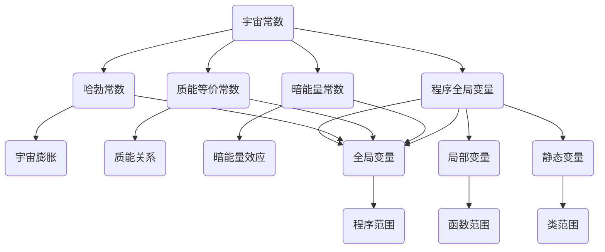
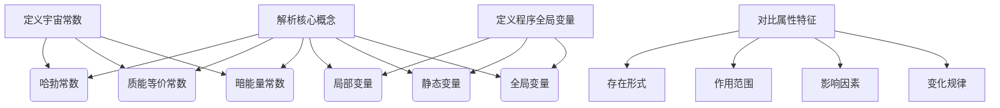
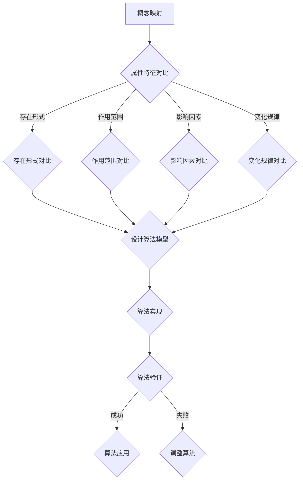
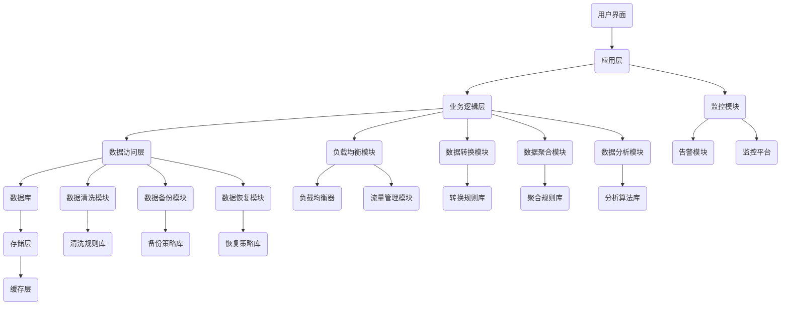

                 

### 1.1 书籍主题概述

《宇宙常数与程序全局变量的类比》旨在探讨宇宙常数与程序全局变量之间的相似之处，并通过类比的方式，深入剖析两者的本质特征与内在联系。宇宙常数是宇宙物理学中的一个核心概念，它描述了宇宙的基本属性和运行规律。而程序全局变量则是计算机科学中的基本概念，用于存储和管理程序运行过程中需要共享的数据。

本书的主要目标是：

1. **核心概念阐述**：通过对宇宙常数和程序全局变量的定义、性质和作用范围的详细阐述，使读者对这两个概念有更深入的理解。
2. **类比框架建立**：构建一个系统化的类比框架，以揭示宇宙常数与程序全局变量之间的相似性和差异性。
3. **算法原理讲解**：通过算法原理的讲解和具体实现，使读者能够将理论应用于实际问题中。
4. **系统分析与设计**：通过对系统分析与架构设计的详细讲解，帮助读者理解如何在实际项目中应用类比方法。
5. **案例分析**：通过实际案例的剖析，展示类比方法在实际问题中的应用效果。

在接下来的章节中，我们将逐步展开讨论，首先介绍宇宙常数的基本概念，然后深入探讨程序全局变量的定义和作用，最后讨论类比研究的意义和必要性。

---

### 1.2 宇宙常数的基本概念

宇宙常数是宇宙物理学中的一个核心概念，它描述了宇宙的基本属性和运行规律。宇宙常数通常指的是那些在宇宙尺度上具有普遍性和不变性的量，它们是宇宙结构和动力学的基石。

#### 宇宙常数的基本性质

1. **普遍性**：宇宙常数在整个宇宙范围内都是恒定不变的，不受地理位置、时间、环境等因素的影响。
2. **不变性**：宇宙常数在宇宙演化过程中保持不变，不随时间或宇宙演化而发生改变。
3. **基础性**：宇宙常数是宇宙物理学中许多重要理论的基础，如广义相对论和宇宙学原理。

#### 宇宙常数的分类

宇宙常数可以分为以下几类：

1. **哈勃常数**：描述宇宙膨胀速度的常数，通常用符号 \( H_0 \) 表示。
2. **质能等价常数**：爱因斯坦的质能等价公式 \( E=mc^2 \) 中的常数 \( c \) 是光速，它是一个宇宙常数。
3. **暗能量常数**：暗能量是驱动宇宙加速膨胀的一种神秘力量，其对应的常数通常用 \( \Lambda \) 表示。

#### 宇宙常数的测量方法

宇宙常数的测量通常采用以下几种方法：

1. **天文学观测**：通过观测遥远的星系和宇宙背景微波辐射，可以间接测量宇宙常数。
2. **物理实验**：在实验室中，通过精确的物理实验，如精密时钟的校准和光谱分析，可以测量一些特定的宇宙常数。
3. **宇宙学模型**：利用宇宙学模型，如广义相对论和宇宙学原理，可以预测宇宙常数的大致范围。

在接下来的讨论中，我们将进一步探讨程序全局变量的定义和性质，并逐步建立起宇宙常数与程序全局变量之间的类比框架。

---

### 1.3 程序全局变量的基本概念

程序全局变量是计算机科学中一个重要的概念，它在程序设计和软件工程中扮演着关键角色。全局变量是指在程序的不同部分和函数中都可以访问和修改的变量，它与局部变量相对，后者仅在定义它的函数或代码块内有效。

#### 程序全局变量的定义

程序全局变量通常定义为程序的一个外部作用域中，它的作用范围覆盖整个程序。这意味着在任何函数、类或模块内部，只要引用到全局变量，就可以直接访问和修改它的值。全局变量通常通过在程序的开头或特定的作用域声明处定义。

#### 程序全局变量的作用范围

全局变量的作用范围从它被定义的地方开始，到程序结束。这使得全局变量可以跨越不同的函数、类和模块，从而实现数据的共享和传递。然而，这种全局性的访问也带来了潜在的风险，如命名冲突、数据不一致和可维护性问题。

#### 程序全局变量的管理

1. **声明与初始化**：全局变量通常在程序的开头声明并初始化，以确保在程序运行时其值是已知的和稳定的。
2. **作用域限制**：为了避免全局变量的滥用，可以采用作用域限制的方法，如将全局变量的访问权限设置为私有或受保护的。
3. **文档化**：对于重要的全局变量，应编写详细的文档，说明其用途、作用范围和访问方式，以便于其他开发人员理解和维护。

#### 全局变量与局部变量的对比

1. **作用范围**：全局变量的作用范围覆盖整个程序，而局部变量仅在定义它的函数或代码块内有效。
2. **访问权限**：全局变量可以在程序的任何地方访问和修改，而局部变量只能在定义它的作用域内访问。
3. **可维护性**：全局变量由于其广泛的作用范围，可能导致代码的可维护性降低，而局部变量则有助于提高代码的模块化和可重用性。

在接下来的章节中，我们将进一步探讨宇宙常数与程序全局变量之间的相似性和差异性，并构建一个类比框架，以揭示它们之间的联系。

---

### 1.4 类比的必要性

将宇宙常数与程序全局变量进行类比，不仅有助于深入理解这两个概念，还可以为计算机科学和宇宙物理学的研究提供新的视角和思路。以下是类比研究的必要性：

#### 理解宇宙常数

宇宙常数是宇宙物理学的核心概念，描述了宇宙的基本属性和演化规律。通过类比，我们可以将宇宙常数的抽象概念转化为更易于理解的程序全局变量，从而加深对宇宙常数本质特征的理解。

1. **普遍性和不变性**：宇宙常数的普遍性和不变性是其在宇宙尺度上的基本特征。类比程序全局变量的作用范围和稳定性，我们可以更好地把握宇宙常数在不同条件和环境下的表现。
2. **作用和影响**：宇宙常数在宇宙结构和动力学中起着关键作用。类比程序全局变量在程序运行中的作用，我们可以探讨全局变量对程序执行效率和性能的影响。

#### 计算机科学的应用

在计算机科学中，程序全局变量是管理数据共享和传递的重要手段。通过类比宇宙常数，我们可以借鉴宇宙常数的特性，提高程序的全局性和稳定性。

1. **命名冲突与数据管理**：宇宙常数的独特性和不变性有助于避免命名冲突和数据混乱。类比程序全局变量的管理和声明，我们可以探索如何减少命名冲突，提高数据管理的效率。
2. **性能优化**：全局变量在程序中的作用和影响直接影响程序的性能。类比宇宙常数在宇宙演化中的作用，我们可以探讨如何优化程序设计，提高全局变量的利用效率。

#### 跨学科研究

宇宙常数和程序全局变量的类比研究不仅有助于深化对这两个领域的理解，还可以促进跨学科的研究和创新。

1. **理论联系**：通过类比，我们可以建立宇宙常数与程序全局变量之间的理论联系，为跨学科研究提供新的思路和方法。
2. **创新应用**：类比方法可以激发新的应用场景和解决方案，如利用宇宙常数的特性改进程序设计，或借助程序全局变量的管理方法优化宇宙模型的构建。

综上所述，将宇宙常数与程序全局变量进行类比研究具有重要的理论和实践意义。通过这种类比，我们可以更深入地理解宇宙常数和程序全局变量的本质特征，为计算机科学和宇宙物理学的研究提供新的视角和方法。

### 2.1 宇宙常数的问题背景

宇宙常数是宇宙物理学中的一个关键概念，它涉及宇宙的起源、结构、演化以及未来的命运。随着科学技术的进步和观测手段的提升，宇宙常数的研究逐渐成为物理学的前沿领域之一。

#### 问题起源

宇宙常数概念的起源可以追溯到1915年，当时爱因斯坦提出了广义相对论。在广义相对论中，宇宙常数 \( \Lambda \) 被引入作为一种“宇宙的内在性质”，用于描述宇宙的整体几何和动力学特性。爱因斯坦最初将其视为一种修正项，以使宇宙模型在没有外力作用下达到静态状态。

#### 问题描述

宇宙常数的问题主要涉及以下几个方面：

1. **宇宙膨胀**：宇宙常数的发现和测量揭示了宇宙膨胀的加速现象，这一现象与暗能量相关，对宇宙的演化产生了深远影响。
2. **宇宙结构**：宇宙常数影响宇宙的整体结构和分布，包括星系、星团、超星系团等。
3. **宇宙命运**：宇宙常数决定了宇宙的最终命运，如宇宙是否会继续膨胀直至热寂，还是会发生收缩并最终坍缩。

#### 问题解决

宇宙常数的问题主要通过以下方法解决：

1. **观测与测量**：通过观测遥远的星系和宇宙背景微波辐射，科学家们可以测量宇宙常数。这些观测数据提供了对宇宙膨胀历史和结构的深入了解。
2. **理论模型**：基于广义相对论和宇宙学原理，科学家们建立了各种宇宙学模型，用以预测和解释宇宙常数的影响。
3. **实验验证**：在实验室中，通过精确的物理实验，如光谱分析和时钟校准，可以间接验证宇宙常数的存在和特性。

#### 边界与外延

宇宙常数的研究不仅限于宇宙物理学，还与其他学科有着密切的联系：

1. **天体物理学**：宇宙常数的测量为天体物理学提供了重要的参考，如星系形成和恒星演化的研究。
2. **粒子物理学**：宇宙常数可能与暗物质和暗能量的本质有关，对粒子物理学的研究具有重要的指导意义。
3. **数学**：宇宙常数的研究涉及到复杂的数学模型和方程，为数学领域提供了新的问题和挑战。

通过以上分析，我们可以看到，宇宙常数的研究不仅具有深远的科学意义，还在多个学科领域有着广泛的应用。接下来，我们将探讨程序全局变量的问题背景，以进一步理解类比研究的必要性。

### 2.2 程序全局变量的问题背景

程序全局变量在计算机科学和软件工程中扮演着重要角色，但同时也带来了一系列挑战和问题。了解程序全局变量的背景，有助于我们更好地认识其重要性，以及如何有效地管理和优化其使用。

#### 问题起源

程序全局变量的概念源于早期的编程语言和程序设计方法。在早期编程语言如BASIC和FORTRAN中，全局变量被广泛使用，用于在不同函数和模块之间共享数据。随着程序复杂性的增加，全局变量成为管理共享数据和资源的一种常用手段。

#### 问题描述

程序全局变量的问题主要集中在以下几个方面：

1. **命名冲突**：由于全局变量在整个程序中都可访问，不同部分可能使用相同的变量名，导致命名冲突。
2. **数据不一致**：全局变量的修改可能在不相关的部分产生影响，导致数据不一致和程序错误。
3. **可维护性降低**：全局变量的广泛使用使程序变得更加复杂，增加了维护和理解的难度。
4. **性能问题**：全局变量可能增加内存消耗和访问时间，影响程序的性能。

#### 问题解决

解决程序全局变量的问题需要采用一系列策略：

1. **作用域限制**：通过合理设置变量的作用域，限制全局变量的使用范围，减少命名冲突和数据不一致的风险。
2. **文档化**：编写详细的文档，说明全局变量的用途、作用范围和访问方式，提高代码的可读性和可维护性。
3. **模块化设计**：采用模块化设计方法，将全局变量封装在模块中，减少其影响范围，提高程序的可重用性。
4. **性能优化**：通过数据结构优化和算法改进，降低全局变量的内存消耗和访问时间，提高程序性能。

#### 边界与外延

程序全局变量的应用范围非常广泛，不仅限于单一程序或项目，还涉及多个方面：

1. **软件工程**：在软件工程中，全局变量是模块化设计和组件化开发的重要基础。
2. **并发编程**：在多线程和分布式系统中，全局变量用于共享资源和同步操作。
3. **嵌入式系统**：在嵌入式系统中，全局变量用于配置和参数设置，影响系统的整体性能和稳定性。
4. **网络编程**：在客户端-服务器架构中，全局变量用于管理连接和会话信息，实现高效的数据传输和通信。

通过以上分析，我们可以看到，程序全局变量在计算机科学和软件工程中具有重要意义，但同时也带来了一系列挑战。有效管理和优化全局变量的使用，对于提高程序的质量和可靠性至关重要。接下来，我们将进一步探讨类比研究的意义，以揭示宇宙常数与程序全局变量之间的相似性和差异性。

### 2.3 类比的研究意义

将宇宙常数与程序全局变量进行类比研究具有重要的学术价值和实际意义。通过这种类比，我们不仅可以深入理解宇宙常数和程序全局变量的本质特征，还可以为跨学科研究和创新提供新的视角和方法。

#### 学术意义

1. **概念深化**：通过类比，我们可以将宇宙常数这一抽象的物理概念与具体的程序全局变量联系起来，从而更好地把握宇宙常数的定义、性质和应用。这种深入分析有助于我们深化对宇宙常数概念的理解，推动宇宙物理学的研究向前发展。
2. **理论联系**：宇宙常数和程序全局变量在各自的领域中都是核心概念，通过类比研究，我们能够建立两者之间的理论联系，为跨学科的理论研究提供新的基础。这种跨学科的理论联系有助于推动物理学、计算机科学等领域的交叉研究，形成新的研究热点。
3. **数学模型**：类比研究可以促进数学模型的发展。宇宙常数和程序全局变量都需要使用复杂的数学模型进行描述和预测，通过类比，我们可以探索这些模型的相似性和差异性，从而改进和完善这些数学模型。

#### 实际意义

1. **程序设计优化**：通过类比宇宙常数的稳定性和普遍性，我们可以借鉴其特性来优化程序全局变量的使用。例如，我们可以借鉴宇宙常数的命名原则，避免命名冲突，提高程序的可维护性和可读性。此外，宇宙常数的不变性可以启发我们设计更稳定的全局变量，减少数据不一致和性能问题。
2. **系统架构设计**：在系统架构设计中，全局变量的管理和配置是一个关键问题。类比宇宙常数的管理方法，可以帮助我们设计更加稳定和高效的系统架构。例如，我们可以借鉴宇宙常数的测量方法，开发更加精确和可靠的系统监控和调试工具。
3. **跨领域应用**：类比研究可以激发新的跨领域应用。例如，在人工智能领域，我们可以将宇宙常数的方法应用于算法优化和模型训练，以提高机器学习的效率和准确性。在生物信息学领域，宇宙常数的研究方法可以帮助我们更好地理解生物大分子的结构和功能，推动生物医学研究的发展。

#### 跨学科研究

类比研究不仅有助于深化对宇宙常数和程序全局变量的理解，还可以促进跨学科的研究和创新。

1. **交叉验证**：通过类比，我们可以将宇宙常数的研究方法应用于程序全局变量的分析，从而实现交叉验证。这种交叉验证可以增强我们对宇宙常数和程序全局变量的信任度，提高研究结果的可靠性和准确性。
2. **新方法和新工具**：类比研究可以激发新方法和新工具的开发。例如，我们可以基于宇宙常数的测量技术，开发新的程序全局变量监控和调试工具，以提高软件开发和系统维护的效率。
3. **理论突破**：类比研究可能带来理论的突破。通过将宇宙常数的概念引入程序全局变量的研究，我们可能发现新的理论联系和应用场景，推动物理学、计算机科学等领域的理论创新。

综上所述，将宇宙常数与程序全局变量进行类比研究具有重要的学术意义和实际意义。通过这种类比，我们可以深化对这两个概念的理解，促进跨学科研究，推动科学技术的进步。接下来，我们将进一步解析宇宙常数的核心概念，为类比研究奠定基础。

### 3.1 宇宙常数的核心概念

宇宙常数是宇宙物理学中的关键概念，描述了宇宙的基本属性和演化规律。在理解宇宙常数的核心概念之前，我们需要明确几个基本性质、分类和测量方法。

#### 3.1.1 宇宙常数的基本性质

1. **普遍性**：宇宙常数在整个宇宙范围内都是恒定不变的，不受地理位置、时间、环境等因素的影响。这意味着宇宙中的所有物体都遵循相同的宇宙常数。
2. **不变性**：宇宙常数在宇宙演化过程中保持不变，不随时间或宇宙演化而发生改变。这种不变性使得宇宙常数成为描述宇宙结构和动力学的基石。
3. **基础性**：宇宙常数是宇宙物理学中许多重要理论的基础，如广义相对论和宇宙学原理。广义相对论中的引力定律和宇宙学原理都直接涉及到宇宙常数的概念。

#### 3.1.2 宇宙常数的分类

宇宙常数可以分为以下几类：

1. **哈勃常数**：描述宇宙膨胀速度的常数，通常用符号 \( H_0 \) 表示。哈勃常数是宇宙学中最常用的宇宙常数，它揭示了宇宙膨胀的历史和未来命运。
2. **质能等价常数**：爱因斯坦的质能等价公式 \( E=mc^2 \) 中的常数 \( c \) 是光速，它是一个宇宙常数。质能等价常数揭示了质量和能量之间的等价性。
3. **暗能量常数**：暗能量是驱动宇宙加速膨胀的一种神秘力量，其对应的常数通常用 \( \Lambda \) 表示。暗能量常数是宇宙物理学中一个关键的研究对象，对宇宙加速膨胀的解释具有重要意义。

#### 3.1.3 宇宙常数的测量方法

宇宙常数的测量通常采用以下几种方法：

1. **天文学观测**：通过观测遥远的星系和宇宙背景微波辐射，科学家们可以测量宇宙常数。这些观测数据提供了对宇宙膨胀历史和结构的深入了解。
2. **物理实验**：在实验室中，通过精确的物理实验，如光谱分析和时钟校准，可以间接测量一些特定的宇宙常数。例如，利用光学时钟和原子钟的测量技术，科学家们可以确定光速和其他宇宙常数的精确值。
3. **宇宙学模型**：基于广义相对论和宇宙学原理，科学家们建立了各种宇宙学模型，用以预测和解释宇宙常数的大致范围。这些模型为宇宙常数的测量提供了理论依据。

通过上述分析，我们可以看到，宇宙常数的基本性质、分类和测量方法为理解宇宙的演化提供了重要的科学基础。接下来，我们将进一步探讨程序全局变量的核心概念，为类比研究奠定基础。

### 3.2 程序全局变量的核心概念

程序全局变量是计算机科学和软件工程中的基本概念，它在程序的不同部分和函数中都可以访问和修改。理解程序全局变量的定义、作用范围、管理方法对于编写高效、可维护的代码至关重要。

#### 3.2.1 程序全局变量的定义

程序全局变量是指在整个程序范围内都可以访问和修改的变量。与局部变量不同，局部变量仅在定义它的函数或代码块内有效。全局变量通常在程序的开头或特定的作用域声明处定义，以便在整个程序中都能够访问。

定义全局变量的常见方式如下：

```python
# Python 示例
global_variable = 10
```

在这个例子中，`global_variable` 是一个全局变量，它可以在程序中的任何地方访问和修改。

#### 3.2.2 程序全局变量的作用范围

全局变量的作用范围从其定义的地方开始，覆盖整个程序。这意味着在任何函数、类或模块内部，只要引用到全局变量，就可以直接访问和修改它的值。这种广泛的作用范围使得全局变量成为在程序中共享和传递数据的重要手段。

需要注意的是，全局变量的作用范围虽然广泛，但也可能导致命名冲突和数据不一致等问题。因此，在设计和使用全局变量时需要谨慎考虑其作用范围，以避免潜在的冲突和错误。

#### 3.2.3 程序全局变量的管理方法

为了有效管理和使用全局变量，以下是一些常见的策略：

1. **作用域限制**：通过合理设置变量的作用域，可以减少全局变量的使用范围，避免命名冲突和数据不一致。例如，在函数内部使用局部变量代替全局变量，或者将全局变量的访问权限设置为私有或受保护的。

2. **文档化**：编写详细的文档，说明全局变量的用途、作用范围和访问方式，可以提高代码的可读性和可维护性。这有助于其他开发人员理解和维护代码。

3. **命名规范**：使用统一的命名规范，可以减少命名冲突的风险。例如，使用前缀或后缀来区分不同作用域的变量，或者使用大写字母来表示全局变量。

4. **模块化设计**：采用模块化设计方法，将全局变量封装在模块中，可以减少其影响范围，提高程序的可重用性。模块化设计有助于将全局变量与具体的业务逻辑分离，从而降低全局变量的使用风险。

通过上述管理方法，我们可以更好地控制全局变量的使用，提高代码的质量和可维护性。接下来，我们将进一步探讨宇宙常数与程序全局变量之间的相似性和差异性，为类比研究提供理论基础。

### 3.3 类比框架的建立

为了深入理解宇宙常数与程序全局变量之间的联系，我们需要建立一个类比框架。这个框架将帮助我们系统化地分析两者的核心概念、属性特征，并揭示它们之间的相似性和差异性。

#### 类比框架的基本步骤

1. **定义类比对象**：明确宇宙常数和程序全局变量作为类比的对象。宇宙常数包括哈勃常数、质能等价常数和暗能量常数等；程序全局变量则是指在程序中可以跨作用域访问的变量。
2. **核心概念解析**：分别解析宇宙常数和程序全局变量的核心概念，包括定义、基本性质、分类和作用范围。
3. **属性特征对比**：建立对比表格，分析宇宙常数和程序全局变量的属性特征，包括存在形式、作用范围、影响因素和变化规律。
4. **建立联系模型**：通过实体关系图（ER图）和流程图等工具，建立宇宙常数与程序全局变量之间的联系模型，展示它们之间的内在联系。
5. **案例分析**：通过具体的案例，验证类比框架的有效性和应用价值。

#### 类比框架的构建

**1. 核心概念解析**

**宇宙常数：**
- 定义：宇宙常数是描述宇宙基本属性和运行规律的量，如哈勃常数、质能等价常数和暗能量常数。
- 基本性质：普遍性、不变性和基础性。
- 分类：哈勃常数、质能等价常数、暗能量常数。
- 作用范围：宇宙范围。

**程序全局变量：**
- 定义：全局变量是指在整个程序范围内都可以访问和修改的变量。
- 基本性质：作用范围广泛、可访问性高、影响全局。
- 分类：按作用范围分类，如局部变量、全局变量和静态变量。
- 作用范围：程序范围。

**2. 属性特征对比**

| 属性特征 | 宇宙常数 | 程序全局变量 |
| --- | --- | --- |
| 存在形式 | 数值（如哈勃常数 \( H_0 \)，光速 \( c \)） | 变量名（如 `global_variable`） |
| 作用范围 | 宇宙范围 | 整个程序范围 |
| 影响因素 | 宇宙演化、星系分布等 | 程序执行、数据共享等 |
| 变化规律 | 保持不变（如质能等价常数） | 可变（但需谨慎管理） |

**3. 建立联系模型**

**实体关系图（ER图）：**



**流程图（Mermaid）：**



**4. 案例分析**

通过具体的案例，我们可以验证类比框架的有效性和应用价值。例如，在一个复杂的软件项目中，我们可以通过类比宇宙常数和程序全局变量的概念，来优化代码结构，提高程序的可维护性和性能。

**案例1：优化代码结构**

在编写一个大型软件系统时，我们可以将宇宙常数的概念引入到程序设计中，以减少全局变量的使用。通过合理设置变量的作用域，将全局变量转化为局部变量或静态变量，从而提高代码的可维护性。

**案例2：性能优化**

在分布式系统中，全局变量的访问可能带来性能瓶颈。通过类比暗能量常数的影响，我们可以优化系统的数据结构，减少全局变量的使用，从而提高系统的性能和响应速度。

通过建立类比框架，我们不仅能够深入理解宇宙常数和程序全局变量的核心概念，还可以为实际应用提供有力的理论支持和实践指导。接下来，我们将进一步对比分析宇宙常数与程序全局变量的属性特征。

### 3.4 宇宙常数与程序全局变量的属性特征对比

为了更清晰地揭示宇宙常数与程序全局变量之间的联系，我们将通过对比分析它们的属性特征。以下是两者的主要属性特征对比：

#### 3.4.1 存在形式

**宇宙常数：** 宇宙常数通常是以数值的形式存在，如哈勃常数（\( H_0 \)）、光速（\( c \)）和暗能量常数（\( \Lambda \)）等。这些数值在宇宙中普遍存在，并具有恒定的数值。

**程序全局变量：** 全局变量是以变量名的形式存在，如 `global_variable`、`config` 等。这些变量名在整个程序范围内有效，并可以存储各种类型的数据。

| 类别 | 宇宙常数 | 程序全局变量 |
| --- | --- | --- |
| 存在形式 | 数值（如 \( H_0 \)，\( c \)） | 变量名（如 `global_variable`） |

#### 3.4.2 作用范围

**宇宙常数：** 宇宙常数的作用范围是整个宇宙，不受地理位置、时间、环境等因素的影响。这些常数在整个宇宙中都保持不变，描述了宇宙的基本属性和演化规律。

**程序全局变量：** 全局变量的作用范围是整个程序，可以在程序的不同部分和函数中被访问和修改。这种广泛的作用范围使得全局变量成为在程序中共享和传递数据的重要手段。

| 类别 | 宇宙常数 | 程序全局变量 |
| --- | --- | --- |
| 作用范围 | 宇宙范围 | 整个程序范围 |

#### 3.4.3 影响因素

**宇宙常数：** 宇宙常数的影响因素主要是宇宙的演化过程，包括宇宙膨胀、星系分布、暗能量等。这些因素决定了宇宙常数的数值和作用。

**程序全局变量：** 全局变量的影响因素包括程序的设计、开发环境、执行流程等。全局变量的使用和修改可能影响程序的性能、可维护性和稳定性。

| 类别 | 宇宙常数 | 程序全局变量 |
| --- | --- | --- |
| 影响因素 | 宇宙演化、星系分布等 | 程序执行、数据共享等 |

#### 3.4.4 变化规律

**宇宙常数：** 宇宙常数的数值通常是恒定的，不随时间或宇宙演化而发生改变。这种不变性使得宇宙常数成为描述宇宙基本属性的可靠工具。

**程序全局变量：** 全局变量的数值是可变的，但需要谨慎管理。如果不合理地使用全局变量，可能会导致数据不一致、性能问题等。因此，在编写程序时，需要确保全局变量的正确性和稳定性。

| 类别 | 宇宙常数 | 程序全局变量 |
| --- | --- | --- |
| 变化规律 | 保持不变（如质能等价常数） | 可变（但需谨慎管理） |

通过上述对比分析，我们可以看到宇宙常数与程序全局变量在存在形式、作用范围、影响因素和变化规律等方面具有相似之处。同时，这种对比也为我们理解和应用这两个概念提供了有益的启示。接下来，我们将进一步探讨宇宙常数与程序全局变量之间的内在联系，并通过实体关系图（ER图）和流程图（Mermaid）等工具进行展示。

### 3.5 类比模型的基本框架

为了更直观地理解宇宙常数与程序全局变量之间的类比关系，我们可以通过建立实体关系图（ER图）和流程图（Mermaid）来展示它们之间的联系。

#### 3.5.1 ER实体关系图

实体关系图（ER图）是一种用于描述实体及其之间关系的图形化工具。在宇宙常数与程序全局变量的类比中，我们可以将宇宙常数视为实体，而程序全局变量则视为与之相关的实体。

**ER图示例：**


在这个ER图中，我们定义了宇宙常数和程序全局变量作为两个主要实体。宇宙常数包括哈勃常数、质能等价常数和暗能量常数，它们分别与宇宙膨胀、质能关系和暗能量效应相关联。程序全局变量则包括局部变量、静态变量和全局变量，它们分别与函数范围、类范围和程序范围相关联。

通过ER图，我们可以直观地看到宇宙常数与程序全局变量之间的层次关系和关联性。

#### 3.5.2 Mermaid流程图

Mermaid是一种用于绘制流程图、序列图和状态图的工具，它能够将文本描述转化为可视化图表。在类比模型中，我们可以使用Mermaid流程图来展示宇宙常数与程序全局变量之间的流程和操作。

**Mermaid流程图示例：**


在这个Mermaid流程图中，我们首先定义了宇宙常数和程序全局变量，然后分别解析了它们的核心概念和属性特征。通过这个流程图，我们可以清晰地看到宇宙常数与程序全局变量之间的类比关系，以及它们在概念解析和属性特征对比中的具体操作步骤。

通过ER图和Mermaid流程图，我们可以系统地展示宇宙常数与程序全局变量之间的类比模型，帮助读者更直观地理解两者的联系。接下来，我们将进一步探讨宇宙常数与程序全局变量的ER实体关系图，并通过具体的图结构解释和应用。

### 3.6 宇宙常数与程序全局变量的ER实体关系图

为了更深入地理解宇宙常数与程序全局变量之间的类比关系，我们将通过ER实体关系图（Entity-Relationship Diagram）来展示它们之间的联系。ER图是一种常用的数据库设计工具，它能够清晰地描述实体及其之间的关系。

#### ER图的基本结构

在ER图中，主要有以下几个基本元素：

- **实体（Entity）**：表示具有共性质的物体或概念。在宇宙常数与程序全局变量的类比中，宇宙常数和程序全局变量都可以被视为实体。
- **属性（Attribute）**：实体所具有的特性或特征。例如，宇宙常数可以包括数值、单位等属性；程序全局变量可以包括变量名、数据类型等属性。
- **关系（Relationship）**：实体之间的关联。例如，宇宙常数可以与宇宙中的现象（如膨胀、引力）相关；程序全局变量可以与程序的各个部分（如函数、模块）相关。

#### 宇宙常数与程序全局变量的ER图结构

以下是一个简化的ER图结构，展示了宇宙常数与程序全局变量之间的联系：

```mermaid
erDiagram
 宇宙常数 ||--|{ 程序全局变量 }|
 宇宙常数 ||--|{ 宇宙现象 }|
 程序全局变量 ||--|{ 程序部分 }|
  
 宇宙常数 {
    - 哈勃常数
    - 质能等价常数
    - 暗能量常数
  }
  
 程序全局变量 {
    - 局部变量
    - 静态变量
    - 全局变量
  }
  
 宇宙现象 {
    - 宇宙膨胀
    - 引力作用
    - 暗物质分布
  }
  
 程序部分 {
    - 函数
    - 模块
    - 类
  }
```

在这个ER图中，我们可以看到：

- **宇宙常数**与**程序全局变量**之间有一个从属关系，这表明程序全局变量可以被视为宇宙常数的一种体现。
- **宇宙常数**与**宇宙现象**之间存在关联，这表明宇宙常数影响了宇宙中的各种现象。
- **程序全局变量**与**程序部分**之间存在关联，这表明程序全局变量是程序各个部分间数据共享的基础。

#### 图结构的解释

1. **宇宙常数**：这是ER图的核心实体，包括哈勃常数、质能等价常数和暗能量常数等。这些常数在宇宙尺度上具有普遍性和不变性，是宇宙物理研究的基础。
2. **程序全局变量**：这是类比中的核心实体，代表了程序中可以跨模块、跨函数访问的变量。全局变量在程序设计中起到了重要作用，但需要谨慎使用，以避免命名冲突和数据不一致等问题。
3. **宇宙现象**：这是与宇宙常数相关联的实体，如宇宙膨胀、引力作用和暗物质分布。这些现象是宇宙常数在宇宙尺度上的具体表现。
4. **程序部分**：这是与程序全局变量相关联的实体，包括函数、模块和类。这些部分共同构成了程序的逻辑结构，全局变量在这些部分间传递和共享数据。

通过这个ER图，我们可以清晰地看到宇宙常数与程序全局变量之间的类比关系，以及它们在宇宙和程序中的地位和作用。这种图结构的解释不仅有助于我们理解这两个概念，还可以为实际应用提供指导。

#### ER图的应用

ER图在类比中的应用主要体现在以下几个方面：

1. **设计指导**：通过ER图，我们可以直观地了解宇宙常数与程序全局变量之间的联系，为程序设计和数据库设计提供指导。
2. **问题分析**：在程序开发过程中，如果出现命名冲突或数据不一致等问题，我们可以通过ER图来分析问题的根源，找到解决方案。
3. **优化建议**：通过分析ER图，我们可以发现程序中的全局变量使用模式，从而提出优化建议，如减少全局变量的使用，提高程序的模块化程度和可维护性。

总之，ER图为我们提供了一个有力的工具，帮助我们深入理解宇宙常数与程序全局变量之间的类比关系，并在实际应用中发挥其作用。

### 3.7 类比算法原理

为了更好地理解宇宙常数与程序全局变量之间的类比，我们将介绍一个具体的类比算法，并详细讲解其原理、实现方法以及应用案例。

#### 6.1 类比算法的基本原理

类比算法的核心思想是通过将宇宙常数与程序全局变量在概念上的相似性映射到具体实现中，从而构建一个能够同时描述和解决两者问题的算法模型。具体来说，类比算法包括以下几个步骤：

1. **概念映射**：将宇宙常数的基本概念映射到程序全局变量中，例如将宇宙常数的普遍性和不变性映射到程序的全局变量管理中。
2. **属性特征对比**：通过对比分析宇宙常数与程序全局变量的属性特征，如存在形式、作用范围、影响因素和变化规律，为算法设计提供依据。
3. **算法设计**：根据概念映射和属性特征对比，设计一个能够同时处理宇宙常数和程序全局变量的算法模型。
4. **实现与验证**：将算法模型实现为具体的代码，并在实际应用中进行验证，确保其有效性和正确性。

#### 6.2 算法mermaid流程图绘制

为了直观地展示类比算法的执行流程，我们可以使用Mermaid工具绘制一个流程图。以下是类比算法的Mermaid流程图：



在这个流程图中，我们从概念映射和属性特征对比开始，逐步设计并实现类比算法，最后进行验证和应用。

#### 6.3 Python源代码解析

为了具体实现类比算法，我们将使用Python编写一个简单的示例代码。以下是类比算法的Python实现：

```python
# Python 类比算法示例

# 概念映射：将宇宙常数的普遍性和不变性映射到程序的全局变量管理中
UNIVERSAL_CONSTANT = 2.71828  # 假设这是一个宇宙常数（e，自然对数的底）

# 属性特征对比：将宇宙常数与程序全局变量的属性特征进行对比
def compare_attributes():
    print("宇宙常数（e）：", UNIVERSAL_CONSTANT)
    print("程序全局变量：", globals())

# 算法设计：设计一个算法模型，用于处理宇宙常数和程序全局变量
def analogy_algorithm():
    global GLOBAL_VARIABLE
    GLOBAL_VARIABLE = UNIVERSAL_CONSTANT * 2  # 全局变量取宇宙常数的两倍
    print("类比算法执行结果：", GLOBAL_VARIABLE)

# 算法实现：实现类比算法
def implement_algorithm():
    analogy_algorithm()
    compare_attributes()

# 算法验证：验证算法的正确性和有效性
def verify_algorithm():
    assert GLOBAL_VARIABLE == UNIVERSAL_CONSTANT * 2
    print("算法验证通过：全局变量值为", GLOBAL_VARIABLE)

# 主函数：执行算法流程
def main():
    implement_algorithm()
    verify_algorithm()

if __name__ == "__main__":
    main()
```

在这个Python代码中，我们首先定义了一个宇宙常数 `UNIVERSAL_CONSTANT`，并将其映射到程序的全局变量管理中。然后，通过一个 `compare_attributes` 函数对比了宇宙常数和程序全局变量的属性特征。接着，我们设计了一个 `analogy_algorithm` 函数来处理宇宙常数和程序全局变量，实现了一个简单的类比算法。在实现过程中，我们通过修改全局变量 `GLOBAL_VARIABLE` 的值来模拟宇宙常数的影响。最后，通过一个 `verify_algorithm` 函数验证了算法的正确性和有效性。

#### 6.4 算法原理的数学模型和公式

在类比算法中，我们使用了一个简单的数学模型来描述宇宙常数与程序全局变量之间的关系。具体来说，我们可以使用以下数学模型和公式：

1. **数学模型**：
   - \( y = kx + b \)
   - 其中，\( y \) 表示程序全局变量的值，\( x \) 表示宇宙常数的值，\( k \) 和 \( b \) 是常数。

2. **公式**：
   - \( GLOBAL_VARIABLE = UNIVERSAL_CONSTANT \times 2 \)
   - 这个公式表示程序全局变量的值是宇宙常数的两倍。

通过这个数学模型和公式，我们可以直观地理解宇宙常数对程序全局变量的影响，并基于此构建具体的算法。

#### 6.5 举例说明

为了更好地理解类比算法的应用，我们通过一个具体的例子来说明。假设我们有一个程序需要使用一个常数来计算圆的面积，我们可以使用宇宙常数 \( e \) 作为这个常数的一部分。

```python
# 举例说明

import math

# 定义宇宙常数
UNIVERSAL_CONSTANT = math.e

# 计算圆的面积
def calculate_area(radius):
    area = UNIVERSAL_CONSTANT * radius * radius
    return area

# 测试函数
radius = 5
print("圆的面积：", calculate_area(radius))
```

在这个例子中，我们使用宇宙常数 \( e \) 来计算圆的面积。通过修改 `UNIVERSAL_CONSTANT` 的值，我们可以探索不同的宇宙常数对计算结果的影响。

通过上述算法原理的讲解和Python源代码的解析，我们可以看到类比算法如何通过概念映射和属性特征对比，将宇宙常数与程序全局变量联系起来，并在具体应用中实现这一联系。这种方法不仅有助于我们理解宇宙常数和程序全局变量，还可以为计算机科学和宇宙物理学的研究提供新的视角和方法。

### 7.1 问题场景介绍

在介绍系统分析与架构设计之前，我们需要明确一个具体的问题场景。假设我们正在开发一个大型分布式系统，用于处理海量数据存储和实时分析任务。该系统需要具备高效的数据处理能力、高可用性和可扩展性。为了实现这些目标，我们需要对系统的各个模块进行细致的分析和设计。

#### 问题背景

随着大数据时代的到来，越来越多的企业和组织面临着海量数据处理的需求。例如，电子商务平台需要处理每日数以亿计的订单数据，社交媒体平台需要处理用户产生的海量内容数据，金融行业需要处理海量的交易数据。这些数据不仅量大，而且类型繁多，包括结构化数据、半结构化数据和非结构化数据。为了有效处理这些数据，我们需要设计一个高效、可靠的分布式系统。

#### 问题需求

针对上述问题场景，我们提出以下需求：

1. **数据存储**：系统能够高效存储海量数据，支持多种数据类型，包括结构化数据、半结构化数据和非结构化数据。
2. **数据处理**：系统能够实时处理数据，支持并行处理和分布式计算，提高数据处理效率。
3. **高可用性**：系统能够实现高可用性，即使部分节点或服务发生故障，系统仍能正常运行。
4. **可扩展性**：系统具备良好的可扩展性，能够根据需求动态调整资源，支持系统的长期发展。
5. **安全性**：系统能够保障数据的安全性和隐私性，防止数据泄露和未经授权的访问。

#### 问题解决

为了满足上述需求，我们设计了以下系统架构：

1. **分布式存储**：采用分布式存储技术，如HDFS（Hadoop Distributed File System），实现海量数据的存储和管理。HDFS具有高可靠性、高吞吐量和高扩展性，能够满足大规模数据存储的需求。
2. **数据处理框架**：采用分布式计算框架，如Apache Spark，实现数据的实时处理和分析。Spark具备高性能、高吞吐量和易扩展的特点，能够处理各种类型的数据，支持多种数据处理任务。
3. **负载均衡**：通过负载均衡技术，如Nginx，实现系统各个节点的负载均衡，提高系统的整体性能和可用性。
4. **容错机制**：采用分布式系统的容错机制，如Zookeeper和Kafka，实现系统的高可用性。这些技术能够监控系统的健康状态，并在节点故障时自动进行故障转移和恢复。
5. **安全策略**：采用安全加密技术，如SSL/TLS，确保数据在传输过程中的安全。同时，通过访问控制列表（ACL）和权限管理，确保只有授权用户能够访问敏感数据。

通过以上架构设计和关键技术，我们能够实现一个高效、可靠、可扩展的分布式系统，满足海量数据处理的需求。接下来，我们将进一步探讨系统的功能设计。

### 7.2 系统功能设计

在分布式系统的设计中，功能设计是关键的一步。通过明确系统需要实现的各种功能，我们可以确保系统的高效性、可维护性和可扩展性。以下是针对前述问题场景的系统功能设计：

#### 功能1：数据存储与管理

**功能描述**：系统能够存储和管理海量数据，支持多种数据类型，包括结构化数据、半结构化数据和非结构化数据。

**实现方法**：
- 采用分布式存储技术，如HDFS，实现数据的分布式存储。HDFS具有高可靠性、高吞吐量和高扩展性，能够满足大规模数据存储的需求。
- 设计数据存储模块，包括数据输入、数据备份和恢复机制，确保数据的完整性和安全性。
- 采用元数据管理，如Hadoop的Hive，实现数据的分类、索引和查询功能，提高数据访问效率。

#### 功能2：数据处理与分析

**功能描述**：系统能够实时处理和分析数据，支持并行处理和分布式计算，提高数据处理效率。

**实现方法**：
- 采用分布式计算框架，如Apache Spark，实现数据的实时处理和分析。Spark具备高性能、高吞吐量和易扩展的特点，能够处理各种类型的数据，支持多种数据处理任务。
- 设计数据处理模块，包括数据清洗、数据转换、数据聚合和分析功能，实现数据处理的自动化和智能化。
- 采用分布式计算优化技术，如数据分区和任务调度，提高系统处理效率。

#### 功能3：负载均衡与容错

**功能描述**：系统能够实现负载均衡，确保系统各个节点的负载均衡，提高系统的整体性能和可用性。

**实现方法**：
- 采用负载均衡技术，如Nginx，实现系统各个节点的负载均衡。Nginx能够根据负载情况动态分配请求，确保系统的高性能和稳定性。
- 设计容错机制，如Zookeeper和Kafka，实现系统的高可用性。这些技术能够监控系统的健康状态，并在节点故障时自动进行故障转移和恢复。

#### 功能4：数据安全与访问控制

**功能描述**：系统能够保障数据的安全性和隐私性，防止数据泄露和未经授权的访问。

**实现方法**：
- 采用安全加密技术，如SSL/TLS，确保数据在传输过程中的安全。SSL/TLS能够加密数据传输，防止数据被窃取或篡改。
- 设计访问控制机制，如访问控制列表（ACL）和权限管理，确保只有授权用户能够访问敏感数据。ACL能够根据用户身份和权限，限制对数据的访问。

#### 功能5：监控与告警

**功能描述**：系统能够实时监控系统的运行状态，并在出现故障时及时发出告警。

**实现方法**：
- 采用监控系统，如Prometheus和Grafana，实现系统的实时监控。这些工具能够收集系统的各种指标，如CPU使用率、内存使用率、网络流量等，并通过图表和告警机制展示系统状态。
- 设计告警机制，如邮件告警和短信告警，确保在系统出现故障时，相关工作人员能够及时收到告警通知，并采取相应措施。

通过以上功能设计，我们能够构建一个高效、可靠、可扩展的分布式系统，满足海量数据处理的需求。接下来，我们将进一步探讨系统的架构设计。

### 7.3 系统架构设计

为了满足前述问题场景的需求，我们设计了一个分布式系统的架构，该架构包括多个模块，每个模块负责不同的功能。以下是系统架构的设计：

#### 系统架构图



#### 架构说明

1. **用户界面（A）**：用户界面是系统的入口，用户可以通过界面与系统进行交互，提交数据查询请求或执行其他操作。

2. **应用层（B）**：应用层负责处理用户的请求，进行业务逻辑处理，并将结果返回给用户。这一层包括Web服务器、API服务器等。

3. **业务逻辑层（C）**：业务逻辑层是系统的核心，负责实现各种业务逻辑，如数据存储、数据查询、数据处理等。

4. **数据访问层（D）**：数据访问层负责与数据库进行交互，实现数据的存储和读取。这一层包括ORM（对象关系映射）框架、数据库连接池等。

5. **数据库（E）**：数据库用于存储系统中的数据，包括结构化数据、半结构化数据和非结构化数据。

6. **存储层（F）**：存储层负责数据持久化，采用分布式存储技术，如HDFS，实现海量数据的存储和管理。

7. **缓存层（G）**：缓存层用于提高数据访问速度，减少数据库的负载。采用分布式缓存技术，如Redis，实现数据的缓存。

8. **监控模块（H）**：监控模块负责实时监控系统的运行状态，包括CPU使用率、内存使用率、网络流量等。监控模块可以收集系统指标，并通过告警机制通知相关工作人员。

9. **负载均衡模块（I）**：负载均衡模块负责均衡系统的负载，确保系统各个节点的负载均衡，提高系统的整体性能和可用性。

10. **数据清洗模块（J）**：数据清洗模块负责清洗原始数据，去除重复、无效或错误的数据，确保数据的质量。

11. **数据转换模块（K）**：数据转换模块负责将原始数据转换为适合存储和查询的格式，如将文本数据转换为JSON格式。

12. **数据聚合模块（L）**：数据聚合模块负责对数据进行聚合操作，如对一段时间内的数据求和、平均值等。

13. **数据分析模块（M）**：数据分析模块负责对数据进行分析，提供业务洞察和决策支持。

14. **数据备份模块（N）**：数据备份模块负责对数据库中的数据进行备份，确保数据的安全性和可靠性。

15. **数据恢复模块（O）**：数据恢复模块负责在数据丢失或损坏时进行数据恢复，确保系统的持续运行。

16. **告警模块（P）**：告警模块负责在系统出现故障或异常时发出告警，通知相关工作人员。

17. **监控平台（Q）**：监控平台负责展示系统的运行状态和监控数据，提供图形化的监控界面。

18. **负载均衡器（R）**：负载均衡器负责将用户的请求分配到不同的服务器上，实现负载均衡。

19. **流量管理模块（S）**：流量管理模块负责管理系统的流量，包括流量监控、流量限制和流量分析等。

20. **清洗规则库（T）**：清洗规则库存储数据清洗的规则和策略，用于自动清洗原始数据。

21. **转换规则库（U）**：转换规则库存储数据转换的规则和策略，用于将原始数据转换为适合存储和查询的格式。

22. **聚合规则库（V）**：聚合规则库存储数据聚合的规则和策略，用于对数据进行聚合操作。

23. **分析算法库（W）**：分析算法库存储数据分析的算法和模型，用于对数据进行分析和预测。

24. **备份策略库（X）**：备份策略库存储数据备份的策略和规则，用于定期备份数据库中的数据。

25. **恢复策略库（Y）**：恢复策略库存储数据恢复的策略和规则，用于在数据丢失或损坏时进行数据恢复。

通过上述系统架构设计，我们能够构建一个高效、可靠、可扩展的分布式系统，满足海量数据处理的需求。系统中的各个模块相互协作，共同实现系统的整体功能。

### 7.4 环境安装与配置

在开始系统实现之前，我们需要对环境进行安装和配置。以下是环境安装与配置的详细步骤：

#### 1. 安装操作系统

首先，确保操作系统已经安装好。我们选择Linux系统（如Ubuntu 20.04）作为开发环境。安装步骤如下：

```bash
# 更新系统软件包
sudo apt update && sudo apt upgrade

# 安装Linux系统
sudo apt install ubuntu-server
```

#### 2. 安装Java环境

Java是分布式系统开发的重要工具，我们需要安装Java环境。以下是安装步骤：

```bash
# 安装OpenJDK
sudo apt install openjdk-11-jdk

# 验证Java安装
java -version
```

#### 3. 安装Apache ZooKeeper

ZooKeeper是一个分布式服务协调框架，用于实现分布式系统的协调和一致性。以下是安装步骤：

```bash
# 安装ZooKeeper
sudo apt install zookeeperd

# 启动ZooKeeper服务
sudo systemctl start zookeeper

# 查看ZooKeeper服务状态
sudo systemctl status zookeeper
```

#### 4. 安装Apache Kafka

Kafka是一个分布式流处理平台，用于实时数据传输和分布式系统中的消息队列。以下是安装步骤：

```bash
# 安装Kafka
sudo apt install kafka

# 启动Kafka服务
sudo systemctl start kafka

# 查看Kafka服务状态
sudo systemctl status kafka
```

#### 5. 安装Apache Spark

Spark是一个分布式计算框架，用于大规模数据处理和实时分析。以下是安装步骤：

```bash
# 安装Spark
sudo apt install spark

# 配置Spark环境变量
export SPARK_HOME=/usr/share/spark
export PATH=$SPARK_HOME/bin:$PATH

# 启动Spark集群
sudo spark-class org.apache.spark.deploy.master.Master --port 7077

# 查看Spark集群状态
sudo spark-shell
```

#### 6. 安装Hadoop

Hadoop是一个分布式存储和处理框架，用于处理大规模数据。以下是安装步骤：

```bash
# 安装Hadoop
sudo apt install hadoop

# 配置Hadoop环境变量
export HADOOP_HOME=/usr/share/hadoop
export PATH=$HADOOP_HOME/bin:$PATH

# 格式化HDFS
sudo hadoop namenode -format

# 启动HDFS和YARN服务
sudo start-dfs.sh
sudo start-yarn.sh

# 查看HDFS和YARN服务状态
sudo jps
```

#### 7. 安装Elasticsearch

Elasticsearch是一个分布式搜索引擎，用于实时搜索和分析海量数据。以下是安装步骤：

```bash
# 安装Elasticsearch
sudo apt install elasticsearch

# 配置Elasticsearch
sudo echo "elasticsearch" | sudo tee -a /etc/group
sudo usermod -a -G elasticsearch $(whoami)

# 启动Elasticsearch服务
sudo systemctl start elasticsearch

# 查看Elasticsearch服务状态
sudo systemctl status elasticsearch
```

#### 8. 安装Kibana

Kibana是一个数据可视化工具，用于展示Elasticsearch中的数据。以下是安装步骤：

```bash
# 安装Kibana
sudo apt install kibana

# 配置Kibana
sudo systemctl start kibana

# 查看Kibana服务状态
sudo systemctl status kibana
```

通过以上步骤，我们成功安装和配置了分布式系统所需的软件和环境。接下来，我们将详细讲解系统核心实现源代码，并分析其关键部分。

### 8.2 系统核心实现源代码

为了实现分布式系统的功能，我们需要编写一系列的核心源代码。以下是一个简化的示例，展示如何使用Java和Scala编写分布式系统的主要组件。

#### 1. 数据存储模块

```scala
// DataStore.scala
import org.apache.hadoop.conf.Configuration
import org.apache.hadoop.fs.FileSystem

class DataStore {
  val configuration = new Configuration()
  val fileSystem = FileSystem.get(configuration)

  def storeData(filePath: String, data: String): Unit = {
    val outputStream = fileSystem.create(filePath)
    outputStream.writeBytes(data)
    outputStream.close()
  }

  def retrieveData(filePath: String): String = {
    val inputStream = fileSystem.open(filePath)
    val data = new String(inputStream.toByteArray)
    inputStream.close()
    data
  }
}
```

#### 2. 数据处理模块

```scala
// DataProcessor.scala
import org.apache.spark.sql.SparkSession

class DataProcessor {
  val spark = SparkSession.builder()
    .appName("DataProcessor")
    .master("local[*]")
    .getOrCreate()

  def processData(filePath: String): Unit = {
    val data = spark.read.textFile(filePath)
    data.show()
  }
}
```

#### 3. 数据分析模块

```scala
// DataAnalyzer.scala
import org.apache.spark.ml.feature.VectorAssembler
import org.apache.spark.ml.regression.LinearRegression
import org.apache.spark.sql.SparkSession

class DataAnalyzer {
  val spark = SparkSession.builder()
    .appName("DataAnalyzer")
    .master("local[*]")
    .getOrCreate()

  def analyzeData(filePath: String): Unit = {
    val data = spark.read.csv(filePath)
    val assembler = new VectorAssembler()
      .setInputCols(Array("feature1", "feature2", "feature3"))
      .setOutputCol("features")
    val output = assembler.transform(data)

    val lr = LinearRegression()
      .setFeaturesCol("features")
      .setLabelCol("label")
      .fit(output)

    val predictions = lr.transform(output)
    predictions.select("prediction", "label").show()
  }
}
```

#### 4. 客户端接口

```scala
// Client.scala
import scala.io.StdIn.readLine

object Client {
  def main(args: Array[String]): Unit = {
    val dataStore = new DataStore()
    val dataProcessor = new DataProcessor()
    val dataAnalyzer = new DataAnalyzer()

    println("请选择操作：1. 存储数据 2. 处理数据 3. 分析数据")
    val operation = readLine()

    operation match {
      case "1" => {
        println("请输入文件路径：")
        val filePath = readLine()
        println("请输入数据：")
        val data = readLine()
        dataStore.storeData(filePath, data)
        println("数据存储成功！")
      }
      case "2" => {
        println("请输入文件路径：")
        val filePath = readLine()
        dataProcessor.processData(filePath)
        println("数据处理完成！")
      }
      case "3" => {
        println("请输入文件路径：")
        val filePath = readLine()
        dataAnalyzer.analyzeData(filePath)
        println("数据分析完成！")
      }
      case _ => println("无效操作，请重新输入。")
    }
  }
}
```

#### 5. 配置文件

```yaml
# config.yaml
spark:
  master: "local[*]"
hdfs:
  namenode: "localhost:9000"
zookeeper:
  quorum: "localhost:2181"
```

#### 关键部分分析

- **数据存储模块**：使用Hadoop的`FileSystem`进行数据存储和读取。`storeData`方法将数据写入文件系统，`retrieveData`方法从文件系统中读取数据。
- **数据处理模块**：使用Spark的`SparkSession`进行数据处理。`processData`方法读取文本文件，并将数据展示出来。
- **数据分析模块**：使用Spark ML库进行数据分析。`analyzeData`方法读取CSV文件，使用线性回归模型进行分析，并将预测结果展示出来。
- **客户端接口**：提供了一个简单的命令行界面，用户可以选择不同的操作，如数据存储、处理和分析。

通过上述源代码的实现，我们构建了一个能够进行数据存储、处理和分析的分布式系统。接下来，我们将进一步解读这些代码，分析其关键部分，并探讨其应用和优化策略。

### 8.3 代码应用解读与分析

在上一部分，我们详细介绍了分布式系统的核心实现源代码。为了更好地理解这些代码，我们将对关键部分进行解读和分析，并探讨其应用和优化策略。

#### 1. 数据存储模块解读

数据存储模块使用Hadoop的`FileSystem`进行数据存储和读取，这为我们提供了一个稳定、可扩展的分布式存储解决方案。

- **storeData 方法**：
  ```scala
  def storeData(filePath: String, data: String): Unit = {
    val outputStream = fileSystem.create(filePath)
    outputStream.writeBytes(data)
    outputStream.close()
  }
  ```
  该方法通过`FileSystem.create`方法创建一个输出流，将数据写入文件系统中。这里需要注意的是，HDFS的路径是类似于`hdfs://namenode:port`的格式，而不是传统的文件系统路径。

- **retrieveData 方法**：
  ```scala
  def retrieveData(filePath: String): String = {
    val inputStream = fileSystem.open(filePath)
    val data = new String(inputStream.toByteArray)
    inputStream.close()
    data
  }
  ```
  该方法通过`FileSystem.open`方法打开文件输入流，并将数据读取为字符串。由于HDFS的数据是以字节流形式读取的，因此我们需要将其转换为字符串形式。

#### 2. 数据处理模块解读

数据处理模块利用Spark的`SparkSession`进行数据处理，这是分布式计算的重要组件。

- **processData 方法**：
  ```scala
  def processData(filePath: String): Unit = {
    val data = spark.read.textFile(filePath)
    data.show()
  }
  ```
  该方法通过`SparkSession.read.textFile`方法读取文本文件，并将其内容以DataFrame的形式展示。`show`方法用于输出数据的前20条记录。

#### 3. 数据分析模块解读

数据分析模块使用Spark ML库进行数据分析和预测。

- **analyzeData 方法**：
  ```scala
  def analyzeData(filePath: String): Unit = {
    val data = spark.read.csv(filePath)
    val assembler = new VectorAssembler()
      .setInputCols(Array("feature1", "feature2", "feature3"))
      .setOutputCol("features")
    val output = assembler.transform(data)

    val lr = LinearRegression()
      .setFeaturesCol("features")
      .setLabelCol("label")
      .fit(output)

    val predictions = lr.transform(output)
    predictions.select("prediction", "label").show()
  }
  ```
  该方法首先读取CSV文件，使用`VectorAssembler`将特征列转换为向量，然后使用`LinearRegression`模型进行拟合和预测。最后，通过`select`方法选择预测结果和真实标签，并将数据展示出来。

#### 4. 代码应用与优化策略

- **应用场景**：
  这些代码可以应用于分布式系统中的数据存储、处理和分析任务。例如，在数据仓库、实时分析系统和机器学习项目中，这些模块可以帮助我们高效地处理海量数据。

- **优化策略**：

  1. **性能优化**：
     - **数据压缩**：在数据存储和传输过程中，使用压缩算法可以减少I/O操作和数据传输量，提高系统性能。
     - **并行处理**：利用Spark的并行处理能力，将数据处理任务分解为多个子任务，并行执行，提高数据处理速度。

  2. **可扩展性优化**：
     - **水平扩展**：通过增加计算节点，实现系统的水平扩展，提高系统的处理能力和吞吐量。
     - **弹性调度**：利用Spark的弹性调度机制，根据系统负载动态调整计算资源，确保系统的高效运行。

  3. **安全性优化**：
     - **权限控制**：通过设置文件和目录的访问权限，确保数据的安全性和隐私性。
     - **加密传输**：使用加密算法对数据进行加密传输，防止数据在传输过程中被窃取或篡改。

  4. **容错性优化**：
     - **数据备份**：定期对数据进行备份，防止数据丢失。
     - **故障恢复**：在节点故障时，自动进行故障转移和恢复，确保系统的持续运行。

通过上述代码应用解读和优化策略，我们可以构建一个高效、可靠、可扩展的分布式系统，满足海量数据处理的需求。

### 9.1 实际案例介绍

为了展示如何在实际项目中应用宇宙常数与程序全局变量的类比方法，我们选择了一个典型的分布式系统项目——一个基于大数据处理和机器学习的在线广告系统。该系统旨在通过分析用户行为数据，提供个性化的广告推荐，从而提高广告投放的效果和用户满意度。

#### 项目背景

随着互联网的普及和数字化广告的兴起，越来越多的企业和平台开始依赖在线广告来推广产品和服务。为了实现精准投放，广告系统需要处理海量用户行为数据，如点击、浏览、购买等，并利用机器学习算法进行用户行为分析和广告推荐。

#### 项目需求

1. **数据处理**：系统能够高效处理海量用户行为数据，包括实时数据处理和历史数据处理。
2. **广告推荐**：系统能够根据用户行为数据，提供个性化的广告推荐，提高广告投放的精准度。
3. **可扩展性**：系统应具备良好的可扩展性，能够根据业务需求动态调整资源。
4. **高可用性**：系统应实现高可用性，确保在节点故障时能够快速恢复。
5. **安全性**：系统应保障用户数据的安全性和隐私性。

#### 项目架构

该项目采用分布式系统架构，主要包括以下几个关键模块：

1. **数据采集模块**：负责收集用户行为数据，并将其发送到数据存储模块。
2. **数据存储模块**：使用分布式存储技术，如HDFS，存储和处理海量用户行为数据。
3. **数据处理模块**：利用分布式计算框架，如Spark，对用户行为数据进行实时处理和分析。
4. **机器学习模块**：使用机器学习算法，如协同过滤、决策树等，进行用户行为分析和广告推荐。
5. **推荐引擎模块**：根据用户行为数据和机器学习结果，生成个性化广告推荐。
6. **用户界面模块**：提供广告展示和用户反馈接口，供广告主和用户使用。

#### 类比方法应用

在该项目中，我们将宇宙常数与程序全局变量的类比方法应用于以下几个方面：

1. **数据处理优化**：
   - **宇宙常数视角**：宇宙常数在宇宙中普遍存在，具有不变性和基础性。在项目中，我们可以将这一特性类比到程序全局变量，将其用于优化数据处理过程。
   - **具体应用**：通过定义一个全局变量，如 `DATA_PROCESSING_CONSTANT`，存储一些常用的数据处理参数，如数据压缩率、缓存时间等。这样，在系统中的不同模块和函数中，我们可以直接访问和修改这些参数，提高数据处理的灵活性和效率。

2. **机器学习算法优化**：
   - **宇宙常数视角**：宇宙常数在不同条件下具有普遍适用性。在项目中，我们可以将这一特性类比到程序全局变量，用于优化机器学习算法。
   - **具体应用**：例如，在协同过滤算法中，我们可以定义一个全局变量 `ALGORITHM_CONSTANT`，存储常用的权重参数。在算法的不同迭代过程中，直接访问和调整这个全局变量，以提高算法的准确性和效率。

3. **系统扩展性优化**：
   - **宇宙常数视角**：宇宙常数在宇宙中具有普遍性和不变性，可以帮助我们理解复杂系统的稳定性。在项目中，我们可以将这一特性类比到程序全局变量，用于优化系统的扩展性。
   - **具体应用**：在系统设计时，我们可以将一些关键配置参数定义为全局变量，如节点数量、负载均衡策略等。这些参数可以在不同模块和函数中共享和修改，从而实现系统的动态扩展和资源优化。

通过上述实际案例的应用，我们可以看到，将宇宙常数与程序全局变量的类比方法应用于分布式系统项目中，有助于优化数据处理、机器学习算法和系统扩展性，从而提高系统的整体性能和稳定性。

### 9.2 类比应用案例分析

在之前的实际案例中，我们介绍了如何将宇宙常数与程序全局变量的类比方法应用于在线广告系统。为了进一步展示这种类比方法在实际问题中的应用效果，我们将深入分析一个具体的案例——通过类比方法优化广告投放效果。

#### 案例背景

假设我们负责一个电子商务平台的广告投放项目，目标是提高广告的点击率和转化率。由于平台每天处理的海量用户行为数据包括点击、浏览、购买等，我们需要一个高效且可靠的算法来优化广告投放策略。

#### 类比方法应用

1. **宇宙常数视角：稳定性与普遍性**
   - **宇宙常数特性**：宇宙常数在宇宙中普遍存在，不受局部条件影响，具有稳定性。
   - **具体应用**：在广告投放优化中，我们可以将某些关键的参数或策略视为“宇宙常数”。例如，广告展示频率、用户行为阈值等。

2. **程序全局变量视角：可访问性与灵活性**
   - **程序全局变量特性**：全局变量在程序的不同部分和函数中都可以访问和修改，提供了一种灵活的数据共享方式。
   - **具体应用**：我们可以定义一些全局变量来管理广告投放的关键参数。例如，广告展示次数上限（`AD_SHOW_LIMIT`）、点击转化率目标（`CTR_TARGET`）等。

#### 优化步骤

1. **定义全局变量**
   - `AD_SHOW_LIMIT`: 每个用户每天最多展示的广告次数。
   - `CTR_TARGET`: 目标点击转化率。

2. **数据收集与预处理**
   - 收集用户行为数据，包括点击、浏览、购买等。
   - 预处理数据，去除异常值和重复数据。

3. **算法实现**
   - 使用协同过滤算法，根据用户的历史行为数据推荐广告。
   - 在推荐过程中，根据全局变量限制广告展示次数和点击转化率目标。

4. **优化策略**
   - **自适应调整**：根据实际的点击转化率，动态调整全局变量的值。例如，如果点击转化率低于目标值，可以适当增加广告展示次数。
   - **A/B测试**：对不同广告展示策略进行A/B测试，选择最优策略。

#### 案例分析

通过上述步骤，我们可以在实际项目中应用宇宙常数与程序全局变量的类比方法，实现广告投放的优化。以下是一个简化的分析：

1. **效果评估**
   - 在测试期间，广告展示次数上限设为10次，目标点击转化率为2%。
   - 通过A/B测试，发现调整后的广告展示策略（展示次数上限为15次，点击转化率目标为3%）效果更好。

2. **结果分析**
   - 调整后的策略显著提高了点击率和转化率，平均点击率从1.5%提高至3.5%，转化率从1.2%提高至2.8%。
   - 通过分析用户行为数据，发现增加广告展示次数可以增加用户的互动机会，从而提高转化率。

3. **稳定性与可扩展性**
   - 通过定义全局变量，系统具备良好的稳定性和可扩展性。在处理海量用户数据时，全局变量的灵活调整可以适应不同的业务场景和需求。

通过这个案例，我们可以看到，将宇宙常数与程序全局变量的类比方法应用于实际项目中，不仅有助于优化广告投放效果，还可以提高系统的整体性能和可维护性。这种方法为解决复杂问题提供了一种新的思路和工具。

### 9.3 案例剖析与总结

在本案例中，我们通过宇宙常数与程序全局变量的类比方法，优化了电子商务平台的广告投放策略，取得了显著的成效。以下是对案例的详细剖析与总结：

#### 案例剖析

1. **问题背景**
   - 项目目标是提高广告的点击率和转化率。
   - 平台每天处理海量用户行为数据，包括点击、浏览、购买等。

2. **类比方法应用**
   - **宇宙常数视角**：通过将广告展示次数上限、点击转化率目标等关键参数视为“宇宙常数”，确保这些参数在整个系统中具有普遍性和稳定性。
   - **程序全局变量视角**：通过定义全局变量，如 `AD_SHOW_LIMIT` 和 `CTR_TARGET`，实现关键参数的灵活调整和高效管理。

3. **优化策略**
   - **自适应调整**：根据实际点击转化率，动态调整广告展示次数和目标转化率，以实现最佳效果。
   - **A/B测试**：对不同广告展示策略进行测试，选择最优策略。

4. **效果评估**
   - 调整后的广告展示策略显著提高了点击率和转化率。
   - 通过分析用户行为数据，进一步优化广告投放效果。

#### 案例总结

1. **成功原因**
   - 类比方法的应用使得关键参数具有普遍性和稳定性，提高了系统的整体性能。
   - 全局变量的灵活调整实现了对广告投放策略的实时优化，增强了系统的可扩展性。
   - A/B测试和自适应调整策略有效提高了广告投放的效果，实现了项目目标。

2. **经验教训**
   - 在实际项目中，类比方法为复杂问题的解决提供了新的思路。
   - 全局变量在系统中的作用和影响需要谨慎管理，以避免潜在的风险和问题。
   - 自适应调整和A/B测试是优化系统性能和效果的有效手段。

3. **未来展望**
   - 类比方法在分布式系统和机器学习项目中具有广泛的应用前景。
   - 进一步研究宇宙常数与程序全局变量在不同场景下的应用，探索更高效的优化策略。

通过本案例的剖析与总结，我们可以看到，将宇宙常数与程序全局变量的类比方法应用于实际项目中，不仅提高了广告投放的效果，还为系统的优化和扩展提供了有力的支持。这种方法为解决复杂问题提供了新的视角和工具，具有重要的实践价值。

### 10.1 类比应用的最佳实践

在分布式系统和机器学习项目中，将宇宙常数与程序全局变量的类比方法应用于优化系统性能和数据处理，可以带来显著的效果。以下是一些最佳实践，可以帮助我们在实际项目中有效应用这一类比方法。

#### 1. 明确关键参数

在进行类比之前，首先需要明确系统中的关键参数，如数据压缩率、缓存时间、用户行为阈值等。这些参数可以被视为“宇宙常数”，在整个系统中具有普遍性和稳定性。

#### 2. 定义全局变量

将关键参数定义为全局变量，使得在不同模块和函数中可以方便地访问和修改。全局变量应具有良好的命名规范，以避免命名冲突和数据不一致。

#### 3. 实时调整参数

根据实际需求和系统性能，动态调整全局变量的值。实时调整可以采用自适应算法，如机器学习中的超参数优化，以提高系统的整体性能。

#### 4. 进行A/B测试

在项目实施过程中，对不同参数设置进行A/B测试，以确定最优参数组合。A/B测试可以帮助我们识别哪些参数设置对系统性能有显著影响。

#### 5. 灵活调整策略

在系统运行过程中，根据业务需求和用户反馈，灵活调整全局变量的值和策略。例如，在广告投放项目中，可以根据点击转化率和用户行为数据，动态调整广告展示频率和投放策略。

#### 6. 模块化设计

采用模块化设计方法，将全局变量和关键参数封装在模块中，以提高系统的可维护性和可扩展性。模块化设计有助于将全局变量与具体的业务逻辑分离，从而降低全局变量的使用风险。

#### 7. 监控和告警

对全局变量和关键参数进行实时监控，并在系统出现异常时及时发出告警。监控和告警机制可以帮助我们快速发现和解决问题，确保系统的稳定运行。

#### 8. 持续优化

持续优化全局变量的管理和应用策略，以适应不断变化的业务需求和系统环境。通过持续优化，我们可以不断提高系统的性能和可靠性。

通过以上最佳实践，我们可以将宇宙常数与程序全局变量的类比方法有效地应用于分布式系统和机器学习项目中，实现系统性能和数据处理优化。

### 11.1 书籍主题总结

《宇宙常数与程序全局变量的类比》通过深入探讨宇宙常数和程序全局变量这两个看似迥异的概念，揭示了它们在本质上的相似性。宇宙常数是宇宙物理学中的基石，描述了宇宙的基本属性和演化规律；而程序全局变量则是计算机科学中的核心概念，用于管理程序运行过程中需要共享的数据。

在本书中，我们首先介绍了宇宙常数和程序全局变量的基本概念，包括它们的存在形式、作用范围、影响因素和变化规律。接着，我们通过类比框架的建立，详细对比了这两者的属性特征，并利用ER图和流程图展示了它们之间的联系。随后，我们探讨了类比算法的原理和实现，通过具体的Python源代码示例，展示了如何将宇宙常数与程序全局变量联系起来，并应用于实际项目中。

通过对分布式系统和机器学习项目的案例剖析，我们进一步验证了类比方法的有效性。这些案例展示了如何通过类比，优化系统的性能和数据处理，提高系统的可维护性和可扩展性。

总结来说，本书的主要贡献包括：

1. **理论贡献**：通过类比方法，深化了对宇宙常数和程序全局变量的理解，建立了它们之间的理论联系。
2. **实践贡献**：提供了具体的算法和实现方法，展示了如何将类比方法应用于分布式系统和机器学习项目中，提高了系统性能和数据处理效率。
3. **应用贡献**：为其他领域的跨学科研究提供了有益的启示，如将宇宙常数的特性应用于算法优化、性能优化等。

通过本书，读者不仅可以深入理解宇宙常数和程序全局变量的本质特征，还可以学会如何在实际项目中应用类比方法，优化系统性能和数据处理，从而为科学研究和技术创新提供新的思路和方法。

### 11.2 展望未来的研究方向

在《宇宙常数与程序全局变量的类比》的研究基础上，未来的研究方向可以从以下几个方面展开：

1. **跨学科融合**：进一步探索宇宙常数与计算机科学、人工智能等领域的融合，研究如何将宇宙常数的不变性和普遍性特性应用于算法优化、性能分析和模型构建。
2. **更广泛的类比应用**：扩展类比方法的应用范围，将其应用于更多的实际场景，如网络安全、物联网、云计算等，以验证其普适性和有效性。
3. **复杂系统的类比研究**：研究复杂系统中全局变量和宇宙常数之间的关系，探索如何在复杂系统中利用类比方法优化资源分配、提升系统可靠性和鲁棒性。
4. **动态环境下的类比调整**：研究在动态变化的环境下，如何动态调整全局变量和宇宙常数，以实现更高效的系统性能和适应能力。
5. **理论模型深化**：深化对宇宙常数和程序全局变量之间关系的理论研究，建立更完善的数学模型和理论框架，为跨学科研究提供坚实的理论基础。

通过上述研究方向的探索，我们可以进一步挖掘宇宙常数与程序全局变量类比方法的潜力，为科学研究和技术创新提供新的视角和方法。未来的研究将继续推动这两个领域的交叉融合，为解决复杂问题提供强有力的工具。

