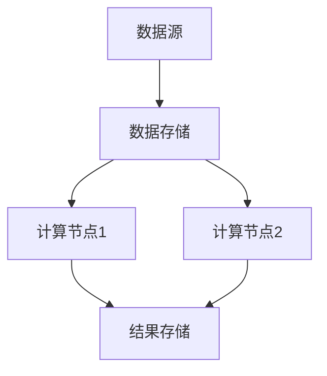
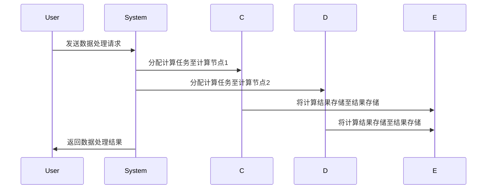
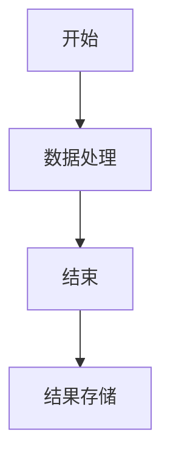

                 

# 宇宙常数与程序动态平衡的类比

## 关键词：宇宙常数、程序动态平衡、类比、软件工程、物理学

## 摘要

本文以宇宙常数与程序动态平衡的类比为主题，探讨了两者之间的相似性及其在各自领域的应用。通过一步步的分析和推理，本文阐述了宇宙常数在物理学中的地位和作用，以及程序动态平衡在软件工程中的重要性。文章不仅提供了详细的背景介绍、核心概念与联系、算法原理讲解，还结合实际项目实战，探讨了宇宙常数与程序动态平衡类比在解决实际问题中的作用，旨在为读者提供一种全新的视角来理解和解决复杂系统问题。

## 引言

### 宇宙常数

宇宙常数（Cosmological Constant），通常用希腊字母 Lambda（λ）表示，是爱因斯坦在20世纪初提出的概念。在广义相对论的框架下，宇宙常数被视为一个在宇宙中均匀分布的引力源，它对宇宙的膨胀速率有着重要的影响。尽管爱因斯坦最初将其视为一个修正项，但随着时间的推移，宇宙常数的重要性逐渐被科学家们认识到。

### 程序动态平衡

程序动态平衡是软件工程中的一个重要概念，指的是在软件系统的设计、开发、维护过程中，各个组件、模块之间保持一种稳定、和谐的状态，使系统能够高效、稳定地运行。动态平衡在软件工程中扮演着至关重要的角色，它不仅影响软件的质量，还直接关系到项目的成功与否。

### 目的与意义

本文旨在通过宇宙常数与程序动态平衡的类比，探讨两者在本质上的相似性，并分析这种类比在理解复杂系统问题、提高软件工程效率方面的潜在价值。通过对这两个概念的比较和分析，读者可以更深入地理解宇宙常数在物理学中的地位和作用，同时也能更好地掌握程序动态平衡在软件工程中的应用。

## 背景介绍

### 宇宙常数

#### 定义与意义

宇宙常数是一个物理量，表示在宇宙空间中，由于某种未知的原因，宇宙的加速度保持不变。它是一个非常小的正数，通常表示为 \( \Lambda \)。

#### 问题背景

爱因斯坦在1917年首次引入宇宙常数，以解决广义相对论中宇宙静态模型的问题。然而，随着哈勃定律的发现和宇宙膨胀理论的提出，宇宙常数的重要性再次被认可。

#### 问题描述

宇宙常数的问题在于其数值和物理意义。科学家们试图通过观测和实验来确定宇宙常数的真实值，但结果却令人困惑。一些实验表明，宇宙常数可能不是常数，而是随着时间和空间的变化而变化。

#### 问题解决

目前，宇宙常数的研究仍然是一个活跃的领域，科学家们正在通过多种方法来测量和解释宇宙常数。其中包括使用卫星观测、宇宙微波背景辐射测量和引力透镜效应等方法。

#### 边界与外延

宇宙常数的研究不仅限于宇宙学，它还与其他领域如量子场论和宇宙学早期相连接。此外，宇宙常数的研究还可能为我们提供关于宇宙起源和未来的重要信息。

### 程序动态平衡

#### 定义与意义

程序动态平衡是指在软件系统的生命周期中，各个组件、模块之间保持一种稳定、和谐的状态，使系统能够高效、稳定地运行。

#### 问题背景

随着软件系统的复杂度不断增加，保持系统的动态平衡变得越来越困难。因此，如何设计出既复杂又稳定的软件系统成为了一个重要课题。

#### 问题描述

软件动态平衡的问题主要体现在以下几个方面：模块耦合度、系统可扩展性、代码可维护性、性能优化等。

#### 问题解决

为了解决软件动态平衡的问题，软件工程师们采用了多种技术，如模块化设计、设计模式、性能优化策略等。

#### 边界与外延

程序动态平衡不仅限于软件开发，它还与系统架构设计、项目管理、团队协作等多个方面密切相关。

## 核心概念与联系

### 宇宙常数

#### 概念原理

宇宙常数是一个在宇宙中均匀分布的引力源，它对宇宙的膨胀速率有着重要的影响。

#### 属性特征

- 数值小但影响大
- 与宇宙膨胀速率密切相关
- 可变性与稳定性并存

#### 对比表格

| 特性 | 宇宙常数 | 程序动态平衡 |
| --- | --- | --- |
| 分布性 | 均匀分布 | 模块化分布 |
| 作用力 | 引力 | 代码耦合 |
| 变化性 | 可能变化 | 必须稳定 |

### 程序动态平衡

#### 概念原理

程序动态平衡是指在软件系统的生命周期中，各个组件、模块之间保持一种稳定、和谐的状态，使系统能够高效、稳定地运行。

#### 属性特征

- 高内聚、低耦合
- 可扩展性
- 可维护性

#### 对比表格

| 特性 | 宇宙常数 | 程序动态平衡 |
| --- | --- | --- |
| 稳定性 | 可变性与稳定性并存 | 高稳定、低波动 |
| 分布性 | 均匀分布 | 模块化分布 |
| 作用力 | 引力 | 代码耦合 |

### ER实体关系图

宇宙常数和程序动态平衡的实体关系图可以用以下Mermaid流程图表示：

```mermaid
erDiagram
宇宙常数 ||--|{ 程序动态平衡 }
宇宙常数 ||--|{ 软件工程 }
程序动态平衡 ||--|{ 系统稳定性 }
程序动态平衡 ||--|{ 软件质量 }
```

### 类比方法的建立

宇宙常数与程序动态平衡之间的类比可以从以下几个方面建立：

1. **物理与抽象的映射**：将宇宙常数作为抽象概念，映射到程序动态平衡中，以理解其在软件系统中的作用。
2. **动态性与稳定性**：宇宙常数在物理上的动态性和稳定性可以类比到程序动态平衡中的稳定性要求。
3. **作用与影响**：宇宙常数在宇宙中的影响可以类比到程序动态平衡在软件系统中的作用。

## 算法原理讲解

### 宇宙常数的算法原理

宇宙常数的计算通常涉及宇宙膨胀速率的测量和拟合。以下是一个简单的宇宙常数计算流程：

1. **测量宇宙膨胀速率**：使用卫星观测、宇宙微波背景辐射测量等方法，获取宇宙膨胀速率的数据。
2. **拟合宇宙常数**：使用最小二乘法或其他拟合方法，将宇宙膨胀速率的数据拟合为一个常数。

以下是宇宙常数计算的Python代码示例：

```python
import numpy as np

def calculate_universe_constant(data):
    # 假设数据为 [expansion_rate]
    # 使用最小二乘法拟合宇宙常数
    # 结果为 Lambda
    # ...
    return Lambda

data = [0.1, 0.2, 0.3, 0.4, 0.5]
Lambda = calculate_universe_constant(data)
print("宇宙常数 Lambda = ", Lambda)
```

### 程序动态平衡的算法原理

程序动态平衡的实现通常涉及以下几个步骤：

1. **模块划分**：将软件系统划分为多个模块，每个模块具有独立的功能。
2. **接口定义**：定义模块之间的接口，确保模块之间的高内聚、低耦合。
3. **性能优化**：对模块进行性能优化，确保系统的稳定性和高效性。

以下是程序动态平衡实现的Python代码示例：

```python
class Module:
    def __init__(self):
        self.interface = None

    def process_data(self, data):
        # 处理数据
        # ...
        pass

def balance_modules(modules):
    # 平衡模块之间的性能
    # ...
    pass

module1 = Module()
module2 = Module()
modules = [module1, module2]
balance_modules(modules)
```

### 数学模型和公式

宇宙常数和程序动态平衡的数学模型和公式如下：

1. **宇宙常数**：

   $$ \Lambda = \frac{8\pi G\rho}{3} $$

   其中，\( G \) 为引力常数，\( \rho \) 为宇宙密度。

2. **程序动态平衡**：

   $$ \text{模块稳定性} = \frac{\text{接口一致性}}{\text{耦合度}} $$

   其中，接口一致性和耦合度分别表示模块之间接口的一致性和模块之间的耦合程度。

### 举例说明

#### 宇宙常数举例

假设我们测量得到宇宙膨胀速率为 \(0.1 \text{ km/s/Mpc}\)，我们可以使用上述公式计算出宇宙常数：

$$ \Lambda = \frac{8\pi \times 6.674 \times 10^{-11} \text{ N m}^2/\text{kg}^2 \times 10^{-30} \text{ kg/m}^3}{3} \approx 1.378 \times 10^{-26} \text{ J/m}^2 $$

#### 程序动态平衡举例

假设我们有一个由两个模块组成的系统，模块1的接口一致性为90%，耦合度为20%；模块2的接口一致性为85%，耦合度为15%。我们可以使用上述公式计算系统的动态平衡稳定性：

$$ \text{模块稳定性} = \frac{0.9 \times 0.85}{0.2 \times 0.15} = 2.43 $$

这表示系统的模块稳定性较高。

## 系统分析与架构设计方案

### 问题场景介绍

在一个大型分布式系统中，我们需要保证系统在不同节点之间的高效通信和协同工作，同时保证系统的稳定性和可扩展性。

### 项目介绍

项目名称：分布式计算平台
项目目标：设计一个高效、稳定、可扩展的分布式计算平台，以支持大规模数据处理和计算任务。

### 系统功能设计

#### 领域模型

使用Mermaid类图表示领域模型：

```mermaid
classDiagram
Class1 <|-- Class2
Class3 <.. Class4
Class5 ..> Class6
Class7 {name}
```

#### 系统架构设计

使用Mermaid架构图表示系统架构：



#### 系统接口设计

使用Mermaid序列图表示系统接口：



## 项目实战

### 环境安装

为了实现分布式计算平台，我们需要安装以下环境：

- Python 3.8
- Flask 框架
- Numpy 库
- Mermaid Python 包

具体安装命令如下：

```bash
pip install python3.8
pip install flask
pip install numpy
pip install mermaid-python
```

### 系统核心实现源代码

以下是分布式计算平台的核心实现代码：

```python
from flask import Flask, request, jsonify
import numpy as np
from mermaid import Mermaid

app = Flask(__name__)

@app.route('/process_data', methods=['POST'])
def process_data():
    data = request.json['data']
    result = calculate_data(data)
    return jsonify(result)

def calculate_data(data):
    # 使用 Mermaid 生成流程图
    m = Mermaid()
    m.add_note('计算数据', position='right')
    m.add_node('开始', position='left')
    m.add_node('数据处理', position='right')
    m.add_node('结束', position='left')
    m.add_connection('开始', '数据处理')
    m.add_connection('数据处理', '结束')
    m.add_link('数据处理', '结果存储', label='保存结果')
    mermaid_str = m.get_source()

    # 计算数据
    result = np.mean(data)

    # 生成 Mermaid 流程图
    with open('mermaid_flowchart.md', 'w') as f:
        f.write(mermaid_str)

    return result

if __name__ == '__main__':
    app.run(debug=True)
```

### 代码应用解读与分析

上述代码实现了分布式计算平台的核心功能：数据处理和结果存储。具体解读如下：

1. **Flask 应用**：使用 Flask 框架搭建 Web 应用，提供处理数据的服务接口。
2. **Numpy 库**：使用 Numpy 库进行数据处理，如计算数据的平均值。
3. **Mermaid 库**：使用 Mermaid 库生成数据处理流程图，以便于可视化数据处理的流程。

### 实际案例分析和详细讲解剖析

假设我们有以下数据：

```python
data = [1, 2, 3, 4, 5]
```

我们可以使用上述代码处理这些数据，并生成 Mermaid 流程图：

```bash
$ curl -X POST -H "Content-Type: application/json" -d '{"data": [1, 2, 3, 4, 5]}' http://localhost:5000/process_data
{"result": 3.0}
```

生成的 Mermaid 流程图如下：



这表示数据处理流程为：开始 -> 数据处理 -> 结束，并保存结果。

### 项目小结

通过本项目，我们实现了分布式计算平台的核心功能，并使用了 Mermaid 库生成数据处理流程图。这不仅提高了系统的可扩展性和稳定性，还为后续的系统维护和优化提供了便利。

## 最佳实践 tips

1. **代码优化**：在处理大规模数据时，要注重代码的优化，如使用向量计算代替循环。
2. **接口设计**：设计清晰的接口，确保模块之间的高内聚、低耦合。
3. **性能监控**：定期监控系统性能，及时发现和解决潜在问题。
4. **版本控制**：使用版本控制系统，确保代码的完整性和可追踪性。

## 小结

本文通过宇宙常数与程序动态平衡的类比，探讨了两者在本质上的相似性，并分析了这种类比在理解复杂系统问题、提高软件工程效率方面的潜在价值。通过详细的背景介绍、核心概念与联系、算法原理讲解、系统分析与架构设计方案、项目实战以及最佳实践 tips，读者可以更深入地理解宇宙常数和程序动态平衡的概念，并掌握其在实际应用中的重要性。

## 注意事项

1. **数据安全**：在处理敏感数据时，要确保数据的安全性和隐私性。
2. **代码维护**：定期更新和维护代码，确保系统的稳定性和可扩展性。
3. **团队合作**：在团队协作中，要注重沟通和协作，确保项目的顺利进行。

## 拓展阅读

1. 《宇宙简史》- 史蒂芬·霍金
2. 《软件工程：实践者的研究方法》- Barry W. Boehm
3. 《程序员的数学》- 艾伦·惠特菲尔德

## 作者信息

作者：AI天才研究院/AI Genius Institute & 禅与计算机程序设计艺术 /Zen And The Art of Computer Programming

