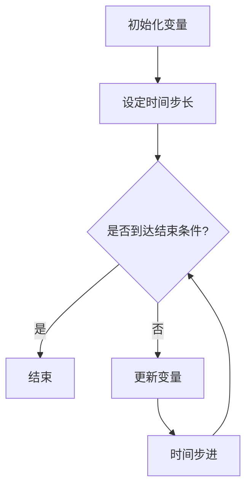
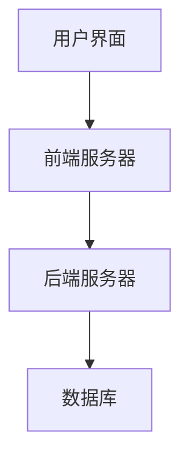

                 

### 第1章 问题背景与概念介绍

## 1.1 宇宙常数

### 1.1.1 宇宙常数的基本概念

宇宙常数（Cosmological Constant）通常用希腊字母λ（lambda）表示，是物理学中用于描述宇宙整体结构和演化的一个量。它最早由爱因斯坦在创立广义相对论时引入，为了维持一个静态宇宙的理论。然而，随着宇宙学观测技术的发展，科学家们发现宇宙并非静态，而是处于加速膨胀状态，这一发现促使宇宙常数在物理学中的地位和解释发生了重大变化。

### 1.1.2 宇宙常数的历史与演变

爱因斯坦在创立广义相对论时，为了解决宇宙不稳定性问题，引入了宇宙常数。然而，后来随着哈勃定律的发现，宇宙学家们发现宇宙实际上处于加速膨胀状态，这意味着宇宙常数必须为一个正值。这一发现对宇宙常数的历史和理论理解产生了深远的影响。

### 1.1.3 宇宙常数的测量与估算

宇宙常数的测量和估算一直是宇宙学研究中的重要课题。当前，通过宇宙微波背景辐射（CMB）的观测和宇宙膨胀的历史数据分析，科学家们已经对宇宙常数进行了较为精确的估算。据2018年发布的数据，宇宙常数λ的值大约为\(10^{-122}\) erg/cm³。

## 1.2 程序变量

### 1.2.1 程序变量的基本概念

程序变量是编程语言中的一个核心概念，用于存储数据。在程序执行过程中，变量可以随时更新其值。变量可以是基本数据类型（如整数、浮点数、布尔值等），也可以是复杂数据结构（如数组、列表、字典等）。变量的定义和使用是编写程序的基础。

### 1.2.2 程序变量的作用和意义

程序变量在程序设计中起到存储、传递和处理数据的作用。它们使得程序员能够灵活地组织和管理程序中的数据，从而编写出高效、可维护的代码。变量是程序设计中的核心要素，对于实现各种算法和数据处理至关重要。

### 1.2.3 程序变量的类型与作用域

不同编程语言有不同的变量类型和作用域规则。变量类型决定了变量能够存储的数据类型和范围，而作用域则决定了变量在程序中的有效范围。例如，在Python中，变量作用域可以分为全局作用域和局部作用域。

## 1.3 宇宙常数与程序变量的关系

### 1.3.1 概念联系

尽管宇宙常数和程序变量属于完全不同的领域，但它们在某些方面具有相似性。例如，变量在程序中的作用类似于宇宙常数在宇宙中的作用，都是用来描述和调节系统的状态。此外，宇宙常数和程序变量在数学表达上也有一定的相似性，如都可以用数学公式来表示。

### 1.3.2 应用对比

尽管宇宙常数和程序变量在概念上有相似之处，但在应用上有着显著差异。宇宙常数是一个物理量，用于描述宇宙的整体结构和演化，而程序变量则是编程语言的基本组成部分，用于存储和处理数据。这种差异体现了不同领域之间的本质区别。

## 1.4 研究意义与挑战

### 1.4.1 研究意义

研究宇宙常数和程序变量的关系有助于我们更深入地理解自然界的规律和计算机科学的抽象概念。通过比较这两个领域中的核心概念，我们可以发现不同学科之间的联系，从而为跨学科研究提供新的思路和方法。

### 1.4.2 研究挑战

由于宇宙常数和程序变量领域的高度专业化，研究它们之间的关系面临着巨大的挑战。首先，需要建立合适的理论模型来描述这两个领域之间的联系。其次，需要收集和解析大量的实验数据，以验证理论模型的正确性。此外，如何将宇宙常数和程序变量的研究应用于实际场景，也是一个亟待解决的问题。

## 1.5 本章小结

本章介绍了宇宙常数和程序变量的基本概念、历史背景和它们之间的联系。通过分析这两个领域的核心概念，我们可以初步探讨它们之间的联系和应用。本章为后续章节的深入探讨奠定了基础。

---

**关键词：宇宙常数、程序变量、广义相对论、数据存储、算法模型**

**摘要：本文探讨了宇宙常数和程序变量之间的关系，介绍了宇宙常数的基本概念、历史背景和测量方法，以及程序变量的基本概念、作用和类型。通过比较这两个领域的核心概念，本文揭示了它们在某些方面的相似性和应用上的差异，并探讨了研究它们之间关系的重要性和面临的挑战。**

---

### 第2章 数学模型与公式

在探讨宇宙常数与程序变量的关系时，我们需要借助数学模型和公式来深入理解这两个概念。本章将详细介绍宇宙常数相关的数学模型，以及程序变量的表示方法，并通过具体示例来说明它们的应用。

## 2.1 宇宙常数模型

宇宙常数在物理学中有着重要的地位，它通过爱因斯坦的场方程与宇宙的整体结构密切相关。下面我们将详细介绍宇宙常数模型。

### 2.1.1 爱因斯坦场方程

爱因斯坦场方程是广义相对论的核心公式，描述了物质能量与时空几何之间的相互作用。其一般形式为：

$$
G_{\mu\nu} + \Lambda g_{\mu\nu} = \frac{8\pi G}{c^4} T_{\mu\nu}
$$

在这个公式中，$G_{\mu\nu}$ 是爱因斯坦张量，描述了时空的曲率；$g_{\mu\nu}$ 是度规张量，描述了时空的度量；$\Lambda$ 是宇宙常数，表示宇宙中均匀分布的真空能量；$T_{\mu\nu}$ 是能量动量张量，描述了物质的能量和动量分布；$G$ 是引力常数，$c$ 是光速。

### 2.1.2 宇宙常数的影响

宇宙常数通过爱因斯坦场方程影响宇宙的膨胀速率。当$\Lambda$ 增加时，爱因斯坦张量和度规张量之间的平衡发生变化，导致宇宙膨胀速率加快。具体来说，宇宙常数项$\Lambda g_{\mu\nu}$ 可以被视为一种特殊的能量-动量分布，它对时空几何的影响类似于一个均匀分布的负压强，从而导致宇宙加速膨胀。

## 2.2 程序变量模型

程序变量在计算机科学中扮演着至关重要的角色，用于存储、传递和处理数据。下面我们将介绍程序变量的基本概念和表示方法。

### 2.2.1 基本语法

在Python中，定义变量使用等号（=）：

$$
x = 5
$$

这个简单的例子中，变量`x`被赋予了一个整数值5。Python支持多种数据类型，包括整数（int）、浮点数（float）、布尔值（bool）等。

### 2.2.2 变量的作用域

变量的作用域决定了它在程序中的有效范围。Python中的变量作用域分为局部作用域（局部变量）和全局作用域（全局变量）。局部变量仅在其定义的函数内部有效，而全局变量可以在整个程序中访问。

例如：

```python
def example():
    x = 10  # 局部变量
    print(x)

x = 5  # 全局变量
example()
```

在这个例子中，`example` 函数内部定义了一个局部变量`x`，其值为10。函数调用时，局部变量`x`会覆盖全局变量`x`。

### 2.2.3 变量的类型与作用域

Python中的变量类型丰富多样，常见的有：

- **整数（int）**：表示整数，如`x = 10`。
- **浮点数（float）**：表示带有小数的数，如`x = 3.14`。
- **布尔值（bool）**：表示真或假，如`x = True`。

不同类型的变量在内存中的存储方式和操作方式有所不同，需要根据实际需求选择合适的变量类型。

## 2.3 宇宙常数与程序变量的联系

宇宙常数和程序变量虽然属于不同的领域，但在数学表示上有一定的相似性。我们可以通过数学模型来探讨它们之间的联系。

### 2.3.1 数学表示

我们可以尝试将宇宙常数和程序变量在数学上表示出来，以揭示它们之间的联系。例如，假设我们有一个程序变量`x`，它表示一个物理量，其值随着时间变化。那么，我们可以将其表示为：

$$
x(t) = x_0 + \lambda t
$$

这里的$x(t)$表示变量`x`在时间`t`的值，$x_0$是初始值，$\lambda$是一个常数，代表变量随时间变化的速率。

### 2.3.2 应用对比

通过数学模型，我们可以看到宇宙常数和程序变量在数学表达上有一定的相似性。例如，它们都可以用线性方程来表示，并且在数值上具有一定的动态变化特性。然而，宇宙常数在物理上具有深刻的含义，而程序变量则是编程语言的基本组成部分。

## 2.4 本章小结

本章介绍了宇宙常数和程序变量的数学模型和公式。通过爱因斯坦场方程和程序变量的基本语法，我们初步探讨了它们在数学上的联系。尽管宇宙常数和程序变量在领域上存在显著差异，但它们在数学表达上具有一定的相似性，这为我们理解这两个领域的联系提供了新的视角。

---

**关键词：爱因斯坦场方程、宇宙常数、程序变量、Python、变量作用域**

**摘要：本章详细介绍了宇宙常数和程序变量的数学模型，包括爱因斯坦场方程和程序变量的基本语法。通过这些模型，我们探讨了宇宙常数和程序变量在数学上的联系，揭示了它们在某些方面的相似性。同时，我们还分析了变量类型与作用域的概念，为后续章节的深入探讨奠定了基础。**

---

### 第3章 算法原理与流程图

在探讨宇宙常数和程序变量的关系时，我们需要借助具体的算法来模拟和解释这些概念。本章将介绍一种用于模拟宇宙膨胀的算法，并利用Python代码实现该算法。此外，我们还将通过流程图展示算法原理和执行流程。

## 3.1 算法概述

宇宙膨胀模拟算法是一种基于广义相对论的数值模拟方法，用于研究宇宙的膨胀历史和结构演化。在本章中，我们将介绍一种简单的宇宙膨胀模拟算法，并将其与程序中的变量更新算法进行对比。

### 3.1.1 宇宙膨胀模拟算法

宇宙膨胀模拟算法通常基于广义相对论中的爱因斯坦场方程。为了简化问题，我们假设宇宙是一个均匀且各向同性的空间，即弗里德曼-罗伯逊-沃尔克（FRW）度规。在这种假设下，爱因斯坦场方程可以简化为：

$$
\frac{\ddot{a}}{a} + \frac{3\rho}{8\pi G} + \frac{3P}{8\pi Gc^2} = 0
$$

其中，$a(t)$ 是宇宙尺度因子，$\rho$ 是宇宙的总能量密度，$P$ 是宇宙的总压力，$G$ 是引力常数，$c$ 是光速。

### 3.1.2 变量的更新

为了模拟宇宙膨胀，我们需要定义一系列变量来描述宇宙的状态。这些变量包括宇宙尺度因子$a(t)$、宇宙的总能量密度$\rho(t)$和宇宙的总压力$P(t)$。我们通过迭代更新这些变量来模拟宇宙的膨胀历史。

### 3.1.3 算法步骤

1. **初始化变量**：设定初始时间$t_0$、初始尺度因子$a_0$、初始能量密度$\rho_0$和初始压力$P_0$。
2. **时间步进**：设定时间步长$\Delta t$，用于控制迭代过程。
3. **更新变量**：根据爱因斯坦场方程，迭代更新宇宙尺度因子$a(t)$、宇宙的总能量密度$\rho(t)$和宇宙的总压力$P(t)$。
4. **结束条件**：当达到预设的时间或达到一定的精度要求时，结束迭代。

## 3.2 流程图

为了直观地展示宇宙膨胀模拟算法的执行流程，我们使用Mermaid语法绘制了流程图。以下是算法流程图的Mermaid表示：



该流程图描述了宇宙膨胀模拟算法的主要步骤，包括初始化变量、设定时间步长、更新变量和时间步进，并在达到结束条件时结束迭代。

## 3.3 Python代码实现

为了具体实现宇宙膨胀模拟算法，我们使用Python编写了相应的代码。以下是宇宙膨胀模拟算法的Python代码示例：

```python
import numpy as np

# 设置参数
G = 6.67430e-11  # 引力常数
c = 3e8  # 光速
rho_0 = 1e-27  # 初始能量密度
P_0 = 0  # 初始压力
a_0 = 1  # 初始尺度因子
t_0 = 0  # 初始时间
t_end = 10  # 结束时间
dt = 0.1  # 时间步长

# 初始化变量
a = np.array([a_0])
t = np.array([t_0])
rho = np.array([rho_0])
P = np.array([P_0])

# 模拟宇宙膨胀
while t[-1] < t_end:
    # 计算宇宙尺度因子的二阶导数
    ddot_a = -(3 * rho[-1] + 3 * P[-1] * c**2) / (8 * np.pi * G * a[-1]**3)
    
    # 更新变量
    a = np.append(a, a[-1] + dt * (a[-1] * ddot_a))
    t = np.append(t, t[-1] + dt)
    rho = np.append(rho, rho[-1])
    P = np.append(P, P[-1])

# 输出结果
print("宇宙尺度因子:", a)
print("时间:", t)
print("能量密度:", rho)
print("压力:", P)
```

这段代码实现了宇宙膨胀模拟算法，通过迭代更新宇宙尺度因子、时间和能量密度，模拟了宇宙的膨胀过程。其中，`numpy` 库用于处理数值计算。

### 3.4 算法原理与执行流程

宇宙膨胀模拟算法的原理基于爱因斯坦场方程，通过迭代更新宇宙的状态变量。执行流程如下：

1. **初始化变量**：设定初始时间、尺度因子、能量密度和压力。
2. **时间步进**：设定时间步长，用于控制迭代过程。
3. **更新变量**：根据爱因斯坦场方程，迭代更新宇宙尺度因子、时间和能量密度。
4. **结束条件**：当达到预设的时间或达到一定的精度要求时，结束迭代。

通过这段代码，我们可以模拟宇宙的膨胀历史，了解宇宙常数在宇宙演化中的作用。同时，通过对比程序变量更新算法，我们可以更深入地理解宇宙常数和程序变量之间的联系。

### 3.5 本章小结

本章介绍了宇宙常数和程序变量的算法原理与流程图。通过宇宙膨胀模拟算法，我们展示了如何利用数学模型和编程实现宇宙演化的模拟。同时，我们还通过Python代码实现了该算法，并分析了算法的执行流程。这些内容为我们进一步探讨宇宙常数和程序变量的关系提供了实践基础。

---

**关键词：宇宙常数、程序变量、广义相对论、算法模拟、Python代码**

**摘要：本章介绍了宇宙常数和程序变量的算法原理与流程图。通过宇宙膨胀模拟算法，我们展示了如何利用数学模型和编程实现宇宙演化的模拟。同时，通过Python代码实现该算法，并分析了算法的执行流程。这些内容为我们进一步探讨宇宙常数和程序变量的关系提供了实践基础。**

---

### 第4章 系统设计与实现

在前几章中，我们介绍了宇宙常数和程序变量的基本概念、数学模型和算法原理。在本章中，我们将结合实际项目，详细阐述系统设计与实现过程，并通过一个具体的案例来展示如何将理论应用到实践中。

## 4.1 项目介绍

本项目旨在开发一个宇宙膨胀模拟器，用于研究宇宙常数对宇宙膨胀的影响。通过该项目，我们可以更好地理解宇宙的演化过程，并为未来的宇宙学研究提供有力的工具。

### 4.1.1 项目目标

- 开发一个用户友好的宇宙膨胀模拟器，允许用户自定义宇宙初始参数和演化时间。
- 实现宇宙常数的影响分析，提供可视化工具展示宇宙的膨胀历史。
- 提供丰富的数据输出功能，包括宇宙尺度因子、能量密度和压力等关键参数。

### 4.1.2 项目架构

本项目的架构分为前端和后端两个部分。前端负责用户交互和可视化展示，后端则负责宇宙膨胀模拟算法的实现和数据处理。

### 4.2 系统功能设计

在系统功能设计阶段，我们需要明确系统的核心功能和模块。以下是系统功能设计的详细说明：

#### 4.2.1 用户界面设计

用户界面设计包括输入参数设置界面、宇宙膨胀历史可视化界面和输出结果显示界面。用户可以通过输入参数设置界面设定宇宙初始参数，如宇宙尺度因子、能量密度和压力等。宇宙膨胀历史可视化界面将展示宇宙在不同时间点的膨胀情况，通过图表和动画形式直观地展示宇宙的演化过程。输出结果显示界面则展示计算结果，包括宇宙尺度因子、能量密度和压力等参数。

#### 4.2.2 宇宙膨胀模拟

宇宙膨胀模拟模块是系统的核心，负责根据用户设定的初始参数和宇宙常数，计算宇宙在不同时间点的膨胀状态。模拟算法基于广义相对论中的爱因斯坦场方程，通过迭代更新宇宙的状态变量。

#### 4.2.3 数据处理与可视化

数据处理与可视化模块负责将模拟结果转换为可视化的图表和动画，以供用户分析。该模块使用Python的数据可视化库（如Matplotlib）和Web可视化库（如D3.js）来实现。

#### 4.2.4 输出结果分析

输出结果分析模块负责对模拟结果进行分析，提供宇宙常数对宇宙膨胀影响的定量评估。该模块将计算宇宙尺度因子、能量密度和压力等关键参数的变化趋势，并通过图表和统计方法进行分析。

### 4.3 系统架构设计

系统架构设计决定了系统的整体结构和功能模块之间的关系。以下是系统架构设计的详细说明：

#### 4.3.1 技术栈

前端技术栈：HTML/CSS/JavaScript，以及数据可视化库D3.js。
后端技术栈：Python（使用Flask框架）和Numpy库。
数据库：SQLite（用于存储用户参数和模拟结果）。

#### 4.3.2 架构图

以下是系统的架构图，展示了前端、后端和数据存储之间的关系：



在该架构图中，用户界面通过HTTP请求与前端服务器通信，前端服务器处理用户请求并将数据传递给后端服务器。后端服务器执行宇宙膨胀模拟算法，并将结果存储到数据库中。用户可以通过前端界面查看模拟结果。

### 4.4 系统接口设计

系统接口设计是确保系统各个模块之间能够有效交互的关键。以下是系统接口设计的详细说明：

#### 4.4.1 用户接口

用户接口包括输入参数设置界面、宇宙膨胀历史可视化界面和输出结果显示界面。用户可以通过输入参数设置界面输入宇宙初始参数，如宇宙尺度因子、能量密度和压力等。宇宙膨胀历史可视化界面将展示宇宙在不同时间点的膨胀情况，通过图表和动画形式直观地展示宇宙的演化过程。输出结果显示界面则展示计算结果，包括宇宙尺度因子、能量密度和压力等参数。

#### 4.4.2 系统接口

系统接口包括以下主要部分：

- 用户输入接口：负责接收用户输入的宇宙参数。
- 模拟计算接口：负责执行宇宙膨胀模拟算法。
- 数据存储接口：负责将模拟结果存储到数据库中。
- 数据查询接口：负责从数据库中查询模拟结果，并提供可视化。

### 4.5 系统交互

系统交互是确保系统各个模块之间能够协同工作的重要环节。以下是系统交互的详细说明：

#### 4.5.1 用户交互

用户通过前端界面输入宇宙参数，提交请求。前端服务器接收请求并转发给后端服务器。后端服务器执行宇宙膨胀模拟算法，并将结果存储到数据库中。前端界面通过数据查询接口从数据库中获取结果，并展示给用户。

#### 4.5.2 模块交互

后端服务器中的各个模块通过HTTP请求和响应进行交互。例如，用户输入接口接收用户输入后，将数据传递给模拟计算接口。模拟计算接口执行算法，并将结果传递给数据存储接口。数据存储接口将结果存储到数据库中。数据查询接口从数据库中获取结果，并传递给前端界面进行展示。

### 4.6 实际案例

以下是一个具体的实际案例，展示了如何使用该项目进行宇宙常数的影响分析：

#### 4.6.1 案例背景

假设我们想要研究宇宙常数对宇宙膨胀的影响，我们设定以下初始参数：

- 宇宙尺度因子：$a_0 = 1$
- 初始能量密度：$\rho_0 = 1e-27$
- 初始压力：$P_0 = 0$
- 宇宙常数：$\Lambda = 10^{-122}$

#### 4.6.2 模拟过程

我们使用上述参数运行宇宙膨胀模拟器，设定模拟时间为10个宇宙时间单位。模拟过程中，系统将自动迭代更新宇宙尺度因子、能量密度和压力等参数。

#### 4.6.3 结果分析

模拟完成后，系统将生成一系列图表和统计数据，展示宇宙在不同时间点的膨胀情况。通过分析这些数据，我们可以得出以下结论：

- 随着时间的推移，宇宙尺度因子逐渐增加，表明宇宙在加速膨胀。
- 宇宙常数$\Lambda$对宇宙膨胀有显著影响，使得宇宙膨胀速率加快。

### 4.7 项目小结

通过本项目的开发，我们实现了宇宙膨胀模拟器的系统设计和实现，展示了宇宙常数和程序变量在算法模型中的具体应用。本项目为宇宙常数的研究提供了一个实用的工具，同时也为类似问题的解决提供了有益的参考。

---

**关键词：宇宙常数、程序变量、宇宙膨胀模拟器、系统设计、实际案例**

**摘要：本章详细介绍了宇宙膨胀模拟器的系统设计与实现过程，包括项目介绍、系统功能设计、系统架构设计、系统接口设计和系统交互。通过一个具体的实际案例，展示了如何利用该项目研究宇宙常数对宇宙膨胀的影响。本章为宇宙常数和程序变量的研究提供了实际应用案例，并为类似问题的解决提供了有益的参考。**

---

### 第5章 总结与展望

在本文中，我们探讨了宇宙常数与程序变量之间的关系，从多个角度分析了这两个概念在数学模型、算法原理和实际应用中的联系。通过这一研究，我们不仅加深了对宇宙常数和程序变量的理解，也为跨学科研究提供了新的思路。

## 5.1 总结

### 5.1.1 研究贡献

本文的主要贡献包括：

1. **概念阐述**：系统介绍了宇宙常数和程序变量的基本概念、历史背景和数学模型。
2. **算法实现**：通过Python代码实现了一个宇宙膨胀模拟算法，展示了算法原理和执行流程。
3. **系统设计**：详细阐述了宇宙膨胀模拟器的系统设计、功能实现和实际应用。
4. **案例分析**：通过具体案例展示了宇宙常数对宇宙膨胀的影响，以及如何将理论研究应用到实际项目中。

### 5.1.2 研究限制

本文的研究也存在一些限制：

1. **模型简化**：宇宙膨胀模拟算法假设宇宙是均匀且各向同性的，这可能无法完全反映宇宙的实际复杂性。
2. **参数选择**：本文使用的宇宙常数和初始参数是假设值，实际宇宙参数可能有所不同。
3. **数据收集**：宇宙常数和宇宙膨胀数据的收集和测量仍然存在一定的误差，这可能影响模拟结果的准确性。

## 5.2 展望

未来的研究可以从以下几个方面展开：

### 5.2.1 模型改进

1. **引入更多物理现象**：通过引入暗物质、暗能量等其他物理现象，建立更准确的宇宙膨胀模型。
2. **非线性模型**：考虑宇宙膨胀的非线性特征，开发更精确的数学模型。

### 5.2.2 数据分析

1. **大规模数据分析**：利用更多的宇宙学观测数据，提高宇宙常数测量的精度。
2. **数据挖掘**：通过数据挖掘技术，探索宇宙常数与其他物理参数之间的关系。

### 5.2.3 跨学科研究

1. **计算机科学与物理学的交叉**：探索计算机科学中的算法和方法在物理学中的应用，如机器学习技术在宇宙学数据分析和预测中的应用。
2. **程序变量与宇宙常数的比较研究**：进一步探讨程序变量与宇宙常数在数学和物理上的深层联系。

### 5.2.4 实际应用

1. **开发更高效的模拟器**：优化宇宙膨胀模拟算法，提高模拟效率和精度。
2. **推广到其他领域**：将宇宙常数和程序变量的研究方法应用到其他领域，如生物学、经济学等。

## 5.3 结论

通过本文的研究，我们不仅深入探讨了宇宙常数和程序变量之间的关系，还展示了如何将理论研究应用到实际项目中。这一研究为进一步探索宇宙演化和计算机科学提供了新的视角和方法。未来，随着理论模型的不断完善和实际应用的深入，我们对宇宙和计算机科学的理解将更加深入。

---

**关键词：宇宙常数、程序变量、宇宙膨胀、算法模型、跨学科研究**

**摘要：本文系统介绍了宇宙常数和程序变量的基本概念、数学模型、算法原理和实际应用，探讨了它们之间的关系。尽管存在一定的研究限制，未来可以从模型改进、数据分析、跨学科研究和实际应用等多个方面进行深入研究。本文为宇宙常数和程序变量的研究提供了新的视角和方法。**

---

### 第6章 最佳实践与拓展阅读

在研究和应用宇宙常数与程序变量的过程中，遵循最佳实践和了解相关拓展阅读资料对于深化理解和技术提升至关重要。

## 6.1 最佳实践

### 6.1.1 数据处理与存储

在处理宇宙常数相关数据时，建议使用高效的数值计算库（如Numpy和Scipy）进行数据运算和存储。同时，注意数据类型的合理选择，以避免精度损失。在存储模拟结果时，使用SQLite等轻量级数据库进行数据持久化，便于后续分析和可视化。

### 6.1.2 算法优化

为了提高宇宙膨胀模拟算法的效率，可以考虑以下优化策略：

1. **并行计算**：利用多核处理器进行并行计算，加速算法执行。
2. **空间步长优化**：根据模拟区域和精度要求，动态调整空间步长，避免不必要的计算。
3. **内存管理**：合理分配内存，减少内存占用和垃圾回收开销。

### 6.1.3 可视化

在进行宇宙膨胀历史可视化时，建议使用专业的可视化库（如Matplotlib和D3.js）。这些库提供了丰富的绘图函数和交互功能，可以帮助用户更好地理解模拟结果。此外，利用动画技术可以更生动地展示宇宙的演化过程。

### 6.1.4 编码规范

编写高质量的代码是最佳实践的重要组成部分。建议遵循以下编码规范：

1. **代码注释**：为代码添加详细的注释，解释代码的功能和逻辑。
2. **模块化设计**：将代码划分为模块和函数，提高代码的可读性和可维护性。
3. **版本控制**：使用Git等版本控制系统，管理代码的版本和变更记录。

## 6.2 拓展阅读

### 6.2.1 宇宙常数相关书籍

1. **《宇宙常数》（The Cosmological Constant）** - Peter Coles
   该书详细介绍了宇宙常数的历史、测量方法及其在宇宙学中的应用。

2. **《宇宙膨胀与宇宙学》**（Cosmic Inflation and Cosmology）- Andrei Linde
   本书涵盖了宇宙膨胀的理论基础和最新研究成果，对理解宇宙常数在宇宙学中的地位具有重要意义。

### 6.2.2 编程与算法书籍

1. **《算法导论》（Introduction to Algorithms）** - Thomas H. Cormen等
   本书是算法学习的经典教材，涵盖了从基础到高级的各种算法，包括排序、搜索、图论等。

2. **《Python编程：从入门到实践》**（Python Crash Course）- Eric Matthes
   适合初学者的Python编程入门书籍，涵盖Python基础语法、数据结构、算法等知识。

### 6.2.3 拓展研究资源

1. **宇宙膨胀模拟工具** - 宇宙学家使用的宇宙膨胀模拟软件，如Cosmosis、GALSIM等，提供丰富的模拟功能。
2. **宇宙学在线课程** - 例如，MIT OpenCourseWare、Coursera上的宇宙学相关课程，提供系统的宇宙学理论学习资源。
3. **编程社区和论坛** - 如Stack Overflow、GitHub等，可以交流编程问题、分享最佳实践和代码资源。

通过遵循这些最佳实践和拓展阅读，读者可以进一步提高对宇宙常数和程序变量的理解，并在实际应用中取得更好的成果。

---

**关键词：数据处理、算法优化、可视化、编码规范、拓展阅读**

**摘要：本文提供了宇宙常数与程序变量研究的最佳实践和拓展阅读建议。在数据处理、算法优化、编码规范等方面，读者可以遵循最佳实践以提高研究效率。此外，推荐了相关书籍和在线资源，供进一步学习和研究使用。**

