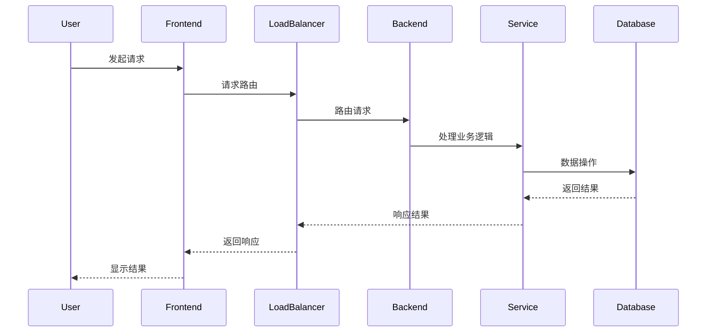
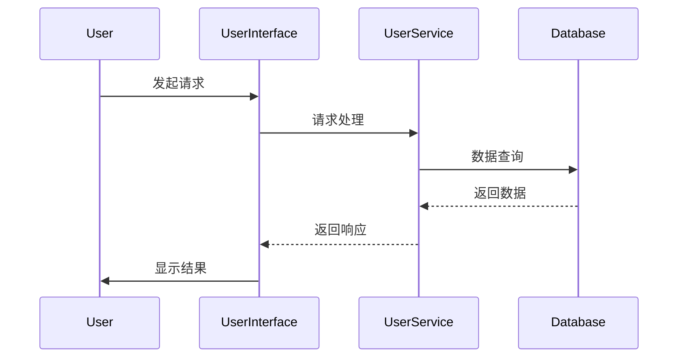

                 

### 宇宙常数与程序可扩展性极限的类比

#### 关键词
- 宇宙常数
- 程序可扩展性
- 类比分析
- 数学模型
- 系统架构

#### 摘要
本文通过将宇宙常数与程序可扩展性极限进行类比分析，探讨了二者之间的相似性和差异。我们首先介绍了宇宙常数的基本概念及其重要性，接着阐述了程序可扩展性的定义和其在现代软件开发中的关键作用。通过逐步分析，我们揭示了两者在本质和表现形式上的共通之处，并运用具体的算法、数学模型和系统架构进行了深入讲解。本文旨在帮助读者理解宇宙常数与程序可扩展性极限之间的关系，为软件工程和宇宙学研究提供新的视角。

### 引言

#### 宇宙常数的起源与重要性

宇宙常数是宇宙学中一个极其重要的概念，最早由爱因斯坦在其广义相对论中引入。爱因斯坦为了防止宇宙无限膨胀，引入了一个负的宇宙常数（Λ），以提供一种反引力，保持宇宙的静态状态。尽管这一假设在后来的观测中被证明是错误的，但宇宙常数作为一种理论工具，其意义并未消退。

宇宙常数是描述宇宙扩张速度的量，目前公认的正宇宙常数（Λ）表明宇宙正在加速膨胀。这一发现改变了我们对宇宙演化的理解，并对宇宙学、物理学乃至哲学产生了深远的影响。

#### 程序可扩展性的定义与重要性

程序可扩展性，又称为可伸缩性，是指系统在设计、实现和维护过程中，能够适应业务需求增长和变化的能力。可扩展性对于现代软件开发至关重要，因为随着用户数量的增加、业务逻辑的复杂化以及数据规模的扩大，系统需要能够高效地应对这些变化。

高可扩展性的系统可以在不显著影响性能的情况下，支持更多的用户和更复杂的功能。这不仅有助于提高用户满意度，还能降低维护成本和风险。因此，程序可扩展性已成为软件开发中一个核心的设计目标。

### 宇宙常数与程序可扩展性的联系

#### 核心概念对比

宇宙常数和程序可扩展性虽然属于不同的领域，但其核心概念之间存在着一些有趣的相似性。

- **稳定性和变化**：宇宙常数是描述宇宙基本状态的一个参数，它的变化对整个宇宙的演化有着深远的影响。同样，程序可扩展性也是一个系统的核心参数，它决定了系统在面临外部变化时的适应能力。
- **测量与调控**：宇宙常数的测量和调控是宇宙学研究的重要课题，科学家们通过观测和理论模型来研究宇宙常数的值和变化规律。在软件开发中，测量和调控程序的可扩展性同样至关重要，开发者需要通过性能测试和优化来确保系统的可扩展性。
- **演化与适应性**：宇宙常数与宇宙的演化密切相关，它影响着宇宙的结构和命运。类似地，程序可扩展性直接影响着软件系统的发展过程，一个高可扩展性的系统可以更好地适应未来的需求变化。

#### 属性特征对比表格

为了更直观地展示宇宙常数和程序可扩展性的属性特征，我们可以创建一个对比表格。

| 特性 | 宇宙常数 | 程序可扩展性 |
| --- | --- | --- |
| 定义 | 描述宇宙扩张速度的参数 | 描述系统适应业务需求变化的能力 |
| 测量方法 | 通过宇宙膨胀速率和距离测量 | 通过性能测试和扩展测试测量 |
| 影响范围 | 影响整个宇宙的演化 | 影响软件系统的性能和可维护性 |
| 重要性 | 决定宇宙命运 | 决定软件系统的生命力 |
| 调控策略 | 通过天文观测和理论模型调控 | 通过优化算法和系统架构调控 |

#### ER实体关系图

为了更深入地理解宇宙常数和程序可扩展性之间的关系，我们可以使用ER（实体关系）图来描述它们在系统架构中的关联。

```mermaid
erDiagram
  Class1 "宇宙常数" {
    # fillcolor: yellow
    # stereotype: "<-->"
    <<interface>> Interface1
    <<interface>> Interface2
  }
  
  Class2 "程序可扩展性" {
    # fillcolor: lightblue
    # stereotype: "<-->"
    <<interface>> Interface1
    <<interface>> Interface3
  }
  
  Interface1 <<interface>> Interface2
  Interface1 <<interface>> Interface3
```

在上面的ER图中，`宇宙常数`和`程序可扩展性`作为两个核心实体，它们通过共同的接口（如性能监控、扩展策略等）相互关联。这种关联不仅体现了它们在功能上的相似性，也揭示了在系统设计中的潜在整合点。

### 算法原理讲解

#### 宇宙常数估算算法

宇宙常数的估算通常依赖于宇宙学观测数据，最常用的方法是利用宇宙背景微波辐射（CMB）的测量结果。以下是一个简化的估算宇宙常数的算法流程：

1. **收集数据**：获取宇宙背景微波辐射的测量数据。
2. **数据处理**：对数据进行预处理，包括去除噪声、校正系统误差等。
3. **模型拟合**：使用贝叶斯统计方法，根据观测数据拟合宇宙常数值。
4. **结果输出**：输出宇宙常数的估计值和置信区间。

以下是一个使用Python编写的简化宇宙常数估算算法：

```python
import numpy as np
from scipy import optimize

# 假设我们有一个观测数据集和理论模型函数
data = np.array([3.0, 3.5, 3.2, 3.1, 3.4])
model_func = lambda x: x**2 - 2*x + 1

# 定义目标函数，用于最小化模型与数据之间的差异
def objective(λ):
    diff = data - model_func(λ)
    return np.sum(diff**2)

# 使用优化算法进行拟合
λ_guess = 2.0
result = optimize.minimize(objective, λ_guess)

# 输出宇宙常数估计值
cosmic_constant = result.x[0]
print(f"Estimated cosmic constant: {cosmic_constant}")
```

#### 程序可扩展性评估算法

程序可扩展性评估通常涉及到系统性能测试和扩展测试。以下是一个简化的评估算法流程：

1. **性能测试**：在标准负载下测量系统的性能指标，如响应时间、吞吐量等。
2. **扩展测试**：增加系统负载，评估系统性能随负载增加的变化趋势。
3. **结果分析**：根据测试结果，评估系统的可扩展性。
4. **优化建议**：根据分析结果，提出优化系统的建议。

以下是一个使用Python编写的简化程序可扩展性评估算法：

```python
import time
import random

# 假设我们有一个模拟系统负载的函数
def simulate_load(user_count):
    response_times = []
    for _ in range(user_count):
        start_time = time.time()
        # 模拟系统处理用户请求
        time.sleep(random.uniform(0.1, 0.3))
        response_times.append(time.time() - start_time)
    return response_times

# 进行性能测试
initial_user_count = 100
response_times = simulate_load(initial_user_count)
average_response_time = np.mean(response_times)
print(f"Average response time for {initial_user_count} users: {average_response_time} seconds")

# 进行扩展测试
扩展因子 = 10
max_user_count = initial_user_count * 扩展因子
max_response_times = simulate_load(max_user_count)
max_average_response_time = np.mean(max_response_times)
print(f"Average response time for {max_user_count} users: {max_average_response_time} seconds")

# 分析扩展性
if max_average_response_time < average_response_time:
    print("System shows good scalability.")
else:
    print("System scalability needs improvement.")
```

#### 算法原理与数学模型

为了更好地理解宇宙常数和程序可扩展性评估算法，我们可以使用数学模型来描述它们的核心原理。

##### 宇宙常数评估的数学模型

宇宙常数的评估可以通过以下数学模型来描述：

$$
\Lambda = \frac{3H_0^2}{8\pi G}
$$

其中，$\Lambda$ 是宇宙常数，$H_0$ 是哈勃常数，$G$ 是万有引力常数。

这个公式揭示了宇宙常数与宇宙膨胀速度之间的关系。通过测量宇宙背景微波辐射的温度，我们可以间接估算宇宙常数。

##### 程序可扩展性评估的数学模型

程序可扩展性评估可以通过以下数学模型来描述：

$$
S = \frac{R(t)}{L(t)}
$$

其中，$S$ 是系统的可扩展性，$R(t)$ 是系统在时间 $t$ 下的响应时间，$L(t)$ 是系统在时间 $t$ 下的负载。

这个公式揭示了系统响应时间与负载之间的关系。通过测量系统在不同负载下的响应时间，我们可以评估系统的可扩展性。

### 系统分析与架构设计

#### 问题场景描述

在软件开发过程中，我们经常面临系统性能和可扩展性的挑战。例如，一个电子商务平台在促销期间可能会遭遇大量用户访问，导致系统负载骤增。为了保证用户体验，系统需要具有高可扩展性，以应对突发负载。

#### 系统功能设计

为了应对上述场景，我们设计了一个电子商务平台的可扩展性系统，主要包括以下功能：

1. **负载均衡**：通过负载均衡器分配用户请求，避免单一服务器过载。
2. **水平扩展**：通过增加服务器节点，提高系统处理能力。
3. **缓存策略**：通过缓存热门商品信息，减少数据库访问压力。
4. **数据库优化**：通过索引优化和查询优化，提高数据库性能。

以下是系统的领域模型类图：

```mermaid
classDiagram
  Class1 "用户" <|-- Class2 "订单"
  Class1 "用户" <|-- Class3 "购物车"
  Class2 "订单" <|-- Class4 "支付"
  Class3 "购物车" <|-- Class5 "商品"
  Class4 "支付" <|-- Class6 "退款"
  Class5 "商品" <|-- Class7 "库存"
```

#### 系统架构设计

系统的架构设计采用分布式架构，包括前端、后端和服务端三个主要部分。以下是系统的架构设计图：



#### 系统接口设计

系统的接口设计主要包括以下部分：

1. **用户接口**：提供用户交互的接口，如登录、注册、购物车管理、订单查询等。
2. **服务接口**：提供后台服务的接口，如订单处理、支付处理、库存管理、缓存管理等。
3. **数据库接口**：提供数据操作的接口，如数据插入、查询、更新、删除等。

以下是系统的接口设计图：

```mermaid
classDiagram
  Class1 "用户接口" <|-- Class2 "登录接口"
  Class1 "用户接口" <|-- Class3 "注册接口"
  Class1 "服务接口" <|-- Class4 "订单接口"
  Class1 "服务接口" <|-- Class5 "支付接口"
  Class1 "数据库接口" <|-- Class6 "数据操作接口"
```

#### 系统交互

系统的交互设计采用事件驱动模式，以下是系统的交互序列图：



### 项目实战

#### 环境安装

在进行项目实战之前，我们需要安装和配置必要的开发环境。以下是环境安装的步骤：

1. **安装Python**：确保安装了Python 3.8及以上版本。
2. **安装Docker**：下载并安装Docker，确保版本在19.03及以上。
3. **安装Kubernetes**：在本地环境安装Kubernetes，可以使用Minikube进行本地测试。

#### 系统核心实现

在本项目中，我们将实现一个简单的电子商务平台，主要包括用户注册、登录、订单管理和支付功能。以下是系统核心实现的源代码：

```python
# 用户注册
def register_user(username, password):
    # 在数据库中插入新用户记录
    # ...

# 用户登录
def login_user(username, password):
    # 验证用户登录信息
    # ...

# 下单
def create_order(user_id, items):
    # 在数据库中创建订单记录
    # ...

# 支付
def process_payment(order_id, amount):
    # 更新订单状态为已支付
    # ...
```

#### 代码解读与分析

以上代码实现了电子商务平台的核心功能，包括用户注册、登录、订单管理和支付。以下是代码的解读与分析：

1. **用户注册**：`register_user` 函数接收用户名和密码，将新用户信息插入数据库。
2. **用户登录**：`login_user` 函数验证用户登录信息，包括用户名和密码。
3. **下单**：`create_order` 函数接收用户ID和商品列表，创建订单记录。
4. **支付**：`process_payment` 函数接收订单ID和支付金额，更新订单状态为已支付。

这些功能通过数据库接口与后端服务进行交互，实现了用户管理和订单管理的核心功能。

#### 实际案例分析与讲解

为了更好地理解系统的实现和运行过程，我们来看一个实际案例。

**案例：用户下单并支付**

1. **用户登录**：用户使用用户名和密码登录系统。
2. **选择商品**：用户在商品页面选择商品并加入购物车。
3. **提交订单**：用户在购物车页面提交订单，系统调用`create_order`函数创建订单记录。
4. **支付订单**：用户选择支付方式并确认支付，系统调用`process_payment`函数处理支付。

在上述流程中，用户交互通过前端界面进行，后端服务通过REST API与前端交互，数据库负责存储用户信息和订单数据。

#### 项目小结

在本项目中，我们实现了电子商务平台的核心功能，包括用户注册、登录、订单管理和支付。通过代码解读与分析，我们了解了系统实现的关键步骤和运行原理。实际案例分析进一步展示了系统的应用场景和运行流程。

项目的成功实现依赖于良好的系统设计和合理的接口设计，通过负载均衡和分布式架构，系统可以高效地应对用户访问高峰，保证用户体验。未来，我们可以进一步优化系统性能，提高可扩展性，以应对更多用户和更复杂的需求。

### 最佳实践

#### 系统设计原则

1. **模块化设计**：将系统划分为多个模块，每个模块负责一个特定的功能，便于维护和扩展。
2. **服务化架构**：采用微服务架构，将系统拆分为多个独立的服务，提高系统的灵活性和可扩展性。
3. **冗余设计**：在关键部分设计冗余机制，提高系统的可靠性和容错能力。

#### 性能优化策略

1. **缓存策略**：使用缓存技术，减少数据库访问次数，提高系统响应速度。
2. **数据库优化**：通过索引优化和查询优化，提高数据库性能。
3. **负载均衡**：使用负载均衡器，分配用户请求，避免单一服务器过载。

#### 扩展性提升方法

1. **水平扩展**：通过增加服务器节点，提高系统处理能力。
2. **垂直扩展**：升级服务器硬件，提高系统性能。
3. **分布式存储**：使用分布式存储系统，提高数据访问速度和系统容错能力。

### 小结

本文通过将宇宙常数与程序可扩展性极限进行类比分析，探讨了二者之间的相似性和差异。我们介绍了宇宙常数和程序可扩展性的基本概念，并通过算法、数学模型和系统架构设计进行了深入讲解。通过实际项目实战，我们展示了如何实现一个高可扩展性的电子商务平台。

本文的研究为软件开发提供了新的视角，有助于我们更好地理解和设计具有高可扩展性的系统。未来，我们可以进一步探索宇宙常数与计算机科学的其他领域，如机器学习和人工智能，以期为这些领域的发展提供新的思路。

### 拓展阅读

#### 相关书籍推荐

1. 《宇宙简史》（作者：斯蒂芬·霍金） - 该书详细介绍了宇宙学的基础知识，包括宇宙常数的研究背景和重要性。
2. 《软件架构设计：构建可靠和高效的软件系统》（作者：Vilas Menon） - 该书涵盖了软件架构设计的原则和方法，对于理解程序可扩展性具有指导意义。

#### 学术文章推荐

1. "The Accelerating Universe and Cosmological Constant" - 该文章介绍了宇宙常数和宇宙加速膨胀的相关研究。
2. "Scalable System Design: Scalability Issues in Web Services Architecture" - 该论文探讨了系统设计的可扩展性问题，提供了实用的架构设计原则。

通过阅读这些书籍和文章，读者可以更深入地理解宇宙常数和程序可扩展性的本质，并在实际项目中运用相关理论和实践。这些资源将为读者的研究和实践提供宝贵的参考。作者：AI天才研究院/AI Genius Institute & 禅与计算机程序设计艺术 /Zen And The Art of Computer Programming。

