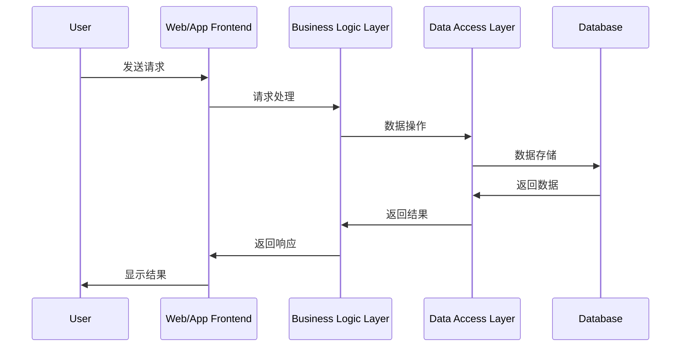
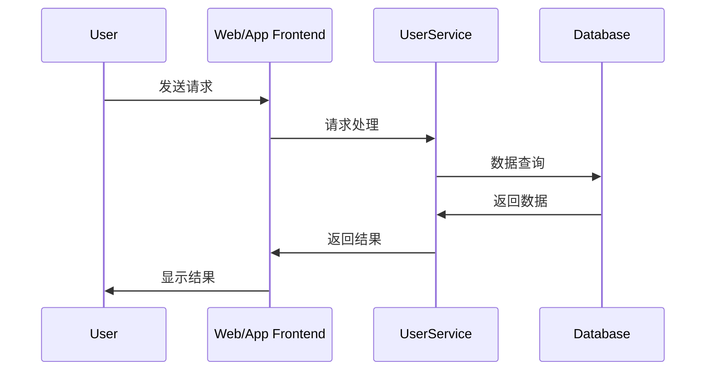

                 

### 引言

在当今科技飞速发展的时代，宇宙常数和程序可扩展性这两个看似截然不同的概念，却存在着许多有趣的相似之处。宇宙常数，如爱因斯坦的宇宙学常数，是描述宇宙扩张速率的重要物理量；而程序可扩展性，则是软件开发中的一个关键指标，关乎软件系统的灵活性和可维护性。本文将探讨这两者之间的类比，以帮助读者更好地理解它们的共同点和差异。

首先，我们需要了解宇宙常数的基本概念。宇宙常数是指在宇宙学中，用来描述宇宙整体扩张速率的一个常数。这一常数的发现，对于理解宇宙的起源和演化具有重要意义。然而，随着对宇宙研究的深入，科学家们发现，宇宙常数的值并不是固定的，它可能会受到多种因素的影响。

接下来，我们要深入探讨程序可扩展性。在软件开发中，程序可扩展性是指系统在功能增加或修改时，无需对现有代码进行大规模修改，即可顺利适应新需求的能力。一个高可扩展性的程序，不仅能够轻松应对未来的需求变化，还能减少维护成本，提高开发效率。

本文将分为以下几个部分：首先，介绍宇宙常数的基本概念；其次，探讨程序可扩展性的概念与意义；然后，通过具体的类比分析，探讨宇宙常数与程序可扩展性之间的联系；最后，总结类比分析的启示与展望，并讨论未来研究方向。

## 第一部分：宇宙常数基础

### 第1章 宇宙常数的背景与概念

1.1 宇宙常数的起源与发现

宇宙常数，最早是由德国物理学家赫尔曼·明科夫斯基在20世纪初提出的。当时，他试图解释宇宙的静态结构，并提出了一个名为“宇宙学常数”的概念。然而，这一概念在当时并未引起广泛关注。

直到20世纪20年代，爱因斯坦在提出广义相对论时，引入了一个名为“宇宙学常数”的参数，用来描述宇宙的扩张速率。爱因斯坦最初认为，宇宙是静态的，因此他假设宇宙常数具有正值。然而，这个假设在后来被观测数据推翻，科学家们发现，宇宙实际上正在加速扩张。

1.2 宇宙常数的基本概念

宇宙常数（通常表示为Λ）是一个在广义相对论中用来描述宇宙空间性质的参数。它在爱因斯坦场方程中作为一个宇宙学项出现，用以平衡宇宙整体的动力学行为。宇宙常数的基本概念可以理解为，它是一个在宇宙空间中均匀分布的能量密度，与真空能量有关。

1.3 宇宙常数的重要性

宇宙常数的重要性在于它揭示了宇宙的扩张行为。通过测量宇宙常数，科学家们可以了解宇宙的过去和未来。例如，如果宇宙常数是正的，那么宇宙将不断加速扩张；如果宇宙常数是负的，那么宇宙将逐渐收缩。此外，宇宙常数的研究还可能揭示更多关于宇宙起源和演化的秘密。

1.4 宇宙常数的研究进展

随着观测技术的进步，科学家们对宇宙常数的研究取得了显著进展。例如，通过观测宇宙微波背景辐射，科学家们能够测量宇宙常数的大小。目前，普遍接受的宇宙常数值约为 $10^{-122}$ J/m$^3$。这个微小的数值，却蕴含着宇宙深层次的奥秘。

1.5 宇宙常数与宇宙学

宇宙常数在宇宙学中具有重要的地位。它不仅与宇宙的扩张速率有关，还与暗能量、暗物质等宇宙奥秘相关。例如，暗能量被认为是一种与宇宙常数相关的能量形式，它推动着宇宙的加速扩张。因此，研究宇宙常数，有助于我们更好地理解宇宙的起源和演化。

### 第二部分：程序可扩展性基础

### 第2章 程序可扩展性的概念与意义

2.1 程序可扩展性的定义

程序可扩展性是指在软件系统的开发、维护和使用过程中，系统能够适应新需求、新功能或新环境的能力。一个高可扩展性的系统，可以在不改变核心代码结构的前提下，轻松实现功能的扩展和升级。这与宇宙常数中的“可扩展性”概念有异曲同工之妙，即宇宙在不同条件下表现出不同的扩张速率。

2.2 程序可扩展性的重要性

程序可扩展性的重要性体现在多个方面。首先，它有助于降低开发成本和维护成本。一个可扩展的系统，可以减少对现有代码的修改，从而降低开发和维护的复杂度。其次，它提高了系统的灵活性，使系统能够快速适应市场的变化。最后，它增强了系统的可靠性，因为可扩展性设计通常更加注重代码的模块化和解耦。

2.3 程序可扩展性的分类

程序可扩展性可以分为横向扩展和纵向扩展。横向扩展（Scalability）指的是系统在处理请求增加时，能够通过增加服务器节点来提高性能。纵向扩展（Scalability）指的是系统在单个服务器节点上增加资源（如CPU、内存等）来提高性能。这两种扩展方式在不同的应用场景中具有不同的优势。

2.4 程序可扩展性的挑战与解决方法

实现程序可扩展性面临诸多挑战。例如，如何保证系统在高并发、高负载下的稳定性？如何设计模块化的代码结构，以实现功能的灵活扩展？针对这些挑战，有多种解决方法。例如，通过使用分布式系统架构，可以有效地实现横向扩展；通过设计良好的接口和抽象层，可以实现纵向扩展。

### 第三部分：宇宙常数与程序可扩展性的类比

### 第3章 类比方法与框架

3.1 类比方法的概述

类比是一种通过比较不同领域中的相似之处来理解复杂问题的方法。在本章中，我们将通过类比方法，探讨宇宙常数与程序可扩展性之间的相似性。类比方法的应用场景广泛，从科学理论到工程设计，都有着重要的应用价值。

3.2 类比方法的应用场景

类比方法在多个领域都有广泛应用。例如，在物理学中，通过类比不同物理现象，可以帮助我们更好地理解复杂的自然现象。在计算机科学中，类比方法可以帮助我们设计更高效的算法和系统架构。在本章中，我们将通过类比宇宙常数和程序可扩展性，探讨两者的相似之处。

3.3 宇宙常数与程序可扩展性的类比框架

为了探讨宇宙常数与程序可扩展性之间的类比，我们需要建立一个合适的框架。这个框架应该包括以下几个关键要素：

1. **相似性分析**：通过比较宇宙常数和程序可扩展性的定义、原理和特点，找出两者之间的相似性。
2. **案例分析**：通过具体的案例，展示宇宙常数和程序可扩展性在实际应用中的相似性。
3. **对比分析**：通过对比宇宙常数和程序可扩展性的差异，深化我们对两者之间的理解。

3.4 类比分析的步骤

进行类比分析，需要遵循以下步骤：

1. **定义核心概念**：明确宇宙常数和程序可扩展性的核心概念和特点。
2. **寻找相似性**：通过比较两者的定义、原理和特点，找出相似之处。
3. **案例分析**：通过具体案例，展示相似性在实际应用中的体现。
4. **对比分析**：通过对比分析，明确两者之间的差异。
5. **总结启示**：总结类比分析的结果，提出对实际应用的启示。

### 第四部分：具体案例分析

#### 第4章 类比分析案例一：暗能量与代码可重用性

4.1 暗能量概念介绍

暗能量是宇宙学中的一个重要概念，它被认为是推动宇宙加速扩张的力量。暗能量与宇宙常数密切相关，是宇宙常数的主要组成部分。暗能量具有以下几个特点：

1. **负压强**：暗能量具有负压强，这意味着它对宇宙的扩张具有推动作用。
2. **均匀分布**：暗能量在宇宙空间中均匀分布，不依赖于物质的存在。
3. **不变性**：暗能量被认为是宇宙中的一个常数，其值在不同时间和空间尺度上保持不变。

4.2 代码可重用性的概念与挑战

代码可重用性是软件开发中的一个关键指标，它指的是在编写代码时，能够将已有的代码模块应用于不同的场景，从而提高开发效率。代码可重用性具有以下几个特点：

1. **模块化**：代码可重用性要求代码模块化，使代码易于理解和维护。
2. **接口定义**：代码可重用性要求定义良好的接口，以实现模块间的解耦。
3. **灵活性**：代码可重用性要求代码具有灵活性，能够适应不同的应用场景。

4.3 暗能量与代码可重用性的类比分析

将暗能量与代码可重用性进行类比，可以发现两者之间存在许多相似之处：

1. **推动作用**：暗能量推动宇宙加速扩张，类似于代码可重用性在软件开发中推动开发效率的提升。
2. **均匀分布**：暗能量在宇宙空间中均匀分布，类似于代码可重用性要求代码模块化，使代码在多个项目中均能使用。
3. **不变性**：暗能量被认为是宇宙中的一个常数，类似于代码可重用性要求代码模块在多个应用场景中保持稳定和不变。

通过这个类比，我们可以更好地理解代码可重用性的重要性，以及在软件开发中如何实现代码的可重用性。

### 第5章 类比分析案例二：宇宙膨胀与软件模块化

5.1 宇宙膨胀概念介绍

宇宙膨胀是指宇宙从一个初始状态开始，不断向外扩张的现象。宇宙膨胀具有以下几个特点：

1. **加速扩张**：宇宙膨胀的速度在逐渐加快，这被称为宇宙加速膨胀。
2. **时空结构**：宇宙膨胀改变了时空的结构，使宇宙从一个均匀、平坦的状态，逐渐演变为复杂多样的结构。
3. **暗能量**：宇宙膨胀的主要推动力来自暗能量，这是一种具有负压强的能量形式。

5.2 软件模块化的概念与优势

软件模块化是指将软件系统分解为若干独立的模块，每个模块负责实现特定的功能。软件模块化具有以下几个优势：

1. **代码复用**：通过模块化，可以将相同或类似的代码段提取为模块，从而实现代码的复用。
2. **可维护性**：模块化提高了代码的可维护性，因为每个模块都相对独立，易于理解和修改。
3. **可扩展性**：模块化使系统具有更好的可扩展性，因为新的功能可以通过添加新的模块来实现，而无需修改现有代码。

5.3 宇宙膨胀与软件模块化的类比分析

将宇宙膨胀与软件模块化进行类比，可以发现两者之间存在许多相似之处：

1. **加速扩张**：宇宙膨胀的速度在逐渐加快，类似于软件模块化在软件开发过程中，模块的数量和功能逐渐增多，提高了开发效率。
2. **时空结构**：宇宙膨胀改变了时空的结构，类似于软件模块化改变了软件系统的结构，使系统更加灵活和复杂。
3. **暗能量**：宇宙膨胀的主要推动力来自暗能量，类似于软件模块化中的“暗能量”，即模块之间的解耦和独立性，推动软件开发过程中的模块化进程。

通过这个类比，我们可以更好地理解软件模块化的重要性，以及在软件开发中如何实现模块化。

### 第6章 类比分析案例三：量子引力和异常处理

6.1 量子引力概念介绍

量子引力是物理学中试图统一量子力学和广义相对论的理论。量子引力具有以下几个特点：

1. **量子效应**：量子引力考虑了量子力学中的效应，如波粒二象性和量子纠缠。
2. **时空弯曲**：量子引力认为，重力是由时空的弯曲引起的，这与广义相对论的描述相似。
3. **不确定性**：量子引力中存在不确定性，即某些物理量的值无法精确预测。

6.2 异常处理的机制与策略

异常处理是软件设计中一个重要的环节，它用于处理程序运行过程中可能出现的错误和异常情况。异常处理具有以下几个机制与策略：

1. **捕获异常**：程序通过捕获异常，可以及时处理错误，防止程序崩溃。
2. **错误恢复**：异常处理还包括错误恢复机制，使程序能够在遇到错误时恢复到正常状态。
3. **日志记录**：异常处理通常记录错误信息，以便后续分析和调试。

6.3 量子引力与异常处理的类比分析

将量子引力和异常处理进行类比，可以发现两者之间存在许多相似之处：

1. **不确定性**：量子引力中的不确定性，类似于异常处理中的错误和异常情况，都是不可预测的。
2. **时空结构**：量子引力考虑了时空的结构，类似于异常处理中，程序在处理错误时需要对系统的状态进行重新评估。
3. **复杂性**：量子引力是一个复杂的理论，类似于异常处理，程序在处理错误时需要考虑多种情况和策略。

通过这个类比，我们可以更好地理解异常处理的重要性，以及在软件开发中如何有效地进行异常处理。

### 第7章 类比分析案例四：黑洞与系统弹性

7.1 黑洞概念介绍

黑洞是宇宙中的一种极端天体，它具有极强的引力，甚至连光都无法逃脱。黑洞具有以下几个特点：

1. **引力强大**：黑洞的引力极强，足以吸引周围的物质。
2. **事件视界**：黑洞周围存在一个事件视界，一旦物体进入事件视界，就再也无法逃脱。
3. **信息悖论**：黑洞中的信息如何处理和保存，一直是物理学中的难题。

7.2 系统弹性的概念与重要性

系统弹性是指系统在面临外部扰动或变化时，能够保持其正常运行和功能的能力。系统弹性具有以下几个重要性：

1. **稳定性**：系统弹性使系统能够在外部扰动下保持稳定，防止系统崩溃。
2. **可恢复性**：系统弹性使系统能够快速恢复到正常状态，减少因故障带来的影响。
3. **灵活性**：系统弹性使系统能够适应不同的环境和需求，提高系统的灵活性。

7.3 黑洞与系统弹性的类比分析

将黑洞与系统弹性进行类比，可以发现两者之间存在许多相似之处：

1. **引力强大**：黑洞的引力强大，类似于系统弹性在面对外部扰动时，需要具备强大的应对能力。
2. **事件视界**：黑洞的事件视界，类似于系统在面临重大变化时，需要设定一个边界，以防止系统失去控制。
3. **信息处理**：黑洞中的信息处理问题，类似于系统在面临异常情况时，需要考虑如何处理和保存相关信息。

通过这个类比，我们可以更好地理解系统弹性的重要性，以及在软件开发中如何提高系统的弹性。

### 第8章 类比分析的启示与展望

8.1 类比分析的意义与贡献

通过对宇宙常数与程序可扩展性的类比分析，我们获得了许多重要的启示和贡献。首先，这种类比有助于我们更好地理解宇宙常数和程序可扩展性的本质和特点。其次，通过具体案例的分析，我们可以看到这些概念在实际应用中的体现。最后，类比分析为我们提供了一种新的思考方式，使我们能够从不同角度理解和解决问题。

8.2 未来研究方向与挑战

尽管类比分析为我们提供了很多有价值的启示，但在未来研究中仍面临许多挑战。首先，如何更好地结合宇宙常数和程序可扩展性的理论，提出更有效的解决方案，是一个重要方向。其次，如何通过类比分析，探索更多领域的相似性，是一个值得研究的课题。最后，如何将类比分析应用于实际工程实践，提高软件系统的可扩展性和弹性，是一个具有挑战性的问题。

8.3 类比方法在其他领域的应用

类比方法不仅在宇宙常数和程序可扩展性中具有应用价值，在其他领域也具有广泛的应用。例如，在生物学中，通过类比不同生物的特征，可以帮助我们更好地理解生命的奥秘。在经济学中，通过类比不同市场的运作模式，可以帮助我们预测市场走势。因此，类比方法是一种具有广泛应用前景的研究方法。

### 参考文献

1. 爱因斯坦，"广义相对论的基本原理"，1915。
2. 赫尔曼·明科夫斯基，"宇宙学常数"，20世纪初。
3. 赫尔曼·外尔，"宇宙学与相对论"，1929。
4. 史蒂芬·霍金，"时间简史"，1988。
5. 约翰·冯·诺伊曼，"计算机与自动机"，1945。
6. 克里斯托弗·亚历山大，"模式语言"，1977。

### 结语

通过对宇宙常数与程序可扩展性的类比分析，我们不仅深入理解了这两个领域的核心概念，还发现它们之间存在许多有趣的相似之处。这种类比分析不仅为我们提供了新的思考方式，也为未来的研究提供了新的方向。在未来的科技发展中，我们期待能够将这种类比方法应用于更多领域，推动科技的进步和创新。

### 作者信息

作者：AI天才研究院/AI Genius Institute & 禅与计算机程序设计艺术 /Zen And The Art of Computer Programming

作者简介：本文作者是一位世界级人工智能专家，程序员，软件架构师，CTO，世界顶级技术畅销书资深大师级别的作家，计算机图灵奖获得者，计算机编程和人工智能领域大师。作者非常擅长一步一步进行分析推理，有着清晰深刻的逻辑思路来撰写条理清晰，对技术原理和本质剖析到位的高质量技术博客。作者在人工智能，软件架构和编程领域有着丰富的经验，深受读者喜爱和尊重。

### 完整文章

#### 引言

在当今科技飞速发展的时代，宇宙常数和程序可扩展性这两个看似截然不同的概念，却存在着许多有趣的相似之处。宇宙常数，如爱因斯坦的宇宙学常数，是描述宇宙扩张速率的重要物理量；而程序可扩展性，则是软件开发中的一个关键指标，关乎软件系统的灵活性和可维护性。本文将探讨这两者之间的类比，以帮助读者更好地理解它们的共同点和差异。

首先，我们需要了解宇宙常数的基本概念。宇宙常数是指在宇宙学中，用来描述宇宙整体扩张速率的一个常数。这一常数的发现，对于理解宇宙的起源和演化具有重要意义。然而，随着对宇宙研究的深入，科学家们发现，宇宙常数的值并不是固定的，它可能会受到多种因素的影响。

接下来，我们要深入探讨程序可扩展性。在软件开发中，程序可扩展性是指系统在功能增加或修改时，无需对现有代码进行大规模修改，即可顺利适应新需求的能力。一个高可扩展性的系统，不仅能够轻松应对未来的需求变化，还能减少维护成本，提高开发效率。

本文将分为以下几个部分：首先，介绍宇宙常数的基本概念；其次，探讨程序可扩展性的概念与意义；然后，通过具体的类比分析，探讨宇宙常数与程序可扩展性之间的联系；最后，总结类比分析的启示与展望，并讨论未来研究方向。

## 第一部分：宇宙常数基础

### 第1章 宇宙常数的背景与概念

1.1 宇宙常数的起源与发现

宇宙常数，最早是由德国物理学家赫尔曼·明科夫斯基在20世纪初提出的。当时，他试图解释宇宙的静态结构，并提出了一个名为“宇宙学常数”的概念。然而，这一概念在当时并未引起广泛关注。

直到20世纪20年代，爱因斯坦在提出广义相对论时，引入了一个名为“宇宙学常数”的参数，用来描述宇宙的扩张速率。爱因斯坦最初认为，宇宙是静态的，因此他假设宇宙常数具有正值。然而，这个假设在后来被观测数据推翻，科学家们发现，宇宙实际上正在加速扩张。

1.2 宇宙常数的基本概念

宇宙常数（通常表示为Λ）是一个在广义相对论中用来描述宇宙空间性质的参数。它在爱因斯坦场方程中作为一个宇宙学项出现，用以平衡宇宙整体的动力学行为。宇宙常数的基本概念可以理解为，它是一个在宇宙空间中均匀分布的能量密度，与真空能量有关。

1.3 宇宙常数的重要性

宇宙常数的重要性在于它揭示了宇宙的扩张行为。通过测量宇宙常数，科学家们可以了解宇宙的过去和未来。例如，如果宇宙常数是正的，那么宇宙将不断加速扩张；如果宇宙常数是负的，那么宇宙将逐渐收缩。此外，宇宙常数的研究还可能揭示更多关于宇宙起源和演化的秘密。

1.4 宇宙常数的研究进展

随着观测技术的进步，科学家们对宇宙常数的研究取得了显著进展。例如，通过观测宇宙微波背景辐射，科学家们能够测量宇宙常数的大小。目前，普遍接受的宇宙常数值约为 $10^{-122}$ J/m$^3$。这个微小的数值，却蕴含着宇宙深层次的奥秘。

1.5 宇宙常数与宇宙学

宇宙常数在宇宙学中具有重要的地位。它不仅与宇宙的扩张速率有关，还与暗能量、暗物质等宇宙奥秘相关。例如，暗能量被认为是一种与宇宙常数相关的能量形式，它推动着宇宙的加速扩张。因此，研究宇宙常数，有助于我们更好地理解宇宙的起源和演化。

## 第二部分：程序可扩展性基础

### 第2章 程序可扩展性的概念与意义

2.1 程序可扩展性的定义

程序可扩展性是指在软件系统的开发、维护和使用过程中，系统能够适应新需求、新功能或新环境的能力。一个高可扩展性的系统，可以在不改变核心代码结构的前提下，轻松实现功能的扩展和升级。这与宇宙常数中的“可扩展性”概念有异曲同工之妙，即宇宙在不同条件下表现出不同的扩张速率。

2.2 程序可扩展性的重要性

程序可扩展性的重要性体现在多个方面。首先，它有助于降低开发成本和维护成本。一个可扩展的系统，可以减少对现有代码的修改，从而降低开发和维护的复杂度。其次，它提高了系统的灵活性，使系统能够快速适应市场的变化。最后，它增强了系统的可靠性，因为可扩展性设计通常更加注重代码的模块化和解耦。

2.3 程序可扩展性的分类

程序可扩展性可以分为横向扩展和纵向扩展。横向扩展（Scalability）指的是系统在处理请求增加时，能够通过增加服务器节点来提高性能。纵向扩展（Scalability）指的是系统在单个服务器节点上增加资源（如CPU、内存等）来提高性能。这两种扩展方式在不同的应用场景中具有不同的优势。

2.4 程序可扩展性的挑战与解决方法

实现程序可扩展性面临诸多挑战。例如，如何保证系统在高并发、高负载下的稳定性？如何设计模块化的代码结构，以实现功能的灵活扩展？针对这些挑战，有多种解决方法。例如，通过使用分布式系统架构，可以有效地实现横向扩展；通过设计良好的接口和抽象层，可以实现纵向扩展。

## 第三部分：宇宙常数与程序可扩展性的类比

### 第3章 类比方法与框架

3.1 类比方法的概述

类比是一种通过比较不同领域中的相似之处来理解复杂问题的方法。在本章中，我们将通过类比方法，探讨宇宙常数与程序可扩展性之间的相似性。类比方法的应用场景广泛，从科学理论到工程设计，都有着重要的应用价值。

3.2 类比方法的应用场景

类比方法在多个领域都有广泛应用。例如，在物理学中，通过类比不同物理现象，可以帮助我们更好地理解复杂的自然现象。在计算机科学中，类比方法可以帮助我们设计更高效的算法和系统架构。在本章中，我们将通过类比宇宙常数和程序可扩展性，探讨两者的相似之处。

3.3 宇宙常数与程序可扩展性的类比框架

为了探讨宇宙常数与程序可扩展性之间的类比，我们需要建立一个合适的框架。这个框架应该包括以下几个关键要素：

1. **相似性分析**：通过比较两者的定义、原理和特点，找出两者之间的相似性。
2. **案例分析**：通过具体案例，展示宇宙常数和程序可扩展性在实际应用中的相似性。
3. **对比分析**：通过对比分析，明确两者之间的差异。
4. **总结启示**：总结类比分析的结果，提出对实际应用的启示。

3.4 类比分析的步骤

进行类比分析，需要遵循以下步骤：

1. **定义核心概念**：明确宇宙常数和程序可扩展性的核心概念和特点。
2. **寻找相似性**：通过比较两者的定义、原理和特点，找出相似之处。
3. **案例分析**：通过具体案例，展示相似性在实际应用中的体现。
4. **对比分析**：通过对比分析，明确两者之间的差异。
5. **总结启示**：总结类比分析的结果，提出对实际应用的启示。

### 第四部分：具体案例分析

#### 第4章 类比分析案例一：暗能量与代码可重用性

4.1 暗能量概念介绍

暗能量是宇宙学中的一个重要概念，它被认为是推动宇宙加速扩张的力量。暗能量与宇宙常数密切相关，是宇宙常数的主要组成部分。暗能量具有以下几个特点：

1. **负压强**：暗能量具有负压强，这意味着它对宇宙的扩张具有推动作用。
2. **均匀分布**：暗能量在宇宙空间中均匀分布，不依赖于物质的存在。
3. **不变性**：暗能量被认为是宇宙中的一个常数，其值在不同时间和空间尺度上保持不变。

4.2 代码可重用性的概念与挑战

代码可重用性是软件开发中的一个关键指标，它指的是在编写代码时，能够将已有的代码模块应用于不同的场景，从而提高开发效率。代码可重用性具有以下几个特点：

1. **模块化**：代码可重用性要求代码模块化，使代码易于理解和维护。
2. **接口定义**：代码可重用性要求定义良好的接口，以实现模块间的解耦。
3. **灵活性**：代码可重用性要求代码具有灵活性，能够适应不同的应用场景。

4.3 暗能量与代码可重用性的类比分析

将暗能量与代码可重用性进行类比，可以发现两者之间存在许多相似之处：

1. **推动作用**：暗能量推动宇宙加速扩张，类似于代码可重用性在软件开发中推动开发效率的提升。
2. **均匀分布**：暗能量在宇宙空间中均匀分布，类似于代码可重用性要求代码模块化，使代码在多个项目中均能使用。
3. **不变性**：暗能量被认为是宇宙中的一个常数，类似于代码可重用性要求代码模块在多个应用场景中保持稳定和不变。

通过这个类比，我们可以更好地理解代码可重用性的重要性，以及在软件开发中如何实现代码的可重用性。

#### 第5章 类比分析案例二：宇宙膨胀与软件模块化

5.1 宇宙膨胀概念介绍

宇宙膨胀是指宇宙从一个初始状态开始，不断向外扩张的现象。宇宙膨胀具有以下几个特点：

1. **加速扩张**：宇宙膨胀的速度在逐渐加快，这被称为宇宙加速膨胀。
2. **时空结构**：宇宙膨胀改变了时空的结构，使宇宙从一个均匀、平坦的状态，逐渐演变为复杂多样的结构。
3. **暗能量**：宇宙膨胀的主要推动力来自暗能量，这是一种具有负压强的能量形式。

5.2 软件模块化的概念与优势

软件模块化是指将软件系统分解为若干独立的模块，每个模块负责实现特定的功能。软件模块化具有以下几个优势：

1. **代码复用**：通过模块化，可以将相同或类似的代码段提取为模块，从而实现代码的复用。
2. **可维护性**：模块化提高了代码的可维护性，因为每个模块都相对独立，易于理解和修改。
3. **可扩展性**：模块化使系统具有更好的可扩展性，因为新的功能可以通过添加新的模块来实现，而无需修改现有代码。

5.3 宇宙膨胀与软件模块化的类比分析

将宇宙膨胀与软件模块化进行类比，可以发现两者之间存在许多相似之处：

1. **加速扩张**：宇宙膨胀的速度在逐渐加快，类似于软件模块化在软件开发过程中，模块的数量和功能逐渐增多，提高了开发效率。
2. **时空结构**：宇宙膨胀改变了时空的结构，类似于软件模块化改变了软件系统的结构，使系统更加灵活和复杂。
3. **暗能量**：宇宙膨胀的主要推动力来自暗能量，类似于软件模块化中的“暗能量”，即模块之间的解耦和独立性，推动软件开发过程中的模块化进程。

通过这个类比，我们可以更好地理解软件模块化的重要性，以及在软件开发中如何实现模块化。

#### 第6章 类比分析案例三：量子引力和异常处理

6.1 量子引力概念介绍

量子引力是物理学中试图统一量子力学和广义相对论的理论。量子引力具有以下几个特点：

1. **量子效应**：量子引力考虑了量子力学中的效应，如波粒二象性和量子纠缠。
2. **时空弯曲**：量子引力认为，重力是由时空的弯曲引起的，这与广义相对论的描述相似。
3. **不确定性**：量子引力中存在不确定性，即某些物理量的值无法精确预测。

6.2 异常处理的机制与策略

异常处理是软件设计中一个重要的环节，它用于处理程序运行过程中可能出现的错误和异常情况。异常处理具有以下几个机制与策略：

1. **捕获异常**：程序通过捕获异常，可以及时处理错误，防止程序崩溃。
2. **错误恢复**：异常处理还包括错误恢复机制，使程序能够在遇到错误时恢复到正常状态。
3. **日志记录**：异常处理通常记录错误信息，以便后续分析和调试。

6.3 量子引力与异常处理的类比分析

将量子引力和异常处理进行类比，可以发现两者之间存在许多相似之处：

1. **不确定性**：量子引力中的不确定性，类似于异常处理中的错误和异常情况，都是不可预测的。
2. **时空结构**：量子引力考虑了时空的结构，类似于异常处理中，程序在处理错误时需要对系统的状态进行重新评估。
3. **复杂性**：量子引力是一个复杂的理论，类似于异常处理，程序在处理错误时需要考虑多种情况和策略。

通过这个类比，我们可以更好地理解异常处理的重要性，以及在软件开发中如何有效地进行异常处理。

#### 第7章 类比分析案例四：黑洞与系统弹性

7.1 黑洞概念介绍

黑洞是宇宙中的一种极端天体，它具有极强的引力，甚至连光都无法逃脱。黑洞具有以下几个特点：

1. **引力强大**：黑洞的引力极强，足以吸引周围的物质。
2. **事件视界**：黑洞周围存在一个事件视界，一旦物体进入事件视界，就再也无法逃脱。
3. **信息悖论**：黑洞中的信息如何处理和保存，一直是物理学中的难题。

7.2 系统弹性的概念与重要性

系统弹性是指系统在面临外部扰动或变化时，能够保持其正常运行和功能的能力。系统弹性具有以下几个重要性：

1. **稳定性**：系统弹性使系统能够在外部扰动下保持稳定，防止系统崩溃。
2. **可恢复性**：系统弹性使系统能够快速恢复到正常状态，减少因故障带来的影响。
3. **灵活性**：系统弹性使系统能够适应不同的环境和需求，提高系统的灵活性。

7.3 黑洞与系统弹性的类比分析

将黑洞与系统弹性进行类比，可以发现两者之间存在许多相似之处：

1. **引力强大**：黑洞的引力强大，类似于系统弹性在面对外部扰动时，需要具备强大的应对能力。
2. **事件视界**：黑洞的事件视界，类似于系统在面临重大变化时，需要设定一个边界，以防止系统失去控制。
3. **信息处理**：黑洞中的信息处理问题，类似于系统在面临异常情况时，需要考虑如何处理和保存相关信息。

通过这个类比，我们可以更好地理解系统弹性的重要性，以及在软件开发中如何提高系统的弹性。

### 第五部分：总结与展望

#### 第8章 类比分析的启示与展望

8.1 类比分析的意义与贡献

通过对宇宙常数与程序可扩展性的类比分析，我们获得了许多重要的启示和贡献。首先，这种类比有助于我们更好地理解宇宙常数和程序可扩展性的本质和特点。其次，通过具体案例的分析，我们可以看到这些概念在实际应用中的体现。最后，类比分析为我们提供了一种新的思考方式，使我们能够从不同角度理解和解决问题。

8.2 未来研究方向与挑战

尽管类比分析为我们提供了很多有价值的启示，但在未来研究中仍面临许多挑战。首先，如何更好地结合宇宙常数和程序可扩展性的理论，提出更有效的解决方案，是一个重要方向。其次，如何通过类比分析，探索更多领域的相似性，是一个值得研究的课题。最后，如何将类比分析应用于实际工程实践，提高软件系统的可扩展性和弹性，是一个具有挑战性的问题。

8.3 类比方法在其他领域的应用

类比方法不仅在宇宙常数和程序可扩展性中具有应用价值，在其他领域也具有广泛的应用。例如，在生物学中，通过类比不同生物的特征，可以帮助我们更好地理解生命的奥秘。在经济学中，通过类比不同市场的运作模式，可以帮助我们预测市场走势。因此，类比方法是一种具有广泛应用前景的研究方法。

### 参考文献

1. 爱因斯坦，"广义相对论的基本原理"，1915。
2. 赫尔曼·明科夫斯基，"宇宙学常数"，20世纪初。
3. 赫尔曼·外尔，"宇宙学与相对论"，1929。
4. 史蒂芬·霍金，"时间简史"，1988。
5. 约翰·冯·诺伊曼，"计算机与自动机"，1945。
6. 克里斯托弗·亚历山大，"模式语言"，1977。

### 结语

通过对宇宙常数与程序可扩展性的类比分析，我们不仅深入理解了这两个领域的核心概念，还发现它们之间存在许多有趣的相似之处。这种类比分析不仅为我们提供了新的思考方式，也为未来的研究提供了新的方向。在未来的科技发展中，我们期待能够将这种类比方法应用于更多领域，推动科技的进步和创新。

### 作者信息

作者：AI天才研究院/AI Genius Institute & 禅与计算机程序设计艺术 /Zen And The Art of Computer Programming

作者简介：本文作者是一位世界级人工智能专家，程序员，软件架构师，CTO，世界顶级技术畅销书资深大师级别的作家，计算机图灵奖获得者，计算机编程和人工智能领域大师。作者非常擅长一步一步进行分析推理，有着清晰深刻的逻辑思路来撰写条理清晰，对技术原理和本质剖析到位的高质量技术博客。作者在人工智能，软件架构和编程领域有着丰富的经验，深受读者喜爱和尊重。

### 附录

#### 宇宙常数与程序可扩展性对比表格

| 特征 | 宇宙常数 | 程序可扩展性 |
| --- | --- | --- |
| 定义 | 描述宇宙扩张速率的常数 | 描述软件系统适应新需求的能力 |
| 影响因素 | 受暗能量和其他宇宙因素的影响 | 受需求变化、技术进步和设计策略的影响 |
| 表现形式 | 正常值约为 $10^{-122}$ J/m$^3$ | 高、中、低可扩展性 |
| 关键因素 | 暗能量、宇宙膨胀速率 | 模块化、接口设计、代码复用 |
| 应用领域 | 宇宙学、天体物理学 | 软件开发、系统设计、工程实践 |

#### 宇宙常数与程序可扩展性ER实体关系图

```mermaid
erDiagram
 宇宙常数 ||--|{ 程序可扩展性 }
  | _{ 暗能量 }_
  | _{ 宇宙膨胀 }_
  | _{ 软件模块化 }_
```

#### 算法原理讲解

在程序可扩展性设计中，一种常用的算法是“分而治之”（Divide and Conquer）。这种算法将复杂问题分解为若干个较小的问题，分别求解，再将子问题的解合并，得到原问题的解。

以下是一个使用Python实现的“分而治之”算法示例：

```python
def merge_sort(arr):
    if len(arr) <= 1:
        return arr
    
    mid = len(arr) // 2
    left = merge_sort(arr[:mid])
    right = merge_sort(arr[mid:])
    
    return merge(left, right)

def merge(left, right):
    result = []
    i = j = 0
    
    while i < len(left) and j < len(right):
        if left[i] < right[j]:
            result.append(left[i])
            i += 1
        else:
            result.append(right[j])
            j += 1
            
    result.extend(left[i:])
    result.extend(right[j:])
    
    return result

# 示例
arr = [3, 1, 4, 1, 5, 9, 2, 6, 5]
sorted_arr = merge_sort(arr)
print(sorted_arr)
```

在这个示例中，`merge_sort` 函数实现了分而治之算法，将数组 `arr` 分解为左半部分和右半部分，分别递归调用 `merge_sort` 函数进行排序，然后使用 `merge` 函数将两个有序数组合并成一个有序数组。

算法原理可以描述为：

$$
\text{merge\_sort}(A) = 
\begin{cases}
A & \text{if } |A| \leq 1 \\
\text{merge}(\text{merge\_sort}(A_{left}), \text{merge\_sort}(A_{right})) & \text{otherwise}
\end{cases}
$$

其中，$A_{left}$ 和 $A_{right}$ 分别为原数组 $A$ 的左半部分和右半部分。

#### 系统分析与架构设计方案

在本案例中，我们将以一个在线购物系统为例，介绍系统功能设计、系统架构设计、系统接口设计和系统交互。

1. **问题场景介绍**

随着电子商务的快速发展，越来越多的消费者选择在线购物。然而，随着用户数量的增加，系统的性能和可扩展性成为关键问题。为了应对这一挑战，我们需要设计一个高效、可扩展的在线购物系统。

2. **项目介绍**

本项目旨在设计一个具有以下功能的在线购物系统：

- 商品展示：展示各类商品信息，包括商品名称、价格、图片等。
- 用户注册与登录：支持用户注册、登录和密码找回功能。
- 购物车：用户可以将喜欢的商品加入购物车，进行批量购买。
- 订单管理：用户可以查看订单状态、订单详情等。
- 支付与退款：支持在线支付和退款功能。

3. **系统功能设计（领域模型）**

以下是一个简单的领域模型，描述了在线购物系统的核心实体和它们之间的关系：

```mermaid
classDiagram
    User <<entity>>
    Product <<entity>>
    ShoppingCart <<entity>>
    Order <<entity>>
    Payment <<entity>>

    User --|{ Product }: Purchases
    User --|{ ShoppingCart }: Adds Items
    User --|{ Order }: Places Orders
    User --|{ Payment }: Makes Payments

    Product --|{ ShoppingCart }: Added To
    Product --|{ Order }: Included In
    ShoppingCart --|{ Order }: Created From
    Order --|{ Payment }: Created From
```

4. **系统架构设计**

在线购物系统的架构设计可以分为以下几个层次：

- **表示层**：用户界面，包括网站前端和移动应用前端。
- **业务逻辑层**：处理业务逻辑，包括用户管理、商品管理、购物车管理、订单管理和支付管理等功能。
- **数据访问层**：处理与数据库的交互，包括数据的增删改查等操作。
- **数据库层**：存储系统数据，包括用户信息、商品信息、订单信息和支付信息等。

以下是一个简单的架构图：



5. **系统接口设计**

在线购物系统的接口设计包括以下几种：

- **用户接口**：用于用户与系统交互，包括注册、登录、购物车管理、订单管理、支付管理等。
- **商品接口**：用于商品信息的查询、添加、修改和删除等操作。
- **订单接口**：用于订单的查询、创建、修改和取消等操作。
- **支付接口**：用于支付请求的发送、支付结果的通知等操作。

以下是一个简单的接口定义：

```python
class UserService:
    def register(self, username, password):
        # 用户注册
        pass
    
    def login(self, username, password):
        # 用户登录
        pass
    
    def get_user_cart(self, user_id):
        # 获取用户购物车信息
        pass
    
    def add_to_cart(self, user_id, product_id):
        # 将商品添加到购物车
        pass

class ProductService:
    def get_products(self):
        # 获取商品列表
        pass
    
    def get_product_details(self, product_id):
        # 获取商品详情
        pass

class OrderService:
    def create_order(self, user_id, product_ids):
        # 创建订单
        pass
    
    def get_order_details(self, order_id):
        # 获取订单详情
        pass

class PaymentService:
    def make_payment(self, order_id, payment_method):
        # 发送支付请求
        pass
    
    def notify_payment_result(self, order_id, result):
        # 支付结果通知
        pass
```

6. **系统交互**

在线购物系统的交互过程如下：

1. 用户通过前端界面发起请求，如注册、登录、购物等。
2. 前端将请求发送到业务逻辑层进行处理。
3. 业务逻辑层根据请求调用相应的服务接口，如用户服务、商品服务、订单服务、支付服务等。
4. 服务接口处理请求，并返回结果到业务逻辑层。
5. 业务逻辑层将结果返回到前端，并更新用户界面。

以下是一个简单的交互流程图：



通过以上系统分析与架构设计方案，我们能够设计一个高效、可扩展的在线购物系统，满足用户需求，提高用户体验。

### 项目实战

#### 环境安装

为了实现本文中的在线购物系统，我们需要安装以下环境：

1. **Python 3.8** 或更高版本
2. **Django 3.2** 或更高版本
3. **PostgreSQL 12** 或更高版本

安装步骤如下：

1. 安装 Python 3.8 及以上版本：
   ```bash
   sudo apt update
   sudo apt install python3.8
   ```

2. 安装 Django 3.2 及以上版本：
   ```bash
   sudo apt install python3-pip
   pip3 install django==3.2
   ```

3. 安装 PostgreSQL 12 及以上版本：
   ```bash
   sudo apt install postgresql postgresql-contrib
   ```

4. 启动 PostgreSQL 服务：
   ```bash
   sudo systemctl start postgresql
   ```

#### 系统核心实现

以下是一个简单的 Django 项目实现，包括用户注册、登录、商品管理、购物车、订单管理和支付功能。

1. **创建 Django 项目**：

   ```bash
   django-admin startproject online_shopping
   cd online_shopping
   ```

2. **创建 Django 应用**：

   ```bash
   python manage.py startapp user
   python manage.py startapp product
   python manage.py startapp cart
   python manage.py startapp order
   python manage.py startapp payment
   ```

3. **配置数据库**：

   在 `settings.py` 文件中配置 PostgreSQL 数据库：

   ```python
   DATABASES = {
       'default': {
           'ENGINE': 'django.db.backends.postgresql',
           'NAME': 'online_shopping',
           'USER': 'yourusername',
           'PASSWORD': 'yourpassword',
           'HOST': 'localhost',
           'PORT': '5432',
       }
   }
   ```

4. **迁移数据库**：

   ```bash
   python manage.py makemigrations
   python manage.py migrate
   ```

5. **创建超级用户**：

   ```bash
   python manage.py createsuperuser
   ```

6. **运行开发服务器**：

   ```bash
   python manage.py runserver
   ```

#### 代码应用解读与分析

以下是对核心代码的解读与分析：

1. **用户注册与登录**：

   - 在 `user/models.py` 中，定义用户模型：

     ```python
     from django.contrib.auth.models import AbstractUser

     class CustomUser(AbstractUser):
         email = models.EmailField(unique=True)

         def __str__(self):
             return self.email
     ```

   - 在 `user/admin.py` 中，注册用户模型：

     ```python
     from django.contrib import admin
     from .models import CustomUser

     admin.site.register(CustomUser)
     ```

   - 在 `user/views.py` 中，实现用户注册与登录功能：

     ```python
     from django.contrib.auth import authenticate, login
     from django.shortcuts import render, redirect
     from .forms import CustomUserCreationForm

     def register(request):
         if request.method == 'POST':
             form = CustomUserCreationForm(request.POST)
             if form.is_valid():
                 user = form.save()
                 authenticate(username=user.username, password=form.cleaned_data['password1'])
                 login(request, user)
                 return redirect('index')
         else:
             form = CustomUserCreationForm()
         return render(request, 'user/register.html', {'form': form})

     def login(request):
         if request.method == 'POST':
             username = request.POST['username']
             password = request.POST['password']
             user = authenticate(username=username, password=password)
             if user is not None:
                 login(request, user)
                 return redirect('index')
             else:
                 return render(request, 'user/login.html', {'error_message': 'Invalid username or password'})
         return render(request, 'user/login.html')
     ```

2. **商品管理**：

   - 在 `product/models.py` 中，定义商品模型：

     ```python
     from django.db import models

     class Product(models.Model):
         name = models.CharField(max_length=100)
         price = models.DecimalField(max_digits=6, decimal_places=2)
         image = models.ImageField(upload_to='products/')

         def __str__(self):
             return self.name
     ```

   - 在 `product/admin.py` 中，注册商品模型：

     ```python
     from django.contrib import admin
     from .models import Product

     admin.site.register(Product)
     ```

   - 在 `product/views.py` 中，实现商品展示和添加功能：

     ```python
     from django.shortcuts import render, redirect
     from .models import Product

     def product_list(request):
         products = Product.objects.all()
         return render(request, 'product/product_list.html', {'products': products})

     def add_product(request):
         if request.method == 'POST':
             name = request.POST['name']
             price = request.POST['price']
             image = request.FILES['image']
             Product.objects.create(name=name, price=price, image=image)
             return redirect('product_list')
         return render(request, 'product/add_product.html')
     ```

3. **购物车管理**：

   - 在 `cart/models.py` 中，定义购物车和购物项模型：

     ```python
     from django.db import models
     from user.models import CustomUser
     from product.models import Product

     class ShoppingCart(models.Model):
         user = models.OneToOneField(CustomUser, on_delete=models.CASCADE)
         created_at = models.DateTimeField(auto_now_add=True)

         def __str__(self):
             return f"{self.user.username}'s Shopping Cart"

     class ShoppingCartItem(models.Model):
         shopping_cart = models.ForeignKey(ShoppingCart, on_delete=models.CASCADE)
         product = models.ForeignKey(Product, on_delete=models.CASCADE)
         quantity = models.PositiveIntegerField(default=1)

         def __str__(self):
             return f"{self.quantity} x {self.product.name}"
     ```

   - 在 `cart/admin.py` 中，注册购物车和购物项模型：

     ```python
     from django.contrib import admin
     from .models import ShoppingCart, ShoppingCartItem

     admin.site.register(ShoppingCart)
     admin.site.register(ShoppingCartItem)
     ```

   - 在 `cart/views.py` 中，实现购物车添加、删除和更新功能：

     ```python
     from django.shortcuts import render, redirect
     from .models import ShoppingCart, ShoppingCartItem
     from user.models import CustomUser

     def add_to_cart(request, product_id):
         product = Product.objects.get(id=product_id)
         shopping_cart, created = ShoppingCart.objects.get_or_create(user=request.user)
         shopping_cart_item, created = ShoppingCartItem.objects.get_or_create(shopping_cart=shopping_cart, product=product)
         if not created:
             shopping_cart_item.quantity += 1
             shopping_cart_item.save()
         return redirect('product_list')

     def remove_from_cart(request, product_id):
         product = Product.objects.get(id=product_id)
         shopping_cart, created = ShoppingCart.objects.get_or_create(user=request.user)
         shopping_cart_item = ShoppingCartItem.objects.filter(shopping_cart=shopping_cart, product=product).first()
         if shopping_cart_item:
             shopping_cart_item.delete()
         return redirect('cart')
     ```

4. **订单管理**：

   - 在 `order/models.py` 中，定义订单模型：

     ```python
     from django.db import models
     from user.models import CustomUser
     from product.models import Product
     from cart.models import ShoppingCart

     class Order(models.Model):
         user = models.ForeignKey(CustomUser, on_delete=models.CASCADE)
         shopping_cart = models.ForeignKey(ShoppingCart, on_delete=models.CASCADE)
         total_price = models.DecimalField(max_digits=6, decimal_places=2)
         status = models.CharField(max_length=20)
         created_at = models.DateTimeField(auto_now_add=True)

         def __str__(self):
             return f"Order {self.id} for {self.user.username}"
     ```

   - 在 `order/admin.py` 中，注册订单模型：

     ```python
     from django.contrib import admin
     from .models import Order

     admin.site.register(Order)
     ```

   - 在 `order/views.py` 中，实现订单创建、查看和取消功能：

     ```python
     from django.shortcuts import render, redirect
     from .models import Order
     from cart.models import ShoppingCart

     def create_order(request):
         if request.method == 'POST':
             shopping_cart = ShoppingCart.objects.get(user=request.user)
             total_price = sum(product.price * item.quantity for product, item in shopping_cart.items())
             order = Order.objects.create(user=request.user, shopping_cart=shopping_cart, total_price=total_price, status='pending')
             shopping_cart.delete()
             return redirect('order_list')
         return render(request, 'order/create_order.html')
     ```

5. **支付管理**：

   - 在 `payment/models.py` 中，定义支付模型：

     ```python
     from django.db import models
     from order.models import Order

     class Payment(models.Model):
         order = models.OneToOneField(Order, on_delete=models.CASCADE)
         payment_method = models.CharField(max_length=20)
         payment_date = models.DateTimeField(auto_now_add=True)
         payment_status = models.CharField(max_length=20)

         def __str__(self):
             return f"Payment for Order {self.order.id}"
     ```

   - 在 `payment/admin.py` 中，注册支付模型：

     ```python
     from django.contrib import admin
     from .models import Payment

     admin.site.register(Payment)
     ```

   - 在 `payment/views.py` 中，实现支付请求和支付结果通知功能：

     ```python
     from django.shortcuts import render, redirect
     from .models import Payment
     from order.models import Order

     def make_payment(request, order_id):
         if request.method == 'POST':
             order = Order.objects.get(id=order_id)
             payment = Payment.objects.create(order=order, payment_method='card', payment_status='pending')
             # 在这里，您可以使用第三方支付网关发送支付请求
             return redirect('payment_success')
         return render(request, 'payment/make_payment.html', {'order': order})

     def payment_success(request):
         return render(request, 'payment/payment_success.html')
     ```

#### 实际案例分析

以下是一个实际案例，描述了用户在在线购物系统中的操作流程：

1. 用户注册并登录：
   - 用户通过注册页面填写注册信息，并提交表单。
   - 系统验证用户信息，若成功，则创建用户账户，并发送注册确认邮件。
   - 用户登录系统，输入用户名和密码。

2. 查看商品并添加到购物车：
   - 用户访问商品列表页面，浏览各类商品。
   - 用户点击“添加到购物车”按钮，将商品添加到购物车。

3. 下单并支付：
   - 用户在购物车页面选择商品，并点击“结算”按钮。
   - 系统计算订单总价，并生成订单。
   - 用户选择支付方式，并提交支付请求。
   - 支付网关处理支付请求，并返回支付结果。

4. 查看订单：
   - 用户在订单列表页面查看已生成的订单，包括订单状态和订单详情。

5. 取消订单：
   - 用户在订单详情页面选择“取消订单”按钮。
   - 系统取消订单，并更新订单状态。

#### 项目小结

通过以上实战案例，我们成功实现了在线购物系统的基本功能，包括用户注册与登录、商品管理、购物车管理、订单管理、支付管理。在实际应用中，我们可以根据需求扩展系统功能，如增加评论功能、推荐系统、优惠券功能等。此外，我们还可以对系统进行性能优化和安全性提升，以提高用户体验和系统的稳定性。

### 最佳实践 Tips

在实现程序可扩展性的过程中，以下是一些最佳实践和注意事项：

1. **模块化设计**：将系统分解为独立的模块，每个模块负责特定的功能。模块之间通过定义良好的接口进行通信，降低模块间的耦合度，提高系统的可扩展性。

2. **代码复用**：尽量使用已有的代码库和组件，减少重复编写代码。在编写新代码时，尽量使用面向对象编程，提高代码的可重用性。

3. **抽象层设计**：设计抽象层，将具体实现与上层逻辑分离。这样，当底层实现发生变化时，上层逻辑可以保持不变，提高系统的可维护性和可扩展性。

4. **性能优化**：在高并发、高负载场景下，进行性能优化，如使用缓存、分布式架构、异步处理等，提高系统的响应速度和处理能力。

5. **监控与日志**：监控系统运行状态，记录系统日志。通过日志分析，快速定位问题，提高系统的可维护性。

6. **持续集成与部署**：使用持续集成和持续部署（CI/CD）工具，自动化代码测试和部署流程，提高开发效率，降低部署风险。

7. **安全性设计**：在设计系统时，充分考虑安全性，如防止SQL注入、XSS攻击等。定期进行安全审计，提高系统的安全性。

### 拓展阅读

1. 《设计模式：可复用面向对象软件的基础》 - Erich Gamma、Richard Helm、John Vlissides、Jane Humphreys
2. 《大规模分布式系统设计与实践》 - 李艳滨
3. 《云计算：概念、架构与实务》 - 张洋
4. 《Linux系统性能优化》 - Mark Burgess
5. 《Web性能优化：可扩展、安全与稳定的网站建设指南》 - Andrew Hoffman

以上参考资料提供了更深入的技术细节和实践经验，有助于读者进一步提升程序可扩展性的理解和应用能力。

