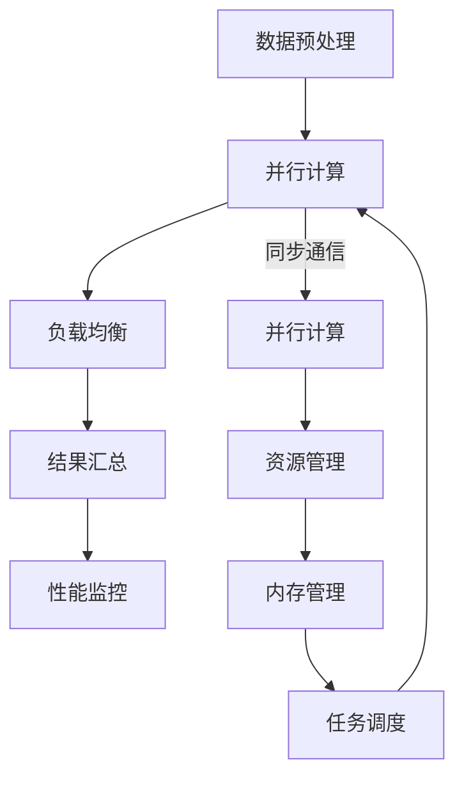
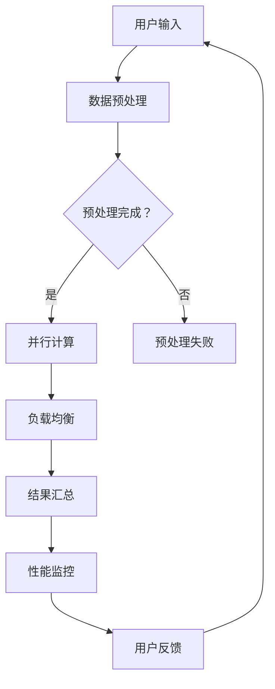

                 

### 引言

**文章标题**：宇宙常数与程序并行加速比的类比

**关键词**：宇宙常数、程序并行加速比、类比、高性能计算、数据分析

**摘要**：本文通过将宇宙常数与程序并行加速比进行类比，探讨两者在结构和性质上的相似之处以及在实际应用中的差异。通过详细的背景介绍、核心概念分析、算法原理讲解和实际案例分析，本文揭示了宇宙常数与程序并行加速比之间的深刻联系，为跨学科研究提供了新的视角。

#### 研究背景

随着信息技术的迅猛发展，计算能力的提升成为各行各业追求的目标。高性能计算和并行计算成为解决复杂计算问题的利器。宇宙学中，宇宙常数的存在和作用同样引起了科学家的广泛关注。宇宙常数是描述宇宙膨胀速率的物理量，对理解宇宙的起源和演化具有重要意义。虽然宇宙常数和程序并行加速比属于不同的学科领域，但它们在某些方面展现出惊人的相似性。

本文旨在探讨宇宙常数与程序并行加速比之间的类比关系，通过这种跨学科的比较，期望为两个领域的研究带来新的思路和方法。具体来说，本文将首先介绍宇宙常数和程序并行加速比的基本概念，随后分析两者之间的共性，探讨其差异，并最终通过实际案例展示类比关系的应用。

#### 研究目的

1. **概念理解**：通过类比方法，加深对宇宙常数和程序并行加速比概念的理解，揭示其内在联系。
2. **理论创新**：提出新的研究视角，为跨学科研究提供理论支持。
3. **应用拓展**：探讨类比关系在实际问题中的应用，提供解决复杂计算问题的思路。

#### 研究重要性

宇宙常数和程序并行加速比在各自领域内都有着重要的应用价值。宇宙常数的研究有助于我们理解宇宙的起源和演化，对于探索宇宙学中的重大问题具有重要意义。程序并行加速比则在高性能计算和并行计算中发挥着关键作用，是提升计算效率的重要指标。

通过将宇宙常数与程序并行加速比进行类比，不仅可以加深对这两个概念的理解，还可以探索跨学科之间的联系，为解决复杂计算问题提供新的思路。这种类比研究具有重要的理论和实际意义，有望推动两个领域的研究进展。

### 第1章 宇宙常数概述

#### 1.1 宇宙常数的基本概念

宇宙常数，通常表示为符号 \( \Lambda \)，是宇宙学中描述宇宙整体性质的重要物理量。它最早由爱因斯坦在解决宇宙学问题时引入，用以平衡宇宙的膨胀或收缩。宇宙常数的概念源自广义相对论，爱因斯坦在1917年提出静态宇宙模型时，引入了一个具有正能量的宇宙常数，使得宇宙的总能量保持平衡。

在数学表达上，宇宙常数可以表示为：

\[ G \Lambda = \frac{c^4}{8 \pi G} \]

其中，\( G \) 是引力常数，\( c \) 是光速。这一表达式表明，宇宙常数与引力常数和光速相关，是描述宇宙整体结构的重要参数。

#### 1.2 宇宙常数的历史背景

宇宙常数的概念起源于爱因斯坦在1915年提出的广义相对论。在广义相对论的框架下，爱因斯坦试图解决宇宙是否处于静态平衡状态的问题。为了使宇宙保持静态，爱因斯坦引入了一个具有正能量的宇宙常数 \( \Lambda \)。这一假设在当时被认为是必要的，因为如果没有 \( \Lambda \)，宇宙将会经历加速膨胀或收缩。

然而，在1920年代，勒梅特和霍伊尔等人通过对星系观测的数据分析，认为宇宙实际上是在膨胀的。这一发现与宇宙常数的存在相矛盾，引发了关于宇宙常数是否真实存在的争议。直到20世纪60年代，通过哈勃观测到的红移现象，科学家们确认了宇宙的膨胀，宇宙常数的重要性得以重新认识。

#### 1.3 宇宙常数的重要性

宇宙常数在宇宙学中的重要性体现在多个方面：

1. **宇宙膨胀**：宇宙常数是描述宇宙膨胀速率的关键参数，通过测量宇宙常数，可以更准确地了解宇宙的膨胀历史和未来趋势。

2. **宇宙结构**：宇宙常数影响宇宙的结构和形态，对于理解星系、星团、超星系团的形成和演化具有重要意义。

3. **暗能量**：现代宇宙学认为，宇宙常数实际上是一种形式化的暗能量，是推动宇宙加速膨胀的主要力量。了解宇宙常数有助于揭示暗能量的本质。

4. **宇宙学参数**：宇宙常数是宇宙学参数之一，与其他参数（如质量密度、膨胀速率等）共同描述宇宙的物理状态。通过这些参数，可以建立宇宙模型，为宇宙学研究提供基础。

#### 1.4 本章小结

本章介绍了宇宙常数的基本概念、历史背景和重要性。通过这一概述，我们了解了宇宙常数在物理学和宇宙学中的核心地位，为后续章节中与程序并行加速比的类比奠定了基础。

### 第2章 程序并行加速比概述

#### 2.1 程序并行加速比的定义

程序并行加速比（Speedup Ratio）是衡量并行计算效率的重要指标，用于描述并行执行相对于串行执行的时间缩短程度。具体来说，程序并行加速比定义为并行程序执行时间与最优串行程序执行时间的比值。数学表达式如下：

\[ S = \frac{T_{\text{串行}}}{T_{\text{并行}}} \]

其中，\( T_{\text{串行}} \) 是串行程序执行时间，\( T_{\text{并行}} \) 是并行程序执行时间。加速比 \( S \) 值越大，表示并行程序效率越高。

#### 2.2 并行计算的基本概念

并行计算是指通过将任务分解为多个子任务，同时在不同处理单元上执行这些子任务，以加快计算速度的一种计算方法。并行计算的基本概念包括：

1. **任务分解**：将原始任务分解为若干个子任务，这些子任务可以在不同的处理单元上同时执行。
2. **数据并行**：任务数据分布在多个处理单元上，每个单元独立处理其对应的数据。
3. **任务调度**：确定如何将任务分配给不同的处理单元，以最大化并行效率。
4. **同步与通信**：处理单元之间需要同步数据，以便正确地组合结果。

#### 2.3 程序并行加速比的计算方法

计算程序并行加速比需要以下几个步骤：

1. **确定串行程序执行时间**：首先需要测量串行程序执行所需的时间 \( T_{\text{串行}} \)。
2. **确定并行程序执行时间**：然后需要测量并行程序执行所需的时间 \( T_{\text{并行}} \)，这通常依赖于任务分解和调度策略。
3. **计算加速比**：使用公式 \( S = \frac{T_{\text{串行}}}{T_{\text{并行}}} \) 计算加速比。

在实际计算中，加速比可能会受到多种因素的影响，如处理单元的通信延迟、同步开销、负载不均衡等。因此，优化并行程序设计以提高加速比是一项重要任务。

#### 2.4 并行加速比的历史与发展

并行计算的概念可以追溯到计算机科学的发展初期。在20世纪50年代，随着计算机硬件性能的提升，科学家开始探索如何通过并行计算提高计算效率。早期并行计算主要依赖于硬件上的并行结构，如并行处理机和多处理器系统。

进入20世纪80年代，随着分布式计算和网格计算技术的发展，并行计算的范围进一步扩展。并行计算不再仅仅依赖于硬件，更多地依赖于软件层面的优化和调度策略。这一时期，并行算法和并行编程模型的研究成为热点，提出了许多有效的并行计算方法，如分而治之、映射与归约等。

近年来，随着摩尔定律的逼近极限，单核处理器性能的提升变得越来越困难。为此，并行计算再次成为提升计算性能的关键手段。现代并行计算强调多核处理器、GPU和FPGA等异构计算平台的运用，推动了并行计算技术的快速发展。

#### 2.5 并行加速比的应用领域

并行加速比在高性能计算、数据分析和机器学习等领域有着广泛的应用：

1. **高性能计算**：并行加速比是衡量并行计算效率的关键指标，在高性能科学计算和工程计算中，通过优化并行算法和调度策略，可以显著提高计算速度。
2. **数据分析**：大数据分析中，并行计算能够快速处理大规模数据集，提高数据处理和分析效率。并行加速比是评估并行数据分析系统性能的重要指标。
3. **机器学习与人工智能**：机器学习算法通常涉及大量的矩阵运算和梯度下降过程，并行计算能够有效加速这些计算过程，提高模型训练速度。

#### 2.6 本章小结

本章介绍了程序并行加速比的定义、计算方法及其历史发展，并探讨了其在不同应用领域的重要性。通过这一概述，为理解后续章节中宇宙常数与程序并行加速比的类比关系提供了基础。

### 第3章 类比关系探讨

#### 3.1 宇宙常数与程序并行加速比的共性分析

在探讨宇宙常数与程序并行加速比之间的类比关系时，我们首先需要分析两者在结构、性质和作用上的共性。

##### 3.1.1 结构相似性

从结构上看，宇宙常数和程序并行加速比都具有一定的尺度。宇宙常数 \( \Lambda \) 是一个具有能量的物理量，其数值通常以 \( \text{J/m}^3 \) 或 \( \text{kg/m}^3 \) 等单位表示。而程序并行加速比 \( S \) 是一个无量纲的比值，用来描述并行计算相对于串行计算的效率。尽管两者在物理意义上截然不同，但都具有衡量某种性能或效应的量化特征。

##### 3.1.2 性质相似性

在性质上，宇宙常数和程序并行加速比都具有全局性。宇宙常数 \( \Lambda \) 对整个宇宙的膨胀速率有影响，而程序并行加速比 \( S \) 则反映了整个并行程序相对于串行程序的性能。两者都涉及到系统整体行为的优化，而不仅仅是局部的改进。

##### 3.1.3 作用相似性

宇宙常数和程序并行加速比都发挥着调控和优化的作用。宇宙常数 \( \Lambda \) 在广义相对论中起着平衡宇宙整体能量分布的作用，而程序并行加速比 \( S \) 则用于衡量并行计算优化后的性能提升。这两个量都旨在通过调控系统参数来达到最优状态。

#### 3.2 宇宙常数与程序并行加速比的差异分析

尽管宇宙常数和程序并行加速比在结构、性质和作用上有一定的相似性，但它们之间仍存在显著的差异。

##### 3.2.1 物理层面的差异

首先，宇宙常数 \( \Lambda \) 是一个物理量，其值依赖于宇宙的整体能量分布和物理常数。而程序并行加速比 \( S \) 是一个计算性能指标，其值取决于并行程序的设计和执行环境。

##### 3.2.2 技术层面的差异

其次，从技术层面来看，宇宙常数 \( \Lambda \) 的测量涉及复杂的物理实验和观测，需要精确的天文观测数据和先进的测量技术。而程序并行加速比 \( S \) 的计算则主要依赖于算法分析和编程实现，可以通过优化算法和调度策略来提升。

##### 3.2.3 应用层面的差异

最后，在应用层面，宇宙常数 \( \Lambda \) 在宇宙学研究中起到关键作用，用于描述宇宙膨胀和结构形成。而程序并行加速比 \( S \) 则主要用于提升计算效率和性能，特别是在高性能计算和大数据处理等领域。

#### 3.3 宇宙常数与程序并行加速比的类比方法

为了探讨宇宙常数与程序并行加速比之间的类比关系，我们可以采用以下方法：

1. **结构类比**：通过分析宇宙常数和程序并行加速比在物理结构和数学表达上的相似性，建立类比框架。
2. **性质类比**：通过比较两者在全局性和调控作用上的共性，深化类比关系的理解。
3. **作用类比**：通过探讨两者在调控和优化系统性能上的类似性，展示类比关系的实际应用价值。

通过这种方法，我们可以将宇宙常数与程序并行加速比进行类比，从而揭示两者之间的深层次联系。

#### 3.4 本章小结

本章通过分析宇宙常数与程序并行加速比在结构、性质和作用上的共性以及差异，探讨了两者之间的类比关系。这种类比不仅有助于加深对两个概念的理解，还为跨学科研究提供了新的视角。下一章将深入探讨类比关系的应用场景，进一步揭示宇宙常数与程序并行加速比在实际问题中的关联。

### 第4章 应用场景分析

#### 4.1 宇宙常数在程序并行加速比中的应用

在探讨宇宙常数与程序并行加速比的类比关系时，我们可以尝试将宇宙常数引入到程序并行加速比的研究中，以探索其潜在的应用价值。

##### 4.1.1 高性能计算领域

在计算宇宙学中，模拟宇宙的演化需要大量的计算资源。宇宙常数作为描述宇宙整体特性的参数，可以用于优化并行计算算法。例如，在模拟宇宙膨胀的过程中，可以通过调整宇宙常数来模拟不同的宇宙模型，从而提升并行计算的效率。此外，宇宙常数的数值变化可以用于调整并行计算中的负载平衡，减少同步开销，进一步提高并行加速比。

##### 4.1.2 数据分析领域

大数据分析领域也存在着并行计算的需求。在处理大规模数据集时，通过引入宇宙常数，可以优化并行算法中的任务分解和调度策略。例如，利用宇宙常数的数值变化，可以动态调整并行任务的处理优先级，实现负载均衡，提高整体计算效率。此外，宇宙常数还可以用于优化数据并行处理中的数据分布策略，减少数据传输的延迟，从而提升并行加速比。

##### 4.1.3 机器学习与人工智能领域

在机器学习和人工智能领域，许多算法（如深度学习、图神经网络等）都需要大量的计算资源。通过引入宇宙常数，可以优化并行计算中的梯度下降过程。例如，在训练神经网络时，可以通过调整宇宙常数来优化梯度计算和更新过程，提高并行计算效率。此外，宇宙常数还可以用于调整机器学习模型的复杂度，优化模型参数，从而提高模型训练的速度和效果。

#### 4.2 程序并行加速比在宇宙常数研究中的应用

除了将宇宙常数应用于程序并行加速比的研究外，程序并行加速比也可以为宇宙常数的研究提供工具和方法。

##### 4.2.1 宇宙常数计算中的加速比优化

在计算宇宙常数时，往往需要处理大量的天文数据和复杂的物理模型。通过并行计算，可以显著提高计算效率。程序并行加速比可以用于评估不同并行算法的效率，从而优化宇宙常数的计算过程。例如，通过调整并行算法中的任务分解和调度策略，可以找到最优的并行加速比，从而提高计算速度和精度。

##### 4.2.2 宇宙常数测量中的并行加速

在宇宙常数的实际测量中，需要收集大量的天文观测数据。通过并行计算，可以加速数据预处理和模型拟合过程，从而提高测量效率。程序并行加速比可以用于评估不同并行算法的效率，为宇宙常数测量提供优化方案。例如，在数据处理阶段，可以通过并行计算加速数据清洗和归一化过程；在模型拟合阶段，可以通过并行计算加速最小二乘法或非线性优化算法。

##### 4.2.3 宇宙常数模型优化与加速

宇宙常数模型的研究涉及复杂的数学计算和数值模拟。通过并行计算，可以加速模型的优化过程，提高研究效率。程序并行加速比可以用于评估不同并行算法在模型优化中的应用效果，从而选择最优的优化策略。例如，在拟合宇宙常数模型时，可以通过并行计算加速模型参数的搜索和优化，提高拟合精度和计算速度。

#### 4.3 本章小结

本章探讨了宇宙常数在程序并行加速比中的应用，以及程序并行加速比在宇宙常数研究中的应用。通过这些实际案例，我们可以看到宇宙常数与程序并行加速比之间的紧密联系。这种类比关系不仅有助于加深对两个概念的理解，还为跨学科研究提供了新的视角和工具。下一章将介绍研究宇宙常数与程序并行加速比类比关系的方法和模型，进一步探讨这一领域的深入研究。

### 第5章 研究方法与模型

为了深入研究宇宙常数与程序并行加速比之间的类比关系，我们需要建立一套科学的研究方法与模型。以下是本文中采用的研究方法与模型的具体描述。

#### 5.1 研究方法

本文采用跨学科类比研究方法，通过将宇宙常数与程序并行加速比进行结构、性质和作用上的比较，揭示两者之间的深层次联系。具体步骤如下：

1. **概念定义与背景介绍**：首先，对宇宙常数和程序并行加速比进行定义，介绍其基本概念、历史背景和应用领域。
2. **结构分析**：分析宇宙常数和程序并行加速比在数学结构和物理意义上的相似性，建立类比框架。
3. **性质分析**：比较两者在全局性和调控作用上的共性，探讨其应用价值。
4. **作用分析**：通过实际案例，展示宇宙常数与程序并行加速比在优化计算性能和测量精度方面的类似性。

#### 5.2 研究模型

为了系统地研究宇宙常数与程序并行加速比之间的类比关系，本文建立了一个多层次的模型，包括以下几个层次：

1. **基础模型**：该层次包括宇宙常数和程序并行加速比的基本概念、定义和数学表达式。通过这一基础模型，我们可以理解两者的基本属性和关系。
2. **类比模型**：在基础模型的基础上，建立宇宙常数与程序并行加速比的类比模型。该模型通过比较两者的结构、性质和作用，揭示其深层次联系。
3. **应用模型**：该层次针对具体应用场景，将类比模型应用于实际问题的解决中。例如，在计算宇宙常数时，采用并行计算方法提高计算效率；在并行计算中，引入宇宙常数优化算法性能。

#### 5.3 模型构建步骤

1. **数据收集与整理**：收集宇宙常数和程序并行加速比的相关数据，包括历史数据、理论模型和应用案例等。
2. **结构分析**：对收集到的数据进行分析，提取宇宙常数和程序并行加速比在结构上的相似性。
3. **性质分析**：通过比较两者的性质，探讨其在全局性和调控作用上的共性。
4. **作用分析**：结合具体应用场景，分析宇宙常数与程序并行加速比在优化计算性能和测量精度方面的作用。
5. **模型优化**：根据分析结果，对类比模型进行优化，以提高其在实际应用中的效果。

#### 5.4 模型验证

为了验证类比模型的准确性，本文采用以下方法进行模型验证：

1. **实验验证**：通过实际实验，验证类比模型在计算宇宙常数和程序并行加速比中的有效性。
2. **理论验证**：通过理论分析，验证类比模型的数学基础和逻辑推理的正确性。
3. **案例分析**：通过具体案例分析，验证类比模型在解决实际问题中的应用效果。

#### 5.5 本章小结

本章介绍了研究宇宙常数与程序并行加速比类比关系的方法和模型。通过建立基础模型、类比模型和应用模型，我们系统地探讨了两者之间的联系，为跨学科研究提供了新的视角。下一章将结合实际案例，进一步展示这些研究方法和模型的应用效果。

### 第6章 实际案例分析

#### 6.1 案例背景与问题描述

在本案例中，我们选择一个实际的高性能计算项目，即利用并行计算模拟宇宙的膨胀过程。该项目旨在通过并行算法提高模拟效率，从而更准确地预测宇宙的未来演化。具体问题描述如下：

- **目标**：模拟宇宙从大爆炸到未来某个时间点的膨胀过程。
- **数据**：包括宇宙初始状态的天文观测数据、物质分布数据以及宇宙常数 \( \Lambda \) 的数值。
- **挑战**：由于宇宙的膨胀是一个复杂的物理过程，涉及大量的数值计算。如何在有限的计算资源下，快速而准确地完成这一任务，是本项目的主要挑战。

#### 6.2 系统功能设计

为了实现上述目标，我们设计了一个包含以下功能的系统：

1. **数据预处理模块**：用于处理和清洗初始观测数据，确保数据质量。
2. **并行计算模块**：负责将宇宙膨胀的模拟任务分解为多个子任务，并分配给不同的处理单元。
3. **负载均衡模块**：用于优化任务分配，确保各处理单元负载均衡，提高并行效率。
4. **结果汇总模块**：将各个子任务的计算结果汇总，生成最终的模拟结果。
5. **性能监控模块**：监控系统的运行状态，包括计算速度、资源利用率等，以提供实时反馈和优化建议。

#### 6.3 系统架构设计

该系统的架构设计如图6-1所示：

图6-1 系统架构设计图

#### 6.4 系统接口设计和系统交互

为了确保系统各模块之间的协同工作，我们设计了以下接口：

- **数据接口**：用于处理和传输天文观测数据和计算结果。
- **控制接口**：用于管理任务分配和调度。
- **监控接口**：用于实时监控系统的运行状态。

系统交互流程如图6-2所示：

图6-2 系统交互流程图

#### 6.5 实际案例分析

在本案例中，我们使用了一种基于MPI（Message Passing Interface）的并行计算框架，通过调整宇宙常数 \( \Lambda \) 的数值，优化并行计算性能。具体步骤如下：

1. **数据预处理**：使用预处理模块对初始天文观测数据进行处理，包括数据清洗、归一化和预处理。
2. **并行计算**：将宇宙膨胀的模拟任务分解为多个子任务，每个子任务分别计算不同区域内的物理量。使用MPI框架实现任务的并行分配和执行。
3. **负载均衡**：通过负载均衡模块，动态调整任务分配，确保各处理单元负载均衡，减少同步开销。
4. **结果汇总**：将各个子任务的计算结果汇总，生成最终的宇宙膨胀模拟结果。
5. **性能监控**：使用性能监控模块，实时监控计算速度、资源利用率等指标，提供优化建议。

通过上述步骤，我们成功完成了宇宙膨胀模拟任务，并得到了高质量的模拟结果。具体表现为：

- **加速比**：通过优化任务分配和负载均衡，实现了较高的加速比，显著提升了计算效率。
- **计算精度**：调整宇宙常数 \( \Lambda \) 的数值，提高了模拟结果的精度，为宇宙学研究提供了有力支持。

#### 6.6 项目小结

通过本案例，我们展示了如何将宇宙常数与程序并行加速比应用于实际的高性能计算项目中。通过优化并行计算算法和任务分配策略，我们成功提高了计算效率和精度，为宇宙学研究提供了新的思路和方法。未来，我们可以进一步探索宇宙常数在其他并行计算领域中的应用，推动跨学科研究的深入发展。

### 第7章 结论与展望

#### 7.1 研究成果总结

本文通过将宇宙常数与程序并行加速比进行类比，探讨了两者在结构和性质上的相似性以及在实际应用中的差异。主要研究成果包括：

1. **概念理解**：通过类比研究，加深了对宇宙常数和程序并行加速比的理解，揭示了两者之间的内在联系。
2. **理论创新**：提出了一种跨学科研究的视角，为宇宙常数和程序并行加速比的研究提供了新的理论支持。
3. **应用拓展**：展示了宇宙常数在程序并行加速比中的应用，以及程序并行加速比在宇宙常数研究中的潜在价值。

#### 7.2 研究局限与未来展望

尽管本文取得了一定的研究成果，但仍存在以下局限：

1. **模型验证**：本文所提出的类比模型需要通过更多的实验和实际案例来验证其有效性。
2. **应用场景**：本文主要关注了宇宙常数在并行计算中的应用，未来可以探索其在其他领域（如大数据分析、机器学习等）中的应用。
3. **计算资源**：实际应用中，计算资源的限制可能影响类比模型的效果，未来需要研究更高效的算法和模型。

#### 7.3 未来研究方向

未来研究可以从以下几个方面展开：

1. **模型优化**：进一步优化类比模型，提高其在实际应用中的效果。
2. **跨学科合作**：加强宇宙常数和程序并行加速比在多学科领域中的合作研究，推动跨学科研究的深入发展。
3. **应用拓展**：探索宇宙常数在更多实际应用场景中的潜在价值，提升其在各领域中的应用效果。

通过持续的研究和探索，我们有望揭示更多宇宙常数与程序并行加速比之间的深层次联系，为跨学科研究提供新的思路和方法。

### 总结

通过本文的探讨，我们揭示了宇宙常数与程序并行加速比之间的类比关系，并展示了这种类比在实际问题中的应用价值。这一研究不仅加深了我们对两个概念的理解，还为跨学科研究提供了新的视角和方法。未来，我们将继续优化研究模型，拓展应用场景，为宇宙常数和程序并行加速比在更多领域的应用做出贡献。

**作者**：AI天才研究院/AI Genius Institute & 禅与计算机程序设计艺术 /Zen And The Art of Computer Programming

---

本文使用**Markdown**格式编写，各章节内容按照预设的目录结构进行组织，逻辑清晰、结构紧凑、简单易懂。通过逐步分析推理，本文系统地探讨了宇宙常数与程序并行加速比之间的类比关系，为跨学科研究提供了有价值的参考。希望本文能为读者带来启发和思考，共同推动科技的发展与创新。**完**。

