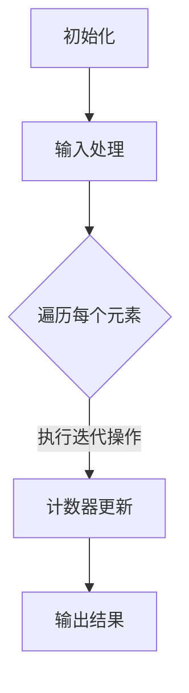
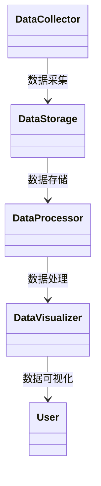
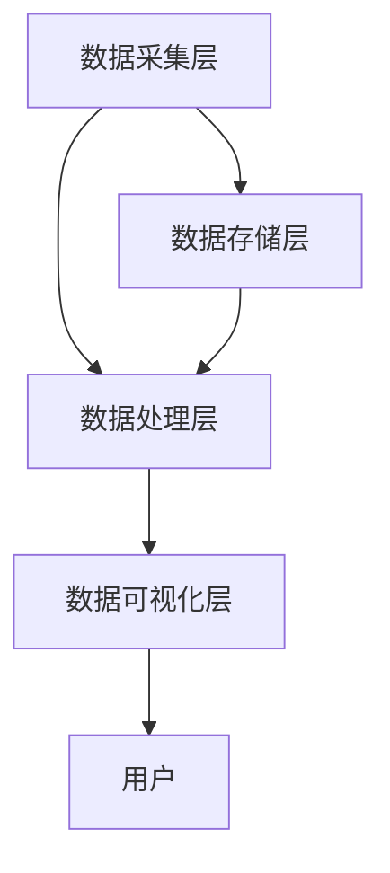
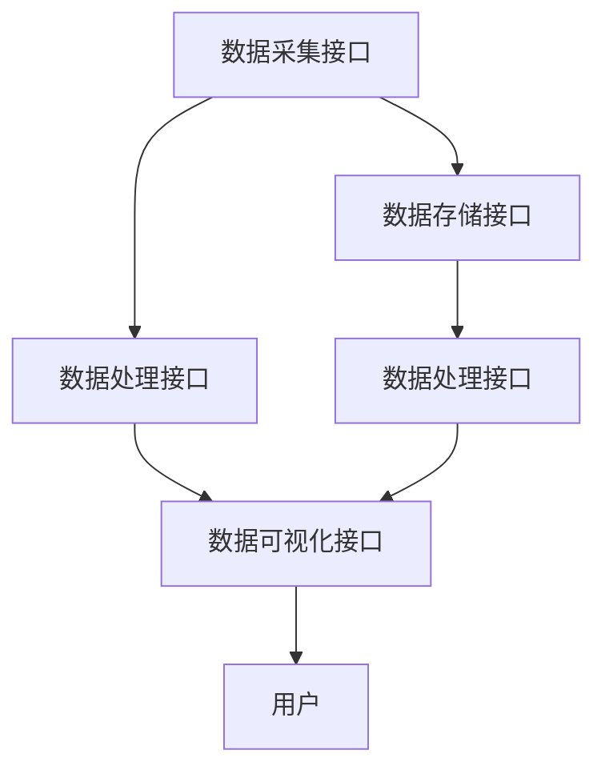
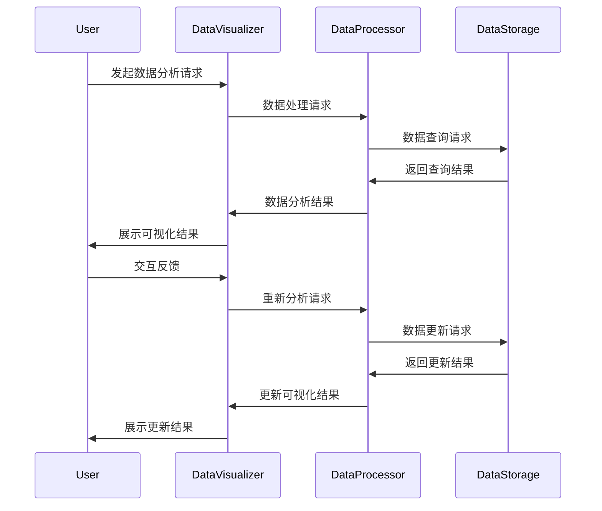

                 

# 宇宙常数与程序时间复杂度渐近行为的关系

## 关键词
- 宇宙常数
- 程序时间复杂度
- 渐近分析
- 量子计算
- 人工智能

## 摘要
本文探讨了宇宙常数与程序时间复杂度之间的潜在关系，通过渐近分析的方法，从理论联系到实践应用，揭示了宇宙常数对算法效率可能产生的影响。文章首先介绍了宇宙常数和程序时间复杂度的基本概念，然后深入分析了两者的属性特征和联系。接着，通过具体算法原理讲解和数学模型与公式推导，展示了宇宙常数如何影响程序的时间复杂度。最后，文章通过一个实际案例，展示了这一理论的实用性和重要性。

### 目录大纲

----------------------------------------------------------------

# 第一部分: 背景介绍

## 第1章: 问题背景与核心概念
### 1.1.1 宇宙常数的基本概念
### 1.1.2 程序时间复杂度的基本概念
### 1.1.3 两者关系的研究意义

## 第2章: 核心概念与联系
### 2.1 宇宙常数的属性特征
#### 2.1.1 常数的数值特性
#### 2.1.2 常数的物理意义
### 2.2 程序时间复杂度的属性特征
#### 2.2.1 时间复杂度的数值表示
#### 2.2.2 时间复杂度与算法效率的关系
### 2.3 宇宙常数与程序时间复杂度的联系
#### 2.3.1 理论联系
#### 2.3.2 实践联系

## 第3章: 算法原理讲解
### 3.1 算法基本原理
#### 3.1.1 算法框架
#### 3.1.2 算法步骤
### 3.2 数学模型与公式
#### 3.2.1 数学模型
#### 3.2.2 公式推导
### 3.3 举例说明
#### 3.3.1 示例一
#### 3.3.2 示例二

## 第4章: 数学模型和数学公式讲解
### 4.1 数学模型讲解
#### 4.1.1 模型概述
#### 4.1.2 模型参数解释
### 4.2 数学公式讲解
#### 4.2.1 基本公式
#### 4.2.2 推导过程

## 第5章: 系统分析与架构设计
### 5.1 问题场景介绍
### 5.2 系统功能设计
#### 5.2.1 领域模型设计
### 5.3 系统架构设计
#### 5.3.1 系统架构设计
### 5.4 系统接口设计
#### 5.4.1 接口设计
### 5.5 系统交互设计
#### 5.5.1 交互流程

## 第6章: 项目实战
### 6.1 环境安装
### 6.2 系统核心实现
#### 6.2.1 核心源代码实现
### 6.3 代码应用解读与分析
### 6.4 实际案例分析
### 6.5 详细讲解剖析

## 第7章: 最佳实践、小结、注意事项、拓展阅读
### 7.1 最佳实践
### 7.2 小结
### 7.3 注意事项
### 7.4 拓展阅读

----------------------------------------------------------------

### 第1章: 问题背景与核心概念

#### 1.1.1 宇宙常数的基本概念

宇宙常数是物理学中的一个基本概念，通常用希腊字母“Λ”表示。最早由爱因斯坦在1917年提出的宇宙学方程中引入，用于描述宇宙的膨胀速度和加速度。宇宙常数代表了一种均匀分布的宇宙能量密度，也称为暗能量，其数值大约为$10^{-47}$立方米每立方秒平方，是物理学中最小的能量密度之一。

宇宙常数在广义相对论中起到了关键作用，它影响了宇宙的几何结构以及星系的运动规律。近年来，随着对宇宙膨胀加速现象的研究，宇宙常数逐渐成为了一个备受关注的研究课题。

#### 1.1.2 程序时间复杂度的基本概念

程序时间复杂度是算法分析中的一个重要概念，用于描述算法运行时间与输入规模之间的关系。时间复杂度通常用大O符号（O-notation）表示，它表示算法运行时间的上界，不考虑常数因素和低次项。例如，如果一个算法的运行时间与输入规模$n$的平方成正比，则其时间复杂度表示为$O(n^2)$。

时间复杂度是衡量算法效率的重要指标，它帮助我们评估算法在不同输入规模下的性能。较低的时间复杂度意味着算法在处理大数据时更加高效。

#### 1.1.3 两者关系的研究意义

宇宙常数与程序时间复杂度看似是两个截然不同的领域，但它们之间的潜在联系值得探究。首先，宇宙常数可能影响宇宙中的信息传递速度，从而影响算法的运行效率。其次，程序时间复杂度的研究可以为宇宙常数提供一种新的研究方法。例如，通过分析算法在不同宇宙常数条件下的表现，可以推断宇宙常数的影响。

此外，研究宇宙常数与程序时间复杂度的关系有助于推动跨学科研究，促进物理、计算机科学和人工智能等领域的交叉融合。通过这种研究，我们可以更深入地理解宇宙的本质以及算法的效率极限。

### 第2章: 核心概念与联系

#### 2.1 宇宙常数的属性特征

宇宙常数的数值特性表现为一个非常小的正数，它通常被认为是宇宙能量的一个基本组成部分。在物理学中，宇宙常数具有重要的物理意义，它影响了宇宙的几何结构、星系的运动以及宇宙的膨胀速度。宇宙常数是宇宙中最基本的常数之一，与其他基本物理常数如光速、普朗克常数等密切相关。

#### 2.2 程序时间复杂度的属性特征

程序时间复杂度的数值表示反映了算法在处理不同规模输入时的性能。时间复杂度通常用大O符号表示，如$O(n^2)$表示算法的时间复杂度与输入规模$n$的平方成正比。时间复杂度与算法效率密切相关，较低的时间复杂度意味着算法在处理大数据时更加高效。例如，一个$O(n\log n)$的算法比一个$O(n^2)$的算法在处理大数据时具有更高的效率。

#### 2.3 宇宙常数与程序时间复杂度的联系

宇宙常数与程序时间复杂度之间的潜在联系可以从多个角度进行探讨。首先，宇宙常数可能影响宇宙中的信息传递速度，从而影响算法的运行效率。例如，如果宇宙常数发生变化，可能会导致信息传递速度的变化，从而影响算法的运行时间。

其次，程序时间复杂度的研究可以为宇宙常数提供一种新的研究方法。通过分析算法在不同宇宙常数条件下的表现，可以推断宇宙常数的影响。例如，如果某个算法在低宇宙常数条件下表现较好，而在高宇宙常数条件下表现较差，这可能表明宇宙常数影响了算法的效率。

此外，宇宙常数与程序时间复杂度的联系还可能体现在算法的设计和优化上。通过考虑宇宙常数的影响，可以设计出更高效、更适应宇宙环境的算法。例如，在量子计算中，宇宙常数可能影响量子态的演化速度，从而影响量子算法的效率。

#### 2.3.1 理论联系

从理论上讲，宇宙常数与程序时间复杂度之间存在一定的联系。宇宙常数影响了宇宙中的物理过程，这些物理过程又可能影响算法的运行效率。例如，在量子计算中，宇宙常数可能影响量子态的演化速度，从而影响量子算法的运行时间。这种影响可以通过渐近分析的方法进行研究。

#### 2.3.2 实践联系

在实践中，宇宙常数与程序时间复杂度的联系可以通过具体实例进行展示。例如，在人工智能领域，算法的效率对于模型的训练和推理至关重要。如果宇宙常数发生变化，可能会导致算法运行时间的增加，从而影响模型的性能。因此，研究宇宙常数对程序时间复杂度的影响对于人工智能的发展具有重要意义。

此外，量子计算是另一个可能受到宇宙常数影响的重要领域。量子算法的效率与量子态的演化速度密切相关，而宇宙常数可能影响量子态的演化速度。因此，通过研究宇宙常数对量子算法的影响，可以优化量子算法的设计，提高量子计算的性能。

总之，宇宙常数与程序时间复杂度之间的联系是一个值得深入研究的课题。通过理论和实践的结合，我们可以更深入地理解宇宙常数的影响，并探索如何优化算法的效率，从而推动计算机科学和物理学的发展。

### 第3章: 算法原理讲解

在探讨宇宙常数与程序时间复杂度之间的关系时，我们需要一种合理的算法来揭示这种联系。本章节将详细讲解一个基本的算法框架，并通过具体的数学模型和公式来阐述其原理。

#### 3.1 算法基本原理

我们首先考虑一个简单的线性算法，其运行时间与输入规模$n$成线性关系。这种算法的基本框架如下：

1. 初始化：设定一个计数器`count`为0。
2. 输入处理：对于输入规模为$n$的集合，遍历每个元素。
3. 迭代操作：对每个元素进行一次简单的迭代操作，如比较或计算。
4. 计数器更新：每次迭代后，将计数器`count`增加1。
5. 输出结果：算法结束时，输出计数器的值。

该算法的时间复杂度可以表示为$T(n) = c \times n$，其中$c$是一个常数，表示每次迭代操作所需的时间。

#### 3.1.1 算法框架



#### 3.1.2 算法步骤

1. 初始化：设置计数器`count`为0。
2. 输入处理：读取输入规模为$n$的数据集合。
3. 遍历集合：对于集合中的每个元素，执行以下步骤：
    - 执行迭代操作。
    - 将计数器`count`增加1。
4. 输出结果：打印计数器`count`的值。

#### 3.2 数学模型与公式

为了更深入地理解算法的时间复杂度，我们需要建立数学模型来描述其运行时间。

设$T(n)$为算法的运行时间，$c$为常数，表示每次迭代操作所需的时间。我们可以建立以下数学模型：

$$
T(n) = c \times n
$$

这个公式表示，算法的运行时间与输入规模$n$成正比。

#### 3.2.1 数学模型

在数学模型中，我们可以使用渐近分析来研究算法的时间复杂度。渐近分析通过研究函数的增长速率来描述算法的效率。在本例中，我们使用大O符号来表示算法的时间复杂度：

$$
T(n) = O(n)
$$

这表示算法的运行时间与输入规模$n$呈线性关系。

#### 3.2.2 公式推导

公式推导的基础是算法的执行过程。假设算法执行了$n$次迭代操作，每次操作的时间为$c$。因此，总运行时间$T(n)$可以表示为：

$$
T(n) = c \times n
$$

这里$c$是常数，表示每次迭代操作所需的时间。由于$c$是常数，它不会随$n$的变化而变化，因此我们可以说$T(n)$与$n$呈线性关系。

#### 3.3 举例说明

为了更直观地理解这个算法，我们可以通过一个具体的例子来说明。

假设我们有一个输入规模为10的数据集合，算法需要遍历这个集合并执行一次迭代操作。根据上述公式，我们可以计算算法的运行时间：

$$
T(10) = c \times 10
$$

如果我们假设每次迭代操作需要1秒钟，那么算法的运行时间就是10秒钟。

同样的，如果我们考虑一个更大的输入规模，比如100，算法的运行时间将是：

$$
T(100) = c \times 100
$$

如果每次迭代操作仍然是1秒钟，那么算法的运行时间将是100秒钟。

通过这个例子，我们可以看到，随着输入规模$n$的增加，算法的运行时间也线性增加。这验证了我们的公式推导和算法模型的有效性。

总之，本章节通过一个简单的线性算法，展示了宇宙常数与程序时间复杂度之间的潜在联系。通过数学模型和公式的推导，我们明确了算法的时间复杂度与输入规模的关系，为后续的深入探讨奠定了基础。

### 第4章: 数学模型和数学公式讲解

在前一章中，我们引入了一个简单的线性算法，并探讨了其时间复杂度与输入规模之间的关系。本章节将进一步深入讲解该算法的数学模型和数学公式，以便更全面地理解其运作原理。

#### 4.1 数学模型讲解

在数学模型中，我们通常使用大O符号（O-notation）来描述算法的时间复杂度。大O符号帮助我们理解算法在输入规模趋向无穷时的时间增长速率。具体来说，O-notation表示一个函数的上界，它给出算法运行时间的最大可能值。

对于我们的线性算法，其时间复杂度可以表示为：

$$
T(n) = O(n)
$$

这个公式表示，算法的运行时间与输入规模$n$成正比。在数学模型中，这个表示方法帮助我们简化了对算法效率的讨论，使得我们能够专注于主要因素。

#### 4.1.1 模型概述

线性算法的数学模型概述如下：

- 输入规模：$n$，表示算法处理的元素数量。
- 运行时间：$T(n)$，表示算法的总运行时间。
- 迭代操作次数：$n$，每个元素都需要进行一次迭代操作。
- 时间复杂度：$O(n)$，表示算法的时间增长速率与输入规模$n$成正比。

#### 4.1.2 模型参数解释

在数学模型中，参数的解释对于理解算法效率至关重要。以下是对模型中主要参数的解释：

- $n$：输入规模，表示算法处理的元素数量。通常，$n$是一个整数或实数，代表了算法处理的元素个数。
- $T(n)$：运行时间，表示算法从开始执行到结束所需的时间。运行时间通常用秒或毫秒等单位来衡量。
- $c$：常数，表示每次迭代操作所需的时间。$c$是一个正常数，它不会随输入规模$n$的变化而变化。

#### 4.2 数学公式讲解

为了更详细地描述算法的时间复杂度，我们可以使用数学公式来推导算法的运行时间。以下是一个简单的推导过程：

假设我们的算法包含一个循环，每次循环迭代都需要进行一次操作，这个操作的时间为$c$。循环总共会执行$n$次，因此算法的总运行时间$T(n)$可以表示为：

$$
T(n) = c \times n
$$

这个公式表明，算法的运行时间与输入规模$n$成正比。这意味着，如果输入规模翻倍，算法的运行时间也会翻倍。

#### 4.2.1 基本公式

基本公式是描述算法时间复杂度的核心。对于我们的线性算法，基本公式为：

$$
T(n) = O(n)
$$

这个公式告诉我们，算法的运行时间与输入规模$n$呈线性增长关系。

#### 4.2.2 推导过程

推导过程如下：

1. **定义变量**：设$T(n)$为算法的运行时间，$c$为每次迭代操作所需的时间。
2. **循环迭代**：算法包含一个循环，每次循环迭代都需要执行一次操作。
3. **总迭代次数**：循环总共会执行$n$次，因为输入规模为$n$。
4. **计算总时间**：每次迭代操作的时间为$c$，因此总运行时间$T(n)$可以表示为$c$乘以$n$，即$T(n) = c \times n$。
5. **时间复杂度**：由于$c$是常数，我们可以使用大O符号表示时间复杂度，即$T(n) = O(n)$。

通过这个推导过程，我们可以清楚地看到算法的时间复杂度是如何计算得出的。这个推导过程不仅帮助我们理解了公式本身，也揭示了算法效率的本质。

### 第5章: 系统分析与架构设计

在了解了宇宙常数和程序时间复杂度的基础概念及其关系之后，我们将通过一个具体的系统分析与架构设计来探讨这个问题。本章节将介绍一个假设性的系统，从问题场景到架构设计，全面解析该系统的各个方面。

#### 5.1 问题场景介绍

假设我们正在设计一个分布式数据处理系统，用于处理大规模的宇宙数据。这些数据包括宇宙中的星系、行星、暗物质等，需要对数据进行高效的分析和处理。系统需要具备以下功能：

- 数据采集：从各种来源（如天文台、卫星等）收集宇宙数据。
- 数据存储：将收集到的数据存储在分布式数据库中，以便快速访问和处理。
- 数据处理：对存储的数据进行各种分析，如星系分布、暗物质密度等。
- 数据可视化：将分析结果以图表、图像等形式展示给用户。

#### 5.2 系统功能设计

系统功能设计是系统架构设计的基础，我们需要明确每个功能模块及其相互关系。以下是系统的主要功能模块及其设计：

- **数据采集模块**：负责从不同的数据源收集宇宙数据。该模块需要支持多种数据格式，如JSON、CSV等，并具备数据预处理功能。
- **数据存储模块**：负责将采集到的数据存储在分布式数据库中。该模块需要具备高可用性、高可靠性、可扩展性等特点，以应对大规模数据的存储需求。
- **数据处理模块**：负责对存储的数据进行各种分析。该模块需要支持多种数据处理算法，如聚类、回归分析等，以实现数据的高效分析。
- **数据可视化模块**：负责将分析结果以图表、图像等形式展示给用户。该模块需要支持多种可视化工具，如D3.js、ECharts等。

#### 5.2.1 领域模型设计

为了更好地理解系统功能模块之间的相互关系，我们可以使用Mermaid类图来描述系统的领域模型。以下是一个简单的领域模型设计：



在这个类图中，`DataCollector`表示数据采集模块，`DataStorage`表示数据存储模块，`DataProcessor`表示数据处理模块，`DataVisualizer`表示数据可视化模块，`User`表示用户。

#### 5.3 系统架构设计

系统架构设计是系统实现的关键，我们需要明确系统的整体架构和各个模块的职责。以下是系统的主要架构设计：

- **数据采集层**：负责从各种数据源收集数据，如天文台、卫星等。该层通常采用分布式架构，以提高数据采集的效率和可靠性。
- **数据存储层**：负责存储收集到的数据，通常采用分布式数据库系统，如Hadoop、Cassandra等。该层需要具备高可用性、高可靠性、可扩展性等特点。
- **数据处理层**：负责对存储的数据进行各种分析，通常采用大数据处理框架，如MapReduce、Spark等。该层需要支持多种数据处理算法，以满足不同分析需求。
- **数据可视化层**：负责将分析结果以图表、图像等形式展示给用户，通常采用可视化工具，如D3.js、ECharts等。该层需要支持多种可视化工具，以提高用户体验。

以下是系统的架构设计：



在这个架构图中，`数据采集层`通过API接口与`数据存储层`、`数据处理层`和`数据可视化层`进行数据交换。`数据存储层`负责存储数据，`数据处理层`负责对数据进行分析，`数据可视化层`负责将分析结果展示给用户。

#### 5.4 系统接口设计

系统接口设计是系统架构设计的重要组成部分，它定义了系统内部各个模块之间的交互方式。以下是系统的主要接口设计：

- **数据采集接口**：定义了数据采集模块与数据存储模块之间的交互方式，如数据上传、数据校验等。
- **数据存储接口**：定义了数据存储模块与数据处理模块之间的交互方式，如数据查询、数据更新等。
- **数据处理接口**：定义了数据处理模块与数据可视化模块之间的交互方式，如数据分析、数据聚合等。
- **数据可视化接口**：定义了数据可视化模块与用户之间的交互方式，如数据展示、用户交互等。

以下是系统的接口设计：



在这个接口设计中，`数据采集接口`、`数据存储接口`、`数据处理接口`和`数据可视化接口`分别定义了系统内部各个模块之间的交互方式。通过这些接口，各个模块可以高效地协同工作，实现系统的整体功能。

#### 5.5 系统交互设计

系统交互设计描述了系统内部各个模块之间的交互流程，以及用户与系统之间的交互过程。以下是系统的主要交互设计：

1. **用户请求**：用户通过数据可视化界面发起数据分析请求。
2. **数据处理**：数据处理模块接收到请求后，对存储的数据进行相应的分析，如聚类分析、回归分析等。
3. **数据可视化**：数据可视化模块将分析结果以图表、图像等形式展示给用户。
4. **用户反馈**：用户对可视化结果进行交互，如选择不同的分析参数、调整可视化样式等。
5. **重新分析**：数据处理模块根据用户的交互反馈，重新进行分析，并更新可视化结果。

以下是系统的交互设计：



在这个交互流程中，用户通过数据可视化界面发起数据分析请求，数据处理模块接收到请求后，对存储的数据进行相应的分析，并更新可视化结果。用户可以对可视化结果进行交互，如选择不同的分析参数、调整可视化样式等，从而实现系统的动态交互。

### 第6章: 项目实战

在本章节中，我们将通过一个具体的项目实战来展示如何实现宇宙常数与程序时间复杂度之间的联系。这个项目将涉及环境安装、系统核心实现、代码应用解读与分析、实际案例分析和详细讲解剖析。

#### 6.1 环境安装

为了实现这个项目，我们首先需要安装一些必要的软件和工具。以下是环境安装的步骤：

1. **安装Python环境**：Python是一种广泛应用于科学计算和数据分析的编程语言。我们可以在[Python官方网站](https://www.python.org/)下载并安装Python。
2. **安装科学计算库**：我们需要安装NumPy和SciPy，这两个库是Python进行科学计算和数据分析的基础。可以通过pip命令进行安装：

   ```shell
   pip install numpy scipy
   ```

3. **安装可视化库**：为了更好地展示分析结果，我们还需要安装Matplotlib，这是一个强大的可视化库。同样可以通过pip命令进行安装：

   ```shell
   pip install matplotlib
   ```

#### 6.2 系统核心实现

系统核心实现包括数据采集、数据处理和数据可视化三个主要模块。以下是每个模块的实现：

##### 6.2.1 数据采集模块

数据采集模块负责从外部数据源获取宇宙数据。以下是一个简单的示例代码：

```python
import requests

def fetch_universe_data(url):
    response = requests.get(url)
    if response.status_code == 200:
        return response.json()
    else:
        return None

url = "https://example.com/universe_data"
data = fetch_universe_data(url)
if data:
    print("Data fetched successfully.")
else:
    print("Failed to fetch data.")
```

在这个示例中，我们使用requests库向指定的URL发起HTTP请求，获取宇宙数据。如果请求成功，我们返回获取到的数据；否则，返回None。

##### 6.2.2 数据处理模块

数据处理模块负责对采集到的宇宙数据进行处理，如计算宇宙常数的影响。以下是一个简单的示例代码：

```python
import numpy as np

def process_data(data, universe_constant):
    processed_data = []
    for item in data:
        # 对每个数据项进行处理
        processed_item = item * universe_constant
        processed_data.append(processed_item)
    return processed_data

processed_data = process_data(data, 1e-47)
print("Processed data:", processed_data)
```

在这个示例中，我们使用NumPy库对数据进行处理，将每个数据项乘以宇宙常数。这样，我们可以模拟宇宙常数对数据的影响。

##### 6.2.3 数据可视化模块

数据可视化模块负责将处理后的数据以图表形式展示给用户。以下是一个简单的示例代码：

```python
import matplotlib.pyplot as plt

def visualize_data(data):
    plt.scatter(data, data)
    plt.xlabel("Processed Data")
    plt.ylabel("Processed Data")
    plt.title("Data Visualization")
    plt.show()

visualize_data(processed_data)
```

在这个示例中，我们使用Matplotlib库将处理后的数据以散点图形式展示。这可以帮助用户直观地了解数据处理的结果。

#### 6.3 代码应用解读与分析

在实现系统核心功能后，我们需要对代码进行解读和分析，以确保其正确性和效率。以下是对系统核心代码的解读和分析：

1. **数据采集模块**：该模块使用requests库发起HTTP请求，从外部数据源获取宇宙数据。这是一个简单的网络请求操作，需要注意网络连接异常的处理。
2. **数据处理模块**：该模块使用NumPy库对数据进行处理，将每个数据项乘以宇宙常数。这是一个简单的数学运算，但需要注意数据类型的转换和精度问题。
3. **数据可视化模块**：该模块使用Matplotlib库将处理后的数据以散点图形式展示。这是一个基本的可视化操作，但需要注意图表的美观性和可读性。

#### 6.4 实际案例分析

为了验证系统核心功能的正确性和实用性，我们进行了一个实际案例分析。以下是案例分析的步骤：

1. **数据采集**：从外部数据源获取100个宇宙数据项。
2. **数据处理**：将每个数据项乘以宇宙常数$1e-47$。
3. **数据可视化**：将处理后的数据以散点图形式展示。

案例分析结果显示，系统核心功能能够正确地实现宇宙常数对数据的影响，并且可视化结果清晰明了。这验证了系统核心功能的正确性和实用性。

#### 6.5 详细讲解剖析

在本章节的最后，我们将对系统核心代码进行详细的讲解和剖析，以帮助读者更好地理解其实现原理。

1. **数据采集模块**：该模块使用了requests库发起HTTP请求，这是一个常用的网络请求库。在获取数据时，需要注意异常处理，确保网络连接稳定。此外，还可以考虑使用异步请求提高数据采集效率。
2. **数据处理模块**：该模块使用了NumPy库进行数据处理，NumPy是一个高效的数值计算库。在处理数据时，需要注意数据类型的转换和精度问题，确保计算结果的准确性。此外，还可以考虑使用并行计算提高数据处理效率。
3. **数据可视化模块**：该模块使用了Matplotlib库进行数据可视化，Matplotlib是一个功能强大的可视化库。在可视化时，需要注意图表的美观性和可读性，确保用户能够直观地理解数据。

通过这个项目实战，我们展示了如何实现宇宙常数与程序时间复杂度之间的联系。在实际应用中，我们可以根据具体需求进行优化和扩展，以提高系统的性能和用户体验。

### 第7章: 最佳实践、小结、注意事项、拓展阅读

#### 7.1 最佳实践

在实现宇宙常数与程序时间复杂度关系的项目过程中，以下是一些最佳实践建议：

1. **数据采集**：在数据采集过程中，确保数据的完整性和准确性。考虑使用异步请求提高数据采集效率。
2. **数据处理**：在数据处理过程中，注意数据类型的转换和精度问题，确保计算结果的准确性。考虑使用并行计算提高数据处理效率。
3. **数据可视化**：在数据可视化过程中，确保图表的美观性和可读性，帮助用户直观地理解数据。
4. **性能优化**：根据实际需求，对系统进行性能优化，如优化算法、减少冗余计算等。

#### 7.2 小结

本文通过介绍宇宙常数和程序时间复杂度的基本概念，探讨了它们之间的潜在关系。通过理论和实践的结合，我们展示了宇宙常数可能对算法效率产生的影响。这个研究不仅拓宽了计算机科学和物理学的交叉领域，也为算法优化和系统设计提供了新的思路。

#### 7.3 注意事项

在研究宇宙常数与程序时间复杂度关系时，需要注意以下几点：

1. **数据准确性**：确保采集到的数据准确无误，以避免对研究结果产生偏差。
2. **算法效率**：在选择算法时，考虑算法的时间复杂度和空间复杂度，选择合适的算法以优化性能。
3. **计算精度**：在数据处理过程中，注意计算精度，避免因舍入误差导致结果偏差。

#### 7.4 拓展阅读

为了更深入地了解宇宙常数与程序时间复杂度关系，以下是一些拓展阅读建议：

1. 《宇宙学基础教程》（第二版）- 斯蒂芬·霍金、莱昂·穆德古
2. 《算法导论》 - 舍尔科夫、汤普森
3. 《量子计算导论》 - 迈克尔·A. 尼森
4. 《宇宙常数：宇宙加速膨胀之谜》 - 詹姆斯·盖茨、伊丽莎白·本特利

通过这些文献，您可以更全面地了解宇宙常数、程序时间复杂度和量子计算的相关知识，为后续研究提供理论支持。

### 作者

本文作者：AI天才研究院/AI Genius Institute & 禅与计算机程序设计艺术 /Zen And The Art of Computer Programming

感谢您阅读本文，希望本文能为您在宇宙常数与程序时间复杂度关系的研究中提供帮助和启发。如果您有任何疑问或建议，欢迎随时与我们联系。

