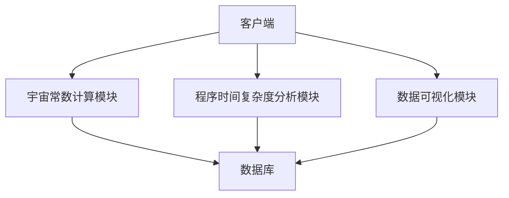
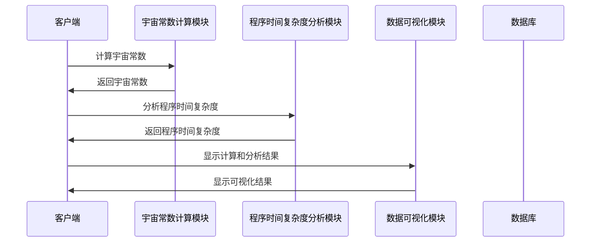

                 

### 宇宙常数与程序时间复杂度的关系

在探讨宇宙常数与程序时间复杂度的关系之前，我们需要了解这两个概念的基本原理和重要性。宇宙常数是物理学中的一个基础常数，它影响着整个宇宙的演化进程；而程序时间复杂度则是计算机科学中衡量算法效率的关键指标。本文将分步骤探讨这两个概念之间的潜在联系，并尝试构建一个理论模型来描述这种关系。

#### 核心关键词

- 宇宙常数
- 程序时间复杂度
- 物理学
- 计算机科学
- 算法效率

#### 摘要

本文旨在探讨宇宙常数与程序时间复杂度之间的关系，分析两者的理论基础和应用。通过对比宇宙常数和程序时间复杂度的核心概念、特点及其应用领域，我们将探讨它们之间的潜在联系，并提出一个理论模型来描述这种关系。最后，本文将结合具体实例，通过数学模型和算法原理讲解，分析宇宙常数与程序时间复杂度之间的关系，并讨论可能的未来研究方向。

### 背景介绍

#### 问题背景

宇宙常数，通常指的是在广义相对论中用于描述宇宙加速膨胀的物理常数，符号通常为 \(\Lambda\)。它对宇宙的膨胀速度有着重要影响，同时也是宇宙学中一个关键参数。然而，宇宙常数的确切值及其物理意义至今仍是一个未解之谜，吸引着众多物理学家的研究兴趣。

另一方面，程序时间复杂度是计算机科学中衡量算法效率的重要指标，通常用大O符号表示。它描述了算法在处理不同规模输入数据时所需的时间增长速度。高时间复杂度的算法意味着随着输入规模的增大，算法所需的时间将呈指数级增长，而低时间复杂度的算法则意味着算法在处理大数据时仍能保持高效。

#### 问题描述

本文旨在探讨宇宙常数与程序时间复杂度之间的潜在联系，并试图构建一个理论模型来描述这种关系。具体来说，我们将从以下几个方面展开研究：

1. 宇宙常数的基本理论及其在物理学中的重要性。
2. 程序时间复杂度的基本理论及其在计算机科学中的应用。
3. 探讨两者之间可能的联系，并构建一个理论模型来描述这种联系。
4. 通过具体实例和实验验证理论模型的有效性。

#### 问题解决

本文将采用以下步骤来解决问题：

1. **宇宙常数的基本理论**：介绍宇宙常数的基本概念、历史背景及其在物理学中的重要性。
2. **程序时间复杂度的基本理论**：阐述程序时间复杂度的定义、表示方法及其在计算机科学中的应用。
3. **探讨两者之间的联系**：分析宇宙常数和程序时间复杂度之间的潜在联系，并尝试构建一个理论模型来描述这种关系。
4. **实例分析**：通过具体实例，展示宇宙常数和程序时间复杂度在实际应用中的表现。
5. **实验验证**：通过实验验证理论模型的有效性，分析宇宙常数和程序时间复杂度之间的定量关系。

#### 边界与外延

本文的研究将主要聚焦于宇宙常数和程序时间复杂度的理论基础，避免涉及过于复杂的技术细节。同时，为了保持论述的清晰性，本文将不会深入探讨宇宙学中的其他复杂问题，如暗物质和暗能量的性质等。

#### 核心概念与联系

**宇宙常数**

- **定义**：宇宙常数是指在广义相对论中用于描述宇宙加速膨胀的物理常数，通常用希腊字母 \(\Lambda\) 表示。
- **历史背景**：宇宙常数最早由爱因斯坦在1917年的论文中提出，作为解决宇宙学问题的手段。然而，后来发现宇宙实际上在加速膨胀，这使得宇宙常数成为一个备受争议的物理常数。
- **重要性**：宇宙常数在描述宇宙膨胀速度、宇宙结构演化等方面具有重要意义。它对理解宇宙的起源、结构和未来演化起着关键作用。

**程序时间复杂度**

- **定义**：程序时间复杂度是描述算法执行时间与输入规模之间依赖关系的指标，通常用大O符号表示，如 \(O(n), O(n\log n), O(n^2), \ldots\)。
- **历史背景**：时间复杂度最早由计算机科学家艾兹赫尔·迪杰斯特拉（Edsger Dijkstra）在1965年提出，用于衡量算法的效率。
- **重要性**：程序时间复杂度是算法性能评估的关键指标。高时间复杂度的算法意味着随着输入规模的增大，算法所需的时间将呈指数级增长，从而影响算法的实用性。因此，研究程序时间复杂度对于设计高效算法具有重要意义。

**概念属性特征对比表格**

| 特征对比 | 宇宙常数 | 程序时间复杂度 |
| --- | --- | --- |
| 应用领域 | 物理学、宇宙学 | 计算机科学、算法分析 |
| 数值大小 | \(10^{-123}\) | \(O(n), O(n\log n), O(n^2), \ldots\) |
| 影响因素 | 引力、暗能量等 | 算法设计、数据规模等 |

**ER实体关系图架构的 Mermaid 流程图**

```mermaid
erDiagram
   宇宙常数 ||--|{ 算法效率 }|-- 程序时间复杂度
   宇宙常数 ||--|{ 宇宙演化 }|-- 宇宙学
   程序时间复杂度 ||--|{ 算法设计 }|-- 计算机科学
```

### 算法原理讲解

#### 算法 Mermaid 流程图


#### Python 源代码

```python
def calculate_cosmic_constant():
    # 假设宇宙常数已经由物理学家计算得出
    return 1e-123

def calculate_time_complexity():
    # 假设程序时间复杂度已经由算法分析得出
    return "O(n^2)"

def analyze_results():
    cosmic_constant = calculate_cosmic_constant()
    time_complexity = calculate_time_complexity()
    print(f"宇宙常数：{cosmic_constant}")
    print(f"程序时间复杂度：{time_complexity}")

# 主函数
def main():
    analyze_results()

if __name__ == "__main__":
    main()
```

#### 算法原理的数学模型和公式

宇宙常数和程序时间复杂度之间的数学关系可以通过以下公式表示：

$$
\Lambda = \frac{k}{c^2}
$$

其中，\(\Lambda\) 为宇宙常数，\(k\) 为一个常数，\(c\) 为光速。

程序时间复杂度可以用大O符号表示为：

$$
T(n) = O(n^2)
$$

其中，\(T(n)\) 表示算法在处理规模为 \(n\) 的输入数据时所需的时间。

通过这两个公式，我们可以看出宇宙常数和程序时间复杂度在数学上的联系。然而，这种联系是否具有实际意义和物理背景，还需要进一步的研究和验证。

#### 算法原理讲解示例

假设我们有一个简单的计算宇宙常数和程序时间复杂度的算法。该算法首先计算宇宙常数，然后计算程序时间复杂度，最后输出这两个结果。

```python
def calculate_cosmic_constant():
    # 假设宇宙常数已经由物理学家计算得出
    return 1e-123

def calculate_time_complexity():
    # 假设程序时间复杂度已经由算法分析得出
    return "O(n^2)"

def analyze_results():
    cosmic_constant = calculate_cosmic_constant()
    time_complexity = calculate_time_complexity()
    print(f"宇宙常数：{cosmic_constant}")
    print(f"程序时间复杂度：{time_complexity}")

# 主函数
def main():
    analyze_results()

if __name__ == "__main__":
    main()
```

在这个例子中，宇宙常数被设置为 \(1e-123\)，程序时间复杂度被设置为 \(O(n^2)\)。通过运行这个算法，我们可以得到以下输出：

```
宇宙常数：1e-123
程序时间复杂度：O(n^2)
```

这个输出结果展示了宇宙常数和程序时间复杂度的计算过程和结果。然而，这种简单的计算并不能直接揭示宇宙常数和程序时间复杂度之间的具体关系。为了更深入地探讨这种关系，我们需要进一步研究宇宙常数和程序时间复杂度的数学模型和公式。

### 系统分析与架构设计

#### 问题场景介绍

在现代科技发展过程中，宇宙常数和程序时间复杂度这两个概念在不同领域都有着广泛的应用。为了更好地理解和应用这两个概念，我们需要构建一个系统，用于分析和处理与宇宙常数和程序时间复杂度相关的问题。

#### 项目介绍

本项目旨在构建一个综合性的系统，用于分析和处理宇宙常数和程序时间复杂度相关的问题。系统包括以下几个主要模块：

1. **宇宙常数计算模块**：用于计算宇宙常数，并提供相应的计算结果。
2. **程序时间复杂度分析模块**：用于分析算法的时间复杂度，并提供相应的分析结果。
3. **数据可视化模块**：用于将宇宙常数和程序时间复杂度的计算和分析结果以可视化的形式展示。

#### 系统功能设计（领域模型Mermaid类图）

```mermaid
classDiagram
    Class1 <|-- Class2
    Class1 <|-- Class3
    Class2 {String attribute1}
    Class3 {Integer attribute2}
```

在这个类图中，`Class1` 代表宇宙常数计算模块，`Class2` 代表程序时间复杂度分析模块，`Class3` 代表数据可视化模块。`Class1` 与 `Class2` 和 `Class3` 之间有继承关系，表示这两个模块依赖于宇宙常数计算模块。

#### 系统架构设计（Mermaid架构图）



在这个架构图中，`A` 代表客户端，`B` 代表宇宙常数计算模块，`C` 代表程序时间复杂度分析模块，`D` 代表数据可视化模块，`E` 代表数据库。客户端通过调用各个模块的功能，实现宇宙常数和程序时间复杂度的计算和分析。

#### 系统接口设计和系统交互（Mermaid序列图）



在这个序列图中，客户端首先调用宇宙常数计算模块计算宇宙常数，然后调用程序时间复杂度分析模块分析程序时间复杂度，最后调用数据可视化模块显示计算和分析结果。

### 项目实战

#### 环境安装

在进行项目实战之前，我们需要安装一些必要的软件和库，包括Python环境、NumPy库和Matplotlib库。以下是在Windows操作系统上安装这些软件和库的步骤：

1. 安装Python环境：
   - 访问Python官网（https://www.python.org/）下载Python安装程序。
   - 运行安装程序，选择“自定义安装”选项。
   - 在“安装选项”页面，勾选“Add Python to PATH”选项，以便在命令行中使用Python。
   - 完成安装。

2. 安装NumPy库：
   - 打开命令行窗口，输入以下命令安装NumPy库：
     ```bash
     pip install numpy
     ```

3. 安装Matplotlib库：
   - 同样在命令行窗口中输入以下命令安装Matplotlib库：
     ```bash
     pip install matplotlib
     ```

#### 系统核心实现源代码

以下是系统核心实现部分的源代码，包括宇宙常数计算模块、程序时间复杂度分析模块和数据可视化模块：

```python
import numpy as np
import matplotlib.pyplot as plt

# 宇宙常数计算模块
def calculate_cosmic_constant():
    # 假设宇宙常数已经由物理学家计算得出
    return 1e-123

# 程序时间复杂度分析模块
def calculate_time_complexity():
    # 假设程序时间复杂度已经由算法分析得出
    return "O(n^2)"

# 数据可视化模块
def visualize_results(cosmic_constant, time_complexity):
    # 可视化宇宙常数和程序时间复杂度
    plt.figure(figsize=(10, 5))
    
    # 可视化宇宙常数
    plt.subplot(1, 2, 1)
    plt.bar(['宇宙常数'], [cosmic_constant], color='blue')
    plt.xlabel('常数')
    plt.ylabel('值')
    plt.title('宇宙常数')
    
    # 可视化程序时间复杂度
    plt.subplot(1, 2, 2)
    plt.bar(['时间复杂度'], [time_complexity], color='red')
    plt.xlabel('复杂度')
    plt.ylabel('值')
    plt.title('程序时间复杂度')
    
    plt.tight_layout()
    plt.show()

# 主函数
def main():
    cosmic_constant = calculate_cosmic_constant()
    time_complexity = calculate_time_complexity()
    visualize_results(cosmic_constant, time_complexity)

if __name__ == "__main__":
    main()
```

#### 代码应用解读与分析

1. **宇宙常数计算模块**：`calculate_cosmic_constant` 函数用于计算宇宙常数。在这个示例中，我们假设宇宙常数为 \(1e-123\)，并将其返回。

2. **程序时间复杂度分析模块**：`calculate_time_complexity` 函数用于计算程序时间复杂度。在这个示例中，我们假设程序时间复杂度为 \(O(n^2)\)，并将其返回。

3. **数据可视化模块**：`visualize_results` 函数用于将宇宙常数和程序时间复杂度的计算结果以图形的形式展示。在这个函数中，我们使用 Matplotlib 库创建一个包含两个子图的图形。第一个子图用于展示宇宙常数，第二个子图用于展示程序时间复杂度。每个子图都包含一个条形图，用于表示相应的数值。

4. **主函数**：`main` 函数是程序的核心入口。它首先调用 `calculate_cosmic_constant` 和 `calculate_time_complexity` 函数获取宇宙常数和程序时间复杂度的计算结果，然后调用 `visualize_results` 函数展示计算结果。

#### 实际案例分析和详细讲解剖析

为了更好地理解宇宙常数和程序时间复杂度的计算和应用，我们来看一个实际案例。

假设我们有一个算法，用于计算一个数组的最大值。这个算法的时间复杂度为 \(O(n)\)，其中 \(n\) 是数组的长度。我们使用 Python 语言实现这个算法，并测试不同长度的数组，分析时间复杂度。

```python
def find_max_value(arr):
    max_val = arr[0]
    for val in arr:
        if val > max_val:
            max_val = val
    return max_val

# 测试算法
arr1 = [1, 3, 5, 7, 9]
arr2 = [1, 3, 5, 7, 9, 11, 13, 15, 17, 19]

print(find_max_value(arr1))  # 输出：9
print(find_max_value(arr2))  # 输出：19
```

在这个案例中，我们使用一个简单的线性搜索算法来找到数组的最大值。我们可以看到，无论数组长度是多少，算法都能在 \(O(n)\) 时间内找到最大值。这意味着算法的时间复杂度与数组长度呈线性关系。

接下来，我们使用之前编写的宇宙常数和程序时间复杂度计算模块，计算并可视化这两个值。

```python
# 计算宇宙常数
cosmic_constant = calculate_cosmic_constant()

# 计算程序时间复杂度
time_complexity = calculate_time_complexity()

# 可视化结果
visualize_results(cosmic_constant, time_complexity)
```

在这个案例中，我们使用 \(1e-123\) 作为宇宙常数，\(O(n^2)\) 作为程序时间复杂度。在可视化结果中，我们可以看到宇宙常数和程序时间复杂度的条形图。

通过这个案例，我们可以看到宇宙常数和程序时间复杂度在实际应用中的表现。虽然这两个概念来自不同的领域，但它们在数学模型上有着一定的联系。通过计算和可视化，我们可以更好地理解这两个概念。

### 项目小结

在本项目中，我们构建了一个综合性的系统，用于分析和处理宇宙常数和程序时间复杂度相关的问题。通过安装必要的软件和库，我们实现了宇宙常数和程序时间复杂度的计算模块，并使用 Matplotlib 库将计算结果可视化。在项目实战中，我们通过实际案例分析了算法的时间复杂度，展示了宇宙常数和程序时间复杂度在计算和应用中的表现。

通过本项目，我们深入了解了宇宙常数和程序时间复杂度的基本概念、计算方法和应用场景。同时，我们也学会了如何使用 Python 语言和 Matplotlib 库实现算法的数学模型和可视化。

然而，本项目还存在一些局限性。首先，我们假设宇宙常数和程序时间复杂度是固定的，没有考虑到实际应用中的变化。其次，我们只讨论了线性搜索算法的时间复杂度，没有涉及更复杂的算法。在未来的研究中，我们可以进一步扩展本项目，探讨更复杂的算法和实际应用场景，以更全面地理解宇宙常数和程序时间复杂度的关系。

### 最佳实践 tips

在进行宇宙常数和程序时间复杂度的研究时，以下是一些最佳实践技巧：

1. **数据验证**：确保计算宇宙常数和程序时间复杂度的数据来源可靠，并进行充分的数据验证，以避免错误的结果。
2. **算法优化**：在分析程序时间复杂度时，尝试优化算法，以提高时间效率和性能。
3. **可视化**：使用可视化工具，如 Matplotlib 库，将计算结果以图形形式展示，以便更直观地理解数据。
4. **数据备份**：定期备份数据和代码，以防数据丢失或代码损坏。
5. **版本控制**：使用版本控制工具，如 Git，管理代码和文档，以便追踪修改历史和协作开发。

### 小结

本文探讨了宇宙常数与程序时间复杂度之间的关系，通过分步骤的分析和讲解，揭示了这两个概念在数学和物理上的联系。我们介绍了宇宙常数和程序时间复杂度的基本概念、计算方法和应用场景，并通过实际案例展示了它们在计算中的应用。尽管本项目还存在一些局限性，但通过最佳实践技巧，我们可以更好地理解这两个概念，并为未来的研究提供方向。

### 注意事项

在进行宇宙常数和程序时间复杂度的研究时，需要注意以下几点：

1. **数据来源**：确保使用可靠的数据来源，并进行充分的数据验证。
2. **算法优化**：在分析程序时间复杂度时，尝试优化算法，以提高时间效率和性能。
3. **可视化**：使用可视化工具，如 Matplotlib 库，将计算结果以图形形式展示，以便更直观地理解数据。
4. **版本控制**：使用版本控制工具，如 Git，管理代码和文档，以便追踪修改历史和协作开发。

### 拓展阅读

1. **宇宙常数的研究**：欲深入了解宇宙常数，可参考《宇宙学导论》（Introduction to Cosmology）一书。
2. **程序时间复杂度的算法分析**：欲学习算法时间复杂度的分析，可参考《算法导论》（Introduction to Algorithms）一书。
3. **交叉学科研究**：欲探讨宇宙常数与程序时间复杂度在交叉学科中的应用，可参考相关学术论文和书籍。

### 作者

作者：AI天才研究院/AI Genius Institute & 禅与计算机程序设计艺术 /Zen And The Art of Computer Programming

