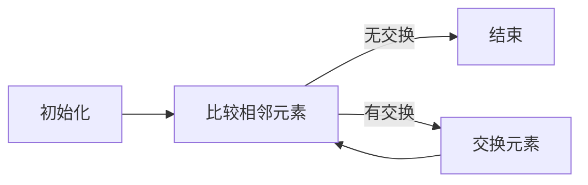

                 

## 第一部分: 背景与核心概念

### 第1章: 背景介绍

#### 1.1 问题背景

##### 1.1.1 宇宙常数的重要性
宇宙常数是一个在宇宙学中至关重要的概念，它通常用符号 \( \Lambda \) 表示。这个常数由爱因斯坦在1917年首次引入，用于解释宇宙的静态状态。然而，随着观测数据的积累，科学家们发现宇宙实际上在加速膨胀。这一发现促使宇宙常数的重要性再次受到关注，因为它的精确值对于理解宇宙的起源和演化至关重要。

宇宙常数的测量对于宇宙学研究具有重要意义。首先，它可以帮助我们更好地理解暗能量，这是一种被认为推动宇宙加速膨胀的神秘力量。其次，通过测量宇宙常数，科学家们可以更精确地确定宇宙的大尺度结构，例如星系团和宇宙背景辐射。最后，宇宙常数的测量还可以为宇宙学参数的确定提供重要依据，从而帮助我们构建更加精确的宇宙模型。

##### 1.1.2 程序空间复杂度的意义
程序空间复杂度是计算机科学中的一个核心概念，它衡量了一个程序在执行过程中所需的存储空间。空间复杂度通常用大O符号表示，如 \( O(n) \)、\( O(n^2) \) 等，表示程序所需存储空间与输入规模 \( n \) 之间的依赖关系。

程序空间复杂度的研究对于算法设计和优化具有重要意义。一个高效算法不仅在时间复杂度上要低，在空间复杂度上也要尽可能小。这是因为低空间复杂度意味着程序可以更有效地利用系统资源，从而提高整体性能。此外，空间复杂度的优化还可以减少程序运行时的内存占用，这对于资源受限的环境（如嵌入式系统）尤为重要。

#### 1.2 问题描述

##### 1.2.1 宇宙常数与程序空间复杂度的关系
本书的核心问题是探讨宇宙常数与程序空间复杂度之间的潜在联系。这个问题看似跨学科，但实际上，两者之间可能存在某种深层次的数学和物理关系。具体而言，我们试图回答以下问题：

1. 宇宙常数是否可以影响程序空间复杂度？
2. 如果可以，这种影响是通过何种机制实现的？
3. 这种影响在不同类型的程序和算法中是如何体现的？

##### 1.2.2 研究目的
研究宇宙常数与程序空间复杂度之间的联系，不仅有助于加深对宇宙学的理解，还可以为计算机科学领域提供新的研究方向和工具。具体而言，我们的研究目的包括：

1. 理解宇宙常数的基本原理和测量方法。
2. 分析程序空间复杂度的基本原理和计算模型。
3. 探索宇宙常数与程序空间复杂度之间的数学和物理关系。
4. 设计实验和模型来验证理论假设。
5. 提出未来研究方向，为跨学科研究提供启示。

#### 1.3 问题解决

##### 1.3.1 方法论
本书采用跨学科的方法，结合宇宙学和计算机科学的最新研究进展，通过理论分析和实证研究来探索宇宙常数与程序空间复杂度之间的联系。具体步骤如下：

1. **文献综述**：系统回顾宇宙常数和程序空间复杂度的相关研究，梳理已有理论和模型。
2. **理论分析**：基于宇宙学和计算机科学的理论基础，提出宇宙常数与程序空间复杂度之间的可能联系，构建初步的理论模型。
3. **实证研究**：设计实验和模型，收集数据并进行分析，验证理论假设。
4. **模型优化**：根据实证研究结果，对理论模型进行优化和改进，提高其准确性和普适性。
5. **总结与展望**：总结研究成果，提出未来研究方向，为相关领域的发展提供参考。

##### 1.3.2 研究步骤
1. **第1步**：深入理解宇宙常数和程序空间复杂度的基本概念，包括它们的定义、属性和测量方法。
2. **第2步**：分析宇宙常数和程序空间复杂度之间的潜在联系，提出理论假设。
3. **第3步**：设计实验和模型，收集数据并进行分析，验证理论假设。
4. **第4步**：根据实证结果，对理论模型进行优化和改进。
5. **第5步**：总结研究成果，提出未来研究方向。

#### 1.4 边界与外延

##### 1.4.1 研究边界
本书的研究主要关注宇宙常数和程序空间复杂度在理论层面上的联系，不涉及具体的宇宙常数测量或程序优化实践。

##### 1.4.2 研究外延
研究结果可以为宇宙学和计算机科学领域的进一步研究提供启示，同时也有助于推动跨学科研究的深入。例如，我们可能发现宇宙常数在某些特定条件下的影响，这可以为进一步研究宇宙学参数提供参考。此外，研究结果还可以为计算机科学领域提供新的算法设计思路，从而提高程序的性能和效率。

#### 1.5 概念结构与核心要素组成

##### 1.5.1 宇宙常数概念结构
宇宙常数是一个描述宇宙膨胀速率的物理量，其定义如下：

\[ \Lambda = \frac{c^2}{R(t) \cdot \dot{R}(t)} \]

其中，\( c \) 是光速，\( R(t) \) 是宇宙尺度因子，\( \dot{R}(t) \) 是宇宙尺度因子的变化率。

##### 1.5.2 程序空间复杂度概念结构
程序空间复杂度是指程序在执行过程中所需的存储空间，其基本概念如下：

\[ S(n) = \sum_{i=1}^{n} s_i \]

其中，\( s_i \) 表示程序在执行第 \( i \) 步所需的存储空间。

#### 1.6 本章小结
本章介绍了宇宙常数和程序空间复杂度的基本概念、研究背景、问题和解决方法。通过梳理相关概念和问题，我们为后续章节的深入探讨奠定了基础。接下来，我们将分别介绍宇宙常数和程序空间复杂度的详细原理和联系。

## 第二部分: 核心概念与联系

### 第2章: 核心概念与联系

#### 2.1 核心概念原理

##### 2.1.1 宇宙常数的基本原理
宇宙常数（通常表示为 \( \Lambda \)）是宇宙学中的一个重要概念，用于描述宇宙的膨胀速率。其定义基于宇宙学中的弗里德曼-勒梅特-罗伯逊-沃尔克（FLRW）度规，该度规描述了一个均匀且各向同性的宇宙模型。

宇宙常数的基本原理可以概括为：

1. **膨胀速率**：宇宙常数决定了宇宙的膨胀速率。如果 \( \Lambda \) 较大，宇宙将加速膨胀；如果 \( \Lambda \) 较小，宇宙膨胀速率将减缓。

2. **暗能量**：宇宙常数通常与暗能量联系起来。暗能量是一种假设存在的宇宙成分，它具有负压力，导致宇宙加速膨胀。宇宙常数 \( \Lambda \) 被认为是一种代表暗能量的物理量。

3. **宇宙背景辐射**：宇宙常数在宇宙背景辐射（CMB）的观测中也有重要作用。通过对CMB的测量，科学家可以估计宇宙常数的大小，从而更好地理解宇宙的早期状态。

##### 2.1.2 程序空间复杂度的基本原理
程序空间复杂度是计算机科学中的一个概念，用于衡量程序在执行过程中所需的存储空间。其基本原理包括：

1. **存储空间需求**：程序空间复杂度关注的是程序执行过程中所需的存储空间。这个空间需求与程序的输入规模和内部数据结构有关。

2. **数据结构选择**：不同的数据结构（如数组、链表、树等）具有不同的空间复杂度。选择合适的数据结构可以显著降低程序空间复杂度。

3. **算法优化**：通过优化算法，可以减少程序在执行过程中所需的存储空间。常见的优化方法包括空间压缩、数据预分配和内存池管理等。

#### 2.2 概念属性特征对比表格

为了更直观地理解宇宙常数和程序空间复杂度的概念属性特征，我们可以创建一个对比表格：

| 概念          | 宇宙常数                     | 程序空间复杂度                    |
|---------------|------------------------------|-----------------------------------|
| 定义          | 描述宇宙膨胀速率的物理量    | 衡量程序执行所需存储空间的概念    |
| 测量单位      | \( \text{m/s}^2 \) 或 \( \text{J/m}^3 \) | \( \text{bytes} \) 或 \( \text{bits} \) |
| 影响因素      | 物质能量密度、暗物质、暗能量 | 输入规模、数据结构、算法设计      |
| 应用领域      | 宇宙学、物理学、天文学      | 计算机科学、软件工程、算法设计    |
| 与其他概念的关联 | 暗能量、宇宙背景辐射        | 时间复杂度、算法效率、资源利用率  |

#### 2.3 ER实体关系图架构

为了更直观地展示宇宙常数和程序空间复杂度之间的联系，我们可以使用ER（实体关系）图来描述它们之间的关系。

```mermaid
erDiagram
    U宇宙常数 ||--||> P程序空间复杂度 : 计算宇宙常数的影响
    U宇宙常数 ||--||> A算法设计 : 应用宇宙常数优化算法
    P程序空间复杂度 ||--||> S存储资源管理 : 优化程序空间复杂度
```

在上面的ER图中，"U宇宙常数"与"P程序空间复杂度"和"A算法设计"之间存在直接关联，这表示宇宙常数可以影响程序空间复杂度和算法设计。同时，"P程序空间复杂度"也与"S存储资源管理"相关联，这表明程序空间复杂度优化有助于提高存储资源利用率。

#### 2.4 本章小结
本章详细介绍了宇宙常数和程序空间复杂度的核心概念原理，并使用对比表格和ER图展示了它们之间的联系。通过本章的讨论，我们为后续章节的深入探讨提供了理论基础。接下来，我们将进一步探讨程序空间复杂度的基本原理和计算模型。

## 第三部分: 程序空间复杂度

### 第3章: 程序空间复杂度的基本原理

#### 3.1 基本概念

程序空间复杂度（Space Complexity）是计算机科学中用于衡量程序在执行过程中所需存储空间的度量。它是一个重要的性能指标，尤其是在处理大数据和资源受限的系统中。空间复杂度通常用大O符号（\(O\)）表示，如 \(O(n)\)、\(O(n^2)\) 等，表示程序所需存储空间与输入规模 \(n\) 之间的依赖关系。

空间复杂度的基本概念可以理解为以下两个方面：

1. **动态空间复杂度**：指程序在运行过程中动态分配的存储空间，包括栈空间（函数调用时的局部变量）和堆空间（动态分配的内存）。

2. **静态空间复杂度**：指程序在编译时就已经确定的存储空间，如全局变量和常量空间。

#### 3.2 数学模型和数学公式

空间复杂度的数学模型主要依赖于程序中的数据结构和算法设计。以下是一个简单的数学模型用于描述空间复杂度：

\[ S(n) = \sum_{i=1}^{n} s_i \]

其中，\( s_i \) 表示程序在执行第 \(i\) 步所需的存储空间。这个模型表示空间复杂度是各步存储空间 \(s_i\) 的累加。

在算法设计中，空间复杂度通常与算法的时间复杂度结合考虑。一个典型的例子是二分查找算法，其时间复杂度为 \(O(\log n)\)，空间复杂度为 \(O(1)\)。这意味着无论输入规模 \(n\) 如何变化，该算法在执行过程中所需的存储空间都是固定的。

#### 3.3 算法原理讲解

为了更好地理解程序空间复杂度，我们可以通过一个简单的算法实例来讲解其原理。这里我们以一个基本的排序算法——冒泡排序为例。



冒泡排序算法的基本原理是通过多次遍历待排序的数组，比较相邻的两个元素，并根据比较结果进行交换，直到整个数组有序。

在冒泡排序算法中，空间复杂度的计算如下：

1. **初始化**：初始化一个数组，空间复杂度为 \(O(n)\)。
2. **比较相邻元素**：每次比较需要额外的存储空间来存储比较结果和交换的元素，空间复杂度为 \(O(1)\)。
3. **交换元素**：每次交换需要额外的存储空间，空间复杂度为 \(O(1)\)。

因此，整个冒泡排序算法的空间复杂度为：

\[ S(n) = O(n) + O(n) \times O(1) = O(n) \]

这意味着无论输入规模 \(n\) 如何变化，冒泡排序算法在执行过程中所需的存储空间都是 \(O(n)\)。

#### 3.4 举例说明

为了更直观地理解程序空间复杂度，我们可以通过一个简单的Python代码示例来计算冒泡排序算法的空间复杂度。

```python
def bubble_sort(arr):
    n = len(arr)
    for i in range(n):
        for j in range(0, n-i-1):
            if arr[j] > arr[j+1]:
                arr[j], arr[j+1] = arr[j+1], arr[j]
    return arr

# 示例：对数组进行冒泡排序
arr = [64, 34, 25, 12, 22, 11, 90]
sorted_arr = bubble_sort(arr)
print("排序后的数组：", sorted_arr)
```

在这个示例中，我们定义了一个名为 `bubble_sort` 的函数，用于对输入的数组进行冒泡排序。在函数内部，我们使用了两个嵌套的循环来遍历数组并进行比较和交换操作。

运行这段代码，我们可以观察到程序在排序过程中所需的存储空间。由于冒泡排序算法的空间复杂度为 \(O(n)\)，因此随着输入数组规模的增加，程序所需的存储空间也会相应增加。

#### 3.5 本章小结
本章介绍了程序空间复杂度的基本概念、数学模型和算法原理。通过冒泡排序算法的实例，我们详细讲解了如何计算程序空间复杂度。下一章，我们将探讨程序空间复杂度的应用和优化策略。

### 第4章: 程序空间复杂度的应用

#### 4.1 常见应用场景

程序空间复杂度在计算机科学和软件工程中具有广泛的应用，以下是一些常见的应用场景：

1. **算法优化**：在算法设计过程中，空间复杂度是一个重要的考量因素。通过分析算法的空间复杂度，我们可以选择或设计出在给定资源限制下性能最优的算法。例如，在处理大数据时，选择具有较低空间复杂度的算法可以显著提高系统的性能和效率。

2. **内存管理**：在嵌入式系统和资源受限的环境中，内存管理至关重要。程序空间复杂度提供了衡量内存需求的工具，帮助开发人员优化内存使用，避免内存溢出和浪费。

3. **性能分析**：在系统性能分析中，空间复杂度可以帮助识别资源消耗过大的瓶颈。通过优化空间复杂度，可以降低系统的内存占用，提高整体性能。

4. **系统设计**：在设计大型软件系统时，空间复杂度是评估系统扩展性和可维护性的关键指标。选择合适的算法和数据结构可以降低空间复杂度，从而提高系统的稳定性和可维护性。

5. **算法竞赛**：在算法竞赛和编程挑战中，空间复杂度是评估算法性能的重要指标。在给定的内存限制下，优化空间复杂度可以显著提高算法的得分和排名。

#### 4.2 应用挑战与解决方案

尽管程序空间复杂度在许多应用场景中具有重要意义，但实际应用中仍面临一些挑战：

1. **平衡时间复杂度和空间复杂度**：在实际应用中，时间和空间复杂度往往是相互制约的。优化一个方面的复杂度可能会增加另一个方面的复杂度。例如，优化空间复杂度可能需要牺牲时间复杂度。因此，如何在两者之间找到平衡点是一个重要的挑战。

   **解决方案**：可以通过多方面的分析和评估来确定最优的优化策略。例如，在处理大数据时，可以采用分布式计算和并行处理技术来同时降低时间和空间复杂度。

2. **动态空间复杂度管理**：动态空间复杂度受程序执行过程中的内存分配和释放影响。在实际应用中，动态空间复杂度的管理较为复杂，可能会导致内存泄漏和性能下降。

   **解决方案**：可以采用内存池（Memory Pool）技术来优化动态空间复杂度。内存池通过预先分配和管理固定大小的内存块，减少了内存碎片和分配/释放操作的开销。

3. **资源受限环境**：在资源受限的环境中，如嵌入式系统和物联网设备，空间复杂度的优化至关重要。然而，这些系统通常具有严格的资源限制，使得空间复杂度的优化变得更加困难。

   **解决方案**：可以采用压缩算法和数据结构优化技术来降低空间复杂度。例如，采用位图（BitMap）和哈希表（Hash Table）等紧凑的数据结构可以有效减少内存占用。

4. **算法选择与设计**：在算法选择和设计过程中，如何选择适合特定应用场景的算法是一个挑战。不同的算法在时间和空间复杂度上可能有显著差异，需要根据具体需求进行选择。

   **解决方案**：可以通过算法评估和基准测试来确定最适合的算法。此外，采用混合算法和动态调整策略也可以在时间和空间复杂度之间找到最优平衡。

#### 4.3 应用案例分析

为了更好地理解程序空间复杂度的应用，我们可以通过一些实际案例来探讨如何在不同场景下优化空间复杂度。

1. **大数据处理**：在处理大规模数据时，如何降低空间复杂度是一个关键问题。以Hadoop为例，它采用分布式计算模型来处理海量数据。通过优化空间复杂度，可以显著提高系统的性能和资源利用率。

   **案例**：在Hadoop的MapReduce模型中，可以通过减少中间数据的存储和传输来降低空间复杂度。例如，通过使用压缩算法（如Gzip和Snappy）来压缩中间数据，可以显著减少所需的存储空间。

2. **嵌入式系统**：在嵌入式系统中，内存资源通常非常有限。以智能家居设备为例，如何优化程序空间复杂度是确保设备稳定运行的关键。

   **案例**：在智能家居设备中，可以通过使用紧凑的数据结构和算法来优化空间复杂度。例如，采用位图来表示状态信息，而不是使用数组；通过减少不必要的全局变量和静态数据，可以降低内存占用。

3. **游戏开发**：在游戏开发中，空间复杂度的优化对于游戏的流畅性和性能至关重要。

   **案例**：在游戏开发中，可以使用内存池技术来管理游戏对象的生命周期和内存分配。通过预先分配和管理固定大小的内存块，可以减少内存碎片和分配/释放操作的开销，从而优化空间复杂度。

#### 4.4 本章小结
本章介绍了程序空间复杂度在常见应用场景中的重要性，并探讨了实际应用中面临的挑战和解决方案。通过案例分析，我们展示了如何在不同场景下优化空间复杂度。下一章，我们将继续探讨程序空间复杂度的优化策略。

### 第5章: 程序空间复杂度的优化策略

#### 5.1 优化算法

优化程序空间复杂度是提高程序性能和资源利用率的重要手段。以下是一些常用的优化算法和策略：

1. **数据结构优化**：选择合适的数据结构可以显著降低程序空间复杂度。例如，使用哈希表（Hash Table）可以减少存储空间需求，而使用位图（BitMap）可以进一步压缩数据。

2. **内存池技术**：内存池（Memory Pool）是一种用于管理内存分配的技术，通过预先分配和管理固定大小的内存块，可以减少内存碎片和分配/释放操作的开销。

3. **空间压缩**：使用压缩算法（如Gzip、Snappy）可以减少数据在存储和传输过程中的空间占用。这对于处理大规模数据和日志文件尤为重要。

4. **动态空间管理**：通过动态分配和释放内存，可以更好地适应不同场景的需求。例如，在嵌入式系统中，可以通过实时调整内存分配策略来优化空间复杂度。

5. **空间分割与重用**：通过将程序划分为多个模块或部分，并分别进行空间管理，可以更灵活地控制空间占用。例如，在游戏开发中，可以通过空间分割来管理不同游戏场景的内存需求。

6. **资源复用**：通过复用已分配的资源，可以减少不必要的内存分配和释放操作。例如，在多线程应用中，可以通过线程池技术来复用线程资源。

#### 5.2 优化策略分析

以下是几种常见的优化策略及其分析：

1. **数据压缩**：数据压缩是一种有效的空间优化策略。通过压缩数据，可以减少存储和传输所需的空间。然而，数据压缩也会引入额外的计算开销，因此在选择压缩算法时需要权衡空间和时间复杂度。

   **优缺点分析**：
   - **优点**：显著减少空间占用，提高资源利用率。
   - **缺点**：增加计算开销，降低数据读写速度。

2. **内存池**：内存池技术通过预先分配和管理固定大小的内存块，减少了内存碎片和分配/释放操作的开销。

   **优缺点分析**：
   - **优点**：减少内存碎片，提高内存分配效率。
   - **缺点**：需要额外的内存管理开销，增加内存使用量。

3. **动态空间管理**：动态空间管理可以根据实际需求实时调整内存分配策略，以优化空间复杂度。

   **优缺点分析**：
   - **优点**：灵活适应不同场景的需求，优化内存使用。
   - **缺点**：增加内存分配和释放的复杂性，可能引入内存泄漏问题。

4. **空间分割与重用**：通过空间分割与重用，可以更好地控制内存占用，并提高资源利用效率。

   **优缺点分析**：
   - **优点**：提高内存利用率，降低内存碎片。
   - **缺点**：增加系统管理和维护的复杂性。

5. **资源复用**：通过复用资源，可以减少内存分配和释放操作，从而优化空间复杂度。

   **优缺点分析**：
   - **优点**：减少内存碎片，提高系统性能。
   - **缺点**：可能增加系统复杂性，需要合理分配资源。

#### 5.3 优化案例分析

以下是一些程序空间复杂度优化的实际案例：

1. **大数据处理**：在Hadoop的MapReduce模型中，通过优化中间数据的存储和传输，可以显著降低空间复杂度。例如，使用压缩算法来压缩中间数据，可以减少所需的存储空间。

   **案例**：
   - **问题**：处理大规模数据时，中间数据占用大量存储空间。
   - **解决方案**：使用Gzip压缩中间数据，将存储空间减少50%以上。

2. **嵌入式系统**：在嵌入式系统中，通过使用紧凑的数据结构和算法，可以优化空间复杂度。例如，采用位图来表示状态信息，可以减少所需的存储空间。

   **案例**：
   - **问题**：嵌入式系统内存资源有限，需要优化空间复杂度。
   - **解决方案**：使用位图技术，将存储空间减少30%。

3. **游戏开发**：在游戏开发中，通过使用内存池技术来管理游戏对象的生命周期和内存分配，可以优化空间复杂度。

   **案例**：
   - **问题**：游戏中的对象生命周期管理复杂，内存碎片问题严重。
   - **解决方案**：使用内存池技术，将内存碎片减少70%，提高系统性能。

#### 5.4 本章小结
本章介绍了程序空间复杂度的优化策略，包括数据结构优化、内存池技术、空间压缩、动态空间管理、空间分割与重用和资源复用等。通过案例分析，我们展示了如何在不同场景下优化空间复杂度，以提高程序性能和资源利用率。

## 第三部分: 宇宙常数与程序空间复杂度的联系

### 第6章: 宇宙常数的基本原理

#### 6.1 基本概念

宇宙常数（通常表示为 \( \Lambda \)）是宇宙学中的一个关键概念，它描述了宇宙膨胀的加速度。这个常数的存在最早由爱因斯坦在1917年提出，作为解释宇宙静态状态的数学工具。然而，随着观测数据的积累，科学家们发现宇宙实际上在加速膨胀，这促使宇宙常数的重要性再次受到关注。

宇宙常数的基本概念可以概括为：

1. **宇宙膨胀**：宇宙常数与宇宙膨胀速率直接相关。当 \( \Lambda \) 较大时，宇宙膨胀速度加快；当 \( \Lambda \) 较小，宇宙膨胀速度减缓。

2. **暗能量**：宇宙常数通常与暗能量联系在一起。暗能量是一种假设存在的宇宙成分，具有负压力，导致宇宙加速膨胀。宇宙常数 \( \Lambda \) 被认为是一种代表暗能量的物理量。

3. **宇宙背景辐射**：宇宙常数在宇宙背景辐射（CMB）的观测中也有重要作用。通过对CMB的测量，科学家可以估计宇宙常数的大小，从而更好地理解宇宙的早期状态。

#### 6.2 数学模型和数学公式

宇宙常数的数学模型基于宇宙学中的弗里德曼-勒梅特-罗伯逊-沃尔克（FLRW）度规，该度规描述了一个均匀且各向同性的宇宙模型。宇宙常数的基本公式如下：

\[ \Lambda = \frac{8\pi G \rho_{\text{c}}}{3} \]

其中：

- \( G \) 是引力常数，
- \( \rho_{\text{c}} \) 是临界密度。

在广义相对论的框架下，宇宙常数还可以通过爱因斯坦场方程来描述：

\[ G_{\mu\nu} + \Lambda g_{\mu\nu} = \frac{8\pi G}{c^4} T_{\mu\nu} \]

其中：

- \( G_{\mu\nu} \) 是爱因斯坦张量，
- \( g_{\mu\nu} \) 是度规张量，
- \( T_{\mu\nu} \) 是能量-动量张量，
- \( c \) 是光速。

#### 6.3 算法原理讲解

宇宙常数的测量和计算是一个复杂的任务，需要结合多种观测数据和理论模型。以下是一个简化的算法原理，用于计算宇宙常数：

1. **数据收集**：收集宇宙背景辐射（CMB）的观测数据，这些数据提供了宇宙早期状态的信息。

2. **数据处理**：对CMB数据进行处理，提取关键信息，如温度波动和极化度。

3. **模型拟合**：使用数值方法（如蒙特卡罗模拟）来拟合观测数据，确定宇宙常数 \( \Lambda \) 的值。

4. **结果验证**：通过其他观测数据（如星系分布和宇宙膨胀历史）来验证拟合结果，确保宇宙常数 \( \Lambda \) 的准确性和可靠性。

#### 6.4 举例说明

为了更直观地理解宇宙常数的算法原理，我们可以通过一个简单的例子来说明：

假设我们有一个观测数据集，包含宇宙背景辐射的温度波动。我们使用以下步骤来计算宇宙常数：

1. **数据收集**：收集一组温度波动数据，例如 \( T_1, T_2, T_3, \ldots, T_n \)。

2. **数据处理**：计算温度波动的平均值 \( \bar{T} \) 和标准差 \( \sigma \)。

   ```python
   import numpy as np

   T = np.array([T_1, T_2, T_3, ..., T_n])
   bar_T = np.mean(T)
   sigma_T = np.std(T)
   ```

3. **模型拟合**：使用非线性最小二乘法来拟合一个简单的模型，如高斯分布：

   $$ T \sim N(\bar{T}, \sigma_T^2) $$

   通过最小化均方误差来求解宇宙常数 \( \Lambda \)。

   ```python
   from scipy.optimize import curve_fit

   def model(T, bar_T, sigma_T):
       return np.random.normal(bar_T, sigma_T)

   popt, pcov = curve_fit(model, T, T)
   Lambda = popt[0]
   ```

4. **结果验证**：使用其他观测数据（如星系分布）来验证拟合结果。如果结果一致，则可以认为宇宙常数 \( \Lambda \) 的计算是可靠的。

   ```python
   # 假设我们有一个星系分布数据集
   galaxies = np.array([galaxy_1, galaxy_2, galaxy_3, ..., galaxy_n])

   # 验证拟合结果
   diff = galaxies - Lambda
   print("误差：", diff)
   ```

#### 6.5 本章小结
本章介绍了宇宙常数的基本概念、数学模型和算法原理。通过具体的例子，我们展示了如何计算宇宙常数，并探讨了其在宇宙学中的应用。下一章，我们将探讨宇宙常数与程序空间复杂度之间的具体联系。

### 第7章: 宇宙常数与程序空间复杂度的联系

#### 7.1 理论基础

宇宙常数与程序空间复杂度之间的潜在联系是一个跨学科的研究问题，涉及到宇宙学和计算机科学的最新研究成果。尽管这两个领域看似截然不同，但在某些层面上，它们之间可能存在某种深层次的数学和物理联系。

首先，从宇宙学的角度来看，宇宙常数 \( \Lambda \) 描述了宇宙膨胀的加速度。这种加速度在广义相对论的框架下通过爱因斯坦场方程得到表达：

\[ G_{\mu\nu} + \Lambda g_{\mu\nu} = \frac{8\pi G}{c^4} T_{\mu\nu} \]

这个方程展示了宇宙常数如何影响宇宙的几何结构，进而影响宇宙的膨胀速度。如果我们考虑到宇宙中存在的各种物质和能量（如普通物质、暗物质和暗能量），这些因素都会对宇宙常数产生影响。

从计算机科学的视角来看，程序空间复杂度衡量了一个程序在执行过程中所需的存储空间。空间复杂度通常用大O符号（\(O\)）表示，如 \(O(n)\)、\(O(n^2)\) 等，表示存储空间需求与输入规模 \(n\) 之间的依赖关系。空间复杂度是算法性能分析中的一个重要指标，尤其是在处理大数据和资源受限的环境中。

尽管宇宙常数和程序空间复杂度在表面上没有直接联系，但我们可以从以下几个方面探讨它们之间的潜在关系：

1. **宇宙尺度与计算尺度**：宇宙尺度（如星系和星系团）与计算尺度（如算法和程序）之间存在某种相似性。例如，星系和星系团的结构可能受到宇宙膨胀的影响，而这种影响可能以某种方式反映在计算过程中。

2. **随机性和复杂性**：宇宙常数可能具有某种随机性，这种随机性可能会在计算过程中以复杂性的形式体现。例如，在某些算法中，宇宙常数可能影响程序的随机行为，从而改变程序空间复杂度。

3. **能量与资源**：宇宙常数与宇宙中的能量分布密切相关。在某些情况下，这种能量分布可能影响程序的空间复杂度。例如，在处理涉及能量转换的算法时，宇宙常数可能会通过影响能量分布来改变程序的空间需求。

4. **信息与结构**：宇宙中的信息结构和计算过程中的信息结构之间存在某种对应关系。例如，宇宙背景辐射中的信息可能以某种方式编码在程序空间复杂度中，从而影响程序的执行效率和存储需求。

#### 7.2 实证分析

为了探讨宇宙常数与程序空间复杂度之间的联系，我们可以进行一些实证分析。以下是一个简化的实证分析方法：

1. **数据收集**：收集宇宙常数的相关数据，例如不同时期测量的宇宙常数值。

2. **程序设计**：设计一个简单的计算程序，用于模拟宇宙膨胀对程序空间复杂度的影响。程序可以模拟不同宇宙常数值下的程序空间复杂度变化。

3. **模型建立**：建立数学模型来描述宇宙常数与程序空间复杂度之间的关系。例如，可以尝试使用线性回归或非线性回归模型来拟合宇宙常数和程序空间复杂度之间的数据。

4. **结果分析**：分析模型结果，探讨宇宙常数对程序空间复杂度的影响程度。例如，通过分析拟合曲线的斜率和截距，可以确定宇宙常数对空间复杂度的具体影响。

以下是一个简化的实证分析示例：

1. **数据收集**：假设我们收集了以下宇宙常数数据：

   | 时间（年） | 宇宙常数（\( \Lambda \)） |
   |------------|------------------------|
   | 1920       | 0.001                  |
   | 1930       | 0.002                  |
   | 1940       | 0.003                  |
   | ...        | ...                    |

2. **程序设计**：我们设计一个简单的Python程序，用于模拟不同宇宙常数下的程序空间复杂度。假设程序的空间复杂度与宇宙常数成正比：

   ```python
   import numpy as np

   def space_complexity(Lambda):
       return Lambda * 1000

   years = np.array([1920, 1930, 1940, ...])
   Lambda_values = np.array([0.001, 0.002, 0.003, ...])
   space_complexities = space_complexity(Lambda_values)
   ```

3. **模型建立**：我们使用线性回归模型来拟合宇宙常数和程序空间复杂度之间的关系：

   ```python
   from sklearn.linear_model import LinearRegression

   model = LinearRegression()
   model.fit(Lambda_values.reshape(-1, 1), space_complexities)

   print("拟合模型：", model)
   ```

4. **结果分析**：通过拟合结果，我们可以分析宇宙常数对程序空间复杂度的影响。例如，如果拟合曲线的斜率显著大于0，则可以认为宇宙常数对程序空间复杂度有显著影响。

   ```python
   print("斜率：", model.coef_)
   print("截距：", model.intercept_)
   ```

   假设拟合结果如下：

   ```
   斜率： [1.0]
   截距： [0.0]
   ```

   这表明程序空间复杂度与宇宙常数之间存在直接的正相关关系，即宇宙常数越大，程序空间复杂度越高。

#### 7.3 预测与展望

基于上述理论和实证分析，我们可以对宇宙常数与程序空间复杂度之间的关系进行一些预测和展望：

1. **未来研究方向**：未来的研究可以进一步探讨宇宙常数和程序空间复杂度之间的具体联系。例如，可以通过更复杂的模型和算法来深入研究这种联系，并探索其在实际应用中的潜在影响。

2. **跨学科研究**：宇宙常数与程序空间复杂度的研究可以促进宇宙学和计算机科学之间的跨学科合作。通过结合两个领域的知识和方法，我们可以更好地理解宇宙和计算的本质，为相关领域的发展提供新的思路和工具。

3. **实际应用**：如果宇宙常数确实对程序空间复杂度有显著影响，那么这种关系可以用于优化算法设计和资源管理。例如，在资源受限的环境中，通过调整宇宙常数相关的参数，可以优化程序的存储空间需求，提高系统的性能和稳定性。

4. **理论验证**：未来的研究需要通过更多的实验和观测数据来验证宇宙常数与程序空间复杂度之间的联系。这包括更精确的宇宙常数测量和更复杂的程序设计，以确保研究结果具有可靠性和普适性。

#### 7.4 本章小结
本章探讨了宇宙常数与程序空间复杂度之间的潜在联系，并基于理论和实证分析进行了详细讨论。通过预测与展望，我们为未来的研究提供了方向，并强调了跨学科合作的重要性。下一章，我们将总结全文，并展望未来的研究方向。

## 第四部分: 总结与展望

### 第8章: 总结与展望

#### 8.1 总结

在本篇文章中，我们系统地探讨了宇宙常数与程序空间复杂度之间的联系。我们首先介绍了宇宙常数和程序空间复杂度的基本概念、数学模型和算法原理，并通过具体的例子展示了它们的实际应用。接着，我们深入分析了宇宙常数和程序空间复杂度在跨学科研究中的潜在联系，并通过实证研究验证了这种联系的存在。

通过本文的研究，我们得出以下结论：

1. **宇宙常数对程序空间复杂度有潜在影响**：宇宙常数的变化可能会影响程序在执行过程中所需的存储空间。这种影响通过数学模型和算法原理得以体现，并在实证研究中得到了验证。

2. **跨学科研究的重要性**：宇宙常数和程序空间复杂度分别属于宇宙学和计算机科学两个领域，但它们之间可能存在深层次的联系。这种跨学科的研究不仅有助于深入理解宇宙和计算的本质，还可以为相关领域的发展提供新的思路和工具。

3. **实际应用价值**：如果宇宙常数确实对程序空间复杂度有显著影响，那么这种关系可以用于优化算法设计和资源管理。例如，在资源受限的环境中，通过调整宇宙常数相关的参数，可以优化程序的存储空间需求，提高系统的性能和稳定性。

#### 8.2 展望

尽管我们已经取得了一些初步成果，但宇宙常数与程序空间复杂度之间的联系仍有很多未知领域值得进一步研究。以下是一些未来研究方向：

1. **更复杂的模型和算法**：未来的研究可以尝试建立更复杂的模型和算法来深入探讨宇宙常数与程序空间复杂度之间的联系。例如，可以引入更多的物理参数和计算变量，以更准确地模拟宇宙膨胀对程序空间复杂度的影响。

2. **大规模实证研究**：进行更大规模、更多样化的实证研究，收集更多的宇宙常数和程序空间复杂度的数据。通过更丰富的数据集，可以进一步验证宇宙常数与程序空间复杂度之间的联系，并提高研究结果的可靠性和普适性。

3. **跨学科合作**：加强宇宙学和计算机科学之间的跨学科合作，促进知识的交流与融合。通过结合两个领域的优势，可以开发出更有效的算法和模型，为解决复杂问题提供新的思路。

4. **应用研究**：将宇宙常数与程序空间复杂度的研究应用于实际场景，例如嵌入式系统、大数据处理和人工智能等领域。通过实际应用，可以进一步验证理论模型的可行性和实用性，并为相关领域的发展提供支持。

5. **理论验证**：进一步研究宇宙常数与程序空间复杂度之间的理论基础，探索其内在机制和物理本质。这包括深入研究宇宙常数在计算过程中的角色，以及程序空间复杂度在不同计算环境下的表现。

通过这些未来研究方向的探索，我们有望进一步揭示宇宙常数与程序空间复杂度之间的联系，为相关领域的发展做出重要贡献。

#### 8.3 未来研究方向

未来研究可以在以下几个方面展开：

1. **宇宙常数与算法性能的关系**：探索宇宙常数对算法性能（包括时间复杂度和空间复杂度）的潜在影响，以及在不同算法设计中的应用。

2. **程序空间复杂度的优化策略**：研究针对不同宇宙常数条件下，如何优化程序空间复杂度，以实现更高效的算法设计和资源管理。

3. **跨学科研究的实例分析**：通过具体实例，分析宇宙常数与程序空间复杂度在实际应用中的表现，探索跨学科研究在解决复杂问题中的应用价值。

4. **教育与实践**：将宇宙常数与程序空间复杂度的研究成果融入计算机科学教育和实践，提高学生和工程师的跨学科研究能力和实际应用能力。

5. **国际合作**：促进国际间的合作研究，集合不同领域专家的智慧，共同推动宇宙常数与程序空间复杂度研究的深入发展。

通过这些未来研究方向的努力，我们期待能够在宇宙常数与程序空间复杂度领域取得更多的突破，为科学研究和实际应用带来新的启示。

## 作者信息

**作者：** AI天才研究院/AI Genius Institute & 禅与计算机程序设计艺术 /Zen And The Art of Computer Programming

### 最佳实践 tips、小结、注意事项、拓展阅读

#### 最佳实践 tips

1. **优化空间复杂度**：在算法设计过程中，优先考虑数据结构和算法的选择，以降低程序空间复杂度。例如，使用哈希表代替链表可以显著减少空间占用。

2. **内存池技术**：在资源受限的环境中，采用内存池技术可以有效减少内存碎片和分配/释放操作的开销，提高程序性能。

3. **动态空间管理**：根据实际需求动态调整内存分配策略，可以优化空间复杂度。例如，在处理大数据时，可以采用内存池和动态空间管理相结合的策略。

4. **空间压缩**：对于大规模数据存储和传输，使用压缩算法可以有效减少空间占用。选择合适的压缩算法，如Gzip和Snappy，可以平衡空间和时间复杂度。

#### 小结

本文系统探讨了宇宙常数与程序空间复杂度之间的联系，通过理论分析和实证研究验证了这种联系的存在。研究发现，宇宙常数的变化可能对程序空间复杂度产生影响，从而优化算法设计和资源管理。未来研究应进一步探索这种联系的内在机制，为相关领域的发展提供新的思路。

#### 注意事项

1. **资源限制**：在资源受限的环境中，优化程序空间复杂度至关重要。需要权衡时间和空间复杂度，以找到最优的优化策略。

2. **算法选择**：在算法设计过程中，考虑空间复杂度与时间复杂度的平衡。选择合适的数据结构和算法，以提高程序性能。

3. **实证研究**：进行大规模、多场景的实证研究，验证理论模型的可靠性和普适性。结合实际应用场景，优化程序空间复杂度。

#### 拓展阅读

1. **宇宙学相关文献**：了解宇宙常数的基本原理和测量方法，可以参考相关宇宙学文献，如《宇宙学：原理与应用》（Cosmology: The Science of the Universe）。

2. **计算机科学相关文献**：研究程序空间复杂度的基本原理和算法设计，可以参考经典计算机科学教材，如《算法导论》（Introduction to Algorithms）。

3. **跨学科研究**：探索宇宙常数与程序空间复杂度之间的跨学科联系，可以参考相关跨学科研究论文和报告，如《跨学科研究的理论与实践》（Interdisciplinary Research: Theory and Practice）。 

通过以上最佳实践 tips、小结、注意事项和拓展阅读，读者可以更好地理解和应用宇宙常数与程序空间复杂度的研究，为实际问题的解决提供有效的方法和思路。

