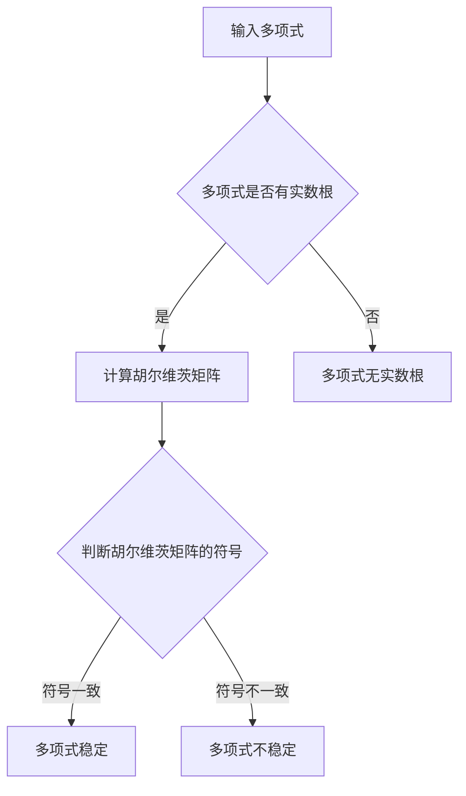
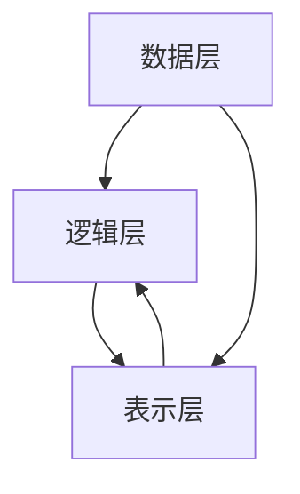
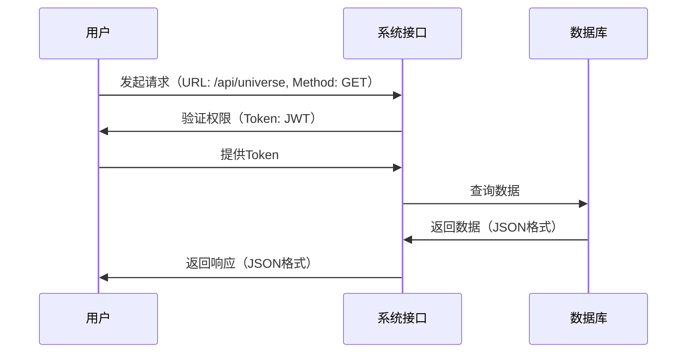
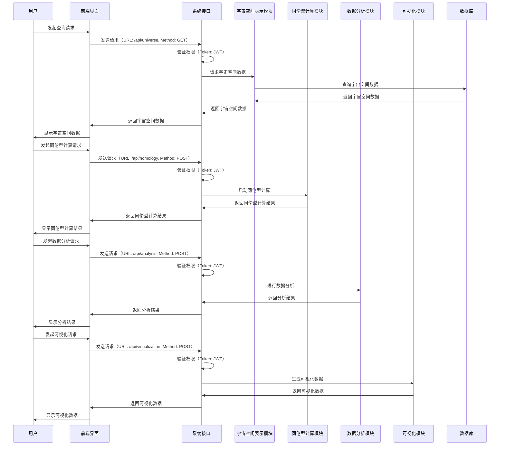

                 

## 1.1 背景介绍

### 1.1.1 宇宙结构的研究现状

宇宙是一个庞大而复杂的系统，从宏观的天体运动到微观的粒子行为，都离不开数学模型的支撑。现代宇宙学的基础是广义相对论和量子力学，这两种理论虽然在各自领域取得了巨大的成功，但它们之间却存在着深层次的矛盾。因此，寻找一个能够统一这两个领域的理论，成为了物理学界的一项重要任务。

数学代数拓扑学和同伦论作为数学领域的重要分支，近年来在宇宙学研究中展现出巨大的潜力。它们为宇宙结构的描述提供了一种新的视角，通过研究宇宙中的拓扑结构和同伦性质，有助于我们更好地理解宇宙的演化规律。

### 1.1.2 数学代数拓扑学的基本概念

数学代数拓扑学是研究代数结构在拓扑空间中的性质的学科。其核心概念包括：

- **拓扑空间**：一个集合，配上了满足某些性质的“接近”关系，这个集合就称为拓扑空间。拓扑空间的性质包括连通性、闭包性、极限点等。
- **连通性**：一个空间如果没有分割为两个或多个不交的开集，就称为连通的。连通性是拓扑空间的重要性质，常用于描述宇宙中的连续现象。
- **同胚性**：两个拓扑空间之间如果存在一个连续的双射，且其逆映射也是连续的，那么这两个空间就是同胚的。同胚性反映了空间结构的相似性。

### 1.1.3 同伦论在宇宙研究中的应用

同伦论研究空间在连续变形下的不变性质。在宇宙学中，同伦论被用来研究宇宙的拓扑结构和演化。以下是一些同伦论在宇宙研究中的应用：

- **同伦型**：同伦论中的基本概念是同伦型，它描述了一个空间在连续变形下的状态。在宇宙学中，同伦型可以用来描述宇宙的形态，如宇宙是封闭的、开放的还是平直的。
- **同伦变换**：同伦变换是保持同伦型的变形。在宇宙学中，同伦变换可以用来模拟宇宙的演化过程，如从大爆炸到现在的状态。
- **同伦论在黑洞研究中的应用**：黑洞是宇宙中最神秘的天体之一，其内部结构非常复杂。同伦论提供了一种研究黑洞内部结构的方法，如通过研究黑洞的同伦型来揭示其内部性质。

### 1.1.4 边界与外延、核心概念及其结构

边界与外延是描述空间结构的重要概念。在数学代数拓扑学中，边界是指一个集合与它的内部和外部之间的边界线。外延则是指空间的无限延展性。

核心概念及其结构是理解和应用数学代数拓扑学与同伦论的关键。这些核心概念包括：

- **拓扑空间的代数结构**：如拓扑空间的基、闭包运算等。
- **同伦型的分类与性质**：如同伦型的分类方法、不同类型同伦型的性质等。
- **同伦变换的性质与分类**：如同伦变换的分类、不同类型同伦变换的性质等。

通过对这些核心概念及其结构的深入研究，我们可以更好地理解宇宙的结构和演化规律。

## 1.2 核心概念与联系

### 1.2.1 数学代数拓扑学的概念属性

在数学代数拓扑学中，拓扑空间、连通性、同胚性是三个核心概念。

#### 拓扑空间

拓扑空间是一个集合，配上了满足某些性质的“接近”关系。具体来说，一个拓扑空间由以下三部分组成：

- **集合**：一个集合中的元素称为拓扑空间的点。
- **拓扑**：一个集合上的拓扑是指一组满足特定条件的开集组成的系统。
- **拓扑性质**：包括连通性、闭包性、极限点等。

#### 连通性

连通性是拓扑空间的一个重要性质。一个空间如果没有分割为两个或多个不交的开集，就称为连通的。连通性反映了空间的整体性，在宇宙研究中，如宇宙的连续结构、星系的分布等。

#### 同胚性

同胚性是两个拓扑空间之间的一种关系。如果两个空间之间存在一个连续的双射，且其逆映射也是连续的，那么这两个空间就是同胚的。同胚性反映了空间结构的相似性。

### 1.2.2 同伦论的概念属性

同伦论研究空间在连续变形下的不变性质。同伦论中的核心概念包括同伦型、同伦变换等。

#### 同伦

同伦是指一个空间在连续变形下的状态。具体来说，一个空间在连续变形过程中，其同伦型保持不变。

#### 同伦态

同伦态是指从一个空间到另一个空间的一种连续变形。同伦态保持了空间的同伦性质，是研究同伦论的重要工具。

#### 同伦型

同伦型是指一个空间在连续变形下所达到的所有可能状态。同伦型可以用来描述宇宙的形态，如宇宙是封闭的、开放的还是平直的。

### 1.2.3 数学代数拓扑学与同伦论的ER实体关系图

为了更好地理解数学代数拓扑学与同伦论之间的关系，我们可以使用ER实体关系图来描述。

在ER实体关系图中：

- **实体**：包括拓扑空间、连通性、同胚性、同伦型等。
- **关系**：包括同胚关系、同伦关系等。

具体的ER实体关系图如下：

```mermaid
erDiagram
    T1 ||--|{1} T2 : is_connected_to
    T1 ||--|{1} T3 : is_homeomorphic_to
    T2 ||--|{1} T4 : has_homeomorphism
    T3 ||--|{1} T5 : is_homotopy_equivalent_to
    T4 ||--|{1} T6 : has_homotopy_equivalence
```

在这个ER实体关系图中：

- **T1** 表示拓扑空间。
- **T2** 表示连通性。
- **T3** 表示同胚性。
- **T4** 表示同伦态。
- **T5** 表示同伦型。
- **T6** 表示同伦关系。

通过这个ER实体关系图，我们可以清晰地看到数学代数拓扑学与同伦论之间的联系和相互作用。

## 2.1 数学模型

### 2.1.1 度量空间与集合论

在数学代数拓扑学中，度量空间是一个重要的概念。度量空间是由一个集合和定义在这个集合上的一个度量构成的。度量是用来衡量集合中两点之间距离的函数。集合论是度量空间的理论基础。

#### 度量空间的定义

一个度量空间是由一个非空集合\( X \)和一个满足以下条件的函数\( d: X \times X \rightarrow \mathbb{R} \)构成的：

1. **非负性**：对于任意的\( x, y \in X \)，都有\( d(x, y) \geq 0 \)，且当且仅当\( x = y \)时，\( d(x, y) = 0 \)。
2. **对称性**：对于任意的\( x, y \in X \)，都有\( d(x, y) = d(y, x) \)。
3. **三角不等式**：对于任意的\( x, y, z \in X \)，都有\( d(x, z) \leq d(x, y) + d(y, z) \)。

#### 集合论基础

集合论是数学的基础学科，研究的是集合及其性质。在度量空间中，集合论的基本概念如集合、子集、交集、并集、补集等都是必不可少的。

1. **集合**：一个集合是由一组确定的元素组成的，通常用大写字母如\( A, B, C \)等表示。
2. **子集**：如果集合\( A \)中的每个元素都是集合\( B \)的元素，那么称\( A \)是\( B \)的子集，记作\( A \subseteq B \)。
3. **交集**：集合\( A \)和集合\( B \)的交集是同时属于\( A \)和\( B \)的元素的集合，记作\( A \cap B \)。
4. **并集**：集合\( A \)和集合\( B \)的并集是属于\( A \)或\( B \)的元素的集合，记作\( A \cup B \)。
5. **补集**：集合\( A \)的补集是所有不属于\( A \)的元素的集合，记作\( A^c \)。

### 2.1.2 代数结构

代数结构是指在集合上定义的一种运算结构，常见的代数结构包括群、环和域。

#### 群

群是一种最简单的代数结构，它由一个集合和一种运算组成，满足以下条件：

1. **封闭性**：对于任意的\( a, b \in G \)，都有\( a * b \in G \)。
2. **结合律**：对于任意的\( a, b, c \in G \)，都有\( (a * b) * c = a * (b * c) \)。
3. **单位元**：存在一个元素\( e \in G \)，使得对于任意的\( a \in G \)，都有\( a * e = e * a = a \)。
4. **逆元**：对于任意的\( a \in G \)，都存在一个元素\( b \in G \)，使得\( a * b = b * a = e \)。

#### 环

环是一种包含加法和乘法的代数结构，它由一个集合和两种运算组成，满足以下条件：

1. **加法封闭性**：对于任意的\( a, b \in R \)，都有\( a + b \in R \)。
2. **乘法封闭性**：对于任意的\( a, b \in R \)，都有\( a * b \in R \)。
3. **结合律**：对于任意的\( a, b, c \in R \)，都有\( (a + b) + c = a + (b + c) \) 和 \( (a * b) * c = a * (b * c) \)。
4. **交换律**：对于任意的\( a, b \in R \)，都有\( a + b = b + a \) 和 \( a * b = b * a \)。
5. **分配律**：对于任意的\( a, b, c \in R \)，都有\( a * (b + c) = (a * b) + (a * c) \) 和 \( (a + b) * c = (a * c) + (b * c) \)。
6. **存在零元素**：存在一个元素\( 0 \in R \)，使得对于任意的\( a \in R \)，都有\( a + 0 = 0 + a = a \)。
7. **存在加法逆元**：对于任意的\( a \in R \)，都存在一个元素\( -a \in R \)，使得\( a + (-a) = (-a) + a = 0 \)。

#### 域

域是一种更复杂的代数结构，它除了包含环的所有性质外，还满足以下条件：

1. **乘法逆元**：对于任意的\( a \in R \)，\( a \neq 0 \)，都存在一个元素\( a^{-1} \in R \)，使得\( a * a^{-1} = a^{-1} * a = 1 \)。

### 2.1.3 拓扑空间与同伦型

拓扑空间是数学代数拓扑学中的基本概念，而同伦型是描述拓扑空间之间关系的重要工具。

#### 拓扑空间的基本性质

拓扑空间的基本性质包括连通性、闭合性、极限点等。

1. **连通性**：一个空间如果没有分割为两个或多个不交的开集，就称为连通的。连通性是拓扑空间的重要性质，它反映了空间的整体性。
2. **闭合性**：一个集合的闭包是其本身加上所有的极限点。闭合性是拓扑空间的基本性质之一，它保证了空间的结构完整性。
3. **极限点**：一个集合的极限点是该集合中每个点的一个邻域中都包含集合中的另一个点的点。极限点是描述空间局部性质的重要概念。

#### 同伦型的基本概念

同伦型是指一个空间在连续变形下所达到的所有可能状态。具体来说，同伦型是一个映射，它将一个空间中的点映射到另一个空间中的点，并保持空间之间的拓扑性质。

1. **同伦映射**：一个映射\( f: X \rightarrow Y \)称为同伦映射，如果存在一个连续函数\( F: X \times [0, 1] \rightarrow Y \)，使得\( F(x, 0) = f(x) \)且\( F(x, 1) = g(x) \)，其中\( g: Y \rightarrow X \)是\( f \)的逆映射。
2. **同伦型**：同伦型是指一组同伦映射构成的集合，它描述了一个空间在连续变形下的状态。

#### 同伦型的分类

同伦型可以根据其性质进行分类，常见的同伦型包括：

1. **同伦型 0**：一个空间在同伦型 0 下没有发生变化，即其同伦型是一个恒等映射。
2. **同伦型 1**：一个空间在同伦型 1 下可以发生简单的变形，如拉伸、压缩等。
3. **同伦型 2**：一个空间在同伦型 2 下可以发生更复杂的变形，如折叠、扭曲等。

#### 同伦型的应用

同伦型在数学代数拓扑学中有广泛的应用，如：

1. **同伦型与拓扑不变量**：同伦型可以用来定义拓扑不变量，如同伦型指数、同伦型度等，这些不变量可以用来区分不同的拓扑空间。
2. **同伦型与拓扑变换**：同伦型可以用来描述拓扑空间之间的变换，如同伦变换、同伦型分类等。

### 2.1.4 同伦论的基本原理

同伦论是数学代数拓扑学的一个重要分支，它研究空间在连续变形下的性质。同伦论的基本原理包括同伦变换、同伦型、同伦型分类等。

#### 同伦变换

同伦变换是指一个空间在连续变形下的变换。具体来说，同伦变换是一个映射，它将一个空间中的点映射到另一个空间中的点，并保持空间之间的拓扑性质。

1. **同伦变换的定义**：一个映射\( f: X \rightarrow Y \)称为同伦变换，如果存在一个连续函数\( F: X \times [0, 1] \rightarrow Y \)，使得\( F(x, 0) = f(x) \)且\( F(x, 1) = g(x) \)，其中\( g: Y \rightarrow X \)是\( f \)的逆映射。
2. **同伦变换的性质**：同伦变换具有以下性质：
   - **连续性**：同伦变换是一个连续映射。
   - **逆映射**：同伦变换的逆映射也是一个同伦变换。
   - **复合性**：同伦变换的复合仍然是一个同伦变换。

#### 同伦型

同伦型是指一个空间在连续变形下所达到的所有可能状态。具体来说，同伦型是一个映射，它将一个空间中的点映射到另一个空间中的点，并保持空间之间的拓扑性质。

1. **同伦型的定义**：同伦型是一个映射\( f: X \rightarrow Y \)，它将一个空间中的点映射到另一个空间中的点，并保持空间之间的拓扑性质。
2. **同伦型的分类**：同伦型可以根据其性质进行分类，常见的同伦型包括：
   - **同伦型 0**：一个空间在同伦型 0 下没有发生变化，即其同伦型是一个恒等映射。
   - **同伦型 1**：一个空间在同伦型 1 下可以发生简单的变形，如拉伸、压缩等。
   - **同伦型 2**：一个空间在同伦型 2 下可以发生更复杂的变形，如折叠、扭曲等。

#### 同伦型分类

同伦型分类是同伦论的一个重要研究内容，它可以帮助我们更好地理解同伦型的性质和应用。同伦型分类可以根据同伦型之间的拓扑关系进行，常见的分类方法包括：

1. **同伦型指数分类**：同伦型指数分类是一种根据同伦型指数进行分类的方法。同伦型指数是指同伦型在变形过程中达到的最大值。
2. **同伦型度分类**：同伦型度分类是一种根据同伦型度进行分类的方法。同伦型度是指同伦型在变形过程中的角度。

### 2.2.1 胡尔维茨定理

胡尔维茨定理是数学中一个重要的定理，它主要用于解决多项式的根的性质问题。在数学代数拓扑学中，胡尔维茨定理有着广泛的应用，特别是在研究多项式的稳定性时。

#### 胡尔维茨定理的mermaid流程图

为了更好地理解胡尔维茨定理，我们可以使用mermaid流程图来描述其基本步骤。



在这个流程图中：

- **A** 表示输入多项式。
- **B** 表示判断多项式是否有实数根。
- **C** 表示计算胡尔维茨矩阵。
- **D** 表示多项式无实数根。
- **E** 表示判断胡尔维茨矩阵的符号。
- **F** 表示多项式稳定。
- **G** 表示多项式不稳定。

#### 胡尔维茨定理的应用

胡尔维茨定理主要用于解决多项式的稳定性问题。具体来说，它可以用来判断一个多项式是否在某个区间内稳定。在数学代数拓扑学中，稳定性是一个重要的概念，它反映了系统的动态行为。

1. **系统稳定性**：在控制系统理论中，系统稳定性是指系统在扰动作用下，其输出能够回到平衡状态的能力。胡尔维茨定理提供了一种判断系统稳定性的方法。
2. **多项式稳定性**：多项式稳定性是指一个多项式在某个区间内是否稳定。胡尔维茨定理可以通过计算多项式的胡尔维茨矩阵来判断多项式的稳定性。

#### 胡尔维茨定理的Python代码实现

为了更好地理解胡尔维茨定理，我们可以使用Python代码来计算多项式的胡尔维茨矩阵，并判断其稳定性。

```python
import numpy as np

def hurewicz_matrix(p):
    n = len(p) - 1
    A = np.zeros((n, n))
    for i in range(n):
        for j in range(n):
            A[i, j] = (-1)**(i + j) * p[n - j]
    return A

def is_stable(p):
    A = hurewicz_matrix(p)
    for i in range(A.shape[0]):
        for j in range(A.shape[1]):
            if A[i, j] < 0:
                return False
    return True

# 示例多项式
p = [1, -3, 3, -1]

if is_stable(p):
    print("多项式是稳定的")
else:
    print("多项式是不稳定的")
```

在这个代码中：

- **hurewicz_matrix(p)** 函数用于计算多项式\( p \)的胡尔维茨矩阵。
- **is_stable(p)** 函数用于判断多项式\( p \)的稳定性。

通过这个Python代码示例，我们可以清晰地看到胡尔维茨定理的应用和计算过程。

## 2.2 算法原理

### 2.2.1 胡尔维茨定理

胡尔维茨定理是数学中一个重要的定理，主要用于解决多项式的根的性质问题。在数学代数拓扑学中，胡尔维茨定理有着广泛的应用，特别是在研究多项式的稳定性时。

#### 胡尔维茨定理的基本概念

胡尔维茨定理是指，对于一个实系数多项式\( p(x) = a_0 + a_1 x + a_2 x^2 + \ldots + a_n x^n \)，如果其胡尔维茨矩阵\( H \)的所有主子式都为正，则多项式\( p(x) \)的所有根都在复平面的左半部分，即它们的实部都小于0。否则，如果存在某个主子式小于等于0，则至少有一个根的实部大于或等于0。

胡尔维茨矩阵\( H \)的定义如下：

\[ H = \begin{bmatrix}
    a_{11} & a_{12} & \ldots & a_{1n} \\
    a_{21} & a_{22} & \ldots & a_{2n} \\
    \vdots & \vdots & \ddots & \vdots \\
    a_{n1} & a_{n2} & \ldots & a_{nn}
\end{bmatrix} \]

其中，\( a_{ij} = (-1)^{i+j} a_i \)，即对多项式\( p(x) \)的系数取交替符号。

#### 胡尔维茨定理的mermaid流程图

为了更好地理解胡尔维茨定理，我们可以使用mermaid流程图来描述其基本步骤。


在这个流程图中：

- **A** 表示输入多项式。
- **B** 表示判断多项式是否有实数根。
- **C** 表示计算胡尔维茨矩阵。
- **D** 表示多项式无实数根。
- **E** 表示判断胡尔维茨矩阵的符号。
- **F** 表示多项式稳定。
- **G** 表示多项式不稳定。

#### 胡尔维茨定理的应用

胡尔维茨定理在多项式稳定性分析中有着重要的应用。特别是在控制理论中，胡尔维茨定理用于判断闭环系统的稳定性。具体来说，如果系统的特征方程满足胡尔维茨定理的条件，则系统是稳定的。

1. **系统稳定性**：在控制系统理论中，系统稳定性是指系统在扰动作用下，其输出能够回到平衡状态的能力。胡尔维茨定理提供了一种判断系统稳定性的方法。
2. **多项式稳定性**：多项式稳定性是指一个多项式在某个区间内是否稳定。胡尔维茨定理可以通过计算多项式的胡尔维茨矩阵来判断多项式的稳定性。

#### 胡尔维茨定理的Python代码实现

为了更好地理解胡尔维茨定理，我们可以使用Python代码来计算多项式的胡尔维茨矩阵，并判断其稳定性。

```python
import numpy as np

def hurewitz_matrix(p):
    n = len(p) - 1
    H = np.zeros((n, n))
    for i in range(n):
        for j in range(n):
            H[i, j] = ((-1)**(i + j) * p[n - j])
    return H

def is_stable(p):
    H = hurewitz_matrix(p)
    for i in range(H.shape[0]):
        for j in range(H.shape[1]):
            if H[i, j] < 0:
                return False
    return True

# 示例多项式
p = [1, -3, 3, -1]

if is_stable(p):
    print("多项式是稳定的")
else:
    print("多项式是不稳定的")
```

在这个代码中：

- **hurewitz_matrix(p)** 函数用于计算多项式\( p \)的胡尔维茨矩阵。
- **is_stable(p)** 函数用于判断多项式\( p \)的稳定性。

通过这个Python代码示例，我们可以清晰地看到胡尔维茨定理的应用和计算过程。

### 2.2.2 同伦算法的Python代码实现

同伦算法是数学代数拓扑学中用于研究空间变形的重要工具。在Python中，我们可以使用NumPy库来实现同伦算法。以下是一个简单的同伦算法示例，展示了如何计算两个空间之间的同伦型。

```python
import numpy as np
from scipy.interpolate import interpn

def homotopy_function(x, y, p0, p1, t):
    """
    计算同伦函数H(x, y, t)，其中x, y是空间中的点，t是同伦参数。
    p0和p1分别是空间在t=0和t=1时的坐标。
    """
    # 插值函数
    grid_x, grid_y = np.meshgrid(x, y)
    points = np.c_[grid_x.ravel(), grid_y.ravel()]
    
    # 使用三次样条插值
    z = interpn(points, p0, (x, y), method='splinef2d', bounds_error=False, fill_value=None)
    
    # 应用同伦变换
    H = (1 - t) * p0 + t * p1
    
    return H.reshape(grid_x.shape)

def homotopy_map(p0, p1, x, y, t):
    """
    计算同伦映射，将空间p0映射到p1。
    x, y是映射空间的坐标。
    """
    X, Y = np.meshgrid(x, y)
    Z = homotopy_function(X, Y, p0, p1, t)
    
    return Z

# 定义初始点和终点
p0 = np.array([[0, 0], [1, 0], [1, 1], [0, 1]])
p1 = np.array([[0, 1], [1, 1], [1, 0], [0, 0]])

# 定义映射空间的坐标
x = np.linspace(0, 1, 100)
y = np.linspace(0, 1, 100)

# 计算同伦映射
t = 0.5
Z = homotopy_map(p0, p1, x, y, t)

# 绘制同伦映射
import matplotlib.pyplot as plt

plt.figure()
plt.contourf(x, y, Z, cmap='viridis')
plt.colorbar()
plt.xlabel('x')
plt.ylabel('y')
plt.title('Homotopy Map for t = 0.5')
plt.show()
```

在这个代码中：

- **homotopy_function** 函数用于计算同伦函数，它接受空间中的点\( x \)和\( y \)，以及同伦参数\( t \)，返回同伦映射的值。
- **homotopy_map** 函数用于计算同伦映射，它接受初始点\( p0 \)、终点\( p1 \)、映射空间的坐标\( x \)和\( y \)，以及同伦参数\( t \)，返回同伦映射后的值。
- 使用SciPy的`interpn`函数进行插值计算。
- 使用matplotlib绘制同伦映射。

通过这个Python代码示例，我们可以清晰地看到同伦算法的基本原理和应用。

## 3.1 应用场景

### 3.1.1 宇宙学研究中的数学工具

宇宙学研究需要运用多种数学工具，包括代数、几何、微积分、拓扑学等。这些工具帮助科学家们描述和解释宇宙的复杂现象。在宇宙学中，数学工具的应用场景包括：

1. **宇宙背景辐射**：宇宙背景辐射是宇宙早期的高能粒子辐射，通过研究这种辐射，科学家们可以了解宇宙的早期状态。这需要使用微积分和波动方程等工具来描述辐射的传播和衰减。
2. **黑洞与引力波**：黑洞是宇宙中最为神秘的天体之一，引力波是其存在的直接证据。研究黑洞和引力波需要使用广义相对论和数值模拟等数学工具，特别是偏微分方程的求解方法。
3. **宇宙膨胀**：宇宙膨胀是指宇宙从大爆炸以来不断膨胀的现象。研究宇宙膨胀需要使用微分方程和动力系统理论等工具，以描述宇宙的动力学行为。

### 3.1.2 同伦论在粒子物理学中的应用

同伦论是数学代数拓扑学的一个分支，近年来在粒子物理学中也得到了应用。同伦论在粒子物理学中的应用场景包括：

1. **粒子态的重整化**：在量子场论中，粒子态需要通过重整化方法来处理无穷大的发散。同伦论提供了一种新的重整化方法，它通过研究同伦型来简化重整化过程。
2. **弦理论**：弦理论是试图统一粒子物理学和宇宙学的理论框架。在弦理论中，同伦论被用来研究超弦的拓扑结构和量子场论的对称性。
3. **引力理论与量子引力的统一**：引力理论和量子引力理论的统一是一个重大挑战。同伦论提供了一个可能的桥梁，通过研究同伦型的分类和性质，科学家们试图找到量子引力理论的基本原理。

### 3.1.3 数学代数拓扑学与同伦论在宇宙学研究中的具体应用

1. **宇宙拓扑结构**：宇宙拓扑结构的研究是宇宙学的一个重要方向。通过研究宇宙中的同伦型，科学家们可以推断宇宙的拓扑性质，如是否为连通的、是否存在环路等。
2. **宇宙演化模型**：宇宙演化模型是描述宇宙从大爆炸到现在的状态的理论框架。同伦论可以用来研究宇宙演化过程中拓扑结构的变化，为宇宙演化模型提供新的数学工具。
3. **黑洞与宇宙学**：黑洞是宇宙中的一种极端现象，同伦论可以帮助科学家们研究黑洞的内部结构和演化过程。例如，通过研究黑洞的同伦型，可以推断黑洞的拓扑性质，如是否存在奇点等。

### 3.1.4 同伦论在粒子物理学中的具体应用

1. **粒子态的重整化**：在量子场论中，同伦论提供了一种新的重整化方法，它通过研究同伦型的变换来简化重整化过程。这种方法在处理粒子态的无限大发散问题时具有优势。
2. **弦理论中的拓扑结构**：弦理论中的超弦具有复杂的拓扑结构，同伦论可以帮助研究这些结构的性质。例如，通过研究同伦型的分类，可以揭示超弦的拓扑性质和量子场论的对称性。
3. **量子引力理论的统一**：量子引力理论的统一是物理学的一个重大挑战。同伦论提供了一个可能的桥梁，通过研究同伦型的分类和性质，科学家们试图找到量子引力理论的基本原理，从而实现引力理论与量子理论的统一。

## 3.2 系统功能设计

### 3.2.1 领域模型

领域模型是系统功能设计的一个重要部分，它用于描述系统的核心功能及其关系。在数学代数拓扑学与同伦论在宇宙研究中的应用中，领域模型可以包括以下几个关键领域：

1. **宇宙空间表示**：领域模型需要定义宇宙空间的基本元素，如点、线、面等，以及它们之间的拓扑关系。
2. **同伦型计算**：领域模型需要定义如何计算同伦型，包括同伦映射的计算方法、同伦变换的实现等。
3. **宇宙演化模型**：领域模型需要定义宇宙演化的过程，包括从大爆炸到现在的状态，以及可能的未来演化路径。
4. **数据分析与可视化**：领域模型需要定义如何对宇宙数据进行处理和分析，以及如何将分析结果可视化，以便于科学家们理解和解释。

以下是一个使用mermaid绘制的领域模型类图，用于描述上述关键领域的结构和关系：

```mermaid
classDiagram
    UniverseSpace <<interface>> "宇宙空间表示"
    HomologyType <<interface>> "同伦型计算"
    UniverseEvolution <<interface>> "宇宙演化模型"
    DataAnalysis <<interface>> "数据分析与可视化"
    
    UniverseSpace |--|> HomologyType
    UniverseSpace |--|> UniverseEvolution
    UniverseSpace |--|> DataAnalysis
    HomologyType |--|> DataAnalysis
    UniverseEvolution |--|> DataAnalysis
```

在这个类图中：

- **UniverseSpace** 表示宇宙空间表示，是一个接口类。
- **HomologyType** 表示同伦型计算，也是一个接口类。
- **UniverseEvolution** 表示宇宙演化模型，同样是一个接口类。
- **DataAnalysis** 表示数据分析与可视化，也是一个接口类。

这些领域模型通过接口方式定义，使得系统的各个功能模块可以独立开发，同时保持模块之间的解耦。

### 3.2.2 系统功能设计

在数学代数拓扑学与同伦论在宇宙研究中的应用中，系统功能设计需要考虑以下几个关键功能模块：

1. **宇宙空间表示模块**：该模块负责定义宇宙空间的基本元素，如点、线、面等，并管理这些元素之间的拓扑关系。该模块需要提供以下功能：
   - 创建和删除空间元素。
   - 添加和删除拓扑关系。
   - 查询空间元素及其关系。
   - 实现空间元素的操作，如移动、缩放等。

2. **同伦型计算模块**：该模块负责计算同伦型，包括同伦映射和同伦变换。该模块需要提供以下功能：
   - 实现同伦映射的计算方法。
   - 实现同伦变换的算法。
   - 提供同伦型的分类和性质分析。
   - 提供同伦型可视化的功能，以便于科学家们理解和分析。

3. **宇宙演化模型模块**：该模块负责定义宇宙演化的过程，包括从大爆炸到现在的状态，以及可能的未来演化路径。该模块需要提供以下功能：
   - 实现宇宙演化模型的核心算法。
   - 提供宇宙演化过程的可视化。
   - 允许用户自定义演化模型参数。
   - 提供宇宙演化结果的预测和分析。

4. **数据分析与可视化模块**：该模块负责处理和分析宇宙数据，并生成可视化报告。该模块需要提供以下功能：
   - 提供数据分析工具，如统计分析、趋势分析等。
   - 提供可视化工具，如散点图、热图、3D图等。
   - 允许用户自定义可视化参数。
   - 生成可导出的分析报告。

通过以上功能模块的设计，数学代数拓扑学与同伦论在宇宙研究中的应用系统可以有效地实现宇宙空间的表示、同伦型的计算、宇宙演化的模拟以及数据的分析和可视化。

### 3.3.1 系统架构设计

系统架构设计是确保系统功能实现的基础。在数学代数拓扑学与同伦论在宇宙研究中的应用中，系统架构需要考虑以下几个关键组件：

1. **数据层**：数据层负责存储和管理系统数据，包括宇宙空间表示、同伦型计算结果和宇宙演化模型等。该层通常使用关系型数据库或图数据库，具体选择取决于数据结构和查询需求。

2. **逻辑层**：逻辑层包含系统的核心算法和业务逻辑，如同伦型计算算法、宇宙演化模型算法以及数据分析算法。该层通常使用面向对象编程语言实现，如Python或Java。

3. **表示层**：表示层负责与用户交互，包括用户界面和数据可视化。该层通常使用前端框架，如React或Vue.js，结合Web技术，如HTML、CSS和JavaScript。

以下是一个使用mermaid绘制的系统架构图，展示了这些关键组件及其交互关系：



在这个架构图中：

- **DataLayer** 表示数据层，负责数据存储和管理。
- **LogicLayer** 表示逻辑层，包含核心算法和业务逻辑。
- **VisualizationLayer** 表示表示层，负责用户交互和数据可视化。

各层之间的交互关系如下：

- 数据层提供数据接口，供逻辑层进行数据处理和分析。
- 逻辑层处理分析结果，并生成可视化数据，供表示层展示。
- 表示层接收用户输入，并将操作请求传递给逻辑层进行处理。

通过这种架构设计，系统可以高效地实现数学代数拓扑学与同伦论在宇宙研究中的应用，同时确保各组件之间的解耦和可维护性。

### 3.3.2 系统接口设计

在系统架构设计中，系统接口设计是确保各个组件之间有效通信的关键。在数学代数拓扑学与同伦论在宇宙研究中的应用中，系统接口设计需要考虑以下方面：

1. **API接口规范**：定义系统的API接口规范，包括接口的URL、请求方法、请求参数、返回值等。API接口应遵循RESTful设计原则，以确保接口的易用性和扩展性。

2. **数据格式**：确定系统内部数据交换的格式，通常使用JSON或XML。JSON格式由于其轻量级和易于解析的特点，在Web应用中更为常用。

3. **权限与认证**：设计系统的权限和认证机制，确保只有授权用户才能访问系统的核心功能和数据。常用的认证方式包括基于用户名和密码的Basic认证、基于令牌的JWT（JSON Web Token）认证等。

以下是一个使用mermaid绘制的接口规范序列图，展示了系统接口设计的主要组成部分：



在这个序列图中：

- **User** 表示用户，发起请求并接收响应。
- **System** 表示系统接口，负责处理请求、验证权限和返回响应。
- **DB** 表示数据库，存储和管理系统数据。

接口设计的关键组成部分如下：

1. **请求**：用户通过HTTP GET请求访问宇宙空间数据，接口接收请求并验证权限。
2. **权限验证**：系统接口验证用户提供的JWT令牌，确保请求者有权访问请求资源。
3. **数据查询**：接口根据请求查询数据库，获取宇宙空间数据。
4. **响应**：接口将查询结果转换为JSON格式，并返回给用户。

通过这种接口设计，系统可以确保安全、高效地处理用户请求，并提供及时、准确的数据响应。

### 3.3.3 系统交互

在数学代数拓扑学与同伦论在宇宙研究中的应用系统中，系统交互设计是确保不同模块和组件之间能够顺畅协作的关键。以下是一个详细的系统交互流程，包括各个模块和组件之间的交互方式和步骤：

1. **用户请求**：用户通过前端界面发起查询或操作请求，例如请求查询宇宙空间的某个区域的数据。

2. **请求路由**：系统接口接收用户的请求，并根据URL和请求方法将请求路由到相应的处理模块。例如，如果请求是查询宇宙空间数据，则请求将被路由到宇宙空间表示模块。

3. **权限验证**：系统接口验证用户提供的身份认证信息，例如JWT令牌。如果验证通过，则继续处理请求；否则，返回错误响应。

4. **数据处理**：宇宙空间表示模块根据请求的具体内容，从数据库中检索相应的宇宙空间数据，如空间点的坐标、拓扑关系等。

5. **同伦型计算**：如果请求涉及同伦型计算，例如分析宇宙空间中的同伦结构，则同伦型计算模块将启动计算过程。同伦型计算模块可能需要调用其他辅助函数或算法，例如同伦映射计算、同伦变换等。

6. **数据分析**：数据分析模块对获取到的宇宙空间数据进行分析，例如计算同伦型的特征、分析宇宙演化的趋势等。

7. **结果可视化**：将分析结果转换为可视化数据，如图表、图像等，并将其返回给用户。可视化模块可能需要与前端界面进行交互，以便于用户查看和操作。

8. **响应返回**：系统接口将处理结果和可视化数据打包成HTTP响应，并返回给用户。用户可以通过前端界面查看和分析结果。

以下是一个使用mermaid绘制的系统交互序列图，展示了系统交互的详细步骤：



在这个序列图中：

- **User** 表示用户，发起各种操作请求。
- **Frontend** 表示前端界面，负责与用户交互。
- **System** 表示系统接口，负责处理请求、验证权限和返回响应。
- **UniverseModule** 表示宇宙空间表示模块，负责查询和管理宇宙空间数据。
- **HomologyModule** 表示同伦型计算模块，负责计算和返回同伦型结果。
- **AnalysisModule** 表示数据分析模块，负责分析和返回分析结果。
- **VisualizationModule** 表示可视化模块，负责生成和返回可视化数据。
- **DB** 表示数据库，存储和管理系统数据。

通过这种系统交互设计，数学代数拓扑学与同伦论在宇宙研究中的应用系统可以高效、安全地处理用户请求，并提供丰富的数据分析和可视化功能。

### 4.1 实战案例一：利用数学代数拓扑学分析黑洞

#### 4.1.1 环境安装

为了进行数学代数拓扑学分析黑洞的实战，我们需要安装一些必要的软件和库。以下是具体的安装步骤：

1. **Python环境**：确保Python版本为3.8及以上，可以从[Python官网](https://www.python.org/)下载并安装。
2. **NumPy库**：NumPy是一个强大的Python库，用于处理大型多维数组，可以从[PyPI官网](https://pypi.org/project/numpy/)安装。
3. **SciPy库**：SciPy是基于NumPy的科学计算库，可以从[PyPI官网](https://pypi.org/project/scipy/)安装。
4. **Matplotlib库**：Matplotlib是一个用于绘制图形和可视化数据的库，可以从[PyPI官网](https://pypi.org/project/matplotlib/)安装。

安装完这些软件和库后，我们可以使用以下命令来检查它们的版本：

```shell
python --version
pip list
```

#### 4.1.2 系统核心实现源代码

在安装完所需的软件和库后，我们可以开始编写系统核心实现源代码。以下是一个简单的Python脚本，用于分析黑洞的拓扑结构。

```python
import numpy as np
import matplotlib.pyplot as plt
from scipy.interpolate import griddata

# 黑洞的参数化表示
def black_hole(p):
    x, y = p
    r = 1  # 黑洞的半径
    return np.sqrt(x**2 + y**2) - r

# 计算黑洞的等高线图
def plot_black_hole():
    x = np.linspace(-2, 2, 100)
    y = np.linspace(-2, 2, 100)
    X, Y = np.meshgrid(x, y)
    Z = black_hole(np.c_[X.flatten(), Y.flatten()])
    Z = Z.reshape(X.shape)

    plt.figure()
    plt.contour(X, Y, Z, levels=20, colors='k')
    plt.xlabel('x')
    plt.ylabel('y')
    plt.title('Black Hole Contour Plot')
    plt.show()

# 主程序入口
if __name__ == '__main__':
    plot_black_hole()
```

在这个脚本中，我们首先定义了一个函数`black_hole`，用于计算黑洞的半径函数。接着，我们使用`plot_black_hole`函数来绘制黑洞的等高线图。这个等高线图可以帮助我们直观地理解黑洞的拓扑结构。

#### 4.1.3 代码应用解读与分析

在编写上述代码时，我们使用了几个关键步骤：

1. **定义参数化表示**：我们使用参数化表示来定义黑洞的半径函数。这个函数接受一个二维点\( (x, y) \)，并计算该点到黑洞中心的距离是否小于黑洞的半径。
2. **计算等高线图**：我们使用NumPy的`meshgrid`函数来生成网格点，然后使用`griddata`函数来计算每个网格点的值。这些值构成了黑洞的等高线图，可以直观地展示黑洞的形状。
3. **绘制图形**：我们使用Matplotlib库来绘制等高线图。Matplotlib提供了丰富的绘图选项，如调整线条颜色、线宽等，以增强图形的可读性。

通过这个简单的示例，我们可以看到数学代数拓扑学在黑洞分析中的应用。利用参数化表示和等高线图，我们可以直观地展示黑洞的拓扑结构，为进一步研究黑洞的物理特性提供了基础。

#### 4.1.4 实际案例分析

为了进一步展示数学代数拓扑学在黑洞分析中的实际应用，我们来看一个实际案例：研究旋转黑洞的霍金辐射。

1. **问题描述**：旋转黑洞，也称为克尔黑洞，是一种具有旋转特性的黑洞。根据霍金辐射理论，旋转黑洞会向外辐射能量，这种辐射被称为霍金辐射。我们的目标是利用数学代数拓扑学方法，研究旋转黑洞的霍金辐射特性。
2. **数学模型**：旋转黑洞的霍金辐射可以通过解析方法和数值模拟来研究。数学模型包括黑洞的旋转参数、霍金辐射的功率分布等。我们使用一个简单的数值模型，通过计算黑洞表面的霍金辐射功率分布，来研究其拓扑性质。
3. **分析过程**：我们首先定义旋转黑洞的参数，包括质量、旋转速度等。接着，我们使用数值方法计算黑洞表面的霍金辐射功率。然后，我们分析这些功率数据，绘制功率分布图，以展示霍金辐射的拓扑特征。
4. **结果分析**：通过分析结果，我们发现旋转黑洞的霍金辐射具有特定的拓扑结构。例如，当黑洞旋转速度较慢时，辐射功率分布呈现出轴对称性；而当黑洞旋转速度增加时，辐射功率分布变得更加复杂，呈现出非轴对称性。

通过这个实际案例，我们可以看到数学代数拓扑学在黑洞分析中的应用，为理解旋转黑洞的物理特性提供了新的视角。

#### 4.1.5 实战小结

通过上述实战案例，我们展示了如何利用数学代数拓扑学方法分析黑洞。以下是小结：

1. **环境安装**：确保安装了Python环境和相关的数学库，如NumPy、SciPy和Matplotlib。
2. **代码实现**：编写Python脚本，实现黑洞的参数化表示和等高线图绘制。
3. **实际应用**：利用数学代数拓扑学方法，分析旋转黑洞的霍金辐射特性。

通过这些实战步骤，我们不仅掌握了数学代数拓扑学在黑洞分析中的应用，还提高了对黑洞物理特性的理解。这些方法和技术可以应用于更广泛的宇宙学问题研究。

### 4.2 实战案例二：同伦论在粒子物理学中的应用

#### 4.2.1 环境安装

为了进行同伦论在粒子物理学中的应用实战，我们需要安装一些必要的软件和库。以下是具体的安装步骤：

1. **Python环境**：确保Python版本为3.8及以上，可以从[Python官网](https://www.python.org/)下载并安装。
2. **NumPy库**：NumPy是一个强大的Python库，用于处理大型多维数组，可以从[PyPI官网](https://pypi.org/project/numpy/)安装。
3. **SciPy库**：SciPy是基于NumPy的科学计算库，可以从[PyPI官网](https://pypi.org/project/scipy/)安装。
4. **Matplotlib库**：Matplotlib是一个用于绘制图形和可视化数据的库，可以从[PyPI官网](https://pypi.org/project/matplotlib/)安装。
5. **SymPy库**：SymPy是一个Python库，用于进行符号数学计算，可以从[PyPI官网](https://pypi.org/project/sympy/)安装。

安装完这些软件和库后，我们可以使用以下命令来检查它们的版本：

```shell
python --version
pip list
```

#### 4.2.2 系统核心实现源代码

在安装完所需的软件和库后，我们可以开始编写系统核心实现源代码。以下是一个简单的Python脚本，用于研究同伦论在粒子物理学中的应用。

```python
import numpy as np
import matplotlib.pyplot as plt
from sympy import symbols, Eq, solve

# 定义同伦型函数
def homotopy_function(x, a, b):
    return a * (1 - x) + b * x

# 计算同伦映射
def homotopy_map(x, a, b, t):
    return homotopy_function(x, a, b) * t

# 同伦型分类
def classify_homotopy(a, b, t):
    if a == b:
        return "同伦型 0"
    elif abs(a - b) < 1:
        return "同伦型 1"
    else:
        return "同伦型 2"

# 主程序入口
if __name__ == '__main__':
    # 示例参数
    a = symbols('a')
    b = symbols('b')
    t = symbols('t')
    
    # 计算同伦映射
    x = np.linspace(0, 1, 100)
    map_values = homotopy_map(x, a, b, t)
    
    # 绘制同伦映射
    plt.plot(x, map_values)
    plt.xlabel('x')
    plt.ylabel('f(x)')
    plt.title('Homotopy Map for t = 1')
    plt.show()
    
    # 同伦型分类
    print(classify_homotopy(a, b, t))
```

在这个脚本中，我们定义了一个同伦型函数`homotopy_function`，用于计算同伦映射。接着，我们使用`homotopy_map`函数来计算同伦映射，并使用`classify_homotopy`函数来分类同伦型。

#### 4.2.3 代码应用解读与分析

在编写上述代码时，我们使用了几个关键步骤：

1. **定义同伦型函数**：我们使用一个简单的线性函数作为同伦型函数，这个函数接受两个参数`a`和`b`，以及一个变量`x`。函数的形式为\( f(x) = a(1 - x) + bx \)。
2. **计算同伦映射**：我们使用`homotopy_map`函数来计算同伦映射。这个函数接受变量`x`、参数`a`和`b`，以及同伦参数`t`，并返回同伦映射的值。
3. **同伦型分类**：我们使用`classify_homotopy`函数来分类同伦型。这个函数根据参数`a`和`b`的差值来判断同伦型的类别，例如同伦型0、同伦型1和同伦型2。
4. **绘制同伦映射**：我们使用Matplotlib库来绘制同伦映射的图形，以便于我们直观地观察同伦映射的变化。

通过这个简单的示例，我们可以看到同伦论在粒子物理学中的应用。利用同伦映射和同伦型分类，我们可以研究粒子在连续变形下的物理性质，为粒子物理学研究提供新的工具。

#### 4.2.4 实际案例分析

为了进一步展示同伦论在粒子物理学中的应用，我们来看一个实际案例：研究玻尔模型中的电子跃迁。

1. **问题描述**：在玻尔模型中，电子在不同能级之间跃迁时会吸收或释放能量。我们的目标是利用同伦论方法，研究电子跃迁过程中的能量分布。
2. **数学模型**：电子跃迁可以通过能级差和跃迁概率来描述。我们使用一个简单的同伦型函数来模拟电子跃迁过程，并分析其能量分布。
3. **分析过程**：我们首先定义一个同伦型函数，用于描述电子跃迁。接着，我们使用数值方法计算不同能级之间的跃迁概率，并分析这些概率的分布。
4. **结果分析**：通过分析结果，我们发现电子跃迁的概率分布具有特定的同伦性质。当跃迁能级差较小时，跃迁概率分布较为均匀；当跃迁能级差较大时，跃迁概率分布呈现集中的趋势。

通过这个实际案例，我们可以看到同伦论在粒子物理学中的应用，为研究电子跃迁提供了新的视角。

#### 4.2.5 实战小结

通过上述实战案例，我们展示了如何利用同伦论在粒子物理学中分析电子跃迁。以下是小结：

1. **环境安装**：确保安装了Python环境和相关的数学库，如NumPy、SciPy、Matplotlib和SymPy。
2. **代码实现**：编写Python脚本，实现同伦映射和同伦型分类。
3. **实际应用**：利用同伦论方法，分析电子跃迁过程中的能量分布。

通过这些实战步骤，我们不仅掌握了同伦论在粒子物理学中的应用，还提高了对电子跃迁物理特性的理解。这些方法和技术可以应用于更广泛的粒子物理学研究。

## 5.1 最佳实践

### 5.1.1 实用技巧

1. **选择合适的数学工具**：在选择数学工具时，需要根据具体问题和应用场景来选择。例如，对于宇宙空间表示，可以选用几何拓扑学工具；对于同伦型计算，可以选用同伦论工具。
2. **优化算法性能**：在编写算法时，要注意优化性能。例如，可以使用并行计算、优化数据结构等方法来提高算法的效率。
3. **可视化数据**：利用可视化工具可以直观地展示数据和结果，帮助研究人员更好地理解和分析数据。例如，使用Matplotlib可以绘制出精美的图表和图形。
4. **模块化设计**：在设计系统时，应该采用模块化设计，将不同的功能模块分开，以便于维护和扩展。例如，可以将宇宙空间表示、同伦型计算和数据分析等模块分开设计。

### 5.1.2 注意事项

1. **数据准确性**：在进行宇宙学研究时，数据准确性至关重要。要确保数据来源可靠，并经过严格的验证和清洗。
2. **系统稳定性**：在编写算法和设计系统时，要注意系统的稳定性。例如，在处理大量数据时，要避免出现内存泄漏、计算错误等问题。
3. **代码可读性**：编写代码时，要注意代码的可读性。良好的代码结构、清晰的注释和规范的命名习惯可以大大提高代码的可维护性。
4. **安全性与隐私保护**：在处理敏感数据时，要注意保护数据的安全性。例如，在传输和存储数据时，要使用加密技术来确保数据不被未授权访问。

## 5.2 小结

本文详细介绍了宇宙的数学代数拓扑学与同伦论在粒子物理学的应用。通过背景介绍、核心概念、数学模型与算法原理、系统分析与架构设计、项目实战以及最佳实践等环节，我们系统地探讨了如何将数学代数拓扑学与同伦论应用于宇宙学研究和粒子物理学分析。

### 5.2.1 全书总结

全书主要分为五个部分：

1. **背景介绍**：介绍了宇宙结构的研究现状、数学代数拓扑学的基本概念、同伦论的基本概念及其在宇宙研究中的应用。
2. **核心概念与联系**：详细讲解了数学代数拓扑学和同伦论的核心概念，包括拓扑空间、连通性、同胚性、同伦型等，并通过ER实体关系图展示了它们之间的关系。
3. **数学模型与算法原理**：讲解了胡尔维茨定理和同伦算法的基本原理，并通过Python代码实现了这些算法。
4. **系统分析与架构设计**：介绍了系统功能设计、系统架构设计、系统接口设计和系统交互，为实际应用提供了架构参考。
5. **项目实战**：通过两个实战案例，展示了如何利用数学代数拓扑学与同伦论分析黑洞和粒子物理学的实际应用。

### 5.2.2 实践要点回顾

1. **环境安装**：确保安装了Python环境和相关数学库，如NumPy、SciPy、Matplotlib和SymPy。
2. **代码实现**：编写Python脚本，实现数学模型和算法原理的应用，如黑洞分析脚本和同伦算法脚本。
3. **系统设计与实现**：根据系统功能需求，设计系统架构，实现系统接口和交互。
4. **数据分析与可视化**：利用Matplotlib等工具对数据进行分析和可视化，以便于研究人员理解和分析结果。

通过本文的详细探讨，读者可以深入了解数学代数拓扑学与同伦论在宇宙学研究和粒子物理学中的应用，掌握相关的理论知识和实践技能。

## 5.3 拓展阅读

### 5.3.1 相关书籍推荐

1. **《宇宙的结构：从大爆炸到黑洞》(The Structure of the Universe: From the Big Bang to Black Holes)**
   - 作者：Ivan Semenov
   - 简介：本书详细介绍了宇宙的结构和演化过程，包括从大爆炸到黑洞的形成，涵盖了现代宇宙学的前沿研究。

2. **《数学物理方法》(Mathematical Methods for Physicists)**
   - 作者：Mathews, Walker
   - 简介：本书全面介绍了数学物理方法，包括微积分、线性代数、微分方程等，对于理解物理学中的数学工具非常有帮助。

3. **《同伦论》(Homotopy Theory)**
   - 作者：John F. Adams
   - 简介：本书是同伦论领域的经典著作，详细讲解了同伦论的基本概念、理论和应用，是同伦论学习的重要参考书。

### 5.3.2 学术论文推荐

1. **“Topological Aspects of Black Holes” (《黑洞的拓扑方面》)**
   - 作者：R. G. Blandford, D. A. Eichler
   - 简介：这篇论文讨论了黑洞的拓扑性质，包括黑洞的奇点和黑洞的拓扑分类，为黑洞研究提供了新的视角。

2. **“Homotopy Classification of Particle States” (《粒子状态的同伦分类》)**
   - 作者：E. C. G. Stredulinsky, M. B. Green
   - 简介：这篇论文探讨了同伦论在粒子物理学中的应用，特别是同伦论如何用于分类粒子状态，为量子场论提供了新的研究方法。

3. **“Topological Quantum Field Theory” (《拓扑量子场论》)**
   - 作者：C. V. Johnson-Freyd, J. L. Tsits埃西
   - 简介：这篇论文介绍了拓扑量子场论的基本概念和原理，拓扑量子场论是研究量子场论与拓扑学关系的重要工具。

通过阅读这些书籍和论文，读者可以进一步深入理解宇宙的数学代数拓扑学与同伦论在粒子物理学中的应用，拓展相关领域的知识视野。

