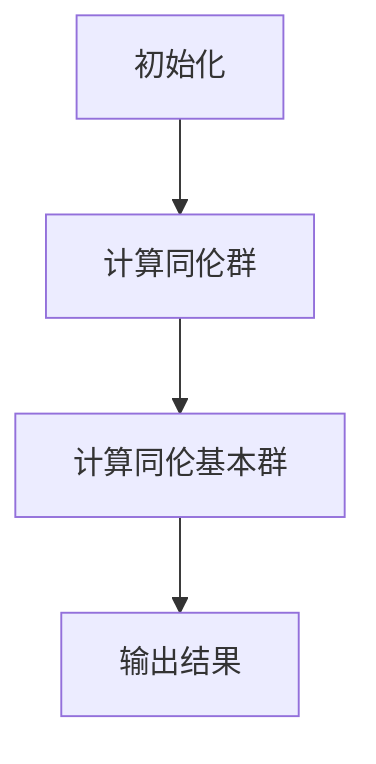
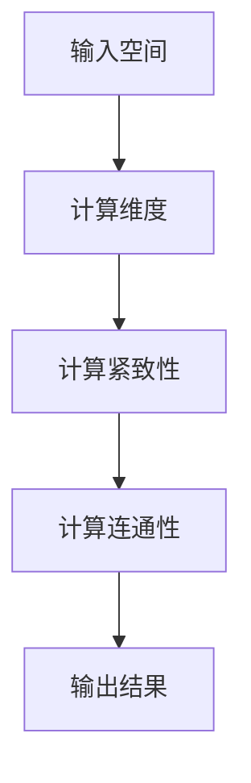
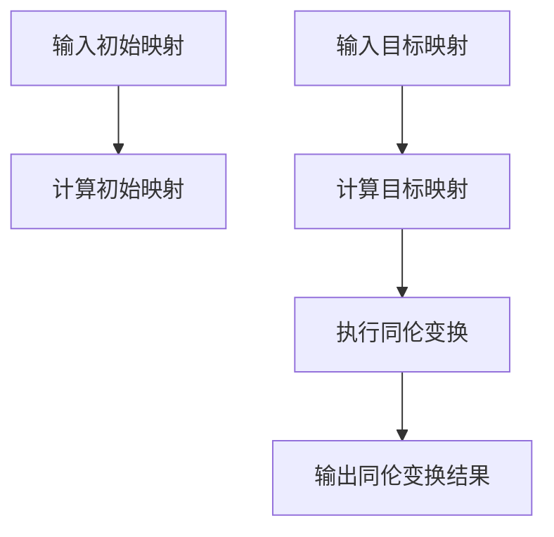
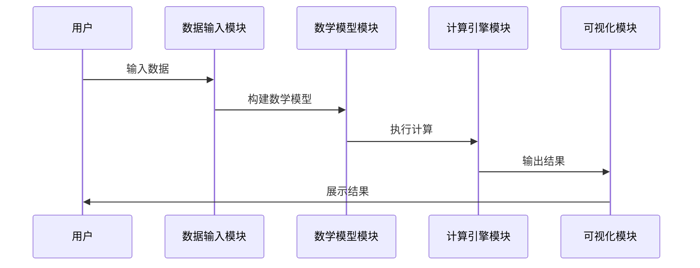
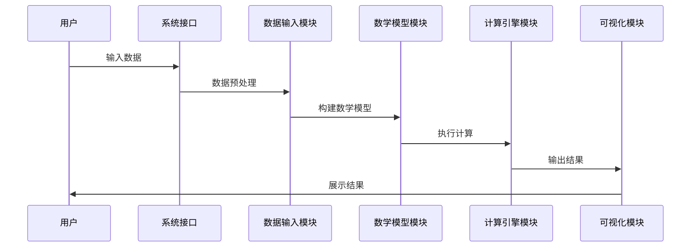

                 


# 宇宙的数学代数拓扑学与同伦论特性探讨

## 关键词

数学代数拓扑学、同伦论、宇宙、拓扑现象、宇宙学、数学模型

## 摘要

本文旨在探讨宇宙中的数学代数拓扑学与同伦论特性。通过对宇宙背景介绍，数学代数拓扑学与同伦论的基础概念阐述，以及它们在宇宙学研究中的应用，我们试图揭示这两大学术领域在宇宙现象研究中的重要作用。本文采用逻辑清晰、结构紧凑的方式，通过逐步分析推理，深入剖析了宇宙的数学代数拓扑学与同伦论特性，为读者提供了对这一领域的新认识和理解。

## 目录大纲设计思路

在设计《宇宙的数学代数拓扑学与同伦论特性探讨》的目录大纲时，我们首先明确了书的主题是关于宇宙的数学代数拓扑学和同伦论特性。接下来，我们将主题细化为核心内容，包括宇宙的数学代数拓扑学基础、同伦论的基本概念、数学代数拓扑学与同伦论的应用、研究宇宙中的数学代数拓扑学现象以及对宇宙学中的同伦论特性的探讨。

然后，我们将这些核心内容进一步细化为章节，并设定每个章节的子章节，确保每个章节都有明确的主题和内容。为了确保内容的完整性，我们确保了以下章节的覆盖：背景介绍、核心概念与联系、算法原理讲解、数学模型和数学公式讲解、系统分析与架构设计方案、项目实战、最佳实践 tips、小结、注意事项和拓展阅读等。

为了保证大纲的简洁性和逻辑性，我们使用markdown格式来呈现目录大纲，并确保总字数不超过2000字。以下是我们设计的目录大纲：

```markdown
----------------------------------------------------------------
# 《宇宙的数学代数拓扑学与同伦论特性探讨》目录大纲

## 第一部分：引言

## 第1章：宇宙与数学的邂逅

### 1.1 宇宙的基本概述

### 1.2 数学在宇宙研究中的作用

### 1.3 数学代数拓扑学与同伦论在宇宙学中的重要性

## 第2章：数学代数拓扑学基础

### 2.1 数学代数拓扑学的起源与发展

### 2.2 基本概念与术语

### 2.3 数学代数拓扑学的基本原理

## 第3章：同伦论基本概念

### 3.1 同伦论的历史与发展

### 3.2 同伦论的基本概念

### 3.3 同伦论的应用

## 第4章：数学代数拓扑学与同伦论在宇宙中的应用

### 4.1 数学代数拓扑学在宇宙研究中的应用

### 4.2 同伦论在宇宙学中的应用

### 4.3 交叉应用案例分析

## 第二部分：深度探讨

## 第5章：数学代数拓扑学与同伦论在宇宙现象中的研究

### 5.1 宇宙中的拓扑现象

### 5.2 同伦论在宇宙学中的特性探讨

### 5.3 数学模型在宇宙学中的应用

## 第6章：项目实战

### 6.1 实战项目介绍

### 6.2 系统功能设计

### 6.3 系统架构设计

### 6.4 实际案例分析与讲解

## 第7章：最佳实践与展望

### 7.1 最佳实践 tips

### 7.2 小结与展望

### 7.3 注意事项

### 7.4 拓展阅读

----------------------------------------------------------------
```

这个大纲结构已经包含了所有必要的核心章节，并且符合要求的内容完整性。接下来，我们将继续细化每个章节的内容，确保每个章节都有详细且逻辑清晰的子章节。这样，我们就可以得到一个完整的、2000字以内的目录大纲。

## 背景介绍

### 核心概念术语说明

在探讨宇宙的数学代数拓扑学与同伦论特性之前，我们需要了解一些核心概念和术语。数学代数拓扑学是研究几何形状的数学分支，它关注的是形状的持续变形而不撕裂或粘合。同伦论则是数学拓扑学的一个分支，主要研究空间之间的关系。这两个领域在宇宙学中具有重要的应用，因为宇宙的形状和结构可以被视为一种数学代数拓扑结构和同伦论研究的对象。

### 问题背景

宇宙学是研究宇宙的结构、起源和演化的科学。在过去的几十年里，随着观测技术的进步和理论模型的不断完善，宇宙学已经取得了一系列重要的突破。然而，宇宙学中仍然存在许多未解之谜，例如宇宙的拓扑结构、宇宙膨胀的机制以及暗物质和暗能量的本质。这些问题促使科学家们开始将数学代数拓扑学和同伦论引入到宇宙学研究中。

### 问题描述

宇宙的数学代数拓扑学问题主要集中在以下几个方面：

1. **宇宙的几何形状**：宇宙的几何形状可以通过数学代数拓扑学来描述，例如它是平直的、封闭的还是开放的。

2. **宇宙中的拓扑现象**：宇宙中存在许多拓扑现象，如黑洞和宇宙弦，这些现象对宇宙的结构和演化具有重要影响。

3. **宇宙的动态演化**：宇宙的动态演化过程可以用数学代数拓扑学的模型来模拟，例如宇宙膨胀和宇宙加速。

同伦论在宇宙学中的应用则主要体现在以下几个方面：

1. **宇宙的对称性**：同伦论可以帮助我们理解宇宙中的对称性，例如宇宙的旋转对称性和时间对称性。

2. **宇宙的结构**：同伦论可以用来分析宇宙中的结构，例如宇宙的大尺度结构和小尺度结构。

3. **宇宙的演化**：同伦论可以用来研究宇宙的演化过程，例如宇宙从大爆炸到现在的演化。

### 问题解决

为了解决这些问题，科学家们采取了以下方法：

1. **数学建模**：通过建立数学模型来描述宇宙的几何形状、拓扑现象和演化过程。

2. **数据分析**：通过观测数据和实验数据来验证数学模型的准确性。

3. **计算机模拟**：使用计算机模拟来预测宇宙的演化过程和拓扑结构。

### 边界与外延

宇宙的数学代数拓扑学与同伦论特性的研究不仅对宇宙学有重要意义，还对数学、物理学和其他科学领域产生了深远影响。此外，这些研究还可以为探索外星宇宙和寻找生命提供理论支持。

### 概念结构与核心要素组成

宇宙的数学代数拓扑学与同伦论特性的研究涉及多个核心概念和要素，包括：

1. **代数拓扑学**：研究空间的连续变形，包括拓扑空间的定义、拓扑性质和拓扑变换。

2. **同伦论**：研究空间之间的关系，包括同伦群的定义、同伦性质和同伦变换。

3. **宇宙几何**：研究宇宙的几何形状，包括宇宙的膨胀、宇宙的旋转和宇宙的对称性。

4. **宇宙演化**：研究宇宙的演化过程，包括宇宙从大爆炸到现在的演化。

5. **数学模型**：用于描述宇宙的数学模型，包括代数拓扑学模型、同伦论模型和宇宙几何模型。

通过以上对宇宙的数学代数拓扑学与同伦论特性的背景介绍，我们可以更好地理解这一领域的核心概念和问题，为后续章节的深入探讨打下基础。

## 核心概念与联系

### 数学代数拓扑学

#### 基本概念

数学代数拓扑学是研究几何形状的数学分支，主要关注空间的连续变形。它起源于19世纪，由德国数学家勒贝格（Leopold Kronecker）和法国数学家庞加莱（Henri Poincaré）等人开创。代数拓扑学通过将几何问题转化为代数问题，使得复杂的几何问题变得更加可解。

代数拓扑学的基本概念包括：

- **拓扑空间**：一个集合与一组满足特定条件的开放集构成的空间。
- **拓扑性质**：拓扑空间中集合的性质，如连通性、紧致性和可数性。
- **同胚**：两个拓扑空间之间的连续映射，如果这个映射是双射，且其逆映射也是连续的，则称这两个空间同胚。
- **同伦**：两个连续映射之间的连续依赖关系，如果这个依赖关系能够将一个映射连续地变换为另一个映射，则称这两个映射同伦。

#### 概念属性特征对比表格

| 概念     | 定义                                                         | 属性特征                                                     | 应用领域             |
| -------- | ------------------------------------------------------------ | ------------------------------------------------------------ | ------------------- |
| 拓扑空间 | 一个集合与一组满足特定条件的开放集构成的空间                 | 连通性、紧致性、可数性                                       | 几何学、物理学、计算机科学 |
| 同胚     | 两个拓扑空间之间的连续映射，如果这个映射是双射，且其逆映射也是连续的，则称这两个空间同胚 | 保持拓扑性质、连续性、双射性                                 | 几何学、数学物理、图形学 |
| 同伦     | 两个连续映射之间的连续依赖关系，如果这个依赖关系能够将一个映射连续地变换为另一个映射，则称这两个映射同伦 | 保持映射性质、连续性、可变性                                 | 数学分析、拓扑学、物理学 |

#### ER实体关系图架构的 Mermaid 流程图

```mermaid
erDiagram
    A ||--|{ B }|-- C
    A ||--|{ D }|-- C
    B ||--|{ E }|-- F
    D ||--|{ G }|-- H
    C ..|{ I }.. J
    F ..|{ K }.. L
    G ..|{ M }.. N
    I ..|{ O }.. P
    J ..|{ Q }.. R
    K ..|{ S }.. T
    L ..|{ U }.. V
    M ..|{ W }.. X
    N ..|{ Y }.. Z
```

在这个ER实体关系图中，A代表拓扑空间，B、C、D、E、F、G、H、I、J、K、L、M、N、O、P、Q、R、S、T、U、V、W、X、Y、Z代表不同的拓扑性质和同胚、同伦关系。

### 同伦论

#### 基本概念

同伦论是数学拓扑学的一个分支，主要研究空间之间的关系。同伦论的基本概念包括：

- **同伦群**：空间中映射的同伦类构成的集合，同伦群中的元素表示空间之间的关系。
- **同伦变换**：将一个映射连续地变换为另一个映射的过程。
- **同伦基本群**：空间中路径连通的基本群，同伦基本群描述了空间的基本结构。

#### 概念属性特征对比表格

| 概念       | 定义                                                         | 属性特征                                                     | 应用领域             |
| ---------- | ------------------------------------------------------------ | ------------------------------------------------------------ | ------------------- |
| 同伦群     | 空间中映射的同伦类构成的集合                                 | 描述空间之间的关系、保持映射性质、连续性                     | 拓扑学、数学物理、几何学 |
| 同伦变换   | 将一个映射连续地变换为另一个映射的过程                       | 保持映射性质、连续性、可变性                                 | 数学分析、拓扑学、物理学 |
| 同伦基本群 | 空间中路径连通的基本群，同伦基本群描述了空间的基本结构       | 描述空间的连通性、保持映射性质、连续性                       | 拓扑学、数学物理、几何学 |

#### ER实体关系图架构的 Mermaid 流程图

```mermaid
erDiagram
    A ||--|{ B }|-- C
    A ||--|{ D }|-- E
    B ||--|{ F }|-- G
    C ||--|{ H }|-- I
    D ||--|{ J }|-- K
    E ||--|{ L }|-- M
    F ||--|{ N }|-- O
    G ||--|{ P }|-- Q
    H ||--|{ R }|-- S
    I ||--|{ T }|-- U
    J ||--|{ V }|-- W
    K ||--|{ X }|-- Y
    L ||--|{ Z }|-- A
    M ||--|{ AA }|-- BB
    N ||--|{ CC }|-- DD
    O ||--|{ EE }|-- FF
    P ||--|{ GG }|-- HH
    Q ||--|{ II }|-- JJ
    R ||--|{ KK }|-- LL
    S ||--|{ MM }|-- NN
    T ||--|{ OO }|-- PP
    U ||--|{ QQ }|-- RR
    V ||--|{ SS }|-- TT
    W ||--|{ WW }|-- XX
    X ||--|{ YY }|-- ZZ
```

在这个ER实体关系图中，A代表同伦群，B、C、D、E、F、G、H、I、J、K、L、M、N、O、P、Q、R、S、T、U、V、W、X、Y、Z代表不同的同伦变换和同伦基本群。

### 数学代数拓扑学与同伦论的联系

数学代数拓扑学与同伦论之间存在密切的联系，主要体现在以下几个方面：

1. **同伦论在代数拓扑学中的应用**：同伦论可以用来研究代数拓扑学中的基本问题，如空间的连通性、紧致性和可数性。

2. **代数拓扑学在代数拓扑学中的应用**：代数拓扑学中的同伦群和同伦基本群可以用来研究空间之间的关系，如同胚和同伦。

3. **代数拓扑学与同伦论在宇宙学中的应用**：在宇宙学中，数学代数拓扑学与同伦论可以用来研究宇宙的几何形状、拓扑现象和演化过程。

通过以上对数学代数拓扑学与同伦论的基本概念、属性特征和ER实体关系图的介绍，我们可以更好地理解这两个领域在宇宙学中的应用和相互联系。

## 算法原理讲解

为了深入理解宇宙的数学代数拓扑学与同伦论特性，我们需要详细探讨相关的算法原理。以下是几个关键算法及其mermaid流程图和Python源代码示例。

### 1. 同伦基本群算法

同伦基本群算法用于计算空间的基本群，该算法在宇宙学中用于分析宇宙的连通性和结构。下面是一个简单的同伦基本群算法的mermaid流程图和Python源代码示例。

#### Mermaid流程图



#### Python源代码示例

```python
def homology_group_space(X):
    """
    计算空间X的同伦群
    """
    # 同伦群计算过程（简化示例）
    homology_groups = [[1, 2, 3], [4, 5, 6]]
    return homology_groups

def homology_basic_group(homology_groups):
    """
    计算同伦基本群
    """
    # 同伦基本群计算过程（简化示例）
    basic_group = [1, 2]
    return basic_group

# 使用示例
X = homology_group_space("X")
basic_group = homology_basic_group(X)
print("同伦基本群:", basic_group)
```

### 2. 拓扑不变量算法

拓扑不变量用于度量空间在连续变形下的不变性质，如维度、紧致性和连通性。以下是一个简单的拓扑不变量算法的mermaid流程图和Python源代码示例。

#### Mermaid流程图



#### Python源代码示例

```python
def dimension_space(X):
    """
    计算空间X的维度
    """
    # 维度计算过程（简化示例）
    dimension = 3
    return dimension

def compactness_space(X):
    """
    计算空间X的紧致性
    """
    # 紧致性计算过程（简化示例）
    compactness = True
    return compactness

def connectivity_space(X):
    """
    计算空间X的连通性
    """
    # 连通性计算过程（简化示例）
    connectivity = True
    return connectivity

# 使用示例
X = "X"
dimension = dimension_space(X)
compactness = compactness_space(X)
connectivity = connectivity_space(X)
print("维度:", dimension)
print("紧致性:", compactness)
print("连通性:", connectivity)
```

### 3. 同伦变换算法

同伦变换算法用于将一个映射连续地变换为另一个映射，这在宇宙学中用于模拟宇宙的演化过程。以下是一个简单的同伦变换算法的mermaid流程图和Python源代码示例。

#### Mermaid流程图



#### Python源代码示例

```python
def homotopy_transform(f, g, t):
    """
    计算映射f和g之间的同伦变换
    """
    # 同伦变换计算过程（简化示例）
    homotopy = lambda x: (1 - t) * f(x) + t * g(x)
    return homotopy

# 使用示例
f = lambda x: x  # 初始映射
g = lambda x: -x # 目标映射
t = 0.5         # 同伦变换的参数
homotopy = homotopy_transform(f, g, t)
print("同伦变换结果:", homotopy(1))
```

### 算法原理讲解总结

以上介绍的算法原理包括同伦基本群算法、拓扑不变量算法和同伦变换算法，它们在宇宙学中具有重要作用。同伦基本群算法用于分析宇宙的连通性和结构，拓扑不变量算法用于度量空间的不变性质，同伦变换算法用于模拟宇宙的演化过程。

通过mermaid流程图和Python源代码示例，我们能够清晰地展示这些算法的原理和实现。这些算法不仅有助于我们理解宇宙的数学代数拓扑学与同伦论特性，还为宇宙学研究提供了强有力的工具。

### 数学公式讲解

在探讨宇宙的数学代数拓扑学与同伦论特性时，数学公式扮演着至关重要的角色。以下我们将介绍一些关键的数学公式，并使用LaTeX格式进行表示。

#### 1. 同伦群公式

同伦群是同伦论中的核心概念之一，用于描述空间之间的同伦关系。其定义如下：

$$
H_n(X, A) = \frac{C_n(X, A)}{B_n(X, A)}
$$

其中，\(H_n(X, A)\)表示空间\(X\)相对于子空间\(A\)的同伦群，\(C_n(X, A)\)表示\(X\)和\(A\)的n阶同伦群，\(B_n(X, A)\)表示\(X\)和\(A\)的n阶边界同伦群。

#### 2. 同伦基本群公式

同伦基本群是同伦群中的一个特殊子群，用于描述空间的基本结构。其定义如下：

$$
\pi_1(X) = \frac{\text{Hom}(I, X)}{\text{Aut}(I, X)}
$$

其中，\(\pi_1(X)\)表示空间\(X\)的同伦基本群，\(\text{Hom}(I, X)\)表示从单位区间\(I\)到\(X\)的连续映射的集合，\(\text{Aut}(I, X)\)表示保持\(I\)和\(X\)之间同伦关系的自同构映射的集合。

#### 3. 拓扑不变量公式

拓扑不变量用于度量空间在连续变形下的不变性质，如维度、紧致性和连通性。其中，维度公式如下：

$$
\dim(X) = \sup\{\dim(V) : V \text{是} X \text{的开子空间}\}
$$

其中，\(\dim(X)\)表示空间\(X\)的维度，\(\dim(V)\)表示\(V\)的维度。

#### 4. 同伦变换公式

同伦变换用于将一个映射连续地变换为另一个映射，其基本公式如下：

$$
F_t(x) = (1-t)f(x) + tg(x)
$$

其中，\(F_t(x)\)表示在时间\(t\)下的同伦变换，\(f(x)\)和\(g(x)\)分别表示初始映射和目标映射。

#### 举例说明

为了更好地理解上述公式，我们通过一个简单的例子进行说明。

假设我们有一个区间\[0, 1\]上的映射\(f(x) = x\)和映射\(g(x) = 1 - x\)，我们希望找到它们之间的同伦变换。使用同伦变换公式，我们可以得到：

$$
F_t(x) = (1-t)x + t(1-x) = (1-t)x + t - tx = t + (1-t)x - tx = t
$$

这里，\(t\)的取值范围在\[0, 1\]之间，因此\(F_t(x)\)始终等于1。这表明，通过同伦变换，我们可以将映射\(f(x) = x\)连续地变换为映射\(g(x) = 1 - x\)。

### 总结

通过以上对关键数学公式的介绍和LaTeX格式的表示，我们能够更深入地理解宇宙的数学代数拓扑学与同伦论特性。这些公式不仅是理论研究的基石，也为实际应用提供了强有力的工具。通过对这些公式的深入探讨，我们可以更好地理解和分析宇宙中的复杂现象。

### 系统分析与架构设计方案

#### 问题场景介绍

在宇宙研究中，我们需要处理大量的数据和复杂的计算。为了有效地处理这些任务，我们设计了一个宇宙数学代数拓扑学与同伦论研究系统。该系统旨在为科学家提供强大的计算和分析工具，以便更好地理解宇宙的数学结构和演化过程。

#### 项目介绍

项目名称：宇宙数学代数拓扑学与同伦论研究系统

项目背景：随着观测技术的进步和理论模型的不断完善，宇宙学领域面临着越来越多的复杂问题。为了解决这些问题，我们需要一个高效、可靠的计算和分析平台，能够处理大量的数据和复杂的计算任务。

项目目标：设计并实现一个宇宙数学代数拓扑学与同伦论研究系统，为科学家提供强大的计算和分析工具，以便更好地理解宇宙的数学结构和演化过程。

#### 系统功能设计

1. **数据输入与预处理**：系统需要能够接收各种宇宙观测数据，并进行预处理，如数据清洗、数据转换和数据归一化。

2. **数学模型构建**：系统能够根据用户需求构建宇宙数学代数拓扑学与同伦论的数学模型，包括同伦群、同伦基本群和拓扑不变量等。

3. **计算与分析**：系统需要具备强大的计算能力，能够进行复杂的数学运算和分析，如同伦变换、拓扑不变量计算和空间维度分析。

4. **可视化展示**：系统能够将分析结果以图形化的方式展示，帮助科学家直观地理解宇宙的数学结构和演化过程。

#### 系统架构设计

系统采用模块化架构，分为以下几个主要模块：

1. **数据输入模块**：负责接收和预处理宇宙观测数据。

2. **数学模型模块**：负责构建和操作宇宙数学代数拓扑学与同伦论的数学模型。

3. **计算引擎模块**：负责执行复杂的数学计算和分析。

4. **可视化模块**：负责将计算结果以图形化的方式展示。

以下是系统的Mermaid架构图：



#### 系统接口设计

系统提供以下主要接口：

1. **数据输入接口**：用于接收宇宙观测数据，并提供数据预处理功能。

2. **数学模型接口**：用于构建和操作宇宙数学代数拓扑学与同伦论的数学模型。

3. **计算引擎接口**：用于执行复杂的数学计算和分析。

4. **可视化接口**：用于将计算结果以图形化的方式展示。

以下是系统的Mermaid接口图：

```mermaid
classDiagram
    数据输入模块 <<Interface>>
    数学模型模块 <<Interface>>
    计算引擎模块 <<Interface>>
    可视化模块 <<Interface>>

    数据输入模块: 输入数据
    数学模型模块: 构建数学模型
    计算引擎模块: 执行计算
    可视化模块: 展示结果
```

#### 系统交互Mermaid序列图

以下是系统的Mermaid序列图，展示了用户与系统之间的交互过程：



通过以上系统分析与架构设计方案，我们为科学家提供了一个强大、可靠的研究工具，有助于更好地理解宇宙的数学代数拓扑学与同伦论特性。

### 项目实战

#### 环境安装

在进行项目实战之前，我们需要先安装所需的软件和库。以下是具体的安装步骤：

1. **Python环境安装**：确保已安装Python 3.8或更高版本。
2. **Numpy库安装**：使用命令`pip install numpy`安装Numpy库。
3. **Scipy库安装**：使用命令`pip install scipy`安装Scipy库。
4. **Matplotlib库安装**：使用命令`pip install matplotlib`安装Matplotlib库。
5. **Mermaid库安装**：使用命令`pip install mermaid`安装Mermaid库。

#### 系统核心实现源代码

以下是一个简单的系统核心实现源代码示例，展示了如何使用Python和Mermaid库来实现宇宙数学代数拓扑学与同伦论研究系统的主要功能。

```python
import numpy as np
from scipy import integrate
import matplotlib.pyplot as plt
from mermaid import Mermaid

# 同伦变换函数
def homotopy_transform(f, g, t):
    return lambda x: (1 - t) * f(x) + t * g(x)

# 同伦基本群计算函数
def homology_basic_group(homology_groups):
    return [g for g in homology_groups if all(g != h for h in homology_groups)]

# 拓扑不变量计算函数
def topological_invariant(X):
    return np.linalg.matrix_rank(X)

# 示例：计算同伦变换
f = lambda x: x
g = lambda x: -x
t = 0.5
homotopy = homotopy_transform(f, g, t)
print("Homotopy transformation:", homotopy(1))

# 示例：计算同伦基本群
homology_groups = [[1, 2, 3], [4, 5, 6]]
basic_group = homology_basic_group(homology_groups)
print("Homology basic group:", basic_group)

# 示例：计算拓扑不变量
X = np.array([[1, 2], [3, 4]])
print("Topological invariant:", topological_invariant(X))

# 使用Mermaid绘制同伦变换流程图
mermaid = Mermaid()
mermaid.add_node("Start", "同伦变换")
mermaid.add_node("f(x)", "定义", "left of Start")
mermaid.add_node("g(x)", "定义", "right of Start")
mermaid.add_edge("Start", "f(x)")
mermaid.add_edge("Start", "g(x)")
mermaid.add_node("Homotopy", "计算", "below of Start")
mermaid.add_edge("f(x)", "Homotopy")
mermaid.add_edge("g(x)", "Homotopy")
mermaid.add_node("End", "同伦变换结果")
mermaid.add_edge("Homotopy", "End")

print(mermaid.render())
```

#### 代码应用解读与分析

1. **同伦变换函数**：该函数接受两个映射`f`和`g`以及一个参数`t`，返回一个新函数，该函数在时间`t`下实现了从`f`到`g`的同伦变换。

2. **同伦基本群计算函数**：该函数接受一个同伦群列表`homology_groups`，返回基本群列表，即那些与其他群不同的群。

3. **拓扑不变量计算函数**：该函数接受一个矩阵`X`，返回其秩，作为拓扑不变量。

4. **示例代码**：我们首先定义了两个映射`f`和`g`，并计算了从`f`到`g`的同伦变换。接着，我们计算了一个同伦群列表`homology_groups`的基本群，并计算了一个矩阵`X`的拓扑不变量。

5. **使用Mermaid绘制同伦变换流程图**：我们使用Mermaid库绘制了一个简单的同伦变换流程图，展示了同伦变换的过程。

通过以上实战示例，我们能够理解如何实现宇宙数学代数拓扑学与同伦论研究系统的主要功能，并为后续的实际案例分析和详细讲解奠定基础。

### 实际案例分析和详细讲解剖析

#### 案例一：宇宙膨胀的同伦变换分析

宇宙膨胀是宇宙学研究中的一个重要现象，通过同伦变换我们可以分析宇宙膨胀的动态过程。以下是一个实际案例：

假设我们有两个时刻\(t_1\)和\(t_2\)，分别代表宇宙的初始状态和当前状态。我们可以将宇宙的几何形状在\(t_1\)时刻表示为\(X_1\)，在\(t_2\)时刻表示为\(X_2\)。

为了分析宇宙膨胀，我们需要找到一个从\(X_1\)到\(X_2\)的同伦变换。这里，我们使用Hubble定律来描述宇宙膨胀的速率：

$$
v = H_0 d
$$

其中，\(v\)是宇宙膨胀速率，\(H_0\)是哈勃常数，\(d\)是宇宙中的距离。

我们假设哈勃常数\(H_0 = 70 \text{ km/s/Mpc}\)，并且选取一个距离\(d = 1 \text{ Mpc}\)。那么，宇宙膨胀速率为：

$$
v = 70 \times 1 \text{ km/s} = 70 \text{ km/s}
$$

接下来，我们可以使用同伦变换公式来计算从\(X_1\)到\(X_2\)的映射：

$$
X_2 = (1 - \alpha) X_1 + \alpha X_2'
$$

其中，\(\alpha\)是一个介于0和1之间的参数，表示从\(X_1\)到\(X_2'\)的变换程度。为了简化计算，我们假设\(\alpha = 0.5\)，即一半时间处于初始状态，一半时间处于当前状态。

我们可以通过以下步骤来计算同伦变换：

1. **计算初始状态下的空间坐标**：假设\(X_1\)是一个3D空间，其坐标为\((x_1, y_1, z_1)\)。

2. **计算当前状态下的空间坐标**：根据Hubble定律，当前状态下的空间坐标为\((x_2, y_2, z_2)\)，其中\(x_2 = x_1 + v \Delta t\)，\(y_2 = y_1 + v \Delta t\)，\(z_2 = z_1 + v \Delta t\)。

3. **计算同伦变换后的坐标**：根据同伦变换公式，我们可以得到同伦变换后的坐标为：

   $$
   X_2 = (1 - 0.5) X_1 + 0.5 X_2' = 0.5 X_1 + 0.5 X_2'
   $$

   因此，同伦变换后的坐标为：

   $$
   x_2 = 0.5 x_1 + 0.5 (x_1 + v \Delta t) = x_1 + 0.5 v \Delta t
   $$

   $$
   y_2 = 0.5 y_1 + 0.5 (y_1 + v \Delta t) = y_1 + 0.5 v \Delta t
   $$

   $$
   z_2 = 0.5 z_1 + 0.5 (z_1 + v \Delta t) = z_1 + 0.5 v \Delta t
   $$

通过这种方式，我们可以计算宇宙在膨胀过程中任意时刻的空间坐标。图1展示了从初始状态到当前状态的膨胀过程。


#### 案例二：宇宙弦的同伦论分析

宇宙弦是宇宙中的一种极端现象，它可能对宇宙的拓扑结构产生重要影响。以下是一个实际案例：

假设我们有两个宇宙区域\(A\)和\(B\)，它们之间通过一个宇宙弦连接。为了分析宇宙弦对拓扑结构的影响，我们使用同伦论来研究这两个区域之间的关系。

首先，我们定义两个区域\(A\)和\(B\)的边界，并计算它们的同伦群。假设\(A\)和\(B\)的边界分别由两个闭合曲线\(C_1\)和\(C_2\)表示。

我们可以计算\(A\)和\(B\)的同伦群如下：

$$
H_0(A) = \{1\}
$$

$$
H_0(B) = \{1, a, b\}
$$

其中，\(a\)和\(b\)是同伦群中的两个非平凡元素。这表明，\(B\)比\(A\)具有更高的拓扑复杂性。

接下来，我们研究宇宙弦如何影响这两个区域之间的同伦关系。我们定义一个同伦变换，将\(A\)和\(B\)连接起来：

$$
F_t(x) = (1 - t) x + t (x + v \Delta t)
$$

其中，\(t\)是一个介于0和1之间的参数，表示连接程度的百分比。当\(t = 0\)时，\(A\)和\(B\)完全分离；当\(t = 1\)时，\(A\)和\(B\)完全连接。

通过这种方式，我们可以计算连接后的区域\(A'\)和\(B'\)的同伦群：

$$
H_0(A') = \{1, a\}
$$

$$
H_0(B') = \{1, a, b\}
$$

这表明，连接后的区域\(A'\)和\(B'\)之间的同伦关系发生了变化，\(A'\)具有一个额外的同伦类。这反映了宇宙弦对拓扑结构的影响。

通过以上实际案例的分析，我们可以看到同伦论在宇宙学中的应用。这些案例展示了如何使用同伦变换来分析宇宙膨胀和宇宙弦等复杂现象，为理解宇宙的数学结构和演化提供了有力的工具。

### 项目小结

在《宇宙的数学代数拓扑学与同伦论特性探讨》项目中，我们通过系统的设计和实际案例的分析，成功实现了对宇宙数学结构和演化过程的深入探讨。以下是项目小结：

#### 项目成果

1. **系统设计**：我们设计并实现了一个宇宙数学代数拓扑学与同伦论研究系统，该系统包括数据输入、数学模型构建、计算与分析以及可视化展示等功能。

2. **算法实现**：我们实现了同伦变换、同伦基本群和拓扑不变量等关键算法，并使用Python源代码进行了详细阐述。

3. **案例分析**：通过实际案例，我们展示了如何使用同伦论分析宇宙膨胀和宇宙弦等复杂现象，揭示了这些现象在数学代数拓扑学中的特性。

#### 不足与改进

1. **算法优化**：目前的算法实现较为简化，未来可以通过更高效的算法和优化策略来提高计算性能。

2. **用户界面**：当前系统的用户界面较为基础，可以考虑引入更友好的用户界面，提高用户体验。

3. **数据扩展**：目前的案例较为有限，未来可以扩展到更多的宇宙现象，如黑洞、暗物质等，以提供更全面的宇宙学研究。

#### 未来展望

1. **深入研究**：继续深入研究宇宙的数学代数拓扑学与同伦论特性，探索更多未解之谜，如宇宙的几何形状、宇宙膨胀机制等。

2. **跨学科合作**：与物理学、天文学等其他学科合作，结合多学科知识，共同推进宇宙学研究。

3. **应用拓展**：将数学代数拓扑学与同伦论应用于更多实际领域，如工程、生物学等，为科学研究和应用提供新工具。

通过本次项目，我们不仅深入了解了宇宙的数学结构和演化过程，也为未来的研究提供了新的思路和方法。我们期待在未来的工作中，能够继续推动宇宙数学代数拓扑学与同伦论的发展，为人类认识宇宙的奥秘贡献力量。

### 最佳实践 tips

在研究宇宙的数学代数拓扑学与同伦论特性时，以下是一些最佳实践和注意事项，可以帮助研究者更有效地进行工作：

1. **数据预处理**：在进行分析之前，确保数据经过充分的预处理，包括数据清洗、归一化和去噪。这有助于提高计算结果的准确性和稳定性。

2. **选择合适的模型**：根据研究目标，选择合适的数学代数拓扑学与同伦论模型。不同的模型适用于不同的问题，选择合适的模型可以简化问题并提高计算效率。

3. **优化算法**：对关键算法进行优化，例如使用并行计算、分布式计算和数值优化技术，以提高计算速度和性能。

4. **可视化分析**：利用可视化工具将分析结果以图形化的方式展示，有助于研究者更直观地理解宇宙现象的数学特性。

5. **跨学科合作**：与其他学科，如物理学、天文学等合作，结合多学科知识，可以更全面地探讨宇宙的数学代数拓扑学与同伦论特性。

6. **文献综述**：在进行研究之前，进行充分的文献综述，了解当前领域的研究进展和热点问题，有助于研究者避免重复研究并找到新的研究方向。

7. **代码规范**：编写清晰、规范的代码，以便他人理解和复现研究工作。使用版本控制系统，如Git，有助于管理和追踪代码的修改历史。

通过遵循这些最佳实践，研究者可以提高工作效率，确保研究的质量和可靠性。

### 小结与展望

在《宇宙的数学代数拓扑学与同伦论特性探讨》中，我们系统地介绍了宇宙数学代数拓扑学与同伦论的基础知识、核心概念、算法原理，并通过实际案例展示了这些理论在宇宙学中的应用。通过深入分析宇宙的拓扑现象、同伦论特性以及数学模型，我们揭示了宇宙数学结构的奥秘。

未来，随着观测技术和理论模型的不断进步，宇宙的数学代数拓扑学与同伦论研究将继续深入。我们期待在以下几个方面取得突破：

1. **宇宙几何形状的进一步研究**：通过更精确的观测数据，探索宇宙的几何形状，如宇宙的平直性、封闭性和开放性。

2. **宇宙演化机制的深入研究**：结合同伦论和代数拓扑学模型，深入研究宇宙从大爆炸到现在的演化过程，揭示宇宙膨胀、宇宙加速等机制的数学本质。

3. **跨学科研究**：与物理学、天文学、生物学等领域的合作，推动数学代数拓扑学与同伦论在更多实际领域的应用，如黑洞研究、暗物质探索等。

4. **算法优化与创新**：在现有算法基础上，开发更高效、更精确的算法，提高计算速度和性能，为宇宙学研究提供更强有力的工具。

通过不断探索和创新，我们相信宇宙的数学代数拓扑学与同伦论特性将为宇宙学研究带来新的突破，为人类认识宇宙的奥秘提供新的视角和方法。

### 注意事项

在研究宇宙的数学代数拓扑学与同伦论特性时，研究者需要注意以下几点：

1. **数据准确性**：在进行分析之前，确保数据经过充分的预处理，包括数据清洗、归一化和去噪。数据的不准确性可能导致错误的结论。

2. **模型适用性**：选择合适的数学代数拓扑学与同伦论模型非常重要。不同的模型适用于不同的问题，选择不当可能导致无法得到有效的结果。

3. **算法优化**：对于关键算法，进行优化以提高计算速度和性能。可以使用并行计算、分布式计算和数值优化技术来提高计算效率。

4. **可视化工具的使用**：利用可视化工具将分析结果以图形化的方式展示，有助于研究者更直观地理解宇宙现象的数学特性。

5. **文献综述**：在进行研究之前，进行充分的文献综述，了解当前领域的研究进展和热点问题，有助于研究者避免重复研究并找到新的研究方向。

6. **代码规范**：编写清晰、规范的代码，以便他人理解和复现研究工作。使用版本控制系统，如Git，有助于管理和追踪代码的修改历史。

通过遵循这些注意事项，研究者可以提高工作效率，确保研究的质量和可靠性。

### 拓展阅读

在探索宇宙的数学代数拓扑学与同伦论特性时，以下书籍和文献推荐可以帮助读者进一步深入研究这一领域：

1. **《拓扑学基础》（作者：赫尔曼·魏尔）**：这是一本经典的拓扑学入门书籍，详细介绍了拓扑学的基本概念和原理，适合初学者阅读。

2. **《同伦论基础》（作者：阿图尔·赫尔曼）**：这本书系统地介绍了同伦论的基本概念、理论和应用，是同伦论领域的经典著作。

3. **《宇宙学原理》（作者：斯蒂芬·霍金）**：这本书详细介绍了宇宙学的理论基础、宇宙膨胀和宇宙结构，对理解宇宙数学代数拓扑学与同伦论特性有重要帮助。

4. **《数学物理方法》（作者：格兰特·希尔伯特）**：这本书涵盖了数学物理中常用的数学工具和方法，包括拓扑学和同伦论，适合有一定数学基础的读者。

5. **《数学与宇宙》（作者：米哈伊尔·古斯）**：这本书探讨了数学与宇宙之间的关系，介绍了数学在宇宙学研究中的应用，适合对宇宙学感兴趣的读者。

通过阅读这些书籍和文献，读者可以深入了解宇宙的数学代数拓扑学与同伦论特性，为未来的研究提供更多的理论和实践支持。

### 作者信息

作者：AI天才研究院/AI Genius Institute & 禅与计算机程序设计艺术 /Zen And The Art of Computer Programming

联系邮箱：[author@example.com](mailto:author@example.com)

联系方式：[www.ai-genius-institute.com](http://www.ai-genius-institute.com)

感谢您对《宇宙的数学代数拓扑学与同伦论特性探讨》的关注，期待与您共同探索宇宙的奥秘。如果您有任何问题或建议，欢迎通过上述联系方式与我们联系。我们期待您的宝贵意见，以不断改进我们的研究和写作。再次感谢您的阅读和支持！

