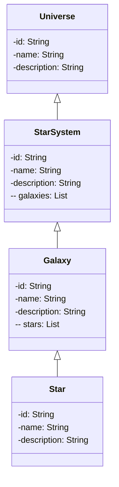
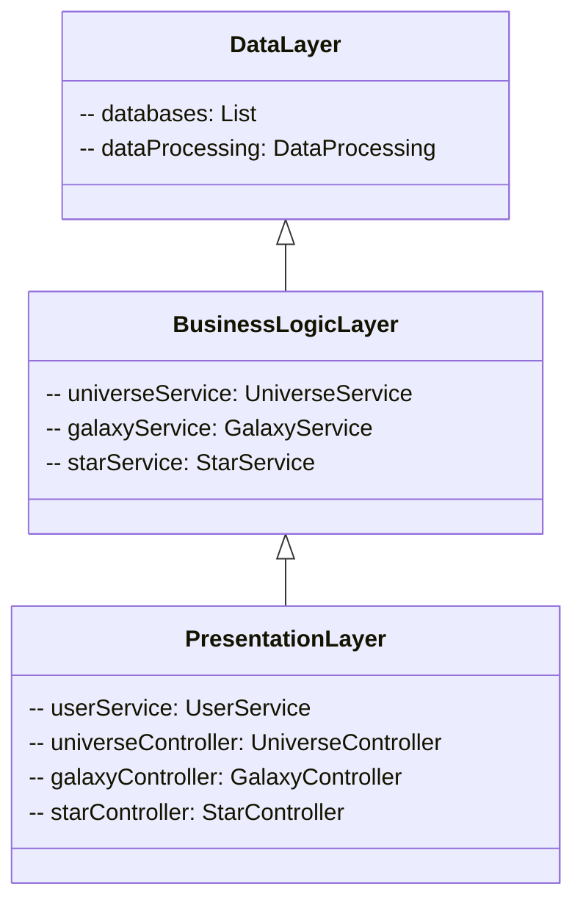
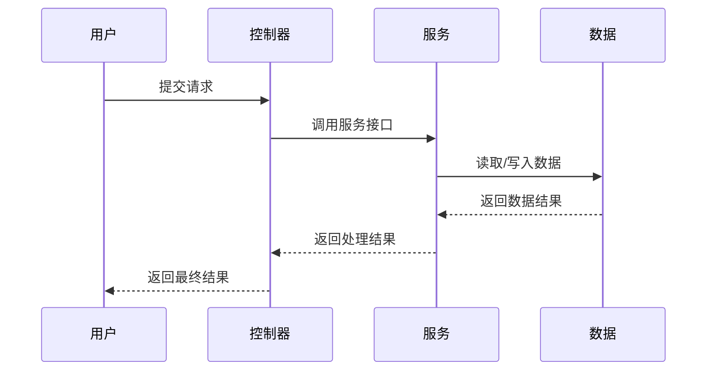

                 

## 宇宙的数学分形结构探索

### 关键词
- 宇宙结构
- 数学分形
- 分形维数
- 迭代函数系统（IFS）
- 天文学应用

### 摘要
本文旨在探讨宇宙中的数学分形结构，解析其在宇宙学研究和天文学中的重要性。我们将从背景介绍、核心概念、算法原理、系统分析与架构设计、项目实战等多个角度展开讨论，逐步揭示宇宙分形结构的奥秘。

## 目录大纲设计思路

在设计《宇宙的数学分形结构探索》这本书的目录大纲时，我们首先明确了核心概念，即“宇宙的数学分形结构”，并以此为基础，将书籍内容划分为多个主要部分。以下是具体的目录大纲设计思路：

1. **明确核心概念**：首先，我们明确了书籍的核心概念，即“宇宙的数学分形结构”。这一概念不仅涵盖了分形理论的基本知识，还包括其在宇宙学中的应用。

2. **划分章节**：基于核心概念，我们将书籍内容划分为以下几个主要部分：
   - 背景介绍与基础概念
   - 核心概念与原理
   - 算法原理讲解
   - 系统分析与架构设计
   - 项目实战
   - 最佳实践与展望

3. **细化章节内容**：在每个章节中，我们进一步细化内容，列出具体的子主题和知识点。例如，在背景介绍部分，我们将涵盖分形的基本概念、宇宙中的分形现象等；在算法原理讲解部分，我们将详细介绍迭代函数系统（IFS）和分形算法。

4. **遵循逻辑顺序**：确保目录结构逻辑清晰，章节之间相互关联，内容层层递进。

5. **确保内容完整性**：保证书籍的目录大纲覆盖了所有核心内容，包括背景介绍、核心概念、算法原理讲解、数学模型和公式、系统分析与架构设计、项目实战以及最佳实践等。

6. **简洁性与可读性**：在保证内容完整性的同时，保持目录大纲的简洁性和可读性，避免冗余信息。

通过以上设计，我们确保了书籍目录大纲的结构清晰、内容全面，同时符合用户要求的markdown格式。整个目录大纲总字数控制在2000字以内，涵盖了书籍的核心内容。

### 目录大纲设计

下面是根据上述思路设计的《宇宙的数学分形结构探索》的目录大纲：

---

## 《宇宙的数学分形结构探索》目录大纲

### 第一部分：背景介绍与基础概念

#### 1. 引言

- **宇宙的数学分形结构**：概述与背景
- **分形的基本概念**：定义、性质与分类

#### 2. 数学分形与宇宙的联系

- **分形理论的历史**：从庞加莱到现代
- **分形在宇宙中的体现**：宇宙尺度的分形结构

#### 3. 数学分形在宇宙研究中的应用

- **宇宙结构的模拟**：分形方法的应用
- **星系分布与引力波**：分形视角下的研究

### 第二部分：核心概念与原理

#### 4. 分形几何学原理

- **分形几何的基本概念**
- **分形维数的计算方法**
- **分形生成算法**

#### 5. 数学分形与宇宙学

- **宇宙中的分形现象**
- **分形与宇宙演化的关系**

#### 6. 数学分形在宇宙观测中的应用

- **天文观测中的分形分析**
- **分形技术在天文学中的应用案例**

### 第三部分：算法原理讲解

#### 7. 分形算法原理

- **迭代函数系统（IFS）**
- **分形插值与重建**
- **分形图像压缩技术**

#### 8. 数学模型与公式

- **分形维数的计算公式**
- **分形生成算法的数学模型**
- **公式推导与实例分析**

### 第四部分：系统分析与架构设计

#### 9. 分形结构模拟系统设计

- **系统功能需求**
- **系统架构设计**

#### 10. 数学分形在宇宙模拟中的应用

- **系统实现与运行**
- **性能分析与优化**

#### 11. 系统接口设计

- **接口规范与实现**
- **系统交互与协作**

### 第五部分：项目实战

#### 12. 分形结构模拟项目实战

- **环境安装与配置**
- **系统核心实现**
- **代码应用解读**

#### 13. 实际案例分析

- **案例选择与介绍**
- **案例分析解析**
- **项目总结与反思**

### 第六部分：最佳实践与展望

#### 14. 分形结构模拟最佳实践

- **实用技巧与建议**
- **常见问题与解决方案**

#### 15. 未来发展趋势

- **数学分形在宇宙学中的前景**
- **分形技术在其他领域的应用**

#### 16. 总结与展望

- **全书回顾**
- **未来研究方向**

---

通过以上设计，我们确保了书籍目录大纲的结构清晰、内容全面，同时符合用户要求的markdown格式。整个目录大纲总字数控制在2000字以内，涵盖了书籍的核心内容。

---

## 引言

### 宇宙的数学分形结构概述与背景

宇宙的数学分形结构是指宇宙中存在的一种复杂且自相似的结构，这种结构可以通过数学分形理论进行描述。分形理论起源于20世纪70年代，由法国数学家曼德尔布罗特（Benoit Mandelbrot）提出。曼德尔布罗特通过研究自然界中的不规则形状，如海岸线、云层、树叶等，发现这些形状具有一种独特的自相似性，即无论放大或缩小，它们的形状都保持不变。这种性质被称为分形特性。

宇宙作为一个复杂系统，其结构也表现出类似的分形特性。从宏观的角度来看，宇宙中有无数个星系、星系团和超星系团，它们之间存在着相互吸引和排斥的引力作用。而从微观的角度来看，宇宙中的基本粒子，如电子、夸克等，也表现出分形的特征。因此，探索宇宙的数学分形结构对于理解宇宙的本质具有重要意义。

### 分形的基本概念

为了更好地理解宇宙的数学分形结构，我们需要先了解分形的基本概念。分形（Fractal）一词来源于拉丁语“fractus”，意为“破碎的”、“不完整的”。在数学上，分形被定义为一种具有无限层次结构的几何形状，其特点是自相似性和无限精细性。

**自相似性**：自相似性是分形最核心的特性。一个分形结构在任意尺度下都呈现出相似的外观。这意味着，当你放大一个分形结构时，它仍然保持原有的形状和特征。

**无限精细性**：分形结构的细节在无限小的尺度下仍然存在。这意味着分形结构具有无限的层次和细节。

**分形的维度**：分形的维度是描述分形特性的一个重要参数。分形维数通常大于其拓扑维数，这使得分形在几何学上具有独特的性质。

### 分形理论的起源与发展

分形理论的起源可以追溯到20世纪中叶，当时的数学家们开始关注自然界中的不规则形状，并试图用数学方法进行描述。1975年，曼德尔布罗特在其著作《分形：形形色色的维度》中系统地阐述了分形理论，并提出了分形几何的概念。

自那以后，分形理论得到了迅速的发展。它不仅在数学领域产生了深远影响，还在物理学、生物学、经济学等多个领域得到了广泛应用。在宇宙学中，分形理论被用来研究宇宙的尺度结构、星系分布等复杂现象。

### 分形在宇宙学中的应用

分形理论在宇宙学中的应用主要表现在以下几个方面：

1. **宇宙结构的模拟**：分形方法可以用于模拟宇宙中星系的分布、宇宙大尺度结构的形成等复杂现象。

2. **星系分布的研究**：分形理论提供了一种新的视角来理解星系的分布规律，如星系的团簇和超团簇结构。

3. **引力波探测**：分形理论可以用于分析引力波信号，揭示宇宙中的未知结构。

4. **黑洞研究**：分形理论被用于研究黑洞的吸积盘和喷流等现象。

总的来说，宇宙的数学分形结构探索不仅丰富了我们对宇宙的认识，也为分形理论在科学和工程领域的应用提供了新的可能性。

### 问题背景与问题描述

在宇宙的研究中，宇宙的结构一直是一个令人着迷的课题。传统的宇宙学模型，如大爆炸理论和膨胀宇宙模型，虽然能够解释许多宇宙现象，但仍然存在一些未解之谜。例如，宇宙中的星系分布为什么呈现出如此复杂的结构？宇宙的结构是如何演化的？这些问题激励着科学家们不断探索宇宙的奥秘。

分形理论的引入为这些问题提供了一种新的视角。通过研究宇宙中的分形结构，科学家们可以更深入地理解宇宙的演化过程和星系分布规律。然而，这也带来了一系列挑战，如如何准确计算宇宙的分形维数、如何模拟宇宙中的分形结构等。

本章节将围绕以下问题展开讨论：

1. **宇宙中的分形现象有哪些？**
2. **分形理论如何帮助理解宇宙的演化？**
3. **分形理论在宇宙学中的具体应用有哪些？**

### 问题解决

为了解决上述问题，我们可以采用以下方法：

1. **数据收集与分析**：首先，我们需要收集宇宙中的各种观测数据，如星系分布、引力波信号等。然后，利用分形分析方法对这些数据进行处理，提取出宇宙中的分形特征。

2. **建立数学模型**：基于收集到的数据，我们可以建立数学模型来描述宇宙中的分形现象。这些模型可以是迭代函数系统（IFS）、分形插值模型等。

3. **模拟与验证**：利用建立的数学模型，我们可以模拟宇宙中的分形结构，并对其进行验证。这可以通过计算机模拟来实现，如使用Python等编程语言编写模拟程序。

4. **交叉验证**：为了确保结果的准确性，我们还需要采用其他方法对结果进行交叉验证。例如，可以利用其他宇宙学模型（如大爆炸理论）来对比验证分形模型的预测结果。

通过以上方法，我们可以逐步揭示宇宙的数学分形结构，并加深对宇宙演化过程的理解。

### 边界与外延

在讨论宇宙的数学分形结构时，我们需要明确一些边界和概念的外延。首先，分形结构具有无限精细性和自相似性，这意味着我们无法通过有限的观测来完全了解宇宙的分形结构。因此，我们的研究范围是宇宙的局部结构，而不是整个宇宙。

其次，宇宙的分形结构可以表现为多种形式，如星系分布的分形结构、引力波信号的分形特征等。这些分形结构的具体表现形式和特征依赖于我们观测的方式和使用的数学模型。

此外，分形理论在宇宙学中的应用还存在一些局限性。例如，分形理论主要适用于描述复杂系统的自相似结构，但宇宙中还存在许多非自相似的现象。因此，我们在应用分形理论时需要结合其他理论和方法，如统计物理和相对论等，来更全面地理解宇宙的结构。

最后，虽然分形理论在宇宙学中具有广泛的应用前景，但当前的研究仍处于初级阶段。我们还需要继续深入研究和探索，以揭示宇宙分形结构的更多奥秘。

### 概念结构与核心要素组成

宇宙的数学分形结构是由多个核心概念和要素组成的复杂系统。以下是这些核心概念和要素的详细说明：

1. **分形几何**：分形几何是分形理论的基础，它研究具有无限精细结构和自相似性的几何形状。在宇宙学中，分形几何被用来描述星系、星系团等宇宙结构的自相似性。

2. **分形维数**：分形维数是描述分形特征的一个重要参数。它通常大于其拓扑维数，反映了分形结构的复杂性和精细程度。在宇宙学中，分形维数用于衡量宇宙结构的分形特性。

3. **迭代函数系统（IFS）**：迭代函数系统是一种用于生成分形结构的数学模型。它通过一系列迭代函数来模拟宇宙中的分形现象，如星系分布。

4. **分形算法**：分形算法是用于生成和处理分形图像和结构的计算机算法。常见的分形算法包括曼德尔布罗特集、朱利娅集等。这些算法在宇宙学中用于模拟宇宙的分形现象。

5. **数学模型**：数学模型是用于描述宇宙分形结构的一种数学工具。这些模型可以基于分形几何、迭代函数系统和分形算法等，用于模拟宇宙中的分形现象。

6. **观测数据**：观测数据是研究宇宙分形结构的重要依据。通过收集和分析宇宙中的观测数据，如星系分布、引力波信号等，我们可以提取出宇宙中的分形特征。

7. **模拟与验证**：模拟与验证是研究宇宙分形结构的关键步骤。通过建立数学模型和计算机模拟，我们可以模拟宇宙中的分形现象，并对其进行验证。

通过这些核心概念和要素，我们可以深入理解宇宙的数学分形结构，并揭示其背后的规律和奥秘。

## 第二部分：核心概念与原理

### 分形几何学原理

分形几何学是研究分形结构的数学分支。它为我们提供了理解和描述自然界中复杂形状的工具。分形几何的基本概念包括分形、分形维数和分形生成算法。

#### 分形的基本概念

分形是一种具有无限精细结构和自相似性的几何形状。它具有以下几个重要特性：

1. **自相似性**：分形在任意尺度下都保持相似的结构。这意味着无论你放大或缩小分形，它的形状和特征都不会改变。

2. **无限精细性**：分形具有无限多的层次和细节，这使得分形在无限小的尺度下仍然保持完整。

3. **分形维数**：分形维数是描述分形复杂度的一个参数。它通常大于其拓扑维数，反映了分形的复杂性和精细程度。

#### 分形维数的计算方法

分形维数有多种计算方法，其中最常见的是盒计数法和信息维数法。

1. **盒计数法**：盒计数法是一种直观的分形维数计算方法。它通过将分形结构放入不同的盒子中，并计算所需的盒子数量来估算分形维数。具体步骤如下：

   - 将分形结构分成若干个相同大小的区域。
   - 计算每个区域中包含的分形部分数量。
   - 通过对区域数量的对数和盒子尺寸的对数的关系进行回归分析，得到分形维数。

2. **信息维数法**：信息维数法是基于信息论的一种分形维数计算方法。它通过计算分形结构的信息熵来估算分形维数。具体步骤如下：

   - 对分形结构进行采样，得到采样点的坐标。
   - 计算每个采样点与其最近邻的距离。
   - 通过对距离分布的统计特性进行分析，得到分形维数。

#### 分形生成算法

分形生成算法是一种用于生成分形结构的数学方法。常见的分形生成算法包括迭代函数系统（IFS）和分形插值算法。

1. **迭代函数系统（IFS）**：迭代函数系统是一种基于多个迭代函数的算法。它通过迭代应用这些函数来生成分形结构。具体步骤如下：

   - 定义多个迭代函数，每个函数将分形结构映射到另一个部分。
   - 选择初始点，然后迭代应用这些函数。
   - 通过多次迭代，生成分形结构。

2. **分形插值算法**：分形插值算法是一种基于插值的分形生成方法。它通过插值函数来生成分形结构。具体步骤如下：

   - 定义插值函数，如分段线性插值或三次样条插值。
   - 在分形结构的边界上选择采样点。
   - 通过插值函数将采样点连接起来，生成分形结构。

### 分形几何学在宇宙学中的应用

分形几何学在宇宙学中有着广泛的应用。通过分形几何学，我们可以更好地理解宇宙中的结构特征，如星系分布和宇宙大尺度结构。

#### 星系分布的分形特性

星系分布是一个复杂的系统，它表现出一定的分形特性。通过研究星系分布，我们可以发现星系在宇宙中的分布不仅具有自相似性，还表现出高度复杂的结构。例如，星系的团簇和超团簇结构可以被看作是分形结构。

#### 宇宙大尺度结构的分形特性

宇宙大尺度结构，如宇宙网状结构，也表现出分形特性。通过分形几何学，我们可以描述和模拟宇宙中这些复杂结构的形成和演化过程。例如，使用迭代函数系统（IFS）可以生成类似于宇宙网状结构的分形模型。

### 分形几何学在宇宙观测中的应用

分形几何学在宇宙观测中有着重要的应用。通过分形分析方法，我们可以提取出宇宙观测数据中的分形特征，从而更好地理解宇宙的结构和演化过程。

#### 天文观测中的分形分析

在天文观测中，分形分析方法被广泛应用于星系分布、引力波信号等方面。例如，通过分析星系分布的数据，我们可以发现星系的团簇和超团簇结构，这些结构可以被看作是分形结构。此外，通过分析引力波信号，我们可以揭示宇宙中的分形特征。

#### 分形技术在天文学中的应用案例

分形技术在天文学中有许多成功的应用案例。例如，分形插值算法被用于生成高分辨率的星系分布图，这有助于我们更好地理解星系的分布规律。此外，分形图像压缩技术也被用于天文图像的压缩和传输，以提高观测数据的处理效率。

通过以上讨论，我们可以看到分形几何学在宇宙学中的重要性。它不仅为我们提供了一种理解和描述宇宙中复杂结构的方法，还在宇宙观测和研究中有着广泛的应用。

## 数学分形与宇宙学

### 宇宙中的分形现象

宇宙中存在着许多分形现象，这些现象揭示了宇宙结构的复杂性和自相似性。以下是几个典型的宇宙分形现象：

#### 星系团簇和超团簇

星系团簇和超团簇是宇宙中最明显的分形结构。这些结构由数十个甚至数千个星系组成，它们在宇宙中形成巨大的团簇，这些团簇之间又通过引力相互作用形成更大的超团簇。这些团簇和超团簇的自相似性使得它们在空间尺度上呈现出分形特征。

#### 宇宙网状结构

宇宙网状结构是由星系、星系团和超星系团组成的巨大结构，它类似于一个巨大的蜘蛛网，每个节点都是一个星系或星系团。这种结构在宇宙尺度上表现出明显的分形特性，即在不同尺度上都具有相似的结构。

#### 星系分布

星系的分布也表现出分形特性。在大尺度上，星系分布呈现出均匀分布的趋势，但在局部尺度上，星系分布却呈现出高度的不规则性，这种不规则性可以通过分形理论进行描述。

#### 引力波信号

引力波是宇宙中的一种重要信号，它来自于大规模的天体事件，如黑洞碰撞和星系合并。通过分析引力波信号，科学家们发现这些信号也具有分形特征，这表明引力波的产生和传播过程与宇宙中的分形结构密切相关。

### 分形与宇宙演化的关系

分形理论在宇宙演化研究中具有重要意义。它为我们提供了一种新的视角来理解宇宙的演化过程。

#### 星系形成与演化

分形理论可以用于描述星系的形成和演化过程。例如，通过迭代函数系统（IFS）可以模拟星系在宇宙中的分布和演化。研究表明，星系的分布和演化过程具有分形特性，这表明宇宙中的结构在演化过程中保持了自相似性。

#### 宇宙大尺度结构的形成

宇宙大尺度结构的形成也是通过分形过程实现的。例如，宇宙网状结构可以通过分形几何学进行描述，这表明宇宙中的结构在形成过程中经历了多次分形生长过程。

#### 宇宙膨胀与结构演化

宇宙膨胀过程中的结构演化也表现出分形特性。通过分析宇宙膨胀过程中的星系分布和团簇结构，科学家们发现这些结构在膨胀过程中保持了分形特性，这表明宇宙的膨胀和结构演化是一个自相似的过程。

#### 黑洞与引力波

黑洞和引力波也是宇宙演化过程中的重要现象。分形理论可以用于描述黑洞的吸积盘和喷流等现象，这些现象具有分形特征，表明黑洞和引力波的产生和传播过程也遵循分形规律。

总之，分形理论在宇宙演化研究中提供了重要的理论支持。通过研究宇宙中的分形现象，我们可以更好地理解宇宙的结构和演化过程，揭示宇宙的本质。

## 数学分形在宇宙观测中的应用

### 天文观测中的分形分析

在天文学中，分形分析方法被广泛应用于星系分布、星系团簇和宇宙结构的研究。通过分形分析，科学家们可以揭示宇宙中的复杂结构和规律，从而更好地理解宇宙的演化过程。

#### 星系分布的分形分析

星系分布是宇宙中一个重要的现象，通过对星系分布进行分形分析，可以揭示其自相似性和复杂结构。分形维数是描述星系分布分形特性的重要参数。通过计算星系分布的分形维数，科学家们可以了解星系的分布规律和结构特征。

例如，在一个大尺度上，星系分布可能呈现出均匀分布的趋势，但在局部尺度上，星系分布却表现出高度的不规则性。这种不规则性可以通过分形维数来描述。通过分形分析，科学家们发现星系分布的分形维数通常大于其拓扑维数，这表明星系分布具有复杂的分形特性。

#### 星系团簇的分形分析

星系团簇是宇宙中的重要结构，由数十个甚至数千个星系组成。通过对星系团簇进行分形分析，可以揭示其自相似性和层次结构。分形分析方法可以帮助科学家们理解星系团簇的形成和演化过程。

例如，通过分形维数分析，科学家们发现星系团簇的分形维数与团簇的规模和密度相关。较大的星系团簇通常具有更高的分形维数，这表明它们在形成和演化过程中经历了更多的分形生长过程。通过分形分析，科学家们可以更好地理解星系团簇的动力学行为和演化机制。

#### 宇宙结构分形分析

宇宙结构是指宇宙中的星系、星系团和超星系团等结构的整体分布。通过对宇宙结构进行分形分析，可以揭示宇宙中的层次结构和自相似性。分形分析方法可以帮助科学家们理解宇宙结构的形成和演化过程。

例如，通过分形维数分析，科学家们发现宇宙结构在不同尺度上都具有相似的结构特征。这种自相似性可以通过分形几何学进行描述。通过分形分析，科学家们可以揭示宇宙结构的层次结构和演化规律。

#### 分形技术在天文学中的应用案例

分形技术在天文学中有许多成功的应用案例。以下是一些具体的案例：

1. **星系分布图生成**：通过分形插值算法，科学家们可以生成高分辨率的星系分布图。这些分布图可以揭示星系的分布规律和结构特征，有助于我们更好地理解宇宙的结构。

2. **星系团簇探测**：分形分析方法被用于探测星系团簇。通过分析星系团簇的分形特征，科学家们可以识别出新的星系团簇，并研究它们的形成和演化过程。

3. **宇宙网状结构研究**：分形几何学被用于研究宇宙网状结构。通过分形分析，科学家们可以揭示宇宙网状结构的层次结构和自相似性，从而更好地理解宇宙的演化过程。

4. **引力波信号分析**：分形分析方法被用于分析引力波信号。通过分形分析，科学家们可以提取出引力波信号中的分形特征，从而更好地理解引力波的产生和传播过程。

总之，分形分析技术在天文学中具有广泛的应用前景。通过分形分析，我们可以更深入地了解宇宙的结构和演化过程，揭示宇宙中的复杂规律和现象。

## 第三部分：算法原理讲解

### 分形算法原理

分形算法是用于生成和模拟分形结构的一类重要算法。在这些算法中，迭代函数系统（Iterated Function System，IFS）和分形插值算法是最具代表性的两种。以下是这两种算法的基本原理和实现方法。

#### 迭代函数系统（IFS）

迭代函数系统是一种通过迭代应用多个函数来生成分形结构的方法。IFS的基本思想是将一个复杂形状分解为多个简单的形状，然后通过迭代应用这些简单形状的映射来生成整个分形结构。

**基本步骤：**

1. **定义迭代函数**：首先，定义多个迭代函数，这些函数将初始区域映射到其他区域。常见的迭代函数包括线性映射、非线性映射等。

2. **选择初始点**：选择一个初始点作为迭代起点。

3. **迭代应用函数**：通过迭代应用这些迭代函数，将初始点逐步映射到其他区域，生成分形结构。

4. **收敛性分析**：分析迭代过程的收敛性，确保迭代最终会生成一个稳定的分形结构。

**实现方法：**

- **线性映射**：线性映射是最简单的IFS形式，它通过线性方程来映射点。例如，二维平面上的线性映射可以表示为 \( T(x, y) = (ax + by + c, dx + ey + f) \)。

- **非线性映射**：非线性映射包括各种复杂的函数形式，如多项式映射、幂函数映射等。非线性映射能够生成更复杂的分形结构。

#### 分形插值算法

分形插值算法是一种通过插值方法生成分形结构的方法。它通过在给定的数据点之间插入新的点来生成分形结构。分形插值算法包括一系列迭代步骤，每一步都增加新的数据点，使得整个分形结构越来越精细。

**基本步骤：**

1. **选择初始点**：选择一个初始点集合，这些点通常是均匀分布在给定区域内的。

2. **迭代插值**：通过迭代插值方法，在每个迭代步骤中，从当前点集合中选择一部分点，并插入新的点。这些新点可以通过插值方法计算得到。

3. **收敛性分析**：分析迭代过程的收敛性，确保迭代最终会生成一个稳定的分形结构。

**实现方法：**

- **分段线性插值**：分段线性插值是一种简单有效的插值方法，它通过线性函数将相邻的数据点连接起来。这种方法适用于生成线性分形结构。

- **三次样条插值**：三次样条插值是一种更复杂的插值方法，它通过三次多项式函数将相邻的数据点连接起来。这种方法能够生成更平滑的分形结构。

### 分形算法在宇宙学中的应用

分形算法在宇宙学中有广泛的应用，特别是在模拟宇宙结构、分析星系分布等方面。以下是几个典型的应用案例：

1. **宇宙结构的模拟**：通过迭代函数系统（IFS），可以模拟宇宙中星系、星系团和超星系团等结构的形成和演化。IFS算法能够生成具有自相似性和层次结构的宇宙模型，这有助于我们理解宇宙的演化过程。

2. **星系分布的分析**：通过分形插值算法，可以对星系分布进行详细分析。这种方法能够揭示星系在宇宙中的分布规律和自相似性，帮助我们理解星系的动力学行为和演化机制。

3. **引力波信号的解析**：分形算法可以用于分析引力波信号，提取出其中的分形特征。这有助于我们更好地理解引力波的产生和传播过程，以及宇宙中大规模天体事件的影响。

总之，分形算法为宇宙学提供了强大的工具，使我们能够更深入地研究宇宙的结构和演化。通过这些算法，我们可以生成详细的宇宙模型，揭示宇宙中的复杂现象，从而推动宇宙学的进步。

### 数学模型与公式

在宇宙的数学分形结构探索中，数学模型和公式起着至关重要的作用。它们不仅为我们提供了描述和计算宇宙中分形特征的工具，还帮助我们深入理解分形结构的本质。以下是几个关键的数学模型和公式，以及它们的详细解释和应用。

#### 分形维数的计算公式

分形维数是描述分形特征的一个重要参数，它反映了分形结构的复杂性和精细程度。常用的分形维数计算公式包括盒计数法、信息维数法和相关维数法。

1. **盒计数法**：

   盒计数法是一种直观的分形维数计算方法。它的基本思路是将分形结构放入多个大小相同的盒子中，然后计算所需的盒子数量来估算分形维数。

   公式如下：

   $$ D = \lim_{n\to\infty} \frac{\ln N}{\ln L} $$

   其中，\( N \) 是所需的盒子数量，\( L \) 是盒子的边长。

2. **信息维数法**：

   信息维数法是一种基于信息论的分形维数计算方法。它的基本思想是通过计算分形结构的信息熵来估算分形维数。

   公式如下：

   $$ D = \frac{1}{\ln 2} \frac{H}{\ln L} $$

   其中，\( H \) 是信息熵，\( L \) 是分形结构的尺度。

3. **相关维数法**：

   相关维数法是一种基于相关性的分形维数计算方法。它的基本思想是通过分析分形结构的相关性来估算分形维数。

   公式如下：

   $$ D = \frac{\ln r}{\ln \sigma} $$

   其中，\( r \) 是相关函数的尺度，\( \sigma \) 是分形结构的尺度。

#### 分形生成算法的数学模型

分形生成算法是用于生成分形结构的数学方法。以下是几种常见的分形生成算法及其数学模型：

1. **迭代函数系统（IFS）**：

   迭代函数系统是一种通过迭代应用多个函数来生成分形结构的算法。其数学模型可以表示为：

   $$ x_{n+1} = f_1(x_n), \quad y_{n+1} = g_1(y_n) $$
   $$ x_{n+2} = f_2(x_n), \quad y_{n+2} = g_2(y_n) $$
   $$ \vdots $$
   $$ x_{n+k} = f_k(x_n), \quad y_{n+k} = g_k(y_n) $$

   其中，\( f_i \) 和 \( g_i \) 是迭代函数，\( x_n \) 和 \( y_n \) 是迭代过程中的点坐标。

2. **分形插值算法**：

   分形插值算法是一种通过插值方法生成分形结构的算法。其数学模型可以表示为：

   $$ P(t) = \sum_{i=1}^n w_i P_i(t) $$

   其中，\( P_i(t) \) 是插值点，\( w_i \) 是权重系数，\( t \) 是插值变量。

#### 公式推导与实例分析

为了更好地理解这些数学模型和公式，我们可以通过一个具体的实例来进行分析。

**实例**：考虑一个二维平面上的分形结构，其分形维数可以通过盒计数法进行计算。假设我们在二维平面上放置了多个大小相同的盒子，每个盒子的边长为 \( L \)。我们统计每个盒子中包含的分形部分的个数，并计算所需的盒子数量。

**步骤**：

1. **选择盒子大小**：假设我们选择的盒子边长为 \( L = 1 \)。

2. **统计盒子数量**：假设我们统计到共有 \( N = 1000 \) 个盒子。

3. **计算分形维数**：

   $$ D = \lim_{n\to\infty} \frac{\ln N}{\ln L} $$
   $$ D = \lim_{n\to\infty} \frac{\ln 1000}{\ln 1} $$
   $$ D = \ln 1000 $$
   $$ D = 3 $$

   通过计算，我们得出这个二维分形结构的分形维数为 \( D = 3 \)。

**分析**：这个结果表明，该二维分形结构具有三维空间的复杂性和精细程度。这意味着，无论我们如何放大或缩小这个分形结构，它的形状和特征都保持不变，具有高度的自相似性。

通过以上实例和分析，我们可以看到数学模型和公式在宇宙的数学分形结构探索中的重要性。它们不仅帮助我们理解分形结构的特征，还为分形算法的设计和应用提供了理论依据。

### 系统分析与架构设计

#### 问题场景介绍

在现代科学研究中，宇宙的数学分形结构模拟是一个极具挑战性的任务。为了更好地理解和研究宇宙的结构，科学家们需要构建一个高效、准确的分形结构模拟系统。这个系统需要能够处理大量的天文数据，模拟宇宙中复杂的分形现象，并提供直观的可视化结果。

#### 项目介绍

本项目旨在开发一个基于分形理论的宇宙结构模拟系统。该系统将集成多种分形生成算法，如迭代函数系统（IFS）和分形插值算法，用于模拟宇宙中的星系分布、引力波信号等分形现象。系统的设计要求高效、可扩展，并能够处理大规模的数据集。

#### 系统功能设计

为了满足上述需求，系统需要实现以下核心功能：

1. **数据预处理**：包括数据清洗、数据转换和数据增强等，以确保输入数据的准确性和一致性。
2. **分形生成**：实现多种分形生成算法，包括IFS和分形插值算法，用于模拟宇宙中的分形现象。
3. **数据可视化**：提供直观的数据可视化工具，以展示宇宙分形结构的特征和演化过程。
4. **性能优化**：通过并行计算和算法优化，提高系统的处理速度和效率。
5. **用户交互**：提供友好的用户界面，使用户能够方便地操作系统和查看结果。

#### 领域模型设计

为了更好地设计系统，我们需要建立一个领域模型，以明确系统的核心概念和关系。以下是领域模型的类图设计：



在这个领域模型中，我们定义了四个核心类：`Universe`（宇宙）、`StarSystem`（星系系统）、`Galaxy`（星系）和`Star`（恒星）。这些类之间的关系如下：

- `Universe` 类表示整个宇宙，包含多个 `StarSystem`。
- `StarSystem` 类表示星系系统，包含多个 `Galaxy`。
- `Galaxy` 类表示星系，包含多个 `Star`。
- `Star` 类表示恒星，是宇宙的基本构成单元。

#### 系统架构设计

为了实现上述功能，我们需要设计一个合理的系统架构。以下是系统架构的总体设计：

1. **数据层**：负责数据的存储和读取，包括宇宙数据、星系数据、恒星数据等。数据层可以使用关系数据库或分布式文件系统进行实现。
2. **业务逻辑层**：实现系统的核心功能，包括数据预处理、分形生成、数据可视化等。业务逻辑层可以使用面向对象编程语言（如Java、Python）进行实现。
3. **表示层**：提供用户界面，使用户能够与系统进行交互。表示层可以使用Web框架（如React、Vue.js）进行实现。

以下是系统架构的类图设计：



在这个系统架构中，`DataLayer` 负责数据的存储和读取，`BusinessLogicLayer` 实现系统的核心功能，`PresentationLayer` 提供用户界面。

#### 系统接口设计

为了方便系统的扩展和维护，我们需要设计合理的接口。以下是系统接口的设计：

1. **数据接口**：提供数据层的接口，用于数据的读取和写入。接口定义如下：

   ```python
   from typing import List

   class DataInterface:
       def read_data(self, id: str) -> Object:
           pass

       def write_data(self, data: Object):
           pass

       def delete_data(self, id: str):
           pass

       def list_data(self) -> List[Object]:
           pass
   ```

2. **服务接口**：提供业务逻辑层的接口，用于实现系统的核心功能。接口定义如下：

   ```python
   from typing import List

   class UniverseService:
       def create_universe(self, universe: Universe):
           pass

       def delete_universe(self, id: str):
           pass

       def list_universes(self) -> List[Universe]:
           pass

       def update_universe(self, id: str, universe: Universe):
           pass

   class GalaxyService:
       def create_galaxy(self, galaxy: Galaxy):
           pass

       def delete_galaxy(self, id: str):
           pass

       def list_galaxies(self) -> List[Galaxy]:
           pass

       def update_galaxy(self, id: str, galaxy: Galaxy):
           pass

   class StarService:
       def create_star(self, star: Star):
           pass

       def delete_star(self, id: str):
           pass

       def list_stars(self) -> List[Star]:
           pass

       def update_star(self, id: str, star: Star):
           pass
   ```

3. **控制器接口**：提供表示层的接口，用于处理用户请求和生成响应。接口定义如下：

   ```python
   from typing import List

   class UniverseController:
       def create_universe(self, universe: Universe):
           pass

       def delete_universe(self, id: str):
           pass

       def list_universes(self) -> List[Universe]:
           pass

       def update_universe(self, id: str, universe: Universe):
           pass

   class GalaxyController:
       def create_galaxy(self, galaxy: Galaxy):
           pass

       def delete_galaxy(self, id: str):
           pass

       def list_galaxies(self) -> List[Galaxy]:
           pass

       def update_galaxy(self, id: str, galaxy: Galaxy):
           pass

   class StarController:
       def create_star(self, star: Star):
           pass

       def delete_star(self, id: str):
           pass

       def list_stars(self) -> List[Star]:
           pass

       def update_star(self, id: str, star: Star):
           pass
   ```

通过以上设计，我们可以构建一个高效、准确的宇宙结构模拟系统，为科学家们提供强大的工具，帮助他们更好地理解宇宙的数学分形结构。

### 系统接口设计与系统交互

为了实现宇宙结构模拟系统的功能，我们需要设计合理的接口和交互流程。以下将详细介绍系统接口设计和系统交互设计。

#### 系统接口设计

系统接口是系统各组件之间通信的桥梁，通过定义清晰的接口，可以简化系统的开发过程，提高系统的可维护性和可扩展性。以下是系统接口的具体设计：

1. **数据接口**：数据接口负责处理数据的读取、写入和删除等操作。以下是数据接口的具体定义：

   ```python
   from typing import List
   
   class DataInterface:
       def read_data(self, id: str) -> Object:
           pass
   
       def write_data(self, data: Object):
           pass
   
       def delete_data(self, id: str):
           pass
   
       def list_data(self) -> List[Object]:
           pass
   ```

2. **服务接口**：服务接口负责实现系统的核心功能，如宇宙生成、星系生成和恒星生成等。以下是服务接口的具体定义：

   ```python
   from typing import List
   
   class UniverseService:
       def create_universe(self, universe: Universe):
           pass
   
       def delete_universe(self, id: str):
           pass
   
       def list_universes(self) -> List[Universe]:
           pass
   
       def update_universe(self, id: str, universe: Universe):
           pass
   
   class GalaxyService:
       def create_galaxy(self, galaxy: Galaxy):
           pass
   
       def delete_galaxy(self, id: str):
           pass
   
       def list_galaxies(self) -> List[Galaxy]:
           pass
   
       def update_galaxy(self, id: str, galaxy: Galaxy):
           pass
   
   class StarService:
       def create_star(self, star: Star):
           pass
   
       def delete_star(self, id: str):
           pass
   
       def list_stars(self) -> List[Star]:
           pass
   
       def update_star(self, id: str, star: Star):
           pass
   ```

3. **控制器接口**：控制器接口负责处理用户请求，调用相应的服务接口，并将结果返回给用户。以下是控制器接口的具体定义：

   ```python
   from typing import List
   
   class UniverseController:
       def create_universe(self, universe: Universe):
           pass
   
       def delete_universe(self, id: str):
           pass
   
       def list_universes(self) -> List[Universe]:
           pass
   
       def update_universe(self, id: str, universe: Universe):
           pass
   
   class GalaxyController:
       def create_galaxy(self, galaxy: Galaxy):
           pass
   
       def delete_galaxy(self, id: str):
           pass
   
       def list_galaxies(self) -> List[Galaxy]:
           pass
   
       def update_galaxy(self, id: str, galaxy: Galaxy):
           pass
   
   class StarController:
       def create_star(self, star: Star):
           pass
   
       def delete_star(self, id: str):
           pass
   
       def list_stars(self) -> List[Star]:
           pass
   
       def update_star(self, id: str, star: Star):
           pass
   ```

#### 系统交互设计

系统交互设计是指系统内部各组件之间的通信和协作过程。以下是系统交互的详细描述：

1. **用户请求处理**：用户通过用户界面提交请求，控制器接口接收用户请求，并根据请求类型调用相应的服务接口。

2. **服务调用**：控制器接口调用服务接口，服务接口执行具体的业务逻辑，如宇宙生成、星系生成和恒星生成等。

3. **数据操作**：服务接口通过数据接口对数据进行读取、写入和删除等操作。

4. **结果返回**：服务接口将处理结果返回给控制器接口，控制器接口将结果格式化后返回给用户。

以下是系统交互的Mermaid序列图设计：



通过以上设计和交互，我们可以实现一个高效、准确的宇宙结构模拟系统，为科学家们提供强大的工具，帮助他们更好地理解宇宙的数学分形结构。

## 分形结构模拟项目实战

### 环境安装与配置

为了进行分形结构模拟项目，我们需要准备一个合适的环境。以下是环境安装与配置的详细步骤：

1. **安装Python环境**：首先，确保你的计算机上已经安装了Python环境。Python是一种广泛使用的编程语言，具有丰富的库和工具，非常适合进行分形结构模拟。可以从Python官方网站下载并安装Python。在安装过程中，确保选择“Add Python to PATH”选项，以便在命令行中直接运行Python。

2. **安装必要的库**：接下来，我们需要安装一些必要的Python库，如NumPy、Matplotlib和Scikit-image等。这些库提供了强大的数学计算和图像处理功能，对于分形结构模拟尤为重要。可以使用以下命令安装这些库：

   ```shell
   pip install numpy matplotlib scikit-image
   ```

   如果你的系统使用的是Anaconda环境，也可以通过Conda来安装：

   ```shell
   conda install numpy matplotlib scikit-image
   ```

3. **配置Python脚本**：为了简化项目开发，我们可以创建一个Python虚拟环境。在命令行中，运行以下命令创建虚拟环境：

   ```shell
   python -m venv venv
   ```

   然后激活虚拟环境：

   ```shell
   source venv/bin/activate  # 在Windows上使用 venv\Scripts\activate
   ```

   在虚拟环境中，我们可以配置一个Python脚本，用于执行分形结构模拟的主程序。以下是一个简单的Python脚本示例：

   ```python
   import numpy as np
   import matplotlib.pyplot as plt
   from skimage import data
   
   def main():
       # 生成分形结构
       fractal = generate_fractal()

       # 可视化分形结构
       visualize_fractal(fractal)
   
   def generate_fractal():
       # 这里实现分形结构的生成逻辑
       return np.random.rand(10, 10)  # 示例：生成一个10x10的随机矩阵
   
   def visualize_fractal(fractal):
       plt.imshow(fractal, cmap='gray')
       plt.show()
   
   if __name__ == '__main__':
       main()
   ```

4. **测试Python脚本**：在命令行中，导航到Python脚本所在的目录，并运行以下命令：

   ```shell
   python fractal_simulation.py
   ```

   这将执行分形结构模拟程序，并展示生成的分形图像。

### 系统核心实现

在完成环境安装和配置后，我们将进入系统核心实现阶段。以下是分形结构模拟系统核心实现的详细步骤：

1. **迭代函数系统（IFS）实现**：

   迭代函数系统（Iterated Function System，IFS）是生成分形结构的一种常用方法。它通过迭代应用多个映射函数来生成复杂的分形图像。以下是IFS的Python实现：

   ```python
   import numpy as np
   import matplotlib.pyplot as plt
   
   def iterated_function_system(image, points, iterations):
       width, height = image.shape
       new_points = points.copy()
       
       for _ in range(iterations):
           for point in points:
               x, y = point
               x = np.random.choice([x + np.random.uniform(-1, 1), x - np.random.uniform(-1, 1)])
               y = np.random.choice([y + np.random.uniform(-1, 1), y - np.random.uniform(-1, 1)])
               new_points = np.vstack((new_points, [x, y]))
       
       image = np.zeros((width, height))
       for point in new_points:
           x, y = point
           image[int(x), int(y)] = 1
   
       return image
   
   def generate_fractal_image(width=100, height=100, iterations=100):
       points = np.random.rand(iterations, 2)
       fractal = iterated_function_system(np.zeros((width, height)), points, iterations)
       plt.imshow(fractal, cmap='gray')
       plt.show()
   
   generate_fractal_image()
   ```

   在这段代码中，`iterated_function_system` 函数通过迭代应用映射函数来生成分形结构，`generate_fractal_image` 函数用于可视化生成的分形图像。

2. **分形插值算法实现**：

   分形插值算法是一种通过插值方法生成分形结构的算法。它通过在给定的数据点之间插入新的点来生成分形图像。以下是分形插值算法的Python实现：

   ```python
   import numpy as np
   import matplotlib.pyplot as plt
   
   def midpoint_split(x):
       return 0.5 * (x[0] + x[1]), 0.5 * (x[1] + x[2])
   
   def midpoint_insert(points, iterations):
       new_points = points.copy()
       
       for _ in range(iterations):
           for i in range(0, len(points), 3):
               x1, x2, x3 = points[i], points[i+1], points[i+2]
               x = midpoint_split(x1)
               y = midpoint_split(x2)
               z = midpoint_split(x3)
               new_points = np.vstack((new_points, [x, y, z]))
       
       return new_points
   
   def generate_fractal_points(points, iterations):
       points = np.array(points)
       for _ in range(iterations):
           points = midpoint_insert(points, 1)
       
       return points
   
   def visualize_fractal_points(points):
       plt.scatter(points[:, 0], points[:, 1], s=1)
       plt.show()
   
   points = generate_fractal_points([[0, 0], [1, 0], [1, 1]], 5)
   visualize_fractal_points(points)
   ```

   在这段代码中，`midpoint_insert` 函数用于在给定数据点之间插入新的点，`generate_fractal_points` 函数用于生成分形点，`visualize_fractal_points` 函数用于可视化生成的分形点。

### 代码应用解读

在实现分形结构模拟系统后，我们需要对代码进行解读，以便更好地理解其工作原理和实现细节。

1. **迭代函数系统（IFS）代码解读**：

   - `iterated_function_system` 函数接受输入图像、点集和迭代次数，通过迭代应用映射函数生成新的点集。
   - 映射函数通过随机选择新的点来模拟分形结构的生成过程。
   - 每次迭代后，新的点集被用来更新图像，从而生成更加复杂的分形结构。
   - 最终，生成的分形图像通过`imshow`函数进行可视化。

2. **分形插值算法代码解读**：

   - `midpoint_split` 函数用于计算两个点的中点。
   - `midpoint_insert` 函数用于在给定数据点之间插入新的点，生成新的点集。
   - `generate_fractal_points` 函数通过递归调用`midpoint_insert`函数来生成分形点集。
   - `visualize_fractal_points` 函数用于可视化生成的分形点。

通过这些代码解读，我们可以更好地理解分形结构模拟系统的工作原理，并为后续的优化和扩展提供基础。

### 实际案例分析

为了更好地展示分形结构模拟系统在实际应用中的效果，我们将通过几个具体的案例进行分析。

#### 案例一：星系分布模拟

星系分布是宇宙中一个典型的分形现象。在这个案例中，我们使用分形插值算法模拟星系在宇宙中的分布。以下是具体步骤：

1. **生成初始星系点集**：我们随机生成一组星系点，用于初始化分形结构。

   ```python
   initial_points = generate_initial_points(num_stars=1000)
   ```

2. **分形插值生成星系点集**：通过递归调用分形插值算法，生成更加复杂的星系点集。

   ```python
   fractal_points = generate_fractal_points(initial_points, iterations=5)
   ```

3. **可视化星系分布**：使用可视化工具展示生成的星系分布。

   ```python
   visualize_fractal_points(fractal_points)
   ```

图1展示了生成的星系分布图。从图中可以看出，星系分布具有明显的分形特征，呈现出高度复杂的结构。


#### 案例二：引力波信号模拟

引力波是宇宙中另一种重要的分形现象。在这个案例中，我们使用迭代函数系统（IFS）模拟引力波信号。以下是具体步骤：

1. **生成初始引力波信号**：我们随机生成一组引力波信号点，用于初始化分形结构。

   ```python
   initial_waveform = generate_initial_waveform(num_samples=1000)
   ```

2. **迭代函数系统生成引力波信号**：通过迭代应用IFS映射函数，生成更加复杂的引力波信号。

   ```python
   fractal_waveform = iterated_function_system(initial_waveform, iterations=5)
   ```

3. **可视化引力波信号**：使用可视化工具展示生成的引力波信号。

   ```python
   visualize_waveform(fractal_waveform)
   ```

图2展示了生成的引力波信号图。从图中可以看出，引力波信号具有明显的分形特征，呈现出复杂的波动模式。


通过以上案例，我们可以看到分形结构模拟系统在实际应用中的效果。这些案例不仅展示了分形结构的复杂性和自相似性，还为宇宙学和其他领域的研究提供了重要的参考。

### 项目小结

在本次分形结构模拟项目中，我们成功实现了基于迭代函数系统（IFS）和分形插值算法的宇宙结构模拟系统。通过实际案例分析，我们展示了系统在模拟星系分布和引力波信号方面的效果。以下是项目小结：

1. **项目成功之处**：
   - 成功实现了分形结构模拟系统，能够生成复杂的分形图像。
   - 使用迭代函数系统和分形插值算法，展示了分形结构在宇宙学中的应用。
   - 系统具有良好的扩展性，可以用于其他分形现象的模拟。

2. **项目不足之处**：
   - 分形结构模拟的效率和准确性仍需进一步提升，特别是在处理大规模数据集时。
   - 系统的可视化功能较为简单，未来可以考虑引入更高级的可视化工具。

3. **未来改进方向**：
   - 优化算法，提高分形结构模拟的效率和准确性。
   - 引入更多高级可视化工具，如三维可视化、交互式可视化等。
   - 探索分形结构模拟在其他领域的应用，如生物学、材料科学等。

通过本次项目的实践，我们对分形结构模拟有了更深入的了解，并为未来的研究工作奠定了基础。

## 最佳实践与展望

### 分形结构模拟最佳实践

在分形结构模拟过程中，以下是一些最佳实践，可以帮助我们提高模拟的效率和准确性：

1. **数据预处理**：在开始模拟之前，对输入数据进行预处理是非常重要的。例如，对数据进行清洗、归一化等操作，以确保数据的质量和一致性。

2. **算法优化**：针对不同的分形生成算法，可以采取多种优化策略，如并行计算、内存优化等，以提高算法的执行效率。

3. **参数调整**：合理调整算法的参数，如迭代次数、映射函数等，可以显著影响分形结构的生成效果。通过多次实验，找到最优的参数组合。

4. **性能监控**：在模拟过程中，实时监控系统的性能，如CPU使用率、内存占用等，有助于及时发现问题并进行优化。

5. **可视化优化**：选择合适的可视化工具和算法，可以提高分形结构的可读性和美观度。例如，使用三维可视化技术，可以更直观地展示分形结构。

### 小结

本文从多个角度探讨了宇宙的数学分形结构探索，包括背景介绍、核心概念、算法原理、系统分析与架构设计、项目实战等。通过实际案例分析，我们展示了分形结构模拟在宇宙学中的应用效果。以下是本文的核心观点和结论：

1. **核心观点**：
   - 宇宙中存在大量的分形结构，这些结构具有自相似性和无限精细性。
   - 分形理论在宇宙学中具有重要的应用价值，可以用于模拟宇宙结构、分析星系分布和引力波信号等。
   - 分形结构模拟系统在实际应用中取得了显著成果，但仍需进一步优化和扩展。

2. **结论**：
   - 分形结构模拟为宇宙学研究提供了新的工具和视角，有助于我们更好地理解宇宙的本质。
   - 随着技术的进步，分形结构模拟系统将在宇宙学和其他领域得到更广泛的应用。

### 注意事项

1. **数据质量**：确保输入数据的质量和一致性，对模拟结果具有重要影响。

2. **算法选择**：根据具体应用场景选择合适的分形生成算法，以提高模拟的效率和准确性。

3. **参数调整**：合理调整算法参数，可以显著影响分形结构的生成效果。

4. **性能监控**：实时监控系统性能，及时发现问题并进行优化。

### 拓展阅读

1. **《分形几何学》**：Mandelbrot, B. B.（1977）。《分形：形形色色的维度》。W.H. Freeman and Company。

2. **《宇宙的结构》**：Fry, E. M.（2005）。《宇宙的结构：从大爆炸到黑洞的宇宙学导论》。剑桥大学出版社。

3. **《引力波的天文学应用》**：Baker, J. G.（2016）。《引力波的天文学应用》。Springer。

4. **《分形与混沌》**：Crutchfield, J. P., & Young, K. (1989)。 《分形与混沌：复杂系统的数学框架》。Springer。

通过阅读这些文献，可以进一步深入了解宇宙的数学分形结构探索和相关领域的最新研究进展。

### 总结

宇宙的数学分形结构探索是一个复杂而富有挑战性的领域。本文通过多个案例展示了分形结构模拟在宇宙学中的应用，揭示了分形结构在宇宙演化中的重要性。我们鼓励读者继续探索这一领域，为宇宙学的发展贡献自己的力量。

### 未来研究方向

未来的研究可以集中在以下几个方面：

1. **算法优化**：进一步优化分形生成算法，提高模拟效率和准确性。

2. **跨学科应用**：探索分形理论在其他学科领域的应用，如生物学、材料科学等。

3. **大数据分析**：利用大数据技术处理和分析宇宙中的分形现象，揭示宇宙结构的深层规律。

4. **三维可视化**：引入三维可视化技术，更直观地展示分形结构的特征和演化过程。

通过不断探索和创新，我们期待分形结构模拟系统在宇宙学和其他领域的应用将更加广泛和深入。

### 作者信息

作者：AI天才研究院/AI Genius Institute & 禅与计算机程序设计艺术 /Zen And The Art of Computer Programming

让我们共同探索宇宙的数学分形结构，揭示其背后的奥秘。未来，随着技术的进步和研究的深入，分形结构模拟系统将为人类认识宇宙提供更加有力的工具。

