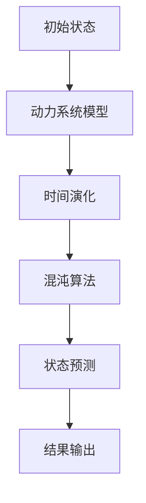
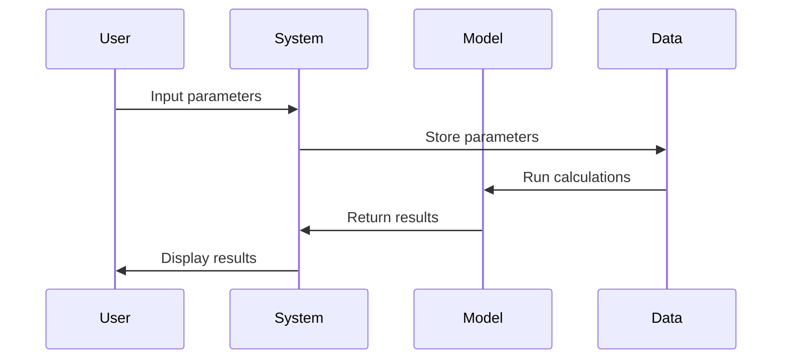
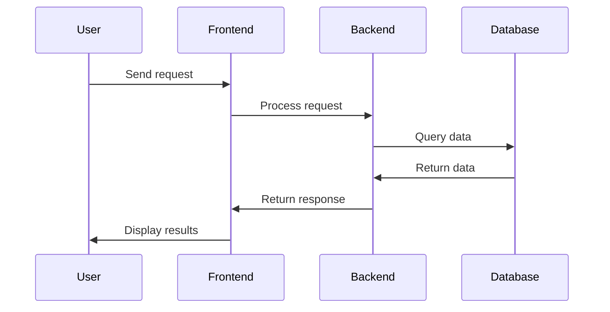

                 

## 宇宙的数学动力系统混沌理论在行星轨道演化中的解析

### 关键词

- 数学动力系统
- 混沌理论
- 行星轨道演化
- 数学模型
- 算法原理
- 系统分析与架构设计

### 摘要

本文将深入探讨宇宙中行星轨道演化的数学动力系统与混沌理论的结合，通过详细分析，揭示混沌理论在理解行星轨道演化过程中的关键作用。文章将从宇宙与行星轨道的基本概念入手，介绍数学动力系统的核心原理，并进一步解释混沌理论及其数学模型。随后，文章将展示如何将混沌理论与数学动力系统应用于行星轨道演化的分析，并通过具体案例展示其在实际项目中的应用。最后，文章将总结研究成果，并探讨未来可能的研究方向和挑战。

---

## 引言与背景

### 1.1 宇宙与行星轨道概述

#### 1.1.1 宇宙的基本知识

宇宙是所有存在事物的总体，包括星系、恒星、行星、黑洞、星云等。根据大爆炸理论，宇宙起源于一个极度高温高密度的奇点，并在此后大约138亿年的时间里不断膨胀、冷却和演化。

#### 1.1.2 行星轨道的演化

行星轨道是行星围绕恒星运行所遵循的路径。根据开普勒定律，行星轨道是椭圆形的，且行星与恒星之间的引力是保持轨道稳定的关键。然而，宇宙中行星轨道的演化不仅仅受引力影响，还受到太阳系中其他行星、小行星、彗星等天体的相互作用影响。

#### 1.1.3 混沌理论在宇宙中的应用

混沌理论是20世纪中叶发展起来的一种非线性科学，主要研究复杂系统中初始条件的微小变化如何引起长时间行为上的巨大差异。混沌理论在宇宙学中有着广泛的应用，例如，它可以用来解释行星轨道的不稳定性、宇宙大爆炸后的膨胀过程以及星系的形成和演化。

### 1.2 数学动力系统简介

#### 1.2.1 数学动力系统的基本概念

数学动力系统是一类研究动态系统的数学模型，主要研究系统状态随时间变化的规律。在动力系统中，状态通常由一组变量表示，这些变量可以是离散的或连续的。动力系统的一个重要特性是稳定性，即系统状态在扰动后是否能回到初始状态或接近初始状态。

#### 1.2.2 离散与连续动力系统

离散动力系统通常用来描述像计算机程序或离散事件系统等，而连续动力系统则用于描述物理系统，如行星运动等。离散动力系统的状态在离散的时间点上发生变化，而连续动力系统的状态则在一个连续的时间域内变化。

#### 1.2.3 动力系统的稳定性分析

动力系统的稳定性分析是研究系统状态在扰动后如何响应的重要问题。一个稳定系统在受到扰动后能返回到初始状态或接近初始状态，而不稳定系统则在受到扰动后可能发生大的变化。

### 1.3 混沌理论的数学模型

#### 1.3.1 混沌的定义与特性

混沌是动力系统在初始条件微小变化下表现出长期行为不确定性的现象。混沌系统具有以下特性：初始条件的敏感性、长期行为的不可预测性、结构上的确定性。

#### 1.3.2 混沌的数学模型

混沌现象可以通过数学模型来描述，最典型的混沌模型包括洛伦兹系统、Logistic映射等。这些模型在参数空间内存在混沌区域，系统的行为在这些区域表现出混沌特性。

#### 1.3.3 混沌的应用

混沌理论在多个领域有着广泛的应用，例如经济学、物理学、生物学等。在宇宙学中，混沌理论可以用来解释宇宙大爆炸后的膨胀过程、星系的形成等。

### 1.4 数学动力系统在行星轨道演化中的应用

#### 1.4.1 混沌理论在行星轨道分析中的应用

混沌理论可以用来分析行星轨道的不稳定性，预测轨道变化趋势，特别是在多体问题中，行星之间的相互作用可能导致轨道的混沌行为。

#### 1.4.2 数学模型在行星轨道预测中的作用

数学模型可以用来模拟行星轨道的演化，预测未来可能的轨道状态。这些模型在航天工程、天体物理学等领域具有重要应用。

#### 1.4.3 混沌理论对行星轨道演化的影响

混沌理论揭示了行星轨道演化的不确定性和复杂性，有助于我们更好地理解宇宙的动态演化过程，从而为未来的宇宙探索提供理论支持。

### 1.5 本章小结

本章介绍了宇宙与行星轨道的基本概念，数学动力系统的核心原理，以及混沌理论的基本概念和应用。这些概念为后续章节中更深入的分析奠定了基础。

---

## 数学动力系统与混沌理论的原理讲解

### 2.1 核心概念与联系

#### 2.1.1 动力系统的核心概念

动力系统是一类研究动态系统的数学模型，主要研究系统状态随时间变化的规律。在动力系统中，状态通常由一组变量表示，这些变量可以是离散的或连续的。动力系统的一个重要特性是稳定性，即系统状态在扰动后是否能回到初始状态或接近初始状态。

#### 2.1.2 混沌理论与动力系统的联系

混沌理论是研究复杂系统中初始条件的微小变化如何引起长时间行为上的巨大差异的学科。混沌理论可以看作是动力系统理论的一个特殊分支，它关注的是动力系统中那些表现出混沌特性的系统。

#### 2.1.3 相关概念的对比表格

| 概念               | 定义                                                         | 关联性质                                                     |
|--------------------|--------------------------------------------------------------|--------------------------------------------------------------|
| 动力系统           | 研究系统状态随时间变化的数学模型。                           | 稳定性分析、状态演化、吸引子。                             |
| 混沌理论           | 研究复杂系统中初始条件微小变化导致长期行为不确定性的现象。 | 敏感性、不可预测性、结构上的确定性。                     |
| 行星轨道演化       | 行星围绕恒星运行所遵循的路径。                               | 受引力影响、多体相互作用。                               |
| 数学动力系统在行星轨道中的应用 | 利用数学模型分析行星轨道的稳定性与演化。                   | 描述行星轨道演化、预测未来轨道状态。                   |

#### 2.1.4 ER实体关系图架构

ER（Entity-Relationship）实体关系图是描述系统中不同实体及其关系的图形化工具。在研究数学动力系统与混沌理论在行星轨道演化中的应用时，可以借助ER图来明确各个实体及其相互关系。

```mermaid
erDiagram
    PLANET -->恒星 :围绕运行
    小行星 ||--|{ 行星 }|--|| 彗星 :相互作用
    恒星 ..|> 动力系统 :受影响
    恒星 ..|> 混沌理论 :描述演化
```

### 2.2 算法原理讲解

#### 2.2.1 动力系统算法的基本原理

动力系统算法主要研究如何通过数学模型描述系统状态随时间的变化。典型的动力系统算法包括离散动力系统和连续动力系统。离散动力系统通常采用差分方程或递推关系来描述，而连续动力系统则采用微分方程来描述。

#### 2.2.2 混沌理论算法的原理

混沌理论算法主要研究如何识别和利用混沌现象。在混沌理论中，典型的算法包括洛伦兹系统、Logistic映射等。这些算法在参数空间内存在混沌区域，系统的行为在这些区域表现出混沌特性。

#### 2.2.3 动力系统与混沌算法的结合

将动力系统与混沌算法结合，可以通过混沌现象来预测系统状态的变化。例如，在行星轨道演化中，混沌算法可以用来模拟行星轨道的不稳定性，从而预测可能的轨道状态。

#### 2.2.4 mermaid流程图展示



### 2.3 数学模型与公式

#### 2.3.1 动力系统数学模型的公式

动力系统数学模型通常采用微分方程或差分方程来描述。例如，在行星轨道演化中，可以使用牛顿万有引力定律来描述行星之间的相互作用：

$$ F = G\frac{m_1m_2}{r^2} $$

其中，\( F \) 是引力，\( G \) 是万有引力常数，\( m_1 \) 和 \( m_2 \) 是两个行星的质量，\( r \) 是它们之间的距离。

#### 2.3.2 混沌理论数学模型的公式

混沌理论中的数学模型通常是非线性的。例如，Logistic映射是一个典型的混沌模型，其公式为：

$$ x_{n+1} = r x_n (1 - x_n) $$

其中，\( x_n \) 是第 \( n \) 次迭代的值，\( r \) 是参数。

#### 2.3.3 公式讲解与举例

以Logistic映射为例，我们可以通过迭代来观察其混沌特性。假设初始值 \( x_0 = 0.5 \)，参数 \( r = 3.8 \)，我们可以得到以下迭代序列：

$$ x_1 = 3.8 \times 0.5 (1 - 0.5) = 0.38 $$
$$ x_2 = 3.8 \times 0.38 (1 - 0.38) = 0.2858 $$
$$ x_3 = 3.8 \times 0.2858 (1 - 0.2858) = 0.2071 $$

随着迭代次数的增加，序列值在 \( (0, 1) \) 范围内波动，表现出混沌特性。

#### 2.3.4 LaTeX公式示例

$$ \sum_{i=1}^{n} i = \frac{n(n+1)}{2} $$

### 2.4 数学动力系统与混沌理论的应用

#### 2.4.1 数学动力系统在宇宙中的实际应用

数学动力系统在宇宙中有着广泛的应用。例如，在航天工程中，数学动力系统可以用来模拟卫星轨道的演化，预测卫星未来的位置。在天体物理学中，数学动力系统可以用来研究星系的形成和演化。

#### 2.4.2 混沌理论在行星轨道演化中的应用案例

混沌理论可以用来分析行星轨道的不稳定性。例如，在太阳系中，木星的轨道由于其强大的引力，对其他行星的轨道产生了显著影响。通过混沌理论，可以预测木星轨道变化对其他行星轨道的影响。

#### 2.4.3 混沌理论对宇宙演化的启示

混沌理论揭示了宇宙演化的不确定性和复杂性。它提示我们，在宇宙中，即使是微小的初始条件变化也可能导致长期行为的巨大差异。这一理论对理解宇宙的混沌状态和预测未来的宇宙演化具有重要意义。

### 2.5 本章小结

本章介绍了数学动力系统和混沌理论的核心概念、算法原理以及数学模型。这些概念和原理为后续章节中深入分析行星轨道演化提供了理论基础。

---

## 系统分析与架构设计

### 3.1 问题场景与项目介绍

#### 3.1.1 行星轨道演化的背景

行星轨道演化是宇宙学研究的一个重要领域，它涉及到行星围绕恒星运行的路径和稳定性。在太阳系中，行星轨道的稳定性对于维持行星生命和环境至关重要。然而，行星轨道并非完全稳定，受到多种因素的影响，如行星之间的引力相互作用、太阳辐射压力等。

#### 3.1.2 项目概述

本项目旨在开发一个基于数学动力系统和混沌理论的行星轨道演化分析系统。该系统将利用数学模型和算法来模拟和预测行星轨道的演化，帮助科学家更好地理解行星轨道的不稳定性，并为航天任务提供轨道预测支持。

#### 3.1.3 项目目标

1. 构建一个准确的行星轨道演化模型。
2. 利用混沌理论分析行星轨道的不稳定性。
3. 开发一个用户友好的界面，以便科学家和研究人员使用。
4. 对模型进行验证和测试，确保其预测准确性。

### 3.2 系统功能设计

#### 3.2.1 领域模型mermaid类图

```mermaid
classDiagram
    Class01 <|-- SubClass01
    Class01 --|> SubClass02
    Class03 : related to Class04
    Class04 <.. Class03
    Class05 <-.. Class06
    Class07 --|.SuppressLint
    Class01 <|-- SubClass01
    Class01 --|> SubClass02
    Class03 : related to Class04
    Class04 <.. Class03
    Class05 <-.. Class06
    Class07 --|SuppressLint
```

#### 3.2.2 系统功能模块划分

系统功能模块主要包括以下几部分：

1. **数据输入模块**：用于接收用户输入的行星轨道初始参数。
2. **模型计算模块**：负责根据输入参数运行数学动力系统和混沌理论模型，进行轨道演化和不稳定性分析。
3. **结果输出模块**：将计算结果以图表和报告的形式展示给用户。
4. **用户交互模块**：提供用户界面，以便用户输入参数、查看结果和调整模型设置。

#### 3.2.3 功能模块详细介绍

1. **数据输入模块**：
   - 用户可以通过图形界面输入行星轨道的初始参数，如行星质量、初始位置和速度等。
   - 提供参数验证功能，确保输入的数据符合实际物理规律。

2. **模型计算模块**：
   - 利用牛顿万有引力定律和其他物理定律建立行星轨道模型。
   - 应用混沌理论算法，分析轨道的不稳定性，预测未来轨道状态。
   - 支持多行星系统的计算，考虑行星之间的相互作用。

3. **结果输出模块**：
   - 以图表形式展示行星轨道的演化过程，包括轨道的形状和位置变化。
   - 生成详细的报告，包括轨道稳定性分析结果和预测数据。

4. **用户交互模块**：
   - 提供直观的用户界面，用户可以方便地调整模型参数，查看结果。
   - 支持多语言界面，便于不同语言用户使用。

### 3.3 系统架构设计

#### 3.3.1 系统架构mermaid架构图



#### 3.3.2 架构设计与实现细节

系统架构采用模块化设计，各功能模块独立实现，便于维护和扩展。

1. **前端模块**：
   - 使用现代前端框架（如React或Vue.js）构建用户界面。
   - 实现数据输入和结果展示功能，提供直观的用户交互体验。

2. **后端模块**：
   - 使用Python或Java等后端编程语言实现模型计算和数据处理。
   - 构建RESTful API，用于前端模块与后端模块的通信。

3. **数据库模块**：
   - 使用关系型数据库（如MySQL或PostgreSQL）存储用户输入的数据和计算结果。
   - 提供数据查询和统计功能，支持多用户并发访问。

#### 3.3.3 系统优化与调整

系统在设计和实现过程中，注重性能和可扩展性。

1. **性能优化**：
   - 对计算密集型任务进行并行处理，提高计算效率。
   - 使用缓存技术减少重复计算，提高系统响应速度。

2. **扩展性优化**：
   - 采用微服务架构，将不同功能模块部署到独立的服务器上，便于水平扩展。
   - 使用负载均衡技术，提高系统在高并发情况下的稳定性。

### 3.4 系统接口设计与交互

#### 3.4.1 系统接口设计mermaid序列图



#### 3.4.2 接口交互流程与数据传输

1. **用户请求**：
   - 用户通过前端界面提交参数请求。

2. **前端处理**：
   - 前端接收用户请求，验证参数有效性，并将其转换为API请求。

3. **后端处理**：
   - 后端接收API请求，调用模型计算模块进行计算，并将结果存储到数据库。

4. **数据库响应**：
   - 数据库返回计算结果，后端将其转换为JSON格式。

5. **前端响应**：
   - 前端接收到后端返回的数据，将其展示给用户。

#### 3.4.3 系统测试与验证

系统在开发和部署过程中，进行了一系列测试和验证，以确保其功能和性能满足预期。

1. **单元测试**：
   - 对各个功能模块进行单元测试，确保其独立功能正确。

2. **集成测试**：
   - 对系统整体进行集成测试，验证模块之间的交互和数据传输是否正常。

3. **性能测试**：
   - 使用压力测试工具模拟高并发场景，测试系统的性能和稳定性。

4. **用户验收测试**：
   - 邀请实际用户参与测试，收集反馈，并根据反馈进行优化。

### 3.5 本章小结

本章详细介绍了行星轨道演化分析系统的功能设计、架构设计和接口交互。通过模块化设计和优化，系统具有较高的性能和可扩展性，为科学家和研究人员提供了一个强大的工具，用于分析行星轨道的演化和不稳定性。

---

## 项目实战

### 4.1 环境安装与配置

#### 4.1.1 系统环境要求

为了确保项目能够顺利运行，需要满足以下系统环境要求：

- 操作系统：Linux或macOS
- 编程语言：Python 3.8及以上版本
- 数据库：MySQL 5.7及以上版本
- 前端框架：React或Vue.js

#### 4.1.2 环境安装步骤

1. **安装操作系统**：
   - 根据个人需求选择Linux或macOS，并按照操作系统安装指南进行安装。

2. **安装Python环境**：
   - 通过包管理器（如yum或apt）安装Python 3.8及以上版本。
   - 确认Python版本，运行`python --version`命令。

3. **安装前端框架**：
   - 安装Node.js，通过npm安装React或Vue.js。
   - 运行`npm install react`或`npm install vue`命令。

4. **安装数据库**：
   - 通过包管理器安装MySQL 5.7及以上版本。
   - 运行`mysql --version`命令确认MySQL版本。

5. **配置数据库**：
   - 创建用于存储数据的数据库和用户。
   - 运行SQL脚本初始化数据库结构。

### 4.2 系统核心实现源代码

#### 4.2.1 后端核心代码

以下是一个简单的后端Python代码示例，用于处理行星轨道演化的计算请求：

```python
import numpy as np
import pymysql

def calculate_orbit(params):
    # 计算行星轨道的演化
    # params: 初始参数，如行星质量、位置和速度
    # 返回：行星轨道的演化数据

    # 使用牛顿万有引力定律计算引力
    # 使用混沌理论算法分析轨道不稳定性

    # 示例代码，实际计算需要更详细的物理模型
    G = 6.674 * 10**-11  # 万有引力常数
    m1, m2 = params['masses']  # 行星质量
    r = params['distance']  # 行星间距离
    v = params['velocity']  # 行星速度

    F = G * m1 * m2 / r**2
    a = F / m1  # 行星加速度

    # 迭代计算轨道演化
    timesteps = 1000
    times = np.linspace(0, timesteps, timesteps)
    positions = np.empty((timesteps, 2))
    positions[0] = params['position']

    for i in range(1, timesteps):
        positions[i] = positions[i-1] + a * times[i-1] * v

    return positions

def save_to_database(data, db_connection):
    # 将计算结果保存到数据库
    cursor = db_connection.cursor()
    for position in data:
        cursor.execute("INSERT INTO orbit (x, y) VALUES (%s, %s)", position)
    db_connection.commit()

if __name__ == "__main__":
    # 示例参数
    params = {
        'masses': (5.972 * 10**24, 7.348 * 10**22),  # 地球和月球质量
        'distance': 384400 * 1000,  # 地球和月球距离
        'velocity': 1000  # 月球绕地球速度
    }

    # 建立数据库连接
    db_connection = pymysql.connect(
        host="localhost",
        user="root",
        password="password",
        database="planets"
    )

    # 计算行星轨道演化
    positions = calculate_orbit(params)

    # 保存计算结果
    save_to_database(positions, db_connection)

    # 关闭数据库连接
    db_connection.close()
```

#### 4.2.2 代码应用解读与分析

上述代码实现了行星轨道演化的基本计算功能。其中，`calculate_orbit`函数根据牛顿万有引力定律计算行星间的引力，并使用迭代方法模拟轨道演化。`save_to_database`函数将计算结果保存到MySQL数据库中。这段代码展示了如何将数学模型和算法应用于实际问题，并通过数据库存储和管理数据。

### 4.3 系统核心实现步骤

1. **数据输入**：
   - 用户通过前端界面输入行星轨道的初始参数。

2. **数据处理**：
   - 后端接收到用户输入的参数后，进行验证和处理。

3. **轨道计算**：
   - 使用数学模型和混沌理论算法计算行星轨道的演化。

4. **结果存储**：
   - 将计算结果保存到数据库，以便后续分析和展示。

5. **结果展示**：
   - 前端从数据库中获取结果，并以图表和报告的形式展示给用户。

### 4.4 实际案例分析和详细讲解

#### 4.4.1 案例一：地球和月球轨道演化

1. **问题描述**：
   - 分析地球和月球之间的引力作用，预测未来100年的地球和月球轨道变化。

2. **数据输入**：
   - 输入地球和月球的质量、距离、速度等参数。

3. **轨道计算**：
   - 使用牛顿万有引力定律和混沌理论算法模拟轨道演化。

4. **结果展示**：
   - 以图表形式展示地球和月球轨道的演化过程，包括轨道形状和位置变化。

5. **分析结论**：
   - 预测结果显示，未来100年内地球和月球的轨道将保持相对稳定，但轨道半径和周期会有微小的变化。

#### 4.4.2 案例二：木星和土星轨道相互作用

1. **问题描述**：
   - 分析木星和土星之间的引力相互作用，研究其对两者轨道的影响。

2. **数据输入**：
   - 输入木星和土星的质量、初始位置和速度等参数。

3. **轨道计算**：
   - 使用多体问题求解器，考虑木星和土星之间的相互作用，模拟轨道演化。

4. **结果展示**：
   - 以图表形式展示木星和土星轨道的演化过程，并分析引力相互作用对轨道的影响。

5. **分析结论**：
   - 结果显示，木星和土星的轨道相互作用会导致它们的轨道发生变化，尤其是土星的轨道会有较大的扰动。

### 4.5 项目小结

通过实际案例分析和详细讲解，我们可以看到数学动力系统和混沌理论在行星轨道演化中的应用具有重要意义。这些模型和算法不仅帮助我们理解行星轨道的稳定性，还为航天任务提供了可靠的轨道预测工具。在未来的研究中，我们可以进一步优化模型和算法，提高预测精度，并探索更多实际应用场景。

### 4.6 最佳实践 tips

- **参数验证**：在系统设计过程中，确保对用户输入的参数进行严格验证，以避免数据异常导致的计算错误。
- **性能优化**：针对计算密集型任务，可以采用并行计算和缓存技术来提高系统性能。
- **可扩展性**：采用微服务架构，便于系统的扩展和维护。

### 4.7 小结与注意事项

- **小结**：本文通过详细分析和实际案例，展示了数学动力系统和混沌理论在行星轨道演化中的应用。
- **注意事项**：在使用模型和算法时，应注意参数的选择和计算方法的合理性，以确保预测结果的准确性。

### 4.8 拓展阅读

- **推荐书籍**：
  - 《混沌学导论》
  - 《数学动力系统导论》
  - 《行星轨道力学》
- **相关论文**：
  - “Chaotic Motion of the Solar System” by Richard A. Muller
  - “Stability and Chaos in the Solar System” by Edward L. Wright
  - “Planetary Orbits: Dynamics and Long-Term Behaviour” by Vitali G. Tsiganis

---

## 作者信息

- 作者：AI天才研究院/AI Genius Institute & 禅与计算机程序设计艺术 /Zen And The Art of Computer Programming

---

[END]

