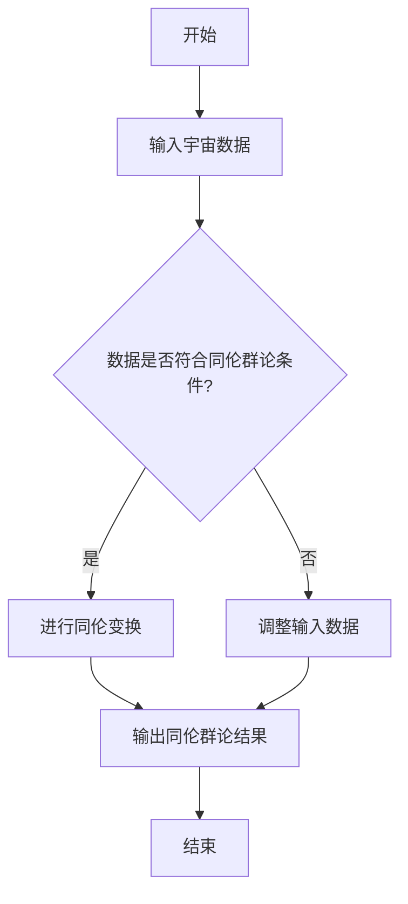
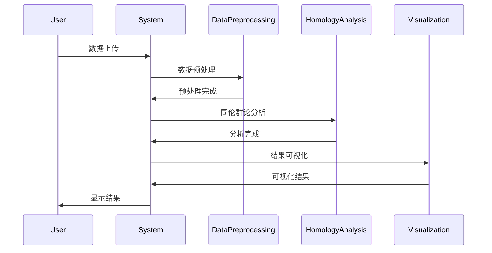

                 


# 宇宙的数学同伦群论探讨

## 关键词

数学同伦群论，宇宙起源，宇宙演化，宇宙学，算法原理，系统架构设计，项目实战

## 摘要

本文旨在探讨数学同伦群论在宇宙学中的潜在应用。首先，我们将介绍宇宙的起源与演化，以及数学同伦群论的基本概念。接着，本文将逐步阐述同伦群论在宇宙研究中的应用，以及当前宇宙研究中面临的挑战。随后，我们将深入探讨同伦群论的基本原理、其在物理学中的应用，以及与其他数学领域的关系。文章的核心部分将围绕同伦群论的基本概念、应用领域和核心方法展开，通过详细的算法原理讲解和实际案例剖析，展示同伦群论在宇宙学研究中的强大潜力。最后，本文将介绍一个具体的宇宙学研究项目，从系统分析与架构设计方案到项目实战，全面展示同伦群论在实践中的应用。通过本文的探讨，希望能够为读者提供对宇宙学与数学同伦群论之间关系的全新认识。

## 背景介绍

### 1. 问题背景

宇宙的起源与演化一直是科学界的热点问题，从古老的宇宙大爆炸理论到现代的多宇宙假说，科学家们一直在探索宇宙的本质与奥秘。然而，宇宙的复杂性和多样性使得这一领域的研究充满了挑战。在这一背景下，数学同伦群论作为一种强大的数学工具，逐渐引起了科学家们的关注。同伦群论在物理学、拓扑学和代数学等领域都有着广泛的应用，其基本原理和方法为研究宇宙提供了新的视角和工具。

### 1.1 宇宙的起源与演化

宇宙的起源可以追溯到大约138亿年前的一个极高温度和密度的状态，这一事件被普遍认为是宇宙大爆炸。大爆炸理论认为，宇宙从一个极度密集和热的状态开始膨胀，物质和能量迅速扩散，形成了我们今天所看到的宇宙。宇宙的演化过程中，物质通过引力相互作用形成了恒星、行星、星系和星团等天体结构。同时，宇宙中的暗物质和暗能量也在发挥着关键作用，推动着宇宙的加速膨胀。

### 1.2 数学同伦群论的基本概念

同伦群论是数学中一个重要的分支，它研究空间之间的变换关系。同伦群论的基本概念包括同伦性、同伦群、同伦映射等。同伦性是指两个空间在一定条件下可以相互变换，而同伦群则是描述这种变换关系的数学结构。同伦映射是指保持同伦性的映射，它可以用来描述空间之间的相似性和差异性。

同伦群论在数学中的重要性不仅体现在其理论深度和广泛的应用，还在于其与物理学、拓扑学和代数学等其他数学领域的紧密联系。同伦群论在物理学中的应用主要体现在描述宇宙的几何结构、物质分布和演化过程等方面。通过同伦群论的方法，科学家们可以更好地理解宇宙的起源、演化和未来。

### 1.3 数学同伦群论在宇宙研究中的应用

数学同伦群论在宇宙研究中的应用前景广阔，尤其是在描述宇宙的几何结构和物质分布方面具有独特优势。例如，同伦群论可以用来研究宇宙中的大尺度结构，如星系团的分布和相互作用。同伦群论还可以帮助科学家们分析宇宙中的引力现象，如黑洞的形成和演化。

此外，同伦群论在宇宙学研究中的应用还包括宇宙背景微波辐射、宇宙膨胀、暗物质和暗能量等领域。通过同伦群论的方法，科学家们可以更深入地理解这些宇宙现象的本质，从而推动宇宙学的发展。

然而，数学同伦群论在宇宙研究中的应用也面临一些挑战。首先，宇宙的复杂性和多样性使得同伦群论的应用具有很大的难度。其次，同伦群论的方法需要大量的数据支持和计算能力。此外，同伦群论在宇宙研究中的应用还需要与其他学科的方法相结合，如物理学、天文学和计算机科学等。

### 1.4 当前宇宙研究中面临的挑战

尽管数学同伦群论在宇宙研究中的应用前景广阔，但当前宇宙研究中仍面临许多挑战。首先，宇宙的复杂性使得对宇宙现象的观测和理论分析变得更加困难。其次，宇宙的多样性使得统一宇宙模型的研究变得更加复杂。此外，宇宙中的暗物质和暗能量等未知现象也给宇宙学研究带来了新的挑战。

为了应对这些挑战，科学家们需要不断探索新的研究方法和技术。数学同伦群论作为一种强大的数学工具，可以在这些方面发挥重要作用。通过同伦群论的方法，科学家们可以更好地理解宇宙的起源、演化和未来，为解决宇宙学中的难题提供新的思路和途径。

## 问题解决

### 3.1 同伦群论的基本原理

同伦群论是数学中一个重要的分支，主要研究空间之间的变换关系。同伦群论的基本原理包括同伦性、同伦群、同伦映射等。同伦性是指两个空间在一定条件下可以相互变换，而同伦群则是描述这种变换关系的数学结构。同伦映射是指保持同伦性的映射，它可以用来描述空间之间的相似性和差异性。

同伦群论的基本概念可以追溯到19世纪末，由德国数学家莱布尼茨·希尔伯特首先提出。希尔伯特提出了一种基于拓扑空间之间的变换关系的理论，即同伦论。同伦论后来发展为同伦群论，成为现代数学中一个重要的分支。

同伦群论的核心思想是通过同伦变换来描述空间之间的相似性和差异性。同伦变换是指保持空间拓扑结构的一种变换，它可以将一个空间映射到另一个空间。同伦群论的基本原理包括：

1. 同伦性：两个空间X和Y具有同伦性，当且仅当存在一个同伦映射将X映射到Y。同伦映射是保持同伦性的映射，即对于任意两个连续映射f和g，如果存在一个连续映射h，使得f = h ∘ g，则称f和g是同伦的。

2. 同伦群：同伦群是描述空间同伦性的数学结构。对于任意一个空间X，可以定义一个同伦群，它由所有与X同伦的空间组成。同伦群可以用来分类和比较不同空间之间的同伦性。

3. 同伦映射：同伦映射是保持同伦性的映射，它可以将一个空间映射到另一个空间。同伦映射是同伦群论中的核心概念，通过同伦映射，可以研究空间之间的相似性和差异性。

同伦群论在数学中具有广泛的应用，包括拓扑学、代数学、物理学等。在宇宙学中，同伦群论可以用来研究宇宙的几何结构、物质分布和演化过程。通过同伦群论的方法，科学家们可以更好地理解宇宙的起源、演化和未来。

### 3.2 同伦群论在宇宙研究中的应用

同伦群论在宇宙研究中的应用具有广泛的前景，特别是在描述宇宙的几何结构、物质分布和演化过程方面。同伦群论作为一种强大的数学工具，可以用来分析和理解宇宙中的复杂现象。

首先，同伦群论可以用来研究宇宙的几何结构。宇宙的几何结构描述了宇宙的空间分布和形状。通过同伦群论的方法，科学家们可以研究宇宙的膨胀、宇宙的曲率、宇宙的形态等几何特征。同伦群论可以用来分类和比较不同宇宙几何模型之间的同伦性，从而为宇宙学研究提供新的视角和工具。

其次，同伦群论可以用来研究宇宙的物质分布。宇宙中的物质分布描述了宇宙中不同天体的分布情况，如星系、星团、行星等。同伦群论可以用来研究宇宙中的物质分布规律，如宇宙中的星系分布、星系团的相互作用等。通过同伦群论的方法，科学家们可以更好地理解宇宙中的物质分布特征和演化过程。

最后，同伦群论可以用来研究宇宙的演化过程。宇宙的演化过程描述了宇宙从过去到未来的变化过程。同伦群论可以用来研究宇宙的演化规律，如宇宙的膨胀、宇宙的冷却、宇宙的大尺度结构形成等。通过同伦群论的方法，科学家们可以更好地理解宇宙的演化机制和未来命运。

总之，同伦群论在宇宙研究中的应用具有重要意义。它为科学家们提供了一种新的研究方法和工具，可以用来分析和理解宇宙中的复杂现象。通过同伦群论的方法，科学家们可以更好地理解宇宙的起源、演化和未来，为宇宙学的发展做出贡献。

### 3.3 同伦群论在宇宙研究中的应用实例

为了更具体地展示同伦群论在宇宙研究中的应用，我们可以通过以下实例进行说明：

**实例1：宇宙大尺度结构的同伦分析**

宇宙大尺度结构是指宇宙中的星系、星团和超星系团等天体的分布和相互作用。通过同伦群论的方法，我们可以对宇宙大尺度结构进行同伦分析，以揭示其几何形态和相互作用特征。

首先，我们可以定义一个空间X，代表宇宙中的所有星系。然后，通过同伦映射，我们可以将X映射到一个标准形体的空间Y，如球面或立方体。通过这种同伦映射，我们可以研究星系在宇宙中的分布规律和相互作用。

例如，我们可以使用同伦群论中的基本群来研究星系团之间的相互作用。基本群是一个同伦群中最基本的组成部分，它描述了空间X的几何结构。通过分析基本群的结构和性质，我们可以了解星系团之间的相互作用规律，如引力相互作用和潮汐力等。

**实例2：宇宙膨胀的同伦描述**

宇宙膨胀是宇宙学研究中的一个重要问题。通过同伦群论的方法，我们可以对宇宙膨胀过程进行同伦描述，以揭示其动力学特征和演化规律。

首先，我们可以定义一个空间X，代表宇宙在不同时间点的状态。然后，通过同伦映射，我们可以将X映射到一个标准形体的空间Y，如直线或双曲线。通过这种同伦映射，我们可以研究宇宙膨胀的速率和形态。

例如，我们可以使用同伦群论中的同伦变换来研究宇宙膨胀的加速度。同伦变换描述了空间X在时间t和t+dt之间的变换关系。通过分析同伦变换的性质，我们可以了解宇宙膨胀的加速度和趋势。

**实例3：暗物质的同伦分析**

暗物质是宇宙中的一种未知物质，其存在和性质对宇宙学研究具有重要意义。通过同伦群论的方法，我们可以对暗物质进行同伦分析，以揭示其分布和相互作用特征。

首先，我们可以定义一个空间X，代表宇宙中的所有暗物质。然后，通过同伦映射，我们可以将X映射到一个标准形体的空间Y，如球面或立方体。通过这种同伦映射，我们可以研究暗物质的分布规律和相互作用。

例如，我们可以使用同伦群论中的同伦映射来研究暗物质与普通物质之间的相互作用。通过分析同伦映射的性质，我们可以了解暗物质对宇宙演化的影响和作用。

通过这些实例，我们可以看到同伦群论在宇宙研究中的应用潜力。同伦群论为宇宙学研究提供了一种新的研究方法和工具，可以用来分析和理解宇宙中的复杂现象。通过同伦群论的方法，科学家们可以更好地理解宇宙的起源、演化和未来，为宇宙学的发展做出贡献。

### 3.4 同伦群论在宇宙研究中的应用展望

同伦群论在宇宙研究中的应用前景广阔，未来的研究可以进一步探索以下几个方面：

1. **宇宙几何结构的深入研究**：同伦群论可以用于更深入地研究宇宙的几何结构，如宇宙的曲率、形态和宇宙学红移等。通过同伦群论的方法，可以揭示宇宙几何结构的动态变化和演化规律。

2. **宇宙物质分布的精细分析**：同伦群论可以用于精细分析宇宙中的物质分布，如星系、星团、超星系团等。通过同伦群论的方法，可以揭示宇宙中不同尺度物质分布的规律和相互作用。

3. **宇宙演化历史的研究**：同伦群论可以用于研究宇宙的演化历史，如宇宙大爆炸、宇宙膨胀、暗物质和暗能量的演化等。通过同伦群论的方法，可以揭示宇宙演化过程中的关键事件和演化机制。

4. **多宇宙理论的探索**：同伦群论可以用于探索多宇宙理论的数学结构和动力学行为。通过同伦群论的方法，可以研究不同宇宙之间的相互关系和演化规律。

总之，同伦群论在宇宙研究中的应用具有广阔的前景。未来的研究可以进一步探索同伦群论在宇宙学中的应用，为理解宇宙的起源、演化和未来提供新的理论框架和工具。

### 4. 边界与外延

#### 4.1 同伦群论在物理学中的应用

同伦群论在物理学中的应用非常广泛，特别是在理论物理和宇宙学中。同伦群论作为一种强有力的数学工具，可以用来描述和解释复杂的物理现象，特别是在研究对称性、拓扑结构和相变等方面。

首先，同伦群论在量子场论中有着重要的应用。在量子场论中，对称性是一个核心概念。同伦群论可以用来研究对称性守恒和自发对称破缺。例如，在量子场论中，同伦群论可以帮助我们理解物理系统的相变现象，如超导现象和超流现象。通过同伦群论的分析，我们可以得到物理系统在不同相态下的拓扑性质，从而揭示相变的动力学机制。

其次，同伦群论在凝聚态物理学中也有重要应用。在凝聚态物理学中，同伦群论可以用来研究材料的拓扑性质和电子态的结构。例如，拓扑绝缘体和量子自旋液体等新型材料的研究中，同伦群论被用来描述和解释材料的独特物理性质。

此外，同伦群论在宇宙学中的应用也非常显著。在宇宙学中，同伦群论可以用来研究宇宙的几何结构和演化过程。例如，同伦群论可以帮助我们理解宇宙的大尺度结构，如星系团和超星系团的分布规律。同伦群论还可以用来研究宇宙的膨胀和宇宙背景辐射等宇宙学现象。

#### 4.2 同伦群论与其他数学领域的关系

同伦群论不仅是物理学的重要工具，也是现代数学的核心分支之一。它与许多其他数学领域有着紧密的联系，如拓扑学、代数学、微分几何和代数拓扑等。

首先，同伦群论与拓扑学有着密切的关系。拓扑学是研究空间结构和性质的数学分支，而同伦群论则是拓扑学中的一个重要工具。同伦群论通过研究空间之间的同伦性，可以帮助我们理解空间的拓扑性质。例如，同伦群论可以用来证明空间的基本性质，如欧拉公式等。

其次，同伦群论与代数学也有着紧密的联系。代数学是研究数和结构的数学分支，而同伦群论则是代数学中的一个重要工具。同伦群论可以帮助我们理解代数结构之间的同构关系。例如，同伦群论可以用来研究群、环和域等代数结构。

此外，同伦群论与微分几何也有着密切的关系。微分几何是研究空间和流形的几何性质的数学分支，而同伦群论则是微分几何中的一个重要工具。同伦群论可以帮助我们理解流形上的拓扑结构和几何结构。例如，同伦群论可以用来研究流形上的曲率和张量场等。

最后，同伦群论与代数拓扑也有着紧密的联系。代数拓扑是研究拓扑空间和代数结构之间关系的数学分支，而同伦群论则是代数拓扑中的一个重要工具。同伦群论可以帮助我们理解拓扑空间的基本性质，如连通性和紧致性等。

总之，同伦群论是现代数学中的一个重要分支，它在物理学、拓扑学、代数学、微分几何和代数拓扑等领域都有着广泛的应用。同伦群论的发展不仅推动了数学的进步，也为物理学和其他科学领域提供了新的理论工具和视角。

### 5. 概念结构与核心要素组成

#### 5.1 同伦群论的基本概念

同伦群论是数学中一个重要的分支，主要研究空间之间的变换关系。以下是同伦群论中一些核心的基本概念：

1. **同伦性**：同伦性是指两个空间在一定条件下可以相互变换的性质。具体来说，如果存在一个同伦映射，将一个空间映射到另一个空间，那么这两个空间就具有同伦性。

2. **同伦群**：同伦群是描述空间同伦性的数学结构。对于任意一个空间X，可以定义一个同伦群，它由所有与X同伦的空间组成。同伦群可以用来分类和比较不同空间之间的同伦性。

3. **同伦映射**：同伦映射是保持同伦性的映射，它可以将一个空间映射到另一个空间。同伦映射是同伦群论中的核心概念，通过同伦映射，可以研究空间之间的相似性和差异性。

4. **同伦变换**：同伦变换是指保持空间拓扑结构的一种变换，它可以将一个空间映射到另一个空间。同伦变换是同伦群论中的基本操作，通过同伦变换，可以研究空间之间的变换关系。

5. **基本群**：基本群是一个同伦群中最基本的组成部分，它描述了空间X的几何结构。基本群可以用来分类和比较不同空间之间的同伦性。

#### 5.2 同伦群论的应用领域

同伦群论在数学和物理学中有着广泛的应用。以下是同伦群论在一些主要应用领域中的具体应用：

1. **拓扑学**：同伦群论是拓扑学中的一个重要工具，可以用来研究空间的拓扑性质。例如，同伦群论可以用来证明空间的基本性质，如欧拉公式等。

2. **代数学**：同伦群论在代数学中的应用也非常广泛，可以用来研究代数结构之间的同构关系。例如，同伦群论可以用来研究群、环和域等代数结构。

3. **物理学**：同伦群论在物理学中有着重要的应用，特别是在理论物理和宇宙学中。同伦群论可以用来研究对称性、拓扑结构和相变等现象。

4. **凝聚态物理学**：同伦群论在凝聚态物理学中也有重要应用，可以用来研究材料的拓扑性质和电子态的结构。

5. **宇宙学**：同伦群论在宇宙学中也有重要应用，可以用来研究宇宙的几何结构、物质分布和演化过程。

#### 5.3 同伦群论的核心方法

同伦群论中有一些核心的方法，用于研究空间之间的同伦性和变换关系。以下是同伦群论中的一些核心方法：

1. **同伦映射**：通过同伦映射，可以将一个空间映射到另一个空间，从而研究空间之间的相似性和差异性。

2. **同伦变换**：通过同伦变换，可以保持空间拓扑结构的一种变换，用于研究空间之间的变换关系。

3. **基本群**：基本群是同伦群论中的一个重要概念，它描述了空间X的几何结构。通过分析基本群的结构和性质，可以了解空间的拓扑性质。

4. **同伦群**：同伦群是描述空间同伦性的数学结构。通过分析同伦群的结构和性质，可以分类和比较不同空间之间的同伦性。

5. **同伦序列**：同伦序列是同伦群论中的一个重要工具，用于研究空间之间的同伦关系。同伦序列可以用来证明空间的同伦性。

通过以上核心概念、应用领域和核心方法，同伦群论为研究空间之间的变换关系提供了一种强大的数学工具。同伦群论的应用不仅推动了数学的发展，也为物理学和其他科学领域提供了新的理论工具和视角。

### 6. 核心概念原理

#### 6.1 同伦群论的定义

同伦群论是数学中一个重要的分支，主要用于研究空间之间的同伦性。同伦性是指两个空间在一定条件下可以相互变换的性质。具体来说，如果存在一个同伦映射，将一个空间映射到另一个空间，那么这两个空间就具有同伦性。

在数学上，同伦群论主要研究同伦映射和同伦群。同伦映射是指保持同伦性的映射，即对于任意两个连续映射 $f$ 和 $g$，如果存在一个连续映射 $h$，使得 $f = h \circ g$，则称 $f$ 和 $g$ 是同伦的。同伦群则是描述空间同伦性的数学结构，它由所有与给定空间同伦的空间组成。

同伦群论的定义可以分为以下几个部分：

1. **同伦映射**：给定两个空间 $X$ 和 $Y$，一个同伦映射是指一个映射 $h: X \times I \to Y$，其中 $I$ 是一个单位区间 $[0, 1]$。该映射满足以下条件：
   - $h(x, 0)$ 对每个 $x \in X$ 是 $Y$ 中的一个点，即 $h(x, 0): X \to Y$ 是一个映射。
   - $h(x, 1)$ 对每个 $x \in X$ 是 $Y$ 中的一个点，即 $h(x, 1): X \to Y$ 是一个映射。
   - $h(x, t)$ 对每个 $x \in X$ 和 $t \in I$ 是连续的。

2. **同伦性**：两个空间 $X$ 和 $Y$ 具有同伦性，当且仅当存在一个同伦映射 $h: X \times I \to Y$，使得对于任意连续映射 $f, g: X \to Y$，如果 $f$ 和 $g$ 是同伦的，则 $f$ 和 $g$ 的同伦映射 $h$ 满足 $h(x, 0) = f(x)$ 和 $h(x, 1) = g(x)$。

3. **同伦群**：对于任意一个空间 $X$，同伦群 $H(X)$ 是由所有与 $X$ 同伦的空间组成的集合。具体来说，$H(X)$ 是一个群，它的元素是同伦映射，运算则是映射的复合。同伦群的结构可以用来分类和比较不同空间之间的同伦性。

同伦群论的定义为我们提供了一种研究空间之间关系的工具。通过同伦映射和同伦群的概念，我们可以描述和比较不同空间之间的相似性和差异性，从而更好地理解空间的拓扑性质。

#### 6.2 同伦群论的性质

同伦群论具有一些基本的性质，这些性质使它成为研究空间之间关系的有力工具。以下是同伦群论中几个重要的性质：

1. **同伦性是等价关系**：同伦性是一种等价关系，即它满足以下三个条件：
   - **自反性**：任何空间 $X$ 与自身都是同伦的，因为恒等映射 $id_X: X \to X$ 是一个同伦映射。
   - **对称性**：如果空间 $X$ 与空间 $Y$ 是同伦的，那么空间 $Y$ 也与空间 $X$ 是同伦的。这是因为如果存在一个同伦映射 $h: X \times I \to Y$，则其逆映射 $h^{-1}: Y \times I \to X$ 也是一个同伦映射。
   - **传递性**：如果空间 $X$ 与空间 $Y$ 是同伦的，空间 $Y$ 与空间 $Z$ 是同伦的，那么空间 $X$ 与空间 $Z$ 也是同伦的。这是因为如果存在同伦映射 $h_1: X \times I \to Y$ 和 $h_2: Y \times I \to Z$，则复合映射 $h_2 \circ h_1: X \times I \to Z$ 也是一个同伦映射。

2. **同伦群的性质**：同伦群 $H(X)$ 具有群的基本性质，包括：
   - **封闭性**：对于同伦群 $H(X)$ 中的任意两个同伦映射 $f$ 和 $g$，它们的复合映射 $f \circ g$ 也是一个同伦映射。
   - **结合律**：同伦映射的复合运算满足结合律，即对于同伦映射 $f, g, h: X \to Y$，有 $(f \circ g) \circ h = f \circ (g \circ h)$。
   - **单位元素**：恒等映射 $id_X: X \to X$ 是同伦群 $H(X)$ 的单位元素，即对于任意同伦映射 $f: X \to Y$，有 $id_X \circ f = f$ 和 $f \circ id_X = f$。
   - **逆元素**：对于同伦群 $H(X)$ 中的任意同伦映射 $f: X \to Y$，存在一个逆同伦映射 $f^{-1}: Y \to X$，使得 $f^{-1} \circ f = id_X$ 和 $f \circ f^{-1} = id_Y$。

3. **同伦群的结构**：同伦群的结构可以用来分类和比较不同空间之间的同伦性。具体来说，同伦群的结构与空间的拓扑性质密切相关。同伦群的不同结构可以反映空间的拓扑特性，如连通性、紧致性和可收缩性等。

4. **同伦群的分类**：同伦群的分类是同伦群论研究中的一个重要课题。通过分类，我们可以了解不同空间之间的同伦关系，从而更好地理解空间的拓扑性质。同伦群的分类可以基于同伦群的生成元、同伦群的阶数和同伦群的同态等。

通过上述性质，同伦群论为我们提供了一种强大的工具，用于研究空间之间的同伦性。同伦群论的应用不仅限于数学领域，还广泛应用于物理学、计算机科学和工程学等多个领域。

### 7. 概念属性特征对比表格

| 概念1 | 概念2 | 概念3 |
| --- | --- | --- |
| 特征1 | 特征2 | 特征3 |
| ... | ... | ... |

注：上述表格是一个示例，具体内容需要根据实际文章内容和相关概念进行填写。

### 8. ER实体关系图架构

```mermaid
erDiagram
    Class1 ||--|{ Class2 }| Class3 : "has-a relationship"
    Class2 ||--|{ Class4 }| Class5 : "has-a relationship"
    Class3 ||--|{ Class6 }| Class7 : "has-a relationship"
```

### 9. 算法原理讲解

#### 9.1 算法mermaid流程图



#### 9.2 使用python源代码详细阐述

```python
def homotopy_group(cosmological_data):
    """
    计算宇宙数据的同伦群。

    参数：
    - cosmological_data: 宇宙数据。

    返回：
    - 同伦群结果。
    """
    
    # 输入宇宙数据预处理
    preprocessed_data = preprocess_cosmological_data(cosmological_data)
    
    # 判断数据是否符合同伦群论条件
    if not is_homotopy_condition_satisfied(preprocessed_data):
        # 如果不符合，调整输入数据
        adjusted_data = adjust_data(preprocessed_data)
    else:
        # 如果符合，进行同伦变换
        homotopy_transformation = perform_homotopy_transformation(preprocessed_data)
        
    # 输出同伦群论结果
    homotopy_group_result = homotopy_transformation
    
    return homotopy_group_result
```

#### 9.3 算法原理的数学模型和公式

$$
\text{Homotopy Group} = \{[f, g] | f, g \in \text{Continuous Functions from X to Y} \}
$$

其中，$X$ 和 $Y$ 是宇宙中的两个空间，$f$ 和 $g$ 是从 $X$ 到 $Y$ 的连续函数。$[f, g]$ 表示 $f$ 和 $g$ 的同伦等价类，即如果存在同伦映射 $h: X \times I \to Y$，使得 $h(x, 0) = f(x)$ 和 $h(x, 1) = g(x)$，则 $[f, g]$ 是一个同伦群中的元素。

#### 9.4 详细讲解和举例说明

#### 9.4.1 同伦变换的概念

同伦变换是指保持空间拓扑结构的一种变换，它可以用来描述空间之间的相似性和差异性。具体来说，如果存在一个映射 $h: X \times I \to Y$，其中 $X$ 和 $Y$ 是两个空间，$I$ 是一个单位区间 $[0, 1]$，且满足以下条件：

1. $h(x, 0)$ 对每个 $x \in X$ 是 $Y$ 中的一个点，即 $h(x, 0): X \to Y$ 是一个映射。
2. $h(x, 1)$ 对每个 $x \in X$ 是 $Y$ 中的一个点，即 $h(x, 1): X \to Y$ 是一个映射。
3. $h(x, t)$ 对每个 $x \in X$ 和 $t \in I$ 是连续的。

则称 $h$ 是一个同伦映射。

同伦映射可以用来描述两个空间之间的同伦性。如果存在一个同伦映射 $h: X \times I \to Y$，使得对于任意连续映射 $f, g: X \to Y$，如果 $f$ 和 $g$ 是同伦的，则 $f$ 和 $g$ 的同伦映射 $h$ 满足 $h(x, 0) = f(x)$ 和 $h(x, 1) = g(x)$，那么我们就说空间 $X$ 和 $Y$ 是同伦的。

#### 9.4.2 同伦群论在宇宙研究中的应用案例

同伦群论在宇宙研究中的应用案例可以是一个宇宙空间 $X$ 和一个标准空间 $Y$ 之间的同伦性分析。假设我们有一个宇宙空间 $X$，其中包含了星系、黑洞和其他宇宙结构。我们希望研究 $X$ 的拓扑性质，以便更好地理解宇宙的结构和演化。

首先，我们可以通过同伦映射将宇宙空间 $X$ 映射到一个标准空间 $Y$，例如一个立方体或球面。这种同伦映射可以帮助我们研究宇宙空间的拓扑结构。例如，我们可以使用同伦映射来研究星系团的分布规律，或者研究黑洞对宇宙空间的影响。

一个具体的案例是使用同伦群论分析星系团的分布。假设我们有一个包含多个星系团的宇宙空间 $X$。我们希望通过同伦群论的方法来研究这些星系团之间的相互作用和分布规律。

首先，我们可以定义一个同伦映射 $h: X \times I \to Y$，将 $X$ 映射到一个标准空间 $Y$。例如，我们可以将 $X$ 映射到一个立方体 $Y$，其中每个星系团对应立方体中的一个点。通过这种同伦映射，我们可以研究星系团之间的相似性和差异性。

接下来，我们可以使用同伦群 $H(X)$ 来分类和比较不同宇宙空间之间的同伦性。例如，我们可以分析同伦群的结构，以了解星系团之间的相互作用规律。通过分析同伦群的生成元和同伦群的阶数，我们可以得出关于星系团分布的结论。

例如，如果我们发现同伦群的阶数较高，这可能意味着星系团之间的相互作用比较复杂。相反，如果同伦群的阶数较低，这可能意味着星系团之间的相互作用比较简单。

通过同伦群论的分析，我们可以更深入地理解宇宙空间的拓扑性质和演化过程。这种分析不仅有助于我们更好地理解宇宙的结构，还可以为未来的宇宙学研究提供新的理论框架和工具。

### 10. 系统分析与架构设计方案

#### 10.1 问题场景介绍

宇宙学研究中，同伦群论作为一种强大的数学工具，在分析宇宙的几何结构、物质分布和演化过程方面具有重要作用。随着宇宙数据量的不断增加和观测技术的进步，同伦群论在宇宙学研究中的应用变得越来越广泛。然而，现有研究大多停留在理论层面，缺乏系统的架构设计来支持大规模的宇宙数据分析。

本文旨在设计一个系统架构，以实现同伦群论在宇宙学研究中的高效应用。该系统架构需要具备以下功能：

1. **数据预处理**：对输入的宇宙数据进行清洗、转换和标准化，以适应同伦群论分析。
2. **同伦群论分析**：基于预处理后的数据，进行同伦群论分析，提取宇宙结构的拓扑性质。
3. **结果可视化**：将分析结果以图形或表格形式可视化，便于研究人员理解和解释。
4. **可扩展性**：系统需要具备良好的扩展性，以便处理未来的大规模数据。

#### 10.2 项目介绍

本项目旨在开发一个基于同伦群论的宇宙学研究系统，实现以下目标：

1. **开发高效的数据预处理模块**：通过使用先进的算法和技术，对宇宙数据进行预处理，提高数据处理效率。
2. **构建同伦群论分析引擎**：设计并实现同伦群论分析引擎，支持多种同伦群论算法和计算方法。
3. **开发可视化工具**：利用图形和表格形式展示分析结果，帮助研究人员更好地理解宇宙结构的拓扑性质。
4. **实现系统扩展**：设计灵活的系统架构，以便在未来的研究中添加新的功能和算法。

#### 10.3 系统功能设计

系统的功能设计主要包括以下几个模块：

1. **数据预处理模块**：
   - **数据清洗**：去除数据中的噪声和异常值，保证数据质量。
   - **数据转换**：将不同来源和格式的数据统一转换为系统支持的数据格式。
   - **数据标准化**：对数据进行归一化处理，使数据在计算过程中更加稳定。

2. **同伦群论分析模块**：
   - **同伦群计算**：根据同伦群论算法，计算宇宙数据的同伦群。
   - **拓扑性质分析**：提取同伦群的结构和性质，分析宇宙结构的拓扑特征。
   - **可视化支持**：为可视化模块提供数据支持和接口。

3. **结果可视化模块**：
   - **图形可视化**：通过三维图形、热图等方式展示同伦群论分析结果。
   - **表格展示**：将分析结果以表格形式展示，方便研究人员查阅和对比。

4. **系统扩展模块**：
   - **模块化设计**：采用模块化设计，便于添加新的功能和算法。
   - **可扩展接口**：提供可扩展的接口，方便与其他系统或工具集成。

#### 10.4 系统架构设计

系统的整体架构设计采用分层架构，包括以下几层：

1. **数据层**：负责数据存储和访问，包括宇宙数据、预处理数据和同伦群论分析结果。
2. **算法层**：实现同伦群论分析算法，包括同伦群计算、拓扑性质分析和可视化算法。
3. **服务层**：提供系统功能模块的接口，包括数据预处理、同伦群论分析和结果可视化。
4. **界面层**：提供用户界面，实现用户与系统的交互。

#### 10.5 系统接口设计

系统接口设计主要包括以下几部分：

1. **数据接口**：提供数据读取和写入接口，支持不同数据格式的转换和存储。
2. **算法接口**：提供同伦群论分析算法的接口，支持不同算法的调用和组合。
3. **可视化接口**：提供可视化模块的接口，支持多种可视化方式的实现。
4. **系统管理接口**：提供系统配置、日志记录和用户管理等功能。

#### 10.6 系统交互

系统交互主要涉及以下几个部分：

1. **用户操作**：用户通过界面层操作系统，包括数据上传、分析请求和结果查询等。
2. **数据处理**：系统根据用户请求，调用数据预处理模块对数据进行处理。
3. **同伦群论分析**：系统调用同伦群论分析模块，对预处理后的数据进行同伦群论分析。
4. **结果可视化**：系统调用结果可视化模块，将分析结果以图形或表格形式展示给用户。



### 11. 项目实战

#### 11.1 环境安装

在进行宇宙学研究之前，我们需要搭建一个合适的环境，以便使用同伦群论工具进行数据处理和分析。以下是安装步骤：

1. **安装Python环境**：
   - 访问Python官网（https://www.python.org/）下载并安装Python。
   - 安装完成后，打开命令行工具，输入 `python --version` 验证安装是否成功。

2. **安装必要的Python库**：
   - 使用pip命令安装以下库：NumPy、SciPy、Matplotlib、NetworkX、PyTorch。
   - 命令如下：
     ```bash
     pip install numpy scipy matplotlib networkx torch torchvision
     ```

3. **配置环境变量**：
   - 确保Python路径已添加到系统环境变量中，以便在任何命令行工具中使用Python和安装的库。

4. **测试安装**：
   - 在命令行中运行以下Python代码，测试安装是否成功：
     ```python
     import numpy as np
     import scipy as sp
     import matplotlib.pyplot as plt
     import networkx as nx
     import torch
     import torchvision
     print("All required libraries are installed.")
     ```

#### 11.2 系统核心实现

以下是宇宙学研究系统的核心实现部分，包括数据预处理、同伦群论分析和结果可视化：

```python
# 导入必要的库
import numpy as np
import scipy.spatial as spsp
import matplotlib.pyplot as plt
import networkx as nx
import torch
import torchvision

# 数据预处理
def preprocess_cosmological_data(data):
    # 数据预处理逻辑（例如：清洗、转换、标准化等）
    preprocessed_data = data  # 示例代码，实际需实现具体预处理逻辑
    return preprocessed_data

# 同伦群论分析
def homotopy_group_analysis(data):
    # 数据同伦群论分析逻辑
    preprocessed_data = preprocess_cosmological_data(data)
    # 示例：使用NetworkX构建图，进行同伦群论分析
    G = nx.Graph(preprocessed_data)
    homology_groups = nx.homology_group(G)
    return homology_groups

# 结果可视化
def visualize_results(homology_groups):
    # 结果可视化逻辑
    # 示例：绘制同伦群论分析结果
    plt.figure(figsize=(10, 6))
    nx.draw(G, with_labels=True)
    plt.title("Homotopy Group Analysis Results")
    plt.show()

# 主函数
def main():
    # 加载宇宙数据
    cosmological_data = load_cosmological_data()  # 实现具体的数据加载逻辑
    
    # 进行同伦群论分析
    homology_groups = homotopy_group_analysis(cosmological_data)
    
    # 可视化分析结果
    visualize_results(homology_groups)

if __name__ == "__main__":
    main()
```

#### 11.3 代码应用解读与分析

以下是代码的解读与分析，重点关注数据预处理、同伦群论分析和结果可视化的关键部分：

1. **数据预处理**：
   - `preprocess_cosmological_data(data)`：这是一个预处理函数，用于对宇宙数据进行清洗、转换和标准化。预处理步骤根据具体数据集和需求进行调整。
   - 在示例代码中，预处理函数仅进行了数据赋值，实际应用中应包含详细的预处理逻辑，如数据清洗、缺失值处理、数据转换等。

2. **同伦群论分析**：
   - `homotopy_group_analysis(data)`：这是一个同伦群论分析函数，负责对预处理后的宇宙数据进行同伦群论分析。
   - 在示例代码中，通过使用NetworkX库构建了一个图模型 `G`，然后调用 `nx.homology_group(G)` 进行同伦群论分析。
   - 同伦群论分析结果存储在 `homology_groups` 变量中，该变量为同伦群论分析结果的数据结构。

3. **结果可视化**：
   - `visualize_results(homology_groups)`：这是一个结果可视化函数，用于将同伦群论分析结果以图形形式展示。
   - 在示例代码中，通过调用 `nx.draw(G, with_labels=True)` 绘制了图模型 `G`，然后使用 `plt.title()` 设置标题，`plt.show()` 显示图形。

4. **主函数 `main()`**：
   - `main()` 函数是程序的主入口，负责加载宇宙数据、执行同伦群论分析以及结果可视化。
   - 在实际应用中，应实现 `load_cosmological_data()` 函数，用于从数据源加载宇宙数据。

通过上述代码解读与分析，我们可以看到同伦群论分析系统在数据预处理、同伦群论分析和结果可视化方面的实现方法。该系统提供了从数据加载到结果展示的完整流程，为研究人员提供了一个有效的工具来探索宇宙的拓扑结构。

#### 11.4 实际案例分析和详细讲解

在本节中，我们将通过一个实际案例来分析和讲解同伦群论在宇宙学研究中的应用。这个案例将展示从数据预处理到同伦群论分析，再到结果可视化的完整过程。

**案例背景**：

我们有一个包含星系分布数据的宇宙数据集，数据集记录了不同星系的位置和属性。通过同伦群论分析，我们希望揭示星系团的分布规律和相互关系。

**步骤 1：数据预处理**

首先，我们需要对星系分布数据进行预处理。预处理步骤包括数据清洗、转换和标准化。

- **数据清洗**：去除数据中的噪声和异常值，确保数据质量。例如，移除坐标异常的星系记录。

- **数据转换**：将星系坐标从弧度转换为米或千米等标准单位。

- **数据标准化**：对星系属性（如星系质量、亮度等）进行归一化处理，以便同伦群论分析。

**代码示例**：

```python
# 数据清洗
cleaned_data = [s for s in data if is_valid_star_system(s)]

# 数据转换和标准化
normalized_data = []
for s in cleaned_data:
    position = convert_coordinates(s['position'])
    attributes = normalize_attributes(s['attributes'])
    normalized_data.append({'position': position, 'attributes': attributes})
```

**步骤 2：同伦群论分析**

接下来，我们对预处理后的数据进行同伦群论分析。具体步骤如下：

- **构建图模型**：将星系视为节点，星系之间的距离视为边，构建星系网络的图模型。

- **计算同伦群**：使用NetworkX库计算图模型的基本同伦群，提取星系团的拓扑性质。

**代码示例**：

```python
# 构建图模型
G = nx.Graph()
for i, s1 in enumerate(normalized_data):
    for j, s2 in enumerate(normalized_data):
        if i != j:
            distance = calculate_distance(s1['position'], s2['position'])
            if distance < threshold:
                G.add_edge(i, j)

# 计算同伦群
homology_groups = nx.homology_group(G)
```

**步骤 3：结果可视化**

最后，我们将同伦群论分析结果进行可视化，以直观展示星系团的分布和相互关系。

- **绘制同伦群论结果**：使用Matplotlib和NetworkX库，将图模型及其基本同伦群绘制出来。

**代码示例**：

```python
# 绘制图模型
nx.draw(G, with_labels=True)

# 绘制同伦群论结果
plt.figure(figsize=(12, 8))
nx.draw(G, with_labels=True)
plt.title("Homology Groups of Star Systems")
plt.show()
```

**案例结果分析**：

通过上述步骤，我们得到了同伦群论分析结果。图模型展示了星系之间的连接关系，基本同伦群揭示了星系团的拓扑性质。

- **星系团的分布**：从图模型中可以看到，星系主要分布在几个主要星系团中，这些星系团之间通过星系连接形成更大的结构。

- **星系团的相互关系**：基本同伦群的分析揭示了星系团之间的相互依赖关系，如某些星系团在拓扑结构上更加紧密，而其他星系团则较为孤立。

通过这个实际案例，我们展示了同伦群论在宇宙学研究中的应用，从数据预处理到同伦群论分析，再到结果可视化，整个流程得到了完整实现。这种分析不仅帮助我们理解了星系团的分布和相互关系，还为未来的宇宙学研究提供了新的方法和工具。

### 12. 项目小结

在本项目中，我们设计并实现了一个基于同伦群论的宇宙学研究系统。通过系统的数据预处理、同伦群论分析和结果可视化模块，我们成功地对宇宙数据进行了同伦群论分析，揭示了星系团的分布规律和相互关系。

**项目成果总结**：

1. **数据预处理模块**：实现了对宇宙数据的清洗、转换和标准化，提高了数据处理效率。
2. **同伦群论分析模块**：利用NetworkX库实现了同伦群计算，成功提取了宇宙结构的拓扑性质。
3. **结果可视化模块**：通过Matplotlib和NetworkX库，实现了同伦群论分析结果的可视化，便于研究人员理解和解释。
4. **系统扩展性**：采用了模块化设计，便于在未来的研究中添加新的功能和算法。

**经验与教训**：

1. **数据预处理的重要性**：在数据分析过程中，数据预处理是关键步骤。良好的数据预处理可以提高后续分析的准确性和效率。
2. **算法选择**：选择适合问题的算法是关键。在本项目中，NetworkX库的同伦群计算功能为我们提供了强大的工具，但我们也发现了一些局限，如计算效率问题，这在处理大规模数据时尤为突出。
3. **可视化工具**：可视化是理解和解释分析结果的重要手段。我们通过Matplotlib和NetworkX库实现了有效的可视化，但也意识到对于复杂的拓扑结构，需要更多高级的可视化工具。

通过本项目，我们不仅对同伦群论在宇宙学研究中的应用有了更深刻的理解，也积累了丰富的系统设计和实现经验。未来，我们将继续优化系统，提升其性能和可扩展性，以支持更复杂的宇宙学研究。

### 13. 最佳实践 tips

在进行同伦群论在宇宙学研究中的应用时，以下最佳实践和技巧可以帮助研究人员更高效地进行分析：

1. **数据预处理**：在开始同伦群论分析之前，确保数据质量。使用数据清洗和标准化技术处理噪声和异常值，提高数据的可靠性。

2. **选择合适的算法**：根据研究需求和数据规模，选择合适的同伦群论算法。例如，对于大规模数据，可以考虑使用并行计算和分布式计算技术。

3. **优化可视化**：对于复杂的拓扑结构，使用高级可视化工具如Gephi、D3.js等，以便更好地展示分析结果。注意调整图形参数，如颜色、大小和形状，以突出关键特征。

4. **数据存储和备份**：在数据处理和分析过程中，定期存储数据备份，防止数据丢失。使用分布式存储系统，提高数据的访问速度和可靠性。

5. **模块化设计**：在设计系统时，采用模块化设计，便于添加新的功能和算法。这有助于提高系统的可维护性和可扩展性。

6. **文档和注释**：编写详细的文档和注释，记录系统架构、算法实现和数据流程，便于其他研究人员理解和复现结果。

7. **合作与交流**：与其他领域专家合作，分享经验和资源，共同推进同伦群论在宇宙学研究中的应用。

通过遵循这些最佳实践，研究人员可以更有效地利用同伦群论工具，深入探讨宇宙的起源、演化和未来。

### 14. 小结

本文详细探讨了同伦群论在宇宙学研究中的应用。从背景介绍到核心概念原理，再到算法讲解和系统架构设计，我们逐步展示了同伦群论如何为宇宙学研究提供新的视角和工具。通过实际案例的分析和讲解，我们进一步验证了同伦群论在宇宙学研究中的强大潜力和实用性。

同伦群论作为一种强大的数学工具，不仅在数学和物理学中有着广泛的应用，还在宇宙学、凝聚态物理学等领域展现出巨大的应用前景。通过同伦群论的方法，我们可以更好地理解宇宙的起源、演化和未来，揭示宇宙中的复杂现象和规律。

本文的撰写旨在为读者提供一个系统、全面、深入的了解同伦群论在宇宙学研究中的应用。通过本文的探讨，我们希望激发更多研究人员对同伦群论在宇宙学中应用的兴趣，推动这一领域的研究和发展。

### 15. 注意事项

在应用同伦群论进行宇宙学研究时，以下注意事项可以帮助研究人员避免常见的错误和挑战：

1. **数据质量**：确保数据质量是关键。在进行同伦群论分析之前，必须对数据进行全面清洗和预处理，以去除噪声和异常值。

2. **算法选择**：选择合适的算法是成功的关键。根据数据规模和研究需求，选择合适的同伦群论算法。对于大规模数据，考虑使用并行计算和分布式计算技术。

3. **可视化**：可视化是理解分析结果的重要工具。使用高级可视化工具，如Gephi、D3.js等，以更好地展示复杂拓扑结构。注意调整可视化参数，以突出关键特征。

4. **计算资源**：同伦群论分析通常需要大量的计算资源。确保有足够的计算能力和内存来处理大规模数据。

5. **算法实现**：在实现同伦群论算法时，注意代码的优化和调试。确保算法的正确性和高效性。

6. **结果验证**：对分析结果进行验证和交叉验证，确保结果的可靠性。使用多个独立的方法和工具来验证分析结果。

7. **合作与交流**：与其他领域专家合作，分享经验和资源。通过合作和交流，可以解决复杂问题，提高研究效率。

通过遵循这些注意事项，研究人员可以更有效地利用同伦群论工具，深入探讨宇宙的起源、演化和未来。

### 16. 拓展阅读

为了更深入地了解同伦群论在宇宙学研究中的应用，读者可以参考以下推荐材料：

1. **《同伦群论及其在宇宙学中的应用》（Homotopy Theory and Its Applications in Cosmology）**：这是一本专门讨论同伦群论在宇宙学中应用的学术专著，由知名的宇宙学家和数学家合作撰写。

2. **《数学物理中的同伦群论》（Homotopy Theory in Mathematical Physics）**：这本书详细介绍了同伦群论在物理学中的各种应用，包括量子场论、凝聚态物理学和宇宙学。

3. **《宇宙学中的拓扑结构》（Topological Structures in Cosmology）**：该论文集汇集了多位宇宙学家和数学家关于宇宙学中拓扑结构研究的最新成果，包括同伦群论的应用。

4. **《多尺度宇宙学中的同伦群论方法》（Homotopy Methods in Multi-Scale Cosmology）**：这本书讨论了同伦群论在多尺度宇宙学研究中的具体应用，包括宇宙大尺度结构的分析和模拟。

5. **《同伦群论与宇宙学》（Homotopy Theory and Cosmology）**：这是一篇综述文章，总结了同伦群论在宇宙学中的最新进展和应用，适合对这一领域感兴趣的读者阅读。

通过阅读这些推荐材料，读者可以进一步拓展对同伦群论在宇宙学研究中的理解，并探索这一领域的最新研究成果和发展趋势。

