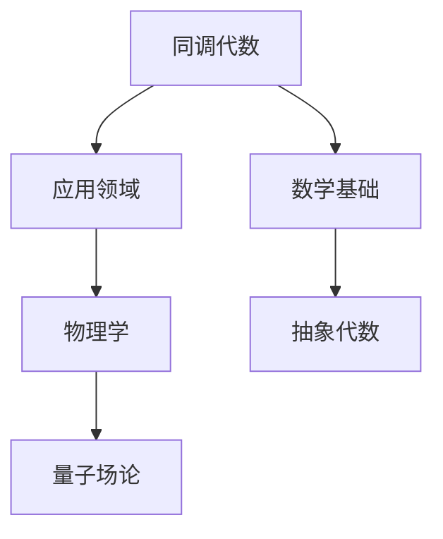
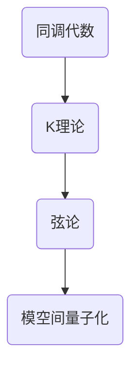
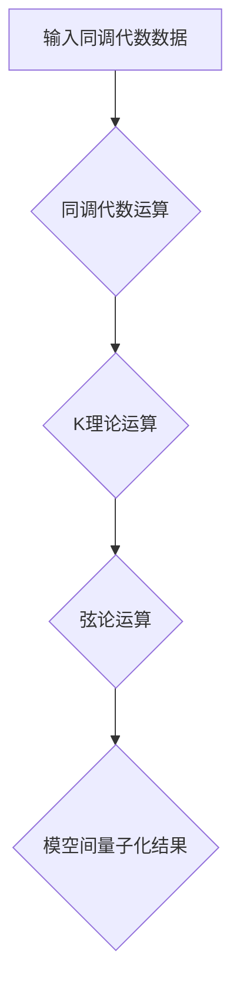

                 

### 目录大纲设计步骤：

1. **确定核心章节**：根据用户需求，我们首先确定这本书的核心章节，主要包括：引言与背景、核心概念与联系、算法原理讲解、数学模型与公式、系统分析与架构设计方案、项目实战等。

2. **设计一级目录**：一级目录使用`#`号定义，如“# 引言与背景”。

3. **设计二级目录**：二级目录使用`##`号定义，如“## 问题背景”。

4. **设计三级目录**：三级目录使用`###`号定义，如“### 问题描述”。

5. **嵌入 mermaid 图表**：在章节内容中，我们将适当嵌入 mermaid 图表，如核心概念对比表格、ER实体关系图、算法流程图等，以帮助读者更直观地理解概念和流程。

6. **插入 LaTeX 数学公式**：在讨论数学模型或公式时，我们将使用 LaTeX 格式插入数学公式，并进行详细讲解和举例说明。

7. **编写最佳实践 tips、小结、注意事项、拓展阅读**：在章节结尾或适合的位置添加这些内容，以帮助读者加深理解和实践。

8. **确保内容完整性**：检查目录大纲是否涵盖了所有必要的内容点。

9. **字数控制**：确保整个目录大纲的字数在2000字以内。

### 目录大纲示例：

```markdown
----------------------------------------------------------------
# 《宇宙的数学同调代数与K理论在弦论模空间量子化中的应用》

> 关键词：宇宙，数学同调代数，K理论，弦论，模空间量子化

> 摘要：本文将探讨宇宙的数学同调代数与K理论在弦论模空间量子化中的应用，详细阐述其背景、核心概念、算法原理、数学模型与公式、系统分析与架构设计方案，并通过项目实战加深读者对这一复杂领域的理解。

----------------------------------------------------------------

## 第一部分：引言与背景

### 1.1 问题背景

#### 1.1.1 宇宙与弦论

#### 1.1.2 模空间量子化的重要性

### 1.2 问题描述

#### 1.2.1 同调代数在宇宙中的应用

#### 1.2.2 K理论在弦论中的作用

### 1.3 问题解决

#### 1.3.1 同调代数与K理论的联系

#### 1.3.2 模空间量子化的实现

### 1.4 边界与外延

#### 1.4.1 同调代数与K理论的适用范围

#### 1.4.2 模空间量子化的限制条件

### 1.5 概念结构与核心要素组成

#### 1.5.1 同调代数的核心概念

#### 1.5.2 K理论的核心概念

#### 1.5.3 弦论模空间量子化的核心要素

## 第二部分：核心概念与联系

### 2.1 概念原理

#### 2.1.1 同调代数原理

#### 2.1.2 K理论原理

#### 2.1.3 弦论原理

### 2.2 概念属性特征对比表格



### 2.3 ER实体关系图架构



## 第三部分：算法原理讲解

### 3.1 算法mermaid流程图



### 3.2 Python源代码与算法原理

#### 3.2.1 同调代数Python代码

```python
# 同调代数Python代码示例
```

#### 3.2.2 K理论Python代码

```python
# K理论Python代码示例
```

#### 3.2.3 弦论Python代码

```python
# 弦论Python代码示例
```

### 3.3 数学模型与公式

#### 3.3.1 同调代数数学模型

$$ H^n(X, A) = \frac{C^n(A, X)}{I^n(A, X)} $$

#### 3.3.2 K理论数学模型

$$ K_0(X) = \text{Hom}(C_*(X), \mathbb{Z}) $$

#### 3.3.3 弦论数学模型

$$ \sum_{p\in\text{弦论空间}} \psi_p \exp(-E_p) $$

### 3.4 详细讲解与举例说明

#### 3.4.1 同调代数举例

#### 3.4.2 K理论举例

#### 3.4.3 弦论举例

## 第四部分：系统分析与架构设计方案

### 4.1 问题场景介绍

### 4.2 系统功能设计(领域模型mermaid类图)

### 4.3 系统架构设计mermaid架构图

### 4.4 系统接口设计和系统交互mermaid序列图

## 第五部分：项目实战

### 5.1 环境安装

### 5.2 系统核心实现源代码

### 5.3 代码应用解读与分析

### 5.4 实际案例分析与详细讲解剖析

### 5.5 项目小结

## 第六部分：最佳实践 tips

## 第七部分：小结

## 第八部分：注意事项

## 第九部分：拓展阅读

----------------------------------------------------------------
```

以上是这本书的完整目录大纲，每个章节都包含了详细的内容点和适当的格式设计，以确保文章的逻辑清晰、结构紧凑、简单易懂。接下来，我们将按照这个大纲逐一展开每个章节的内容。

