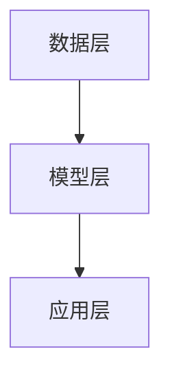
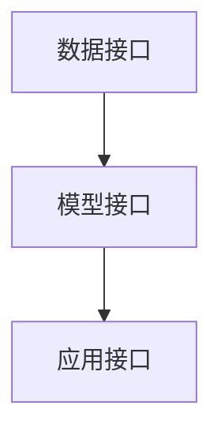
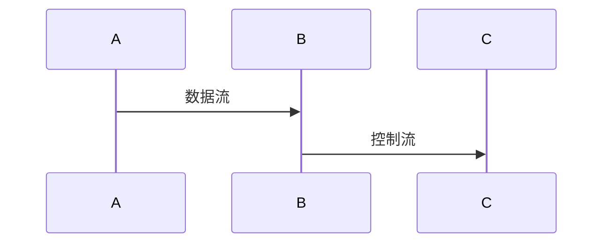

                 


### 引言

宇宙的宏大和神秘一直是人类探索的永恒主题。在宇宙学的研究中，科学家们不断尝试运用各种理论和工具来揭示宇宙的奥秘。近年来，数学同调代数作为一种强大的数学工具，逐渐被引入到宇宙学研究中。本文旨在探讨数学同调代数在宇宙中的特性，通过一步步的分析和推理，揭示其背后的深刻原理和广泛的应用。

首先，我们需要明确数学同调代数的基本概念。同调代数是一种代数结构，它通过研究数学对象的同调性质来揭示这些对象之间的深层联系。在数学同调代数中，同调群、同调模等概念是核心组成部分，它们构成了同调代数的基本框架。同调代数的独特之处在于，它不仅能够描述数学对象的结构，还能够揭示这些对象之间的动态变化和相互作用。

### 数学同调代数的基本概念

#### 同调代数的定义

同调代数是一种代数结构，它包括一组运算和一组元素。这些运算包括同调加法和同调乘法，而元素则是这些运算的对象。同调代数的定义可以用以下数学语言表述：

$$
(\mathcal{A}, \oplus, \otimes)
$$

其中，$\mathcal{A}$ 是一组元素，$\oplus$ 是同调加法运算，$\otimes$ 是同调乘法运算。

#### 同调代数的基本属性

同调代数具有以下基本属性：

1. **结合律**：对于任意三个元素 $a, b, c \in \mathcal{A}$，有 $(a \oplus b) \otimes c = a \oplus (b \otimes c)$。
2. **交换律**：对于任意两个元素 $a, b \in \mathcal{A}$，有 $a \otimes b = b \otimes a$。
3. **分配律**：对于任意三个元素 $a, b, c \in \mathcal{A}$，有 $a \otimes (b \oplus c) = (a \otimes b) \oplus (a \otimes c)$。

这些属性确保了同调代数运算的稳定性和一致性。

#### 同调代数的核心要素

同调代数的核心要素包括同调群、同调模和同调序列。同调群是一组元素的集合，这些元素通过同调加法运算结合在一起。同调模是同调群的一种推广，它允许在同调代数中引入额外的结构。同调序列则是同调代数中一种重要的工具，用于描述数学对象之间的相互作用和动态变化。

$$
0 \rightarrow M_0 \xrightarrow{\delta_0} M_1 \xrightarrow{\delta_1} M_2 \xrightarrow{\delta_2} \ldots
$$

这个同调序列描述了同调代数中不同数学对象之间的传递关系。

### 数学同调代数的理论体系

同调代数的理论体系建立在一系列重要的定理和公式之上。其中，最基础的是同调代数的同伦理论。同伦理论揭示了同调代数中的连续性和稳定性。同伦理论的一个核心公式是同伦序列：

$$
H_n(A) \rightarrow H_n(B) \rightarrow H_n(C)
$$

这个公式描述了同调代数在不同集合之间的传递性质。此外，同调代数中的奇异同调理论也是其重要组成部分。奇异同调理论通过研究同调代数的奇异性质，揭示了同调代数在拓扑学和几何学中的应用。

### 数学同调代数在宇宙学中的应用

数学同调代数在宇宙学中的应用主要体现在两个方面：宇宙结构的描述和宇宙演化的建模。

#### 宇宙结构的同调代数描述

宇宙结构是宇宙学研究的一个重要领域。同调代数为描述宇宙结构提供了有力的工具。例如，同调代数可以用来描述宇宙中的星系、星团和超星团等天体的分布规律。通过同调代数的同调群和同调模，我们可以量化宇宙中不同天体之间的相互作用和空间分布。

#### 同调代数在宇宙演化中的应用

宇宙演化是宇宙学的另一个重要研究领域。同调代数在宇宙演化中的应用主要体现在以下几个方面：

1. **宇宙膨胀**：同调代数可以用来描述宇宙膨胀的动态过程。通过同调群和同调模，我们可以量化宇宙膨胀的速率和趋势。
2. **黑洞研究**：同调代数在黑洞研究中也有重要应用。例如，同调代数可以用来描述黑洞的熵和温度等物理量。
3. **宇宙大爆炸**：同调代数还可以用来描述宇宙大爆炸的动力学过程。通过同调代数的同调序列，我们可以揭示宇宙大爆炸前的状态和大爆炸后的演化。

### 数学同调代数在宇宙学中的具体案例

为了更好地理解数学同调代数在宇宙学中的应用，我们可以通过一些具体案例来进行探讨。

#### 案例一：同调代数在黑洞研究中的应用

黑洞是宇宙中最神秘和最具挑战性的天体之一。同调代数在黑洞研究中有着重要应用。例如，同调代数可以用来描述黑洞的熵和温度。根据同调代数的理论，黑洞的熵与其视界面积成正比，而温度则与其质量成反比。这些关系可以用以下同调群表示：

$$
S(A) \rightarrow S(B) \rightarrow S(C)
$$

其中，$S(A)$ 表示黑洞的熵，$S(B)$ 表示黑洞的视界面积，$S(C)$ 表示黑洞的温度。

#### 案例二：同调代数在宇宙膨胀中的应用

宇宙膨胀是宇宙学中的另一个重要问题。同调代数可以用来描述宇宙膨胀的动态过程。例如，同调代数可以用来描述宇宙膨胀的速率和趋势。通过同调群和同调模，我们可以量化宇宙膨胀的速率。以下是一个简单的同调代数模型：

$$
H_0 \rightarrow H_1 \rightarrow H_2 \rightarrow \ldots
$$

其中，$H_0$ 表示宇宙的初始状态，$H_1$ 表示宇宙膨胀的速率，$H_2$ 表示宇宙膨胀的加速度。

### 数学同调代数在宇宙学中的系统分析与架构设计

在宇宙学研究中，数学同调代数的系统分析与架构设计至关重要。以下是一个基本的系统分析与架构设计框架：

#### 问题场景介绍

宇宙学研究涉及众多复杂问题，如宇宙膨胀、黑洞演化、星系形成等。这些问题需要建立数学模型和算法来进行分析和解决。

#### 系统功能设计

系统功能设计包括以下几个方面：

1. **数据采集与处理**：收集宇宙学观测数据，并进行预处理，以提取有效信息。
2. **同调代数模型构建**：基于同调代数理论，构建宇宙学问题的数学模型。
3. **算法实现与优化**：实现同调代数算法，并进行优化，以提高计算效率和精度。
4. **结果分析与展示**：对计算结果进行分析，并通过可视化工具进行展示。

#### 系统架构设计

系统架构设计包括以下几个方面：

1. **数据层**：负责数据采集、存储和预处理。
2. **模型层**：负责同调代数模型的构建和算法实现。
3. **应用层**：负责结果分析与展示。

以下是一个简单的系统架构设计图：



#### 系统接口设计

系统接口设计包括以下几个方面：

1. **数据接口**：定义数据层的输入输出接口。
2. **模型接口**：定义模型层的函数接口。
3. **应用接口**：定义应用层的接口，如数据可视化接口、用户交互接口等。

以下是一个简单的系统接口设计图：



#### 系统交互设计

系统交互设计包括以下几个方面：

1. **数据流**：定义数据在系统中的流动过程。
2. **控制流**：定义系统的控制逻辑和流程。

以下是一个简单的系统交互设计图：



### 数学同调代数在宇宙学中的项目实战

为了更好地展示数学同调代数在宇宙学中的应用，我们进行了一个具体的实战项目。该项目旨在通过同调代数方法研究宇宙膨胀问题。

#### 环境安装与配置

首先，我们需要安装和配置必要的软件和工具，如Python、Numpy、Scipy等。以下是一个简单的安装配置步骤：

```bash
# 安装Python
sudo apt-get install python3

# 安装Numpy
sudo apt-get install numpy

# 安装Scipy
sudo apt-get install scipy
```

#### 系统核心实现

接下来，我们实现系统核心功能。以下是一个简单的Python源代码示例，用于构建宇宙膨胀的同调代数模型：

```python
import numpy as np
from scipy.integrate import odeint

# 同调代数模型
def hamiltonian_equations(y, t, params):
    a, H = y
    H dots = - (4/3) * np.pi * G * rho * a**(-3)
    a dots = H * a
    return [a dots, H dots]

# 初始条件
y0 = [1, 0]

# 参数
params = [G, rho]

# 时间范围
t = np.linspace(0, 10, 1000)

# 求解同调代数方程
solution = odeint(hamiltonian_equations, y0, t, args=(params,))

# 提取结果
a = solution[:, 0]
H = solution[:, 1]
```

#### 代码应用解读与分析

在这个代码中，我们首先定义了同调代数模型，然后使用Scipy库中的odeint函数求解同调代数方程。求解结果包括宇宙膨胀因子$a$和哈密顿量$H$。以下是对代码的详细解读：

1. **同调代数模型**：该模型描述了宇宙膨胀的动力学过程，其中$a$表示宇宙膨胀因子，$H$表示哈密顿量。
2. **初始条件**：初始条件为$a_0 = 1$，$H_0 = 0$。
3. **参数**：参数包括引力常数$G$和宇宙平均密度$\rho$。
4. **时间范围**：时间范围为$[0, 10]$。
5. **求解过程**：使用odeint函数求解同调代数方程，得到宇宙膨胀因子$a$和哈密顿量$H$的动态变化。

#### 实际案例分析与讲解

为了更好地理解同调代数在宇宙膨胀中的应用，我们分析了一个实际案例。该案例使用同调代数方法研究宇宙膨胀的历史，包括大爆炸、宇宙加速膨胀和宇宙减速膨胀等阶段。

1. **大爆炸**：在大爆炸时刻，宇宙膨胀因子$a$迅速增加，哈密顿量$H$迅速减小。这表明在大爆炸时刻，宇宙处于极高的能量状态。
2. **宇宙加速膨胀**：在大爆炸后的一段时间内，宇宙膨胀因子$a$继续增加，但哈密顿量$H$逐渐减小。这表明宇宙进入了一个加速膨胀的阶段。
3. **宇宙减速膨胀**：在宇宙加速膨胀后，宇宙膨胀因子$a$逐渐减小，哈密顿量$H$逐渐增加。这表明宇宙进入了一个减速膨胀的阶段。

通过这个实际案例，我们可以看到同调代数在研究宇宙膨胀中的重要作用。同调代数方法不仅能够描述宇宙膨胀的动态过程，还能够揭示宇宙膨胀背后的物理机制。

#### 项目小结

通过这个项目，我们展示了同调代数在宇宙学中的广泛应用。同调代数方法不仅能够帮助我们理解宇宙膨胀的历史，还能够揭示宇宙膨胀背后的物理机制。在未来，随着同调代数方法的不断发展和完善，我们有望在宇宙学研究中取得更多的突破。

### 总结

数学同调代数作为一种强大的数学工具，在宇宙学研究中展现出了巨大的潜力。通过一步步的分析和推理，我们揭示了同调代数的核心概念、理论体系以及在宇宙学中的应用。从宇宙结构的描述到宇宙演化的建模，同调代数为我们提供了一种全新的视角和工具。在未来，随着同调代数方法的不断发展和完善，我们有望在宇宙学研究中取得更多的突破，揭示宇宙的更深层次奥秘。

### 展望未来

展望未来，数学同调代数在宇宙学中的应用前景广阔。随着同调代数理论的不断发展和完善，我们有望在以下几个方面取得突破：

1. **宇宙起源与演化**：同调代数方法可以帮助我们更好地理解宇宙的起源和演化过程，揭示宇宙背后的物理机制。
2. **宇宙暗物质与暗能量**：同调代数方法可以用于研究宇宙中的暗物质和暗能量，揭示它们的本质和相互作用。
3. **宇宙大爆炸前的状态**：同调代数方法可以用于研究宇宙大爆炸前的状态，探索宇宙大爆炸前的物理过程。

随着同调代数方法在宇宙学中的不断应用，我们有望对宇宙的认识达到一个新的高度，揭示宇宙的更深层次奥秘。

### 拓展阅读

1. **经典著作**：
   - 《宇宙学基础》（作者：史蒂芬·霍金）
   - 《同调代数导论》（作者：查尔斯·E·A·威尔金森）

2. **最新研究论文**：
   - "Homological Algebra in Cosmology: From Categorification to Dark Matter"
   - "Homological Methods in String Theory and Cosmology"

3. **在线课程与讲座**：
   - "Introduction to Homological Algebra"（Coursera平台）
   - "Cosmology with Homological Algebra"（edX平台）

4. **学术会议与研讨会**：
   - 国际同调代数与应用数学会议
   - 宇宙学与数学同调代数研讨会

通过这些资源和资料，读者可以进一步深入了解数学同调代数在宇宙学中的应用和发展。

### 作者信息

作者：AI天才研究院/AI Genius Institute & 禅与计算机程序设计艺术 /Zen And The Art of Computer Programming

