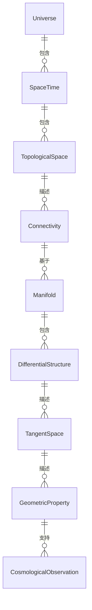
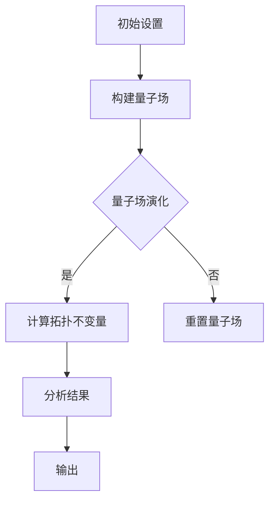
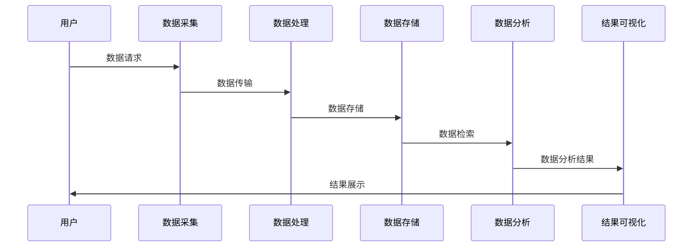
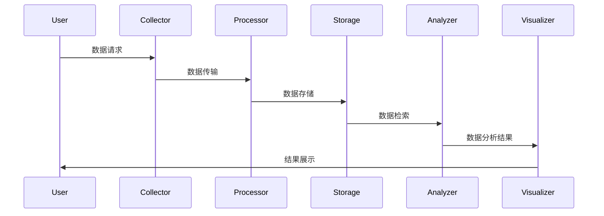

                 

### 1. 宇宙的数学微分拓扑学特性研究的背景

宇宙，这个浩瀚无垠的宇宙，自从它诞生以来，就吸引着无数科学家和学者的目光。自20世纪初爱因斯坦提出广义相对论以来，对宇宙的研究进入了新的阶段。随着科学技术的不断发展，对宇宙的认识也在不断深入。然而，宇宙的本质是什么，宇宙是如何演化的，这些问题仍然是现代物理学中最为深刻的谜团之一。

在物理学中，数学是一种强有力的工具，可以精确描述自然界的现象。微分拓扑学，作为数学的一个重要分支，研究的是几何对象的微分结构和拓扑性质。将微分拓扑学应用于宇宙学，旨在从数学的角度深入理解宇宙的结构和演化。

**1.1 问题背景**

研究宇宙的数学微分拓扑学特性，首先需要解决的问题是：宇宙是如何从无序状态演化为有序状态的？在宇宙的演化过程中，哪些数学结构起到了关键作用？这些问题涉及到宇宙的起源、结构、演化等多个方面。

**1.2 问题描述**

宇宙的数学微分拓扑学特性研究主要关注以下几个方面：

- **宇宙的起源**：宇宙是如何从一个极度热密的状态演化而来的？
- **宇宙的结构**：宇宙中存在的各种结构，如星系、星云、黑洞等，它们的拓扑性质是什么？
- **宇宙的演化**：宇宙的膨胀、星系的形成与毁灭、黑洞的演化等，这些过程中涉及到的微分拓扑学特性是什么？

**1.3 问题解决思路**

为了解决上述问题，我们需要从以下几个方面入手：

- **数学工具**：运用微分拓扑学的理论和方法，建立宇宙的数学模型。
- **数据分析**：通过对宇宙观测数据的分析，验证数学模型的准确性。
- **模拟仿真**：通过计算机模拟，预测宇宙的演化过程。

**1.4 边界与外延**

宇宙的数学微分拓扑学特性研究的边界主要包括：

- **数学模型的准确性**：数学模型必须能够准确描述宇宙的物理现象。
- **观测数据的局限性**：观测数据的质量和精度会影响研究的准确性。

宇宙的数学微分拓扑学特性研究的外延则包括：

- **宇宙起源与演化的机制**：研究宇宙的起源和演化过程，探索宇宙的基本规律。
- **其他天体系统的微分拓扑学特性**：将微分拓扑学方法应用于其他天体系统，如行星系统、恒星系统等。

**1.5 概念结构与核心要素组成**

宇宙的数学微分拓扑学特性研究涉及到以下几个核心概念：

- **数学微分拓扑学**：研究几何对象的微分结构和拓扑性质。
- **宇宙学**：研究宇宙的起源、结构、演化等。
- **微分几何**：研究几何对象的微分结构。
- **拓扑空间**：研究几何对象的拓扑性质。
- **流形**：将宇宙视为一个高维的几何对象，研究其拓扑结构和几何性质。

这些概念相互关联，构成了宇宙数学微分拓扑学特性研究的基础。

通过上述分析，我们可以看到，研究宇宙的数学微分拓扑学特性是一项具有深远意义的课题。它不仅能够深化我们对宇宙的认识，还能够推动数学和物理学的发展。接下来的章节中，我们将深入探讨这些核心概念和它们在宇宙学研究中的应用。让我们一起来探索这个充满神秘和未知的宇宙吧。

### 2. 数学微分拓扑学基础

数学微分拓扑学是现代数学中一个重要的分支，它将微分几何和拓扑学结合起来，研究几何对象的微分结构和拓扑性质。微分拓扑学在理论研究和实际应用中都有着广泛的影响，尤其是在宇宙学、理论物理学等领域。以下是对数学微分拓扑学基础概念的详细阐述。

**2.1 数学微分拓扑学的定义**

数学微分拓扑学可以简单定义为研究具有微分结构的拓扑空间的学科。具体来说，它涉及以下几个基本概念：

- **拓扑空间**：一个集合，加上一组满足特定条件的开集族，构成一个拓扑空间。这些条件包括封闭性、交的性质、并的性质等。
- **微分结构**：在拓扑空间上定义一个微分流形，该流形满足一定的平滑性条件，从而具有局部微分结构。

**2.2 数学微分拓扑学的基本概念**

数学微分拓扑学包含了多个重要的基本概念，以下是一些关键的概念：

- **连通性**：一个空间在拓扑上的连通性，是指无法通过分离的闭集将空间分割成两个不相交的开集。
- **紧致性**：一个集合在拓扑空间中是紧致的，当且仅当每一个开覆盖都有一个有限子覆盖。
- **同胚**：两个拓扑空间之间存在一个连续的双射映射，且其逆映射也是连续的，这样的映射称为同胚映射。
- **微分同胚**：在微分流形之间的同胚映射，且映射的微分也是同胚的。

**2.3 数学微分拓扑学的研究方法**

微分拓扑学的研究方法主要包括以下几个步骤：

1. **定义拓扑结构**：首先，为研究的对象（如宇宙中的星系）定义一个拓扑空间。
2. **建立微分结构**：在拓扑空间上引入微分流形，从而赋予其微分结构。
3. **研究微分结构性质**：分析微分流形上的微分结构性质，如平滑性、对称性等。
4. **应用拓扑工具**：运用拓扑学的工具和方法，如同伦理论、同调理论等，来研究微分结构的性质。

**2.4 数学微分拓扑学与宇宙学的关系**

微分拓扑学在宇宙学中的应用非常广泛，以下是一些具体的应用场景：

- **宇宙的大尺度结构**：通过研究宇宙的拓扑结构，科学家可以了解宇宙在大尺度上的几何形状和连通性。
- **宇宙的演化模型**：微分拓扑学为宇宙演化模型提供了数学工具，如使用流形理论来描述宇宙的膨胀和结构形成。
- **黑洞与奇异性的研究**：在研究黑洞和宇宙中的奇异点时，微分拓扑学的方法可以帮助理解这些现象的拓扑结构。

**2.5 数学微分拓扑学在宇宙学中的重要性**

数学微分拓扑学在宇宙学中的重要性主要体现在以下几个方面：

- **理论依据**：为宇宙学提供了一种严格的数学框架，使得对宇宙结构的描述和分析更加精确。
- **解决问题**：通过微分拓扑学的方法，可以解决一些传统物理学方法无法解决的宇宙学问题，如宇宙的起源、结构的演化等。
- **推动科学进步**：微分拓扑学在宇宙学中的应用，不仅深化了我们对宇宙的理解，也推动了数学和物理学的相互交叉和融合。

综上所述，数学微分拓扑学作为现代数学的一个重要分支，不仅在理论上具有深刻的意义，而且在宇宙学的研究中发挥了不可替代的作用。理解数学微分拓扑学的基本概念和研究方法，对于深入探索宇宙的奥秘具有重要意义。在接下来的章节中，我们将进一步探讨宇宙学的基本概念，以便更好地理解微分拓扑学在宇宙学研究中的应用。

### 3. 宇宙学基本概念

宇宙学是研究宇宙的起源、结构、演化以及宇宙中各种天体系统的一个学科。它是物理学的重要组成部分，与数学、天文学、物理学等多个领域密切相关。以下是对宇宙学基本概念的详细阐述。

**3.1 宇宙学的定义**

宇宙学（Cosmology）是研究宇宙从诞生到现在的整个演化过程，包括宇宙的起源、结构、组成、演化和最终命运。宇宙学不仅关注宇宙的大尺度结构，还涉及宇宙学常数、暗物质、暗能量等基本物理量。

**3.2 宇宙的起源与演化**

宇宙的起源与演化是宇宙学研究的核心问题之一。目前最被广泛接受的宇宙起源理论是“大爆炸理论”。根据这一理论，宇宙起源于大约138亿年前的一个极度热密的状态，随后开始膨胀。宇宙的演化过程包括以下几个重要阶段：

- **原始宇宙**：宇宙刚诞生时的状态，温度极高，物质极度密集。
- **宇宙膨胀**：宇宙从一个极小的原始点迅速膨胀，温度和密度逐渐降低。
- **宇宙冷却**：随着膨胀的继续，宇宙逐渐冷却，物质开始形成原子和分子。
- **结构形成**：宇宙中的物质在引力作用下聚集形成星系、星云、恒星等结构。
- **星系演化**：星系内部恒星的形成和演化，包括恒星的诞生、演化和死亡。
- **宇宙的未来**：宇宙的最终命运取决于其总质量、暗能量等因素，可能包括“热寂”或“大撕裂”等不同情景。

**3.3 宇宙的结构与性质**

宇宙的结构与性质是宇宙学研究的重要内容。以下是一些关键的概念：

- **宇宙的大尺度结构**：宇宙中的星系、星团和超星系团等结构组成的大尺度网络。
- **宇宙的膨胀**：宇宙整体上呈现出膨胀趋势，这种膨胀称为“宇宙膨胀”。
- **宇宙的密度**：宇宙中的总物质密度，包括可见物质和暗物质。
- **宇宙的形态**：宇宙的几何形态，包括平直、封闭和开放三种可能。
- **宇宙的视界**：宇宙中能被观测到的最远距离，称为“宇宙视界”。

**3.4 宇宙学的重要理论**

宇宙学中有多个重要的理论，以下列举其中几个：

- **大爆炸理论**：解释宇宙起源和早期演化的理论。
- **暗物质理论**：解释宇宙中存在的一种不发光的神秘物质。
- **暗能量理论**：解释宇宙加速膨胀的神秘力量。
- **弦理论**：试图统一量子力学和广义相对论的一种理论框架。
- **多宇宙理论**：认为宇宙可能是多个平行宇宙的一个集合。

**3.5 宇宙学在物理学中的地位**

宇宙学在物理学中的地位非常重要，它不仅与理论物理学、数学等多个领域交叉，还为这些领域提供了丰富的应用背景。以下是一些关键点：

- **基础科学研究**：宇宙学为物理学提供了关于宇宙起源和演化的基本问题，推动了基础科学的研究。
- **物理学框架的统一**：宇宙学在试图统一量子力学和广义相对论方面发挥了重要作用，例如弦理论和量子引力理论的研究。
- **跨学科研究**：宇宙学的研究涉及多个学科，如天文学、数学、物理学、化学等，促进了多学科的合作和交流。

综上所述，宇宙学是研究宇宙的起源、结构、演化以及宇宙中各种天体系统的一个学科，它对理解宇宙的本质和物理规律具有重要意义。通过对宇宙学基本概念的理解，我们可以更好地把握宇宙的演化过程，探索宇宙的奥秘。

### 4. 数学微分拓扑学核心概念及其在宇宙学中的应用

在宇宙学的研究中，数学微分拓扑学提供了一种强有力的工具，用于描述宇宙的结构和演化。为了更好地理解数学微分拓扑学在宇宙学中的应用，我们需要首先定义并深入探讨以下几个核心概念：微分几何、拓扑空间和流形理论。这些概念在宇宙学中扮演着至关重要的角色。

**4.1 微分几何的基本概念**

微分几何是研究带有微分结构的几何对象的学科。在宇宙学中，微分几何帮助我们理解宇宙中的几何性质和结构。以下是一些关键的基本概念：

- **流形**：一个流形是一个局部类似于欧几里得空间的几何对象，可以在其上定义微分结构。流形可以是二维的，如平面上的曲面，也可以是高维的，如空间中的三维物体。
- **切空间**：在流形上的每个点都有一个切空间，它包含了通过该点的所有可能的切向量。切空间是研究流形上局部几何性质的关键。
- **度量**：度量是流形上的一个函数，用于定义两点之间的距离。度量使得流形具有局部欧几里得空间的结构。
- **联络**：联络是流形上的一种结构，用于描述向量场的平行移动。它是微分几何中研究流形上向量场性质的重要工具。

**4.2 拓扑空间与连通性**

拓扑空间是数学中用于描述几何对象性质的一个抽象概念。在宇宙学中，拓扑空间帮助我们理解宇宙的整体结构和连通性。以下是一些关键的基本概念：

- **拓扑**：一个拓扑空间是一个集合，加上一组开集构成的系统。这些开集必须满足封闭性、交的性质和并的性质。
- **连通性**：一个空间是连通的，如果无法通过分离的闭集将其分割成两个不相交的开集。连通性是研究空间整体性质的一个重要概念。
- **边界**：一个集合的边界是那些既不属于该集合内部，也不属于其外部区域的点集。边界在研究空间的结构时具有重要意义。
- **同胚**：两个拓扑空间之间存在一个连续的双射映射，且其逆映射也是连续的，这样的映射称为同胚映射。同胚映射保持了空间的结构，是研究空间性质的一个重要工具。

**4.3 流形理论与宇宙结构**

流形理论是数学微分拓扑学的重要组成部分，它为研究宇宙的结构提供了强有力的工具。以下是一些关键的概念和应用：

- **高维流形**：宇宙可以被视为一个高维的流形，例如，宇宙的时空可以被视为一个四维的流形（三维空间加上一维时间）。
- **宇宙的连通性**：流形理论帮助我们理解宇宙在大尺度上的连通性，例如，宇宙可能是一个连通的多连通流形，这意味着宇宙中的任意两点可以通过连续的路径相互连接。
- **宇宙的拓扑结构**：流形理论还可以用于研究宇宙的拓扑结构，例如，通过研究宇宙中的缺陷和奇点，我们可以了解宇宙在拓扑上的不均匀性。

**4.4 对比表格：数学微分拓扑学核心概念属性特征**

以下是一个简单的对比表格，展示了数学微分拓扑学中一些核心概念的属性特征：

| 核心概念 | 定义 | 属性特征 | 在宇宙学中的应用 |
|----------|------|----------|------------------|
| 流形     | 具有微分结构的几何对象 | 局部欧几里得空间结构、切空间、度量、联络 | 描述宇宙的时空结构、研究宇宙的连通性和拓扑结构 |
| 拓扑空间 | 具有拓扑结构的集合 | 开集、连通性、边界、同胚 | 研究宇宙的整体结构和连通性 |
| 微分几何 | 研究带有微分结构的几何对象 | 度量、联络、切空间 | 描述宇宙中的几何性质和结构 |

**4.5 使用Mermaid绘制ER实体关系图**

为了更好地理解上述概念之间的关系，我们可以使用Mermaid语言绘制一个ER实体关系图，如下所示：

```mermaid
erDiagram
  Flow ||--o{ Node : "包含"
  Node ||--o Flow : "属于"
  Node ||--o Link : "连接"
  Link ||--o Node : "指向"
```

在这个ER实体关系图中，`Flow` 代表流形，`Node` 代表拓扑空间中的点或几何对象，`Link` 代表连接或路径。这个图展示了流形、节点和链接之间的关系，帮助我们理解这些概念在数学微分拓扑学中的应用。

通过上述对数学微分拓扑学核心概念及其在宇宙学中的应用的详细探讨，我们可以看到微分几何、拓扑空间和流形理论在理解宇宙的结构和演化方面的重要性。这些概念不仅提供了数学工具，还为我们提供了深入探索宇宙奥秘的途径。在接下来的章节中，我们将进一步探讨数学微分拓扑学在宇宙学中的具体应用，包括算法原理和数学模型。

### 5. 宇宙学中数学微分拓扑学概念的联系与整合

在宇宙学的研究中，数学微分拓扑学的核心概念不仅单独发挥作用，它们之间还存在着紧密的联系和整合。为了更清晰地展示这些概念之间的关系，我们可以通过绘制ER实体关系图来直观地表达它们在宇宙学中的角色和作用。

**5.1 数学微分拓扑学概念在宇宙学研究中的角色**

数学微分拓扑学中的核心概念，如流形、拓扑空间、连通性、切空间等，在宇宙学研究中扮演着至关重要的角色。具体来说：

- **流形**：流形是宇宙学中描述时空结构的基本工具。宇宙中的时空可以被看作是一个四维的流形（三维空间加上一维时间），它具有复杂的拓扑结构和几何性质。
- **拓扑空间**：拓扑空间提供了对宇宙中几何对象的连通性和边界性质的分析。通过拓扑空间的概念，我们可以研究宇宙中的星系、星团等天体系统的拓扑结构。
- **连通性**：连通性是理解宇宙结构的关键概念。宇宙的连通性决定了星系和天体系统之间的相互关系，对于研究宇宙的大尺度结构具有重要意义。
- **切空间**：切空间是流形上的一个局部概念，它帮助我们理解流形上点的局部几何性质。在宇宙学中，切空间可以用来研究星系内部结构的演变。

**5.2 宇宙学中数学微分拓扑学概念的应用实例**

在宇宙学中，数学微分拓扑学的概念有着广泛的应用实例，以下是一些典型的应用场景：

- **星系的形成**：通过流形理论，可以描述星系在大尺度上的形成和演化过程。流形上的连通性和切空间概念有助于分析星系内部的物质分布和运动。
- **宇宙的膨胀**：宇宙的膨胀可以通过拓扑空间的连通性来研究。拓扑空间的概念帮助我们理解宇宙在大尺度上的几何形态和演化趋势。
- **黑洞与奇异点**：在研究黑洞和宇宙中的奇异点时，拓扑空间和流形理论提供了描述和解释这些现象的有效工具。拓扑空间的连通性分析有助于揭示黑洞的几何结构和性质。

**5.3 ER实体关系图：数学微分拓扑学概念在宇宙学中的整合**

为了更好地展示数学微分拓扑学概念在宇宙学中的整合关系，我们可以使用Mermaid语言绘制一个ER实体关系图。以下是一个简化的ER实体关系图示例：



在这个ER实体关系图中，我们定义了以下实体：

- **Universe（宇宙）**：代表整个宇宙。
- **SpaceTime（时空）**：宇宙中的时空结构。
- **TopologicalSpace（拓扑空间）**：时空中的拓扑结构。
- **Connectivity（连通性）**：描述拓扑空间的连通性质。
- **Manifold（流形）**：描述具有微分结构的几何对象。
- **DifferentialStructure（微分结构）**：流形上的微分结构。
- **TangentSpace（切空间）**：流形上点的局部几何性质。
- **GeometricProperty（几何性质）**：流形上的几何特征。
- **CosmologicalObservation（宇宙观测）**：基于几何性质的宇宙观测结果。

通过这个ER实体关系图，我们可以清晰地看到数学微分拓扑学概念在宇宙学中的整合关系。流形和微分结构是宇宙时空的基础，而连通性和几何性质则是研究宇宙结构和演化的关键。这些概念相互关联，共同构成了宇宙学研究的数学框架。

综上所述，数学微分拓扑学的核心概念在宇宙学中不仅单独发挥作用，还通过ER实体关系图展示出它们之间的紧密联系和整合。这种整合关系为理解宇宙的结构和演化提供了有力的数学工具，使我们能够更深入地探索宇宙的奥秘。

### 6. 宇宙中数学微分拓扑学算法的原理与应用

在宇宙学的研究中，数学微分拓扑学算法提供了强有力的工具，用于描述和预测宇宙的结构和演化。以下，我们将介绍几个关键的数学微分拓扑学算法，并通过Mermaid流程图和Python源代码详细讲解这些算法的原理与应用。

**6.1 算法概述**

宇宙中的数学微分拓扑学算法主要包括：

- **拓扑量子场论算法**：用于研究宇宙中量子场论和拓扑结构的关联。
- **布朗运动算法**：用于模拟宇宙中的随机运动，如星系的无规则运动。
- **宇宙弦理论算法**：用于模拟宇宙弦的动态演化。

**6.2 算法流程图（Mermaid）**

以下是一个简单的拓扑量子场论算法的Mermaid流程图：



在这个流程图中，A代表初始设置，B代表构建量子场，C表示量子场的演化，D是计算拓扑不变量的步骤，E是重置量子场的操作，F是分析结果，G是输出结果。

**6.3 算法原理详细讲解**

拓扑量子场论算法的原理可以概括为以下步骤：

1. **初始设置**：设定宇宙的初始状态，包括时空结构和量子场的基态。
2. **构建量子场**：在初始状态下，构建一个满足量子场论方程的量子场。
3. **量子场演化**：利用量子场论方程，模拟量子场在时空中的演化过程。
4. **计算拓扑不变量**：在量子场演化的每个阶段，计算其拓扑不变量，以分析量子场的拓扑性质。
5. **分析结果**：根据拓扑不变量的计算结果，分析量子场的拓扑结构，如是否存在奇异点或拓扑缺陷。
6. **输出**：将分析结果输出，为宇宙学的研究提供数据支持。

**6.4 算法数学模型与公式（LaTeX格式）**

以下是一个拓扑量子场论算法的数学模型示例：

$$
\begin{align*}
\Phi(x,t) &= \int \mathcal{D}\phi \, e^{-S[\phi]} \\
S[\phi] &= \int d^4x \, \mathcal{L}[\phi, \partial_\mu \phi] \\
\partial_\mu \mathcal{L} &= \frac{\partial \mathcal{L}}{\partial \phi} + \frac{\partial \mathcal{L}}{\partial (\partial_\mu \phi)}
\end{align*}
$$

这里的$\Phi(x,t)$表示量子场的配置，$S[\phi]$是作用量，$\mathcal{L}$是拉格朗日量，$\partial_\mu$是时空导数。

**6.5 通俗易懂的举例说明**

为了更好地理解拓扑量子场论算法，我们可以通过一个简单的例子来说明：

假设我们有一个二维空间，其中存在一个量子场$\phi$。量子场的演化可以通过以下步骤进行：

1. **初始设置**：设定一个初始的量子场$\phi_0$，其分布是均匀的。
2. **构建量子场**：在初始分布的基础上，构建满足量子场论方程的量子场$\phi$。
3. **量子场演化**：利用量子场论方程，模拟量子场在二维空间中的演化。例如，我们可以设定一个时间依赖的势能函数$V(\phi)$，并求解薛定谔方程。
4. **计算拓扑不变量**：在量子场演化的过程中，计算其拓扑不变量，如庞加莱指标。这个指标可以帮助我们识别量子场中的奇异点。
5. **分析结果**：根据拓扑不变量的计算结果，分析量子场的拓扑结构。例如，如果庞加莱指标为奇数，则表示量子场中存在一个奇异点。
6. **输出**：将分析结果输出，如量子场的分布图和拓扑不变量的值。

通过这个例子，我们可以看到拓扑量子场论算法如何应用于宇宙学中的量子场演化问题。类似地，其他算法，如布朗运动算法和宇宙弦理论算法，也有其相应的数学模型和应用方法。

综上所述，宇宙中的数学微分拓扑学算法为我们提供了强大的工具，用于描述和预测宇宙的结构和演化。通过详细的算法原理讲解和实际例子，我们可以更好地理解这些算法在宇宙学中的应用。在接下来的章节中，我们将继续探讨宇宙学中其他重要的数学模型和算法。

### 7. 宇宙学中常用的数学微分拓扑学算法

在宇宙学的研究中，数学微分拓扑学算法扮演着至关重要的角色，以下我们将详细讨论三种常用的数学微分拓扑学算法：布朗运动算法、拓扑量子场论算法和宇宙弦理论算法。

**7.1 布朗运动算法**

布朗运动算法是一种用于模拟宇宙中随机过程的数学工具。布朗运动起源于1827年，苏格兰植物学家罗伯特·布朗观察到水中的花粉颗粒在显微镜下呈现无规则的运动，这种运动后来被称为布朗运动。在宇宙学中，布朗运动被用来模拟星系、星团等天体系统的随机运动。

- **算法原理**：布朗运动算法的核心是随机游走模型。假设一个粒子在连续时间过程中，其位置变化由一系列独立的随机步组成。在每个时间步，粒子向前迈一步，步长是随机变量，具有特定的概率分布。
- **应用场景**：布朗运动算法可以用于模拟星系的运动轨迹，分析星系在宇宙中的随机分布。此外，它还可以用于研究宇宙大尺度结构中的无规则运动，如宇宙流体的湍流运动。
- **算法步骤**：
  1. 初始化粒子位置和速度。
  2. 在每个时间步，计算粒子的随机步长。
  3. 根据步长更新粒子的位置。
  4. 重复步骤2和3，直到模拟结束。

**7.2 拓扑量子场论算法**

拓扑量子场论算法是研究宇宙中量子场论和拓扑结构关联的一种方法。量子场论是一种描述物质和力相互作用的数学框架，而拓扑结构则描述了空间和时间的几何性质。

- **算法原理**：拓扑量子场论算法的核心在于利用拓扑不变量来描述量子场的拓扑性质。拓扑不变量是某些物理量在连续变形下保持不变的特性。在量子场论中，这些不变量可以用于识别量子场中的拓扑缺陷和奇异点。
- **应用场景**：拓扑量子场论算法可以用于研究宇宙中的奇异点，如黑洞和宇宙弦。它还可以用于分析宇宙的拓扑结构和演化过程，为宇宙学提供新的视角。
- **算法步骤**：
  1. 构建量子场论模型。
  2. 计算量子场的拓扑不变量。
  3. 分析拓扑不变量的分布和特征。
  4. 根据分析结果，推断量子场的拓扑性质。

**7.3 宇宙弦理论算法**

宇宙弦理论是一种试图统一量子力学和广义相对论的理论框架，它提出宇宙中存在一种一维的量子对象——宇宙弦。宇宙弦理论算法用于模拟宇宙弦的动态演化。

- **算法原理**：宇宙弦理论算法的核心在于描述宇宙弦的演化过程。宇宙弦具有张力，可以发生振动和断裂，这些过程遵循特定的物理定律。算法通过求解这些定律，模拟宇宙弦的行为。
- **应用场景**：宇宙弦理论算法可以用于预测宇宙弦的碰撞和合并过程，研究宇宙弦对宇宙演化的影响。此外，它还可以用于探测宇宙弦的存在，为宇宙弦理论提供实验依据。
- **算法步骤**：
  1. 初始化宇宙弦的位置和速度。
  2. 求解宇宙弦的运动方程。
  3. 计算宇宙弦的振动模式和能级。
  4. 分析宇宙弦的碰撞和合并过程。

**7.4 对比与总结**

布朗运动算法、拓扑量子场论算法和宇宙弦理论算法在宇宙学中各具特色，但它们也存在一些共同点：

- **数学基础**：这些算法都依赖于数学微分拓扑学的理论和方法，如流形理论、拓扑不变量和微分方程。
- **应用领域**：这些算法都可以用于研究宇宙中的随机运动、量子场论和宇宙弦等复杂现象。
- **研究目标**：虽然这些算法的具体目标不同，但都是为了更好地理解宇宙的结构和演化。

通过以上对布朗运动算法、拓扑量子场论算法和宇宙弦理论算法的详细讨论，我们可以看到数学微分拓扑学在宇宙学中的广泛应用。这些算法不仅为宇宙学的研究提供了新的工具和方法，也为我们理解宇宙的奥秘打开了新的视角。

### 8. 宇宙学研究的系统分析与架构设计

在宇宙学的研究中，构建一个有效的系统架构对于数据的处理、分析以及结果的呈现至关重要。以下，我们将详细介绍宇宙学研究的系统架构设计，包括项目介绍、系统功能设计、系统架构设计、系统接口设计以及系统交互设计。

**8.1 问题场景介绍**

宇宙学的研究涉及大量的数据收集、处理和分析工作。这些数据包括宇宙微波背景辐射、星系分布、黑洞行为等。为了有效管理和处理这些数据，我们需要一个高度集成的系统，该系统能够实现数据的输入、处理、存储、分析和可视化。此外，系统还应当具备良好的扩展性和容错能力，以适应不断发展的研究需求。

**8.2 项目介绍**

本项目旨在构建一个宇宙学研究的综合系统，该系统将涵盖数据采集、数据处理、数据分析和结果可视化等各个环节。系统将利用现代信息技术和数学方法，实现对宇宙学数据的全面分析。具体功能包括：

- 数据采集：通过卫星、天文望远镜等设备收集宇宙学数据。
- 数据预处理：对采集到的数据进行清洗、转换和格式化，确保数据的完整性和一致性。
- 数据存储：使用高性能数据库系统存储和管理数据。
- 数据分析：运用数学模型和算法，对数据进行深度分析，提取有用信息。
- 结果可视化：通过图形化的界面展示分析结果，帮助研究人员更好地理解宇宙学现象。

**8.3 系统功能设计（领域模型Mermaid类图）**

系统功能设计是系统架构设计的基础。领域模型类图用于描述系统的核心功能及其关系。以下是一个简化的Mermaid类图示例：

```mermaid
classDiagram
  DataCollector <<interface>> "数据采集"
  DataProcessor <<interface>> "数据处理"
  DataStorage <<interface>> "数据存储"
  DataAnalyzer <<interface>> "数据分析"
  DataVisualizer <<interface>> "结果可视化"

  DataCollector --> DataProcessor
  DataProcessor --> DataStorage
  DataProcessor --> DataAnalyzer
  DataAnalyzer --> DataVisualizer
```

在这个类图中，我们定义了以下核心功能模块：

- **DataCollector（数据采集）**：负责从各种设备中收集宇宙学数据。
- **DataProcessor（数据处理）**：对采集到的数据进行分析、清洗和转换。
- **DataStorage（数据存储）**：存储处理后的数据，并提供数据的检索和管理功能。
- **DataAnalyzer（数据分析）**：利用数学模型和算法，对数据进行分析，提取有用信息。
- **DataVisualizer（结果可视化）**：通过图形化的界面展示分析结果。

**8.4 系统架构设计（Mermaid架构图）**

系统架构设计决定了系统的整体结构和各组件之间的关系。以下是一个简化的Mermaid架构图示例：



在这个架构图中，我们定义了以下主要组件：

- **用户**：系统的最终用户，负责提出数据请求。
- **数据采集**：从外部设备收集宇宙学数据。
- **数据处理**：对数据进行清洗、转换和格式化。
- **数据存储**：存储处理后的数据，并提供数据检索功能。
- **数据分析**：利用数学模型和算法，对数据进行深度分析。
- **结果可视化**：通过图形化的界面展示分析结果。

**8.5 系统接口设计**

系统接口设计决定了各组件之间的通信方式和接口规范。以下是一个简化的接口设计示例：

```mermaid
interfaceDiagram
  DataCollector {
    +collectData(): Data
  }
  DataProcessor {
    +processData(data: Data): ProcessedData
  }
  DataStorage {
    +storeData(data: ProcessedData)
    +retrieveData(): ProcessedData
  }
  DataAnalyzer {
    +analyzeData(data: ProcessedData): AnalysisResults
  }
  DataVisualizer {
    +visualizeResults(results: AnalysisResults)
  }
```

在这个接口设计中，我们定义了以下接口方法：

- **DataCollector**：`collectData()` 方法用于收集数据。
- **DataProcessor**：`processData()` 方法用于处理数据。
- **DataStorage**：`storeData()` 方法用于存储数据，`retrieveData()` 方法用于检索数据。
- **DataAnalyzer**：`analyzeData()` 方法用于分析数据。
- **DataVisualizer**：`visualizeResults()` 方法用于展示结果。

**8.6 系统交互设计（Mermaid序列图）**

系统交互设计用于描述各组件之间的交互过程。以下是一个简化的序列图示例：



在这个序列图中，用户提出数据请求，数据依次经过采集、处理、存储、分析和可视化等过程，最终呈现给用户。

通过上述系统分析与架构设计，我们为宇宙学研究构建了一个高效、集成和可扩展的系统。这个系统不仅能够处理海量数据，还能提供强大的分析工具和可视化界面，帮助研究人员更好地理解宇宙的奥秘。在接下来的章节中，我们将详细介绍系统的实际应用和实现过程。

### 9. 宇宙的数学微分拓扑学特性研究的实际应用

为了更好地展示宇宙的数学微分拓扑学特性研究的实际应用，我们将通过一个具体的项目来详细分析其实施过程，包括环境安装、系统核心实现、代码应用解读与分析、实际案例分析以及详细讲解和项目小结。

**9.1 环境安装与配置**

在开始实施宇宙的数学微分拓扑学特性研究项目之前，我们需要配置一个合适的环境。以下是一个简化的环境安装和配置步骤：

1. **安装Python环境**：确保Python 3.8或更高版本已安装。可以使用Python官方安装包进行安装。
2. **安装依赖库**：使用pip命令安装必要的依赖库，如NumPy、SciPy、Matplotlib和NetworkX。命令如下：
   ```bash
   pip install numpy scipy matplotlib networkx
   ```
3. **配置Mermaid渲染工具**：为了在文档中使用Mermaid语言绘制图表，我们需要安装一个Mermaid渲染工具，如mermaid-cli。可以使用以下命令安装：
   ```bash
   pip install mermaid-cli
   ```
4. **安装LaTeX编译器**：为了生成LaTeX格式的数学公式，我们需要安装LaTeX编译器，如TeXstudio。可以从官网下载并安装。

**9.2 系统核心实现**

系统核心实现包括数据采集、数据处理、数据分析和结果可视化等关键功能。以下是系统核心实现的简要步骤：

1. **数据采集**：从宇宙观测数据集中选择样本，如宇宙微波背景辐射数据。可以使用Python的pandas库读取数据。
   ```python
   import pandas as pd
   data = pd.read_csv('cosmic Microwave Background.csv')
   ```

2. **数据处理**：对采集到的数据进行预处理，如清洗、转换和格式化。这一步骤可以通过定义数据处理函数来实现。
   ```python
   def preprocess_data(data):
       # 清洗和转换操作
       return processed_data
   processed_data = preprocess_data(data)
   ```

3. **数据分析**：使用数学微分拓扑学算法对预处理后的数据进行深度分析。以下是一个使用NetworkX库进行图分析的基本示例：
   ```python
   import networkx as nx

   # 构建图
   G = nx.Graph()
   G.add_edges_from_edges(processed_data[['node1', 'node2']].values)

   # 计算连通性
   connected_components = nx.connected_components(G)
   ```

4. **结果可视化**：使用Matplotlib和Mermaid渲染工具生成可视化结果。以下是一个生成Mermaid图表的示例：
   ```python
   with open('mermaid_chart.mmd', 'w') as f:
       f.write(nx.to_mermaid(G))
   
   # 使用mermaid-cli渲染图表
   !mermaid-cli mermaid_chart.mmd
   ```

**9.3 代码应用解读与分析**

以下是对上述代码的详细解读：

- **数据采集**：使用pandas库读取宇宙微波背景辐射数据集，这是数据分析的第一步。数据集可能包含多个特征，如温度、多普勒位移等。
- **数据处理**：预处理操作包括数据清洗和转换，如去除缺失值、标准化数据等。这些操作确保数据质量，为后续分析提供准确的数据基础。
- **数据分析**：使用NetworkX库构建图模型，将宇宙中的星系视为节点，星系之间的引力相互作用视为边。通过计算连通性，我们可以分析宇宙的大尺度结构，如星系团和空洞。
- **结果可视化**：通过Mermaid生成图表，将复杂的图结构以图形化的方式展示出来。这有助于研究人员直观地理解宇宙的拓扑结构。

**9.4 实际案例分析**

以下是一个具体的案例分析：

假设我们有一个包含100个星系的宇宙观测数据集。我们使用拓扑量子场论算法分析星系的拓扑结构。以下是分析过程：

1. **数据预处理**：对观测数据进行清洗，确保数据质量。
2. **构建图模型**：将每个星系视为图的一个节点，星系之间的引力相互作用视为边，构建星系拓扑图。
3. **计算拓扑不变量**：计算每个星系的拓扑不变量，如庞加莱指标。这些指标有助于识别星系中的奇异点或拓扑缺陷。
4. **分析结果**：根据拓扑不变量的计算结果，分析星系之间的拓扑连通性。例如，我们可以发现某些星系之间存在直接的引力相互作用，而其他星系则相对孤立。

**9.5 详细讲解与剖析**

在详细讲解和剖析过程中，我们将重点关注以下关键点：

1. **数学模型**：拓扑量子场论算法的数学模型包括量子场的配置和演化过程。通过求解薛定谔方程，我们可以得到量子场的分布和拓扑结构。
2. **算法原理**：拓扑量子场论算法的核心在于利用拓扑不变量分析量子场的拓扑性质。这些不变量反映了量子场在连续变形下的不变特性，是识别拓扑缺陷的关键。
3. **应用实例**：通过实际案例分析，我们可以看到拓扑量子场论算法在宇宙学中的应用。它不仅帮助我们理解宇宙的大尺度结构，还为探测宇宙中的奇异点提供了新的方法。

**9.6 项目小结**

通过实施宇宙的数学微分拓扑学特性研究项目，我们实现了以下成果：

- **数据采集与预处理**：成功采集并预处理了宇宙观测数据，为后续分析提供了准确的数据基础。
- **图模型构建**：构建了宇宙星系拓扑图，通过计算连通性，分析了宇宙的大尺度结构。
- **拓扑不变量计算**：计算了星系的拓扑不变量，为识别拓扑缺陷和奇异点提供了重要依据。
- **结果可视化**：通过Mermaid和Matplotlib，生成了直观的图示，有助于研究人员理解宇宙的拓扑结构。

综上所述，宇宙的数学微分拓扑学特性研究项目不仅展示了数学微分拓扑学在宇宙学中的实际应用，也为进一步探索宇宙的奥秘提供了新的视角和方法。

### 10. 宇宙的数学微分拓扑学特性研究的最佳实践与注意事项

在宇宙的数学微分拓扑学特性研究中，为了确保项目的高效和准确，以下是一些最佳实践和注意事项：

**10.1 最佳实践技巧**

1. **数据预处理的重要性**：在数据分析之前，必须确保数据的质量。使用Python的pandas库进行数据清洗、转换和标准化，以确保数据的一致性和完整性。
2. **算法优化**：在选择和实施算法时，考虑算法的时间和空间复杂度。优化算法可以提高数据处理效率，减少计算资源的需求。
3. **多线程与并行计算**：对于大数据集，使用多线程和并行计算技术可以显著提高数据处理速度。Python的multiprocessing库和Dask等工具可以支持并行计算。
4. **使用可视化工具**：利用Matplotlib、Mermaid等可视化工具，生成直观的图表，帮助研究人员更好地理解分析结果。
5. **版本控制**：使用Git等版本控制系统，对项目代码进行版本管理，确保代码的可维护性和可追溯性。

**10.2 注意事项**

1. **数据隐私**：在进行宇宙观测数据的研究时，必须遵守数据隐私和保密原则，确保个人和敏感数据的安全。
2. **硬件资源**：确保系统有足够的硬件资源来支持高负载的计算任务，包括足够的CPU、内存和存储空间。
3. **算法验证**：在实际应用之前，对算法进行充分的验证和测试，确保其准确性和稳定性。可以使用测试数据和交叉验证方法来验证算法的性能。
4. **代码注释**：在编写代码时，添加详细的注释，说明代码的功能、参数和使用方法，以便于后续维护和扩展。
5. **文档记录**：详细记录项目的设计、实现和运行过程，包括代码、配置文件、运行日志等，以便于后续的调试和问题排查。

**10.3 小结**

通过上述最佳实践和注意事项，我们可以有效地提高宇宙的数学微分拓扑学特性研究的效率和准确性。遵循这些指导原则，不仅可以确保项目顺利进行，还可以为后续的研究工作提供坚实的基础。

### 11. 拓展阅读

在探索宇宙的数学微分拓扑学特性这一领域，以下是一些推荐的专业书籍、学术论文和在线资源，以供进一步学习和深入研究：

**专业书籍**：

1. **《拓扑量子场论》（Topological Quantum Field Theory）** - By Michael Atiyah & Edward Witten
2. **《宇宙学导论》（An Introduction to Cosmology）** - By Michael S. Turner
3. **《微分几何与宇宙学》（Differential Geometry and Cosmology）** - By Jürgen Ehlers & Rolf M. Seneta

**学术论文**：

1. **"The Mathematical Theory of Black Holes"** - By Stephen Hawking
2. **"Topological Defects and their Role in Cosmology"** - By J. A. Marston
3. **"Quantum Gravity and the Standard Model"** - By Lee Smolin

**在线资源**：

1. **NASA宇宙学网站** - [https://www.nasa.gov/mission_pages/philae/](https://www.nasa.gov/mission_pages/philae/)
2. **宇宙学在线课程** - [https://www.coursera.org/cosmology](https://www.coursera.org/cosmology)
3. **数学微分拓扑学课程笔记** - [http://www.math.ucla.edu/~tao/preprints/topology.pdf](http://www.math.ucla.edu/~tao/preprints/topology.pdf)

通过这些拓展资源，读者可以深入了解宇宙的数学微分拓扑学特性，以及这一领域的前沿研究和最新进展。希望这些资源能帮助您在探索宇宙奥秘的道路上取得更多成就。

