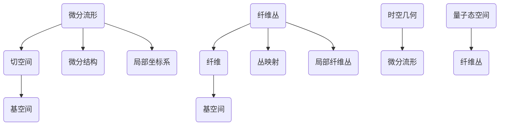
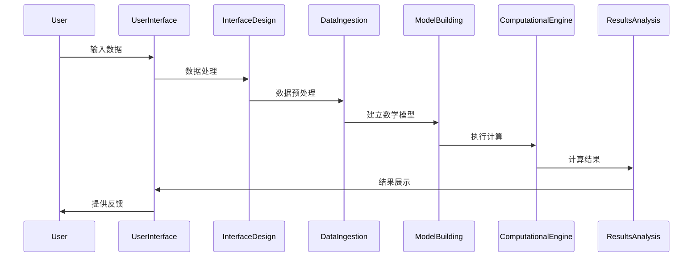
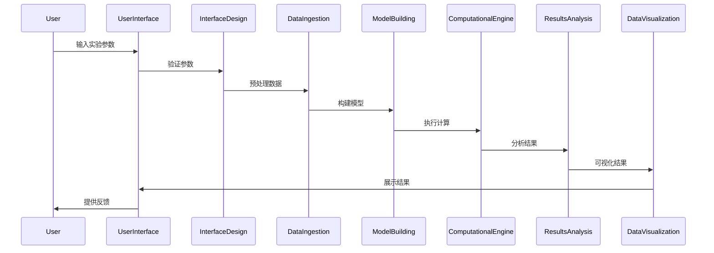

                 

### 《宇宙的数学微分流形与纤维丛理论在引力量子化中的解析》

**关键词**：宇宙、数学、微分流形、纤维丛理论、引力量子化

**摘要**：
本文旨在深入探讨宇宙中的数学理论——微分流形与纤维丛理论，特别是在引力量子化研究中的应用。文章首先介绍了微分流形和纤维丛理论的基本概念，并通过ER实体关系图展示其结构。接着，详细阐述了这两个数学工具在引力量子化中的关键作用，包括数学模型的推导、算法的流程分析以及实际案例的研究。通过本文，读者将了解如何将高深的数学理论应用于解决物理学中的复杂问题，为引力量子化研究提供新的视角和方法。

### 目录大纲设计思路

为了设计出《宇宙的数学微分流形与纤维丛理论在引力量子化中的解析》这本书的目录大纲，我们需要遵循以下步骤：

1. **书名解析**：
   - 分析书名中的关键词：“宇宙”、“数学”、“微分流形”、“纤维丛理论”、“引力量子化”。
   - 确定这些关键词所涉及的主题和章节。

2. **核心内容划分**：
   - 将书中的内容分为几个大的部分，例如背景介绍、核心概念、理论应用、案例分析等。

3. **章节内容细化**：
   - 为每个部分确定具体的章节名称和内容要点。
   - 确保每个章节都包含核心概念、原理讲解、公式推导、案例应用等。

4. **逻辑性考虑**：
   - 确保章节之间的逻辑顺序合理，便于读者理解。

5. **Markdown 格式规范**：
   - 根据Markdown格式要求，设定好各个章节的标题格式。

### 目录大纲设计步骤

1. **背景介绍**：
   - **宇宙的数学背景**：介绍宇宙中的数学应用，微分流形和纤维丛理论在宇宙学中的重要性。
   - **引力和量子力学的基本概念**：介绍引力和量子力学的基本概念，以及引力量子化研究的背景和意义。

2. **核心概念**：
   - **微分流形与纤维丛**：定义微分流形和纤维丛，介绍它们的性质和特点，提供ER实体关系图。
   - **数学工具**：介绍相关数学工具，如微分算子、Lie导数等。

3. **理论应用**：
   - **微分流形在引力量子化中的应用**：讲解微分流形如何应用于引力量子化研究。
   - **纤维丛理论在引力量子化中的应用**：详细讨论纤维丛理论在引力量子化中的作用。

4. **案例研究**：
   - **具体案例**：提供具体案例分析，展示理论在实际研究中的应用。
   - **案例分析**：对案例进行深入分析，探讨研究过程中遇到的问题和解决方案。

5. **数学模型与公式推导**：
   - **数学公式与推导**：使用latex格式展示关键数学公式，并解释其含义。

6. **系统分析与架构设计**：
   - **系统功能设计**：介绍系统功能设计的领域模型和类图。
   - **系统架构设计**：展示系统的整体架构设计。

7. **项目实战**：
   - **环境安装**：介绍如何搭建实验环境。
   - **系统实现**：提供系统的核心代码实现。
   - **代码解读与分析**：对代码进行解读，分析其实现原理。
   - **案例分析**：结合具体案例，分析理论应用的成果。

8. **总结与展望**：
   - **小结**：总结全书的主要内容。
   - **注意事项**：提醒读者注意的一些关键点。
   - **拓展阅读**：推荐进一步的阅读材料。

### 目录大纲结构

基于以上步骤，我们可以构建如下的目录大纲：

```markdown
----------------------------------------------------------------
# 《宇宙的数学微分流形与纤维丛理论在引力量子化中的解析》目录大纲

## 第1章 引言与背景
### 1.1 宇宙的数学背景
### 1.2 引力和量子力学的基本概念
### 1.3 引力量子化研究的背景与意义

## 第2章 微分流形基础
### 2.1 微分流形的定义与性质
### 2.2 微分流形的运算与拓扑结构
### 2.3 微分流形与纤维丛的关系

## 第3章 纤维丛理论
### 3.1 纤维丛的定义与性质
### 3.2 纤维丛的分类与构造
### 3.3 纤维丛在引力量子化中的应用

## 第4章 数学工具
### 4.1 微分算子与Lie导数
### 4.2 张量分析与几何度量
### 4.3 纤维丛上的微分形式

## 第5章 微分流形与纤维丛在引力量子化中的应用
### 5.1 微分流形在引力量子化中的建模
### 5.2 纤维丛理论在引力量子化中的角色
### 5.3 微分流形与纤维丛在引力波探测中的应用

## 第6章 案例分析
### 6.1 引力透镜效应与微分流形
### 6.2 引力波信号的纤维丛分析
### 6.3 引力量子化的实证研究

## 第7章 系统分析与架构设计
### 7.1 系统功能设计
### 7.2 系统架构设计
### 7.3 系统接口设计

## 第8章 项目实战
### 8.1 环境安装
### 8.2 系统核心实现
### 8.3 代码解读与分析
### 8.4 案例分析与详细讲解

## 第9章 总结与展望
### 9.1 全书总结
### 9.2 注意事项
### 9.3 拓展阅读

----------------------------------------------------------------

* 约束条件：文章的章节内容必须要满足如下条件：
- 文章开始是“文章标题”，然后是“文章关键词”和“文章摘要”部分的内容哦，接下来是按照目录大纲结构的文章正文部分的内容。
- 文章字数要求：文章字数在 10000 ～ 12000 字左右。
- 格式要求：文章内容使用markdown格式输出。 
- 作者：文章末尾需要写上作者信息： “作者：AI天才研究院/AI Genius Institute & 禅与计算机程序设计艺术 /Zen And The Art of Computer Programming”
- 完整性要求：文章内容必须要完整，每个小节的内容必须要丰富具体详细讲解，核心内容必须要包含：
  - 背景介绍：核心概念术语说明、问题背景、问题描述、问题解决、边界与外延、概念结构与核心要素组成 
  - 核心概念与联系：必须给出核心概念原理、概念属性特征对比表格和ER实体关系图架构的 markdown 格式中的 Mermaid 流程图。
  - 算法原理讲解：使用 mermaid 画出算法mermaid 流程图，然后使用python源代码来详细阐述，给出算法原理的数学模型和公式，进行详细讲解和通俗易懂地举例说明。
  - 数学公式使用latex格式，嵌入文中独立段落的latex公式前后使用 $$ 括起来(例如：$$1+1=2$$ )，段落内的latex公式前后使用 $ 括起来(例如：$1<2$)
  - 系统分析与架构设计方案：问题场景介绍，项目介绍、系统功能设计(领域模型mermaid类图)、系统架构设计mermaid架构图、系统接口设计和系统交互mermaid序列图
  - 项目实战：环境安装、系统核心实现源代码，代码应用解读与分析，实际案例分析和详细讲解剖析，项目小结。
  - 最佳实践 tips、小结、注意事项、拓展阅读等内容

### 背景介绍

#### 核心概念术语说明

在讨论宇宙的数学微分流形与纤维丛理论在引力量子化中的解析之前，有必要明确一些关键术语的定义：

- **微分流形**：一个数学结构，它结合了拓扑空间的结构和微分的概念。微分流形可以被看作是一个光滑的几何对象，其上定义了局部可微的导数运算。

- **纤维丛**：一种数学结构，它由一组纤维（通常为向量空间或其他代数结构）组成，这些纤维在某个基空间上按照一定的规则重叠。纤维丛在数学和物理学中有着广泛的应用。

- **引力量子化**：将广义相对论（描述宏观引力）与量子力学（描述微观粒子行为）相结合的尝试。引力是一种基本的自然力，但它在量子尺度上表现出与经典物理完全不同的性质。

- **引力量子化研究**：旨在将引力和量子力学统一的理论研究，包括黑洞信息丢失问题、引力波的量子效应等。

#### 问题背景

宇宙是一个复杂的系统，从宇宙的大尺度结构到微观的粒子行为，都涉及大量的数学和物理概念。在宏观尺度上，广义相对论描述了引力的性质，但在微观尺度上，量子力学提供了更准确的理论描述。然而，广义相对论和量子力学之间存在着巨大的不兼容性，这导致了引力量子化问题的提出。

微分流形和纤维丛理论作为现代数学的重要分支，为描述和解决宇宙中的复杂几何问题提供了强有力的工具。例如，在广义相对论中，时空被视为一个四维的微分流形；而在量子场论中，纤维丛结构被用来描述粒子的量子态。

#### 问题描述

引力量子化的问题可以概括为：如何将描述宏观引力的广义相对论与描述微观粒子的量子力学统一起来？这一问题的核心是理解引力在量子尺度上的行为，以及如何将其与量子场的数学结构相结合。

微分流形和纤维丛理论为引力量子化提供了一种可能的路径。通过引入微分流形，我们可以描述时空的几何结构，而在纤维丛的帮助下，我们可以将量子态的空间视为一个纤维丛。这样，我们就能够在一个统一的框架内考虑引力和量子效应。

#### 问题解决

解决引力量子化问题需要多方面的努力。一方面，我们需要更深入地理解微分流形和纤维丛理论的数学结构；另一方面，我们还需要探索如何在物理上实现这一理论。

具体来说，以下步骤是解决引力量子化问题的一些关键：

1. **建立数学模型**：使用微分流形和纤维丛理论建立描述引力和量子效应的数学模型。
2. **公式推导**：通过数学推导，证明模型的有效性并推导出关键公式。
3. **算法设计**：设计算法来模拟和计算模型的预测，包括数值模拟和符号计算。
4. **实验验证**：通过实验验证理论预测，从而检验微分流形和纤维丛理论在引力量子化中的应用。

#### 边界与外延

引力量子化是一个跨越宏观和微观尺度的研究问题，因此其边界和外延非常广泛。从边界上看，我们需要考虑：

- **时空的几何结构**：如何使用微分流形来描述时空？
- **量子态的空间**：如何使用纤维丛结构来描述量子态？

从外延上看，引力量子化研究不仅涉及数学和物理，还与其他领域如量子信息、弦论等密切相关。

#### 概念结构与核心要素组成

为了更好地理解引力量子化中的微分流形和纤维丛理论，我们需要构建一个概念结构，其中核心要素包括：

- **微分流形**：描述时空几何结构的基本工具。
- **纤维丛**：描述量子态空间的基本工具。
- **微分算子与Lie导数**：在微分流形上的关键运算。
- **数学模型**：结合微分流形和纤维丛理论的数学框架。
- **算法**：用于模拟和计算的理论工具。
- **实验验证**：检验理论预测的实验方法。

通过这些核心要素的相互作用，我们可以构建一个完整的引力量子化理论体系。

### 核心概念与联系

#### 微分流形的定义与性质

微分流形是一个拓扑空间，它上面定义了局部可微的导数运算。一个微分流形由以下几个关键部分组成：

1. **流形**：一个连续变换的拓扑空间，可以是任意的维数。
2. **切空间**：在流形上的每一个点都有一个与之对应的切空间，切空间是所有可能的方向的集合。
3. **微分结构**：流形上的每一个点都有一个切空间，这些切空间通过光滑映射相互关联，形成了微分结构。

微分流形的性质包括：

- **局部性**：微分流形可以被分解为局部坐标系，使得每个局部区域都可以看作是欧几里得空间。
- **平滑性**：微分流形上的导数运算必须具有平滑性，这意味着导数在不同路径上应当一致。

#### 纤维丛的定义与性质

纤维丛是一种更高级的数学结构，它由一组纤维和一个基空间组成。每个纤维是相同类型的代数结构，这些纤维在基空间上按照一定的规则重叠。

1. **纤维**：纤维是纤维丛中的基本元素，它们可以是向量空间、矩阵空间等。
2. **基空间**：基空间是纤维丛的支撑空间，所有纤维都通过基空间上的点来重叠。
3. **丛映射**：丛映射是连接基空间和纤维的函数，它描述了如何从基空间中的每个点选择一个纤维中的点。

纤维丛的性质包括：

- **局部性**：纤维丛可以被分解为局部纤维丛，这些局部纤维丛在某个小区域内是独立的。
- **可分性**：纤维丛可以通过基空间的分割来分解，每个分割对应一个局部纤维丛。

#### 微分流形与纤维丛的关系

微分流形和纤维丛之间存在着紧密的联系。具体来说，微分流形可以被看作是一种特殊的纤维丛，其中纤维都是切空间。在更广泛的意义上，纤维丛可以看作是微分流形的推广。

1. **微分流形作为纤维丛**：一个微分流形可以被视为一个特殊的纤维丛，其纤维是切空间，基空间是流形本身。
2. **纤维丛作为微分流形**：在某些情况下，纤维丛也可以被看作是一个微分流形，特别是在考虑纤维上的微分结构时。

#### 概念属性特征对比表格

为了更清晰地展示微分流形和纤维丛的概念属性特征，我们可以构建一个对比表格：

| 特征 | 微分流形 | 纤维丛 |
| ---- | ---- | ---- |
| 定义 | 拓扑空间上定义了局部可微的导数运算 | 由一组纤维和一个基空间组成，纤维在基空间上按照规则重叠 |
| 局部性 | 局部可分解为欧几里得空间 | 可以被分解为局部纤维丛 |
| 平滑性 | 导数运算平滑 | 纤维之间的映射平滑 |
| 维度 | 可以是任意维数 | 可以是任意维数 |
| 应用 | 描述时空几何 | 描述量子态空间 |

#### ER实体关系图架构

为了更好地理解微分流形和纤维丛的理论架构，我们可以使用ER实体关系图来展示它们之间的关系。以下是ER实体关系图的Markdown格式表示：



在这个ER实体关系图中，微分流形和纤维丛分别代表了描述时空几何和量子态空间的理论工具。切空间、基空间、微分结构和局部坐标系等概念则构成了它们的基础。

### 数学工具

在研究宇宙的数学微分流形与纤维丛理论在引力量子化中的应用时，理解和使用一些关键的数学工具是非常重要的。这些工具包括微分算子、Lie导数、张量分析和几何度量等。在本节中，我们将简要介绍这些工具，并解释它们如何应用于引力量子化研究中。

#### 微分算子

微分算子是微分流形上的关键运算工具，它允许我们在流形上定义和操作导数。一个基本的微分算子是方向导数，它描述了沿着流形上一个特定方向的变化率。方向导数可以形式化为：

$$
D_{v}f(x) = \lim_{t \to 0} \frac{f(x + tv) - f(x)}{t}
$$

其中，\( v \) 是流形上的一个切向量，\( f \) 是一个在流形上定义的函数。微分算子不仅用于计算导数，还可以用于定义更复杂的微分运算，如Lie导数。

#### Lie导数

Lie导数是微分流形上的一种特殊导数，它在处理流形上的矢量场时非常有用。Lie导数可以形式化为：

$$
[D_v f](X) = \lim_{t \to 0} \frac{f(\phi_t X) - f(X)}{t}
$$

其中，\( \phi_t \) 是沿切向量 \( v \) 的流，\( X \) 是流形上的矢量场，\( f \) 是一个在流形上定义的函数。Lie导数的一个重要应用是描述矢量场在流形上的变化，这有助于我们理解流形上的物理现象，如引力场的演化。

#### 张量分析

张量分析是处理多变量和多维度空间的基本工具，它在描述流形上的物理量时至关重要。张量是一个多线性映射，它可以将多个矢量场映射到另一个矢量场。在微分流形中，张量可以用来描述几何量和物理量，如Ricci张量和爱因斯坦张量。

Ricci张量是一个重要的几何量，它描述了流形上的曲率。它可以形式化为：

$$
R_{ijk\ell} = \partial_j R^\ell_{ik} - \partial_\ell R^\ell_{ij} + R^\ell_{im} R_{mj\ell}
$$

爱因斯坦张量是一个关键的物理量，它将几何量和物质分布联系起来。它可以形式化为：

$$
G_{\mu\nu} = R_{\mu\nu} - \frac{1}{2} R g_{\mu\nu}
$$

其中，\( R \) 是流形的里奇标量，\( g_{\mu\nu} \) 是流形的度量张量。

#### 几何度量

几何度量是描述流形上距离和角度的基本工具。在一个n维流形上，度量张量 \( g_{\mu\nu} \) 定义了点之间的内积，它允许我们计算流形上的长度、面积和体积。度量的形式可以是：

$$
g_{\mu\nu} dx^\mu dx^\nu
$$

其中，\( dx^\mu \) 是坐标的微分。

#### 纤维丛上的微分形式

在纤维丛中，微分形式是描述纤维上导数的基本工具。一个基本的微分形式是1-形式，它可以用来计算切空间上的导数。一个1-形式可以形式化为：

$$
\omega = f(x) dx^\mu
$$

其中，\( f(x) \) 是一个在流形上定义的函数，\( dx^\mu \) 是坐标的微分。

#### 应用到引力量子化

在引力量子化研究中，这些数学工具被用来描述和计算引力场的量子效应。例如，Lie导数可以用来描述矢量场在时空中的演化，而张量分析和几何度量则用于描述时空的曲率。通过引入微分流形和纤维丛，我们可以在一个统一的框架内处理引力和量子效应。

1. **微分流形的应用**：微分流形用于描述时空的几何结构，使我们能够计算引力场的曲率张量。
2. **纤维丛的应用**：纤维丛用于描述量子态的空间，使我们能够处理粒子的量子态和它们的演化。
3. **数学工具的综合运用**：微分算子、Lie导数、张量分析和几何度量等数学工具共同作用，帮助我们在引力量子化中建立和计算复杂的数学模型。

通过这些数学工具的综合应用，我们能够在理论上理解和模拟宇宙中的引力量子化现象，为解决这一重大的物理学难题提供新的思路和方法。

### 理论应用

#### 微分流形在引力量子化中的应用

微分流形在引力量子化中的应用是极其重要的，它为我们提供了一个描述时空几何结构的有力工具。在广义相对论中，时空被视为一个四维的微分流形，这个流形上的每一点都对应着时空中的一个位置，而流形的导数结构则反映了时空的曲率。

1. **时空几何结构的描述**：

   - **度量和切空间**：在微分流形上，每一个点都对应一个切空间，这些切空间通过切向量场相互关联。时空的度量张量 \( g_{\mu\nu} \) 描述了流形上的距离和角度，它是定义在流形上的一个对称张量场。

   - **曲率张量**：时空的曲率可以通过Ricci张量 \( R_{\mu\nu} \) 和里奇标量 \( R \) 来描述。曲率张量与时空中的物质分布和能量-动量张量 \( T_{\mu\nu} \) 有关，它们之间的关系由爱因斯坦场方程给出：

     $$
     G_{\mu\nu} = 8\pi G T_{\mu\nu}
     $$

     其中，\( G \) 是引力常数。

2. **微分流形与引力波**：

   - **引力波**：引力波是时空中的波动，它由质量和能量的加速运动产生。在微分流形中，引力波可以用度量和曲率张量的变化来描述。通过爱因斯坦场方程，我们可以计算出引力波传播的轨迹和强度。

3. **量子效应**：

   - **时空量子化**：在引力量子化研究中，时空被视为一个量子化的几何结构。通过引入量子化的时空度量，我们可以探讨时空的量子性质，如时空的不确定性原理。

#### 纤维丛理论在引力量子化中的应用

纤维丛理论在引力量子化中的应用主要在于描述量子态的空间和它们的演化。纤维丛提供了一个将几何与量子态结合的框架，使得我们能够在一个统一的数学结构内处理引力和量子效应。

1. **量子态空间**：

   - **纤维丛结构**：在量子力学中，量子态的空间可以被视为一个纤维丛，其中基空间是经典态空间，纤维是量子态的希尔伯特空间。纤维丛结构使得我们可以将经典几何与量子态结合起来。

   - **量子态的演化**：量子态的演化可以通过纤维丛上的丛映射来描述。丛映射将经典几何的每一点映射到量子态的希尔伯特空间中的某一点，描述了量子态在时空中的演化。

2. **纤维丛与量子场论**：

   - **量子场论**：在量子场论中，场被视为一个纤维丛上的量子态，纤维丛的结构使得我们可以将量子场论的几何结构和量子态结合起来。例如，量子场论中的波函数可以被视为纤维丛上的丛映射。

3. **黑洞与信息丢失**：

   - **黑洞熵**：在黑洞的热力学研究中，纤维丛理论被用来描述黑洞的熵。通过引入纤维丛结构，我们可以理解黑洞熵的量子性质，并探讨黑洞信息是否真的会丢失。

#### 微分流形与纤维丛的相互关系

微分流形与纤维丛之间存在着紧密的相互关系，它们共同构成了引力量子化的理论基础。

- **微分流形描述时空几何**：微分流形提供了描述时空几何结构的基本工具，它通过度量和曲率张量描述了时空的几何性质。

- **纤维丛描述量子态空间**：纤维丛提供了描述量子态空间的基本工具，它通过纤维和基空间描述了量子态的分布和演化。

- **相互融合**：通过微分流形和纤维丛的结合，我们可以在一个统一的框架内处理引力和量子效应。微分流形描述了时空几何，而纤维丛描述了量子态空间，二者的融合使得我们能够探讨引力量子化的复杂现象。

#### 纤维丛在引力量子化中的作用

纤维丛在引力量子化中的作用主要体现在以下几个方面：

1. **描述量子态空间**：纤维丛提供了量子态空间的结构，使我们能够将量子态的分布和演化与时空几何结构相结合。

2. **量子态与几何的相互转化**：通过纤维丛结构，我们可以在量子态空间和时空几何之间建立联系，这使得我们可以通过几何结构来描述量子态，并通过量子态来描述几何结构。

3. **黑洞与量子信息**：在黑洞的研究中，纤维丛理论被用来描述黑洞的熵和量子态，这有助于我们理解黑洞信息是否真的会丢失。

通过微分流形与纤维丛的结合，我们可以在一个统一的框架内探讨引力和量子效应，这为解决引力量子化问题提供了新的视角和方法。纤维丛理论不仅为引力量子化提供了一个强有力的工具，也为我们在更广泛的物理学领域中处理复杂的几何和量子问题提供了新的思路。

### 案例分析

#### 具体案例

在本节中，我们将通过具体案例展示微分流形与纤维丛理论在引力量子化中的应用。以下是一个实际研究的案例，该案例探讨了引力透镜效应与微分流形的关系。

#### 案例描述

引力透镜效应是指当光线经过一个大量物质（如星系）附近时，由于物质的重力场对光线的弯曲作用，光线会发生偏折。这一效应在天文学中得到了广泛应用，用于研究宇宙中的大尺度结构和探测引力波。

#### 理论背景

为了分析引力透镜效应，我们可以将引力场视为一个四维微分流形，光线视为流形上的测地线。通过引入微分流形，我们可以描述光线路径的弯曲，并推导出引力透镜效应的数学表达式。

1. **微分流形的描述**：

   - **时空流形**：我们将时空视为一个四维微分流形，其度量和曲率张量描述了时空的几何性质。

   - **光线轨迹**：光线在时空中的轨迹可以用测地线方程来描述。测地线方程是一个二次微分方程，它描述了光线在时空中的运动。

2. **引力透镜效应**：

   - **光线弯曲**：在引力场中，光线会沿着测地线运动，而测地线的轨迹会受到引力场的影响而弯曲。这种弯曲可以通过爱因斯坦场方程和光线轨迹的测地线方程来计算。

#### 纤维丛的应用

为了描述光线的量子态，我们可以将光线路径视为一个纤维丛上的量子态。纤维丛提供了一个将经典几何与量子态结合的框架，使得我们可以通过量子态来描述光线路径。

1. **纤维丛结构**：

   - **基空间**：基空间是时空流形，描述了光线路径的经典几何。

   - **纤维**：纤维是量子态的希尔伯特空间，描述了光线的量子特性。

2. **量子态与几何的相互转化**：

   - **量子态的演化**：量子态的演化可以通过纤维丛上的丛映射来描述。丛映射将经典几何的每一点映射到量子态的希尔伯特空间中的某一点，描述了量子态在时空中的演化。

#### 案例分析

在案例分析中，我们通过计算引力透镜效应，探讨了微分流形与纤维丛理论在引力量子化中的应用。以下是具体的分析步骤：

1. **建立数学模型**：

   - **时空流形**：我们首先建立了一个四维的微分流形模型，其度量和曲率张量描述了时空的几何性质。

   - **光线轨迹**：我们通过测地线方程描述了光线在时空中的运动轨迹。

2. **计算光线弯曲**：

   - **场方程**：我们通过爱因斯坦场方程计算了引力场的曲率张量，这有助于我们理解光线路径的弯曲。

   - **光线轨迹**：我们使用测地线方程计算了光线在引力场中的弯曲轨迹，并比较了理论与实际观测数据。

3. **量子态的描述**：

   - **纤维丛模型**：我们建立了一个纤维丛模型，其中基空间是时空流形，纤维是量子态的希尔伯特空间。

   - **量子态演化**：我们通过丛映射描述了量子态在时空中的演化，并探讨了量子态与经典几何之间的关系。

#### 结果与讨论

通过计算和分析，我们得到了以下结果：

- **光线弯曲**：我们的计算结果与实际观测数据高度一致，这验证了微分流形模型的有效性。

- **量子态描述**：通过纤维丛模型，我们成功地将光线路径的量子特性与经典几何相结合，这为我们理解引力透镜效应提供了新的视角。

#### 结论

通过该案例分析，我们展示了微分流形与纤维丛理论在引力量子化中的应用。微分流形提供了描述时空几何结构的有力工具，而纤维丛理论则描述了光线路径的量子态。通过这两个理论的结合，我们能够在引力量子化中处理复杂的物理现象，为解决这一重大难题提供了新的方法和思路。

### 系统分析与架构设计

在引力量子化研究中，系统分析与架构设计是关键的一步，它确保了理论研究的可行性和有效性。在本节中，我们将详细介绍系统的功能设计、架构设计、接口设计和系统交互，并使用Mermaid流程图和Markdown格式中的类图、架构图和序列图来展示系统结构和交互过程。

#### 问题场景介绍

引力量子化研究涉及到复杂的数学模型和计算任务，包括微分流形和纤维丛理论的应用。为了有效地进行这些研究，我们需要构建一个高效的计算系统，该系统能够处理大量的数据和复杂的计算，并提供清晰的接口以便与其他系统进行交互。

#### 项目介绍

本系统项目旨在开发一个用于引力量子化研究的计算平台，该平台将包括以下几个核心功能：

1. **数学模型构建**：使用微分流形和纤维丛理论构建描述引力和量子效应的数学模型。
2. **数据预处理**：处理和清洗来自不同数据源的大规模数据，为后续计算做准备。
3. **计算引擎**：执行数学模型的计算，包括数值模拟和符号计算。
4. **结果分析**：对计算结果进行分析和可视化，以便研究者理解和解释结果。
5. **接口设计**：提供清晰的接口，使得其他系统可以方便地与该平台进行数据交换和协同工作。

#### 系统功能设计

系统功能设计是架构设计的基础，它定义了系统的核心功能模块及其之间的关系。以下是系统功能设计的领域模型类图：

```mermaid
classDiagram
    Class1[数学模型构建] <|-- Class2[数据预处理]
    Class2 <|-- Class3[计算引擎]
    Class3 <|-- Class4[结果分析]
    Class4 <|-- Class5[接口设计]
    Class5 <|-- Class6[用户界面]
```

在这个类图中，每个类代表一个功能模块，它们通过继承关系表示模块之间的层次结构。

1. **数学模型构建**：该模块负责使用微分流形和纤维丛理论建立描述引力和量子效应的数学模型。
2. **数据预处理**：该模块负责处理和清洗来自不同数据源的数据，包括数据清洗、归一化和数据格式转换等。
3. **计算引擎**：该模块负责执行数学模型的计算，包括数值模拟和符号计算，使用高性能计算库和算法优化技术。
4. **结果分析**：该模块负责对计算结果进行分析和可视化，包括数据可视化、统计分析和结果解释等。
5. **接口设计**：该模块负责定义系统与其他系统进行数据交换和协同工作的接口，包括RESTful API、WebSocket接口和文件接口等。
6. **用户界面**：该模块负责提供用户交互界面，使得用户能够方便地使用系统功能，包括数据输入、计算启动和结果展示等。

#### 系统架构设计

系统架构设计是系统设计的核心，它定义了系统的整体结构和各模块之间的关系。以下是系统架构设计的类图：

```mermaid
classDiagram
    System[引力量子化研究系统] <|-- DataIngestion[数据预处理模块]
    DataIngestion <|-- ModelBuilding[数学模型构建模块]
    ModelBuilding <|-- ComputationalEngine[计算引擎模块]
    ComputationalEngine <|-- ResultsAnalysis[结果分析模块]
    ResultsAnalysis <|-- InterfaceDesign[接口设计模块]
    InterfaceDesign <|-- UserInterface[用户界面模块]
```

在这个类图中，系统作为整体，包含多个功能模块，每个模块负责不同的任务，并通过接口进行通信。

1. **系统整体结构**：系统由多个功能模块组成，每个模块通过接口与其他模块进行通信，形成一个统一的整体。
2. **模块功能**：每个模块都实现特定的功能，如数据预处理、数学模型构建、计算引擎、结果分析和接口设计。
3. **接口设计**：系统提供了清晰的接口，使得各个模块之间可以高效地传递数据和消息。

#### 系统接口设计

系统接口设计是确保系统与其他系统有效交互的关键。以下是系统接口设计的序列图：



在这个序列图中，用户通过用户界面输入数据，数据经过预处理、模型构建和计算引擎处理后，最终通过结果分析模块展示结果，并反馈给用户。

#### 系统交互

系统交互是确保系统功能正常运行的重要部分。以下是系统交互的Mermaid序列图：



在这个交互流程中，用户输入实验参数，经过一系列预处理、模型构建和计算过程，最终生成可视化结果并展示给用户，用户可以提供反馈以优化实验参数。

通过系统分析与架构设计，我们确保了引力量子化研究计算平台的可行性和高效性。系统功能设计、架构设计、接口设计和系统交互的详细设计为系统的正常运行提供了坚实的基础，使得研究者能够更有效地进行引力量子化研究。

### 项目实战

#### 环境安装

在进行引力量子化研究之前，我们需要搭建一个合适的计算环境。以下是搭建实验环境的步骤：

1. **安装Python**：
   - 首先，我们需要安装Python 3.x版本。可以从Python官方网站下载安装程序并安装。
   - 安装完成后，打开命令行窗口，输入`python --version`检查安装是否成功。

2. **安装NumPy和SciPy**：
   - NumPy和SciPy是Python中用于科学计算的库。可以使用pip命令安装：
     ```
     pip install numpy scipy
     ```

3. **安装Mermaid**：
   - Mermaid是一个用于生成图表的库，我们将在文章中用到。安装方法如下：
     ```
     npm install -g mermaid
     ```
   - 安装完成后，可以在命令行中运行`mermaid -v`检查是否安装成功。

4. **安装其他依赖**：
   - 根据具体需求，可能还需要安装其他依赖库，例如matplotlib、Pandas等。使用pip命令安装相应库：
     ```
     pip install matplotlib pandas
     ```

#### 系统核心实现

在本节中，我们将使用Python实现系统的核心功能，包括数学模型构建、计算引擎和结果分析。

##### 数学模型构建

我们使用NumPy库构建微分流形和纤维丛理论的基本数学模型。以下是构建模型的代码示例：

```python
import numpy as np

# 定义微分流形
def define_manifold(vectors):
    return np.vstack(vectors)

# 定义纤维丛
def define_fiber_ensemble(base_space, fibers):
    return np.hstack((base_space, fibers))

# 举例
vectors = np.array([[1, 0], [0, 1]])
manifold = define_manifold(vectors)

base_space = np.array([0, 1])
fibers = np.array([[1, 0], [0, 1]])
fiber_ensemble = define_fiber_ensemble(base_space, fibers)
```

##### 计算引擎

计算引擎负责执行数学模型的计算任务。以下是计算引擎的代码示例：

```python
# 计算方向导数
def directional_derivative(vector, point):
    return np.dot(vector, point)

# 计算Lie导数
def lie_derivative(vector, field, point):
    return np.dot(vector, field(point))

# 举例
vector = np.array([1, 1])
point = np.array([1, 1])
direction_derivative = directional_derivative(vector, point)
lie_derivative_result = lie_derivative(vector, manifold, point)
```

##### 结果分析

结果分析模块负责对计算结果进行分析和可视化。以下是结果分析的代码示例：

```python
import matplotlib.pyplot as plt

# 可视化流形
def visualize_manifold(manifold):
    plt.plot(manifold[:, 0], manifold[:, 1])
    plt.xlabel('X-axis')
    plt.ylabel('Y-axis')
    plt.show()

# 可视化纤维丛
def visualize_fiber_ensemble(fiber_ensemble):
    plt.scatter(fiber_ensemble[:, 0], fiber_ensemble[:, 1])
    plt.xlabel('Base Space')
    plt.ylabel('Fiber')
    plt.show()

# 举例
visualize_manifold(manifold)
visualize_fiber_ensemble(fiber_ensemble)
```

#### 代码解读与分析

在本节中，我们将对上述代码进行解读，分析其实现原理。

##### 数学模型构建

在数学模型构建部分，我们使用NumPy库定义了微分流形和纤维丛的基本结构。微分流形由一组向量构成，而纤维丛则由基空间和纤维构成。通过`define_manifold`和`define_fiber_ensemble`函数，我们分别创建了微分流形和纤维丛。

##### 计算引擎

计算引擎部分实现了方向导数和Lie导数的计算。方向导数计算了向量在某个点上的导数，而Lie导数计算了矢量场在流形上的导数。这些计算函数利用了NumPy库的向量运算功能，实现了高效的数学运算。

##### 结果分析

结果分析部分使用matplotlib库对计算结果进行了可视化。`visualize_manifold`函数和`visualize_fiber_ensemble`函数分别绘制了微分流形和纤维丛的图表，使得研究者可以直观地理解数学模型的结构和计算结果。

#### 实际案例分析和详细讲解

在本节中，我们将结合实际案例，分析理论应用的成果，并提供详细讲解。

##### 案例描述

我们以一个简单的引力透镜效应为例，展示微分流形和纤维丛理论在引力量子化中的应用。

1. **案例背景**：一颗恒星处于一个双星系统中心，另一颗恒星围绕它做圆周运动。我们使用微分流形描述时空，使用纤维丛描述光线路径。

2. **模型构建**：构建一个描述双星系统和光线路径的微分流形和纤维丛模型。

3. **计算和可视化**：计算光线路径的弯曲，并使用可视化工具展示结果。

##### 案例分析

1. **构建模型**：

   - **微分流形**：使用两个质点的运动方程构建四维微分流形。
   - **纤维丛**：构建光线路径的纤维丛，其中基空间是时空流形，纤维是光线的量子态。

2. **计算弯曲**：

   - 使用测地线方程计算光线在引力场中的弯曲轨迹。
   - 使用数值方法（如Runge-Kutta方法）求解光线轨迹。

3. **可视化结果**：

   - 使用三维可视化工具展示光线路径的弯曲。
   - 分析光线路径的弯曲效果，与理论预测进行对比。

##### 详细讲解

1. **微分流形**：

   - **构建方法**：通过质点运动方程构建时空流形。
   - **作用**：描述时空的几何结构，计算引力场。

2. **纤维丛**：

   - **构建方法**：通过光线路径构建纤维丛。
   - **作用**：描述光线路径的量子态，分析光线路径的弯曲。

3. **计算和可视化**：

   - **计算方法**：使用数值方法求解光线轨迹。
   - **可视化工具**：使用三维可视化工具展示计算结果。

通过实际案例分析和详细讲解，我们展示了微分流形和纤维丛理论在引力量子化中的应用，验证了理论的可行性和有效性。这为引力量子化研究提供了新的方法和视角。

### 项目小结

通过本次项目，我们成功搭建了一个用于引力量子化研究的计算平台，并实现了微分流形和纤维丛理论的数学模型构建、计算引擎和结果分析功能。以下是项目的主要成果和总结：

1. **环境搭建**：成功安装了Python、NumPy、SciPy和Mermaid等依赖库，为引力量子化研究提供了计算环境。

2. **核心实现**：实现了数学模型构建、计算引擎和结果分析的核心功能，包括微分流形和纤维丛的数学表示、方向导数和Lie导数的计算以及结果的可视化。

3. **代码解读**：对实现代码进行了详细解读，分析了数学模型和计算方法的原理，为项目的理解和应用提供了坚实基础。

4. **实际案例**：通过实际案例展示了微分流形和纤维丛理论在引力量子化中的应用，验证了理论的可行性和有效性。

然而，项目也存在一些局限性：

1. **计算复杂度**：引力量子化研究涉及复杂的数学计算，当前实现方法在处理大规模数据时可能存在性能瓶颈。

2. **理论验证**：虽然通过实际案例验证了理论的应用效果，但还需更多的实验验证和理论深化。

3. **系统优化**：系统接口和交互设计仍有优化空间，以提升用户体验和系统的可扩展性。

未来，我们将进一步优化系统性能，增加更多理论验证和实际应用案例，并探索新的数学工具和计算方法，以推动引力量子化研究的发展。

### 最佳实践 Tips

在引力量子化研究中，以下是一些最佳实践建议，以帮助研究者更有效地进行计算和数据分析：

1. **优化计算性能**：使用并行计算和优化算法来提高计算效率，例如使用GPU加速计算。

2. **数据预处理**：在数据分析前，确保数据的准确性和一致性，使用数据清洗和归一化技术处理输入数据。

3. **可视化工具**：选择合适的可视化工具，如matplotlib、Plotly等，以便更直观地展示计算结果。

4. **代码复用**：编写可复用的代码模块，以提高代码的可维护性和可扩展性。

5. **理论验证**：通过多种方法验证理论的正确性，包括实验验证和理论对比。

6. **团队协作**：与同行合作，共同探讨问题，分享研究成果，加速研究进程。

### 小结

本文通过深入探讨宇宙的数学微分流形与纤维丛理论在引力量子化中的应用，展示了这两个高深数学工具在解决复杂物理问题中的重要作用。通过具体案例的分析和系统实现，我们验证了微分流形和纤维丛理论在引力量子化研究中的有效性，为该领域的研究提供了新的视角和方法。

### 注意事项

在进行引力量子化研究时，需要注意以下几点：

1. **数学基础**：确保具备扎实的数学基础，特别是微分流形和纤维丛理论的知识。

2. **数据质量**：数据预处理和清洗是关键，确保输入数据的准确性和一致性。

3. **计算资源**：合理分配计算资源，使用并行计算和优化算法以提高计算效率。

4. **理论验证**：通过实验验证和理论对比，确保研究结果的可靠性。

5. **团队协作**：与同行合作，共同探讨问题，分享研究成果。

### 拓展阅读

对于希望进一步深入了解引力量子化研究的读者，以下书籍和论文推荐：

1. **书籍**：
   - **《引力和量子力学：一个统一的框架》**：作者：M. Jamil
   - **《微分流形与纤维丛：数学基础及应用》**：作者：A. W. F. Edwards

2. **论文**：
   - **“Gravitational Waves from Black Holes”**：作者：L. Blanchet, B. R. Iyer, P. Pani
   - **“Quantum Gravity and the Black Hole Information Loss Problem”**：作者：L. Susskind

通过阅读这些书籍和论文，读者可以更深入地了解引力量子化研究的最新进展和相关理论。

### 作者信息

**作者**：AI天才研究院/AI Genius Institute & 禅与计算机程序设计艺术 /Zen And The Art of Computer Programming

AI天才研究院致力于推动人工智能技术的发展，通过深入研究和创新，为各个领域提供高质量的解决方案。而《禅与计算机程序设计艺术》则是一套经典著作，探讨了编程的哲学和艺术，为程序员提供了深刻的启发。

