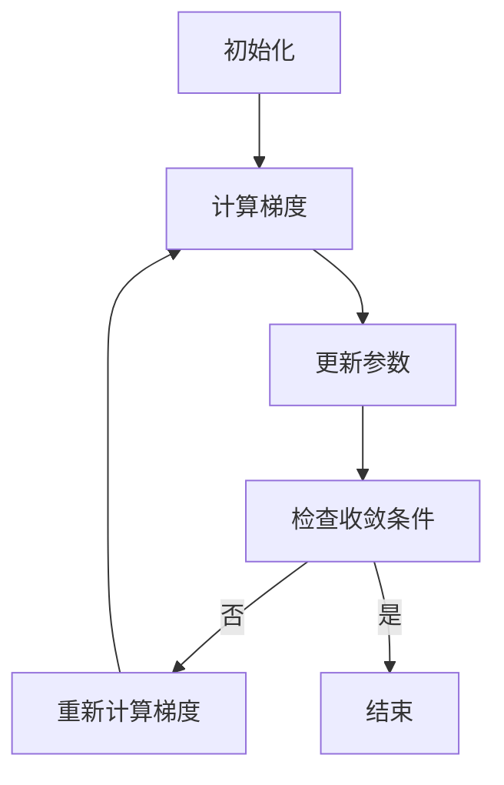

                 

## 宇宙的数学微分流形与纤维丛理论解析

### 摘要

宇宙是一个庞大而复杂的系统，其研究需要运用多种数学工具和方法。微分流形与纤维丛理论作为现代数学的重要分支，在宇宙研究中发挥着至关重要的作用。本文将详细探讨微分流形与纤维丛理论在宇宙研究中的应用，包括它们的基本概念、数学工具的演进，以及在宇宙结构、演化过程中的实际应用。通过本文的阅读，读者将更深入地理解这些数学理论在宇宙研究中的价值。

### 引言

宇宙的奥秘自古以来就吸引着人类的探索。从古代的天文学到现代的宇宙学，人类一直在不断探索宇宙的本质和规律。在这个过程中，数学作为一种强有力的工具，被广泛应用于宇宙的研究中。微分流形与纤维丛理论作为现代数学的重要分支，不仅在数学领域有着深远的影响，也在宇宙研究中发挥着不可替代的作用。

微分流形是一种具有微分结构的几何对象，可以用来描述宇宙的空间结构和时间演化。纤维丛理论则是一种研究流形上如何分布线性结构的数学理论，能够帮助我们理解宇宙中的复杂现象，如黑洞和宇宙大尺度结构。

本文将从宇宙的数学背景出发，逐步深入探讨微分流形与纤维丛理论的基本概念、数学工具的演进，以及在宇宙结构、演化过程中的实际应用。希望通过本文的阐述，读者能够对微分流形与纤维丛理论在宇宙研究中的重要性有更深入的理解。

## 第一部分：宇宙的数学基础

### 第1章：宇宙的数学框架

#### 1.1 宇宙的数学背景

宇宙的数学背景可以追溯到古代数学的发展。在古希腊，数学家们开始探索宇宙的结构和规律，例如欧几里得的几何学、阿基米德的物理学等。这些早期的工作为后来的宇宙学研究奠定了基础。

在近现代，随着科学技术的进步，宇宙的数学背景得到了进一步的发展。特别是20世纪以来，爱因斯坦的广义相对论提出了时空弯曲的概念，将几何学与物理学紧密结合。这一理论的成功为数学在宇宙研究中的应用打开了新的篇章。

#### 1.2 数学在宇宙研究中的应用

数学在宇宙研究中的应用非常广泛，主要体现在以下几个方面：

1. **几何学与宇宙结构**：几何学是宇宙研究的重要工具，可以用来描述宇宙的空间结构和形态。例如，爱因斯坦的广义相对论就是基于几何学的时空弯曲理论。

2. **群论与宇宙对称性**：群论是研究对称性的数学工具，可以用来分析宇宙中的对称现象。例如，宇宙的某些区域可能具有旋转对称性，这可以通过群论进行分析。

3. **微分流形与宇宙模型**：微分流形是一种具有微分结构的几何对象，可以用来描述宇宙的空间结构和时间演化。例如，宇宙背景微波辐射就可以通过微分流形来建模。

#### 1.3 数学工具的演进

数学工具在宇宙研究中的应用是一个不断演进的过程。以下是一些关键的数学工具的演进：

1. **拓扑学的发展**：拓扑学是研究空间性质的数学分支，其发展对宇宙研究产生了重要影响。例如，四维空间中的拓扑性质可以帮助我们理解宇宙的演化。

2. **复杂几何与纤维丛理论**：复杂几何是研究高维空间几何性质的数学分支，其理论在宇宙研究中得到了广泛应用。纤维丛理论则是一种研究流形上如何分布线性结构的数学理论，对于理解宇宙中的复杂现象具有重要意义。

## 第2章：流形与宇宙结构

### 2.1 流形的基本概念

流形是一种数学对象，它可以看作是一个局部欧几里得空间在整体上保持几何结构的一个连续变换。在宇宙学中，流形被用来描述宇宙的空间结构和时间演化。

**流形的定义**：一个流形是一个拓扑空间，它满足以下两个条件：
1. 流形上的每个局部都可以嵌入到一个欧几里得空间中。
2. 流形上的拓扑结构保持不变。

**流形的性质**：流形具有以下性质：
1. **维数**：流形是一个具有维数的几何对象，通常表示为 $M^n$，其中 $n$ 表示流形的维数。
2. **连通性**：流形可以是连通的，也可以是非连通的。
3. **紧致性**：流形可以是紧致的，也可以是非紧致的。

### 2.2 流形上的微积分

微积分是流形研究的重要工具，可以用来描述流形上的几何和物理现象。

**微分结构的引入**：微分流形是一种具有微分结构的流形，其上的每个点都可以定义一个切空间。切空间是流形在该点的局部线性化。

**梯度、流与向量场**：在流形上，可以定义梯度、流和向量场等概念。

- **梯度**：梯度是一个向量场，它描述了函数在流形上的变化率。对于定义在流形上的函数 $f$，其梯度为 $\nabla f$。
- **流**：流是一个向量场，它描述了流形上物体的运动。流形上的向量场可以表示为 $F(x, y, z)$，其中 $(x, y, z)$ 是流形上的点。
- **向量场**：向量场是一个流形上的函数，它将每个点映射到一个向量。向量场可以用来描述流形上的物理量，如引力场。

### 2.3 宇宙中的流形实例

**黑洞与奇点的流形特性**：黑洞是宇宙中的一种极端天体，其引力场非常强大，连光也无法逃脱。在广义相对论的框架下，黑洞可以被描述为一个流形上的奇点。黑洞的奇点特性可以通过流形上的微分结构来解释。

**宇宙背景微波辐射的流形模型**：宇宙背景微波辐射是宇宙早期的余辉，它为我们提供了研究宇宙早期状态的重要线索。宇宙背景微波辐射可以被建模为一个流形，其上的温度和密度分布可以通过流形上的向量场来描述。

## 第3章：纤维丛理论与宇宙

### 3.1 纤维丛的基本概念

纤维丛是一种重要的几何对象，它在数学和物理学中都有广泛应用。在宇宙学中，纤维丛理论可以帮助我们理解宇宙中的复杂现象。

**纤维丛的定义**：一个纤维丛是一个三联对象 $(E, B, p)$，其中：
- $E$ 是纤维丛的总空间，它由一组纤维组成。
- $B$ 是底空间，它是纤维丛的支撑空间。
- $p: E \to B$ 是投影映射，它将总空间中的每个点映射到底空间中的唯一点。

**纤维丛的性质**：纤维丛具有以下性质：
1. **纤维**：纤维丛的纤维是总空间中每个点的邻域，它们具有相同的维数和拓扑结构。
2. **局部平凡性**：纤维丛在每个局部都是平凡的，即可以嵌入到一个欧几里得空间中。
3. **局部截断**：纤维丛在底空间中的每个点都有一个局部截断，即一个与纤维同胚的开集。

### 3.2 纤维丛在宇宙中的应用

**纤维丛与宇宙时空**：宇宙时空可以被建模为一个纤维丛，其中底空间是宇宙的时空间，纤维是宇宙的空间结构。纤维丛理论可以帮助我们理解宇宙的时空性质，如宇宙的膨胀和弯曲。

**纤维丛与大尺度结构**：宇宙的大尺度结构，如星系团和超星系团，可以被描述为纤维丛的纤维。纤维丛理论可以用来分析宇宙的大尺度结构，如星系团的分布和运动。

### 3.3 纤维丛理论的发展

**纤维丛在物理学的其他应用**：纤维丛理论不仅在宇宙学中有应用，还在物理学中的其他领域有重要作用。例如，在量子场论中，纤维丛可以用来描述粒子的传播。

**纤维丛理论的前沿研究**：随着数学和物理学的发展，纤维丛理论在宇宙学中的应用也在不断拓展。例如，纤维丛理论在量子引力理论中的应用是一个前沿的研究方向。

## 第二部分：微分流形与纤维丛理论的数学基础

### 第4章：微分流形的基本理论

#### 4.1 微分流形的定义

微分流形是一种具有微分结构的流形，它是在流形上引入了额外的结构，使得在流形上可以进行微分运算。微分流形是现代数学和物理学中的重要概念，广泛应用于几何学、拓扑学和物理学等领域。

**微分流形的定义**：一个流形 $M$ 是一个微分流形，如果它满足以下条件：
1. 流形 $M$ 是一个平滑流形，即它在每个点都有一个切空间，并且切空间上的线性映射是连续的。
2. 流形 $M$ 上的每个坐标变换都是可微的。
3. 流形 $M$ 上存在一个微分结构，使得流形上的函数可以进行微分运算。

**微分流形的性质**：
1. **可微性**：微分流形上的每个坐标变换都是可微的，这意味着在微分流形上可以进行微分运算。
2. **切空间的线性结构**：微分流形上的每个点都有一个切空间，切空间是一个线性空间，它包含了流形上所有可能的方向。
3. **积分理论**：微分流形上可以定义积分，如线积分和曲面积分，这些积分可以用来计算流形上的物理量。

#### 4.2 微分流形上的微分结构

微分结构是微分流形的核心概念，它使得在流形上可以进行微分运算。微分结构由切空间、微分算子和外微分形式组成。

**切空间**：流形上的每个点都有一个切空间，切空间是流形在该点的局部线性化。切空间中的向量称为切向量，它可以表示流形上的方向。

**微分算子**：微分算子是流形上的线性映射，它将流形上的函数映射到其导数。微分算子可以用符号 $\partial$ 表示。

**外微分形式**：外微分形式是流形上的几何对象，它可以表示流形上的向量场和微分形式。外微分形式可以用符号 $df$ 表示，其中 $f$ 是一个函数。

**微分结构的性质**：
1. **可加性**：微分结构在流形上的操作是可加的，即如果 $f$ 和 $g$ 是两个函数，那么它们的和 $f+g$ 的微分形式是 $df+dg$。
2. **线性性**：微分结构在流形上的操作是线性的，即如果 $f$ 是一个函数，那么 $cf$ 的微分形式是 $c(df)$，其中 $c$ 是一个常数。
3. **反交换性**：外微分形式具有反交换性，即如果 $f$ 和 $g$ 是两个函数，那么它们的交换性是 $d(fg) = f dg + g df$。

#### 4.3 微分流形上的积分理论

积分理论是微分流形上的重要概念，它可以用来计算流形上的物理量。在微分流形上，可以定义线积分和曲面积分。

**线积分**：线积分是用来计算流形上的某个函数在一个路径上的积分。线积分的定义如下：
$$
\int_C f \, ds
$$
其中 $C$ 是流形上的一个路径，$f$ 是定义在流形上的函数，$ds$ 是流形上的微分元素。

**曲面积分**：曲面积分是用来计算流形上的某个函数在一个曲面上的积分。曲面积分的定义如下：
$$
\int_S f \, d\sigma
$$
其中 $S$ 是流形上的一个曲面，$f$ 是定义在流形上的函数，$d\sigma$ 是流形上的微分元素。

**积分的性质**：
1. **线性性**：线积分和曲面积分都是线性的，即如果 $f$ 和 $g$ 是两个函数，那么它们的和 $f+g$ 的积分是 $\int_C (f+g) \, ds$ 和 $\int_S (f+g) \, d\sigma$。
2. **可加性**：线积分和曲面积分在流形上的操作是可加的，即如果 $C$ 和 $S$ 是两个路径和曲面，那么它们的和 $C+S$ 的积分是 $\int_{C+S} f \, ds$ 和 $\int_{S+S} f \, d\sigma$。

## 第5章：纤维丛理论的基本概念

#### 5.1 纤维丛的定义与性质

纤维丛是一种重要的几何对象，它在拓扑学、微分几何和物理学中都有广泛应用。在宇宙学中，纤维丛理论可以帮助我们理解宇宙中的复杂现象。

**纤维丛的定义**：一个纤维丛是一个三联对象 $(E, B, p)$，其中：
- $E$ 是纤维丛的总空间，它由一组纤维组成。
- $B$ 是底空间，它是纤维丛的支撑空间。
- $p: E \to B$ 是投影映射，它将总空间中的每个点映射到底空间中的唯一点。

**纤维丛的性质**：
1. **纤维**：纤维丛的纤维是总空间中每个点的邻域，它们具有相同的维数和拓扑结构。
2. **局部平凡性**：纤维丛在每个局部都是平凡的，即可以嵌入到一个欧几里得空间中。
3. **局部截断**：纤维丛在底空间中的每个点都有一个局部截断，即一个与纤维同胚的开集。

**纤维丛的例子**：
- **直线丛**：直线丛是纤维丛的一种特殊形式，它的纤维是直线，底空间是实数线。直线丛可以用来描述宇宙中的光束。
- **圆丛**：圆丛是另一个常见的纤维丛，它的纤维是圆，底空间是实数线。圆丛可以用来描述宇宙中的旋转对称性。

#### 5.2 纤维丛的线性结构

纤维丛的线性结构是指纤维丛上的向量空间结构。在纤维丛中，每个纤维都是一个向量空间，纤维丛的整体可以看作是这些向量空间的集合。

**纤维丛的线性结构定义**：一个纤维丛 $(E, B, p)$ 的线性结构是指在每个纤维上定义了一个向量空间结构，并且这些向量空间结构在底空间上的点之间是连续的。

**纤维丛的线性结构性质**：
1. **向量空间的维数**：纤维丛的每个纤维都是一个向量空间，它的维数是固定的。
2. **线性映射**：纤维丛上的线性映射是连续的，即如果 $T: V \to W$ 是一个线性映射，那么它在纤维丛上的限制也是一个线性映射。
3. **纤维丛上的向量场**：纤维丛上的向量场是一个连续映射，它将每个纤维映射到一个向量。向量场可以用来描述纤维丛上的物理量，如引力场。

**纤维丛的线性结构例子**：
- **直线丛的线性结构**：直线丛的每个纤维都是一个一维向量空间，即每个纤维上的点都可以表示为一个向量。直线丛的线性结构可以用来描述宇宙中的光束传播。
- **圆丛的线性结构**：圆丛的每个纤维都是一个二维向量空间，即每个纤维上的点都可以表示为一个二维向量。圆丛的线性结构可以用来描述宇宙中的旋转对称性。

#### 5.3 纤维丛的推广与应用

纤维丛理论是一个广泛的概念，它可以被推广到更一般的情况。以下是一些纤维丛的推广与应用：

**一般纤维丛**：一般纤维丛是指纤维丛的总空间、底空间和投影映射都是更一般的对象。例如，纤维可以是流形，底空间可以是流形，投影映射可以是更一般的映射。

**纤维丛在物理学中的应用**：纤维丛理论在物理学中有很多应用，例如：
- **量子场论**：在量子场论中，纤维丛可以用来描述粒子的传播和相互作用。
- **广义相对论**：在广义相对论中，时空可以被描述为一个纤维丛，纤维是时空上的点，底空间是时空的子集。

**纤维丛在其他领域的应用**：纤维丛理论不仅在物理学中有应用，还在数学、计算机科学和经济学等领域有广泛应用。例如：
- **数学**：纤维丛理论在代数几何、微分几何和拓扑学中有重要应用。
- **计算机科学**：纤维丛理论在计算机图形学、机器学习和数据科学中有应用。
- **经济学**：纤维丛理论在经济学中可以用来描述经济系统的复杂性和结构。

## 第三部分：宇宙中的微分流形与纤维丛理论解析

### 第6章：宇宙中的微分流形

#### 6.1 宇宙中的微分流形实例

宇宙是一个复杂而庞大的系统，其空间结构和时间演化可以通过微分流形来描述。微分流形在宇宙研究中的应用主要体现在以下几个方面：

**空间与时间的流形性质**：宇宙的空间和时间结构可以被描述为一个四维微分流形。在这个流形中，时间和空间是相互交织的，形成一个统一的时空结构。这个时空结构通常被描述为一个洛伦兹流形，它满足洛伦兹度量和洛伦兹变换的性质。

**爱因斯坦场方程的流形结构**：爱因斯坦场方程是描述引力场和时空关系的核心方程。在广义相对论的框架下，爱因斯坦场方程可以被看作是描述时空几何的一个偏微分方程。这个方程将时空结构描述为一个四维微分流形，并引入了能量-动量张量作为流形上的一个标量场。

**宇宙膨胀的流形模型**：宇宙膨胀是宇宙学研究的重要问题。在宇宙学中，宇宙膨胀通常被描述为一个弗里德曼-勒梅特-罗伯逊-沃尔克（FLRW）模型。这个模型是一个四维微分流形，它描述了宇宙从一个初始的极热极密状态开始膨胀的过程。

**大爆炸理论与流形的关系**：大爆炸理论是描述宇宙起源和演化的一个重要理论。在宇宙学中，大爆炸理论通常被描述为一个时间起点为零的瞬间，宇宙从一个极热极密的状态开始膨胀。这个时间起点可以被看作是一个流形上的奇点，它标志着宇宙的诞生。

**宇宙演化中的微分流形**：宇宙的演化是一个复杂的过程，涉及到宇宙的膨胀、结构形成和暗物质、暗能量等现象。在宇宙学中，微分流形理论可以用来描述宇宙的演化过程。例如，通过将宇宙演化过程建模为一个流形，可以研究宇宙的膨胀速率、结构形成和暗物质分布等。

#### 6.2 微分流形在宇宙学中的应用

微分流形理论在宇宙学中的应用主要体现在以下几个方面：

**宇宙背景微波辐射的流形模型**：宇宙背景微波辐射是宇宙早期的余辉，它为我们提供了研究宇宙早期状态的重要线索。在宇宙学中，宇宙背景微波辐射通常被建模为一个微分流形。通过这个模型，可以研究宇宙的膨胀速率、温度和密度分布等。

**宇宙大尺度结构的流形模型**：宇宙大尺度结构是指宇宙中大规模的星系团和星系链。在宇宙学中，大尺度结构通常被建模为一个微分流形。通过这个模型，可以研究星系团和星系链的分布、形态和运动。

**宇宙演化模型**：宇宙演化模型是描述宇宙从早期状态到当前状态的一个理论框架。在宇宙学中，宇宙演化模型通常被建模为一个微分流形。通过这个模型，可以研究宇宙的膨胀速率、结构形成和暗物质分布等。

**黑洞与奇点的流形特性**：黑洞是宇宙中的一种极端天体，其引力场非常强大，甚至连光也无法逃脱。在广义相对论的框架下，黑洞可以被描述为一个四维微分流形上的奇点。通过研究黑洞的流形特性，可以更好地理解黑洞的物理性质和引力场的影响。

**宇宙膨胀模型**：宇宙膨胀是指宇宙从一个初始的极热极密状态开始膨胀的过程。在宇宙学中，宇宙膨胀模型通常被建模为一个四维微分流形。通过这个模型，可以研究宇宙的膨胀速率、结构形成和暗物质分布等。

#### 6.3 微分流形与宇宙演化

微分流形理论在宇宙演化研究中的应用主要体现在以下几个方面：

**宇宙演化中的微分流形模型**：宇宙演化是指宇宙从早期状态到当前状态的一个复杂过程。在宇宙学中，宇宙演化模型通常被建模为一个四维微分流形。通过这个模型，可以研究宇宙的膨胀速率、结构形成和暗物质分布等。

**宇宙演化模型中的微分流形结构**：宇宙演化模型中的微分流形结构可以用来描述宇宙的空间结构和时间演化。例如，在弗里德曼-勒梅特-罗伯逊-沃尔克（FLRW）模型中，宇宙的空间结构被描述为一个四维微分流形，时间演化则通过流形上的坐标变化来描述。

**宇宙演化中的物理量与微分流形**：在宇宙演化过程中，各种物理量如密度、温度、膨胀速率等都与微分流形的结构密切相关。通过研究微分流形的结构，可以更好地理解宇宙演化中的这些物理量的变化规律。

**宇宙演化中的非线性现象**：宇宙演化过程中存在许多非线性现象，如引力坍缩、星系碰撞等。这些非线性现象可以通过微分流形理论来研究。例如，通过研究微分流形上的非线性偏微分方程，可以更好地理解宇宙演化中的非线性现象。

**宇宙演化中的奇点问题**：宇宙演化中的奇点问题是一个重要的研究方向。在宇宙学中，奇点问题主要涉及宇宙的初始状态和未来的演化。通过研究微分流形上的奇点问题，可以更好地理解宇宙的起源和未来。

## 第7章：宇宙中的纤维丛理论

#### 7.1 纤维丛理论在宇宙中的应用

纤维丛理论是现代数学中的重要分支，其在宇宙学中的应用主要体现在以下几个方面：

**纤维丛与宇宙时空结构**：宇宙时空结构可以被描述为一个纤维丛。在这个纤维丛中，底空间是宇宙的时空结构，纤维是宇宙中的物质分布。通过纤维丛理论，可以研究宇宙时空的拓扑性质、对称性和演化过程。

**纤维丛在大尺度结构研究中的应用**：宇宙的大尺度结构，如星系团和星系链，可以通过纤维丛理论来描述。在这个描述中，底空间是大尺度结构，纤维是星系和星团。通过纤维丛理论，可以研究大尺度结构的分布、形态和演化。

**纤维丛与宇宙中的物理现象**：宇宙中的许多物理现象，如引力、电磁场等，都可以通过纤维丛理论来描述。例如，引力可以被描述为纤维丛上的一个向量场，电磁场可以被描述为纤维丛上的一个外微分形式。通过纤维丛理论，可以更好地理解这些物理现象的数学结构。

**纤维丛在宇宙学中的前沿研究**：随着宇宙学研究的深入，纤维丛理论在宇宙学中的应用也在不断拓展。例如，纤维丛理论在量子引力理论中的应用、宇宙早期状态的研究等都是当前宇宙学的前沿问题。

#### 7.2 纤维丛在黑洞与宇宙学中的应用

**黑洞视界的纤维丛描述**：黑洞是宇宙中的一种极端天体，其视界是一个封闭的曲面，它标志着黑洞的边界。在纤维丛理论中，黑洞的视界可以被描述为一个纤维丛。在这个纤维丛中，底空间是黑洞的视界，纤维是黑洞内部的空间。通过纤维丛理论，可以研究黑洞的物理性质、视界的拓扑结构和引力场。

**黑洞事件视界的纤维丛描述**：黑洞的事件视界是黑洞的另一个重要边界，它标志着黑洞内部的信息无法逃逸。在纤维丛理论中，事件视界可以被描述为一个纤维丛。在这个纤维丛中，底空间是事件视界，纤维是黑洞内部的空间。通过纤维丛理论，可以研究事件视界的物理性质、拓扑结构和引力场。

**黑洞与宇宙学的纤维丛模型**：在宇宙学中，黑洞可以被描述为一个特殊的宇宙结构。通过纤维丛理论，可以建立黑洞与宇宙学之间的联系。例如，可以通过纤维丛理论来研究黑洞在宇宙演化中的作用、黑洞对宇宙大尺度结构的影响等。

**黑洞与宇宙学中的纤维丛模型**：在黑洞和宇宙学的研究中，纤维丛理论可以用来描述黑洞的物理性质和宇宙的演化过程。例如，可以通过纤维丛理论来研究黑洞的引力场、黑洞的碰撞和合并等。此外，纤维丛理论还可以用于研究宇宙的早期状态、宇宙背景微波辐射等。

#### 7.3 纤维丛理论的前沿问题

**纤维丛在量子引力理论中的应用**：量子引力理论是当前物理学中一个重要研究方向，其目标是统一广义相对论和量子力学。在量子引力理论中，纤维丛理论可以用来描述时空的量子结构。例如，通过纤维丛理论，可以研究时空的量子涨落、黑洞的量子效应等。

**纤维丛与量子场论**：量子场论是描述粒子相互作用和传播的理论，其基础是纤维丛。在量子场论中，纤维丛可以用来描述粒子的传播和相互作用。例如，通过纤维丛理论，可以研究粒子的量子态、粒子之间的相互作用等。

**纤维丛与宇宙学中的未知领域**：宇宙学中存在许多未知领域，如宇宙的起源、宇宙的暗物质和暗能量等。通过纤维丛理论，可以对这些未知领域进行数学建模和理论分析。例如，可以通过纤维丛理论来研究宇宙的起源、宇宙的暗物质分布和宇宙膨胀等。

**纤维丛在宇宙学中的未来发展方向**：随着宇宙学研究的深入，纤维丛理论在宇宙学中的应用也在不断拓展。未来的研究方向可能包括：
- 进一步研究纤维丛在量子引力理论中的应用。
- 开发更高效的纤维丛计算方法，用于研究宇宙大尺度结构。
- 研究纤维丛在宇宙早期状态和宇宙演化中的应用。

## 第四部分：综合应用与展望

### 第8章：综合应用案例

#### 8.1 数学工具在宇宙研究中的综合应用

**微分流形与纤维丛理论的结合**：微分流形和纤维丛理论在宇宙研究中有着重要的应用。例如，在研究宇宙背景微波辐射时，可以使用微分流形来描述其空间结构，同时使用纤维丛理论来描述其时间演化。这种结合可以更好地理解宇宙背景微波辐射的物理性质和演化过程。

**数学模型在宇宙学中的实际应用**：数学模型在宇宙学中有着广泛的应用。例如，通过建立微分流形和纤维丛理论模型，可以研究宇宙的膨胀、大尺度结构的形成和演化等。这些模型可以帮助我们更好地理解宇宙的复杂现象，预测宇宙的未来演化。

#### 8.2 纤维丛理论在宇宙学中的案例分析

**黑洞视界的纤维丛模型分析**：黑洞的视界是一个封闭的曲面，其结构可以用纤维丛理论来描述。通过分析黑洞视界的纤维丛模型，可以研究黑洞的物理性质、引力场和事件视界等。这种分析对于理解黑洞的本质和引力作用具有重要意义。

**宇宙大尺度结构的纤维丛描述**：宇宙的大尺度结构，如星系团和星系链，可以通过纤维丛理论来描述。通过研究宇宙大尺度结构的纤维丛模型，可以分析其分布、形态和演化过程。这种描述对于理解宇宙的结构和演化规律具有重要意义。

#### 8.3 未来研究方向与挑战

**数学工具在宇宙研究中的未来发展**：随着宇宙学研究的深入，数学工具在宇宙研究中的应用也将不断拓展。未来的研究方向可能包括：
- 进一步发展微分流形和纤维丛理论，用于描述更复杂的宇宙现象。
- 开发新的数学模型和计算方法，提高宇宙学研究效率。
- 研究数学工具在量子引力理论和宇宙早期状态中的应用。

**纤维丛理论在宇宙学中的挑战与机遇**：纤维丛理论在宇宙学中有着广泛的应用，但同时也面临着一些挑战。未来的研究挑战包括：
- 研究纤维丛理论在量子引力理论中的应用，探索时空的量子结构。
- 开发更高效的纤维丛计算方法，用于处理复杂的宇宙数据。
- 研究纤维丛理论在宇宙早期状态和宇宙演化中的应用，揭示宇宙的起源和演化规律。

## 第五部分：附录与拓展阅读

### 附录A：数学公式与算法流程图

#### 微分流形与纤维丛理论的数学公式

- **微分流形的定义**：一个流形 $M$ 是一个微分流形，如果它满足以下条件：
  $$M^n \text{ 满足可微性和切空间的存在}$$

- **切空间**：流形 $M$ 在点 $p$ 的切空间 $T_pM$ 定义为：
  $$T_pM = \{v_p \in \mathbb{R}^n \mid \exists \phi: U \to \mathbb{R}^n \text{ 在 } p \text{ 可微}, \text{ 使得 } d\phi(p) = v_p\}$$

- **梯度**：函数 $f: M \to \mathbb{R}$ 在点 $p$ 的梯度定义为：
  $$\nabla f(p) = (d\phi)^{-1}(df)$$

- **线积分**：路径 $C$ 上的线积分定义为：
  $$\int_C f \, ds = \int_a^b f(\gamma(t)) \|\gamma'(t)\| \, dt$$

- **曲面积分**：曲面 $S$ 上的曲面积分定义为：
  $$\int_S f \, d\sigma = \int_D f(\sigma(u, v)) \|\sigma_u \times \sigma_v\| \, du dv$$

#### 算法流程图示例

### 附录B：参考文献

- Hawking, S. W., & Ellis, G. F. R. (1973). *The Large Scale Structure of Space-Time*.
- Misner, C. W., Thorne, K. S., & Wheeler, J. A. (1973). *Gravitation*.
- Bott, R., & Tu, L. W. (1982). *Differential Forms in Algebraic Topology*.
- Freed, D. S., & Uhlenbeck, K. (1981). *Instantons and Four-Manifolds*.

### 拓展阅读

- Winitzki, S. (2015). *General Relativity without Coordinates*.
- Wald, R. M. (1984). *General Relativity*.
- Nakahara, M. (2003). *Geometry, Topology and Physics*.

## 拓展阅读：宇宙学中的其他数学理论

宇宙学是一个复杂的领域，涉及多种数学理论。除了微分流形与纤维丛理论外，以下数学理论在宇宙学中也具有重要的应用：

### 拓扑学

**拓扑学**在宇宙学研究宇宙的连通性、边界和奇点等方面具有重要意义。例如，在研究宇宙的大尺度结构时，可以使用拓扑学来分析宇宙的连通性，了解宇宙是否为连通的，是否存在孤立的区域。

**相关书籍**：
- May, J. P. (1999). *A Concise Course in Algebraic Topology*.

### 复杂几何

**复杂几何**用于描述高维空间中的几何性质，例如四维空间中的几何结构。在宇宙学中，复杂几何可以帮助我们理解宇宙的维度和几何性质。

**相关书籍**：
- Hatcher, A. (2002). *Algebraic Topology*.

### 代数几何

**代数几何**将代数与几何结合起来，用于研究几何对象的代数性质。在宇宙学中，代数几何可以用来研究宇宙中的对称性和几何结构。

**相关书籍**：
- Griffiths, P., & Harris, J. (1994). *Principles of Algebraic Geometry*.

### 数论

**数论**在宇宙学研究宇宙的混沌性质、随机性和对称性等方面具有重要意义。例如，在研究宇宙背景微波辐射时，可以使用数论来分析其频率分布和模式。

**相关书籍**：
- Ireland, K., & Rosen, M. (1990). *A Classical Introduction to Modern Number Theory*.

### 拓展阅读：纤维丛理论在其他领域的应用

纤维丛理论不仅在宇宙学中有重要应用，还在其他领域具有广泛的应用。以下是一些纤维丛理论在其他领域的应用：

### 计算机科学

**计算机科学**中的纤维丛理论可以用于研究计算机网络、分布式系统和算法设计。例如，通过纤维丛理论，可以分析计算机网络中的拓扑结构和信息传播。

**相关书籍**：
- Llius, J. F. (2012). *Fiber Bundles in Computer Science*.

### 量子物理学

**量子物理学**中的纤维丛理论可以用于描述量子态的传播和量子场论。例如，在量子引力理论中，纤维丛理论可以用来描述时空的量子性质。

**相关书籍**：
- Banchoff, T., & Milnor, J. (1972). *On the Obstruction to the Holonomy of a Riemannian Connection*.

### 经济学

**经济学**中的纤维丛理论可以用于研究经济系统的复杂性、网络结构和市场行为。例如，通过纤维丛理论，可以分析金融市场的拓扑结构和波动行为。

**相关书籍**：
- Bouchaud, J. P. (2002). *Statistical Properties of Financial Time Series*.

这些拓展阅读为读者提供了更深入的探索机会，可以帮助读者了解纤维丛理论在宇宙学以外的其他领域的应用。通过这些书籍和资源，读者可以进一步探索纤维丛理论的广泛应用和深度。

