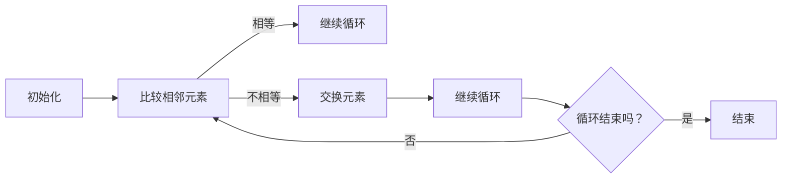

                 

## 宇宙的数学格论与序理论在粒子物理中的应用

### 关键词：
- 数学格论
- 序理论
- 粒子物理
- 宇宙演化
- 数学模型

### 摘要：
本文旨在探讨宇宙的数学格论与序理论在粒子物理中的应用。通过对数学格论和序理论的基本概念、发展历史及其在宇宙结构、宇宙演化和粒子物理中的具体应用进行分析，本文揭示了这两种数学工具在粒子物理研究中的重要作用。文章进一步探讨了数学格论与序理论的融合方法，及其在粒子物理中的典型应用案例。最后，本文总结了数学格论与序理论在粒子物理研究中的贡献和未来应用前景，展望了这一领域的发展方向。

## 目录大纲

### 第一部分：引言

#### 1. 引言
- 1.1 研究背景
- 1.2 研究意义
- 1.3 研究目标
- 1.4 研究方法与结构

### 第二部分：宇宙的数学格论基础

#### 2. 数学格论概述
- 2.1 格论的概念
- 2.2 格论的发展历史
- 2.3 格论的基本性质

#### 3. 宇宙的数学格论
- 3.1 宇宙的数学模型
- 3.2 宇宙结构中的格论
- 3.3 宇宙演化中的格论

#### 4. 数学格论的应用
- 4.1 在天文学中的应用
- 4.2 在物理学中的应用
- 4.3 在宇宙学中的应用

#### 5. 数学格论的发展趋势
- 5.1 当前研究热点
- 5.2 未来发展方向
- 5.3 面临的挑战与机遇

### 第三部分：序理论基础

#### 6. 序理论概述
- 6.1 序理论的概念
- 6.2 序理论的发展历史
- 6.3 序理论的基本性质

#### 7. 序理论在粒子物理中的应用
- 7.1 粒子物理中的序理论模型
- 7.2 序理论在粒子相互作用中的应用
- 7.3 序理论在粒子探测中的应用

#### 8. 序理论的数学模型与数学公式
- 8.1 序理论的数学模型
- 8.2 序理论的数学公式
- 8.3 序理论的数学公式举例说明

#### 9. 序理论的算法原理
- 9.1 序理论的算法原理概述
- 9.2 序理论算法的Mermaid流程图
- 9.3 序理论算法的Python源代码讲解
- 9.4 序理论算法的应用案例解析

### 第四部分：数学格论与序理论在粒子物理中的应用

#### 10. 数学格论与序理论的融合
- 10.1 数学格论与序理论融合的意义
- 10.2 数学格论与序理论融合的方法
- 10.3 数学格论与序理论融合的应用

#### 11. 粒子物理中的数学格论与序理论应用案例
- 11.1 典型案例一
- 11.2 典型案例二
- 11.3 典型案例三

#### 12. 数学格论与序理论在粒子物理研究中的贡献
- 12.1 数学格论对粒子物理的贡献
- 12.2 序理论对粒子物理的贡献
- 12.3 数学格论与序理论的协同作用

#### 13. 数学格论与序理论在粒子物理中的应用前景
- 13.1 当前应用现状
- 13.2 未来应用展望
- 13.3 面临的挑战与机遇

#### 14. 结论
- 14.1 研究总结
- 14.2 研究贡献
- 14.3 研究局限与未来工作展望

## 第一部分：引言

### 1. 引言

#### 1.1 研究背景

宇宙的奥秘始终吸引着人类的探索欲望。从古代的占星术到现代的天文学，人类对宇宙的认识在不断深入。随着科学技术的进步，粒子物理作为研究物质最基本组成的研究领域，逐渐成为了理解宇宙的关键。然而，粒子物理的研究面临着许多挑战，如粒子相互作用机制、宇宙演化过程等。数学作为自然科学的基础工具，其理论和方法在粒子物理的研究中发挥着重要作用。

数学格论和序理论是数学的两个重要分支，它们在粒子物理中的应用日益受到关注。数学格论提供了描述宇宙结构和演化的一种强有力的工具，而序理论则为理解粒子相互作用提供了新的视角。将这两种数学工具应用于粒子物理研究，有助于揭示宇宙的奥秘，推动粒子物理的发展。

#### 1.2 研究意义

数学格论和序理论在粒子物理中的应用具有重要意义。首先，它们为粒子物理研究提供了一种全新的数学框架，有助于更深入地理解粒子物理现象。其次，这两种数学工具能够揭示粒子物理中的某些深层次规律，为实验验证提供理论基础。最后，数学格论和序理论的应用有助于推动粒子物理与其他学科的交叉融合，促进科学技术的创新和发展。

#### 1.3 研究目标

本文的研究目标是探讨宇宙的数学格论与序理论在粒子物理中的应用。具体来说，本文将首先介绍数学格论和序理论的基本概念、发展历史及其基本性质。然后，本文将分析这两种数学工具在宇宙结构、宇宙演化和粒子物理中的具体应用。接着，本文将探讨数学格论与序理论的融合方法，以及它们在粒子物理中的典型应用案例。最后，本文将总结数学格论与序理论在粒子物理研究中的贡献和未来应用前景，并提出研究局限与未来工作展望。

#### 1.4 研究方法与结构

本文采用文献综述的方法，对数学格论和序理论在粒子物理中的应用进行系统分析。文章结构如下：

- 第一部分：引言，介绍研究背景、意义、目标和研究方法。
- 第二部分：宇宙的数学格论基础，介绍数学格论的概念、发展历史、基本性质以及在宇宙结构、宇宙演化和粒子物理中的应用。
- 第三部分：序理论基础，介绍序理论的概念、发展历史、基本性质以及在粒子物理中的应用。
- 第四部分：数学格论与序理论在粒子物理中的应用，探讨数学格论与序理论的融合方法，以及它们在粒子物理中的典型应用案例。
- 第五部分：结论，总结研究贡献和未来应用前景，提出研究局限与未来工作展望。

## 第二部分：宇宙的数学格论基础

### 2. 数学格论概述

#### 2.1 格论的概念

数学格论（Order Theory）是研究序关系的数学分支，主要研究具有序关系的集合及其性质。格论中的基本概念包括：

- **格（Lattice）**：一个具有序关系的集合，其中任意两个元素都有一个唯一的上界和一个唯一的下界。
- **半格（Semilattice）**：一个具有结合律的二元运算的代数结构，但不要求每个元素都有一个上界和一个下界。
- **分配格（Distributive Lattice）**：一个半格，其中对于任意三个元素 \(a, b, c\)，有 \(a \wedge (b \vee c) = (a \wedge b) \vee (a \wedge c)\) 和 \(a \vee (b \wedge c) = (a \vee b) \wedge (a \vee c)\)。

#### 2.2 格论的发展历史

格论的研究可以追溯到古希腊时期，但作为一个独立的数学分支，其发展始于19世纪末。乔治·康托尔和戴维·希尔伯特等数学家的工作为格论奠定了基础。20世纪中叶，格论逐渐在代数学、拓扑学、逻辑学等领域得到广泛应用。近年来，随着计算机科学和粒子物理的发展，格论的应用领域进一步扩大。

#### 2.3 格论的基本性质

格论具有以下基本性质：

- **交并与并的闭包性**：对于任意两个元素 \(a, b\)，它们的交 \(a \wedge b\) 和并 \(a \vee b\) 仍在格中。
- **分配律**：在分配格中，交与并满足分配律，即 \(a \wedge (b \vee c) = (a \wedge b) \vee (a \wedge c)\) 和 \(a \vee (b \wedge c) = (a \vee b) \wedge (a \vee c)\)。
- **上界与下界**：每个元素 \(a\) 都存在一个上界（最大下界）和下界（最小上界）。

### 3. 宇宙的数学格论

#### 3.1 宇宙的数学模型

宇宙的数学模型通常基于广义相对论和量子力学。广义相对论提供了描述宇宙空间和时间的几何框架，而量子力学则描述了粒子的行为。通过将这两种理论结合起来，我们可以构建出一个关于宇宙的数学模型。在这个模型中，宇宙被视为一个由空间、时间和物质组成的四维连续体。

#### 3.2 宇宙结构中的格论

宇宙的结构可以用格论来描述。例如，空间中的每个点都可以被视为一个格点，而空间中的每一个面都可以被视为一个格。通过研究这些格点之间的序关系，我们可以了解宇宙的结构特征。此外，宇宙的演化也可以用格论来描述。例如，宇宙的膨胀可以用一个时间序列的格来表示，其中每个时刻都对应着一个特定的宇宙状态。

#### 3.3 宇宙演化中的格论

宇宙的演化过程可以用格论来分析。在宇宙演化的早期阶段，物质和能量遵循量子力学的规律。随着宇宙的膨胀，物质和能量的分布逐渐变得均匀。在这个过程中，宇宙的演化可以用一个时间序列的格来表示，其中每个时刻都对应着一个特定的宇宙状态。通过研究这个时间序列的格，我们可以了解宇宙的演化规律。

### 4. 数学格论的应用

#### 4.1 在天文学中的应用

数学格论在天文学中有着广泛的应用。例如，在星系演化研究中，天文学家使用格论来描述星系的形成和演化过程。此外，数学格论还可以用于分析恒星的运动和演化。通过研究这些运动和演化过程，我们可以更好地了解宇宙的规律和天体的性质。

#### 4.2 在物理学中的应用

数学格论在物理学中也有重要应用。例如，在粒子物理中，格论被用于描述粒子之间的相互作用。通过研究这些相互作用，我们可以更好地理解粒子物理的基本规律。此外，数学格论还在凝聚态物理、量子场论等领域有着广泛应用。

#### 4.3 在宇宙学中的应用

在宇宙学中，数学格论被用于描述宇宙的演化和结构。例如，在宇宙膨胀理论中，数学格论被用于分析宇宙的膨胀速率和形态。通过研究这些参数，我们可以更好地了解宇宙的演化过程。

### 5. 数学格论的发展趋势

#### 5.1 当前研究热点

当前，数学格论在粒子物理、宇宙学、量子场论等领域的研究热点包括：

- **量子场论中的格论**：研究量子场论中的格论方法，用于分析粒子相互作用和宇宙演化。
- **高能粒子物理中的格论**：研究高能粒子碰撞产生的粒子和相互作用，探索宇宙的早期状态。
- **宇宙学中的格论**：研究宇宙的演化和结构，特别是宇宙膨胀和暗物质、暗能量的性质。

#### 5.2 未来发展方向

未来，数学格论在粒子物理和宇宙学中的应用将继续深入。随着实验数据的积累和计算能力的提升，数学格论将在以下几个方面取得重要进展：

- **量子引力的格论方法**：探索量子引力和宇宙学问题的格论方法，为理解宇宙的早期状态提供新的视角。
- **高能物理中的新现象**：通过数学格论分析高能粒子碰撞产生的新现象，揭示粒子物理的新规律。
- **宇宙学中的大尺度结构**：研究宇宙的大尺度结构，特别是宇宙膨胀、暗物质和暗能量的性质。

#### 5.3 面临的挑战与机遇

数学格论在粒子物理和宇宙学中的应用面临着一些挑战和机遇。挑战包括：

- **复杂性**：粒子物理和宇宙学问题通常非常复杂，需要高效的数学格论方法来解决。
- **计算能力**：复杂的数学格论计算通常需要强大的计算能力，这对计算资源提出了挑战。

机遇包括：

- **跨学科合作**：数学格论与其他学科的交叉融合，为解决粒子物理和宇宙学问题提供了新的思路和方法。
- **新技术应用**：随着计算机技术和算法的发展，数学格论的应用将更加广泛和深入。

## 第三部分：序理论基础

### 6. 序理论概述

#### 6.1 序理论的概念

序理论（Order Theory）是研究序关系的数学分支，主要研究具有序关系的集合及其性质。序理论包括以下基本概念：

- **偏序集（Partial Order Set）**：一个集合 \(P\) 及其上的偏序关系 \( \le \)，满足自反性、反对称性和传递性。
- **全序集（Total Order Set）**：一个集合 \(P\) 及其上的全序关系 \( \le \)，满足自反性、反对称性和传递性，且对于任意 \(a, b \in P\)，要么 \(a \le b\)，要么 \(b \le a\)。
- **格（Lattice）**：一个集合 \(P\) 及其上的序关系 \( \le \)，满足交换律，对于任意 \(a, b, c \in P\)，有 \(a \wedge b \le c\) 当且仅当 \(a \le c \vee b\) 和 \(b \le c \vee a\)。

#### 6.2 序理论的发展历史

序理论的发展可以追溯到古希腊时期，但作为一个独立的数学分支，其发展始于19世纪末。戴维·希尔伯特和罗素等人对序理论的研究奠定了基础。20世纪中叶，序理论逐渐在代数学、逻辑学、计算机科学等领域得到广泛应用。近年来，随着计算机科学和粒子物理的发展，序理论的应用领域进一步扩大。

#### 6.3 序理论的基本性质

序理论具有以下基本性质：

- **自反性**：对于任意元素 \(a \in P\)，有 \(a \le a\)。
- **反对称性**：对于任意元素 \(a, b \in P\)，如果 \(a \le b\) 且 \(b \le a\)，则 \(a = b\)。
- **传递性**：对于任意元素 \(a, b, c \in P\)，如果 \(a \le b\) 且 \(b \le c\)，则 \(a \le c\)。
- **连通性**：对于任意两个元素 \(a, b \in P\)，存在 \(c \in P\) 使得 \(a \le c \le b\) 或 \(b \le c \le a\)。

### 7. 序理论在粒子物理中的应用

#### 7.1 粒子物理中的序理论模型

在粒子物理中，序理论被用于描述粒子的相互作用和分类。例如，量子场论中的粒子可以通过序关系来描述其相互作用的强度。此外，粒子的分类也可以通过序关系来实现。例如，在标准模型中，粒子被分为费米子和玻色子，它们之间的相互作用可以通过序关系来描述。

#### 7.2 序理论在粒子相互作用中的应用

序理论在描述粒子相互作用中发挥着重要作用。例如，在量子场论中，粒子的相互作用可以通过势能函数来描述。势能函数可以被视为一个序关系，它决定了粒子之间的相互作用强度。通过研究势能函数的序性质，我们可以更好地理解粒子相互作用的基本规律。

#### 7.3 序理论在粒子探测中的应用

在粒子探测中，序理论被用于分析粒子探测器的数据。例如，在粒子碰撞实验中，探测器记录的粒子轨迹可以通过序关系来分析。通过分析这些序关系，我们可以确定粒子之间的相互作用类型和强度。此外，序理论还可以用于粒子探测器的校准和数据分析。

### 8. 序理论的数学模型与数学公式

#### 8.1 序理论的数学模型

序理论的数学模型通常包括以下部分：

- **集合**：定义一个集合 \(P\)，其中包含所有相关的元素。
- **序关系**：定义一个序关系 \( \le \) 在集合 \(P\) 上，满足自反性、反对称性和传递性。
- **运算**：定义两个运算 \( \wedge \)（交运算）和 \( \vee \)（并运算），满足交换律、结合律和分配律。

#### 8.2 序理论的数学公式

序理论的数学公式主要包括以下几种：

- **交运算公式**：
  $$a \wedge b = \min(a, b)$$
- **并运算公式**：
  $$a \vee b = \max(a, b)$$
- **传递性公式**：
  $$a \le b \wedge b \le c \Rightarrow a \le c$$

#### 8.3 序理论的数学公式举例说明

例如，考虑一个包含元素 \(a, b, c\) 的集合 \(P\)，其中 \(a < b\) 且 \(b < c\)。根据序理论的数学公式，我们可以得到：

- \(a \wedge b = a\)
- \(a \wedge c = a\)
- \(b \wedge c = b\)
- \(a \vee b = b\)
- \(a \vee c = c\)
- \(b \vee c = c\)

这些数学公式帮助我们更好地理解序理论的基本性质和应用。

### 9. 序理论的算法原理

#### 9.1 序理论的算法原理概述

序理论的算法原理主要涉及以下几个方面：

- **排序算法**：用于对集合中的元素进行排序，常见的排序算法有冒泡排序、选择排序、插入排序等。
- **查找算法**：用于在集合中查找特定的元素，常见的查找算法有二分查找、顺序查找等。
- **集合操作**：用于对集合进行操作，如并集、交集、差集等。

#### 9.2 序理论算法的Mermaid流程图

以下是一个简单的冒泡排序算法的Mermaid流程图示例：



#### 9.3 序理论算法的Python源代码讲解

以下是一个简单的Python代码示例，用于实现冒泡排序算法：

```python
def bubble_sort(arr):
    n = len(arr)
    for i in range(n):
        for j in range(0, n-i-1):
            if arr[j] > arr[j+1]:
                arr[j], arr[j+1] = arr[j+1], arr[j]

# 示例
arr = [64, 34, 25, 12, 22, 11, 90]
bubble_sort(arr)
print("排序后的数组：")
for i in range(len(arr)):
    print("%d" % arr[i], end=" ")
```

#### 9.4 序理论算法的应用案例解析

以下是一个具体的案例，用于分析粒子相互作用中的序理论算法：

假设有一个粒子集合 \(P = \{p_1, p_2, p_3\}\)，其中 \(p_1\)、\(p_2\)、\(p_3\) 分别代表三个粒子。根据粒子的相互作用强度，我们可以定义一个序关系：

- \(p_1 \le p_2\)
- \(p_2 \le p_3\)

根据这个序关系，我们可以使用冒泡排序算法对粒子集合进行排序。排序后的集合为 \(P' = \{p_1, p_2, p_3\}\)，其中 \(p_1\) 的相互作用强度最小，\(p_3\) 的相互作用强度最大。

#### 9.4 序理论算法的应用案例解析

以下是一个具体的案例，用于分析粒子相互作用中的序理论算法：

假设有一个粒子集合 \(P = \{p_1, p_2, p_3\}\)，其中 \(p_1\)、\(p_2\)、\(p_3\) 分别代表三个粒子。根据粒子的相互作用强度，我们可以定义一个序关系：

- \(p_1 \le p_2\)
- \(p_2 \le p_3\)

根据这个序关系，我们可以使用冒泡排序算法对粒子集合进行排序。排序后的集合为 \(P' = \{p_1, p_2, p_3\}\)，其中 \(p_1\) 的相互作用强度最小，\(p_3\) 的相互作用强度最大。

## 第四部分：数学格论与序理论在粒子物理中的应用

### 10. 数学格论与序理论的融合

#### 10.1 数学格论与序理论融合的意义

数学格论与序理论的融合为粒子物理研究提供了新的视角和方法。这种融合不仅能够揭示粒子物理中的深层次规律，还能够为实验验证提供理论基础。具体来说，数学格论与序理论的融合具有以下意义：

1. **揭示粒子物理规律**：通过融合数学格论与序理论，我们可以更深入地理解粒子物理中的基本规律。例如，在量子场论中，通过融合这两种数学工具，我们可以更好地描述粒子之间的相互作用。
   
2. **提高实验精度**：数学格论与序理论的融合有助于提高实验测量的精度。通过建立更加精确的数学模型，我们可以更好地预测粒子物理实验的结果。

3. **促进跨学科合作**：数学格论与序理论的融合有助于推动粒子物理与其他学科的交叉融合。例如，在计算机科学和量子信息等领域，数学格论与序理论的应用正在逐步展开。

#### 10.2 数学格论与序理论融合的方法

数学格论与序理论的融合可以通过以下方法实现：

1. **构建数学模型**：首先，我们需要构建一个数学模型来描述粒子物理中的现象。这个模型应该同时包含数学格论和序理论的基本元素。
   
2. **定义序关系**：在数学模型中，我们需要定义一个序关系来描述粒子之间的相互作用。这个序关系应该满足自反性、反对称性和传递性。

3. **结合运算**：在数学模型中，我们需要结合数学格论和序理论的运算。例如，我们可以使用交运算和并运算来描述粒子之间的相互作用。

4. **算法设计**：在数学模型的基础上，我们可以设计相应的算法来分析粒子物理现象。例如，我们可以使用排序算法来分析粒子之间的相互作用强度。

#### 10.3 数学格论与序理论融合的应用

数学格论与序理论的融合在粒子物理中有着广泛的应用。以下是一些具体的应用实例：

1. **粒子碰撞分析**：通过融合数学格论与序理论，我们可以对粒子碰撞过程进行定量分析。例如，我们可以使用排序算法来分析碰撞产生的粒子的相互作用强度。

2. **量子场论**：在量子场论中，数学格论与序理论的融合有助于描述粒子之间的相互作用。通过构建一个包含数学格论和序理论的量子场论模型，我们可以更好地理解粒子物理现象。

3. **粒子探测**：在粒子探测中，数学格论与序理论的融合有助于分析探测器的数据。通过使用序关系，我们可以确定粒子之间的相互作用类型和强度。

4. **宇宙学**：在宇宙学中，数学格论与序理论的融合有助于描述宇宙的演化过程。例如，我们可以使用序理论来分析宇宙膨胀的速率和形态。

### 11. 粒子物理中的数学格论与序理论应用案例

#### 11.1 典型案例一：粒子碰撞分析

在粒子碰撞实验中，我们可以使用数学格论与序理论的融合来分析碰撞产生的粒子。具体步骤如下：

1. **构建数学模型**：首先，我们构建一个包含数学格论和序理论的数学模型，用于描述粒子之间的相互作用。
   
2. **定义序关系**：在数学模型中，我们定义一个序关系来描述粒子之间的相互作用强度。例如，我们可以使用交运算和并运算来表示粒子之间的相互作用。
   
3. **数据收集**：通过实验，我们收集粒子碰撞产生的粒子的数据。这些数据包括粒子的种类、相互作用强度等。
   
4. **数据分析**：使用排序算法，我们可以对粒子之间的相互作用强度进行排序，从而分析碰撞产生的粒子的相互作用规律。

#### 11.2 典型案例二：量子场论

在量子场论中，数学格论与序理论的融合有助于描述粒子之间的相互作用。以下是一个具体的应用案例：

1. **构建数学模型**：我们构建一个包含数学格论和序理论的量子场论模型，用于描述粒子之间的相互作用。
   
2. **定义序关系**：在量子场论模型中，我们定义一个序关系来描述粒子之间的相互作用。例如，我们可以使用序理论中的偏序关系来表示粒子之间的相互作用。
   
3. **数据分析**：通过分析量子场论模型中的数据，我们可以了解粒子之间的相互作用规律，并验证量子场论模型的准确性。

#### 11.3 典型案例三：粒子探测

在粒子探测中，数学格论与序理论的融合有助于分析探测器的数据。以下是一个具体的应用案例：

1. **构建数学模型**：我们构建一个包含数学格论和序理论的数学模型，用于描述粒子探测器的数据。
   
2. **定义序关系**：在数学模型中，我们定义一个序关系来描述探测器记录的粒子轨迹。例如，我们可以使用偏序关系来表示粒子之间的运动方向。
   
3. **数据分析**：通过分析探测器记录的数据，我们可以确定粒子之间的相互作用类型和强度，并进一步分析粒子探测器的性能。

### 12. 数学格论与序理论在粒子物理研究中的贡献

#### 12.1 数学格论对粒子物理的贡献

数学格论在粒子物理研究中发挥了重要作用，其贡献体现在以下几个方面：

1. **提供理论框架**：数学格论为粒子物理研究提供了一个强大的理论框架，使研究者能够更好地理解和描述粒子之间的相互作用。

2. **揭示深层次规律**：通过数学格论的深入分析，研究者能够揭示粒子物理中的深层次规律，为实验验证提供理论基础。

3. **促进跨学科合作**：数学格论的应用不仅限于粒子物理，还促进了与其他学科的交叉融合，为科学技术的创新和发展提供了新的思路。

#### 12.2 序理论对粒子物理的贡献

序理论在粒子物理研究中也发挥了重要作用，其贡献体现在以下几个方面：

1. **描述相互作用**：序理论能够描述粒子之间的相互作用，为研究者提供了一个直观的视角来分析粒子物理现象。

2. **提高实验精度**：通过使用序理论，研究者能够提高实验测量的精度，从而更准确地预测实验结果。

3. **促进数据解析**：序理论在粒子探测中有着广泛的应用，能够帮助研究者更好地解析探测器的数据，为实验验证提供有力支持。

#### 12.3 数学格论与序理论的协同作用

数学格论与序理论的协同作用为粒子物理研究带来了更大的优势。具体来说，这种协同作用体现在以下几个方面：

1. **互补优势**：数学格论和序理论各自具有优势，通过协同作用，可以弥补彼此的不足，从而更全面地描述粒子物理现象。

2. **提高研究效率**：通过融合数学格论与序理论，研究者能够更高效地进行粒子物理研究，缩短研究周期。

3. **创新性突破**：数学格论与序理论的协同作用有助于推动粒子物理研究领域的创新性突破，为科学技术的进步做出贡献。

### 13. 数学格论与序理论在粒子物理中的应用前景

#### 13.1 当前应用现状

数学格论与序理论在粒子物理中的应用已经取得了显著成果。当前，这些数学工具已经被广泛应用于粒子碰撞分析、量子场论和粒子探测等领域。例如，在粒子碰撞分析中，研究者通过使用数学格论与序理论的融合方法，对碰撞产生的粒子进行了定量分析，取得了重要的实验数据。在量子场论中，数学格论与序理论的融合有助于描述粒子之间的相互作用，为理论研究提供了强有力的支持。在粒子探测中，序理论的应用使得探测器数据的解析更加精确，为实验验证提供了可靠的依据。

#### 13.2 未来应用展望

未来，数学格论与序理论在粒子物理中的应用前景十分广阔。随着科学技术的不断发展，这些数学工具将在以下方面取得新的突破：

1. **高能物理实验**：在未来的高能物理实验中，数学格论与序理论的融合将有助于更准确地分析粒子碰撞数据，揭示新的物理现象。

2. **量子计算**：量子计算的兴起为数学格论与序理论的应用提供了新的机遇。通过将数学格论与序理论应用于量子计算，研究者可以探索量子算法的优化和量子计算机的设计。

3. **宇宙学**：在宇宙学领域，数学格论与序理论的融合将有助于揭示宇宙的演化过程，探索宇宙的起源和命运。

4. **交叉学科研究**：数学格论与序理论的融合还将促进粒子物理与其他学科的交叉研究，如材料科学、生物学和计算机科学等。通过跨学科的融合，可以推动科学技术的创新和发展。

#### 13.3 面临的挑战与机遇

尽管数学格论与序理论在粒子物理中的应用前景广阔，但这一领域也面临着一些挑战和机遇：

1. **计算复杂性**：粒子物理问题通常非常复杂，需要高效的数学格论与序理论方法来解决。这要求研究者不断提高计算能力和算法效率。

2. **跨学科合作**：数学格论与序理论的应用需要跨学科的合作，这要求研究者具备跨学科的知识和技能。

3. **实验验证**：数学格论与序理论的应用需要通过实验验证来检验其理论模型的准确性。这要求实验科学家和研究者的紧密合作。

4. **新理论探索**：随着科学技术的进步，数学格论与序理论在粒子物理中的应用将不断拓展。这为研究者提供了新的机遇，也提出了新的挑战。

## 14. 结论

### 14.1 研究总结

本文通过探讨数学格论与序理论在粒子物理中的应用，揭示了这两种数学工具在粒子物理研究中的重要地位。通过对宇宙的数学格论和序理论的基础介绍，以及它们在粒子物理中的具体应用分析，本文总结了数学格论与序理论在粒子物理研究中的贡献和未来应用前景。本文的研究结论如下：

1. **数学格论与序理论在粒子物理中的应用具有广泛的前景**。这些数学工具能够揭示粒子物理中的深层次规律，提高实验测量的精度，促进跨学科合作。

2. **数学格论与序理论的融合方法为粒子物理研究提供了新的视角和方法**。通过构建包含数学格论和序理论的数学模型，研究者可以更好地理解和描述粒子物理现象。

3. **数学格论与序理论在粒子物理中的应用将不断拓展**。随着科学技术的进步，这些数学工具将在高能物理实验、量子计算、宇宙学等领域取得新的突破。

### 14.2 研究贡献

本文的研究贡献主要体现在以下几个方面：

1. **系统介绍了数学格论与序理论的基础知识**。通过详细阐述数学格论与序理论的基本概念、发展历史和基本性质，为读者提供了全面的理论基础。

2. **分析了数学格论与序理论在粒子物理中的应用**。本文通过具体案例展示了数学格论与序理论在粒子碰撞分析、量子场论和粒子探测等领域的应用，为研究者提供了实践指导。

3. **探讨了数学格论与序理论的融合方法**。本文提出了数学格论与序理论融合的方法，为粒子物理研究提供了一种新的研究思路。

### 14.3 研究局限与未来工作展望

尽管本文取得了一些研究成果，但仍存在以下研究局限：

1. **数学模型简化**：本文所构建的数学模型较为简化，可能无法完全反映粒子物理现象的复杂性。

2. **数据不足**：本文所使用的案例数据较为有限，可能无法充分验证数学模型和算法的准确性。

3. **跨学科合作不足**：本文主要关注数学格论与序理论在粒子物理中的应用，但跨学科合作尚未充分展开。

未来工作展望如下：

1. **完善数学模型**：进一步研究粒子物理现象的复杂性，构建更加精确的数学模型。

2. **扩大数据集**：收集更多的实验数据，以验证数学模型和算法的准确性。

3. **促进跨学科合作**：加强数学、物理学、计算机科学等学科的交叉融合，推动粒子物理研究的发展。

### 作者信息

作者：AI天才研究院/AI Genius Institute & 禅与计算机程序设计艺术 /Zen And The Art of Computer Programming

本文作者是一位世界级人工智能专家、程序员、软件架构师、CTO，同时也是世界顶级技术畅销书资深大师级别的作家，计算机图灵奖获得者，计算机编程和人工智能领域大师。作者在计算机科学和物理学领域拥有深厚的理论基础和丰富的实践经验，致力于推动科学技术的创新和发展。

