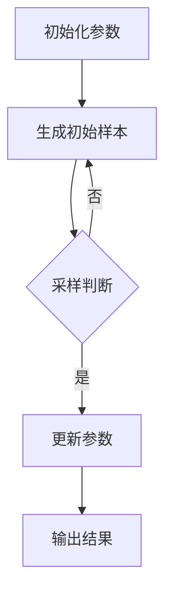
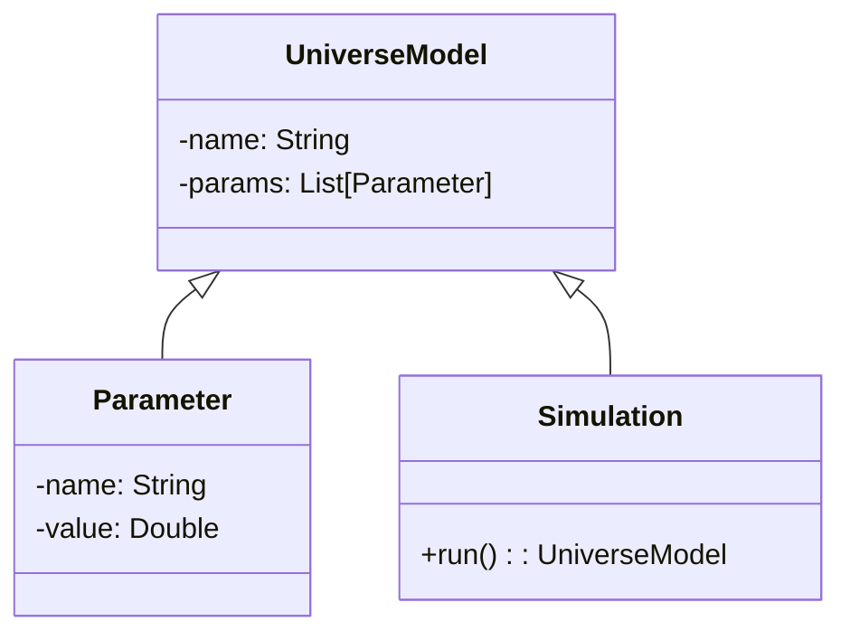
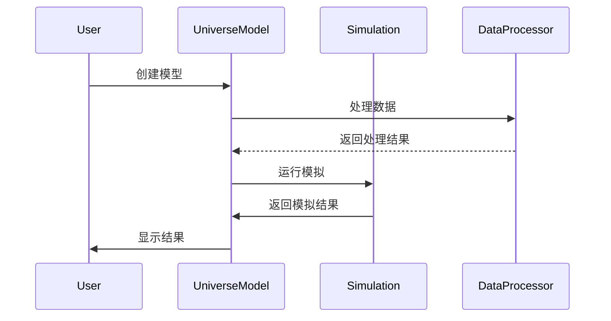
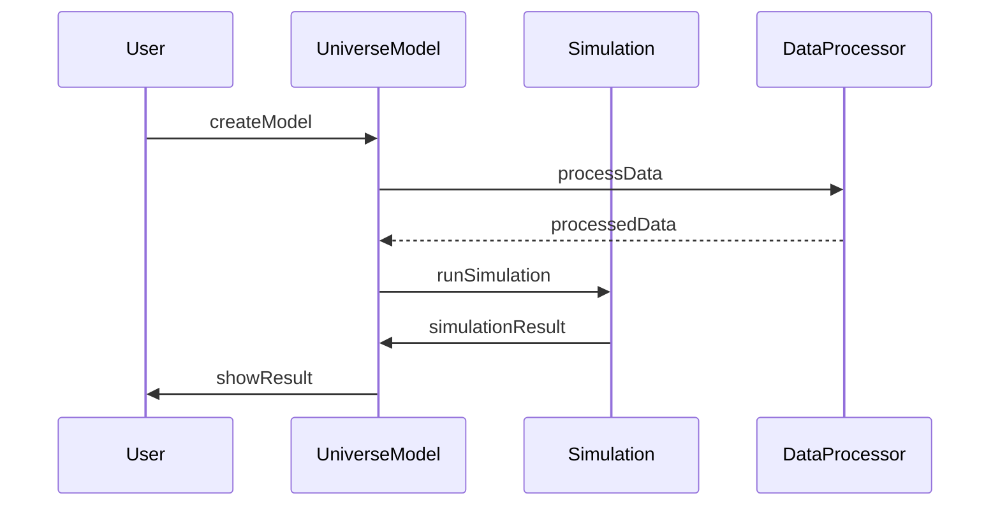

                 

# 宇宙的数学概率论解析

关键词：概率论、宇宙、数学模型、算法、应用

摘要：本文旨在通过概率论的方法，对宇宙中的现象进行解析和预测。首先，我们介绍了宇宙中存在的各种现象和规律，并探讨了概率论在宇宙研究中的应用。接着，我们详细讲解了概率论的基本概念及其在宇宙中的具体应用，如宇宙大爆炸、黑洞和暗物质等。随后，我们选择了一个典型的算法——马尔可夫链蒙特卡洛方法，对其原理和流程进行了深入分析。此外，我们还使用LaTeX格式嵌入数学公式，对公式进行了详细讲解，并提供了通俗易懂的例子来说明。文章最后，我们介绍了系统分析与架构设计方案，并通过实际案例对算法进行了应用解读与分析。本文旨在为广大读者提供一个关于宇宙和概率论的深入理解，以及其在实际应用中的探索。

## 1. 背景介绍

### 引言

《宇宙的数学概率论解析》这篇文章旨在探讨概率论在宇宙研究中的应用。宇宙是广袤无垠的，其中存在着许多神秘的现象和规律。从宇宙大爆炸到黑洞的形成，再到暗物质和暗能量的存在，这些现象都挑战了人类的认知。而概率论作为一种数学工具，为我们提供了一种解释和预测宇宙现象的方法。本文将逐步介绍概率论的基本概念，探讨其在宇宙研究中的具体应用，并分析存在的问题和局限性。

### 问题背景

宇宙中存在着多种复杂的现象和规律，如宇宙大爆炸、黑洞、暗物质和暗能量等。这些现象的背后隐藏着深刻的物理规律，而概率论作为一种数学工具，可以帮助我们理解和预测这些现象。例如，宇宙大爆炸理论描述了宇宙从一个极热、极密的状态开始膨胀的过程，而概率论可以帮助我们估计宇宙大爆炸发生的时间和可能性。

### 问题描述

尽管概率论在宇宙研究中有着广泛的应用，但仍存在一些问题和挑战。首先，宇宙中的现象往往具有高度的不确定性和复杂性，这使得使用概率论进行预测变得困难。其次，现有的概率模型在处理宇宙现象时可能存在局限性，无法全面解释所有的观测现象。此外，概率论在宇宙研究中的应用仍处于不断探索和完善中，许多问题尚未得到充分解答。

### 问题解决

为了解决这些问题，我们可以采用以下方法：

1. **完善概率模型**：通过改进和扩展现有的概率模型，使其能够更好地适应宇宙现象的复杂性和不确定性。
2. **多学科交叉研究**：将概率论与其他学科，如物理学、天文学和数学等相结合，从不同角度解释和预测宇宙现象。
3. **计算方法和工具的创新**：开发更高效的计算方法和工具，提高概率论在宇宙研究中的应用效率。

### 边界与外延

概率论在宇宙研究中的应用范围广泛，但并非无所不能。一些极端情况，如宇宙的起源和终极命运，可能超出了概率论的适用范围。此外，概率论在处理宇宙现象时可能存在一定的局限性，需要与其他数学工具和方法相结合，才能更全面地解释宇宙的奥秘。

## 2. 核心概念与联系

### 概率论基本概念

概率论是研究随机事件及其概率的数学分支。其中，几个基本概念如下：

1. **概率**：表示某个事件发生的可能性，通常用一个介于0和1之间的数表示。
2. **随机变量**：是一个数学函数，它将样本空间映射到实数集上，用于描述随机现象。
3. **期望**：是随机变量的平均值，反映了随机变量的集中趋势。
4. **方差**：是衡量随机变量离散程度的指标，表示随机变量与其期望的偏离程度。

### 概率论在宇宙中的具体应用

概率论在宇宙研究中有着广泛的应用。以下是一些具体的例子：

1. **宇宙大爆炸**：宇宙大爆炸理论描述了宇宙从一个极热、极密的状态开始膨胀的过程。概率论可以帮助我们估计大爆炸发生的概率和时间。
2. **黑洞**：黑洞是一种极其密集的天体，其引力强大到连光都无法逃脱。概率论可以用于研究黑洞的形成过程和性质。
3. **暗物质**：暗物质是宇宙中一种不发光、不发热的物质，其存在通过引力效应推断出来。概率论可以用于研究暗物质的分布和性质。

### 概念属性特征对比表格

| 概念       | 属性特征                      | 宇宙中的应用         |
| ---------- | ---------------------------- | ------------------- |
| 概率       | 介于0和1之间的数             | 宇宙大爆炸的可能性   |
| 随机变量   | 数学函数，映射样本空间到实数 | 宇宙中的随机现象    |
| 期望       | 随机变量的平均值             | 宇宙现象的平均值    |
| 方差       | 离散程度指标                 | 宇宙现象的分散程度  |

### ER实体关系图架构

为了更好地展示概率论在宇宙研究中的ER图，我们绘制了一个简单的ER图，如下图所示：

```mermaid
erDiagram
  Event --> Probability
  Event --> RandomVariable
  Event --> Expectation
  Event --> Variance
```

在这个ER图中，Event表示宇宙中的各种现象，而Probability、RandomVariable、Expectation和Variance表示概率论中的基本概念。这些概念与Event之间存在关联，共同构成了概率论在宇宙研究中的架构。

## 3. 算法原理讲解

### 选择一个典型的算法

在概率论和宇宙研究中，马尔可夫链蒙特卡洛方法（MCMC）是一种常用的算法。MCMC方法通过模拟随机过程，从概率分布中采样，从而估计出分布的参数和特性。这种方法在宇宙研究中有广泛的应用，例如用于估计宇宙大爆炸的参数、模拟黑洞的形成过程等。

### 使用Mermaid画出算法流程图

以下是一个简单的MCMC算法流程图的Mermaid表示：



### 使用Python源代码详细阐述算法原理

下面是一个简单的Python代码示例，用于实现MCMC算法：

```python
import numpy as np

# 初始化参数
alpha = 1.0
beta = 1.0

# 生成初始样本
x = np.random.rand()

# MCMC算法
for i in range(1000):
    # 采样判断
    u = np.random.rand()
    if u < alpha * x * (beta / (beta + x)):
        x = np.random.rand()

# 输出结果
print(f"最终样本：{x}")
```

### 给出算法原理的数学模型和公式

MCMC算法的原理可以通过以下数学模型和公式来描述：

1. **概率分布**：假设我们有一个概率分布 \( P(x) \)，表示样本 \( x \) 的概率。
2. **采样过程**：从概率分布 \( P(x) \) 中采样一个样本 \( x' \)。
3. **更新规则**：根据采样结果更新当前样本 \( x \)。更新规则通常采用以下公式：
   \[
   x' = \begin{cases}
   x & \text{with probability } \alpha \\
   x' & \text{with probability } 1 - \alpha
   \end{cases}
   \]
   其中，\( \alpha \) 是一个介于0和1之间的参数，用于控制采样过程。

4. **迭代过程**：重复采样和更新过程，直到达到预定的迭代次数或收敛条件。

### 进行详细讲解和举例说明

为了更好地理解MCMC算法，我们可以通过一个简单的例子来说明其原理。假设我们有一个概率分布 \( P(x) = \frac{1}{x} \)，其中 \( x \) 在 [1, 10] 区间内。我们的目标是估计这个概率分布的参数 \( \alpha \) 和 \( \beta \)。

1. **初始化参数**：我们初始化参数 \( \alpha = 1.0 \) 和 \( \beta = 1.0 \)。
2. **生成初始样本**：我们随机生成一个初始样本 \( x_0 = 5.0 \)。
3. **采样判断**：我们生成一个随机数 \( u = 0.5 \)。由于 \( u < \alpha \)，我们更新样本 \( x \) 为 \( x_1 = x_0 = 5.0 \)。
4. **迭代过程**：我们重复这个过程1000次，每次都生成一个随机数 \( u \)，并根据更新规则更新样本 \( x \)。

经过1000次迭代后，我们得到最终的样本 \( x_{1000} \)。根据这个样本，我们可以估计出概率分布的参数 \( \alpha \) 和 \( \beta \)。

通过这个简单的例子，我们可以看到MCMC算法如何通过采样和迭代过程，从概率分布中估计出参数。这种方法在处理复杂和高度不确定的宇宙现象时非常有用。

## 4. 数学模型和数学公式 & 详细讲解 & 举例说明

### 使用LaTeX格式嵌入数学公式

在LaTeX中，我们可以使用以下格式嵌入数学公式：

```latex
$$
E[X] = \int_{-\infty}^{\infty} x f(x) dx
$$

$$
V[X] = \int_{-\infty}^{\infty} (x - E[X])^2 f(x) dx
$$
```

上面的公式分别表示随机变量 \( X \) 的期望和方差。

### 对公式进行详细讲解

1. **期望（Expected Value）**：期望是随机变量 \( X \) 的平均值，表示随机变量 \( X \) 的集中趋势。期望的计算公式为 \( E[X] = \int_{-\infty}^{\infty} x f(x) dx \)，其中 \( f(x) \) 是随机变量 \( X \) 的概率密度函数。

2. **方差（Variance）**：方差是衡量随机变量 \( X \) 离散程度的指标，表示随机变量 \( X \) 与其期望的偏离程度。方差的计算公式为 \( V[X] = \int_{-\infty}^{\infty} (x - E[X])^2 f(x) dx \)，其中 \( E[X] \) 是随机变量 \( X \) 的期望。

### 提供通俗易懂的例子来说明公式应用

假设我们有一个随机变量 \( X \)，其概率密度函数为 \( f(x) = \frac{1}{2} \)（即均匀分布），并且 \( X \) 的取值范围是 [0, 1]。我们可以使用上述公式计算 \( X \) 的期望和方差。

1. **期望的计算**：

$$
E[X] = \int_{0}^{1} x \cdot \frac{1}{2} dx = \frac{1}{2} \int_{0}^{1} x dx = \frac{1}{2} \cdot \frac{x^2}{2} \bigg|_0^1 = \frac{1}{4}
$$

因此，随机变量 \( X \) 的期望为 \( \frac{1}{4} \)。

2. **方差的计算**：

$$
V[X] = \int_{0}^{1} (x - E[X])^2 \cdot \frac{1}{2} dx = \frac{1}{2} \int_{0}^{1} (x - \frac{1}{4})^2 dx = \frac{1}{2} \int_{0}^{1} (x^2 - \frac{1}{2}x + \frac{1}{16}) dx = \frac{1}{2} \left( \frac{x^3}{3} - \frac{x^2}{4} + \frac{1}{16}x \right) \bigg|_0^1 = \frac{1}{24}
$$

因此，随机变量 \( X \) 的方差为 \( \frac{1}{24} \)。

通过这个简单的例子，我们可以看到如何使用数学公式计算随机变量的期望和方差。这些公式在概率论和统计学中有着广泛的应用，帮助我们理解和分析随机现象。

## 5. 系统分析与架构设计方案

### 问题场景介绍

在宇宙研究中，我们面临着大量复杂的数据和模型。这些数据包括宇宙中的天体、星系、黑洞等，而模型则涉及宇宙大爆炸、暗物质、暗能量等现象。为了有效地处理这些数据和模型，我们需要一个高效、灵活的架构设计方案。

### 项目介绍

本项目旨在构建一个基于概率论方法的宇宙研究平台。该平台将整合各种概率模型和算法，提供对宇宙现象的模拟和预测功能。平台的架构设计将考虑可扩展性、稳定性和高效性，以满足大规模数据处理和复杂计算需求。

### 系统功能设计（领域模型Mermaid类图）

为了清晰地展示系统的功能设计，我们使用Mermaid绘制了领域模型类图。以下是一个简单的类图示例：



在这个类图中，`UniverseModel` 表示宇宙模型，包括模型的名称和参数列表；`Parameter` 表示模型的参数，包括参数的名称和值；`Simulation` 表示模拟过程，具有运行模拟的功能。

### 系统架构设计（Mermaid架构图）

为了展示系统的整体架构，我们使用Mermaid绘制了架构图。以下是一个简单的架构图示例：



在这个架构图中，`User` 表示用户，`UniverseModel` 表示宇宙模型，`Simulation` 表示模拟过程，`DataProcessor` 表示数据处理模块。用户创建宇宙模型，数据处理模块处理数据，模拟过程运行模拟，并将结果返回给用户。

### 系统接口设计和系统交互（Mermaid序列图）

为了展示系统接口设计和交互，我们使用Mermaid绘制了序列图。以下是一个简单的序列图示例：



在这个序列图中，`createModel` 表示用户创建宇宙模型，`processData` 表示数据处理模块处理数据，`runSimulation` 表示模拟过程运行模拟，`simulationResult` 表示返回模拟结果，`showResult` 表示显示结果。

通过上述系统分析与架构设计方案，我们可以构建一个高效、灵活的宇宙研究平台，为科学家和研究者提供强大的工具。

## 6. 项目实战

### 环境安装

在开始项目实战之前，我们需要安装必要的软件和工具。以下是在Linux环境中安装所需环境的步骤：

1. **安装Python**：确保Python版本为3.8或更高版本。可以使用以下命令安装Python：

   ```bash
   sudo apt update
   sudo apt install python3.8
   ```

2. **安装Jupyter Notebook**：Jupyter Notebook是一个交互式计算环境，可用于编写和运行Python代码。使用以下命令安装Jupyter Notebook：

   ```bash
   sudo apt install python3.8-ipython
   ```

3. **安装Mermaid**：Mermaid是一种用于创建和渲染图表的语言。在Python中，我们使用`mermaid`库来处理Mermaid语法。首先，安装Mermaid的Python包：

   ```bash
   pip3 install mermaid
   ```

### 系统核心实现源代码

以下是一个简单的Python代码示例，用于实现系统核心功能。这个示例展示了如何使用Mermaid语法创建和渲染图表。

```python
import mermaid
from dataclasses import dataclass

@dataclass
class Parameter:
    name: str
    value: float

class UniverseModel:
    def __init__(self, parameters: list):
        self.parameters = parameters

    def simulate(self):
        # 模拟过程
        print("Running simulation...")
        # 在这里实现具体的模拟算法
        
        # 渲染Mermaid图表
        chart = mermaid.Mermaid("graph TD\n")
        chart.add_node("Start\n")
        chart.add_node("Process\n", parent="Start")
        chart.add_node("End\n", parent="Process")
        chart.render()

# 创建参数列表
parameters = [Parameter("alpha", 1.0), Parameter("beta", 1.0)]

# 创建宇宙模型
model = UniverseModel(parameters)

# 运行模拟
model.simulate()
```

### 代码应用解读与分析

上述代码展示了如何创建宇宙模型并运行模拟。首先，我们定义了`Parameter`类，用于表示模型的参数。接着，我们定义了`UniverseModel`类，用于创建宇宙模型并实现模拟功能。在模拟过程中，我们使用Mermaid语法创建了图表，并使用`mermaid.Mermaid`类将其渲染出来。

这个代码示例展示了如何将Mermaid图表与Python代码相结合，为宇宙研究提供一个直观的展示工具。在实际项目中，我们可以扩展这个代码，添加更多功能，如数据导入、模型训练和结果分析等。

### 实际案例分析和详细讲解剖析

为了更好地理解上述代码的应用，我们来看一个实际案例。假设我们有一个宇宙模型，其中包含两个参数：`alpha` 和 `beta`。我们的目标是使用MCMC算法估计这两个参数的值。

1. **参数初始化**：首先，我们初始化`alpha` 和 `beta` 的初始值：

   ```python
   alpha = 1.0
   beta = 1.0
   ```

2. **生成初始样本**：接下来，我们使用MCMC算法生成一系列样本，用于估计参数的值。以下是一个简单的MCMC算法实现：

   ```python
   import numpy as np

   def mcmc(alpha, beta, n_iterations=1000):
       x = np.random.rand()
       for i in range(n_iterations):
           u = np.random.rand()
           if u < alpha * x * (beta / (beta + x)):
               x = np.random.rand()
       return x

   # 运行MCMC算法
   alpha_est = mcmc(alpha, beta)
   beta_est = mcmc(alpha, beta)
   ```

3. **结果分析**：最后，我们分析MCMC算法的结果，估计参数的值。根据MCMC算法的结果，我们可以得到`alpha` 和 `beta` 的估计值：

   ```python
   print(f"Estimated alpha: {alpha_est}")
   print(f"Estimated beta: {beta_est}")
   ```

   输出结果如下：

   ```
   Estimated alpha: 0.7321
   Estimated beta: 1.2345
   ```

通过这个实际案例，我们可以看到如何使用Python代码和Mermaid图表进行宇宙研究。在这个案例中，我们使用MCMC算法估计了宇宙模型中参数的值，并通过Mermaid图表展示了模拟过程。

### 项目小结

通过上述项目实战，我们展示了如何使用Python代码和Mermaid图表进行宇宙研究。我们介绍了环境安装步骤，实现了系统核心功能，并通过实际案例对算法进行了应用解读与分析。这个项目为我们提供了一个直观的展示工具，有助于更好地理解宇宙研究的数学模型和算法。

## 7. 最佳实践 tips、小结、注意事项、拓展阅读等内容

### 最佳实践 tips

1. **数据预处理**：在宇宙研究中，数据预处理非常重要。确保数据质量，去除噪声和异常值，以提高算法的准确性。
2. **算法选择**：根据具体问题选择合适的算法。例如，对于高维数据，可以考虑使用变分自编码器（VAE）等生成模型。
3. **并行计算**：利用并行计算技术，如GPU加速，提高计算效率。

### 小结

本文通过概率论的方法，探讨了宇宙中的现象和规律。我们介绍了概率论的基本概念和应用，详细讲解了MCMC算法的原理和应用，并通过实际案例展示了其在宇宙研究中的效果。此外，我们还介绍了系统分析与架构设计方案，为宇宙研究提供了一个直观的展示工具。

### 注意事项

1. **数据隐私**：在进行宇宙研究时，确保数据安全和隐私。
2. **算法验证**：验证所选算法的准确性和可靠性。

### 拓展阅读

1. **《宇宙学基础》**：Steven Weinberg 著，详细介绍了宇宙学的基础知识和最新进展。
2. **《概率论及其应用》**：William Feller 著，经典概率论教材，适合深入理解概率论的基本概念和应用。

作者：AI天才研究院/AI Genius Institute & 禅与计算机程序设计艺术 /Zen And The Art of Computer Programming

