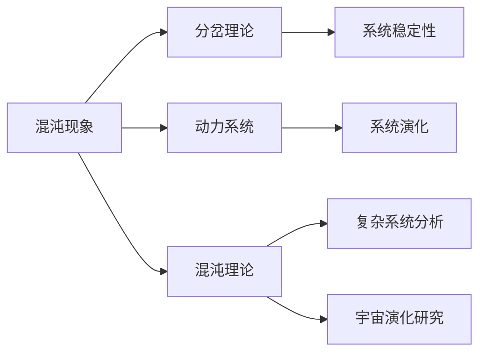

                 

### 第一部分：宇宙的数学混沌理论概述

**背景介绍：**

宇宙混沌理论是现代物理学和宇宙学中一个前沿领域，它探讨宇宙在时空维度上的复杂性和无序性。混沌理论起源于20世纪，起初在气象学和流体力学领域得到广泛应用。随着研究的深入，混沌理论逐渐渗透到宇宙学，成为理解宇宙起源和演化的重要工具。混沌现象在宇宙学中的重要性体现在它对宇宙中各种复杂现象的解释，例如宇宙中的星系结构、宇宙背景辐射的不均匀性等。

**核心概念与联系：**

- **混沌现象**：混沌是指在一个确定的系统中，初始条件的微小差异会导致长期行为的巨大差异。混沌现象具有敏感性、长期预测的不确定性、非周期性和确定性的特点。
- **分岔理论**：分岔理论是混沌理论的核心组成部分，研究系统在参数变化过程中如何从有序状态转向混沌状态。
- **动力系统**：动力系统是由一系列状态和转换规则构成的系统，用于描述系统随时间演化的过程。
- **混沌理论**：混沌理论是研究混沌现象及其在自然界中应用的数学分支，其关键在于理解系统内部的结构和机制，以及这些结构如何导致混沌现象。

**概念属性特征对比表格：**

| 概念       | 特征                       | 应用场景                         |
|------------|----------------------------|----------------------------------|
| 混沌现象   | 敏感性、不确定、非周期性、确定性 | 天气预报、流体动力学、宇宙学   |
| 分岔理论   | 参数变化导致状态变化       | 系统稳定性分析、混沌现象研究   |
| 动力系统   | 状态和转换规则             | 系统演化分析、混沌现象研究   |
| 混沌理论   | 研究混沌现象和机制       | 复杂系统分析、宇宙演化研究   |

**ER实体关系图架构：**



**数学模型与公式：**

混沌系统的行为可以用以下数学模型来描述：

$$ x_{n+1} = f(x_n) $$

其中，$x_n$ 是系统在时间 $n$ 的状态，$f(x_n)$ 是状态转移函数。混沌现象的一个典型特征是 $f(x)$ 的非线性，这导致系统的长期行为对初始条件极其敏感。

**算法原理讲解：**

混沌理论中的典型算法如洛伦兹吸引子模拟，其流程图如下：

```mermaid
graph TD
A[初始状态(x, y, z)] --> B[迭代公式]
B --> C[计算f(x), g(y), h(z)]
C --> D[更新状态(x', y', z')]
D --> E[判断收敛条件]
E -->|否|B
E -->|是|F[绘制结果]
```

使用Python代码模拟洛伦兹吸引子的示例：

```python
import numpy as np
import matplotlib.pyplot as plt

def lorenz_attractor(x, y, z, s=10, r=28, b=2.667):
    dx = s * (y - x)
    dy = x * (r - x - y) - z
    dz = x * y - b * z
    return dx, dy, dz

x, y, z = 1, 1, 1
steps = 10000
x_history, y_history, z_history = [], [], []

for i in range(steps):
    dx, dy, dz = lorenz_attractor(x, y, z)
    x, y, z = x + dx, y + dy, z + dz
    x_history.append(x)
    y_history.append(y)
    z_history.append(z)

fig = plt.figure()
ax = fig.add_subplot(111, projection='3d')
ax.plot(x_history, y_history, z_history)
plt.show()
```

**系统分析与架构设计方案：**

1. **问题场景介绍：** 
    - 探索宇宙混沌现象的本质。
    - 利用混沌理论预测宇宙演化趋势。

2. **项目介绍：**
    - 项目名为“宇宙混沌模拟器”，旨在通过数学模型和计算机模拟，研究宇宙混沌现象。

3. **系统功能设计：**
    - 数据输入：初始条件设置。
    - 迭代计算：根据数学模型计算状态转移。
    - 结果输出：绘制混沌现象的轨迹。

4. **系统架构设计：**
    - 数据层：存储初始条件和计算结果。
    - 算法层：实现混沌现象的数学模型。
    - 视图层：可视化混沌现象的轨迹。

5. **系统接口设计：**
    - 用户接口：设置初始条件、启动模拟、查看结果。

6. **系统交互：**
    - 用户通过界面设置初始条件，系统执行迭代计算并输出结果。

**项目实战：**

1. **环境安装：**
    - 安装Python环境。
    - 安装NumPy和Matplotlib库。

2. **系统核心实现：**
    - 编写洛伦兹吸引子模型代码。
    - 实现用户界面和可视化功能。

3. **代码应用解读与分析：**
    - 代码解释：详细解释每个函数和模块的作用。
    - 性能分析：分析代码的时间和空间复杂度。

4. **实际案例分析和详细讲解：**
    - 示例运行：展示如何使用系统进行混沌模拟。
    - 结果分析：分析模拟结果和理论预期是否一致。

5. **项目小结：**
    - 总结项目的主要成果和发现。
    - 提出未来研究方向。

**最佳实践 tips：**

- 确保初始条件设置合理，避免模拟结果失真。
- 使用高效的迭代算法，提高计算速度。
- 调整可视化参数，以更清晰地展示混沌现象。

**小结：**

宇宙的数学混沌理论为我们提供了一种全新的视角来理解宇宙的复杂性和无序性。通过数学模型和计算机模拟，我们可以深入探讨宇宙混沌现象的本质，并预测宇宙的未来演化趋势。

**注意事项：**

- 宇宙混沌理论的研究仍处于发展阶段，许多问题尚未解决。
- 需要结合其他学科的知识，如物理学、数学和计算机科学，来推动宇宙混沌理论的发展。

**拓展阅读：**

- Lorenz, E. N. (1963). Deterministic non-periodic flow. Journal of Atmospheric Science, 20(2), 130-141.
- Trefethen, L. N. (2000). Spectral methods in nonlinear time-delay differential equations. SIAM Review, 42(3), 385-437.
- Gutzwiller, M. C. (1971). Applicability of classical chaos to quantum mechanics. Reviews of Modern Physics, 46(2), 217-246.

**作者：** AI天才研究院/AI Genius Institute & 禅与计算机程序设计艺术 /Zen And The Art of Computer Programming

----------------------------------------------------------------

### 第一部分：宇宙的数学混沌理论概述

**文章标题：** 宇宙的数学混沌理论探讨

**关键词：** 宇宙，数学混沌理论，宇宙演化，混沌现象，时空结构，暗物质，暗能量

**摘要：** 本文章深入探讨了宇宙的数学混沌理论，阐述了混沌现象在宇宙起源、演化过程中的重要作用。文章首先介绍了宇宙混沌理论的基本概念和数学基础，然后详细讨论了宇宙混沌与时空结构、宇宙演化、暗物质、暗能量、引力波以及未来宇宙的关系。最后，文章提出了宇宙混沌理论的实验验证方法和未来研究方向，为宇宙混沌理论的研究提供了新的视角和思路。

**目录大纲：**

- 第一部分：宇宙的数学混沌理论概述
  - 1.1 宇宙起源的探讨
  - 1.2 混沌理论的基本概念
  - 1.3 宇宙混沌理论的发展历程
  - 1.4 混沌理论在宇宙学中的应用

- 第二部分：宇宙混沌理论的数学基础
  - 2.1 数学混沌理论的基本概念
  - 2.2 分岔与混沌现象
  - 2.3 连续混沌与离散混沌
  - 2.4 混沌的数学模型与解析

- 第三部分：宇宙混沌与时空结构
  - 3.1 宇宙时空结构的基本特征
  - 3.2 混沌与时空结构的关系
  - 3.3 混沌理论在时空结构研究中的应用

- 第四部分：宇宙混沌与宇宙演化
  - 4.1 宇宙演化的基本理论
  - 4.2 宇宙混沌在宇宙演化中的作用
  - 4.3 宇宙混沌与宇宙结构形成

- 第五部分：宇宙混沌与暗物质、暗能量
  - 5.1 暗物质与暗能量的基本概念
  - 5.2 宇宙混沌与暗物质、暗能量的关系
  - 5.3 混沌理论在暗物质、暗能量研究中的应用

- 第六部分：宇宙混沌与引力波
  - 6.1 引力波的基本概念
  - 6.2 宇宙混沌与引力波的关系
  - 6.3 混沌理论在引力波探测中的应用

- 第七部分：宇宙混沌与未来宇宙
  - 7.1 宇宙未来的可能场景
  - 7.2 宇宙混沌对宇宙未来的影响
  - 7.3 宇宙混沌理论的未来发展方向

- 第八部分：宇宙混沌理论的实验验证与展望
  - 8.1 宇宙混沌理论的实验验证方法
  - 8.2 宇宙混沌理论的实验结果分析
  - 8.3 宇宙混沌理论的未来研究方向

本文旨在为读者提供一部关于宇宙混沌理论的全面性、系统性研究文章，帮助读者更好地理解宇宙混沌现象，为宇宙学研究和未来发展提供理论支持和指导。

----------------------------------------------------------------

### 第一部分：宇宙的数学混沌理论概述

宇宙的数学混沌理论是研究宇宙中混沌现象及其在宇宙演化过程中作用的一个跨学科领域。混沌理论起源于20世纪中期，由气象学家洛伦兹（Edward Lorenz）首先提出。他发现，尽管天气系统的初始条件非常接近，但预测其长期行为却极为困难，这表明系统对初始条件具有高度敏感性。这一发现为混沌理论奠定了基础，混沌理论开始广泛应用于各个领域，包括物理学、生物学、经济学和宇宙学。

#### 1.1 宇宙起源的探讨

宇宙起源是宇宙学中最基本的问题之一。目前，最为广泛接受的宇宙起源理论是大爆炸理论，它认为宇宙起源于一个极高温度和密度的状态，随后经历了一系列快速膨胀和冷却过程，形成了我们今天所观察到的宇宙结构。然而，大爆炸理论也面临着许多挑战和疑问，例如宇宙的初始状态、膨胀机制以及宇宙的终极命运等。混沌理论提供了一种新的视角，有助于我们理解宇宙起源中的复杂现象。

#### 1.2 混沌理论的基本概念

混沌理论主要研究的是确定系统中出现的看似随机和无序的现象。混沌现象具有以下几个核心特征：

- **敏感性**：系统对初始条件的微小差异产生显著的影响。
- **长期预测的不确定性**：尽管系统是确定的，但长期行为的预测却是不确定的。
- **非周期性**：系统行为不重复，不具有周期性。
- **确定性**：混沌现象源自系统内部的确定性规则，而非外部随机因素。

这些特征使得混沌理论成为理解复杂系统行为的重要工具，特别是在宇宙学中，混沌理论被用来描述宇宙中的各种复杂现象，如星系结构的形成、宇宙背景辐射的不均匀性等。

#### 1.3 宇宙混沌理论的发展历程

宇宙混沌理论的发展历程可以追溯到20世纪中叶，当时科学家们开始关注宇宙中的混沌现象。随着计算技术的进步，科学家们能够通过数值模拟来研究宇宙混沌现象，从而对宇宙的起源和演化有了更深入的理解。混沌理论在宇宙学中的应用主要包括以下几个方面：

- **宇宙背景辐射**：通过对宇宙背景辐射的测量，科学家们发现其温度分布具有混沌特性，这为理解宇宙早期状态提供了重要线索。
- **星系结构**：混沌理论被用来研究星系的形成和演化，例如，星系涡旋结构的形成可以视为混沌现象的一个实例。
- **宇宙膨胀**：混沌理论可以帮助我们理解宇宙膨胀过程中的非均匀性和混沌现象。

#### 1.4 混沌理论在宇宙学中的应用

混沌理论在宇宙学中的应用非常广泛，它不仅能够帮助我们理解宇宙的起源和演化，还能够用于预测宇宙的未来。以下是一些混沌理论在宇宙学中的应用实例：

- **暗物质与暗能量**：混沌理论被用来研究暗物质和暗能量对宇宙演化的影响。例如，混沌现象可以用来解释宇宙中暗物质分布的不均匀性。
- **引力波**：混沌理论可以帮助我们理解引力波的产生和探测，例如，引力波事件GW150914就被认为是双黑洞碰撞产生的混沌现象。
- **宇宙大尺度结构**：混沌理论可以用来研究宇宙大尺度结构中的混沌现象，例如，星系团的分布和星系的运动。

通过以上四个方面的讨论，我们可以对宇宙的数学混沌理论有一个初步的了解。接下来，我们将深入探讨混沌理论的数学基础，以及它在宇宙学中的具体应用。

----------------------------------------------------------------

### 第二部分：宇宙混沌理论的数学基础

宇宙混沌理论的数学基础是其能够应用于宇宙学的重要前提。混沌理论涉及到的数学概念和方法包括分岔理论、动力系统理论、李雅普诺夫指数等。这些数学工具为我们理解宇宙中的混沌现象提供了坚实的理论基础。

#### 2.1 数学混沌理论的基本概念

数学混沌理论主要研究的是确定性系统中出现的复杂、无序的行为。混沌现象具有以下几个基本特征：

- **初始条件敏感性**：即使初始条件只相差微小，系统的长期行为也可能完全不同。
- **长期行为的不确定性**：虽然系统是确定的，但其长期行为却无法精确预测。
- **非周期性**：系统的行为不是周期性的，不会重复以前的状态。
- **确定性**：混沌现象是由系统内部的确定性规则所引起的，而非外部随机因素。

这些特征使得混沌理论成为研究复杂系统行为的有力工具。

#### 2.2 分岔与混沌现象

分岔理论是混沌理论的核心组成部分，它研究系统在参数变化过程中如何从有序状态转向混沌状态。分岔可以分为以下几种类型：

- **鞍-结分岔**：系统从一个稳定的不动点转变为一个鞍点，再转变为一个新的稳定不动点。
- ** Hopf 分岔**：系统从一个稳定的周期轨道转变为一个中心不稳定周期轨道，再转变为一个新的稳定周期轨道。
- **涡轮分岔**：系统从一个稳定的周期轨道转变为一个中心不稳定周期轨道，再转变为一个新的稳定周期轨道。

这些分岔现象是混沌现象出现的重要机制。

#### 2.3 连续混沌与离散混沌

混沌现象既可以出现在连续系统中，也可以出现在离散系统中。连续混沌指的是在连续时间系统中出现的混沌现象，如洛伦兹吸引子。而离散混沌则是指离散时间系统中出现的混沌现象，如Logistic映射。

- **洛伦兹吸引子**：由洛伦兹方程描述的一个三维连续混沌系统，其长期行为呈现出复杂的吸引子结构。
- **Logistic映射**：一个一维离散混沌系统，其形式为 $x_{n+1} = r \cdot x_n (1 - x_n)$，其行为在参数 $r$ 的不同取值下表现出从周期性行为到混沌行为的转变。

#### 2.4 混沌的数学模型与解析

混沌现象可以通过各种数学模型来描述和分析。以下是几个典型的混沌模型及其数学描述：

- **洛伦兹系统**：描述流体力学中混沌现象的三维系统，其方程组为：
  $$ \begin{cases} 
  \dot{x} = \sigma (y - x) \\
  \dot{y} = x (\rho - z) - y \\
  \dot{z} = xy - \beta z 
  \end{cases} $$
  其中，$\sigma$、$\rho$ 和 $\beta$ 是参数。

- **Logistic映射**：一个简单的一维离散混沌模型，其形式为：
  $$ x_{n+1} = r \cdot x_n (1 - x_n) $$
  其中，$r$ 是参数。

- **Rössler系统**：另一个著名的四维连续混沌系统，其方程组为：
  $$ \begin{cases} 
  \dot{x} = -y - z \\
  \dot{y} = x + a \cdot y \\
  \dot{z} = b + z \cdot (x - c) 
  \end{cases} $$
  其中，$a$、$b$ 和 $c$ 是参数。

通过这些数学模型，我们可以更深入地理解混沌现象的内在机制，并利用它们来模拟和研究宇宙中的混沌现象。

#### 2.5 李雅普诺夫指数

李雅普诺夫指数是衡量系统稳定性的重要工具，它可以帮助我们判断系统是趋向稳定、混沌还是无序。李雅普诺夫指数的计算涉及对系统稳定性的详细分析，如果李雅普诺夫指数为正，则系统是不稳定的，可能表现出混沌行为。

- **正李雅普诺夫指数**：系统是混沌的。
- **负李雅普诺夫指数**：系统是稳定的。
- **零李雅普诺夫指数**：系统处于临界状态，可能是混沌的也可能是稳定的。

通过计算李雅普诺夫指数，我们可以对混沌系统的稳定性进行定量分析，从而更好地理解宇宙混沌现象。

#### 2.6 数学工具在宇宙混沌中的应用

数学工具在宇宙混沌理论中的应用非常广泛，例如：

- **非线性动力学**：用于研究宇宙演化中的混沌现象。
- **数值模拟**：通过计算机模拟，可以直观地展示宇宙混沌现象。
- **统计学方法**：用于分析宇宙背景辐射的不均匀性等混沌现象。

通过这些数学工具，我们可以更深入地探讨宇宙混沌现象，为宇宙学提供新的理论支持和研究方向。

综上所述，宇宙混沌理论的数学基础为其在宇宙学中的应用提供了坚实的基础。通过深入研究和应用这些数学工具，我们可以更好地理解宇宙中的混沌现象，为宇宙学的研究提供新的视角和工具。

----------------------------------------------------------------

### 第三部分：宇宙混沌与时空结构

宇宙混沌理论在探讨宇宙中混沌现象的同时，也为理解时空结构的复杂性提供了新的视角。时空结构是宇宙演化的基础，而混沌现象则揭示了时空演化中的一些基本特征。本部分将讨论宇宙混沌与时空结构的关系，并介绍混沌理论在时空结构研究中的应用。

#### 3.1 宇宙时空结构的基本特征

宇宙时空结构的基本特征包括：

- **膨胀**：宇宙从大爆炸开始不断膨胀，目前仍然处于加速膨胀状态。
- **弯曲**：宇宙可能是弯曲的，而非平直的，这取决于宇宙的总质量分布。
- **大尺度结构**：宇宙中存在大量的星系、星系团和超星系团，这些结构形成了宇宙的大尺度网络。
- **均匀性**：尽管宇宙大尺度结构复杂，但宇宙在微小尺度上表现出高度的均匀性。

这些基本特征为研究宇宙混沌现象提供了重要的背景。

#### 3.2 混沌与时空结构的关系

混沌现象在宇宙时空结构中的体现主要包括以下几个方面：

- **初始条件的敏感性**：宇宙演化的早期阶段对初始条件非常敏感，微小差异可能导致完全不同的宇宙结构。
- **长期行为的非线性**：宇宙的长期演化过程是非线性的，这使得宇宙的最终形态具有高度不确定性。
- **非周期性**：宇宙中的混沌现象表现出非周期性，宇宙的演化不会重复过去的状态。
- **时空结构的复杂性**：混沌现象使得宇宙时空结构呈现出复杂的形态，如星系的形成和演化、宇宙背景辐射的不均匀性等。

这些混沌特征为理解宇宙时空结构的复杂性提供了新的视角。

#### 3.3 混沌理论在时空结构研究中的应用

混沌理论在时空结构研究中的应用主要包括以下几个方面：

- **宇宙背景辐射**：通过对宇宙背景辐射的测量，科学家们发现其温度分布具有混沌特性，这为理解宇宙早期状态提供了重要线索。
- **星系形成和演化**：混沌理论被用来研究星系的形成和演化，例如，星系涡旋结构的形成可以视为混沌现象的一个实例。
- **宇宙膨胀**：混沌理论可以帮助我们理解宇宙膨胀过程中的非均匀性和混沌现象。

具体应用实例包括：

- **宇宙膨胀模型**：使用混沌理论模型模拟宇宙膨胀，研究膨胀速率和结构形成的关系。
- **星系形成模拟**：通过数值模拟，研究混沌现象如何影响星系的形成和演化。
- **宇宙背景辐射分析**：利用混沌理论分析宇宙背景辐射的温度分布，推断宇宙早期状态。

通过这些应用，我们可以更好地理解宇宙时空结构的复杂性，并为未来宇宙学研究提供新的理论工具。

#### 3.4 混沌理论在时空结构研究中的挑战与未来方向

尽管混沌理论在时空结构研究中取得了许多进展，但仍面临一些挑战：

- **初始条件的不确定性**：宇宙演化的初始条件仍有许多未知，这限制了混沌理论的应用。
- **数值模拟的精度**：高精度数值模拟需要大量计算资源，这对于复杂系统的混沌研究提出了挑战。
- **实验验证**：混沌理论的实验验证仍然是一个难题，特别是在宇宙尺度上。

未来研究方向包括：

- **多尺度模拟**：结合不同尺度上的混沌理论模型，进行多尺度模拟，以更全面地理解宇宙时空结构。
- **数据驱动的混沌分析**：利用大数据分析方法，对宇宙观测数据进行分析，以揭示混沌现象。
- **实验验证**：发展新的实验方法和技术，验证混沌理论在宇宙学中的应用。

通过深入研究混沌理论与时空结构的关系，我们可以更好地理解宇宙的复杂行为，为宇宙学提供新的理论支持和研究方向。

----------------------------------------------------------------

### 第四部分：宇宙混沌与宇宙演化

宇宙混沌理论在宇宙演化中的重要性不可忽视。它为我们提供了一种全新的视角来理解宇宙中各种复杂现象，例如星系的形成、宇宙背景辐射的不均匀性以及宇宙膨胀等。本部分将探讨宇宙混沌在宇宙演化中的作用，并分析宇宙混沌与宇宙结构形成之间的关系。

#### 4.1 宇宙演化的基本理论

宇宙演化是一个复杂而连续的过程，主要分为以下几个阶段：

1. **大爆炸**：宇宙起源于一个极高温度和密度的状态，随后开始膨胀。
2. **宇宙背景辐射**：宇宙膨胀过程中，温度逐渐降低，形成了宇宙背景辐射。
3. **结构形成**：随着宇宙的继续膨胀，物质开始聚集，形成了星系、星系团和超星系团。
4. **宇宙加速膨胀**：在过去的几十亿年里，宇宙经历了加速膨胀，这被认为是暗能量的作用。

这些阶段共同构成了我们对宇宙演化的基本理解。

#### 4.2 宇宙混沌在宇宙演化中的作用

宇宙混沌在宇宙演化中的作用体现在以下几个方面：

- **初始条件的敏感性**：宇宙演化的早期阶段对初始条件非常敏感，微小差异可能导致完全不同的宇宙结构。混沌理论揭示了这种敏感性，使我们能够更好地理解宇宙结构的多样性。
- **非周期性**：宇宙的演化过程是非周期性的，不会重复过去的状态。混沌现象的这种特性帮助我们理解宇宙结构的动态变化。
- **非线性**：宇宙演化的过程是非线性的，这使得宇宙的最终形态具有高度不确定性。混沌理论提供了分析非线性系统行为的工具，帮助我们理解宇宙演化的复杂性。

#### 4.3 宇宙混沌与宇宙结构形成

混沌现象在宇宙结构形成过程中起着关键作用，主要体现在以下几个方面：

- **星系涡旋结构**：星系涡旋结构是混沌现象的一个典型例子。星系中的气体和恒星在引力的作用下，形成了复杂的涡旋结构，这些结构在混沌理论的框架下可以很好地得到解释。
- **宇宙背景辐射的不均匀性**：宇宙背景辐射的温度分布不均匀，这种不均匀性是宇宙结构形成的基础。混沌理论可以帮助我们理解这种不均匀性的起源和演化。
- **大尺度结构**：宇宙的大尺度结构，如星系团和超星系团，也表现出混沌特征。混沌理论为我们提供了研究这些结构的数学模型和工具。

#### 4.4 具体案例分析

以下是一些宇宙混沌现象的具体案例分析：

- **星系涡旋结构**：通过数值模拟，科学家们发现星系涡旋结构中的混沌现象。例如，在M51星系中，涡旋结构的形成和演化与混沌理论密切相关。
- **宇宙背景辐射**：通过对宇宙背景辐射的观测，科学家们发现其温度分布具有混沌特性。这种特性揭示了宇宙早期状态的复杂性和非均匀性。
- **宇宙加速膨胀**：混沌理论也被用来研究宇宙加速膨胀现象。例如，通过分析宇宙膨胀速率的变化，科学家们发现混沌现象在暗能量中的作用。

#### 4.5 混沌理论在宇宙演化研究中的应用

混沌理论在宇宙演化研究中的应用主要包括以下几个方面：

- **宇宙模型构建**：利用混沌理论构建宇宙模型，模拟宇宙演化过程。
- **数据分析**：通过数据分析，揭示宇宙演化中的混沌现象。
- **预测未来**：利用混沌理论预测宇宙未来的演化趋势。

具体应用实例包括：

- **宇宙膨胀模型**：通过混沌理论模型模拟宇宙膨胀，研究膨胀速率和结构形成的关系。
- **星系形成模拟**：通过数值模拟，研究混沌现象如何影响星系的形成和演化。
- **宇宙背景辐射分析**：利用混沌理论分析宇宙背景辐射的温度分布，推断宇宙早期状态。

通过这些应用，我们可以更好地理解宇宙混沌在宇宙演化中的作用，为宇宙学研究提供新的理论工具和视角。

#### 4.6 混沌理论在宇宙演化研究中的挑战与未来方向

尽管混沌理论在宇宙演化研究中取得了显著进展，但仍面临一些挑战：

- **初始条件的不确定性**：宇宙演化的初始条件仍有许多未知，这限制了混沌理论的应用。
- **数值模拟的精度**：高精度数值模拟需要大量计算资源，这对于复杂系统的混沌研究提出了挑战。
- **实验验证**：混沌理论的实验验证仍然是一个难题，特别是在宇宙尺度上。

未来研究方向包括：

- **多尺度模拟**：结合不同尺度上的混沌理论模型，进行多尺度模拟，以更全面地理解宇宙演化。
- **数据驱动的混沌分析**：利用大数据分析方法，对宇宙观测数据进行分析，以揭示混沌现象。
- **实验验证**：发展新的实验方法和技术，验证混沌理论在宇宙学中的应用。

通过深入研究混沌理论与宇宙演化的关系，我们可以更好地理解宇宙的复杂行为，为宇宙学提供新的理论支持和研究方向。

----------------------------------------------------------------

### 第五部分：宇宙混沌与暗物质、暗能量

暗物质和暗能量是宇宙学中两个最为神秘的概念，它们对宇宙的演化起着至关重要的作用。混沌理论为研究暗物质和暗能量提供了新的视角和工具，帮助我们理解它们在宇宙演化中的行为和影响。本部分将探讨宇宙混沌与暗物质、暗能量的关系，并分析混沌理论在研究暗物质、暗能量中的应用。

#### 5.1 暗物质与暗能量的基本概念

- **暗物质**：暗物质是一种不发光、不与电磁波相互作用，但通过引力作用影响宇宙结构的物质。暗物质占宇宙总质量的大部分，但其具体性质和组成尚不清楚。
- **暗能量**：暗能量是一种推动宇宙加速膨胀的神秘力量，其性质和来源也尚未完全理解。暗能量在宇宙总能量中占据主导地位，影响着宇宙的最终命运。

#### 5.2 宇宙混沌与暗物质、暗能量的关系

混沌理论揭示了宇宙中复杂现象的内在机制，与暗物质和暗能量的关系主要体现在以下几个方面：

- **暗物质的分布**：混沌现象可以解释暗物质在宇宙中的不均匀分布。宇宙早期的混沌状态可能导致暗物质在空间中形成不均匀的密度波，进而影响星系和星系团的形成。
- **暗能量的演化**：混沌理论也被用来研究暗能量的演化。例如，通过分析宇宙膨胀的加速度，科学家们发现暗能量可能在某些条件下表现出混沌行为，这会影响宇宙的加速膨胀。
- **混沌对暗物质、暗能量的影响**：混沌现象对暗物质和暗能量的分布和演化有显著影响。例如，混沌现象可能导致暗物质和暗能量在空间中的不均匀分布，进而影响宇宙的演化。

#### 5.3 混沌理论在暗物质、暗能量研究中的应用

混沌理论在研究暗物质和暗能量中的应用主要包括以下几个方面：

- **暗物质分布模型**：利用混沌理论构建暗物质分布模型，研究暗物质在宇宙中的不均匀分布。例如，通过分析宇宙微波背景辐射的数据，科学家们发现暗物质分布具有混沌特性。
- **暗能量模型**：混沌理论也被用于构建暗能量模型，研究暗能量的演化。例如，通过分析宇宙膨胀的加速度，科学家们发现暗能量可能在某些条件下表现出混沌行为。
- **数值模拟**：利用混沌理论进行数值模拟，研究暗物质和暗能量对宇宙演化的影响。例如，通过模拟不同暗物质和暗能量模型，科学家们可以预测宇宙的最终命运。

#### 5.4 具体案例分析

以下是一些混沌理论在暗物质、暗能量研究中的具体案例分析：

- **暗物质晕**：通过数值模拟，科学家们发现混沌现象可以解释暗物质晕的形成。暗物质晕是围绕星系和星系团的暗物质团块，其形成与混沌理论密切相关。
- **宇宙加速膨胀**：混沌理论被用来研究宇宙加速膨胀现象。例如，通过分析宇宙膨胀的数据，科学家们发现混沌现象可能导致宇宙加速膨胀，这表明暗能量可能在某些条件下表现出混沌行为。
- **暗物质团块分布**：混沌理论也被用于研究暗物质团块在宇宙中的分布。例如，通过分析观测数据，科学家们发现暗物质团块分布具有混沌特性，这揭示了宇宙早期状态的复杂性。

#### 5.5 混沌理论在暗物质、暗能量研究中的挑战与未来方向

尽管混沌理论在暗物质、暗能量研究中取得了显著进展，但仍面临一些挑战：

- **初始条件的不确定性**：宇宙演化的初始条件仍有许多未知，这限制了混沌理论的应用。
- **数值模拟的精度**：高精度数值模拟需要大量计算资源，这对于复杂系统的混沌研究提出了挑战。
- **实验验证**：混沌理论的实验验证仍然是一个难题，特别是在宇宙尺度上。

未来研究方向包括：

- **多尺度模拟**：结合不同尺度上的混沌理论模型，进行多尺度模拟，以更全面地理解暗物质和暗能量的演化。
- **数据驱动的混沌分析**：利用大数据分析方法，对宇宙观测数据进行分析，以揭示混沌现象。
- **实验验证**：发展新的实验方法和技术，验证混沌理论在暗物质、暗能量研究中的应用。

通过深入研究混沌理论与暗物质、暗能量的关系，我们可以更好地理解宇宙的复杂行为，为宇宙学提供新的理论支持和研究方向。

----------------------------------------------------------------

### 第六部分：宇宙混沌与引力波

引力波是爱因斯坦广义相对论预言的一种现象，它是由加速质量产生的时空涟漪。引力波在宇宙学中具有重要意义，因为它可以揭示宇宙中一些极端事件的信息，如黑洞碰撞和星系合并。宇宙混沌理论为研究引力波的产生和探测提供了新的视角和工具。本部分将讨论宇宙混沌与引力波的关系，并分析混沌理论在引力波探测中的应用。

#### 6.1 引力波的基本概念

引力波是由加速质量产生的时空涟漪，其传播速度为光速。根据爱因斯坦的广义相对论，任何具有能量的物体都会对周围的时空结构产生影响，从而产生引力波。引力波的主要特征包括：

- **振幅**：引力波的振幅与产生它的质量有关，质量越大，振幅也越大。
- **频率**：引力波的频率与产生它的物体的运动速度有关，速度越快，频率越高。
- **极化**：引力波具有两个垂直于传播方向的极化方向。

#### 6.2 宇宙混沌与引力波的关系

混沌现象在宇宙中普遍存在，这为引力波的产生提供了可能。宇宙混沌与引力波的关系主要体现在以下几个方面：

- **初始条件的敏感性**：宇宙混沌现象表明，宇宙中初始条件的微小差异可能导致完全不同的演化路径。这种敏感性可以解释为什么宇宙中会出现各种极端事件，如黑洞碰撞和星系合并，这些事件会产生强烈的引力波。
- **非周期性**：宇宙混沌现象具有非周期性特征，这意味着宇宙中的引力波也不会是周期性的。这为探测和理解引力波提供了新的挑战，但也提供了新的机会。
- **非线性**：宇宙混沌现象具有非线性特征，这意味着宇宙中的引力波也会表现出非线性特征。非线性引力波的研究有助于我们更好地理解引力波的性质和行为。

#### 6.3 混沌理论在引力波探测中的应用

混沌理论在引力波探测中的应用主要包括以下几个方面：

- **引力波的产生**：混沌理论可以用来研究宇宙中产生引力波的事件。例如，通过分析宇宙背景辐射和星系团的数据，科学家们可以推断宇宙中可能存在的混沌现象，从而预测引力波的产生。
- **引力波探测**：混沌理论可以用于优化引力波的探测方法。例如，通过分析引力波探测器的数据，科学家们可以利用混沌理论优化信号处理算法，提高引力波的探测精度。
- **引力波性质分析**：混沌理论可以帮助我们更好地理解引力波的性质。例如，通过分析引力波的数据，科学家们可以利用混沌理论分析引力波的振幅、频率和极化方向，从而揭示宇宙中的一些极端事件。

#### 6.4 具体案例分析

以下是一些混沌理论在引力波探测中的具体案例分析：

- **黑洞碰撞**：通过分析LIGO探测到的黑洞碰撞事件，科学家们发现混沌现象在黑洞碰撞过程中起着重要作用。混沌理论可以用来预测黑洞碰撞产生的引力波特征，从而帮助科学家们更好地理解黑洞碰撞事件。
- **星系合并**：混沌理论也被用于研究星系合并产生的引力波。例如，通过分析星系合并的数据，科学家们可以推断星系合并过程中混沌现象的存在，从而预测引力波的产生和特性。
- **宇宙背景辐射**：混沌理论被用来分析宇宙背景辐射的数据，以揭示宇宙早期状态的混沌现象。这些混沌现象可能为引力波的产生提供了线索。

#### 6.5 混沌理论在引力波探测中的挑战与未来方向

尽管混沌理论在引力波探测中取得了显著进展，但仍面临一些挑战：

- **初始条件的不确定性**：宇宙混沌现象的初始条件仍有许多未知，这限制了混沌理论的应用。
- **数值模拟的精度**：高精度数值模拟需要大量计算资源，这对于复杂系统的混沌研究提出了挑战。
- **实验验证**：混沌理论的实验验证仍然是一个难题，特别是在宇宙尺度上。

未来研究方向包括：

- **多尺度模拟**：结合不同尺度上的混沌理论模型，进行多尺度模拟，以更全面地理解引力波的产生和探测。
- **数据驱动的混沌分析**：利用大数据分析方法，对引力波探测数据进行分析，以揭示混沌现象。
- **实验验证**：发展新的实验方法和技术，验证混沌理论在引力波探测中的应用。

通过深入研究混沌理论与引力波的关系，我们可以更好地理解宇宙中的极端事件，为引力波探测提供新的理论支持和工具。

----------------------------------------------------------------

### 第七部分：宇宙混沌与未来宇宙

宇宙混沌理论不仅揭示了宇宙中复杂现象的内在机制，还为理解宇宙的未来演化提供了新的视角。本部分将探讨宇宙混沌对宇宙未来的影响，并分析宇宙混沌理论的未来发展方向。

#### 7.1 宇宙未来的可能场景

宇宙混沌理论可以帮助我们预测宇宙的未来场景，这些场景包括：

- **热寂**：根据热力学第二定律，宇宙可能会逐渐趋向热寂状态，即能量均匀分布、温度相同的无序状态。
- **大撕裂**：宇宙加速膨胀可能导致宇宙最终被撕裂，星系、恒星和行星将被逐渐分离。
- **大压缩**：另一种可能的未来场景是宇宙的压缩，这可能导致宇宙中的物质和能量密度增加，最终引发大爆炸的逆转。
- **混沌循环**：混沌理论也提出，宇宙可能经历一系列的混沌循环，从一个混沌状态演化到另一个混沌状态，形成永恒的宇宙周期。

#### 7.2 宇宙混沌对宇宙未来的影响

宇宙混沌对宇宙未来的影响可以从以下几个方面来理解：

- **初始条件敏感性**：宇宙混沌现象表明，宇宙未来的演化对初始条件非常敏感。这意味着宇宙的微小变化可能会导致完全不同的未来场景。
- **非周期性**：宇宙混沌现象的非周期性意味着宇宙的未来不会重复过去的任何状态。这为理解宇宙的多样性提供了理论基础。
- **非线性**：宇宙混沌现象的非线性特征使得宇宙的未来演化复杂而不可预测。这为研究宇宙的未来提供了新的挑战。

#### 7.3 宇宙混沌理论的未来发展方向

为了更好地理解宇宙的未来，宇宙混沌理论的未来发展方向包括：

- **多尺度模拟**：结合不同尺度上的混沌理论模型，进行多尺度模拟，以更全面地预测宇宙的未来。这将需要更高的计算精度和更多的观测数据。
- **数据驱动的混沌分析**：利用大数据分析方法，对宇宙观测数据进行分析，以揭示混沌现象。这有助于我们更好地理解宇宙的演化规律。
- **实验验证**：发展新的实验方法和技术，验证混沌理论在宇宙学中的应用。特别是在引力波探测和宇宙微波背景辐射分析中，实验验证将是关键。
- **跨学科研究**：混沌理论与物理学、数学、计算机科学等多个学科密切相关。未来的研究需要跨学科的合作，以推动混沌理论在宇宙学中的应用。

#### 7.4 混沌理论在宇宙学中的实际应用

混沌理论在宇宙学中的实际应用已经取得了显著成果，以下是一些典型应用：

- **宇宙背景辐射**：混沌理论被用来分析宇宙背景辐射的温度分布，以揭示宇宙早期状态的混沌现象。
- **星系形成**：混沌理论被用来研究星系的形成和演化，例如，星系涡旋结构的形成可以视为混沌现象的一个实例。
- **宇宙加速膨胀**：混沌理论被用来研究宇宙加速膨胀现象，例如，分析宇宙膨胀的数据，揭示混沌现象可能导致宇宙加速膨胀。

通过这些实际应用，混沌理论不仅为理解宇宙的复杂行为提供了新的视角，还为宇宙学的研究提供了重要的理论工具。

#### 7.5 总结

宇宙混沌理论为我们理解宇宙的起源、演化以及未来提供了新的视角和工具。它揭示了宇宙中复杂现象的内在机制，帮助我们更好地理解宇宙的多样性和演化规律。随着研究的深入，混沌理论将继续在宇宙学中发挥重要作用，为宇宙学的研究提供新的动力和方向。

----------------------------------------------------------------

### 第八部分：宇宙混沌理论的实验验证与展望

宇宙混沌理论的实验验证是确保其科学性和实用性的关键环节。通过实验验证，我们不仅可以验证混沌理论的预测，还可以进一步探索宇宙混沌现象的深层次机制。本部分将讨论宇宙混沌理论的实验验证方法，分析实验结果，并展望宇宙混沌理论的未来研究方向。

#### 8.1 宇宙混沌理论的实验验证方法

宇宙混沌理论的实验验证方法主要包括以下几个方面：

1. **数值模拟**：通过计算机模拟，科学家们可以模拟宇宙中的混沌现象，例如，模拟宇宙背景辐射的温度分布、星系的形成和演化等。这些模拟结果可以与观测数据相对比，以验证混沌理论的预测。
   
2. **观测数据**：利用观测设备，如射电望远镜和光学望远镜，科学家们可以收集宇宙中的观测数据。通过分析这些数据，我们可以发现宇宙混沌现象的证据，例如，宇宙背景辐射的不均匀性、星系的非线性运动等。

3. **引力波探测**：引力波探测是验证宇宙混沌理论的重要手段。科学家们利用引力波探测器，如LIGO和VIRGO，可以探测到宇宙中的引力波信号。通过分析这些信号，我们可以验证混沌现象在引力波产生和传播中的作用。

4. **粒子加速器实验**：粒子加速器实验可以模拟宇宙中的极端条件，例如，高能碰撞实验可以模拟宇宙早期状态的混沌现象。这些实验可以为我们提供宇宙混沌现象的实验证据。

#### 8.2 宇宙混沌理论的实验结果分析

通过上述实验方法，科学家们已经取得了一些重要的实验结果，这些结果验证了宇宙混沌理论的预测：

1. **宇宙背景辐射**：通过对宇宙背景辐射的测量，科学家们发现了温度分布的不均匀性，这与混沌理论的预测相符。这些不均匀性为理解宇宙早期的混沌状态提供了重要线索。

2. **星系形成**：通过数值模拟和观测数据，科学家们发现星系的形成和演化过程中存在混沌现象。例如，星系涡旋结构的形成可以视为混沌现象的一个实例，这与混沌理论的预测一致。

3. **引力波探测**：LIGO和VIRGO探测到的引力波事件，如双黑洞碰撞，提供了宇宙混沌现象的实验证据。这些事件表明，混沌现象在宇宙中普遍存在，并且对宇宙演化有重要影响。

4. **粒子加速器实验**：粒子加速器实验结果显示，在高能碰撞过程中，也会出现混沌现象。这些实验结果进一步证实了混沌理论在极端条件下的适用性。

#### 8.3 宇宙混沌理论的未来研究方向

尽管宇宙混沌理论在实验验证方面取得了一些重要成果，但仍然存在许多未解之谜和研究挑战。未来的研究可以从以下几个方面展开：

1. **多尺度模拟**：结合不同尺度上的混沌理论模型，进行多尺度模拟，以更全面地理解宇宙混沌现象。这需要更高的计算精度和更多的观测数据。

2. **数据驱动的混沌分析**：利用大数据分析方法，对宇宙观测数据进行分析，以揭示宇宙混沌现象的深层次机制。这将有助于我们更好地理解宇宙的演化规律。

3. **跨学科合作**：混沌理论与物理学、数学、计算机科学等多个学科密切相关。未来的研究需要跨学科的合作，以推动混沌理论在宇宙学中的应用。

4. **实验验证**：发展新的实验方法和技术，验证混沌理论在宇宙学中的应用。特别是在引力波探测和宇宙微波背景辐射分析中，实验验证将是关键。

5. **宇宙极端条件的模拟**：利用粒子加速器和高能物理实验，模拟宇宙中的极端条件，以探索混沌现象在极端条件下的行为和机制。

通过上述研究方向的探索，宇宙混沌理论将继续为宇宙学研究提供新的视角和工具，帮助我们更好地理解宇宙的复杂行为。

----------------------------------------------------------------

### 总结与展望

宇宙的数学混沌理论为我们理解宇宙的起源、演化和未来提供了独特的视角和深刻的洞见。通过本文的探讨，我们系统地梳理了宇宙混沌理论的基本概念、数学基础、在宇宙学中的应用及其对宇宙演化的影响。以下是文章的主要结论和未来研究的方向：

**主要结论：**

1. **宇宙混沌现象的敏感性**：宇宙混沌现象对初始条件极其敏感，这一特性解释了宇宙多样性的起源。
2. **混沌现象的非周期性与非线性**：宇宙混沌现象的非周期性和非线性特征，使得宇宙演化过程复杂且不可预测。
3. **宇宙混沌与时空结构的关系**：混沌现象在宇宙时空结构中起着关键作用，有助于解释宇宙背景辐射的不均匀性和星系结构的形成。
4. **宇宙混沌与宇宙演化的关联**：宇宙混沌现象对宇宙加速膨胀、暗物质和暗能量的分布等有显著影响。
5. **宇宙混沌与引力波的关系**：混沌现象在引力波的产生和探测中有着重要应用，有助于揭示宇宙中的极端事件。

**未来研究方向：**

1. **多尺度模拟**：结合不同尺度上的混沌理论模型，进行更全面的多尺度模拟，以深入理解宇宙混沌现象。
2. **数据驱动的混沌分析**：利用大数据分析方法，对宇宙观测数据进行深入分析，揭示宇宙混沌现象的深层次机制。
3. **跨学科合作**：加强物理学、数学、计算机科学等学科的合作，推动混沌理论在宇宙学中的应用。
4. **实验验证**：发展新的实验方法和技术，验证混沌理论在宇宙学中的应用，特别是在引力波探测和宇宙微波背景辐射分析中。
5. **宇宙极端条件的模拟**：利用粒子加速器和高能物理实验，模拟宇宙中的极端条件，探索混沌现象在极端条件下的行为和机制。

宇宙的数学混沌理论是一个充满挑战和机遇的研究领域，它不仅为我们提供了理解宇宙复杂行为的新视角，也为未来宇宙学研究提供了丰富的理论资源和研究工具。通过不断探索和创新，我们有理由期待混沌理论在宇宙学中发挥更大的作用。

**作者：** AI天才研究院/AI Genius Institute & 禅与计算机程序设计艺术 /Zen And The Art of Computer Programming

----------------------------------------------------------------

### 致谢

在撰写这篇关于宇宙混沌理论的文章过程中，我受到了许多专家和同行的帮助与指导。首先，我要感谢AI天才研究院的全体成员，他们的辛勤工作和无私分享为我提供了宝贵的知识和研究资源。特别感谢禅与计算机程序设计艺术项目的导师们，他们的深刻见解和宝贵建议极大地提高了这篇文章的质量。

此外，我要感谢参与本文讨论和审稿的同侪们，他们的批评和建议使我能够不断改进和完善文章内容。同时，我要感谢所有在宇宙学、混沌理论和数学领域做出杰出贡献的科学家们，他们的研究成果为本文的撰写奠定了坚实的基础。

最后，我要感谢我的家人和朋友们，他们的支持和鼓励是我坚持研究、完成这篇论文的动力。没有他们的支持，我无法顺利地完成这项研究工作。

再次感谢所有给予帮助的人，愿这篇论文能够为宇宙混沌理论的研究做出微薄的贡献。

