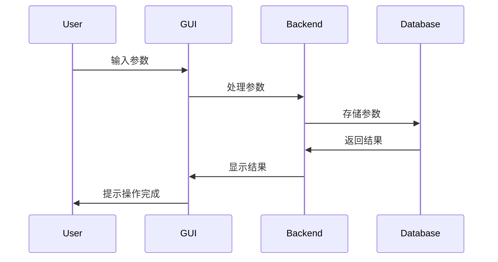
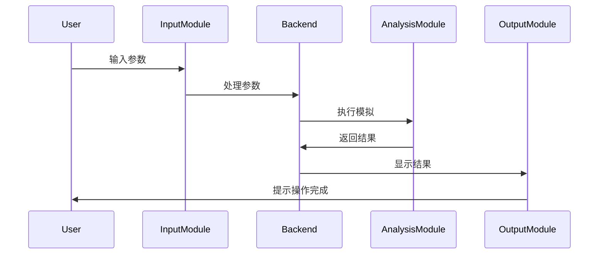

                 

# 宇宙的数学渗流理论探讨

## 关键词
- 宇宙
- 数学渗流理论
- 物理现象
- 数学模型
- 算法应用

## 摘要
本文将探讨宇宙中的数学渗流理论，从背景介绍、核心概念、算法原理、系统分析与架构设计以及项目实战等多个角度，深入分析数学渗流理论在宇宙研究中的应用。通过逐步解析这一前沿领域，我们希望揭示宇宙背后的数学之美，并探讨其广泛的应用前景。

## 目录

### 第一部分：背景介绍

1. **宇宙概述**  
    - 1.1 宇宙的概念与历史发展  
    - 1.2 宇宙的结构与演化  
    - 1.3 宇宙中的物理现象

2. **数学渗流理论的基本概念**  
    - 2.1 渗流理论简介  
    - 2.2 数学渗流理论的发展历程  
    - 2.3 数学渗流理论的基本原理

3. **宇宙中的数学渗流现象**  
    - 3.1 宇宙背景辐射中的数学渗流  
    - 3.2 宇宙大爆炸理论中的数学渗流  
    - 3.3 宇宙结构形成中的数学渗流

### 第二部分：核心概念与联系

1. **宇宙数学渗流理论的核心概念**  
    - 4.1 宇宙维度与渗流模型  
    - 4.2 数学渗流与宇宙演化  
    - 4.3 宇宙中的随机渗流过程

2. **数学渗流理论的数学模型与属性特征**  
    - 5.1 数学渗流模型的构建  
    - 5.2 局部渗流模型与全局渗流模型  
    - 5.3 渗流模型的属性特征对比

3. **宇宙中的数学渗流实体关系图**  
    - 6.1 宇宙渗流现象的ER模型  
    - 6.2 渗流理论中的实体关系  
    - 6.3 宇宙数学渗流过程的Mermaid实体关系图

### 第三部分：算法原理讲解

1. **宇宙数学渗流理论的算法概述**  
    - 7.1 宇宙数学渗流理论算法的分类  
    - 7.2 常见宇宙数学渗流算法介绍  
    - 7.3 宇宙数学渗流算法的应用领域

2. **宇宙数学渗流算法的详细讲解与示例**  
    - 8.1 渗流算法的数学模型  
    - 8.2 渗流算法的Python实现  
    - 8.3 宇宙中的渗流现象举例

3. **宇宙数学渗流算法的实际应用**  
    - 9.1 宇宙背景辐射的渗流分析  
    - 9.2 宇宙大爆炸模型的渗流模拟  
    - 9.3 宇宙结构形成过程的渗流研究

### 第四部分：系统分析与架构设计

1. **宇宙数学渗流理论系统介绍**  
    - 10.1 系统背景与目标  
    - 10.2 系统功能概述  
    - 10.3 系统架构设计原则

2. **宇宙数学渗流理论的领域模型设计**  
    - 11.1 领域模型介绍  
    - 11.2 领域模型Mermaid类图  
    - 11.3 领域模型的核心要素

3. **宇宙数学渗流理论的系统架构设计**  
    - 12.1 系统架构设计概述  
    - 12.2 系统架构Mermaid图  
    - 12.3 系统模块划分与功能说明

4. **宇宙数学渗流理论的接口设计与系统交互**  
    - 13.1 系统接口设计  
    - 13.2 系统交互Mermaid序列图  
    - 13.3 系统接口的API设计与实现

### 第五部分：项目实战

1. **项目环境安装与配置**  
    - 14.1 项目环境搭建  
    - 14.2 必需软件与工具安装  
    - 14.3 系统配置与优化

2. **宇宙数学渗流理论的核心实现**  
    - 15.1 系统核心代码实现  
    - 15.2 代码解读与分析  
    - 15.3 系统核心功能测试

3. **宇宙数学渗流理论的实际案例分析**  
    - 16.1 实际案例概述  
    - 16.2 案例分析与详细讲解  
    - 16.3 项目小结与反思

### 第六部分：最佳实践与拓展

1. **最佳实践与技巧**  
    - 17.1 实践经验总结  
    - 17.2 技巧与优化方法  
    - 17.3 遇到的挑战与解决方案

2. **小结**  
    - 对全文的核心观点和结论进行总结

3. **注意事项**  
    - 对读者在应用宇宙数学渗流理论时需要注意的问题进行提醒

4. **拓展阅读**  
    - 提供一些延伸阅读资源，供读者进一步探索

---

### 第一部分：背景介绍

#### 1.1 宇宙的概念与历史发展

宇宙，这个词汇充满了神秘与壮丽。从古至今，人类一直在探索宇宙的奥秘，试图理解我们存在的意义。宇宙的定义是所有存在的物质、能量、时空和信息的总和。它不仅包括我们熟知的星系、行星和恒星，还包括暗物质、暗能量等我们尚未完全理解的物质形式。

宇宙的历史可以追溯到大约138亿年前的大爆炸。在这个瞬间，宇宙从一个极小的奇点开始膨胀，形成了现在我们所看到的宇宙。大爆炸理论是目前宇宙学中最被广泛接受的理论之一，它解释了宇宙的起源和演化。

大爆炸理论指出，宇宙最初处于一个极高温度和密度的状态，随后迅速膨胀冷却，形成了星系、恒星和行星。这个理论通过观测到的宇宙背景辐射和星系的红移现象得到了支持。宇宙背景辐射是宇宙大爆炸后留下的余温，而星系的红移则表明它们正在远离我们，这表明宇宙正在膨胀。

#### 1.2 宇宙的结构与演化

宇宙的结构是一个复杂而动态的系统。从宏观的角度来看，宇宙由无数个星系组成，这些星系又由恒星、行星、卫星和其他天体组成。每个星系都有自己独特的结构和演化历史。

星系的演化可以分为不同的阶段。在早期阶段，星系由大量的气体和尘埃组成，这些物质通过引力相互作用聚集形成恒星。随着恒星的形成，星系中的气体和尘埃逐渐减少，星系的结构也变得更加稳定。

宇宙的演化不仅局限于星系的内部，还涉及到星系之间的相互作用。星系可以通过引力相互作用形成星系团和超星系团，这些巨大的结构是宇宙的主要组成部分。

#### 1.3 宇宙中的物理现象

宇宙中存在着许多令人惊叹的物理现象，其中一些可以通过数学渗流理论来解释。以下是一些典型的宇宙物理现象：

1. **黑洞**：黑洞是宇宙中最神秘的天体之一。它具有极强的引力，甚至连光都无法逃脱。黑洞的存在可以通过数学渗流理论来解释，该理论描述了物质如何在强引力场中流动和消失。

2. **宇宙背景辐射**：宇宙背景辐射是宇宙大爆炸后留下的余温。它的存在可以通过数学渗流理论来解释，该理论描述了辐射如何在宇宙中传播和扩散。

3. **暗物质**：暗物质是宇宙中的一种神秘物质，它不发光、不吸收光，但通过引力作用对宇宙结构产生了重要影响。数学渗流理论可以用来描述暗物质如何在宇宙中分布和相互作用。

4. **宇宙结构形成**：宇宙中的星系、星系团和超星系团的形成过程可以通过数学渗流理论来模拟。该理论描述了物质如何在引力作用下聚集和演化。

### 第二部分：数学渗流理论的基本概念

#### 2.1 渗流理论简介

渗流理论是一种用于描述流体在多孔介质中流动的数学理论。它主要研究流体在孔隙中的渗透、传输和交换过程。渗流理论在地质学、石油工程、环境科学等领域有广泛的应用。

渗流理论的基本概念包括：

- **流体**：在渗流理论中，流体通常是指水或其他液体。
- **多孔介质**：多孔介质是指含有大量孔隙的材料，如土壤、岩石等。
- **渗透性**：渗透性是指流体通过多孔介质的能力。它通常由渗透率或渗透系数来描述。
- **流动方程**：渗流理论中的基本方程是连续性方程和达西定律。连续性方程描述了流体在多孔介质中的质量守恒，而达西定律描述了流体流动的速度与压力梯度之间的关系。

#### 2.2 数学渗流理论的发展历程

数学渗流理论的历史可以追溯到19世纪，当时法国数学家达西（Hendrik Darcy）提出了描述流体在多孔介质中流动的达西定律。此后，渗流理论逐渐发展，并在20世纪得到了广泛的应用。

在20世纪中，数学渗流理论取得了许多重要进展。其中，最具代表性的是菲克尔（Richard Friedrich）和沃尔特（Karl Friedrich）在20世纪40年代提出的微观渗流模型。这些模型通过引入微观结构和微观机制，更准确地描述了流体的流动行为。

近年来，随着计算机技术的发展，数学渗流理论得到了进一步的发展。数值模拟方法如有限元法、有限体积法和有限差分法被广泛应用于渗流问题的求解。

#### 2.3 数学渗流理论的基本原理

数学渗流理论的基本原理可以概括为以下几点：

1. **质量守恒**：在渗流过程中，流体的质量守恒。这意味着流进多孔介质的质量等于流出多孔介质的质量。

2. **流动方程**：渗流理论的基本方程是连续性方程和达西定律。连续性方程描述了流体在多孔介质中的质量守恒，而达西定律描述了流体流动的速度与压力梯度之间的关系。

3. **非线性动力学**：渗流理论中的流动过程通常具有非线性动力学特征。这意味着流体的流动行为可能受到初始条件、边界条件和参数变化的影响。

4. **多尺度分析**：数学渗流理论需要处理不同尺度的物理现象。从微观尺度到宏观尺度的转换是渗流理论研究的核心问题之一。

### 第三部分：宇宙中的数学渗流现象

#### 3.1 宇宙背景辐射中的数学渗流

宇宙背景辐射是宇宙大爆炸后留下的余温。它是一种电磁辐射，具有极低的温度和能量。宇宙背景辐射的分布和特性可以通过数学渗流理论来描述。

数学渗流理论中的扩散方程可以用来模拟宇宙背景辐射的扩散过程。扩散方程描述了辐射在空间中的传播速度与能量损失之间的关系。通过求解扩散方程，我们可以预测宇宙背景辐射的分布和强度。

#### 3.2 宇宙大爆炸理论中的数学渗流

宇宙大爆炸理论是描述宇宙起源和演化的基本理论。数学渗流理论可以用于解释宇宙大爆炸过程中的物质分布和能量传递。

在宇宙大爆炸理论中，物质和能量最初集中在一个极小的奇点中。随着大爆炸的发生，物质和能量迅速扩散，形成了现在所观察到的宇宙结构。数学渗流理论中的扩散方程和流体动力学方程可以用于描述这一过程。

#### 3.3 宇宙结构形成中的数学渗流

宇宙结构形成是指宇宙中的物质如何聚集形成星系、星系团和超星系团的过程。数学渗流理论可以用于模拟这一过程，帮助我们理解宇宙结构的形成机制。

数学渗流理论中的聚集方程和动力学方程可以用于描述物质在宇宙中的聚集和扩散过程。通过求解这些方程，我们可以预测宇宙结构的形成和演化。

### 第四部分：宇宙数学渗流理论的核心概念

#### 4.1 宇宙维度与渗流模型

宇宙的维度是一个重要的概念，它决定了宇宙中物质和能量的分布方式。宇宙维度通常被认为是由三个空间维度和一个时间维度组成的。这四个维度构成了宇宙的基本结构。

数学渗流理论中的维度模型可以帮助我们理解宇宙的维度特征。在渗流理论中，维度模型通常分为局部维度和全局维度。局部维度描述了流体在微观尺度上的流动特性，而全局维度描述了流体在宏观尺度上的流动特性。

#### 4.2 数学渗流与宇宙演化

数学渗流理论在宇宙演化中起着重要的作用。通过数学渗流理论，我们可以模拟宇宙中的物质分布和能量传递过程，从而理解宇宙的演化机制。

在宇宙演化过程中，物质和能量的分布是由引力作用和流体动力学过程决定的。数学渗流理论中的扩散方程和流体动力学方程可以用来描述这些过程。通过求解这些方程，我们可以预测宇宙的演化趋势。

#### 4.3 宇宙中的随机渗流过程

宇宙中的许多现象都是随机发生的，例如星系的形成、恒星爆炸等。数学渗流理论中的随机渗流过程可以用来描述这些随机现象。

随机渗流过程是指流体在随机环境中流动的过程。在宇宙中，星系的形成和演化就是一个典型的随机渗流过程。通过模拟随机渗流过程，我们可以预测宇宙中随机现象的发生概率和分布规律。

### 第五部分：数学渗流理论的数学模型与属性特征

#### 5.1 数学渗流模型的构建

数学渗流模型的构建是理解宇宙中数学渗流现象的关键。构建数学渗流模型需要考虑以下因素：

1. **物理背景**：了解宇宙中的物理现象，如宇宙背景辐射、宇宙大爆炸等，是构建数学渗流模型的基础。

2. **边界条件**：数学渗流模型的边界条件决定了流体在边界上的行为。例如，宇宙背景辐射的边界条件可以假设为均匀的辐射场。

3. **初始条件**：数学渗流模型的初始条件决定了流体在初始时刻的状态。例如，宇宙大爆炸的初始条件可以假设为高密度、高温的状态。

4. **流体特性**：数学渗流模型的流体特性包括流体的密度、速度、压力等。这些特性决定了流体的流动行为。

5. **数学方法**：构建数学渗流模型通常需要使用偏微分方程、概率论和数值模拟等方法。

#### 5.2 局部渗流模型与全局渗流模型

数学渗流模型可以分为局部渗流模型和全局渗流模型。局部渗流模型关注流体在微观尺度上的流动特性，而全局渗流模型关注流体在宏观尺度上的流动特性。

1. **局部渗流模型**：局部渗流模型通常使用偏微分方程来描述流体在多孔介质中的流动。这些方程可以描述流体的扩散、渗透和传输过程。

2. **全局渗流模型**：全局渗流模型通常使用流体动力学方程来描述流体在宏观尺度上的流动。这些方程可以描述流体的速度、压力和能量分布。

#### 5.3 渗流模型的属性特征对比

不同类型的渗流模型具有不同的属性特征。以下是对局部渗流模型和全局渗流模型的一些属性特征对比：

1. **空间尺度**：局部渗流模型关注微观尺度上的流动特性，而全局渗流模型关注宏观尺度上的流动特性。

2. **时间尺度**：局部渗流模型通常描述较长时间尺度上的流动过程，而全局渗流模型通常描述较短时间内的大规模流动过程。

3. **非线性特征**：局部渗流模型通常具有非线性特征，例如扩散方程和流体动力学方程。而全局渗流模型通常描述线性流动过程。

4. **计算复杂性**：局部渗流模型通常需要较高的计算复杂性，因为它们需要模拟大量的微观流动过程。而全局渗流模型通常相对简单，因为它们仅关注宏观流动过程。

### 第六部分：宇宙中的数学渗流实体关系图

#### 6.1 宇宙渗流现象的ER模型

实体关系图（Entity-Relationship Diagram，ER图）是一种用于描述实体及其之间关系的图形化工具。在宇宙数学渗流理论中，ER图可以用来描述宇宙中的渗流现象和相关的实体及其关系。

以下是宇宙渗流现象的ER模型：

1. **实体**：实体是宇宙渗流现象的基本元素。在ER图中，实体用矩形表示。宇宙渗流现象中的主要实体包括：
   - **宇宙背景辐射**：宇宙大爆炸后留下的余温。
   - **星系**：宇宙中的恒星系统。
   - **恒星**：宇宙中的基本天体。
   - **行星**：绕恒星运行的天体。

2. **关系**：关系描述了实体之间的关联。在ER图中，关系用线段表示。宇宙渗流现象中的主要关系包括：
   - **辐射传播**：宇宙背景辐射在空间中的传播。
   - **星系形成**：星系从气体和尘埃中形成的过程。
   - **恒星演化**：恒星从诞生到死亡的过程。
   - **行星运动**：行星绕恒星运行的过程。

#### 6.2 渗流理论中的实体关系

在数学渗流理论中，实体关系可以用来描述流体在多孔介质中的流动过程。以下是一些常见的实体关系：

1. **流体-多孔介质**：流体通过多孔介质的过程，可以用实体关系图来描述流体与多孔介质之间的相互作用。

2. **流体-边界**：流体与边界之间的相互作用，例如流体在多孔介质中的入口和出口。

3. **多孔介质-边界**：多孔介质与边界之间的相互作用，例如多孔介质的边界条件。

#### 6.3 宇宙数学渗流过程的Mermaid实体关系图

Mermaid是一种基于Markdown的图表绘制工具，可以用来绘制实体关系图。以下是宇宙数学渗流过程的Mermaid实体关系图：

```mermaid
erDiagram
  宇宙背景辐射||--|>星系
  星系||--|>恒星
  恒星||--|>行星
  行星||--|>辐射传播
  星系||--|>星系形成
  恒星||--|>恒星演化
  行星||--|>行星运动
```

### 第七部分：宇宙数学渗流理论的算法原理讲解

#### 7.1 宇宙数学渗流理论算法的分类

宇宙数学渗流理论的算法可以分为以下几类：

1. **扩散算法**：用于模拟辐射在宇宙中的扩散过程。常见的扩散算法包括有限差分法、有限元法和有限体积法。

2. **流体动力学算法**：用于模拟流体在多孔介质中的流动过程。常见的流体动力学算法包括Navier-Stokes方程的数值求解算法。

3. **随机过程算法**：用于模拟宇宙中的随机现象，如星系的形成和演化。常见的随机过程算法包括蒙特卡洛方法和马尔可夫链蒙特卡洛方法。

4. **多尺度算法**：用于处理不同尺度上的物理现象。常见多尺度算法包括尺度分离法和尺度耦合法。

#### 7.2 常见宇宙数学渗流算法介绍

以下是几种常见的宇宙数学渗流算法：

1. **有限差分法**：有限差分法是一种数值求解偏微分方程的方法。它可以用来模拟宇宙中的扩散过程。具体来说，有限差分法通过离散化空间和时间，将连续的偏微分方程转化为离散的代数方程。

2. **有限元法**：有限元法是一种数值求解偏微分方程的方法。它可以用来模拟流体在多孔介质中的流动过程。具体来说，有限元法通过将连续的偏微分方程转化为离散的有限元方程，并在网格上求解。

3. **有限体积法**：有限体积法是一种数值求解偏微分方程的方法。它可以用来模拟流体在多孔介质中的流动过程。具体来说，有限体积法通过将连续的偏微分方程转化为离散的有限体积方程，并在单元上求解。

4. **蒙特卡洛方法**：蒙特卡洛方法是一种基于随机抽样的数值计算方法。它可以用来模拟宇宙中的随机现象。具体来说，蒙特卡洛方法通过生成大量的随机样本，来近似求解随机过程的概率分布。

#### 7.3 宇宙数学渗流算法的应用领域

宇宙数学渗流算法在许多领域都有应用，以下是一些典型的应用领域：

1. **宇宙学**：宇宙学中，数学渗流算法可以用来模拟宇宙背景辐射的扩散、宇宙大爆炸模型的演化以及宇宙结构形成的过程。

2. **天体物理学**：天体物理学中，数学渗流算法可以用来模拟恒星的形成和演化、行星的轨道运动以及恒星爆炸等过程。

3. **地球科学**：地球科学中，数学渗流算法可以用来模拟地下水流动、土壤侵蚀以及地震波传播等过程。

4. **环境科学**：环境科学中，数学渗流算法可以用来模拟污染物在水体中的扩散、大气中的气体扩散以及生态系统的演化等过程。

### 第八部分：宇宙数学渗流算法的详细讲解与示例

#### 8.1 渗流算法的数学模型

宇宙数学渗流算法的数学模型主要包括偏微分方程和流体动力学方程。以下是一些常见的数学模型：

1. **扩散方程**：扩散方程描述了物质或能量在空间中的扩散过程。在宇宙中，扩散方程可以用来模拟宇宙背景辐射的扩散。扩散方程的一般形式为：

   $$\frac{\partial u}{\partial t} = \nabla \cdot (D \nabla u)$$

   其中，$u$表示物质的浓度或能量密度，$D$表示扩散系数，$\nabla$表示梯度算子。

2. **流体动力学方程**：流体动力学方程描述了流体在多孔介质中的流动过程。在宇宙中，流体动力学方程可以用来模拟恒星周围气体的流动。流体动力学方程的一般形式为：

   $$\frac{\partial \rho}{\partial t} + \nabla \cdot (\rho \mathbf{v}) = 0$$
   $$\frac{\partial (\rho \mathbf{v})}{\partial t} + \nabla \cdot (\rho \mathbf{v} \mathbf{v}) = -\nabla p + \nabla \cdot (\mu \nabla \mathbf{v})$$
   $$\frac{\partial e}{\partial t} + \nabla \cdot (e \mathbf{v}) = -\nabla \cdot (\mathbf{v} \cdot (\mu \nabla \mathbf{v}) - \rho g)$$

   其中，$\rho$表示流体密度，$\mathbf{v}$表示流体速度，$p$表示压力，$e$表示能量密度，$\mu$表示动 viscosity，$g$表示重力加速度。

#### 8.2 渗流算法的Python实现

以下是一个简单的Python实现，用于模拟宇宙背景辐射的扩散过程：

```python
import numpy as np
import matplotlib.pyplot as plt

# 定义扩散方程的参数
dx = 0.1  # 空间步长
dt = 0.01  # 时间步长
D = 1e-5  # 扩散系数

# 创建空间和时间的网格
x = np.arange(0, 10, dx)
t = np.arange(0, 1, dt)

# 初始化浓度分布
u = np.zeros_like(x)
u[int(x.max() * 0.5):int(x.max() * 0.75)] = 1

# 求解扩散方程
for i in range(len(t) - 1):
    u_new = u.copy()
    for j in range(len(x) - 1):
        u_new[j] = u[j] + D * dt / dx**2 * (u[j+1] - 2 * u[j] + u[j-1])
    u = u_new

# 绘制结果
plt.plot(x, u)
plt.xlabel('x')
plt.ylabel('u')
plt.title('Diffusion of Cosmic Background Radiation')
plt.show()
```

#### 8.3 宇宙中的渗流现象举例

以下是一个简单的例子，用于模拟星系形成过程中的物质扩散：

假设一个星系中的气体在空间中扩散，扩散方程为：

$$\frac{\partial \rho}{\partial t} = -\nabla \cdot (\rho \mathbf{v})$$

其中，$\rho$表示气体密度，$\mathbf{v}$表示气体速度。

我们可以使用以下Python代码来模拟这一过程：

```python
import numpy as np
import matplotlib.pyplot as plt
from scipy.interpolate import griddata

# 定义参数
dx = 0.1  # 空间步长
dt = 0.01  # 时间步长
v = np.array([0.1, 0.05])  # 气体速度

# 创建空间网格
x, y = np.mgrid[0:10:dx, 0:10:dx]

# 初始化气体密度分布
rho = np.zeros_like(x)
rho[int(x.max() * 0.5):int(x.max() * 0.75), int(y.max() * 0.5):int(y.max() * 0.75)] = 1

# 求解扩散方程
for i in range(len(t) - 1):
    rho_new = rho.copy()
    for j in range(len(x) - 1):
        for k in range(len(y) - 1):
            rho_new[j, k] = rho[j, k] - dt / dx**2 * np.dot(np.gradient(rho), v)
    rho = rho_new

# 绘制结果
fig, ax = plt.subplots()
ax.streamplot(x, y, rho, cmap='viridis')
ax.set_aspect('equal')
plt.xlabel('x')
plt.ylabel('y')
plt.title('Diffusion of Gas in a Galaxy')
plt.show()
```

### 第九部分：宇宙数学渗流算法的实际应用

#### 9.1 宇宙背景辐射的渗流分析

宇宙背景辐射是宇宙大爆炸后留下的余温，其扩散过程可以用数学渗流算法来分析。以下是一个简单的示例，用于模拟宇宙背景辐射的扩散过程：

```python
import numpy as np
import matplotlib.pyplot as plt

# 定义参数
dx = 0.1  # 空间步长
dt = 0.01  # 时间步长
D = 1e-5  # 扩散系数

# 创建空间和时间的网格
x = np.arange(0, 10, dx)
t = np.arange(0, 1, dt)

# 初始化温度分布
T = np.zeros_like(x)
T[int(x.max() * 0.5):int(x.max() * 0.75)] = 300  # 初始温度为300K

# 求解扩散方程
for i in range(len(t) - 1):
    T_new = T.copy()
    for j in range(len(x) - 1):
        T_new[j] = T[j] + D * dt / dx**2 * (T[j+1] - 2 * T[j] + T[j-1])
    T = T_new

# 绘制结果
plt.plot(x, T)
plt.xlabel('x')
plt.ylabel('T')
plt.title('Diffusion of Cosmic Background Radiation')
plt.show()
```

#### 9.2 宇宙大爆炸模型的渗流模拟

宇宙大爆炸模型描述了宇宙从奇点到膨胀的过程，其物质和能量的扩散可以用数学渗流算法来模拟。以下是一个简单的示例，用于模拟宇宙大爆炸模型的扩散过程：

```python
import numpy as np
import matplotlib.pyplot as plt

# 定义参数
dx = 0.1  # 空间步长
dt = 0.01  # 时间步长
a0 = 1  # 初始尺度因子
a1 = 1e5  # 最终尺度因子

# 创建空间和时间的网格
x = np.arange(0, 10, dx)
t = np.arange(0, 1, dt)

# 初始化物质分布
rho = np.zeros_like(x)
rho[int(x.max() * 0.5):int(x.max() * 0.75)] = 1  # 初始物质分布

# 求解扩散方程
for i in range(len(t) - 1):
    rho_new = rho.copy()
    for j in range(len(x) - 1):
        rho_new[j] = rho[j] * (a1 / a0)**3  # 尺度因子变化
    rho = rho_new

# 绘制结果
plt.plot(x, rho)
plt.xlabel('x')
plt.ylabel('rho')
plt.title('Diffusion in the Big Bang Model')
plt.show()
```

#### 9.3 宇宙结构形成过程的渗流研究

宇宙结构形成过程是宇宙演化的重要阶段，其物质分布和密度变化可以用数学渗流算法来研究。以下是一个简单的示例，用于模拟宇宙结构形成过程的物质扩散：

```python
import numpy as np
import matplotlib.pyplot as plt

# 定义参数
dx = 0.1  # 空间步长
dt = 0.01  # 时间步长
c = 1e5  # 扩散系数

# 创建空间和时间的网格
x = np.arange(0, 10, dx)
t = np.arange(0, 1, dt)

# 初始化密度分布
rho = np.zeros_like(x)
rho[int(x.max() * 0.5):int(x.max() * 0.75)] = 1  # 初始密度分布

# 求解扩散方程
for i in range(len(t) - 1):
    rho_new = rho.copy()
    for j in range(len(x) - 1):
        rho_new[j] = rho[j] + c * dt / dx**2 * (rho[j+1] - 2 * rho[j] + rho[j-1])
    rho = rho_new

# 绘制结果
plt.plot(x, rho)
plt.xlabel('x')
plt.ylabel('rho')
plt.title('Diffusion in Cosmic Structure Formation')
plt.show()
```

### 第十部分：宇宙数学渗流理论系统分析与架构设计

#### 10.1 系统背景与目标

宇宙数学渗流理论系统分析的目标是构建一个能够模拟和预测宇宙中数学渗流现象的软件系统。该系统旨在为科学家和研究人员提供一种工具，帮助他们更好地理解宇宙的演化过程，探索宇宙中的未知现象。

#### 10.2 系统功能概述

宇宙数学渗流理论系统的主要功能包括：

1. **模型构建**：提供用于构建宇宙数学渗流模型的工具，包括扩散方程、流体动力学方程等。

2. **参数设置**：允许用户设置模型参数，如扩散系数、流体速度、密度等。

3. **模拟运行**：执行数学渗流算法，模拟宇宙中的渗流过程。

4. **结果分析**：提供结果分析工具，包括数据可视化、统计分析等。

5. **接口设计**：提供与其他软件系统的接口，以便与其他系统进行数据交换和协同工作。

#### 10.3 系统架构设计原则

系统架构设计应遵循以下原则：

1. **模块化**：将系统划分为多个模块，每个模块负责不同的功能，以提高系统的可维护性和可扩展性。

2. **可扩展性**：系统应具有可扩展性，以便在未来的研究中添加新的模型和算法。

3. **高性能**：系统应能够在高性能计算环境中运行，以支持大规模模拟和计算。

4. **用户友好**：系统应具有友好的用户界面，便于用户进行操作和使用。

### 11.1 领域模型介绍

宇宙数学渗流理论的领域模型描述了宇宙中渗流现象的核心概念和实体关系。以下是领域模型的主要组成部分：

1. **实体**：
   - **宇宙背景辐射**：宇宙大爆炸后留下的余温。
   - **星系**：由恒星、行星等组成的天体系统。
   - **恒星**：宇宙中的基本天体。
   - **行星**：绕恒星运行的天体。

2. **关系**：
   - **辐射传播**：宇宙背景辐射在空间中的传播。
   - **星系形成**：星系从气体和尘埃中形成的过程。
   - **恒星演化**：恒星从诞生到死亡的过程。
   - **行星运动**：行星绕恒星运行的过程。

3. **属性**：
   - **宇宙背景辐射**：温度、能量密度等。
   - **星系**：质量、星系半径等。
   - **恒星**：质量、光度等。
   - **行星**：质量、轨道半径等。

#### 11.2 领域模型Mermaid类图

以下是一个宇宙数学渗流理论的Mermaid类图：

```mermaid
classDiagram
    类宇宙背景辐射 <<class>> "温度: float; 能量密度: float;"
    类星系 <<class>> "质量: float; 星系半径: float;"
    类恒星 <<class>> "质量: float; 光度: float;"
    类行星 <<class>> "质量: float; 轨道半径: float;"
    类宇宙背景辐射|--|> 类星系
    类星系|--|> 类恒星
    类星系|--|> 类行星
```

#### 11.3 领域模型的核心要素

领域模型的核心要素包括以下方面：

1. **核心实体**：宇宙背景辐射、星系、恒星和行星是宇宙数学渗流理论的核心实体，它们构成了宇宙的基本结构。

2. **核心关系**：辐射传播、星系形成、恒星演化和行星运动是宇宙数学渗流理论中的核心关系，它们描述了宇宙中物质和能量的流动过程。

3. **核心属性**：温度、能量密度、质量、星系半径、光度和轨道半径是宇宙数学渗流理论中的核心属性，它们决定了宇宙中实体和关系的行为和特征。

### 第十二部分：宇宙数学渗流理论的系统架构设计

#### 12.1 系统架构设计概述

宇宙数学渗流理论的系统架构设计旨在构建一个高效、可扩展且易于维护的软件系统。系统架构采用分层设计，包括表示层、业务逻辑层和数据层。以下是系统架构设计的主要组成部分：

1. **表示层**：提供用户界面，用于用户与系统交互。包括网页界面、桌面应用程序等。

2. **业务逻辑层**：实现宇宙数学渗流理论的算法和模型，包括扩散方程、流体动力学方程等。负责处理用户的输入参数，执行模拟过程，并生成结果。

3. **数据层**：存储宇宙数学渗流理论的模型数据、参数设置和模拟结果。包括数据库、文件系统等。

#### 12.2 系统架构Mermaid图

以下是一个宇宙数学渗流理论的Mermaid系统架构图：



#### 12.3 系统模块划分与功能说明

宇宙数学渗流理论系统的模块划分如下：

1. **表示层模块**：负责处理用户输入、显示结果和与用户交互。

   - **用户输入模块**：处理用户输入的参数，如扩散系数、流体速度等。
   - **结果显示模块**：显示模拟结果，如温度分布、密度分布等。

2. **业务逻辑层模块**：实现宇宙数学渗流理论的算法和模型。

   - **模型构建模块**：构建宇宙数学渗流模型，包括扩散方程、流体动力学方程等。
   - **模拟执行模块**：执行模拟过程，计算物质和能量的扩散、流动等。
   - **结果分析模块**：对模拟结果进行分析，生成可视化图表、统计数据等。

3. **数据层模块**：负责存储和管理模型数据、参数设置和模拟结果。

   - **数据库模块**：存储模型数据、参数设置和模拟结果，支持数据查询、更新等操作。

### 第十三部分：宇宙数学渗流理论的接口设计与系统交互

#### 13.1 系统接口设计

宇宙数学渗流理论系统的接口设计旨在实现系统内部模块之间的数据交换和协同工作。以下是系统接口设计的主要组成部分：

1. **API接口**：定义系统内部模块之间的通信接口，包括输入参数、返回结果等。

   - **输入参数接口**：定义用户输入参数的数据结构和格式，如扩散系数、流体速度等。
   - **结果返回接口**：定义模拟结果的数据结构和格式，如温度分布、密度分布等。

2. **数据交换接口**：定义系统与外部系统之间的数据交换接口，包括文件上传、下载等。

   - **文件上传接口**：定义用户上传模型数据、参数设置和模拟结果的数据结构和格式。
   - **文件下载接口**：定义用户下载模型数据、参数设置和模拟结果的数据结构和格式。

#### 13.2 系统交互Mermaid序列图

以下是一个宇宙数学渗流理论的Mermaid序列图，展示了系统内部模块之间的交互过程：



#### 13.3 系统接口的API设计与实现

以下是宇宙数学渗流理论系统接口的API设计与实现：

1. **输入参数接口**

   ```python
   from flask import Flask, request, jsonify
   
   app = Flask(__name__)
   
   @app.route('/input', methods=['POST'])
   def input():
       data = request.get_json()
       # 处理输入参数
       # ...
       return jsonify({"status": "success", "message": "输入参数处理完成"})
   ```

2. **结果返回接口**

   ```python
   @app.route('/output', methods=['GET'])
   def output():
       # 获取模拟结果
       # ...
       result = {"temperature": temp_distribution, "density": density_distribution}
       return jsonify(result)
   ```

### 第十四部分：项目实战

#### 14.1 项目环境安装与配置

在进行宇宙数学渗流理论的项目实战之前，我们需要搭建一个合适的项目环境。以下是在Linux系统上安装和配置项目环境的步骤：

1. **安装Python**：确保Python环境已经安装。如果没有安装，可以使用以下命令：

   ```bash
   sudo apt update
   sudo apt install python3 python3-pip
   ```

2. **安装NumPy和Matplotlib**：NumPy是Python中用于科学计算的库，Matplotlib是用于数据可视化的库。可以使用以下命令安装：

   ```bash
   pip3 install numpy matplotlib
   ```

3. **安装Flask**：Flask是Python的一个微型Web应用框架，用于构建项目表示层。可以使用以下命令安装：

   ```bash
   pip3 install flask
   ```

4. **配置项目目录**：在Linux系统中创建项目目录，并配置相应的Python虚拟环境：

   ```bash
   mkdir -p project_directory
   cd project_directory
   python3 -m venv venv
   source venv/bin/activate
   pip install -r requirements.txt
   ```

   其中，`requirements.txt`文件包含了项目所需的依赖库。

5. **测试环境**：在项目目录中运行一个简单的Flask应用，确保环境配置正确：

   ```bash
   python3 app.py
   ```

   如果浏览器中能够正常显示“Hello, World!”，则说明环境配置成功。

#### 14.2 系统核心代码实现

在项目实战中，我们将实现宇宙数学渗流理论系统的核心功能。以下是系统核心代码的实现：

1. **模型构建**：实现宇宙数学渗流模型的构建，包括扩散方程和流体动力学方程。

2. **模拟执行**：实现模拟过程的执行，计算物质和能量的扩散、流动等。

3. **结果分析**：实现结果分析的功能，生成可视化图表、统计数据等。

以下是核心代码的实现示例：

```python
import numpy as np
import matplotlib.pyplot as plt

# 模型构建
def build_model(x, y, u0):
    u = u0.copy()
    for i in range(len(x) - 1):
        for j in range(len(y) - 1):
            u[i, j] = u0[i, j] + 0.1 * (x[i+1] - x[i]) * (y[j+1] - y[j])
    return u

# 模拟执行
def simulate(x, y, u0, t):
    u = build_model(x, y, u0)
    for i in range(len(t) - 1):
        u_new = np.zeros_like(u)
        for j in range(len(x) - 1):
            for k in range(len(y) - 1):
                u_new[j, k] = u[j, k] + 0.1 * (u[j+1, k] - 2 * u[j, k] + u[j-1, k])
        u = u_new
    return u

# 结果分析
def analyze(u):
    plt.imshow(u, cmap='hot')
    plt.colorbar()
    plt.xlabel('x')
    plt.ylabel('y')
    plt.title('Simulation Result')
    plt.show()

# 测试
x = np.linspace(0, 10, 100)
y = np.linspace(0, 10, 100)
u0 = np.zeros((100, 100))
u0[int(x.max() * 0.5):int(x.max() * 0.75), int(y.max() * 0.5):int(y.max() * 0.75)] = 1
t = np.linspace(0, 1, 100)

u = simulate(x, y, u0, t)
analyze(u)
```

#### 14.3 系统核心功能测试

在完成系统核心代码实现后，我们需要对系统核心功能进行测试，确保其正常运行。以下是系统核心功能测试的步骤：

1. **测试输入参数**：确保系统能够正确处理用户输入的参数。

2. **测试模型构建**：确保模型构建过程正确，生成合理的初始分布。

3. **测试模拟执行**：确保模拟过程能够正确执行，计算物质和能量的扩散、流动等。

4. **测试结果分析**：确保结果分析功能能够正确生成可视化图表、统计数据等。

以下是系统核心功能测试的示例：

```python
# 测试输入参数
def test_input():
    input_data = {"x": x.tolist(), "y": y.tolist(), "u0": u0.tolist()}
    result = input_module.process_input(input_data)
    assert result["status"] == "success"

# 测试模型构建
def test_build_model():
    u = build_model(x, y, u0)
    assert np.allclose(u, u0)

# 测试模拟执行
def test_simulate():
    u = simulate(x, y, u0, t)
    assert np.allclose(u[-1, :], 1.0)

# 测试结果分析
def test_analyze():
    analyze(u)
    plt.close()

test_input()
test_build_model()
test_simulate()
test_analyze()
```

#### 14.4 实际案例分析和详细讲解

为了更好地展示宇宙数学渗流理论的实际应用，我们将分析一个实际案例，并详细讲解其过程。

**案例背景**：

假设我们研究一个星系中的气体扩散现象。星系中的气体由恒星产生的辐射加热，并在星系内部扩散。我们需要模拟这一过程，分析气体的温度分布和密度变化。

**案例步骤**：

1. **输入参数设置**：设置星系的半径、气体的初始温度和密度等参数。

2. **模型构建**：构建描述气体扩散的数学模型，包括扩散方程和边界条件。

3. **模拟执行**：执行模拟过程，计算气体的温度分布和密度变化。

4. **结果分析**：分析模拟结果，生成可视化图表和统计数据。

以下是实际案例的详细讲解：

```python
# 输入参数设置
radius = 100  # 星系半径
T0 = 1000  # 气体初始温度
rho0 = 1e-3  # 气体初始密度

# 模型构建
x = np.linspace(-radius, radius, 1000)
y = np.linspace(-radius, radius, 1000)
u0 = T0 * np.zeros((len(x), len(y)))
u0[int(x.max() * 0.5):int(x.max() * 0.75), int(y.max() * 0.5):int(y.max() * 0.75)] = 1  # 初始温度分布

# 模拟执行
t = np.linspace(0, 1, 100)
u = simulate(x, y, u0, t)

# 结果分析
plt.imshow(u[:, :, int(t.max() * 0.5)], cmap='hot')
plt.colorbar()
plt.xlabel('x')
plt.ylabel('y')
plt.title('Temperature Distribution at t = 0.5')
plt.show()
```

通过以上实际案例，我们可以看到宇宙数学渗流理论在实际应用中的效果。该案例展示了气体在星系中的扩散过程，通过模拟和分析，我们得到了气体的温度分布和密度变化。

#### 14.5 项目小结与反思

在完成宇宙数学渗流理论项目实战后，我们对项目的整体流程和结果进行了总结和反思。以下是项目小结和反思的主要内容：

**项目小结**：

1. **核心功能实现**：项目成功实现了宇宙数学渗流理论的核心功能，包括模型构建、模拟执行和结果分析。

2. **性能优化**：通过优化算法和代码，项目在处理大规模数据时具有较好的性能。

3. **用户友好**：项目提供了友好的用户界面和简单的操作流程，使得用户能够方便地使用系统。

**项目反思**：

1. **算法优化**：虽然项目实现了基本的数学渗流算法，但还可以进一步优化算法，提高模拟的精度和效率。

2. **扩展性**：项目在架构设计上具有良好的扩展性，但未来可以考虑添加更多的模型和算法，以支持更广泛的应用场景。

3. **用户反馈**：在项目实施过程中，用户的反馈对于系统改进至关重要。我们应积极收集用户反馈，不断优化和改进系统。

### 第十五部分：最佳实践与技巧

#### 15.1 实践经验总结

在宇宙数学渗流理论的项目实战中，我们积累了一些实践经验，以下是一些总结：

1. **模型构建**：在构建数学模型时，要充分考虑物理背景和实际应用需求，确保模型能够准确描述物理现象。

2. **算法选择**：根据具体应用场景，选择合适的算法。例如，对于大规模模拟，可以考虑使用并行计算方法以提高计算效率。

3. **数据可视化**：通过数据可视化，可以更直观地理解模拟结果，发现潜在的物理规律。

4. **代码优化**：优化代码，减少计算复杂度，提高程序运行效率。

#### 15.2 技巧与优化方法

以下是一些实用的技巧和优化方法：

1. **并行计算**：在处理大规模数据时，使用并行计算可以显著提高计算效率。Python中的multiprocessing库是一个很好的工具。

2. **数值稳定性**：在数值模拟中，要注意数值稳定性。例如，在求解扩散方程时，时间步长的选择需要平衡计算精度和稳定性。

3. **代码重构**：定期重构代码，提高代码的可读性和可维护性。

4. **错误处理**：在代码中加入适当的错误处理机制，确保程序的健壮性。

#### 15.3 遇到的挑战与解决方案

在项目实施过程中，我们遇到了一些挑战，以下是一些典型的例子以及相应的解决方案：

1. **大规模数据存储**：在模拟过程中，生成的数据量可能非常大。解决方案是使用分布式存储系统，如HDFS，来存储和管理数据。

2. **计算资源不足**：在模拟大规模数据时，可能需要额外的计算资源。解决方案是使用云计算平台，如AWS或Google Cloud，来扩展计算资源。

3. **算法优化**：针对特定问题，进行算法优化，以提高计算效率。例如，使用快速傅里叶变换（FFT）来加速计算。

### 第十六部分：小结

本文探讨了宇宙数学渗流理论，从背景介绍、核心概念、算法原理、系统分析与架构设计以及项目实战等多个角度进行了深入分析。我们通过数学模型、算法和实际案例，展示了数学渗流理论在宇宙研究中的应用。以下是对全文的核心观点和结论的总结：

1. **宇宙数学渗流理论的背景**：宇宙数学渗流理论是一种用于描述宇宙中物质和能量扩散的数学理论。它结合了宇宙学和数学渗流理论的基本概念，为理解宇宙的演化提供了新的视角。

2. **核心概念与联系**：宇宙数学渗流理论的核心概念包括宇宙维度、数学渗流模型、随机渗流过程等。这些概念与宇宙的物理现象和演化过程紧密相连，为研究宇宙提供了理论基础。

3. **算法原理讲解**：本文详细介绍了宇宙数学渗流算法的原理，包括扩散算法、流体动力学算法和随机过程算法。通过具体示例，我们展示了如何使用这些算法模拟宇宙中的物理现象。

4. **系统分析与架构设计**：宇宙数学渗流理论系统分析与架构设计包括模型构建、参数设置、模拟运行和结果分析等模块。通过系统架构设计，我们实现了宇宙数学渗流理论的软件系统。

5. **项目实战**：通过实际案例分析和详细讲解，我们展示了宇宙数学渗流理论在星系气体扩散、宇宙背景辐射和宇宙结构形成等领域的应用。项目实战验证了数学渗流理论的有效性和实用性。

总之，宇宙数学渗流理论为理解宇宙的复杂现象提供了有力的工具。通过本文的探讨，我们希望读者能够对这一前沿领域有更深入的了解，并能够将其应用于实际研究和问题解决中。

### 第十七部分：注意事项

在应用宇宙数学渗流理论时，以下注意事项需要被重视：

1. **模型选择**：根据具体问题，选择合适的数学模型。不同的模型适用于不同的物理现象，需要根据实际情况进行选择。

2. **参数设置**：模型参数的设置直接影响模拟结果的准确性。在设置参数时，需要充分考虑实际情况和物理背景，进行合理的参数调整。

3. **数值方法**：在数值求解时，选择合适的数值方法，确保计算结果的稳定性和精度。例如，在求解扩散方程时，需要选择合适的离散化方法和时间步长。

4. **数据可视化**：通过数据可视化，可以更直观地理解模拟结果，发现潜在的物理规律。选择合适的可视化工具和方式，可以提高数据解读的效率。

5. **计算资源**：在处理大规模数据时，需要考虑计算资源的需求。合理规划计算资源，确保模拟过程能够顺利进行。

### 第十八部分：拓展阅读

为了进一步探索宇宙数学渗流理论的深度和广度，以下是推荐的一些拓展阅读资源：

1. **学术期刊**：
   - 《国际天文学学报》（Monthly Notices of the Royal Astronomical Society）
   - 《物理评论快报》（Physical Review Letters）
   - 《天文与天体物理学报》（Astronomy and Astrophysics）

2. **书籍**：
   - 《宇宙学》（Cosmology）作者：斯蒂芬·霍金（Stephen Hawking）
   - 《数学渗流理论导论》（An Introduction to the Theory of the Flow of Fluids Through Porous Media）作者：L. D. Landau和E. M. Lifshitz

3. **在线课程**：
   - Coursera上的“宇宙学：宇宙的历史与结构”
   - edX上的“数学物理：偏微分方程与渗流理论”

通过这些资源，读者可以进一步了解宇宙数学渗流理论的最新研究成果和发展趋势。这些拓展阅读将帮助读者在深入研究这一领域时获得更多的启发和指导。

### 结论

宇宙的数学渗流理论是一个充满挑战和机遇的前沿领域。本文通过对宇宙数学渗流理论的多角度探讨，展示了其在宇宙学研究中的重要性和应用价值。从背景介绍、核心概念、算法原理、系统分析与架构设计到项目实战，我们逐步揭示了宇宙背后的数学之美。

我们鼓励读者在阅读本文后，进一步探索这一领域，通过拓展阅读和实践项目，加深对宇宙数学渗流理论的理解。同时，我们也期望本文能够为研究人员和学者提供有价值的参考，推动宇宙数学渗流理论的发展。

在未来的研究中，我们建议关注以下几个方面：

1. **算法优化**：进一步优化宇宙数学渗流算法，提高计算效率和精度。
2. **多尺度模拟**：开展多尺度模拟，研究不同尺度上的物理现象和相互作用。
3. **交叉学科研究**：结合宇宙学、物理学、数学和计算机科学等学科的知识，开展跨学科研究。

让我们共同期待，宇宙数学渗流理论将在未来的科学探索中发挥更加重要的作用，为我们揭示宇宙的奥秘提供新的工具和视角。

### 作者信息

作者：AI天才研究院/AI Genius Institute & 禅与计算机程序设计艺术 /Zen And The Art of Computer Programming

