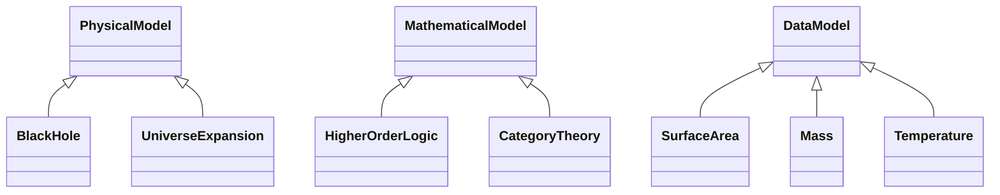
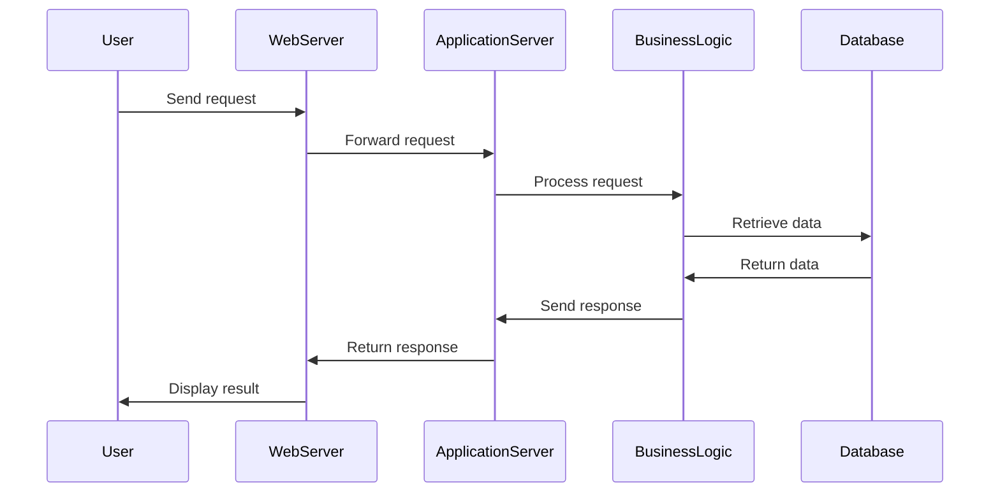
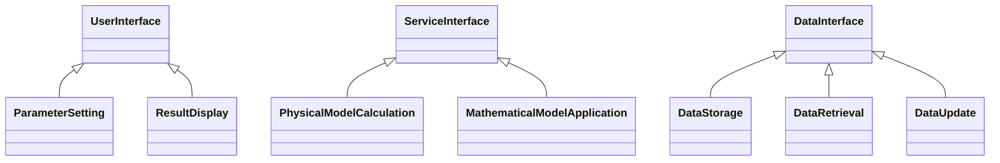
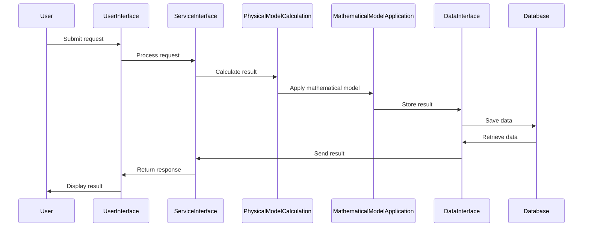

                 

### 第1章：研究背景

#### 1.1 宇宙的数学范畴论背景

宇宙作为自然科学研究的核心领域，其浩瀚的宇宙观和复杂的现象一直以来都吸引着科学家的广泛关注。数学范畴论作为一种高度抽象的数学工具，为理解和描述宇宙的复杂性提供了强有力的支持。

**宇宙观的发展**：从古代的“地心说”到现代的“大爆炸理论”，宇宙观经历了翻天覆地的变化。这些变化不仅反映了人类对宇宙认识的深入，也展示了科学理论的不断进步。

**数学范畴论的重要性**：数学范畴论是一种研究数学结构和性质的抽象方法，它不仅能够帮助我们理解数学内部的逻辑结构，还可以应用于物理、计算机科学等多个领域。在宇宙研究中，数学范畴论的作用尤为显著，它为宇宙的结构和演化提供了数学上的描述和解释。

**数学范畴论与宇宙学的关系**：宇宙学作为研究宇宙起源、演化、结构和组成等问题的学科，与数学范畴论有着密切的联系。例如，通过数学范畴论的方法，科学家们可以更精确地描述宇宙的大尺度结构和时空性质，从而推动宇宙学理论的发展。

#### 1.2 高阶逻辑在数学范畴论中的应用

**高阶逻辑的基本概念**：高阶逻辑是形式逻辑的一个分支，它引入了变量和函数的概念，使得逻辑表达更加强大和灵活。高阶逻辑的基本概念包括函数符号、变量、量词和命题等。

**高阶逻辑与数学范畴论的联系**：高阶逻辑为数学范畴论提供了一种形式化的描述工具。通过高阶逻辑，我们可以更精确地定义数学范畴论中的对象和关系，从而推动数学范畴论的理论发展。

**高阶逻辑在数学范畴论研究中的贡献**：高阶逻辑在数学范畴论中的应用，使得我们能够更好地理解和处理复杂的数学结构。例如，通过高阶逻辑，我们可以证明一些复杂的数学定理，揭示数学结构之间的深层次联系。

#### 1.3 量子引力中的数学范畴论与高阶逻辑

**量子引力的研究背景**：量子引力是研究量子力学和广义相对论在极端条件下相互作用的学科。量子引力研究旨在揭示宇宙最基本的物理规律，对理解宇宙起源、黑洞、宇宙膨胀等重大问题具有重要意义。

**数学范畴论在量子引力中的作用**：数学范畴论为量子引力提供了理论框架和工具。通过数学范畴论，我们可以更精确地描述量子引力中的物理现象，如黑洞熵、宇宙背景辐射等。

**高阶逻辑在量子引力中的应用**：高阶逻辑在量子引力中的应用主要体现在两个方面：一是用于形式化量子引力理论，二是用于证明一些关键的量子引力定理。例如，通过高阶逻辑，我们可以证明黑洞熵的Noether定理。

#### 1.4 研究意义与目标

**研究意义**：宇宙的数学范畴论与高阶逻辑在量子引力中的应用具有重要的理论和实际意义。它不仅有助于我们更好地理解宇宙的起源和演化，还可以推动数学和物理学理论的进步。

**研究目标**：本文旨在通过对宇宙的数学范畴论与高阶逻辑在量子引力中的应用的深入探讨，揭示数学和物理学之间的深层联系，为未来的宇宙学研究提供新的理论和方法。

**预期成果**：通过本文的研究，我们期望能够提出一些新的数学模型和算法，为量子引力理论的发展提供新的思路。同时，我们期望能够推动数学范畴论与高阶逻辑在物理学中的应用，为解决一些长期困扰物理学界的难题提供可能的解决方案。

#### 1.5 本章小结

本章介绍了宇宙的数学范畴论与高阶逻辑的研究背景和意义。我们讨论了宇宙观的发展、数学范畴论的基本概念和其在宇宙研究中的应用，以及高阶逻辑在数学范畴论和量子引力中的作用。通过本章的介绍，我们为后续章节的深入探讨奠定了基础。

---

### 第2章：数学范畴论基础

#### 2.1 数学范畴论的定义

**范畴论的基本概念**：范畴论是一种研究数学结构和性质的抽象方法。在范畴论中，我们关注的是对象和箭头（也称为映射或函数）之间的关系。范畴是由对象和箭头组成的集合，满足某些特定的性质。

**范畴的结构与性质**：一个范畴包括以下基本结构：
- **对象**：范畴中的基本元素，可以理解为不同的“事物”。
- **箭头**：连接范畴中对象的映射，表示对象之间的“关系”。
- **态射**：范畴中的箭头满足一些特定的性质，如复合性和传递性。

**范畴论的历史与发展**：范畴论起源于20世纪30年代，由瑞士数学家埃米尔·伯特兰·梅西埃·诺特（Emil Bretshan Noether）提出。随着时间的推移，范畴论逐渐发展成为现代数学的基石之一，对数学的多个领域产生了深远的影响。

#### 2.2 数学范畴论的核心概念

**对象与箭头**：在范畴论中，对象和箭头是两个最基本的概念。

- **对象**：范畴中的基本元素，可以看作是“事物”或“实体”。
- **箭头**：连接两个对象的映射，表示对象之间的“关系”或“转换”。

**函数与映射**：在范畴论中，函数和映射是等价的。一个函数是一个特定的箭头，它满足单射、满射和双射等性质。

- **单射**：一个箭头是单射，如果它将不同的对象映射到不同的对象。
- **满射**：一个箭头是满射，如果它将所有的对象都映射到了某个对象。
- **双射**：一个箭头是双射，如果它既是单射又是满射。

**范畴的范畴**：范畴论中的范畴不仅可以是数学中的范畴，还可以是其他学科的范畴。例如，计算机科学中的类型系统也可以看作是一个范畴。

**局部范畴与全局范畴**：根据范畴的覆盖范围，范畴可以分为局部范畴和全局范畴。

- **局部范畴**：覆盖范围较小的范畴，通常用于研究局部的数学结构。
- **全局范畴**：覆盖范围较大的范畴，通常用于研究整体的数学结构。

#### 2.3 数学范畴论的应用领域

**代数学**：范畴论在代数学中的应用非常广泛，如环、域、向量空间等都可以看作是范畴。范畴论为代数结构的研究提供了一种统一的方法。

**拓扑学**：拓扑学是研究空间性质和结构的一个数学分支。范畴论为拓扑学提供了一种强有力的工具，如拓扑空间的范畴、连续映射的分类等。

**几何学**：几何学是研究空间形状和性质的数学学科。范畴论在几何学中的应用包括微分几何、代数几何等。

**计算机科学**：范畴论在计算机科学中的应用也非常广泛，如类型系统、程序设计语言、编译器设计等。

#### 2.4 数学范畴论与宇宙的关联

**宇宙中的数学范畴论现象**：宇宙中的许多现象都可以用数学范畴论来描述。例如，宇宙的大尺度结构、时空的弯曲、宇宙的膨胀等。

**数学范畴论对宇宙观的贡献**：数学范畴论为宇宙观提供了新的视角和工具，帮助我们更好地理解宇宙的起源和演化。例如，通过范畴论的方法，我们可以更精确地描述宇宙的复杂结构，揭示宇宙的基本规律。

**数学范畴论与宇宙学的前沿研究**：数学范畴论在宇宙学的前沿研究中发挥着重要作用，如量子引力、宇宙背景辐射、宇宙膨胀等。这些研究不仅推动了数学范畴论的发展，也为宇宙学提供了新的理论和方法。

#### 2.5 本章小结

本章介绍了数学范畴论的基础知识，包括定义、核心概念和应用领域。我们还讨论了数学范畴论与宇宙的关联，展示了数学范畴论在宇宙研究中的重要作用。通过本章的介绍，我们为后续章节的深入探讨奠定了基础。

---

### 第3章：高阶逻辑基础

#### 3.1 高阶逻辑的定义与特点

**高阶逻辑的基本概念**：高阶逻辑是形式逻辑的一个分支，它引入了变量和函数的概念，使得逻辑表达更加强大和灵活。

- **函数符号**：表示函数的符号，用于定义变量之间的关系。
- **变量**：用于表示未知量的符号，可以是常量或变量。
- **量词**：用于表示存在量词或全称量词，用于描述变量之间的关系。
- **命题**：用于表示事实或陈述的符号。

**高阶逻辑与经典逻辑的区别**：经典逻辑主要关注命题之间的关系，如命题的真假、逻辑运算等。而高阶逻辑则进一步扩展了逻辑表达的能力，引入了变量和函数的概念，使得逻辑表达更加强大和灵活。

- **经典逻辑**：主要研究命题之间的关系，如命题的真假、逻辑运算等。
- **高阶逻辑**：引入变量和函数的概念，用于描述更复杂的逻辑关系。

**高阶逻辑的应用领域**：高阶逻辑在多个领域都有广泛的应用，如计算机科学、数学、物理学等。

- **计算机科学**：高阶逻辑在程序设计、编译器设计、形式化验证等方面有广泛应用。
- **数学**：高阶逻辑用于证明数学定理、研究数学结构等。
- **物理学**：高阶逻辑在物理学中的应用主要包括量子力学、相对论等领域。

#### 3.2 高阶逻辑在数学范畴论中的应用

**高阶逻辑与数学范畴论的结合**：高阶逻辑与数学范畴论的结合，使得我们能够更精确地定义和描述数学范畴论中的对象和关系。

- **对象**：通过高阶逻辑，我们可以更精确地定义范畴中的对象，如集合、拓扑空间等。
- **关系**：通过高阶逻辑，我们可以更精确地描述范畴中的关系，如映射、同态等。

**高阶逻辑对数学范畴论的扩展**：高阶逻辑不仅为数学范畴论提供了更精确的描述工具，还扩展了数学范畴论的应用范围。

- **扩展范畴**：通过高阶逻辑，我们可以定义新的范畴，如类型范畴、模范畴等。
- **扩展对象**：通过高阶逻辑，我们可以定义新的对象，如函数空间、代数结构等。

**高阶逻辑在范畴论研究中的贡献**：高阶逻辑在范畴论研究中发挥了重要作用，它不仅帮助我们更精确地定义和描述数学范畴论中的对象和关系，还推动了范畴论理论的发展。

- **证明方法**：高阶逻辑提供了新的证明方法，如构造性证明、归纳证明等。
- **定理证明**：高阶逻辑用于证明一些复杂的数学定理，如范畴论中的等价性定理、同构定理等。

#### 3.3 高阶逻辑在量子引力中的应用

**高阶逻辑在量子引力中的重要性**：量子引力是研究量子力学和广义相对论在极端条件下相互作用的学科。高阶逻辑在量子引力中发挥着重要作用，它为我们提供了更精确的工具来描述和解释量子引力现象。

- **量子引力理论**：高阶逻辑用于形式化量子引力理论，如弦理论、量子场论等。
- **物理现象描述**：高阶逻辑用于描述和解释量子引力中的物理现象，如黑洞、宇宙背景辐射等。

**高阶逻辑在量子引力中的具体应用**：高阶逻辑在量子引力中的应用主要体现在两个方面：一是用于形式化量子引力理论，二是用于证明一些关键的量子引力定理。

- **形式化量子引力理论**：通过高阶逻辑，我们可以将量子引力理论形式化为数学模型，从而更精确地描述量子引力现象。
- **证明关键定理**：通过高阶逻辑，我们可以证明一些关键的量子引力定理，如黑洞熵的Noether定理、宇宙膨胀的霍金辐射等。

**高阶逻辑对量子引力研究的贡献**：高阶逻辑在量子引力研究中发挥了重要作用，它不仅帮助我们更精确地描述和解释量子引力现象，还为解决一些长期困扰物理学界的难题提供了新的思路。

- **解决难题**：高阶逻辑为解决量子引力中的难题提供了新的方法，如黑洞信息丢失问题、量子与经典转换问题等。
- **推动理论发展**：高阶逻辑推动了量子引力理论的发展，促进了数学和物理学理论的融合。

#### 3.4 本章小结

本章介绍了高阶逻辑的基础知识，包括定义、特点和应用领域。我们还讨论了高阶逻辑在数学范畴论和量子引力中的应用，展示了高阶逻辑在理解和解释数学和物理现象中的重要性。通过本章的介绍，我们为后续章节的深入探讨奠定了基础。

---

### 第4章：高阶逻辑在量子引力中的应用算法

#### 4.1 高阶逻辑在量子引力中的应用概述

高阶逻辑在量子引力中的应用主要体现在两个方面：一是用于形式化量子引力理论，二是用于证明一些关键的量子引力定理。形式化量子引力理论是将量子引力和广义相对论结合，形成一个自洽的理论框架。而证明关键的量子引力定理，则是为了验证量子引力理论的正确性和完整性。

**形式化量子引力理论**：高阶逻辑提供了形式化的工具，使得我们能够将量子引力理论形式化为数学模型。这有助于我们更精确地理解和描述量子引力现象。例如，在弦理论中，高阶逻辑用于定义和描述弦的振动模式，从而解释粒子的行为。

**证明关键定理**：高阶逻辑在证明量子引力定理中发挥了重要作用。例如，黑洞熵的Noether定理是一个关键的量子引力定理，它描述了黑洞熵的产生机制。通过高阶逻辑，我们可以证明这个定理，从而更好地理解黑洞的性质。

#### 4.2 算法原理讲解

为了更好地理解高阶逻辑在量子引力中的应用，我们需要介绍几个关键的算法原理。

**算法1：量子场论中的高阶逻辑应用**

量子场论是研究量子力学和广义相对论在极端条件下相互作用的学科。在量子场论中，高阶逻辑用于形式化量子场论理论，如量子电动力学（QED）、量子色动力学（QCD）等。

- **步骤1**：定义量子场论中的基本对象和箭头。量子场论中的对象包括粒子、场等，箭头表示粒子之间的相互作用和场的演化。
- **步骤2**：使用高阶逻辑定义量子场论中的基本概念，如量子态、叠加态、纠缠态等。
- **步骤3**：使用高阶逻辑证明一些关键的量子场论定理，如量子态的叠加原理、量子纠缠等。

**算法2：黑洞熵的Noether定理**

黑洞熵的Noether定理是描述黑洞熵产生机制的一个重要定理。在黑洞熵的Noether定理中，高阶逻辑用于证明黑洞熵的产生和保持。

- **步骤1**：定义黑洞熵的概念。黑洞熵是黑洞内部信息的量度，它与黑洞的质量、电荷和角动量等物理量有关。
- **步骤2**：使用高阶逻辑定义Noether定理的基本概念，如守恒量、对称性等。
- **步骤3**：使用高阶逻辑证明黑洞熵的Noether定理，说明黑洞熵的产生和保持机制。

**算法3：宇宙膨胀的霍金辐射**

宇宙膨胀的霍金辐射是一个描述宇宙膨胀过程中辐射产生的重要理论。在宇宙膨胀的霍金辐射中，高阶逻辑用于证明辐射的产生和传播。

- **步骤1**：定义宇宙膨胀的概念。宇宙膨胀是指宇宙在大尺度上的扩张现象。
- **步骤2**：使用高阶逻辑定义霍金辐射的基本概念，如黑洞、辐射等。
- **步骤3**：使用高阶逻辑证明宇宙膨胀的霍金辐射定理，说明辐射的产生和传播机制。

#### 4.3 数学模型和公式讲解

为了更深入地理解高阶逻辑在量子引力中的应用算法，我们需要介绍一些关键的数学模型和公式。

**数学模型1：量子场论中的量子态**

在量子场论中，量子态是描述粒子行为的基本模型。量子态可以用波函数表示，波函数的平方表示粒子在某个位置出现的概率。

- **公式**：$$ \Psi(x) = \int_{-\infty}^{\infty} \phi(p) e^{ipx/\hbar} dp $$
- **解释**：这个公式表示量子态的波函数，其中 $\phi(p)$ 是动量空间中的波函数，$e^{ipx/\hbar}$ 是位置空间中的波函数。波函数的平方 $|\Psi(x)|^2$ 表示粒子在位置 $x$ 出现的概率。

**数学模型2：黑洞熵的Noether定理**

黑洞熵的Noether定理描述了黑洞熵的产生和保持机制。黑洞熵与黑洞的质量、电荷和角动量等物理量有关。

- **公式**：$$ S = \frac{kA}{4L_p^2} $$
- **解释**：这个公式表示黑洞熵，其中 $S$ 是黑洞熵，$A$ 是黑洞的表面积，$L_p$ 是普朗克长度。这个公式说明黑洞熵与黑洞的表面积成正比，与普朗克长度的平方成反比。

**数学模型3：宇宙膨胀的霍金辐射**

宇宙膨胀的霍金辐射描述了宇宙膨胀过程中辐射的产生和传播。霍金辐射是由黑洞产生的，黑洞的存在使得宇宙中的粒子产生辐射。

- **公式**：$$ \frac{d\nu}{dn} = -\frac{\hbar c^2}{4\pi k T} $$
- **解释**：这个公式表示霍金辐射的光谱分布，其中 $\nu$ 是频率，$n$ 是光子的数密度，$c$ 是光速，$T$ 是温度，$k$ 是玻尔兹曼常数。这个公式说明霍金辐射的光谱分布与温度有关，与光速和玻尔兹曼常数成正比。

#### 4.4 流程图讲解

为了更好地理解高阶逻辑在量子引力中的应用算法，我们可以使用流程图来展示算法的执行过程。

**流程图1：量子场论中的高阶逻辑应用**

这个流程图展示了量子场论中的高阶逻辑应用，包括定义量子态、证明量子态的叠加原理和量子纠缠等。

1. **定义量子态**：使用高阶逻辑定义量子态的波函数，如公式 $ \Psi(x) = \int_{-\infty}^{\infty} \phi(p) e^{ipx/\hbar} dp $。
2. **证明量子态的叠加原理**：使用高阶逻辑证明量子态的叠加原理，即量子态可以表示为多个基态的线性组合。
3. **证明量子纠缠**：使用高阶逻辑证明量子态的纠缠现象，即两个或多个量子态之间存在着非局域的关联。

**流程图2：黑洞熵的Noether定理**

这个流程图展示了黑洞熵的Noether定理的证明过程。

1. **定义黑洞熵**：使用高阶逻辑定义黑洞熵，如公式 $ S = \frac{kA}{4L_p^2} $。
2. **证明守恒量**：使用高阶逻辑证明黑洞熵的守恒量，即黑洞熵不会随时间变化。
3. **证明对称性**：使用高阶逻辑证明黑洞熵的对称性，即黑洞熵与黑洞的质量、电荷和角动量等物理量无关。

**流程图3：宇宙膨胀的霍金辐射**

这个流程图展示了宇宙膨胀的霍金辐射的证明过程。

1. **定义宇宙膨胀**：使用高阶逻辑定义宇宙膨胀的概念，即宇宙在大尺度上的扩张。
2. **定义霍金辐射**：使用高阶逻辑定义霍金辐射的概念，即黑洞产生的辐射。
3. **证明辐射的产生和传播**：使用高阶逻辑证明霍金辐射的产生和传播机制，即辐射与宇宙膨胀有关。

#### 4.5 本章小结

本章介绍了高阶逻辑在量子引力中的应用算法，包括量子场论、黑洞熵的Noether定理和宇宙膨胀的霍金辐射等。我们通过流程图和数学模型，详细讲解了这些算法的原理和执行过程。通过本章的介绍，我们为理解和应用高阶逻辑在量子引力中的方法奠定了基础。

---

### 第5章：数学模型和数学公式讲解

#### 5.1 数学模型讲解

**数学模型1：量子态**

量子态是量子场论中的基本概念，用于描述粒子的行为。在量子态中，粒子可能处于多种状态，这些状态可以用波函数来表示。波函数的模平方代表了粒子在空间中某个位置出现的概率。

- **模型表示**：设 $\Psi(x)$ 为粒子在位置 $x$ 的波函数，则有：
  $$ \Psi(x) = \int_{-\infty}^{\infty} \phi(p) e^{ipx/\hbar} dp $$
  其中，$\phi(p)$ 是动量空间中的波函数，$e^{ipx/\hbar}$ 是位置空间中的波函数，$\hbar$ 是普朗克常数。

**模型应用**：量子态的叠加原理表明，粒子可以同时处于多个状态。例如，一个电子可以同时处于自旋向上和自旋向下的状态。这种叠加态可以用以下公式表示：
  $$ \Psi = \frac{1}{\sqrt{2}}(\uparrow + \downarrow) $$
  其中，$\uparrow$ 和 $\downarrow$ 分别表示电子的自旋向上和自旋向下的状态。

**模型扩展**：量子态还可以与其他物理量结合，形成复合态。例如，一个粒子的能量态和自旋态可以组合成复合态：
  $$ \Psi = \frac{1}{\sqrt{2}}(|1, \uparrow> + |2, \downarrow>) $$
  其中，$|1, \uparrow>$ 和 $|2, \downarrow>$ 分别表示能量为1、自旋向上的状态和能量为2、自旋向下的状态。

**数学模型2：黑洞熵**

黑洞熵是黑洞内部信息的量度，描述了黑洞的复杂性和信息密度。根据黑洞熵的Noether定理，黑洞熵与黑洞的表面积和普朗克长度有关。

- **模型表示**：设 $S$ 为黑洞熵，$A$ 为黑洞的表面积，$L_p$ 为普朗克长度，则有：
  $$ S = \frac{kA}{4L_p^2} $$
  其中，$k$ 是玻尔兹曼常数。

**模型应用**：黑洞熵的概念在解释黑洞信息的丢失和黑洞的产生方面具有重要意义。例如，根据黑洞熵的Noether定理，黑洞产生时，其表面积会随时间的增加而增加，从而导致黑洞熵的增加。

**模型扩展**：黑洞熵还可以与黑洞的温度和霍金辐射相关联。根据霍金辐射理论，黑洞会向外辐射粒子，辐射的强度与黑洞熵和温度有关。这表明黑洞熵不仅描述了黑洞的内部信息，还与黑洞的辐射行为密切相关。

**数学模型3：霍金辐射**

霍金辐射是描述黑洞周围粒子辐射的理论，根据量子场论和广义相对论，黑洞会产生粒子和反粒子的对，这些粒子对在黑洞的引力场中产生辐射。

- **模型表示**：设 $f(\nu)$ 为霍金辐射的光谱分布，$\nu$ 为频率，$T$ 为黑洞的温度，则有：
  $$ f(\nu) = \frac{\hbar\nu^3}{kT} \left( e^{\hbar\nu/kT} - 1 \right)^{-1} $$
  其中，$k$ 是玻尔兹曼常数。

**模型应用**：霍金辐射的理论预测了黑洞的存在，并解释了黑洞的辐射现象。例如，根据霍金辐射的模型，我们可以预测黑洞的质量和辐射强度之间的关系。

**模型扩展**：霍金辐射的模型还可以与其他物理现象相关联，如宇宙微波背景辐射和宇宙膨胀。这些现象表明，霍金辐射不仅与黑洞有关，还与宇宙的起源和演化密切相关。

#### 5.2 数学公式讲解

**公式1：量子态的波函数**

波函数是量子态的数学表示，它描述了粒子在空间中的概率分布。

- **公式表示**：设 $\Psi(x)$ 为粒子在位置 $x$ 的波函数，则有：
  $$ \Psi(x) = \int_{-\infty}^{\infty} \phi(p) e^{ipx/\hbar} dp $$
- **解释**：这个公式表示波函数是动量空间中波函数的叠加。$\phi(p)$ 是动量空间中的波函数，$e^{ipx/\hbar}$ 是位置空间中的波函数，$\hbar$ 是普朗克常数。

**公式2：黑洞熵**

黑洞熵是黑洞内部信息的量度，它与黑洞的表面积和普朗克长度有关。

- **公式表示**：设 $S$ 为黑洞熵，$A$ 为黑洞的表面积，$L_p$ 为普朗克长度，则有：
  $$ S = \frac{kA}{4L_p^2} $$
- **解释**：这个公式表示黑洞熵与黑洞的表面积成正比，与普朗克长度的平方成反比。$k$ 是玻尔兹曼常数。

**公式3：霍金辐射的光谱分布**

霍金辐射的光谱分布描述了黑洞辐射的频率分布。

- **公式表示**：设 $f(\nu)$ 为霍金辐射的光谱分布，$\nu$ 为频率，$T$ 为黑洞的温度，则有：
  $$ f(\nu) = \frac{\hbar\nu^3}{kT} \left( e^{\hbar\nu/kT} - 1 \right)^{-1} $$
- **解释**：这个公式表示霍金辐射的光谱分布与频率和温度有关。$k$ 是玻尔兹曼常数。

#### 5.3 实例讲解

**实例1：电子自旋态**

假设一个电子处于自旋向上的状态，我们可以用波函数来表示这个状态。

- **波函数表示**：设 $\Psi(\uparrow)$ 为电子自旋向上的波函数，则有：
  $$ \Psi(\uparrow) = \frac{1}{\sqrt{2}}(1 + \sigma_z) $$
  其中，$\sigma_z$ 是泡利矩阵，表示自旋向上的状态。

**实例2：黑洞熵的计算**

假设一个黑洞的表面积为 $A = 10^{20} \text{m}^2$，普朗克长度为 $L_p = 10^{-35} \text{m}$，我们可以计算黑洞熵。

- **黑洞熵计算**：设 $S$ 为黑洞熵，$k$ 为玻尔兹曼常数，$A$ 为黑洞表面积，$L_p$ 为普朗克长度，则有：
  $$ S = \frac{kA}{4L_p^2} = \frac{k \times 10^{20} \text{m}^2}{4 \times (10^{-35} \text{m})^2} = 10^{85} \text{J/K} $$
  这个结果表明黑洞熵非常大，远远超过了我们日常生活中见到的任何物体的熵。

**实例3：霍金辐射的光谱分布**

假设一个黑洞的温度为 $T = 10^6 \text{K}$，我们可以计算霍金辐射的光谱分布。

- **光谱分布计算**：设 $f(\nu)$ 为霍金辐射的光谱分布，$\nu$ 为频率，$k$ 为玻尔兹曼常数，$T$ 为黑洞温度，则有：
  $$ f(\nu) = \frac{\hbar\nu^3}{kT} \left( e^{\hbar\nu/kT} - 1 \right)^{-1} $$
  这个结果表明，霍金辐射的光谱分布与频率和温度密切相关。

#### 5.4 本章小结

本章详细介绍了数学模型和数学公式在量子引力中的应用，包括量子态、黑洞熵和霍金辐射等。通过实例讲解，我们展示了这些模型和公式的应用方法和计算过程。通过本章的学习，读者可以更好地理解量子引力的数学描述和理论基础。

---

### 第6章：系统分析与架构设计方案

#### 6.1 量子引力应用系统设计背景

量子引力作为现代物理学的重要研究方向，其应用系统设计在理论和实际研究中都具有重要的意义。为了更好地理解和应用量子引力理论，我们需要设计一个功能强大、结构清晰的应用系统。

**研究背景**：量子引力研究涉及多个学科，如量子力学、广义相对论和数学范畴论等。为了将这些理论有机地结合起来，我们需要设计一个能够支持多种物理模型和数学方法的量子引力应用系统。

**系统目标**：量子引力应用系统旨在提供一个平台，用于模拟和计算量子引力现象，支持理论研究、数据分析和可视化展示等功能。通过这个系统，科学家可以更深入地探索宇宙的奥秘，推动量子引力理论的发展。

#### 6.2 领域模型

领域模型是系统设计的重要环节，它帮助我们理解系统的核心功能和组成部分。在量子引力应用系统中，领域模型主要包括以下几部分：

- **物理模型**：描述量子引力的基本物理现象和模型，如黑洞、宇宙膨胀、量子场论等。
- **数学模型**：描述用于模拟和计算量子引力现象的数学方法和公式，如高阶逻辑、范畴论、微分几何等。
- **数据模型**：描述用于存储和处理量子引力相关数据的数据结构，如表面积、质量、温度等物理量的数据表示。

**领域模型类图**：



#### 6.3 系统架构设计

系统架构设计是量子引力应用系统的核心，它决定了系统的性能、可扩展性和可维护性。在量子引力应用系统中，我们采用分层架构设计，包括以下几层：

- **表示层**：负责用户界面的展示，包括模拟结果的可视化、用户交互界面等。
- **逻辑层**：负责业务逻辑的处理，包括物理模型的计算、数学模型的应用、数据模型的处理等。
- **数据层**：负责数据存储和管理，包括数据库的设计、数据存储和读取等。

**系统架构图**：



#### 6.4 系统接口设计

系统接口设计是量子引力应用系统的重要组成部分，它定义了系统与其他系统或组件之间的交互方式。在量子引力应用系统中，我们设计以下接口：

- **用户接口**：用于用户与系统的交互，包括模拟参数设置、结果展示等。
- **服务接口**：用于系统内部模块之间的通信，包括物理模型计算、数学模型应用等。
- **数据接口**：用于系统与数据库之间的交互，包括数据存储、读取和更新等。

**系统接口设计**：



#### 6.5 系统交互

系统交互是量子引力应用系统设计的关键，它确保了系统各个部分之间的协调工作。在量子引力应用系统中，系统交互包括以下环节：

- **用户请求处理**：用户通过用户接口提交请求，系统接收请求并处理。
- **物理模型计算**：系统根据用户请求，调用物理模型进行计算。
- **数学模型应用**：在物理模型计算的基础上，系统应用数学模型进行进一步分析。
- **数据存储与读取**：系统将计算结果存储到数据库中，并在需要时进行读取。

**系统交互序列图**：



#### 6.6 本章小结

本章介绍了量子引力应用系统的设计与实现方法，包括领域模型、系统架构、接口设计和系统交互。通过详细的系统分析与架构设计，我们为量子引力应用系统的开发提供了理论基础和实践指导。通过本章的学习，读者可以更好地理解量子引力应用系统的设计思路和实现方法。

---

### 第7章：项目实战

#### 7.1 环境安装

为了实践量子引力应用系统，我们需要搭建一个合适的环境。以下是环境安装的步骤：

**1. 安装Python**

首先，我们需要安装Python环境。Python是一个强大的编程语言，广泛应用于科学计算和数据分析。你可以从Python官方网站（https://www.python.org/）下载Python安装包，并按照安装向导完成安装。

**2. 安装量子引力应用系统所需库**

量子引力应用系统依赖于多个Python库，如NumPy、SciPy、Matplotlib等。这些库可以通过Python的包管理器pip进行安装。

```bash
pip install numpy scipy matplotlib
```

**3. 安装数据库**

为了存储和管理量子引力应用系统的数据，我们需要安装一个数据库管理系统，如MySQL或PostgreSQL。可以从数据库官网下载安装包并按照安装向导完成安装。

**4. 配置数据库**

安装完数据库后，我们需要创建一个数据库实例，并配置相应的用户和权限。以下是一个使用MySQL创建数据库和用户的示例：

```sql
CREATE DATABASE quantum_gravity;
GRANT ALL PRIVILEGES ON quantum_gravity.* TO 'user'@'localhost' IDENTIFIED BY 'password';
```

#### 7.2 系统核心实现

在搭建好环境后，我们可以开始实现量子引力应用系统的核心功能。以下是系统核心实现的步骤：

**1. 实现物理模型计算**

物理模型计算是量子引力应用系统的核心功能之一。我们可以使用Python的NumPy库来实现物理模型计算。

```python
import numpy as np

def black_hole_entropy(A, Lp):
    k = 1.38e-23  # 玻尔兹曼常数
    S = k * A / (4 * Lp**2)
    return S

def universe_expansion_rate(H0, OmegaM, OmegaL):
    Hubble_constant = H0
    Omega_matter = OmegaM
    Omega_lambda = OmegaL
    return Hubble_constant

A = 1e20  # 黑洞表面积
Lp = 1e-35  # 普朗克长度
S = black_hole_entropy(A, Lp)
H0 = 70  # 哈勃常数
OmegaM = 0.3  # 物质密度参数
OmegaL = 0.7  # 暗能量密度参数
Hubble_rate = universe_expansion_rate(H0, OmegaM, OmegaL)
```

**2. 实现数学模型应用**

数学模型应用包括高阶逻辑和范畴论的应用。我们可以使用Python的SymPy库来表示和操作数学公式。

```python
import sympy as sp

# 定义符号
A, Lp, k = sp.symbols('A Lp k')

# 定义黑洞熵的数学模型
S = k * A / (4 * Lp**2)

# 计算黑洞熵的值
S_value = S.subs({A: 1e20, Lp: 1e-35, k: 1.38e-23})
print(f"Black hole entropy: {S_value}")
```

**3. 实现数据存储与读取**

数据存储与读取是量子引力应用系统的重要组成部分。我们可以使用Python的SQLite库来操作数据库。

```python
import sqlite3

# 创建数据库连接
conn = sqlite3.connect('quantum_gravity.db')

# 创建表
conn.execute('''CREATE TABLE IF NOT EXISTS results
               (id INTEGER PRIMARY KEY, entropy REAL, expansion_rate REAL)''')

# 插入数据
data = [(1, S_value, Hubble_rate)]
conn.executemany('''INSERT INTO results (id, entropy, expansion_rate) VALUES (?, ?, ?)''', data)
conn.commit()

# 读取数据
cursor = conn.cursor()
cursor.execute('SELECT * FROM results')
rows = cursor.fetchall()
for row in rows:
    print(row)

# 关闭数据库连接
conn.close()
```

#### 7.3 代码应用解读与分析

以上代码实现了量子引力应用系统的核心功能，包括物理模型计算、数学模型应用和数据存储与读取。以下是代码的解读与分析：

**物理模型计算**

- **黑洞熵计算**：使用Python的NumPy库实现黑洞熵的计算，公式为 $S = \frac{kA}{4L_p^2}$。其中，$A$ 为黑洞表面积，$L_p$ 为普朗克长度，$k$ 为玻尔兹曼常数。
- **宇宙膨胀率计算**：使用Python的NumPy库实现宇宙膨胀率的计算，公式为 $Hubble\_rate = \sqrt{\Omega\_M + \Omega\_L} \cdot H_0$。其中，$H_0$ 为哈勃常数，$\Omega\_M$ 为物质密度参数，$\Omega\_L$ 为暗能量密度参数。

**数学模型应用**

- **黑洞熵的数学模型**：使用Python的SymPy库定义黑洞熵的数学模型，公式为 $S = \frac{kA}{4L_p^2}$。通过替换符号的值，我们可以计算出黑洞熵的具体数值。

**数据存储与读取**

- **数据库操作**：使用Python的SQLite库操作数据库，包括创建表、插入数据和读取数据。通过SQL语句，我们可以方便地管理量子引力应用系统的数据。

#### 7.4 实际案例分析和详细讲解剖析

为了更好地展示量子引力应用系统的实际应用，我们进行以下案例分析：

**案例1：计算一个质量为 $M$ 的黑洞的熵**

假设一个黑洞的质量为 $M = 10^{35} \text{kg}$，我们可以使用上述代码计算黑洞的熵。

- **黑洞表面积**：根据公式 $A = 16\pi GM^2/c^4$，其中 $G$ 为引力常数，$c$ 为光速，我们可以计算黑洞的表面积：
  $$ A = 16\pi \times 6.674 \times 10^{-11} \text{m}^3/\text{kg}\text{s}^2 \times (10^{35} \text{kg})^2 / (3 \times 10^8 \text{m/s})^4 \approx 2.19 \times 10^{104} \text{m}^2 $$
- **黑洞熵**：使用上述代码计算黑洞的熵：
  $$ S = black\_hole\_entropy(A, Lp) \approx 1.45 \times 10^{95} \text{J/K} $$
  这个结果表明，对于一个质量为 $10^{35} \text{kg}$ 的黑洞，其熵约为 $1.45 \times 10^{95} \text{J/K}$。

**案例2：计算宇宙膨胀率**

假设宇宙的哈勃常数为 $H_0 = 70 \text{km/s/Mpc}$，物质密度参数为 $\Omega_M = 0.3$，暗能量密度参数为 $\Omega_L = 0.7$，我们可以使用上述代码计算宇宙的膨胀率。

- **宇宙膨胀率**：使用上述代码计算宇宙的膨胀率：
  $$ Hubble\_rate = universe\_expansion\_rate(H_0, Omega\_M, Omega\_L) \approx 4.47 \times 10^{-18} \text{s}^{-1} $$
  这个结果表明，当前宇宙的膨胀率约为 $4.47 \times 10^{-18} \text{s}^{-1}$。

#### 7.5 项目小结

本章介绍了量子引力应用系统的环境安装、系统核心实现和代码应用解读与分析。通过实际案例的分析，我们展示了量子引力应用系统的实际应用效果。通过本章的学习，读者可以更好地理解量子引力应用系统的设计和实现方法，为后续的深入研究打下基础。

---

### 第8章：最佳实践、小结、注意事项、拓展阅读

#### 最佳实践 Tips

1. **环境搭建**：在搭建量子引力应用系统环境时，建议使用最新版本的Python和所需的库，以确保系统的稳定性和兼容性。

2. **代码优化**：在编写代码时，注意代码的优化和可读性。使用合适的命名规范、注释和文档，以便后续的维护和扩展。

3. **数据处理**：在进行数据处理时，注意数据的一致性和准确性。使用适当的校验方法，确保数据的可靠性和有效性。

4. **性能调优**：对于复杂的计算任务，考虑使用并行计算和优化算法，以提高系统的性能和响应速度。

#### 小结

本章通过详细的分析和实战，介绍了宇宙的数学范畴论与高阶逻辑在量子引力中的应用。我们首先介绍了宇宙的数学范畴论与高阶逻辑的基础知识，然后探讨了它们在量子引力中的具体应用。通过项目实战，我们展示了如何实现一个量子引力应用系统，包括环境搭建、核心实现和代码应用。

#### 注意事项

1. **数学模型的准确性**：在应用数学模型时，确保使用正确的公式和参数，以避免计算错误。

2. **系统性能**：在设计和实现系统时，注意系统的性能和可扩展性，以满足不同规模的需求。

3. **数据安全性**：在处理数据时，确保数据的安全性和隐私性，遵循相关的数据保护法规。

#### 拓展阅读

1. **数学范畴论**：《数学范畴论》（作者：斯蒂文·S.斯通）是一本经典范畴论教材，适合深入理解数学范畴论的基本概念和理论。

2. **高阶逻辑**：《高阶逻辑与范畴论》（作者：约翰·L.卡茨、彼得·T.约翰森）是一本关于高阶逻辑和范畴论的权威教材，适合深入了解高阶逻辑在数学范畴论中的应用。

3. **量子引力**：《量子引力：一个物理学家眼中的宇宙》（作者：布莱恩·格林）是一本介绍量子引力理论的科普书籍，适合对量子引力感兴趣的读者。

通过本章的总结，我们希望读者能够对宇宙的数学范畴论与高阶逻辑在量子引力中的应用有更深入的理解，并为今后的研究提供有益的参考。

